<div align="center">

# 🐳 DEVOPS CLOUD JOURNEY

## DAY 11 — DOCKER CONTAINERS & IMAGES

### 🚀 From Containers → Images → Dockerfile → Docker Engine → Docker Hub

</div>

---

# 🐳 01 — CONTAINER

A **Container** is a lightweight environment used to run an application and its required dependencies.

### 📌 Key Points

* Container is lightweight in nature.
* It does not have a full operating system.
* It contains the minimum dependencies required by the application.
* Containers provide logical isolation.
* Multiple containers can run on the same host machine.
* Containers share the host operating system kernel.

### 🖥️ Container Architecture

```text
Host Operating System
        │
        ├── 🐳 Container 1 → Application A
        │
        ├── 🐳 Container 2 → Application B
        │
        └── 🐳 Container 3 → Application C
```

### 🔷 Mermaid — Container Architecture

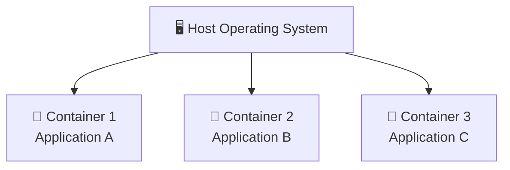

---

# 🔐 02 — LOGICAL ISOLATION

Containers need **logical isolation** so that one container cannot unnecessarily interfere with another container.

If proper isolation is not present:

* A hacker could enter a container.
* An attacker could affect other containers.
* Sensitive company information could be exposed.
* One container could interfere with another container.
* Unnecessary file sharing can create security problems.

### 🔒 Container File Isolation

```text
🐳 Container A
    │
    └── Application A
        └── Files

🐳 Container B
    │
    └── Application B
        └── Files

❌ Unnecessary file sharing
```

### 🔷 Mermaid — Container Isolation

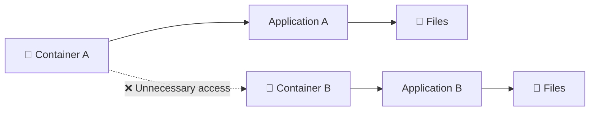

Containers should not unnecessarily share files and folders with each other.

---

# 📂 03 — FILES & FOLDERS INSIDE CONTAINERS

Containers contain the **files and directories required by the application**.

Some important Linux directories are:

| Directory | Purpose                                                  |
| --------- | -------------------------------------------------------- |
| `/bin`    | Contains binary executable files and commands            |
| `/sbin`   | Contains system administration executable files          |
| `/etc`    | Contains configuration files for various system services |
| `/lib`    | Contains library files                                   |
| `/usr`    | Contains user-related files, utilities and applications  |
| `/root`   | Home directory of the root user                          |

### 📁 Linux Directory Structure

```text
/
├── bin   → Binary executable files
├── sbin  → System administration binaries
├── etc   → Configuration files
├── lib   → Library files
├── usr   → User-related files and utilities
└── root  → Root user's home directory
```

### 🔷 Mermaid — Linux Directory Structure

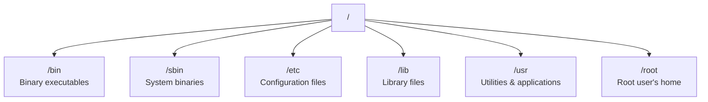

---

# ⚡ 04 — WHY ARE CONTAINERS LIGHTWEIGHT?

Containers are lightweight because they do not need to contain a complete operating system.

They share the **host operating system kernel**.

### 🖥️ Virtual Machine

```text
Physical Machine
       ↓
Host Operating System
       ↓
   Hypervisor
       ↓
Guest Operating System
       ↓
   Application
```

A Virtual Machine generally requires its own guest operating system.

### 🔷 Mermaid — Virtual Machine Architecture

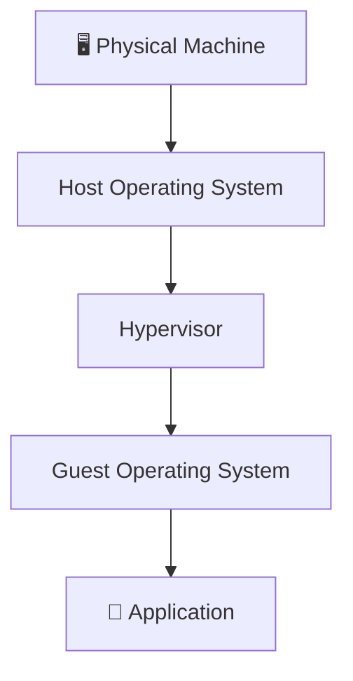

### 🐳 Container

```text
Physical Machine
       ↓
Host Operating System + Kernel
       ↓
   Docker Engine
       ↓
    Container
       ↓
Application + Dependencies
```

### 🔷 Mermaid — Container Architecture

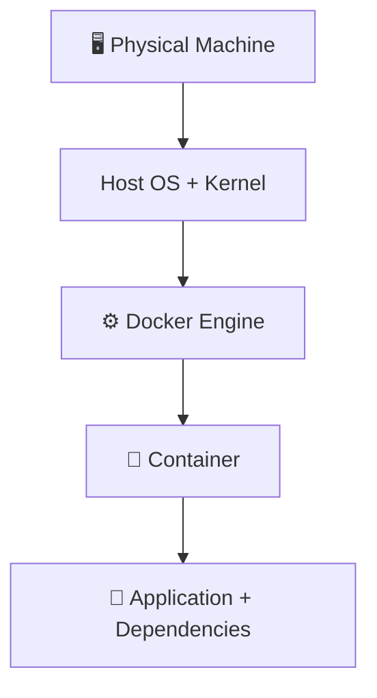

### 🚀 Advantages

* ⚡ Fast startup
* 🪶 Lightweight
* 💾 Less resource usage
* 📦 Portable
* 🚀 Easy deployment

---

# 🆚 05 — VIRTUAL MACHINE VS CONTAINER

| Virtual Machine        | Container                                    |
| ---------------------- | -------------------------------------------- |
| Requires a guest OS    | Shares host OS kernel                        |
| Heavier                | Lightweight                                  |
| Uses more resources    | Uses fewer resources                         |
| Slower startup         | Faster startup                               |
| Contains a complete OS | Contains application + required dependencies |
| Strong isolation       | Logical/process-level isolation              |

### 🧠 Main Idea

> A VM generally contains a complete guest OS, while a container shares the host OS kernel and packages the application with its required dependencies.

### 🔷 Mermaid — VM vs Container

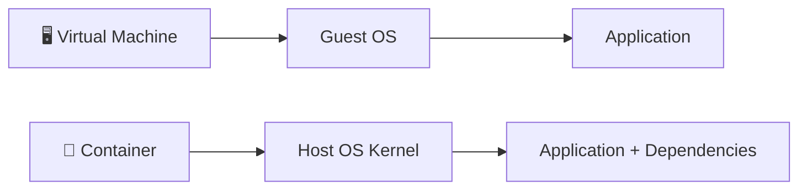

---

# 🐳 06 — DOCKER

**Docker** is a software platform/tool that helps us create, run and manage containers.

### Container vs Docker

```text
Container
    ↓
Concept / Technology

Docker
    ↓
Tool / Platform that implements the concept
```

### 🔷 Mermaid — Container & Docker

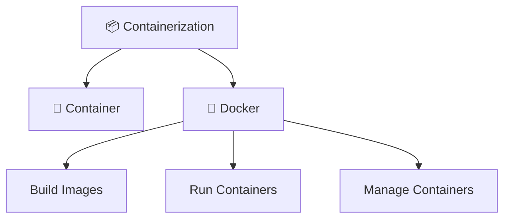

Docker helps us:

* Build images
* Run containers
* Stop containers
* Manage containers
* Push images
* Pull images
* Manage containerized applications

---

# 🖼️ 07 — DOCKER IMAGE

A **Docker Image** is a blueprint/template used to create containers.

A Docker image contains things such as:

* Application code
* Required dependencies
* Libraries
* Runtime
* Configuration
* Required files

### Basic Flow

```text
Docker Image
      ↓
  docker run
      ↓
   Container
```

### 🔷 Mermaid — Image to Container


### 🧠 Remember

```text
IMAGE
↓
Blueprint / Template

CONTAINER
↓
Running instance of an Image
```

One Docker image can be used to create multiple containers.

```text
🖼️ NGINX IMAGE
       │
   ┌───┼───┐
   ↓   ↓   ↓
  🐳  🐳  🐳
  C1  C2  C3
```

### 🔷 Mermaid — One Image, Multiple Containers

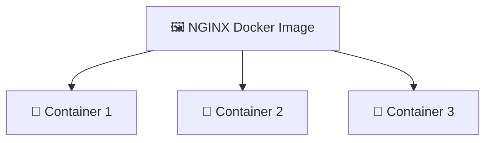

---

# 📄 08 — DOCKERFILE

A **Dockerfile** is a text file containing instructions used to build a Docker image.

### Example

```dockerfile
FROM ubuntu
RUN apt update
CMD ["echo", "Hello Docker"]
```

### Meaning

```text
FROM
↓
Specifies the base image

RUN
↓
Executes a command while building the image

CMD
↓
Specifies the default command when the container runs
```

### 🔷 Mermaid — Dockerfile Instructions

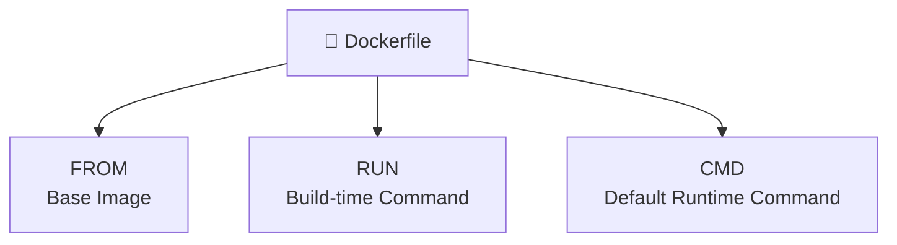

### Dockerfile Flow

```text
Dockerfile
     ↓
Instructions
     ↓
Docker Build
     ↓
Docker Image
     ↓
Docker Run
     ↓
Container
```

### 🔷 Mermaid — Dockerfile to Container

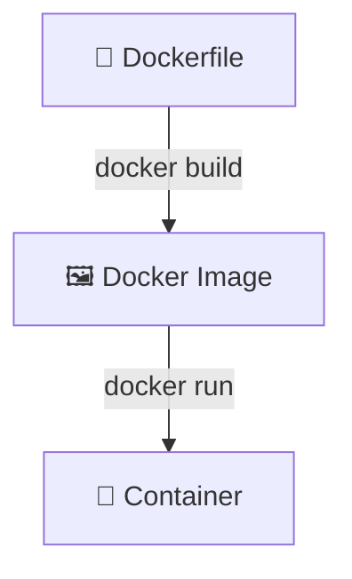

### 🧩 Important Idea

```text
Dockerfile
     ↓
Instructions for building
     ↓
Docker Image
     ↓
Running instance
     ↓
Container
```

---

# ⚙️ 09 — DOCKER ENGINE / DAEMON

The **Docker Engine / Docker Daemon** is the component that manages Docker resources and executes Docker operations.

It manages:

* 🖼️ Images
* 🐳 Containers
* 🌐 Networks
* 💾 Volumes

### Basic Flow

```text
👨‍💻 User
   ↓
Docker CLI
   ↓
Docker Daemon
   ↓
Docker Resources
├── 🖼️ Images
├── 🐳 Containers
├── 🌐 Networks
└── 💾 Volumes
```

### 🔷 Mermaid — Docker Engine Architecture

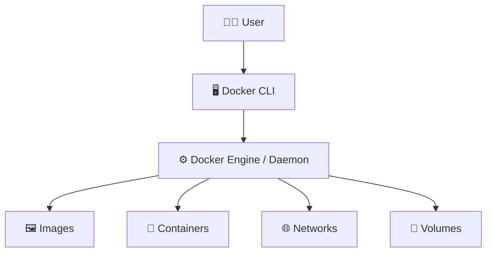

### 🧠 Remember

> **Docker Engine / Daemon → The component that manages Docker resources and executes Docker operations.**

---

# 🖥️ 10 — DOCKER CLI

The **Docker CLI** is the command-line interface used to interact with Docker.

### Example

```bash
docker run nginx
```

The command is sent to the Docker daemon, which performs the requested Docker operation.

### Flow

```text
User
  ↓
Docker CLI
  ↓
Docker Daemon
  ↓
Docker Resource
  ↓
Container / Image / Network / Volume
```

### 🔷 Mermaid — Docker CLI Flow

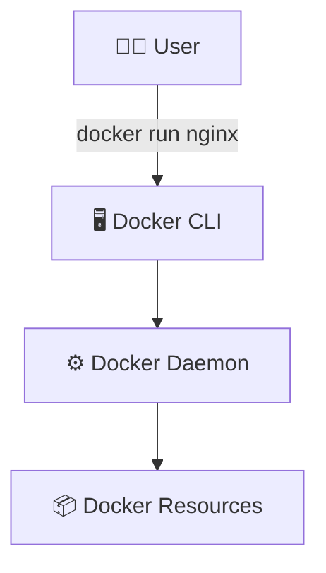

---

# 🗃️ 11 — DOCKER REGISTRY

A **Docker Registry** is a storage and distribution system for container images.

It is used to:

* Store Docker images
* Share Docker images
* Download Docker images
* Distribute Docker images

### Simple Idea

```text
Docker Registry
      ↓
Stores & Distributes
      ↓
  Docker Images
```

### 🔷 Mermaid — Docker Registry

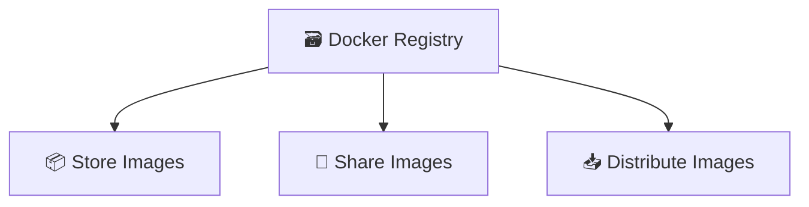

---

# 🌐 12 — DOCKER HUB

**Docker Hub** is a public registry used to store and share Docker images.

It allows developers to:

* Store images
* Share images
* Download images
* Publish images
* Use existing public images

### Docker Hub Flow

```text
👨‍💻 Developer
      ↓
Build Docker Image
      ↓
  📦 Docker Image
      ↓
  📤 docker push
      ↓
🌐 Docker Hub
      ↓
  📥 docker pull
      ↓
👨‍💻 Another Developer
      ↓
  🐳 Container
```

### 🔷 Mermaid — Docker Hub Workflow


### 🧠 Remember

> **Docker Hub → A public registry used to store and share Docker images.**

---

# 📥 13 — DOCKER PULL

`docker pull` is used to download a Docker image from a registry.

### Command

```bash
docker pull <image-name>
```

### Example

```bash
docker pull nginx
```

### Flow

```text
Docker Hub / Registry
        ↓
    docker pull
        ↓
    Docker Image
```

### 🔷 Mermaid — Docker Pull


---

# 📤 14 — DOCKER PUSH

`docker push` is used to upload a Docker image to a registry.

### Command

```bash
docker push <username>/<image-name>
```

### Flow

```text
Local Docker Image
        ↓
    docker push
        ↓
Docker Registry
```

### 🔷 Mermaid — Docker Push


---

# 🔄 15 — COMPLETE DOCKER FLOW

```text
👨‍💻 Developer
      ↓
📄 Dockerfile
      ↓
🖼️ Docker Image
      ↓
📤 docker push
      ↓
🌐 Docker Hub / Registry
      ↓
📥 docker pull
      ↓
🖼️ Docker Image
      ↓
🐳 Docker Container
      ↓
🚀 Application
```

### 🔷 Mermaid — Complete Docker Workflow

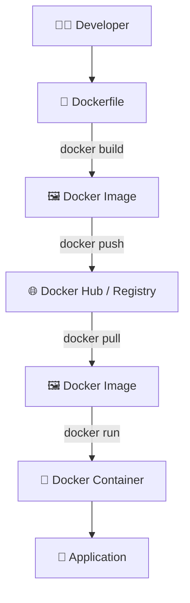

### Complete Concept

```text
Dockerfile
     ↓
   Build
     ↓
Docker Image
     ↓
   Push
     ↓
Docker Hub / Registry
     ↓
   Pull
     ↓
Docker Image
     ↓
    Run
     ↓
Docker Container
     ↓
 Application
```

---

# 🧠 16 — CONTAINER FILESYSTEM & DEPENDENCIES

A container contains the files, libraries and dependencies required by the application.

For example:

```text
Application
    +
Required Libraries
    +
Dependencies
    +
Runtime
    ↓
Docker Image
    ↓
Container
```

### 🔷 Mermaid — Application Packaging

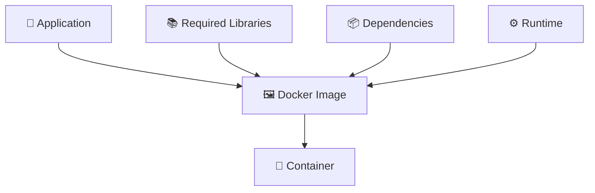

The container does not need a complete operating system like a Virtual Machine.

---

# 🛡️ 17 — CONTAINER SECURITY

Logical isolation is important because containers should not unnecessarily interfere with one another.

### Without proper isolation

```text
❌ Container A
      ↓
Can unnecessarily access
      ↓
Container B
```

This can lead to:

* Security risks
* Unwanted file access
* Exposure of sensitive information
* Application interference

### With isolation

```text
🐳 Container A       🐳 Container B
      │                    │
      ↓                    ↓
Application A          Application B
      │                    │
   Isolated             Isolated
```

### 🔷 Mermaid — Container Isolation

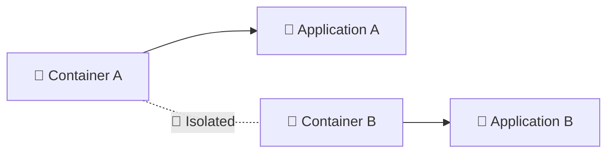

---

# 🔥 18 — INTERVIEW-READY SUMMARY

### 🐳 Docker

> Docker is a **containerization platform** used to build, run and manage containers.

### 📦 Container

> A container is a **lightweight isolated environment** used to run an application and its required dependencies.

### 🖼️ Docker Image

> A Docker image is a **blueprint/template** used to create containers.

### 📄 Dockerfile

> A Dockerfile is a **text file containing instructions used to build a Docker image**.

### ⚙️ Docker Engine / Daemon

> The component that **manages Docker resources and executes Docker operations**.

### 🖥️ Docker CLI

> The command-line interface used to interact with Docker.

### 🌐 Docker Hub

> A **public registry used to store and share Docker images**.

### 🗃️ Registry

> A **storage and distribution system for container images**.

### 📥 Docker Pull

> Downloads a Docker image from a registry.

### 📤 Docker Push

> Uploads a Docker image to a registry.

---

# 🎯 19 — WHY DO WE USE DOCKER?

Docker helps us:

* 📦 Package applications with dependencies
* 🚀 Deploy applications consistently
* ⚡ Start applications quickly
* 🪶 Reduce resource usage
* 🔐 Isolate applications
* 🔄 Maintain consistent environments
* 🌍 Share applications easily
* 📤 Push images to registries
* 📥 Pull images from registries
* 🐳 Run multiple isolated applications on the same host

### 🔷 Mermaid — Why Docker?

```mermaid
mindmap
  root((🐳 Docker))
    📦 Package Applications
    🚀 Consistent Deployment
    ⚡ Fast Startup
    🪶 Less Resource Usage
    🔐 Isolation
    🔄 Consistent Environments
    🌍 Easy Sharing
    📤 Push Images
    📥 Pull Images
    🐳 Run Containers
```

---

# 💡 20 — REAL-WORLD EXAMPLE

Suppose a developer creates a Python application.

### Without Docker

```text
Developer Machine
├── Python Version
├── Libraries
├── Dependencies
├── Configuration
└── Application
```

Another developer may have different versions and dependencies.

This can create:

```text
❌ "It works on my machine!"
```

### With Docker

```text
Python Application
       +
Python Runtime
       +
Dependencies
       +
Configuration
       ↓
   Dockerfile
       ↓
   Docker Image
       ↓
    Container
```

### 🔷 Mermaid — Python Application with Docker

```mermaid
flowchart TD
    APP["🐍 Python Application"]
    PY["⚙️ Python Runtime"]
    DEP["📦 Dependencies"]
    CONF["⚙️ Configuration"]

    APP --> DF["📄 Dockerfile"]
    PY --> DF
    DEP --> DF
    CONF --> DF

    DF --> IMG["🖼️ Docker Image"]
    IMG --> C["🐳 Container"]
    C --> RUN["🚀 Running Application"]
```

The same Docker image can be used across different environments.

---

# 🧩 21 — COMPLETE CONCEPT MAP

```text
🐳 DOCKER
     │
     ├───────────────┐
     ↓               ↓
Containerization   Docker Engine
     │               │
     ↓               ↓
📄 Dockerfile     Docker Daemon
     │               │
     ↓               │
🖼️ Docker Image ◄───┘
     │
     ├───────────────┐
     ↓               ↓
📤 docker push   📥 docker pull
     │               │
     └───────┬───────┘
             ↓
   🌐 Docker Hub / Registry
             │
             ↓
      🖼️ Docker Image
             │
             ↓
      🐳 Container
             │
             ↓
      🚀 Application
```

### 🔷 Mermaid — Complete Docker Concept Map

```mermaid
flowchart TD
    D["🐳 DOCKER"]

    D --> CONT["📦 Containerization"]
    D --> ENG["⚙️ Docker Engine"]

    CONT --> DF["📄 Dockerfile"]
    ENG --> DAEMON["⚙️ Docker Daemon"]

    DF --> IMG["🖼️ Docker Image"]
    DAEMON --> IMG

    IMG --> PUSH["📤 docker push"]
    IMG --> RUN["🚀 docker run"]

    PUSH --> REG["🌐 Docker Hub / Registry"]
    REG --> PULL["📥 docker pull"]
    PULL --> IMG2["🖼️ Docker Image"]

    IMG2 --> CONT2["🐳 Container"]
    RUN --> CONT2
    CONT2 --> APP["🚀 Application"]
```

---

# 📚 22 — MOST IMPORTANT DIFFERENCES

| Concept          | Meaning                                  |
| ---------------- | ---------------------------------------- |
| 🐳 Docker        | Tool/platform for containerization       |
| 📦 Container     | Running instance of an image             |
| 🖼️ Image        | Blueprint/template for containers        |
| 📄 Dockerfile    | Instructions used to build an image      |
| ⚙️ Docker Engine | Manages Docker resources and operations  |
| 🖥️ Docker CLI   | Command-line interface for Docker        |
| 🌐 Docker Hub    | Public registry for Docker images        |
| 🗃️ Registry     | Stores and distributes container images  |
| 📥 Pull          | Downloads an image                       |
| 📤 Push          | Uploads an image                         |
| 🚀 Run           | Creates/starts a container from an image |

---

# 🧠 23 — KEY TERMS TO REMEMBER

> 🐳 **Container** → Lightweight environment running an application.

> 🔐 **Isolation** → Keeps containers and their resources separated.

> 🖼️ **Image** → Blueprint for creating containers.

> 📄 **Dockerfile** → Instructions for building an image.

> ⚙️ **Docker Engine** → Runs and manages Docker operations.

> 🖥️ **Docker CLI** → Command-line interface used to interact with Docker.

> 🗃️ **Registry** → Stores and distributes images.

> 🌐 **Docker Hub** → Public Docker registry.

> 📥 **Pull** → Download an image.

> 📤 **Push** → Upload an image.

> 🚀 **Run** → Create/start a container from an image.

---

# 🚀 24 — DAY 11 KEY TAKEAWAYS

### What I Learned Today

* 🐳 What a container is
* 🔐 Why logical isolation is required
* 📂 Files and folders inside containers
* ⚡ Why containers are lightweight
* 🆚 Containers vs Virtual Machines
* 🐳 What Docker is
* 🖼️ What a Docker image is
* 📄 What a Dockerfile is
* ⚙️ Docker Engine / Docker Daemon
* 🖥️ Docker CLI
* 🗃️ Docker Registry
* 🌐 Docker Hub
* 📥 `docker pull`
* 📤 `docker push`
* 🔄 Complete Docker workflow
* 🛡️ Basic container isolation and security
* 🚀 Why Docker is useful in DevOps

---

<div align="center">

# 🐳 DAY 11 COMPLETE

## CONTAINERS → IMAGES → DOCKERFILE → ENGINE → REGISTRY → DOCKER HUB

### ☁️ DEVOPS CLOUD JOURNEY

**🚀 From Zero to DevOps Engineer**

</div>
