<div align="center">

# ☁️ DEVOPS CLOUD JOURNEY

## 🚀 DAY 06 → DAY 12

### **Git • GitHub • AWS • Ansible • Terraform • Docker**


### 🧑‍💻 From Version Control → Automation → Cloud → Containers

**Learn → Practice → Automate → Deploy → Containerize**

</div>

---

# 🗺️ MY DAY 06 → DAY 12 JOURNEY

```mermaid
flowchart LR
    D6["🌳 DAY 06<br/>Git + GitHub + SSH"]
    D7["🔀 DAY 07<br/>Advanced Git + AWS Deployment"]
    D8["🤖 DAY 08<br/>Ansible Configuration Management"]
    D9["⚙️ DAY 09<br/>Ansible Roles + Terraform + Operations"]
    D10["🐳 DAY 10<br/>Docker + Containerization"]
    D11["📦 DAY 11<br/>Containers + Images + Docker Hub"]
    D12["⚙️ DAY 12<br/>Docker CLI + Daemon + Permissions"]

    D6 --> D7 --> D8 --> D9 --> D10 --> D11 --> D12

    style D6 fill:#F05032,color:#fff
    style D7 fill:#FF9900,color:#fff
    style D8 fill:#EE0000,color:#fff
    style D9 fill:#844FBA,color:#fff
    style D10 fill:#2496ED,color:#fff
    style D11 fill:#2496ED,color:#fff
    style D12 fill:#2496ED,color:#fff
```

---

# 📚 WHAT I LEARNED FROM DAY 06 → DAY 12

During these seven days, I moved from **Git and GitHub fundamentals** into advanced Git workflows, SSH authentication, AWS EC2 application deployment, Ansible automation, Terraform basics, DevOps operations, and finally Docker containerization.

The learning gradually connected these technologies into a real DevOps workflow:

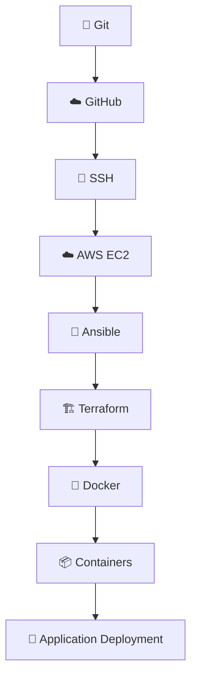

---

# 🌳 DAY 06 — GITHUB, GIT REMOTE, CLONE, FORK & SSH

> **Focus:** Connecting local Git repositories with GitHub, understanding remote repositories, cloning, forking, SSH authentication and GitFlow.

My Day 06 learning focused on how Git works with GitHub and how a local repository communicates with a remote repository. I also learned how an EC2 server can authenticate with GitHub using SSH.

---

## 📁 `.git` DIRECTORY

When I run:

```bash
git init
```

Git creates a hidden `.git` directory.

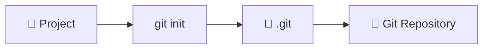

The `.git` directory contains information related to:

* 📝 Commits
* 🌿 Branches
* 📜 History
* ⚙️ Configuration
* 🔗 References

To see hidden files:

```bash
ls -a
```

---

## 🆕 CREATE A GIT REPOSITORY

```bash
mkdir gitdemo
cd gitdemo
pwd
git init
ls -la
```

---

## 📄 CREATE A FILE

I practiced creating a Shell script:

```bash
vim calculator.sh
```

Example:

```bash
#!/bin/bash
echo "Hello Git"
```

Save in Vim:

```text
ESC → :wq → ENTER
```

---

## ➕ STAGING FILES

```bash
git add calculator.sh
```

or:

```bash
git add .
```

---

## 📊 CHECK STATUS

```bash
git status
```

Git can show:

* Untracked files
* Modified files
* Changes to be committed

---

# 🌐 GIT REMOTE

A Git remote connects a local repository to a remote repository such as GitHub.

The common remote name is:

```text
origin
```

Add remote:

```bash
git remote add origin https://github.com/YOUR-USERNAME/gitdemo.git
```

Check remote:

```bash
git remote -v
```

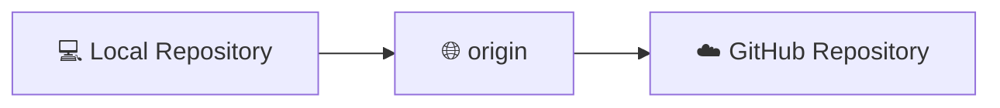

---

# 📤 GIT PUSH

```bash
git push -u origin main
```

### Remember

```text
git push
↓
Upload local commits
↓
GitHub
```

---

# 📥 GIT FETCH

```bash
git fetch
```

`git fetch` downloads information about changes from the remote repository without directly modifying the working files.

### PUSH vs FETCH

| Command     | Purpose                     |
| ----------- | --------------------------- |
| `git push`  | Upload local commits        |
| `git fetch` | Download remote information |

---

# 📦 GIT CLONE

```bash
git clone https://github.com/YOUR-USERNAME/gitdemo.git
```

Clone creates a complete local copy of an existing repository.

Using SSH:

```bash
git clone git@github.com:YOUR-USERNAME/gitdemo.git
```

---

# 🍴 GITHUB FORK

A GitHub Fork creates my own copy of another user's repository on GitHub.

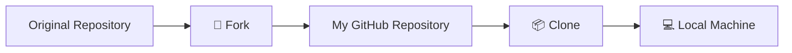

### Clone vs Fork

| Git Clone                    | GitHub Fork                       |
| ---------------------------- | --------------------------------- |
| Downloads repository locally | Creates repository copy on GitHub |
| Git command                  | GitHub feature                    |
| Local operation              | Remote GitHub operation           |
| `git clone`                  | Fork button                       |

---

# 🔐 SSH AUTHENTICATION

SSH allows secure communication between an EC2 server and GitHub.

SSH uses:

```text
🔐 Private Key → EC2
🔓 Public Key  → GitHub
```

> ⚠️ **Never share the private key.**

Generate a key:

```bash
ssh-keygen
```

Check keys:

```bash
ls -al ~/.ssh
```

Display public key:

```bash
cat ~/.ssh/id_ed25519.pub
```

Test GitHub authentication:

```bash
ssh -T git@github.com
```

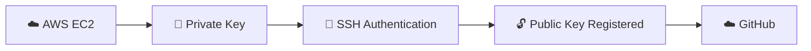

After successful SSH authentication, EC2 can communicate with GitHub for:

```text
📦 clone
📤 push
📥 fetch
⬇️ pull
```

---

# 🌿 GIT BRANCHING & GITFLOW

Branches allow developers to work independently without directly changing the main branch.

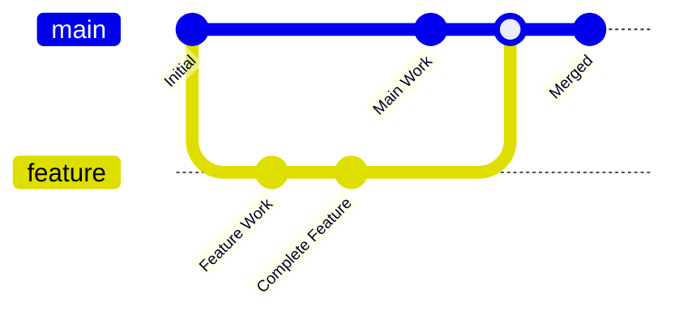

### Feature Branch

```text
main
 ↓
feature-login
 ↓
Development
 ↓
Testing
 ↓
Merge
 ↓
main
```

### Hotfix

```text
main
 ↓
🔥 hotfix
 ↓
Fix Critical Bug
 ↓
Test
 ↓
Merge
 ↓
main
 ↓
Production
```

### Day 06 Takeaway

```text
🌳 Git
 ↓
☁️ GitHub
 ↓
🔗 Remote
 ↓
📦 Clone
 ↓
🍴 Fork
 ↓
🔐 SSH
 ↓
🌿 GitFlow
```

---

# 🔀 DAY 07 — ADVANCED GIT & AWS APPLICATION DEPLOYMENT

> **Focus:** Advanced Git operations, branches, recovery, collaboration, Ansible introduction and Node.js deployment on AWS EC2.

Day 07 expanded Git into change management, history, recovery and collaboration. I also got introduced to Ansible and practiced the basic flow of deploying a Node.js application on AWS EC2.

---

# 🔍 GIT DIFF

```bash
git diff
```

Used to see changes made to files before committing.

---

# ↩️ GIT RESTORE

```bash
git restore <file>
```

Used to restore file changes.

Example:

```bash
git restore file.txt
```

---

# 🗑️ GIT RM

```bash
git rm <file>
```

Used to remove a tracked file.

---

# ♻️ GIT RESET

```bash
git reset
```

I learned that Git provides mechanisms to undo, unstage and move Git state depending on how reset is used.

---

# 📜 GIT HISTORY

```bash
git log
git log --oneline
```

Git history helps understand what happened to the project.

---

# ⚙️ GIT CONFIGURATION

```bash
git config --global user.name "Your Name"
git config --global user.email "your@email.com"
```

---

# 🌿 ADVANCED BRANCH WORKFLOW

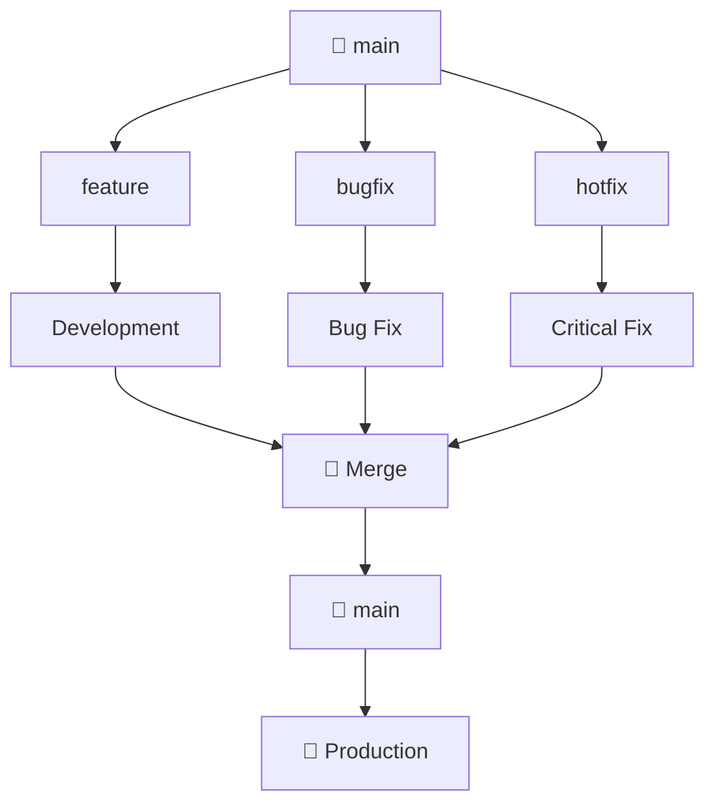

---

# 🤖 ANSIBLE INTRODUCTION

Ansible is a configuration-management and automation tool.

It can automate:

* Software installation
* Server configuration
* Package updates
* File management
* Application deployment
* Repetitive server tasks

---

# ☁️ AWS EC2 + NODE.JS DEPLOYMENT

I practiced the basic deployment flow of a Node.js application on an AWS EC2 instance.

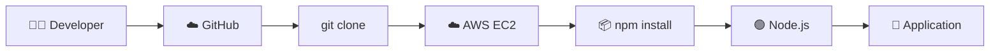

Clone application:

```bash
git clone <repository-url>
cd <project-folder>
```

Update packages:

```bash
sudo apt update
```

Install npm:

```bash
sudo apt install npm
```

Install dependencies:

```bash
npm install
```

Start application:

```bash
npm run start
```

---

# 🔐 EC2 ACCESS CONCEPTS

I also learned the importance of:

* ☁️ EC2
* 🔑 SSH
* 👤 IAM
* 🛡️ Permissions
* 🔐 Security
* 🌐 Application access

---

# 🧠 DAY 07 TAKEAWAY

```text
🌳 Advanced Git
 ↓
🌿 Branch Management
 ↓
🔍 Diff / Restore / Reset
 ↓
🌐 Remote Collaboration
 ↓
🤖 Ansible Introduction
 ↓
☁️ AWS EC2
 ↓
🟢 Node.js
 ↓
🚀 Application Deployment
```

---

# 🤖 DAY 08 — ANSIBLE & CONFIGURATION MANAGEMENT

> **Focus:** Automating infrastructure, managing servers, Playbooks, Inventory, SSH and scaling configuration operations.

Day 08 focused on understanding why Configuration Management is required and how Ansible can automate server administration.

---

# ⚙️ CONFIGURATION MANAGEMENT

Configuration Management is the process of automatically managing server and infrastructure configuration.

Without automation:

```text
SSH → Server 1 → Configure
SSH → Server 2 → Configure
SSH → Server 3 → Configure
...
SSH → Server 500 → Configure
```

Problems:

* ⏳ Time-consuming
* 👤 Human errors
* 🔁 Repetitive work
* 📈 Difficult to scale
* 🐛 Configuration differences

With Ansible:

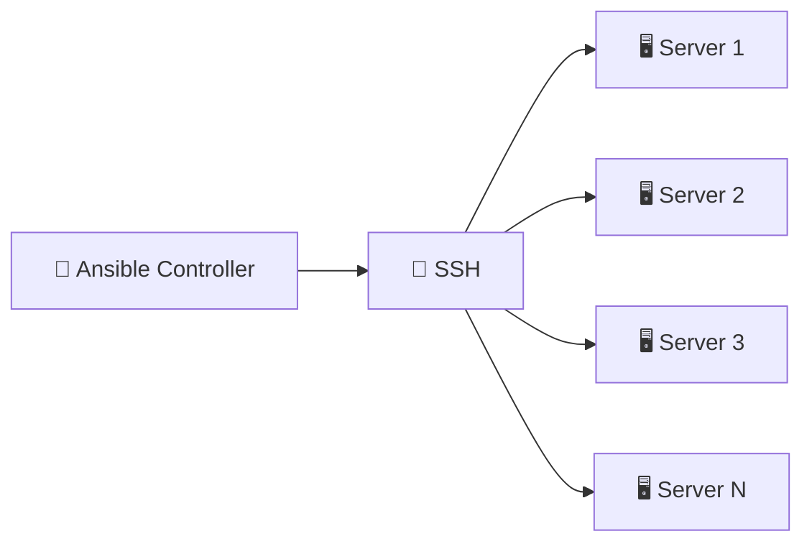

---

# 🤖 WHAT IS ANSIBLE?

> **Ansible allows us to automate the configuration and management of multiple servers from one controller.**

Ansible can automate:

```text
📦 Software Installation
🔄 Updates
⚙️ Configuration
📁 Files
🚀 Deployment
🖥️ Administration
🔐 Remote Execution
🔁 Repetitive Tasks
```

---

# 🏗️ ANSIBLE ARCHITECTURE

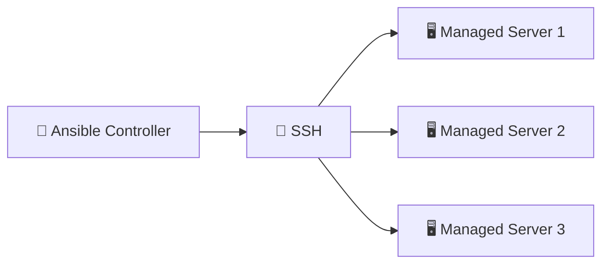

Ansible commonly uses an **agentless approach** for Linux/Unix management through SSH.

---

# ⚔️ MASTER-AGENT VS AGENTLESS

| Feature       | Master-Agent    | Ansible                                      |
| ------------- | --------------- | -------------------------------------------- |
| Architecture  | Master + Agents | Controller + Remote Connection               |
| Agent         | Required        | Not required for common SSH Linux management |
| Communication | Master ↔ Agents | Controller → SSH → Servers                   |
| Setup         | More components | Simpler                                      |
| Automation    | Yes             | Yes                                          |

---

# 📤 PUSH VS 📥 PULL

### Push

```text
Controller
    ↓
Servers
```

The controller pushes configuration/tasks to managed systems.

### Pull

```text
Servers
    ↓
Central Configuration Source
```

Managed systems obtain their configuration from a central source.

---

# 📋 ANSIBLE PLAYBOOK

A Playbook defines **what Ansible should do**.

Playbooks use YAML.

```yaml
- name: Install Git
  hosts: all

  tasks:
    - name: Install Git
      package:
        name: git
        state: present
```

### Remember

```text
📋 PLAYBOOK
↓
WHAT should be done?
```

---

# 🗂️ ANSIBLE INVENTORY

Inventory defines **where tasks should run**.

Example:

```ini
[webservers]
server1
server2
server3
```

or:

```ini
[webservers]
192.168.1.10
192.168.1.11
192.168.1.12
```

### Remember

```text
🗂️ INVENTORY
↓
WHERE should it be done?
```

---

# 🔄 DYNAMIC INVENTORY

Cloud infrastructure can change dynamically.

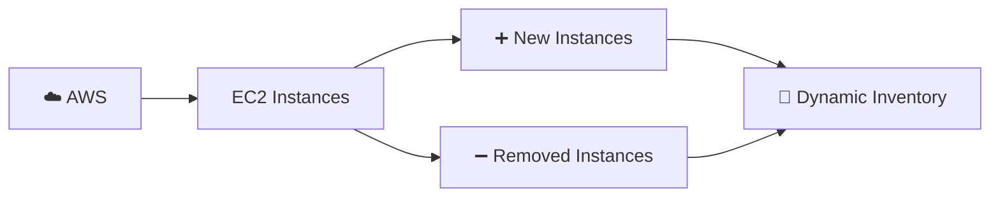

---

# 🔐 SSH AUTHENTICATION

Ansible commonly connects to Linux servers using SSH.

```text
🤖 Ansible Controller
        ↓
      🔐 SSH
        ↓
🖥️ Linux Server
```

SSH key concept:

```text
Client
 ├── 🔐 Private Key
 └── 🔓 Public Key

Server
 └── 🔓 Authorized Public Key
```

> 🔐 The private key must be kept secure.

---

# 🐍 ANSIBLE & PYTHON

Ansible is built using Python and has a Python-based ecosystem.

---

# 🏆 DAY 08 — THE 3 THINGS I REMEMBER

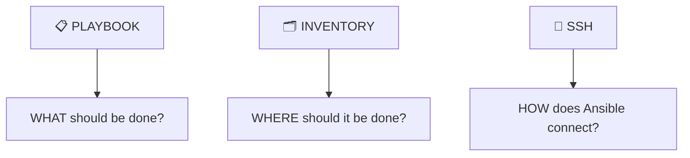

Together:

```text
📋 Playbook
+
🗂️ Inventory
+
🔐 SSH
=
🤖 Automated Server Management
```

---

# ⚙️ DAY 09 — ANSIBLE ROLES, TERRAFORM & DEVOPS OPERATIONS

> **Focus:** Reusable Ansible automation, roles, tasks, handlers, variables, templates, Terraform, incident management, change management and DevOps operations.

Day 09 moved from basic Ansible automation toward **structured and reusable automation**. The main concepts included Playbooks, Roles, Tasks, Handlers, Variables, Templates, Inventory, Terraform, Incident Management, Change Management, JIRA, ServiceNow, Containerization, Docker and Linux permissions.

---

# 📋 ANSIBLE PLAYBOOK

A Playbook defines what Ansible should do on target machines.

```yaml
- hosts: webservers
  roles:
    - nginx
```

---

# 🧩 ANSIBLE ROLE

A Role organizes automation into reusable components.

```text
Ansible Project
│
├── site.yml
│
└── roles/
    └── nginx/
        ├── tasks/
        ├── handlers/
        ├── vars/
        ├── defaults/
        ├── templates/
        ├── files/
        └── meta/
```

Roles make automation:

* ♻️ Reusable
* 🧹 Organized
* 📦 Modular
* 📖 Easier to understand
* 🔧 Easier to maintain
* 🚀 Easier to scale

---

# ⚙️ TASKS

Tasks contain the actual work Ansible performs.

Example:

```yaml
- name: Install Nginx
  package:
    name: nginx
    state: present

- name: Start Nginx
  service:
    name: nginx
    state: started
```

```text
TASK
↓
What work should be performed?
```

---

# 🔔 HANDLERS

Handlers are tasks triggered when something changes.

Example:

```yaml
- name: Update nginx configuration
  template:
    src: nginx.conf.j2
    dest: /etc/nginx/nginx.conf
  notify: Restart nginx
```

Handler:

```yaml
- name: Restart nginx
  service:
    name: nginx
    state: restarted
```

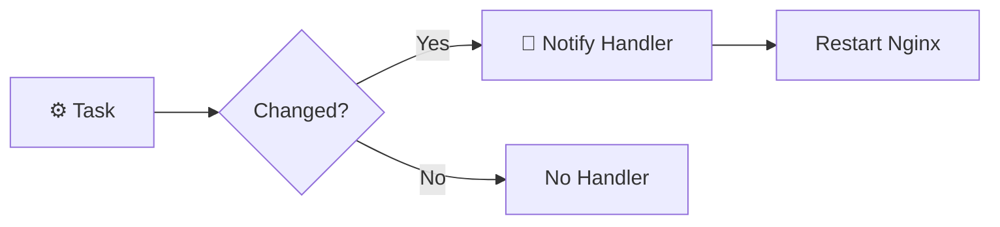

---

# 📦 VARIABLES

Variables store reusable values.

Example:

```yaml
nginx_port: 80
```

Variables can be used inside automation to make it flexible.

```yaml
- name: Install package
  package:
    name: "{{ package_name }}"
    state: present
```

---

# 📝 TEMPLATES

Ansible commonly uses Jinja2 templates to dynamically generate configuration files.

Example:

```text
nginx.conf.j2
```

```nginx
server {
    listen {{ nginx_port }};
}
```

---

# 📁 FILES

The `files/` directory stores static files that Ansible can copy to managed servers.

Example:

```text
roles/
└── nginx/
    └── files/
        └── index.html
```

---

# 🧠 ROLE VS PLAYBOOK

| Concept       | Purpose                         |
| ------------- | ------------------------------- |
| 📋 Playbook   | Defines automation flow         |
| 🧩 Role       | Organizes reusable automation   |
| ⚙️ Task       | Performs an action              |
| 🔔 Handler    | Runs when notified              |
| 📦 Variable   | Stores reusable values          |
| 📝 Template   | Generates dynamic configuration |
| 📁 Files      | Stores static files             |
| 🗂️ Inventory | Defines managed hosts           |

---

# 🏗️ TERRAFORM BASICS

Terraform was introduced as an **Infrastructure as Code (IaC)** tool.

It is used to define and manage infrastructure using configuration files.

### Commands

```bash
terraform init
terraform validate
terraform plan
terraform apply
terraform destroy
```

### Terraform Workflow

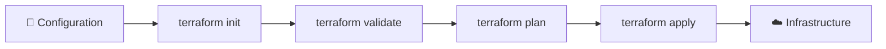

---

# 🚨 INCIDENT MANAGEMENT

Incident Management handles unexpected problems affecting services.

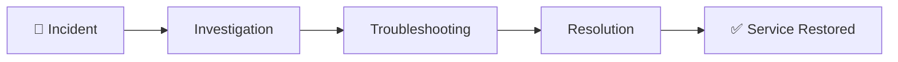

Example:

```text
🚨 Production Server Down
↓
Incident Created
↓
Investigation
↓
Troubleshooting
↓
Resolution
↓
Service Restored
```

---

# 🔄 CHANGE MANAGEMENT

Change Management handles planned changes safely.

```text
Plan
 ↓
Review
 ↓
Approval
 ↓
Implementation
 ↓
Verification
```

### Incident vs Change

| Incident Management | Change Management                    |
| ------------------- | ------------------------------------ |
| 🚨 Unexpected issue | 🔄 Planned change                    |
| Server Down         | Server Upgrade                       |
| Restore service     | Make change safely                   |
| Troubleshooting     | Planning + approval + implementation |

---

# 🎫 JIRA

JIRA was introduced as a tool used by software development teams for:

* 📋 Projects
* 📝 Tasks
* 🐛 Issues
* 🔄 Work
* 👥 Team activities

---

# 🛠️ SERVICENOW

ServiceNow was introduced in the context of IT operations and service management.

It can manage:

* 🚨 Incidents
* 🔄 Changes
* 📋 Requests
* 🛠️ IT Operations

### JIRA vs ServiceNow

| Tool           | Main Context                                           |
| -------------- | ------------------------------------------------------ |
| 🎫 JIRA        | Software development, projects, tasks and issues       |
| 🛠️ ServiceNow | IT service management, incidents, changes and requests |

---

# 🔐 ROOT & SUDO

### Root

`root` is the Linux superuser with extensive system privileges.

```text
👤 Normal User
 ↓
Limited Permissions

👑 root
 ↓
Administrative Permissions
```

### sudo

```bash
sudo command
```

Allows an authorized user to execute commands with elevated privileges.

---

# 🐳 DOCKER PERMISSIONS

Docker may require appropriate permissions.

Example:

```bash
sudo docker ps
```

A user can also be added to the Docker group:

```bash
sudo usermod -aG docker $USER
newgrp docker
docker ps
```

> ⚠️ Docker group access grants powerful privileges and must be handled carefully.

---

# 🧠 DAY 09 FLOW

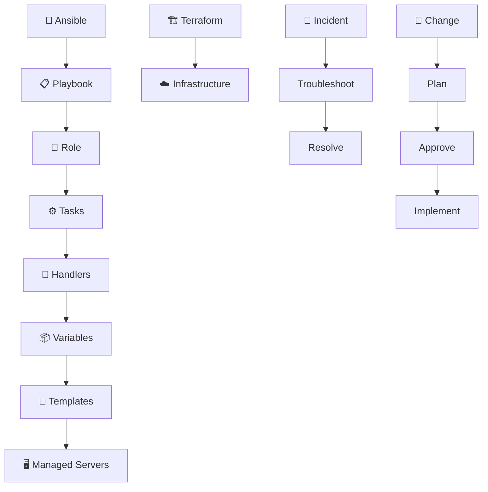

---

# 🐳 DAY 10 — DOCKER & CONTAINERIZATION

> **Focus:** Understanding containerization, Docker, Dockerfiles, images, containers, Docker Engine, registries, OCI, Buildah and Podman.

---

# 📦 CONTAINERIZATION

Containerization packages an application together with its required:

* Application code
* Dependencies
* Libraries
* Configuration
* Runtime requirements

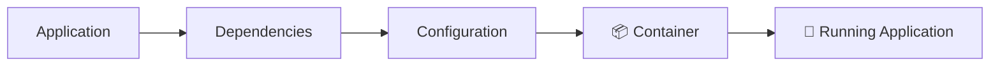

### Key Idea

> **Build once → Package once → Run consistently.**

---

# 🐳 WHAT IS DOCKER?

Docker is a platform used to build, package, distribute and run applications inside containers.

```text
Application
+
Runtime
+
Libraries
+
Dependencies
+
Configuration
↓
📦 Container
```

---

# 📄 DOCKERFILE

A Dockerfile contains instructions used to build a Docker image.

Example:

```dockerfile
FROM ubuntu

RUN apt update

CMD ["echo", "Hello Docker"]
```

Important instructions:

| Instruction | Purpose                                       |
| ----------- | --------------------------------------------- |
| `FROM`      | Specifies base image                          |
| `RUN`       | Executes command during image build           |
| `CMD`       | Specifies default command when container runs |

---

# 🖼️ DOCKER IMAGE

A Docker Image is a packaged, read-only template used to create containers.

It can contain:

* Application code
* Dependencies
* Libraries
* Runtime
* Configuration
* Required files

```text
🖼️ IMAGE
↓
Blueprint / Template

📦 CONTAINER
↓
Running instance of Image
```

---

# 🐳 DOCKER CONTAINER

A container is a lightweight environment used to run an application and its required dependencies.

Containers:

* Are lightweight
* Do not contain a full OS
* Share the host OS kernel
* Provide logical isolation
* Can run multiple applications on the same host

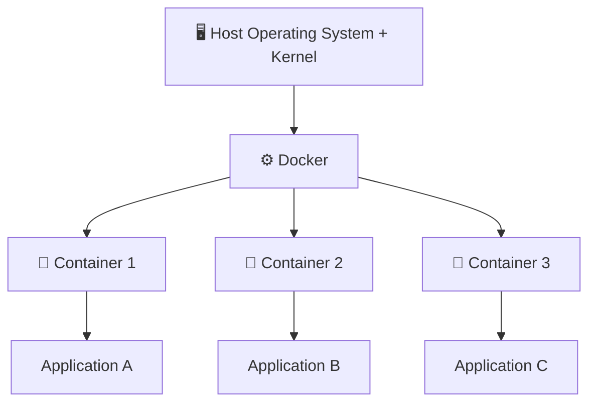

---

# 🆚 VM VS CONTAINER

| Virtual Machine     | Container                       |
| ------------------- | ------------------------------- |
| Requires guest OS   | Shares host OS kernel           |
| Heavier             | Lightweight                     |
| More resource usage | Less resource usage             |
| Slower startup      | Faster startup                  |
| Complete OS         | Application + dependencies      |
| Strong isolation    | Logical/process-level isolation |

### Main Idea

> A VM generally contains a complete guest OS, while a container shares the host OS kernel and packages the application with its required dependencies.

---

# ⚙️ DOCKER ENGINE

Docker Engine / Docker Daemon manages Docker resources and executes Docker operations.

It manages:

* 🖼️ Images
* 📦 Containers
* 🌐 Networks
* 💾 Volumes

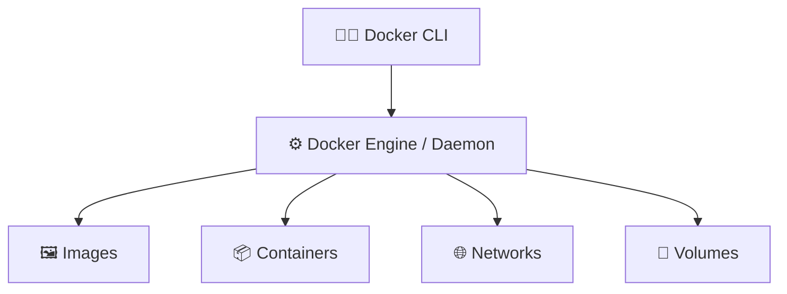

---

# 🏗️ DOCKER WORKFLOW

```mermaid
flowchart LR
    A["📄 Dockerfile"] --> B["🔨 docker build"]
    B --> C["🖼️ Docker Image"]
    C --> D["▶️ docker run"]
    D --> E["📦 Docker Container"]
    E --> F["🚀 Application"]
```

---

# 🏛️ OCI

OCI stands for **Open Container Initiative**.

OCI provides standards for container images and container runtimes.

---

# 🛠️ DOCKER VS BUILDAH VS PODMAN

| Tool       | Main Purpose                         |
| ---------- | ------------------------------------ |
| 🐳 Docker  | Build images + run/manage containers |
| 🔨 Buildah | Build container images               |
| 🦭 Podman  | Run/manage containers                |

---

# 🌐 DOCKER REGISTRY

A Docker Registry stores and distributes container images.

```mermaid
flowchart LR
    A["👨‍💻 Developer"] --> B["🖼️ Build Image"]
    B --> C["📤 Push"]
    C --> D["🌐 Registry"]
    D --> E["📥 Pull"]
    E --> F["🖼️ Image"]
    F --> G["🐳 Container"]
```

---

# 🐳 DAY 10 TAKEAWAY

```text
📦 Containerization
 ↓
🐳 Docker
 ↓
📄 Dockerfile
 ↓
🔨 Build
 ↓
🖼️ Image
 ↓
▶️ Run
 ↓
📦 Container
 ↓
🚀 Application
```

---

# 📦 DAY 11 — DOCKER CONTAINERS, IMAGES & DOCKER HUB

> **Focus:** Containers, logical isolation, Linux filesystem inside containers, VM vs container, Docker images, Dockerfile, Docker Engine, Docker CLI, Registry and Docker Hub.

Day 11 went deeper into what actually exists inside containers, why containers are lightweight, how images create containers and how images move through registries.

---

# 🔐 LOGICAL ISOLATION

Containers need logical isolation so one container does not unnecessarily interfere with another.

```mermaid
flowchart LR
    A["🐳 Container A"] --> B["Application A"]
    C["🐳 Container B"] --> D["Application B"]

    B -. "🚫 Unnecessary Access" .- D
```

Proper isolation helps reduce:

* Security risks
* Unwanted file access
* Exposure of sensitive information
* Application interference

---

# 📂 FILESYSTEM INSIDE CONTAINERS

Important Linux directories include:

| Directory | Purpose                        |
| --------- | ------------------------------ |
| `/bin`    | Binary executable files        |
| `/sbin`   | System administration binaries |
| `/etc`    | Configuration files            |
| `/lib`    | Libraries                      |
| `/usr`    | Utilities and applications     |
| `/root`   | Root user's home directory     |

---

# ⚡ WHY ARE CONTAINERS LIGHTWEIGHT?

Containers share the host operating system kernel rather than requiring a complete guest OS.

```mermaid
flowchart TB
    A["Physical Machine"] --> B["Host OS + Kernel"]
    B --> C["Docker Engine"]
    C --> D["Container"]
    D --> E["Application + Dependencies"]
```

Advantages:

* ⚡ Fast startup
* 🪶 Lightweight
* 💾 Less resource usage
* 📦 Portable
* 🚀 Easy deployment

---

# 🖼️ ONE IMAGE → MULTIPLE CONTAINERS

```mermaid
flowchart TB
    A["🖼️ NGINX Image"] --> B["🐳 Container 1"]
    A --> C["🐳 Container 2"]
    A --> D["🐳 Container 3"]
```

One Docker image can be used to create multiple containers.

---

# 📄 DOCKERFILE → IMAGE → CONTAINER

```text
📄 Dockerfile
 ↓
🔨 docker build
 ↓
🖼️ Docker Image
 ↓
▶️ docker run
 ↓
📦 Docker Container
 ↓
🚀 Application
```

---

# 🌐 DOCKER HUB

Docker Hub is a public registry used to store and share Docker images.

```mermaid
flowchart LR
    A["👨‍💻 Developer"] --> B["🖼️ Build Image"]
    B --> C["📤 docker push"]
    C --> D["🌐 Docker Hub"]
    D --> E["📥 docker pull"]
    E --> F["👨‍💻 Another Developer"]
    F --> G["🐳 Container"]
```

---

# 📥 DOCKER PULL

```bash
docker pull <image-name>
```

Example:

```bash
docker pull nginx
```

Used to download an image from a registry.

---

# 📤 DOCKER PUSH

```bash
docker push <username>/<image-name>
```

Used to upload a local image to a registry.

---

# 🧠 DAY 11 KEY CONCEPTS

| Concept          | Meaning                                        |
| ---------------- | ---------------------------------------------- |
| 🐳 Container     | Lightweight environment running an application |
| 🔐 Isolation     | Keeps container resources separated            |
| 🖼️ Image        | Blueprint for containers                       |
| 📄 Dockerfile    | Instructions for building an image             |
| ⚙️ Docker Engine | Manages Docker operations                      |
| 🖥️ Docker CLI   | Interface used to interact with Docker         |
| 🗃️ Registry     | Stores/distributes images                      |
| 🌐 Docker Hub    | Public Docker registry                         |
| 📥 Pull          | Download image                                 |
| 📤 Push          | Upload image                                   |
| 🚀 Run           | Create/start container                         |

These definitions and the Day 11 workflow are directly reflected in the learning notes.

---

# 🔄 COMPLETE DAY 11 WORKFLOW

```mermaid
flowchart LR
    A["👨‍💻 Developer"] --> B["📄 Dockerfile"]
    B --> C["🔨 Build"]
    C --> D["🖼️ Docker Image"]
    D --> E["📤 Push"]
    E --> F["🌐 Docker Hub"]
    F --> G["📥 Pull"]
    G --> H["🖼️ Docker Image"]
    H --> I["▶️ Run"]
    I --> J["📦 Container"]
    J --> K["🚀 Application"]
```

---

# ⚙️ DAY 12 — DOCKER CLI, DAEMON & PERMISSIONS

> **Focus:** Docker CLI, Docker Daemon, Docker resources, permissions, Docker group, images, containers, networks, volumes and the complete Docker workflow.

Day 12 focused on understanding what happens when a Docker command is executed and how the Docker CLI communicates with the Docker Daemon.

---

# 🖥️ DOCKER CLI

Docker CLI is the command-line interface used by users and DevOps engineers to communicate with Docker.

Examples:

```bash
docker --version
docker ps
docker ps -a
docker images
docker pull ubuntu
docker run ubuntu
docker start <container_id>
docker stop <container_id>
docker rm <container_id>
docker rmi <image_id>
docker network ls
docker volume ls
```

---

# ⚙️ DOCKER DAEMON

The Docker Daemon is the background service responsible for managing Docker resources and executing Docker operations.

It is commonly represented as:

```text
dockerd
```

Responsibilities:

* Creates containers
* Starts containers
* Stops containers
* Removes containers
* Builds images
* Pulls images
* Manages networks
* Manages volumes
* Communicates with registries

---

# 🔗 DOCKER CLI → DOCKER DAEMON

```mermaid
flowchart LR
    A["👤 User"] --> B["💻 Docker CLI"]
    B --> C["⚙️ Docker Daemon"]

    C --> D["🖼️ Images"]
    C --> E["📦 Containers"]
    C --> F["🌐 Networks"]
    C --> G["💾 Volumes"]
```

### Example

When I run:

```bash
docker run ubuntu
```

the flow is:

```text
User
 ↓
Docker CLI
 ↓
Docker Daemon
 ↓
Check Image
 ↓
Create Container
 ↓
Start Container
```

---

# 🧩 DOCKER RESOURCES

The Docker Daemon manages:

```mermaid
flowchart TB
    A["🐳 Docker Daemon"]
    A --> B["🖼️ Images"]
    A --> C["📦 Containers"]
    A --> D["🌐 Networks"]
    A --> E["💾 Volumes"]
```

---

# 🖼️ DOCKER IMAGES

```bash
docker images
```

Displays images available locally.

---

# 📦 DOCKER CONTAINERS

```bash
docker ps
```

Shows running containers.

```bash
docker ps -a
```

Shows all containers, including stopped containers.

| Command        | Purpose            |
| -------------- | ------------------ |
| `docker ps`    | Running containers |
| `docker ps -a` | All containers     |

---

# 🌐 DOCKER NETWORKS

```bash
docker network ls
```

Docker networks allow containers to communicate with other containers, the host and external networks.

---

# 💾 DOCKER VOLUMES

```bash
docker volume ls
```

Volumes are used for persistent storage.

They allow data to exist independently from the container lifecycle.

---

# 🔐 DOCKER PERMISSIONS

Sometimes Docker commands fail because the current user does not have permission to communicate with the Docker Daemon.

Example:

```bash
docker ps
```

Possible flow:

```text
👤 User
 ↓
docker ps
 ↓
⚙️ Docker Daemon
 ↓
❌ Permission Denied
```

---

# 🔑 USING SUDO

A temporary approach is:

```bash
sudo docker ps
sudo docker images
sudo docker run ubuntu
sudo docker pull ubuntu
```

---

# 👥 DOCKER GROUP

Instead of using `sudo` every time:

```bash
sudo usermod -aG docker $USER
```

Apply the group change:

```bash
newgrp docker
```

Test:

```bash
docker ps
```

```mermaid
flowchart LR
    A["👤 User"] --> B["docker ps"]
    B --> C["👥 docker Group"]
    C --> D["⚙️ Docker Daemon"]
    D --> E["✅ Docker Operation"]
```

> ⚠️ Membership in the Docker group grants powerful access to the Docker Daemon and should be treated as privileged access.

---

# 📥 DOCKER PULL

```bash
docker pull ubuntu
```

Flow:

```mermaid
flowchart LR
    A["💻 Docker CLI"] --> B["⚙️ Docker Daemon"]
    B --> C["📦 Docker Registry"]
    C --> D["🖼️ Ubuntu Image"]
    D --> E["💻 Local Docker Host"]
```

---

# ▶️ DOCKER RUN

```bash
docker run ubuntu
```

Basic flow:

```mermaid
flowchart TB
    A["docker run ubuntu"] --> B["Docker CLI"]
    B --> C["Docker Daemon"]
    C --> D{"Ubuntu Image Exists?"}
    D -->|Yes| E["Create Container"]
    D -->|No| F["Pull Image"]
    F --> E
    E --> G["Start Container"]
```

---

# 🛑 DOCKER STOP

```bash
docker stop <container_id>
```

Stops a running container.

---

# ▶️ DOCKER START

```bash
docker start <container_id>
```

Starts an existing stopped container.

---

# 🗑️ DOCKER RM

```bash
docker rm <container_id>
```

Removes a container.

---

# 🗑️ DOCKER RMI

```bash
docker rmi <image_id>
```

Removes a Docker image.

---

# 🏗️ DOCKER BUILD

```bash
docker build -t my-first-image .
```

Used to create a Docker image from a Dockerfile.

```mermaid
flowchart LR
    A["📄 Dockerfile"] --> B["docker build"]
    B --> C["⚙️ Docker Daemon"]
    C --> D["🖼️ Docker Image"]
```

---

# 🧠 DAY 12 DOCKER COMMAND CHEAT SHEET

```bash
# Check Docker version
docker --version

# Show running containers
docker ps

# Show all containers
docker ps -a

# Show images
docker images

# Pull an image
docker pull ubuntu

# Run a container
docker run ubuntu

# Start a container
docker start <container_id>

# Stop a container
docker stop <container_id>

# Remove a container
docker rm <container_id>

# Remove an image
docker rmi <image_id>

# List networks
docker network ls

# List volumes
docker volume ls

# Build an image
docker build -t my-image .

# Run Docker command with sudo
sudo docker ps

# Add current user to Docker group
sudo usermod -aG docker $USER

# Apply Docker group
newgrp docker
```

These are the core commands captured in the Day 12 notes.

---

# 🧠 COMPLETE DAY 12 ARCHITECTURE

```mermaid
flowchart TB
    U["👤 USER"]
    U --> CLI["💻 DOCKER CLI"]
    CLI --> DAEMON["⚙️ DOCKER DAEMON"]

    DAEMON --> IMG["🖼️ IMAGES"]
    DAEMON --> CON["📦 CONTAINERS"]
    DAEMON --> NET["🌐 NETWORKS"]
    DAEMON --> VOL["💾 VOLUMES"]

    IMG --> CON
    NET --> CON
    VOL --> CON
```

---

# 🔥 COMPLETE DAY 06 → DAY 12 DEVOPS ARCHITECTURE

```mermaid
flowchart TB

    DEV["👨‍💻 DEVELOPER"]

    DEV --> GIT["🌳 GIT"]
    GIT --> GH["☁️ GITHUB"]

    GH --> SSH["🔐 SSH"]
    SSH --> EC2["☁️ AWS EC2"]

    EC2 --> NODE["🟢 NODE.JS APPLICATION"]

    EC2 --> ANS["🤖 ANSIBLE"]
    ANS --> PLAY["📋 PLAYBOOK"]
    PLAY --> ROLE["🧩 ROLES"]
    ROLE --> TASK["⚙️ TASKS"]
    TASK --> SERVER["🖥️ MANAGED SERVERS"]

    TF["🏗️ TERRAFORM"] --> INFRA["☁️ INFRASTRUCTURE"]

    DEV --> DOCKERFILE["📄 DOCKERFILE"]
    DOCKERFILE --> IMAGE["🖼️ DOCKER IMAGE"]
    IMAGE --> REG["🌐 DOCKER HUB / REGISTRY"]
    REG --> PULL["📥 PULL"]
    PULL --> CONTAINER["📦 CONTAINER"]

    CONTAINER --> APP["🚀 APPLICATION"]

    ANS --> DOCKER["🐳 DOCKER"]
    DOCKER --> CONTAINER
```

---

# 🧩 HOW EVERYTHING CONNECTS

```text
                    ☁️ DEVOPS CLOUD JOURNEY
                              │
        ┌─────────────────────┼─────────────────────┐
        ↓                     ↓                     ↓
     🌳 GIT               🤖 ANSIBLE           🏗️ TERRAFORM
        │                     │                     │
        ↓                     ↓                     ↓
    ☁️ GITHUB             📋 PLAYBOOK          ☁️ INFRASTRUCTURE
        │                     │
        ↓                     ↓
     🔐 SSH                🧩 ROLES
        │                     │
        ↓                     ↓
    ☁️ AWS EC2            ⚙️ TASKS
        │
        ↓
   🟢 APPLICATION
        │
        ↓
   🐳 DOCKER
        │
        ↓
   📄 DOCKERFILE
        │
        ↓
   🖼️ IMAGE
        │
        ↓
   🌐 REGISTRY
        │
        ↓
   📦 CONTAINER
        │
        ↓
   🚀 APPLICATION
```

---

# 📊 DAY 06 → DAY 12 SKILLS MATRIX

| Day       | Major Learning      | Key Skills                                                                  |
| --------- | ------------------- | --------------------------------------------------------------------------- |
| 🟠 Day 06 | Git + GitHub        | Remote, Clone, Fork, SSH, GitFlow                                           |
| 🟡 Day 07 | Advanced Git + AWS  | Diff, Restore, Reset, Branches, EC2, Node.js                                |
| 🔴 Day 08 | Ansible             | Configuration Management, Playbooks, Inventory, SSH                         |
| 🟣 Day 09 | DevOps Operations   | Roles, Tasks, Handlers, Variables, Templates, Terraform, Incidents, Changes |
| 🔵 Day 10 | Docker Fundamentals | Containerization, Dockerfile, Image, Container, OCI                         |
| 🔵 Day 11 | Docker Deep Dive    | Isolation, VM vs Container, Registry, Docker Hub, Push, Pull                |
| 🔵 Day 12 | Docker Operations   | CLI, Daemon, Resources, Networks, Volumes, Permissions                      |

---

# 🧠 MOST IMPORTANT CONCEPTS I CAN NOW EXPLAIN

### 🌳 Git

```text
Repository
→ Commit
→ Remote
→ Push
→ Fetch
→ Clone
→ Fork
→ Branch
→ Merge
→ GitFlow
```

### 🔐 SSH

```text
Private Key → EC2
Public Key → GitHub
↓
Secure Authentication
```

### 🤖 Ansible

```text
Controller
→ SSH
→ Inventory
→ Playbook
→ Roles
→ Tasks
→ Managed Servers
```

### 🏗️ Terraform

```text
Configuration
→ init
→ validate
→ plan
→ apply
→ Infrastructure
```

### 🐳 Docker

```text
Dockerfile
→ Build
→ Image
→ Registry
→ Pull
→ Run
→ Container
→ Application
```

### ⚙️ Docker Architecture

```text
User
 ↓
Docker CLI
 ↓
Docker Daemon
 ↓
Images / Containers / Networks / Volumes
```

---

# 🧪 PRACTICAL COMMANDS I LEARNED

## 🐧 Linux

```bash
pwd
ls
ls -a
cd
mkdir
touch
cat
echo
vim
```

## 🌳 Git

```bash
git init
git status
git add .
git commit -m "message"
git log
git log --oneline
git diff
git restore
git rm
git reset
git branch
git checkout
git switch
git merge
git remote -v
git remote add origin <url>
git push
git fetch
git pull
git clone <url>
```

## 🔐 SSH

```bash
ssh-keygen
ls -al ~/.ssh
cat ~/.ssh/id_ed25519.pub
ssh -T git@github.com
```

## 🤖 Ansible

```bash
ansible-playbook site.yml
```

## 🏗️ Terraform

```bash
terraform init
terraform validate
terraform plan
terraform apply
terraform destroy
```

## 🐳 Docker

```bash
docker --version
docker ps
docker ps -a
docker images
docker pull ubuntu
docker run ubuntu
docker start <container_id>
docker stop <container_id>
docker rm <container_id>
docker rmi <image_id>
docker network ls
docker volume ls
docker build -t my-image .
```

## 🔐 Docker Permissions

```bash
sudo docker ps
sudo usermod -aG docker $USER
newgrp docker
docker ps
```

---

# 🎯 WHAT I UNDERSTAND AFTER DAY 06 → DAY 12

Before these days, I was learning individual DevOps tools.

Now I am beginning to understand how they fit together.

```mermaid
flowchart LR
    A["🌳 Version Control"] --> B["☁️ Collaboration"]
    B --> C["🔐 Secure Access"]
    C --> D["☁️ Cloud Infrastructure"]
    D --> E["🤖 Automation"]
    E --> F["🏗️ Infrastructure as Code"]
    F --> G["🐳 Containerization"]
    G --> H["📦 Deployment"]
```

### My understanding:

> 🌳 **Git** manages source code and history.

> ☁️ **GitHub** provides remote hosting and collaboration.

> 🔐 **SSH** provides secure authentication.

> ☁️ **AWS EC2** provides a cloud server where applications can run.

> 🤖 **Ansible** automates server configuration and repetitive operations.

> 🏗️ **Terraform** introduces Infrastructure as Code.

> 🐳 **Docker** packages applications into containers.

> 🖼️ **Images** act as templates for containers.

> 📦 **Containers** provide lightweight isolated environments for applications.

> ⚙️ **Docker CLI** sends commands to the Docker Daemon.

> 🐳 **Docker Daemon** manages Docker resources.

> 🌐 **Registries / Docker Hub** store and distribute images.

---

# 🚀 THE DEVOPS MINDSET I AM BUILDING

```mermaid
flowchart TB
    A["💻 WRITE CODE"]
    --> B["🌳 VERSION CONTROL"]

    B --> C["☁️ COLLABORATE"]

    C --> D["🔐 SECURE ACCESS"]

    D --> E["☁️ PROVISION INFRASTRUCTURE"]

    E --> F["🤖 CONFIGURE SERVERS"]

    F --> G["📦 PACKAGE APPLICATION"]

    G --> H["🌐 STORE IMAGE"]

    H --> I["📥 DEPLOY"]

    I --> J["🐳 RUN CONTAINER"]

    J --> K["🚀 APPLICATION"]
```

---

# 💡 BIGGEST TAKEAWAYS

### 01 — AUTOMATION

> If a task is repeated, think about how it can be automated.

### 02 — VERSION CONTROL

> Never treat source code as something that exists only on one machine.

### 03 — INFRASTRUCTURE

> Infrastructure can be managed through automation and code.

### 04 — CONTAINERIZATION

> Applications can be packaged with their dependencies to create consistent environments.

### 05 — SECURITY

> SSH keys, permissions and Docker access must be handled carefully.

### 06 — SCALABILITY

> Manual server management becomes difficult as infrastructure grows, which is why automation matters.

### 07 — DEVOPS

> DevOps is not one tool. It is the combination of practices, automation and technologies used to build, deploy and operate software reliably.

---

# 🏆 DAY 06 → DAY 12 COMPLETE

```mermaid
flowchart LR
    A["🌳 GIT"] --> B["☁️ GITHUB"]
    B --> C["🔐 SSH"]
    C --> D["☁️ AWS"]
    D --> E["🤖 ANSIBLE"]
    E --> F["🏗️ TERRAFORM"]
    F --> G["🐳 DOCKER"]
    G --> H["📦 CONTAINERS"]
    H --> I["🚀 DEPLOYMENT"]
```

<div align="center">

## 🚀 DAY 06 → DAY 12 COMPLETE ✅

### 🌳 Git → ☁️ GitHub → 🔐 SSH → ☁️ AWS → 🤖 Ansible → 🏗️ Terraform → 🐳 Docker

**LEARN → PRACTICE → AUTOMATE → DEPLOY → CONTAINERIZE**

### ☁️ DEVOPS CLOUD JOURNEY

**From Zero to DevOps Engineer**

</div>
