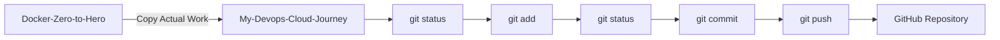

<div align="center">

# 🐳 Docker Volumes & Bind Mounts

### Persistent Storage for Docker Containers

**AWS EC2 • Ubuntu • Docker • Git • GitHub**

</div>

---

## 📌 Overview

Docker containers are **ephemeral by default**, which means data stored inside a container can be lost when the container is removed.

To provide persistent storage, Docker supports mechanisms such as:

- 📦 Docker Volumes
- 📁 Bind Mounts
- 💾 Temporary filesystem mounts

In this hands-on practice, I created a Docker named volume called `yuvi`, mounted it into an NGINX container, verified the mount using `docker inspect`, learned the concept of bind mounts, and finally copied the actual Docker practice files from `Docker-Zero-to-Hero` into my own `My-Devops-Cloud-Journey` GitHub repository.

---

## 🧠 Docker Volume

A **Docker Volume** is storage managed by Docker.

```text
Docker Host
│
├── Docker Engine
│
├── Containers
│
└── Docker Volume
      │
      └── yuvi
           │
           ▼
       Container
       /app
```

The volume is managed by Docker instead of directly managing a host directory.

---

## 🛠️ Creating a Docker Volume

I created a named Docker volume called `yuvi`:

```bash
docker volume create yuvi
```

Output:

```text
yuvi
```

---

## 🔍 Listing Docker Volumes

To check the available Docker volumes:

```bash
docker volume ls
```

Output:

```text
DRIVER    VOLUME NAME
local     yuvi
```

The `yuvi` volume is using Docker's `local` volume driver.

---

## 🔎 Inspecting the Docker Volume

To inspect the volume:

```bash
docker volume inspect yuvi
```

The important information was:

```text
Name: yuvi
Driver: local
Mountpoint: /var/lib/docker/volumes/yuvi/_data
Scope: local
```

### Important Fields

| Field | Meaning |
|---|---|
| `Name` | Name of the volume |
| `Driver` | Storage driver used by Docker |
| `Mountpoint` | Location where Docker stores the volume data |
| `Scope` | Scope of the volume |

The volume's Docker-managed storage location was:

```text
/var/lib/docker/volumes/yuvi/_data
```

---

## 🐳 Building the Docker Image

I built the Docker image used during the practice:

```bash
docker build -t volumedemo .
```

The build completed successfully:

```text
Successfully built d618a7dee113
Successfully tagged volumedemo:latest
```

---

## ⚠️ First Docker Run Attempt

I first tried:

```bash
docker run -d --mount source=yuvi,target=/app
```

Docker returned:

```text
docker: 'docker run' requires at least 1 argument
```

### Reason

`docker run` requires an **IMAGE**.

General syntax:

```bash
docker run [OPTIONS] IMAGE [COMMAND] [ARG...]
```

The mount was specified, but no image was provided.

---

## ⚠️ Second Docker Run Attempt

I then tried:

```bash
docker run -d --mount source=yuvi,target=/app .
```

This produced:

```text
docker: invalid reference format
```

---

## ✅ Correct Docker Volume Mount

I then used the NGINX image:

```bash
docker run -d --mount source=yuvi,target=/app nginx:latest
```

Because the NGINX image was not available locally, Docker downloaded it:

```text
Unable to find image 'nginx:latest' locally
latest: Pulling from library/nginx
```

After downloading the image, Docker successfully created the container.

---

## 🔗 Understanding `--mount`

The command:

```bash
docker run -d --mount source=yuvi,target=/app nginx:latest
```

means:

```text
--mount
   │
   ├── source=yuvi
   │       │
   │       └── Docker Volume
   │
   └── target=/app
           │
           └── Directory inside container
```

So:

```text
Docker Volume
     │
     │ source=yuvi
     ▼
┌─────────────────┐
│ NGINX Container │
│                 │
│      /app       │
└─────────────────┘
       target
```

---

## 📋 Checking the Running Container

After starting the container, I checked it using:

```bash
docker ps
```

The NGINX container was running successfully.

Example:

```text
CONTAINER ID   IMAGE          STATUS
1a3034e8d48b   nginx:latest   Up
```

---

## 🔍 Inspecting the Container

I inspected the container using:

```bash
docker inspect 1a3034e8d48b
```

The output confirmed the volume mount:

```json
"Mounts": [
    {
        "Type": "volume",
        "Source": "yuvi",
        "Target": "/app"
    }
]
```

The detailed mount information showed:

```json
"Mounts": [
    {
        "Type": "volume",
        "Name": "yuvi",
        "Source": "/var/lib/docker/volumes/yuvi/_data",
        "Destination": "/app",
        "Driver": "local",
        "Mode": "z",
        "RW": true,
        "Propagation": ""
    }
]
```

### Mount Details

| Property | Value | Meaning |
|---|---|---|
| `Type` | `volume` | Docker named volume |
| `Name` | `yuvi` | Volume name |
| `Source` | `/var/lib/docker/volumes/yuvi/_data` | Docker volume storage location |
| `Destination` | `/app` | Directory inside container |
| `Driver` | `local` | Docker local volume driver |
| `RW` | `true` | Read/write access |

This confirmed that:

```text
yuvi → /app
```

was successfully mounted.

---

## 🧩 Docker Volume Architecture

```mermaid
flowchart LR

    A[Docker Host / EC2] --> B[Docker Engine]

    B --> C[Named Volume: yuvi]

    C --> D[/var/lib/docker/volumes/yuvi/_data]

    C --> E[NGINX Container]

    E --> F[/app]

    C -. mounted into .-> F
```

---

## 📁 Bind Mounts

A **Bind Mount** connects a specific directory or file on the Docker host directly to a directory inside a container.

Example:

```text
Docker Host
     │
     ▼
/home/ubuntu/myapp
     │
     │ Bind Mount
     ▼
Container
     │
     ▼
/app
```

Unlike a Docker volume, the host path is explicitly selected by the user.

---

## 🐳 Bind Mount Command

Example:

```bash
docker run -d \
  --mount type=bind,source=/home/ubuntu/app,target=/app \
  nginx:latest
```

Here:

```text
type=bind
    │
    ├── source=/home/ubuntu/app
    │        │
    │        └── Directory on Docker Host
    │
    └── target=/app
             │
             └── Directory inside Container
```

### Bind Mount Architecture

```mermaid
flowchart LR

    A[Docker Host] --> B[/home/ubuntu/app]

    B -->|Bind Mount| C[NGINX Container]

    C --> D[/app]
```

> **Note:** In this hands-on session, I actually executed a named Docker volume mount using `yuvi`. The `type=bind` command above documents the bind-mount concept.

---

## ⚔️ Docker Volume vs Bind Mount

| Feature | Docker Volume | Bind Mount |
|---|---|---|
| Managed by Docker | ✅ Yes | ❌ No |
| Uses host path directly | ❌ No | ✅ Yes |
| Persistent storage | ✅ Yes | ✅ Yes |
| Host path required | ❌ No | ✅ Yes |
| Good for development | ✅ Yes | ⭐ Very useful |
| Example | `yuvi` | `/home/ubuntu/app` |

### Simple Rule

> **Docker Volume → Docker manages the storage**

> **Bind Mount → You manage the host path**

---

## 🧠 Commands Practiced

```bash
# Create Docker volume
docker volume create yuvi

# List Docker volumes
docker volume ls

# Inspect Docker volume
docker volume inspect yuvi

# Build Docker image
docker build -t volumedemo .

# Run container with named volume
docker run -d --mount source=yuvi,target=/app nginx:latest

# Check running containers
docker ps

# Inspect container
docker inspect 1a3034e8d48b
```

---

## 📝 Actual Docker Command History

The hands-on work was performed inside:

```text
~/Docker-Zero-to-Hero/examples/first-docker-file
```

The command history included:

```bash
docker volume create yuvi
docker volume ls
docker volume inspect yuvi

git clone https://github.com/iam-veeramalla/Docker-Zero-to-Hero.git

cd Docker-Zero-to-Hero/
cd examples/
cd first-docker-file/

docker build -t volumedemo .

docker run -d --mount source=yuvi,target=/app
docker run -d --mount source=yuvi,target=/app .
docker run -d --mount source=yuvi,target=/app nginx:latest

docker ps
docker inspect 1a3034e8d48b

history
```

---

## 🎯 What I Learned

### Docker Volumes

- A Docker volume provides persistent storage.
- Docker manages the volume.
- Volumes can exist independently from containers.
- `docker volume create` creates a named volume.
- `docker volume ls` lists volumes.
- `docker volume inspect` provides detailed information.

### Mounting

```text
source → Where the storage comes from

target → Where the storage appears inside the container
```

Example:

```bash
--mount source=yuvi,target=/app
```

### Bind Mounts

- Bind mounts connect a specific host path to a container path.
- The host path is explicitly selected.
- They are useful when working directly with files on the host.

---

## ☁️ Copying the Actual Docker Work to My Repository

After completing the hands-on work inside `Docker-Zero-to-Hero`, I wanted to keep the actual project files inside my own DevOps Cloud Journey repository.

### Source

```text
Docker-Zero-to-Hero/
└── examples/
    └── first-docker-file/
```

### Destination

```text
My-Devops-Cloud-Journey/
└── DevOps-Labs-and-Projects/
    └── 10-docker-volumes-and-bind-mounts/
```

---

## 📂 Copy the Actual Project

From the EC2 instance, I copied the actual Docker project files:

```bash
cp -r ~/Docker-Zero-to-Hero/examples/first-docker-file/. \
~/My-Devops-Cloud-Journey/DevOps-Labs-and-Projects/10-docker-volumes-and-bind-mounts/
```

The flow was:

```text
Docker-Zero-to-Hero
        │
        │ Copy actual work
        ▼
My-Devops-Cloud-Journey
        │
        ▼
DevOps-Labs-and-Projects
        │
        ▼
10-docker-volumes-and-bind-mounts
```

This allowed me to keep the actual hands-on Docker work together with its documentation in my own repository.

---

## 📍 Navigate to My Repository

```bash
cd ~/My-Devops-Cloud-Journey
```

---

## 🔍 Check Git Status

I checked the repository:

```bash
git status
```

This allowed me to verify the files copied from `Docker-Zero-to-Hero`.

---

## ➕ Add the Docker Project

I staged the Docker project:

```bash
git add DevOps-Labs-and-Projects/10-docker-volumes-and-bind-mounts/
```

---

## 🔎 Check Git Status Again

I verified the staged changes:

```bash
git status
```

The Docker project files appeared under:

```text
Changes to be committed:
```

This confirmed that the actual Docker work was ready to be committed.

---

## 💾 Commit the Docker Work

I created the Git commit:

```bash
git commit -m "feat: add Docker volumes hands-on project"
```

---

## ☁️ Push to GitHub

Finally, I pushed the commit to the `main` branch:

```bash
git push origin main
```

The actual Docker hands-on project was now pushed to my GitHub repository.

---

## 🔄 Complete EC2 → GitHub Workflow



---

## 🧑‍💻 Complete Git Workflow

```bash
# Copy actual Docker work
cp -r ~/Docker-Zero-to-Hero/examples/first-docker-file/. \
~/My-Devops-Cloud-Journey/DevOps-Labs-and-Projects/10-docker-volumes-and-bind-mounts/

# Navigate to my repository
cd ~/My-Devops-Cloud-Journey

# Check changes
git status

# Stage the Docker project
git add DevOps-Labs-and-Projects/10-docker-volumes-and-bind-mounts/

# Verify staged changes
git status

# Commit the Docker work
git commit -m "feat: add Docker volumes hands-on project"

# Push to GitHub
git push origin main
```

---

## 🧠 Git & GitHub Learning

Through this process, I learned how to:

- ✅ Copy an existing Docker project
- ✅ Move practical work into my own GitHub repository
- ✅ Organize Docker hands-on work inside a dedicated folder
- ✅ Check changes using `git status`
- ✅ Stage files using `git add`
- ✅ Create a meaningful Git commit
- ✅ Push local work to GitHub
- ✅ Maintain both documentation and actual project files
- ✅ Keep my DevOps hands-on work organized professionally

---

## 📁 Final Repository Structure

```text
My-Devops-Cloud-Journey/
│
└── DevOps-Labs-and-Projects/
    │
    ├── 07-Docker/
    │
    ├── 08-Dockerizing-Python-Django-...
    │
    ├── 09-Multi-Stage-Docker-Builds/
    │
    └── 10-docker-volumes-and-bind-mounts/
        │
        ├── README.md
        └── Actual Docker hands-on files
```

---

## 🏆 Final Outcome

```text
┌────────────────────────────────────────────┐
│          DOCKER-ZERO-TO-HERO               │
│                                            │
│   Docker Volumes & Bind Mounts Practice    │
└──────────────────────┬─────────────────────┘
                       │
                       │ Copy Actual Work
                       ▼
┌────────────────────────────────────────────┐
│       MY-DEVOPS-CLOUD-JOURNEY              │
│                                            │
│  10-docker-volumes-and-bind-mounts/        │
│                                            │
│  ├── README.md                             │
│  └── Actual Docker Project Files           │
└──────────────────────┬─────────────────────┘
                       │
                       │ Git Workflow
                       ▼
                 git status
                       │
                       ▼
                    git add
                       │
                       ▼
                  git commit
                       │
                       ▼
                   git push
                       │
                       ▼
                    ☁️ GitHub
```

---

<p align="center">

## 🐳 Docker Storage Practice Complete

### Volumes → Mounts → Bind Mounts → EC2 → Git → GitHub

</p>

<p align="center">

# 🎯 DOCKER VOLUMES & BIND MOUNTS COMPLETE

### 🔥 PRACTICE • DOCUMENT • COMMIT • PUSH 🔥

</p>
