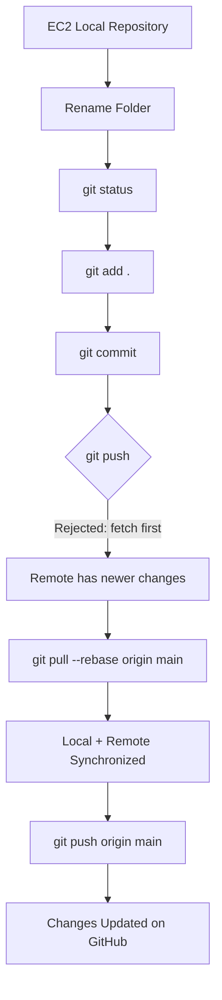

<div align="center">

# 🔄 GitHub Push Rejected — Fetch First

### EC2 • Git • GitHub • Remote Synchronization

</div>

---

## 🎯 Objective

Rename the Docker volumes folder from:

```text
10-docker-volumes-and-bind-mounts
```

to:

```text
10-Docker-volumes-and-Bind-mounts
```

and push the change from the **AWS EC2 instance** to GitHub.

---

## 📁 Repository Structure

```text
My-Devops-Cloud-Journey/
└── DevOps-Labs-and-Projects/
    └── 10-Docker-volumes-and-Bind-mounts/
        ├── images/
        ├── Dockerfile
        ├── README.md
        └── app.py
```

---

## 1️⃣ Rename the Folder

From the EC2 instance:

```bash
cd ~/My-Devops-Cloud-Journey
```

Rename the folder using Git:

```bash
git mv \
DevOps-Labs-and-Projects/10-docker-volumes-and-bind-mounts \
DevOps-Labs-and-Projects/10-Docker-volumes-and-Bind-mounts
```

Check the change:

```bash
git status
```

---

## 2️⃣ Commit the Rename

```bash
git add .
```

```bash
git commit -m "Rename Docker volumes and bind mounts folder"
```

---

## 3️⃣ Push to GitHub

Initially, the push was rejected:

```text
! [rejected] main -> main (fetch first)

error: failed to push some refs to GitHub
```

### ❓ Why Did This Happen?

The GitHub repository contained changes that were **not present in the EC2 local repository**.

```text
EC2 Local Repository
        │
        │ git push
        ▼
      GitHub
        │
        ├── Newer changes
        │
        └── Local repository is behind
```

Git rejected the push to prevent the remote changes from being accidentally overwritten.

---

## 4️⃣ Synchronize with GitHub

Instead of force pushing, pull the latest changes and rebase the local commit:

```bash
git pull --rebase origin main
```

This updates the local repository with the latest GitHub changes while keeping the local commit on top.

```text
GitHub
  │
  │ git pull --rebase
  ▼
EC2 Local Repository
  │
  │ Local commit is placed on top
  ▼
Updated Local Repository
```

---

## 5️⃣ Push Again

After the rebase completed successfully:

```bash
git push origin main
```

The changes were successfully pushed to GitHub. ✅

---

## 🔐 Important Lesson

When Git says:

```text
rejected (fetch first)
```

it usually means:

> **"The remote repository has changes that your local repository doesn't have."**

A safe approach is:

```bash
git pull --rebase origin main
git push origin main
```

### 🚫 Avoid immediately using:

```bash
git push --force
```

because force pushing can overwrite remote history.

---

## 🧠 Git Flow Learned



---

## 📝 Commands Used

| Purpose                    | Command                         |
| -------------------------- | ------------------------------- |
| Go to repository           | `cd ~/My-Devops-Cloud-Journey`  |
| Rename folder              | `git mv old-name new-name`      |
| Check changes              | `git status`                    |
| Stage changes              | `git add .`                     |
| Commit changes             | `git commit -m "message"`       |
| Synchronize remote changes | `git pull --rebase origin main` |
| Push changes               | `git push origin main`          |

---

## 🎓 Key Takeaways

* `git mv` can rename files and folders while tracking the change.
* `git status` helps verify what Git detects.
* A **fetch-first rejection** means the local branch is behind the remote branch.
* `git pull --rebase` is a clean way to synchronize local and remote history.
* Always synchronize before pushing when Git reports that the remote contains newer work.
* Avoid force pushing unless you completely understand the consequences.

---

<p align="center">

### ✅ GIT & GITHUB HANDS-ON COMPLETE

**EC2 → Git → GitHub → Synchronization → Push**

</p>
