# ☸️ DAY 15 — KUBERNETES DEPLOYMENT | REPLICASET | POD SELF-HEALING

<p align="center">


</p>

<p align="center">
  <b>Deploying an NGINX Application Using Kubernetes Deployment & ReplicaSet</b>
</p>

<p align="center">
  <i>DevOps Cloud Journey — Day 34 🚀</i>
</p>

---

# 🎯 OBJECTIVE

In **Day 33**, I created a single NGINX Pod directly using a Kubernetes Pod YAML file.

In Day 34, I moved to the next important Kubernetes concept:

> **Kubernetes Deployment**

The main goal of this hands-on lab was to understand:

- How a Deployment manages Pods
- How a Deployment creates a ReplicaSet
- How a ReplicaSet manages multiple Pods
- How replicas work
- What happens when a Pod is deleted
- How Kubernetes automatically creates a replacement Pod
- How Kubernetes provides self-healing

The main practical test was:

> **If I delete a Pod managed by a Deployment, will Kubernetes create another Pod automatically?**

The answer was:

> **Yes. Kubernetes automatically created a replacement Pod to maintain the desired number of replicas.**

---

# 🧠 WHAT I LEARNED

During this hands-on lab, I learned:

- ☸️ Kubernetes Deployment
- 🔁 ReplicaSet
- 📦 Multiple Pods
- 🔢 Replicas
- ❤️ Self-healing
- 🔄 Pod replacement
- 👀 Watching Pods in real time
- 🔍 Checking Deployments
- 🔍 Checking ReplicaSets
- 🗑️ Deleting Pods
- 🧠 Desired state
- 🔄 Kubernetes reconciliation

---

# ☸️ WHAT IS A KUBERNETES DEPLOYMENT?

A **Deployment** is a Kubernetes resource used to manage an application and its Pods.

Instead of manually creating multiple Pods, we can tell Kubernetes how many replicas we want.

For example:

```yaml
replicas: 3
```

means:

```text
Keep 3 Pods running.
```

The Deployment manages a ReplicaSet, and the ReplicaSet manages the Pods.

### Deployment relationship

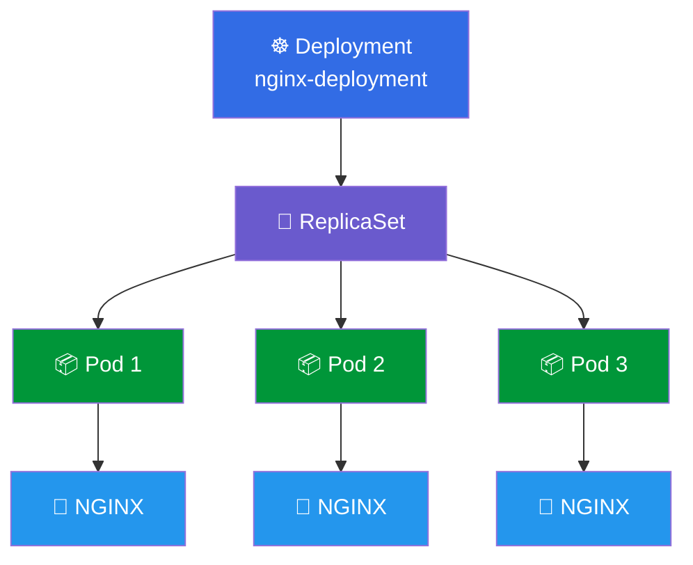

---

# 🔁 WHAT IS A REPLICASET?

A **ReplicaSet** is responsible for maintaining the required number of Pods.

For example:

```text
Desired Pods = 3
Current Pods = 3
```

Everything is correct.

But if one Pod is deleted:

```text
Desired Pods = 3
Current Pods = 2
```

The ReplicaSet detects that one Pod is missing.

It creates a new Pod.

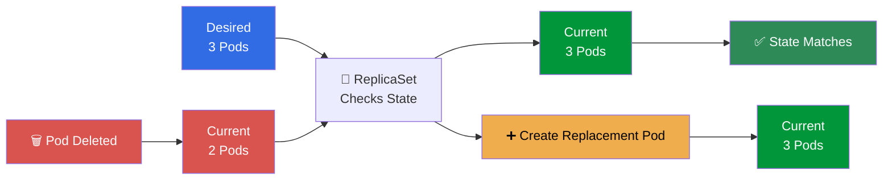

---

# 🏗️ DEPLOYMENT ARCHITECTURE

The important Kubernetes relationship is:

```text
Deployment
    ↓
ReplicaSet
    ↓
Pods
    ↓
Containers
```

### Complete Architecture

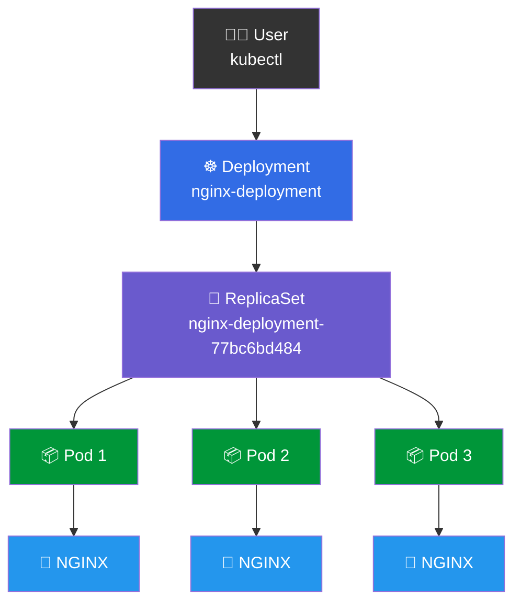

---

# 📝 DEPLOYMENT YAML

I created the Deployment YAML file using:

```bash
vim deployment.yml
```

The Deployment configuration used in the lab:

```yaml
apiVersion: apps/v1
kind: Deployment

metadata:
  name: nginx-deployment

spec:
  replicas: 3

  selector:
    matchLabels:
      app: nginx

  template:
    metadata:
      labels:
        app: nginx

    spec:
      containers:
        - name: nginx
          image: nginx:1.14.2
          ports:
            - containerPort: 80
```

---

# 🔍 UNDERSTANDING THE DEPLOYMENT YAML

## 1️⃣ `apiVersion`

```yaml
apiVersion: apps/v1
```

This specifies the Kubernetes API version used for the Deployment.

---

## 2️⃣ `kind`

```yaml
kind: Deployment
```

This tells Kubernetes:

```text
Create a Deployment.
```

---

## 3️⃣ `metadata`

```yaml
metadata:
  name: nginx-deployment
```

This gives the Deployment the name:

```text
nginx-deployment
```

---

## 4️⃣ `replicas`

```yaml
replicas: 3
```

This is one of the most important parts.

It tells Kubernetes:

```text
Maintain 3 Pods.
```

---

## 5️⃣ `selector`

```yaml
selector:
  matchLabels:
    app: nginx
```

The Deployment uses:

```text
app: nginx
```

to identify the Pods that belong to it.

---

## 6️⃣ Pod Template

```yaml
template:
  metadata:
    labels:
      app: nginx
```

This defines the labels that will be given to the Pods.

Each Pod gets:

```text
app: nginx
```

---

## 7️⃣ Container

```yaml
containers:
  - name: nginx
    image: nginx:1.14.2
```

Each Pod runs an NGINX container using:

```text
nginx:1.14.2
```

---

## 8️⃣ Container Port

```yaml
ports:
  - containerPort: 80
```

NGINX uses:

```text
Port 80
```

---

# 🚀 CREATE THE DEPLOYMENT

After creating `deployment.yml`, I created the Deployment using:

```bash
kubectl create -f deployment.yml
```

Expected output:

```text
deployment.apps/nginx-deployment created
```

This means the Deployment was successfully created.

---

# 🔎 CHECK THE DEPLOYMENT

To check the Deployment:

```bash
kubectl get deploy
```

The output was similar to:

```text
NAME               READY   UP-TO-DATE   AVAILABLE   AGE
nginx-deployment   3/3     3            3           ...
```

### Understanding the output

| Column | Meaning |
|---|---|
| NAME | Deployment name |
| READY | Ready replicas / desired replicas |
| UP-TO-DATE | Pods using the current configuration |
| AVAILABLE | Available Pods |
| AGE | Deployment age |

The important result was:

```text
READY = 3/3
```

This means:

```text
Desired Pods = 3
Ready Pods   = 3
```

---

# 📦 CHECK THE PODS

I checked the Pods using:

```bash
kubectl get pods
```

The output showed three NGINX Pods similar to:

```text
NAME                                READY   STATUS    RESTARTS   AGE
nginx-deployment-77bc6bd484-tgnd    1/1     Running   0          ...
nginx-deployment-77bc6bd484-lgk6c    1/1     Running   0          ...
nginx-deployment-77bc6bd484-vphnk    1/1     Running   0          ...
```

All three Pods were:

```text
1/1
Running
0 restarts
```

### Visual representation

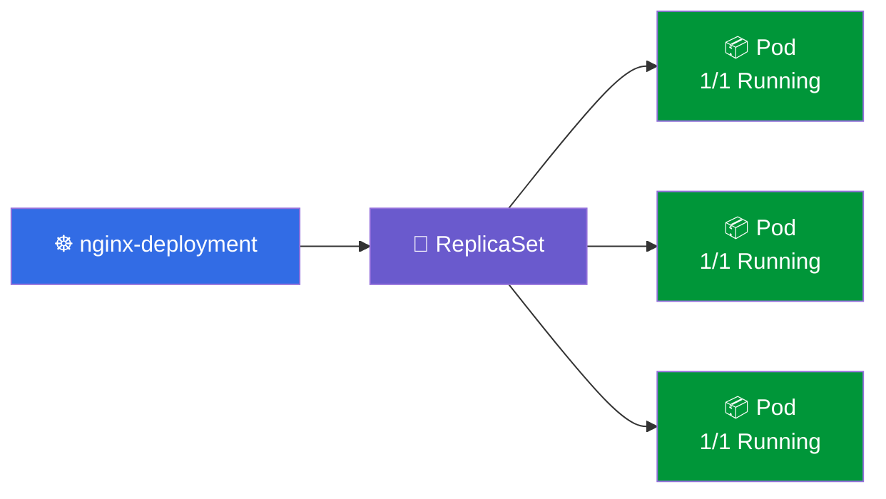

---

# 🔁 CHECK THE REPLICASET

To check the ReplicaSet:

```bash
kubectl get rs
```

The output was similar to:

```text
NAME                       DESIRED   CURRENT   READY   AGE
nginx-deployment-77bc6bd484   3        3        3      ...
```

This shows:

```text
DESIRED = 3
CURRENT = 3
READY   = 3
```

So the ReplicaSet was successfully maintaining three Pods.

---

# 🧠 WHAT HAPPENED BEHIND THE SCENES?

When I executed:

```bash
kubectl create -f deployment.yml
```

Kubernetes created the following relationship:

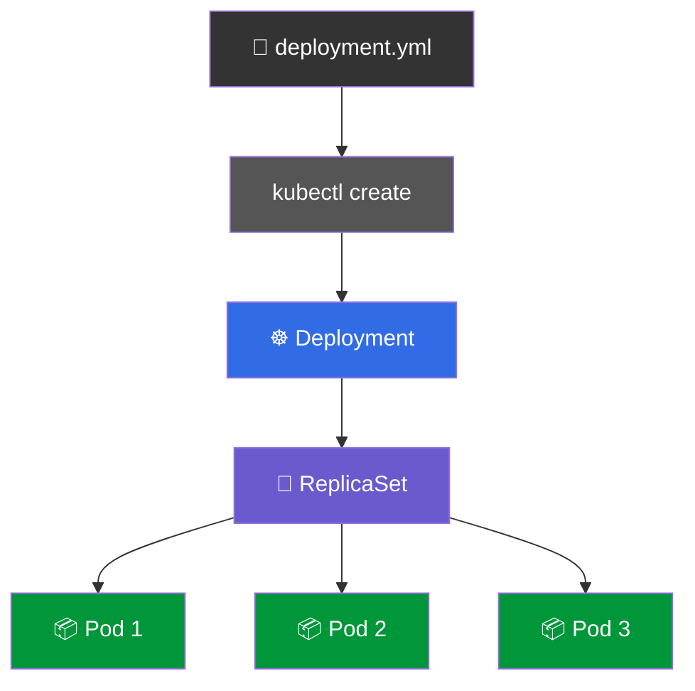

I only specified:

```yaml
replicas: 3
```

Kubernetes automatically created and managed the three Pods.

---

# 🗑️ DELETE A POD

Now I tested Kubernetes self-healing.

First, I checked the Pods:

```bash
kubectl get pods
```

Then I selected one Pod and deleted it:

```bash
kubectl delete pod <pod-name>
```

For example:

```bash
kubectl delete pod nginx-deployment-77bc6bd484-68w77
```

Kubernetes returned:

```text
pod "nginx-deployment-77bc6bd484-68w77" deleted from default namespace
```

The Pod was successfully deleted.

---

# 👀 WATCH POD CHANGES

To see what Kubernetes does after deleting the Pod, I used:

```bash
kubectl get pods -w
```

The `-w` means:

```text
watch
```

Instead of displaying the Pods once, Kubernetes continuously watches for changes.

This allowed me to see the Pod replacement happening in real time.

---

# ❤️ KUBERNETES SELF-HEALING

This was the main concept demonstrated in this lab.

Before deleting a Pod:

```text
Pod A ✅
Pod B ✅
Pod C ✅

Total = 3
```

After deleting Pod B:

```text
Pod A ✅
Pod B ❌
Pod C ✅

Total = 2
```

The ReplicaSet detects:

```text
Desired = 3
Current = 2
```

Then it creates another Pod.

```text
Pod A ✅
Pod C ✅
Pod D 🆕

Total = 3
```

### Self-Healing Flow

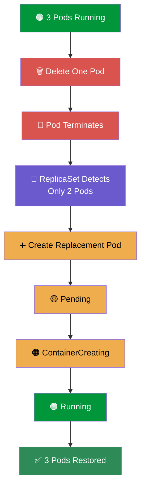

---

# 🔄 WHAT HAPPENS AFTER POD DELETION?

The process is:

```text
1. Pod is running
        ↓
2. Pod is manually deleted
        ↓
3. ReplicaSet notices the Pod is missing
        ↓
4. Current replicas become 2
        ↓
5. Desired replicas are still 3
        ↓
6. ReplicaSet creates a new Pod
        ↓
7. New Pod becomes Pending
        ↓
8. Container is created
        ↓
9. New Pod becomes Running
        ↓
10. Replica count returns to 3
```

### Mermaid Flow

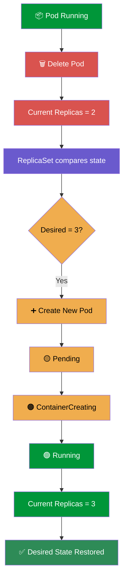

---

# ⚠️ IMPORTANT — THE OLD POD IS NOT RESTORED

Kubernetes does **not** bring back the exact deleted Pod.

Instead, Kubernetes creates a **new Pod**.

For example:

```text
Before:

nginx-deployment-77bc6bd484-68w77
nginx-deployment-77bc6bd484-5ptzl
nginx-deployment-77bc6bd484-c8bsm
```

Delete:

```text
nginx-deployment-77bc6bd484-68w77
```

After replacement:

```text
nginx-deployment-77bc6bd484-5ptzl
nginx-deployment-77bc6bd484-c8bsm
nginx-deployment-77bc6bd484-mcrg8
```

The replacement Pod has a different name.

But:

```text
Desired replicas = 3
Current replicas = 3
```

---

# 🔄 POD LIFECYCLE OBSERVED

While running:

```bash
kubectl get pods -w
```

I observed Pod states such as:

```text
Pending
ContainerCreating
Running
Terminating
Completed
```

### Replacement Pod

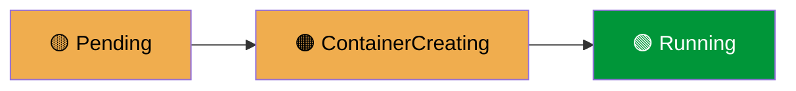

### Deleted Pod


---

# 🔥 REPEATED SELF-HEALING TEST

I repeated the Pod deletion test multiple times.

The process was:

```bash
kubectl get pods
```

Then:

```bash
kubectl delete pod <pod-name>
```

Then:

```bash
kubectl get pods -w
```

Each time, Kubernetes created a replacement Pod.

### Repeated Test Flow

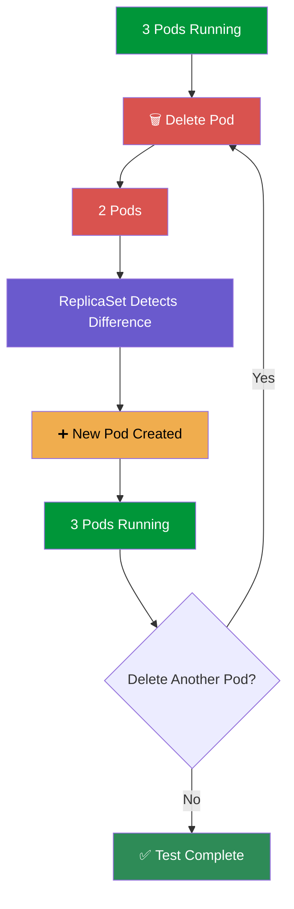

---

# 🆚 DIRECT POD VS DEPLOYMENT

This is one of the most important comparisons from the lab.

## 📦 Direct Pod

When we create a Pod directly:

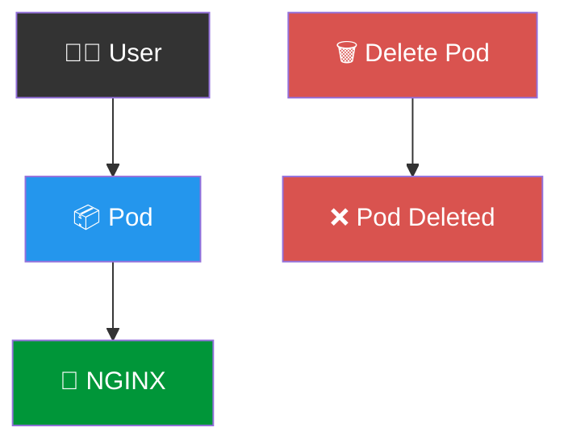

If the Pod is deleted:

```bash
kubectl delete pod nginx
```

the Pod is deleted.

There is no Deployment or ReplicaSet managing it.

---

# ☸️ POD MANAGED BY DEPLOYMENT

With a Deployment:

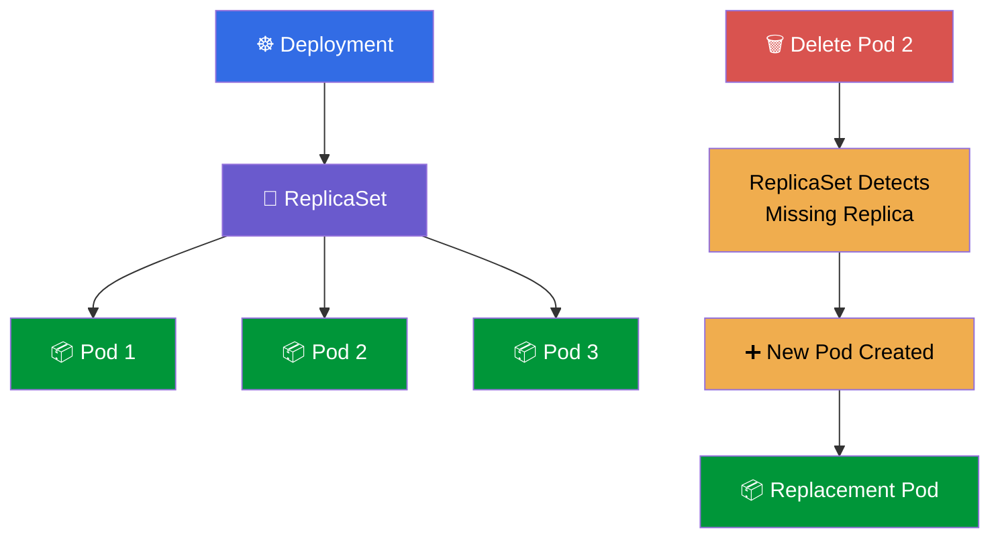

The Deployment keeps the application at the desired replica count.

---

# 🆚 COMPARISON TABLE

| Feature | Direct Pod | Deployment |
|---|---:|---:|
| Creates Pod | ✅ | ✅ |
| Multiple replicas | Manual | ✅ |
| ReplicaSet | ❌ | ✅ |
| Self-healing | ❌ | ✅ |
| Replacement Pod | ❌ | ✅ |
| Desired state management | Limited | ✅ |
| Application management | Basic | ✅ |
| Suitable for applications | Limited | ✅ |

---

# 🧠 DESIRED STATE

One of the most important Kubernetes concepts I learned is **desired state**.

In the YAML:

```yaml
replicas: 3
```

I told Kubernetes:

```text
Desired state = 3 Pods
```

Kubernetes continuously compares:

```text
Desired State
      VS
Current State
```

### When everything is correct

```text
Desired = 3
Current = 3
```

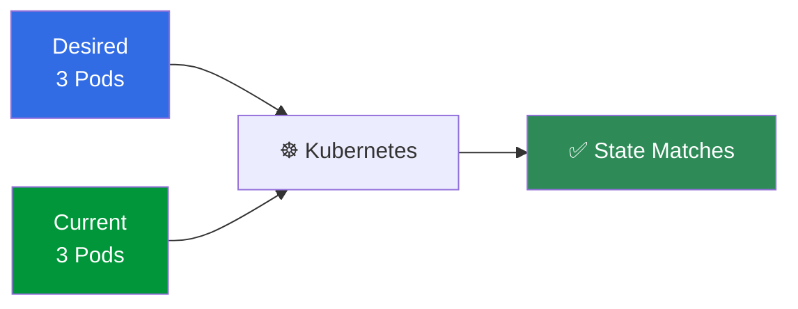

### When one Pod is deleted

```text
Desired = 3
Current = 2
```

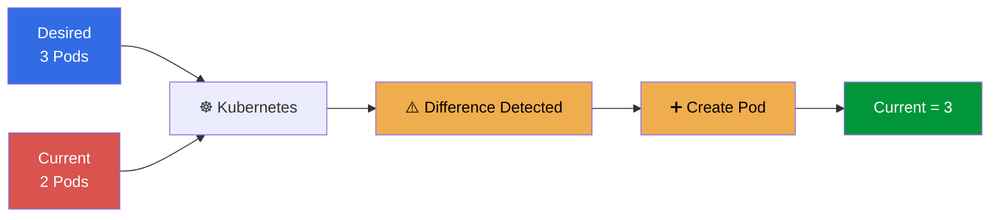

---

# 🏗️ COMPLETE SELF-HEALING ARCHITECTURE

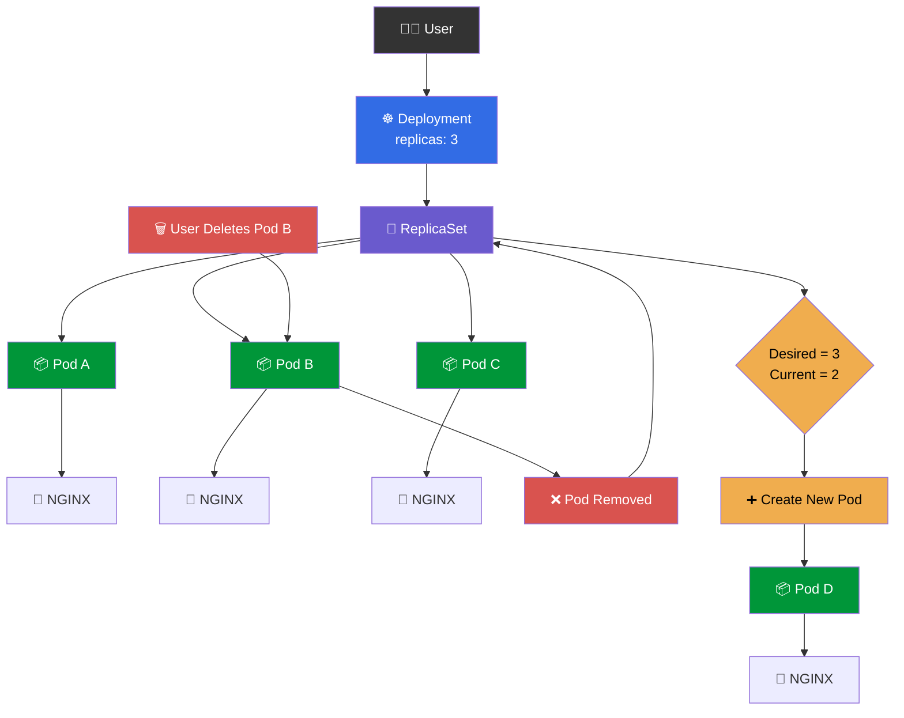

---

# 📋 IMPORTANT COMMANDS

## Create Deployment

```bash
kubectl create -f deployment.yml
```

## Apply Deployment

```bash
kubectl apply -f deployment.yml
```

## Check Deployment

```bash
kubectl get deploy
```

## Check ReplicaSets

```bash
kubectl get rs
```

## Check Pods

```bash
kubectl get pods
```

## Watch Pods

```bash
kubectl get pods -w
```

## Delete a Pod

```bash
kubectl delete pod <pod-name>
```

---

# 🧪 COMPLETE HANDS-ON TEST

## STEP 1 — Create the YAML File

```bash
vim deployment.yml
```

Add:

```yaml
apiVersion: apps/v1
kind: Deployment

metadata:
  name: nginx-deployment

spec:
  replicas: 3

  selector:
    matchLabels:
      app: nginx

  template:
    metadata:
      labels:
        app: nginx

    spec:
      containers:
        - name: nginx
          image: nginx:1.14.2
          ports:
            - containerPort: 80
```

---

## STEP 2 — Create the Deployment

```bash
kubectl create -f deployment.yml
```

Expected:

```text
deployment.apps/nginx-deployment created
```

---

## STEP 3 — Check the Deployment

```bash
kubectl get deploy
```

Expected:

```text
nginx-deployment   3/3   3   3
```

---

## STEP 4 — Check the ReplicaSet

```bash
kubectl get rs
```

Expected:

```text
nginx-deployment-77bc6bd484   3   3   3
```

---

## STEP 5 — Check the Pods

```bash
kubectl get pods
```

Expected:

```text
3 Pods
```

All Pods should eventually show:

```text
Running
```

---

## STEP 6 — Start Watching Pods

```bash
kubectl get pods -w
```

Keep this command running.

---

## STEP 7 — Open Another Terminal

In another terminal, run:

```bash
kubectl get pods
```

Choose one Pod and delete it:

```bash
kubectl delete pod <pod-name>
```

---

## STEP 8 — Observe the Replacement

Go back to:

```bash
kubectl get pods -w
```

The old Pod will terminate.

A new Pod will be created.

You may observe states such as:

```text
Terminating
Pending
ContainerCreating
Running
```

---

## STEP 9 — Verify the Final State

Run:

```bash
kubectl get pods
```

The Deployment should again have:

```text
3 Pods
```

---

# ⚠️ ERRORS I ENCOUNTERED

During the hands-on practice, I made a few command mistakes.

## ❌ Mistake 1

I typed:

```bash
kubectl gte pods -w
```

instead of:

```bash
kubectl get pods -w
```

The correct command is:

```bash
kubectl get pods -w
```

---

## ❌ Mistake 2

I typed:

```bash
kubectl gte pods
```

instead of:

```bash
kubectl get pods
```

The correct command is:

```bash
kubectl get pods
```

---

## 🧠 Lesson

Small spelling mistakes in CLI commands can cause errors.

The correct command structure is:

```text
kubectl get <resource>
```

Examples:

```bash
kubectl get pods
kubectl get deploy
kubectl get rs
```

---

# 📊 LAB RESULTS

| Resource | Result |
|---|---|
| Deployment | `nginx-deployment` |
| API Version | `apps/v1` |
| Kind | `Deployment` |
| Application | NGINX |
| Image | `nginx:1.14.2` |
| Container Port | `80` |
| Desired Replicas | `3` |
| Current Replicas | `3` |
| Ready Replicas | `3` |
| ReplicaSet | `nginx-deployment-77bc6bd484` |
| Pods | `3` |
| Pod Status | `Running` |
| Pod Deletion Test | ✅ Successful |
| Replacement Pod | ✅ Automatically Created |
| Self-Healing | ✅ Successfully Demonstrated |

---

# 🧠 KEY TAKEAWAYS

```text
☸️ A Deployment manages an application.

🔁 A Deployment creates/manages a ReplicaSet.

📦 A ReplicaSet maintains the desired number of Pods.

🔢 replicas: 3 means Kubernetes tries to maintain 3 Pods.

🗑️ Deleting a Deployment-managed Pod does not permanently reduce the replica count.

❤️ The ReplicaSet automatically creates a replacement Pod.

🔄 The replacement Pod receives a new name.

👀 kubectl get pods -w watches Pod changes in real time.

🧠 Kubernetes continuously compares desired state with current state.

🛠️ Deployments provide better application management than directly creating Pods.

🚀 Deployment → ReplicaSet → Pods is a very important Kubernetes relationship.
```

---

# 🔄 COMPLETE LAB FLOW

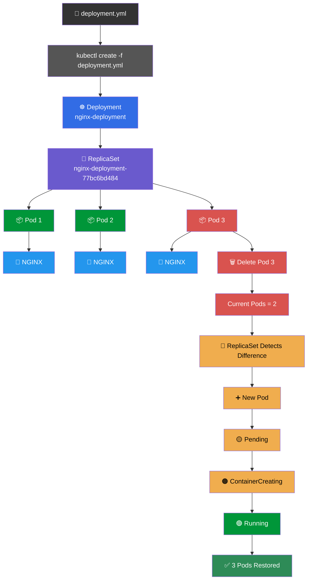

---

# 🆚 DAY 33 → DAY 34

## DAY 33 — DIRECT POD


### Result

```text
Pod
 ↓
Delete Pod
 ↓
Pod is gone
 ↓
No ReplicaSet
 ↓
No automatic replacement
```

---

## DAY 34 — DEPLOYMENT

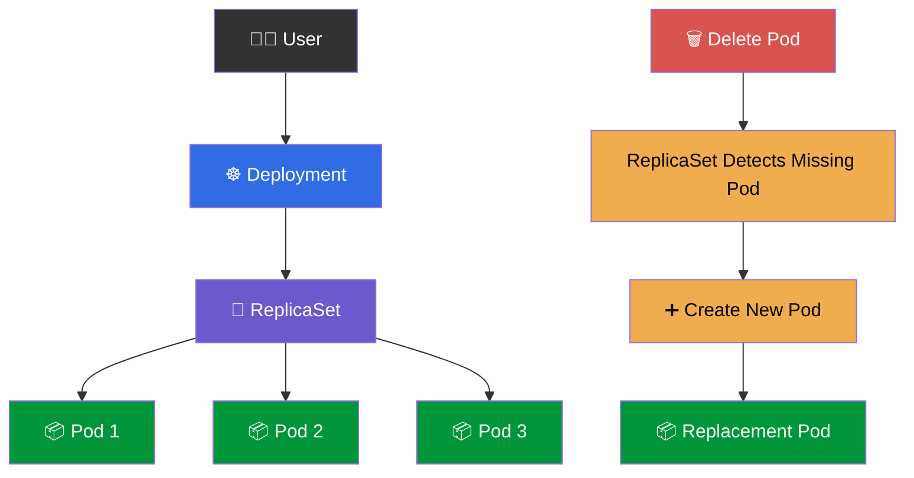

### Result

```text
Deployment
 ↓
ReplicaSet
 ↓
3 Pods
 ↓
Delete 1 Pod
 ↓
ReplicaSet detects missing Pod
 ↓
New Pod created
 ↓
3 Pods restored
```

---

# 📌 MAIN CONCEPT TO REMEMBER

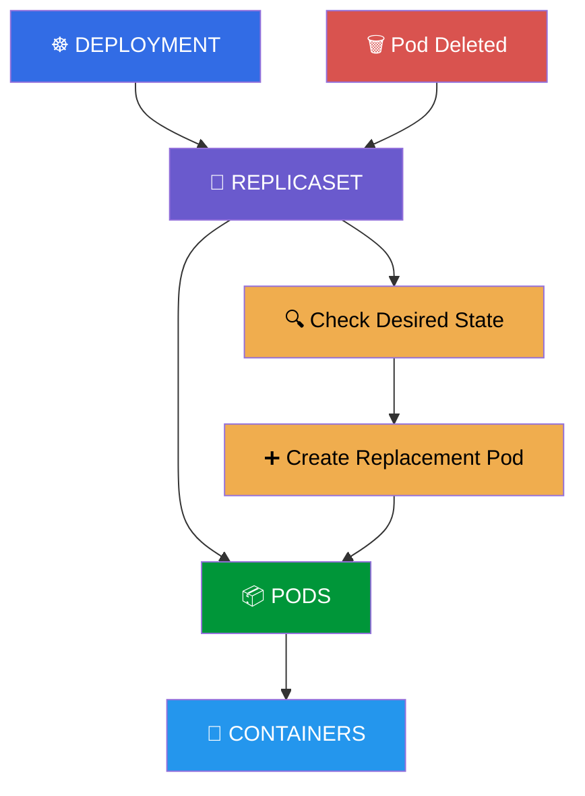

The main concept is:

> **A Deployment manages a ReplicaSet, and the ReplicaSet maintains the desired number of Pods. If a Deployment-managed Pod is deleted, the ReplicaSet automatically creates a new Pod to restore the desired state.**

---

# 🚀 NEXT STEP

After understanding:

```text
Pod
 ↓
Deployment
 ↓
ReplicaSet
 ↓
Self-Healing
```

the next Kubernetes concept is:

```text
Deployment
     ↓
Multiple Pods
     ↓
Service
     ↓
Stable Network Access
     ↓
Load Balancing
```

This leads to the next topic:

# ☸️ KUBERNETES SERVICES

---

<p align="center">

# 🎉 DAY 34 COMPLETE

### ☸️ KUBERNETES DEPLOYMENT + REPLICASET + POD SELF-HEALING

**Created an NGINX Deployment → Created 3 replicas → Observed the ReplicaSet → Deleted Pods → Watched Kubernetes automatically create replacement Pods.**

<br>

<b>Deployment → ReplicaSet → Pods → Self-Healing ❤️</b>

<br>

<b>🚀 DevOps Cloud Journey — Day 34</b>

</p>
