<h1 align="center"> DAY 38 — KUBERNETES INGRESS </h1>


<p align="center">


</p>

<p align="center">
<b>Understanding Kubernetes Ingress, Ingress Controller, Host-Based Routing & Path-Based Routing</b>
</p>

---

# 📚 What I Learned

Today I learned about **Kubernetes Ingress** and how it can be used to route HTTP/HTTPS traffic to applications running inside a Kubernetes cluster.

Before Ingress, I accessed my application using a NodePort:

`http://192.168.49.2:30007/demo/`

With Ingress, I can define rules such as:

`http://foo.bar.com/bar`

The most important concept I learned is:

> **Ingress defines the routing rules, while the Ingress Controller actually implements those rules.**

### 🔥 Overall Concept

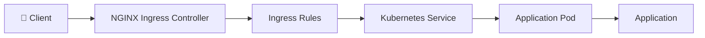

---

# 🧠 1. What is Kubernetes Ingress?

**Ingress is a Kubernetes API resource used to define rules for routing HTTP and HTTPS traffic to Services inside a Kubernetes cluster.**

In simple words:

> **Ingress is a rulebook that tells incoming HTTP/HTTPS traffic where it should go.**

For example, my Ingress rule can basically say:

```text
IF

Host = foo.bar.com

AND

Path = /bar

THEN

Send the request to:

python-django-sample-app Service
```

So I can remember:

```text
Ingress
   ↓
Defines:
"Where should this HTTP request go?"
```

---

# 🔑 2. What is an Ingress Controller?

An **Ingress Controller** is the component that actually receives incoming traffic and implements the rules defined by Ingress resources.

In my practical, I used the:

**NGINX Ingress Controller**

The flow is:

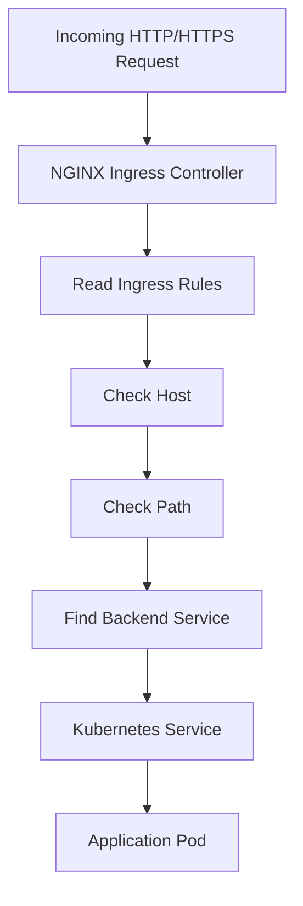

Therefore:

```text
Ingress
   =
Routing Rules

Ingress Controller
   =
Component that implements the Rules
```

### 🏠 Easy Analogy

```text
Ingress Controller = Traffic Police

Ingress = Traffic Rules

Service = Road to the Application

Pod = Destination
```

---

# 🆚 3. Ingress vs Ingress Controller

| Ingress | Ingress Controller |
|---|---|
| Kubernetes API resource | Running component |
| Defines routing rules | Implements routing rules |
| Describes what should happen | Actually performs routing |
| Created using YAML | Runs as Pod(s) |
| Does not process traffic by itself | Receives and processes traffic |

### Simple Mental Model

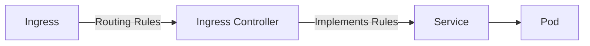

---

# 🏗️ 4. My Practical Environment

My practical environment consisted of:

```text
AWS EC2
   ↓
Ubuntu
   ↓
Docker
   ↓
Minikube
   ↓
Kubernetes Cluster
```

The architecture was:

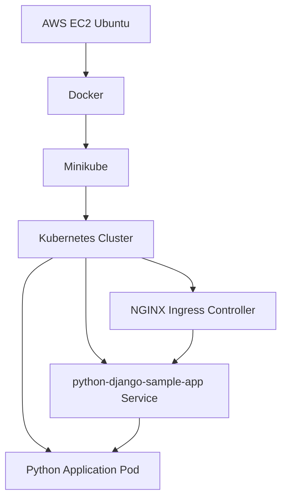

My Minikube IP was:

`192.168.49.2`

I checked it using:

```bash
minikube ip
```

---

# ⚠️ 5. Troubleshooting — Minikube Was Stopped

Initially, when I ran:

```bash
kubectl get pods
```

I received:

```text
E0829 12:50:26.371856
memcache.go:265

couldn't get current server API group list

Get "https://192.168.49.2:8443/api?timeout=32s":

dial tcp 192.168.49.2:8443:
connect: no route to host
```

The important part was:

```text
connect: no route to host
```

This happened because the Kubernetes API server running through Minikube was not available.

I checked:

```bash
kubectl config current-context
```

It showed:

```text
minikube
```

Then I checked:

```bash
minikube status
```

The important information was:

```text
host: Stopped
kubelet: Stopped
apiserver: Stopped
kubeconfig: Stopped
```

So the actual problem was:

> **Minikube was stopped.**

I started it using:

```bash
minikube start
```

Then:

```bash
kubectl get nodes
```

showed:

```text
NAME       STATUS   ROLES           VERSION
minikube   Ready    control-plane   v1.35.1
```

### 🔥 Lesson Learned

> **Before troubleshooting Kubernetes resources, first check whether the Kubernetes cluster is running.**

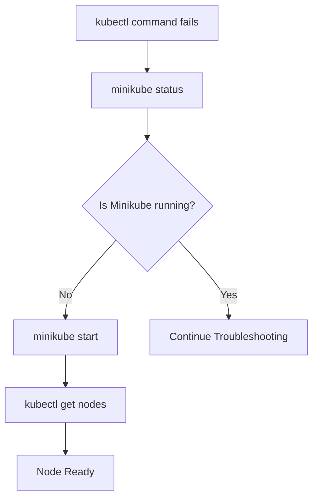

---

# 🌐 6. My Application Before Ingress

Before implementing Ingress, my application was already running inside Kubernetes.

The Service was:

`python-django-sample-app`

The Service had:

| Property | Value |
|---|---|
| Type | NodePort |
| Cluster IP | `10.105.250.39` |
| Service Port | `80` |
| NodePort | `30007` |

I could access the application using:

`http://192.168.49.2:30007/demo/`

### NodePort Flow

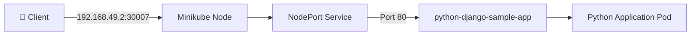

---

# ❓ 7. Why Do We Need Ingress?

Suppose I have multiple applications:

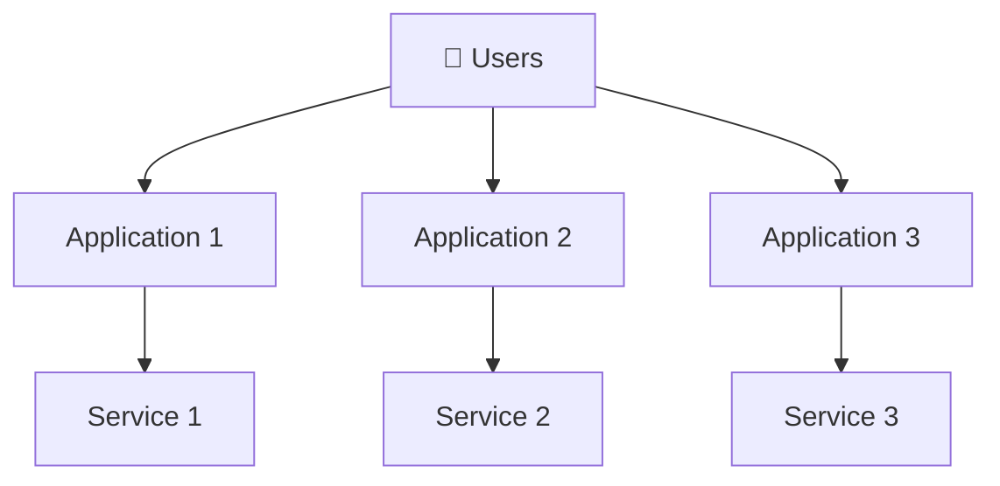

I could expose each application separately using NodePort or LoadBalancer.

But if I have many HTTP/HTTPS applications, managing separate external access points can become inconvenient.

Ingress allows me to have a common HTTP/HTTPS entry point and route traffic to different Services.

For example:

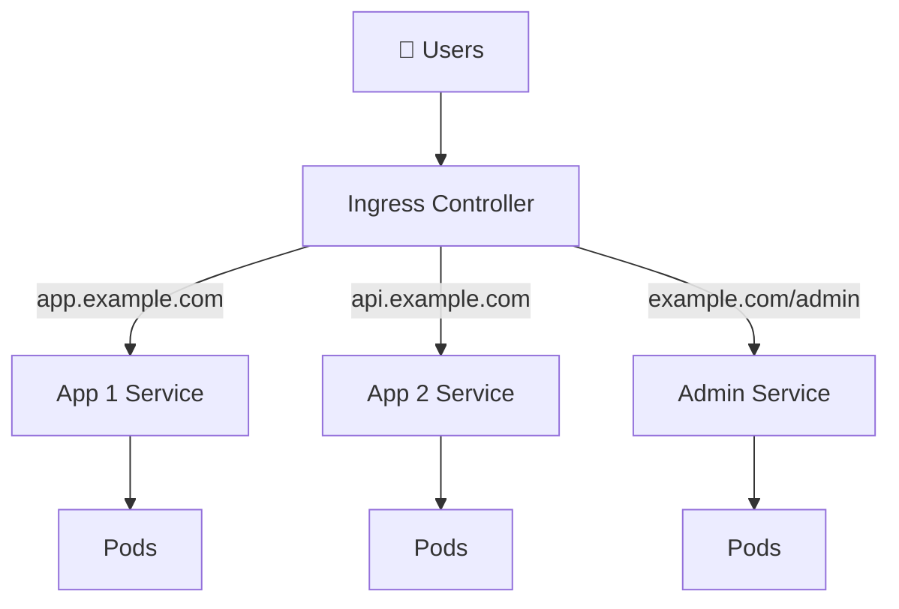

Therefore:

> **Ingress is useful for routing HTTP/HTTPS traffic to different Services using rules such as hostnames and paths.**

---

# 🔀 8. Ingress Does NOT Directly Route to Pods

This is one of the most important concepts I learned.

The correct flow is:

```text
Ingress Controller
        ↓
Ingress Rule
        ↓
Service
        ↓
Pod
```

Not:

```text
Ingress Controller
        ↓
Pod
```

### Correct Architecture

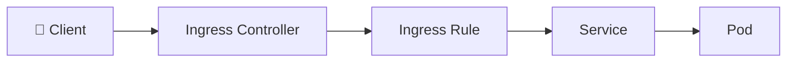

So I should remember:

> **Ingress routes traffic to a Service, and the Service provides access to the backend Pod(s).**

---

# 📝 9. My Ingress YAML

The Ingress configuration I used was:

```yaml
apiVersion: networking.k8s.io/v1
kind: Ingress

metadata:
  name: ingress-example

spec:
  rules:
    - host: foo.bar.com
      http:
        paths:
          - pathType: Prefix
            path: /bar
            backend:
              service:
                name: python-django-sample-app
                port:
                  number: 80
```

---

# 🔍 10. Understanding the Ingress YAML

## `apiVersion`

```yaml
apiVersion: networking.k8s.io/v1
```

This tells Kubernetes which API version is being used for the Ingress resource.

---

## `kind`

```yaml
kind: Ingress
```

This tells Kubernetes:

> Create an Ingress resource.

---

## `metadata.name`

```yaml
metadata:
  name: ingress-example
```

This gives my Ingress object its name.

I can check it using:

```bash
kubectl get ingress
```

---

## `spec.rules`

```yaml
spec:
  rules:
```

This is where I define my routing rules.

---

## `host`

```yaml
host: foo.bar.com
```

This means the hostname is part of the routing rule.

---

## `path`

```yaml
path: /bar
```

This means the URL path is part of the routing rule.

---

## `pathType`

```yaml
pathType: Prefix
```

`Prefix` means the path is matched based on the beginning of the URL path.

---

## Backend Service

```yaml
backend:
  service:
    name: python-django-sample-app
    port:
      number: 80
```

This tells the Ingress Controller:

> If the request matches the rule, send it to the `python-django-sample-app` Service on port `80`.

---

# 🌎 11. Host-Based Routing

My Ingress contains:

```yaml
host: foo.bar.com
```

This means the hostname is used as part of the routing decision.

For example:

```text
app1.example.com → Service 1

app2.example.com → Service 2

api.example.com  → Service 3
```

### Simple Definition

> **Host-based routing means routing traffic based on the hostname in the HTTP request.**

### Flow

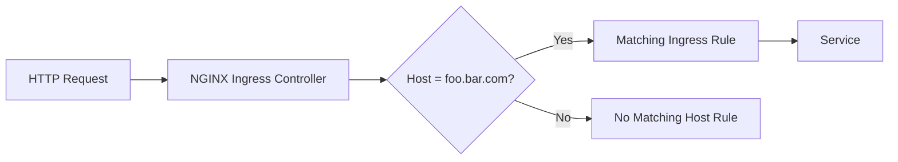

---

# 🛣️ 12. Path-Based Routing

My Ingress contains:

```yaml
path: /bar
```

This means the URL path is used as part of the routing decision.

For example:

```text
foo.bar.com/bar
```

contains:

```text
Host = foo.bar.com
Path = /bar
```

### Simple Definition

> **Path-based routing means routing traffic based on the URL path.**

Example:

```text
example.com/app1 → Service 1

example.com/app2 → Service 2

example.com/api  → Service 3
```

### Flow

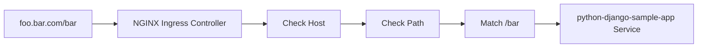

---

# 🔥 13. Host + Path Routing Together

My rule can be understood as:

```text
IF

Host = foo.bar.com

AND

Path = /bar

THEN

Route to:

python-django-sample-app

Port:

80
```

### Routing Decision

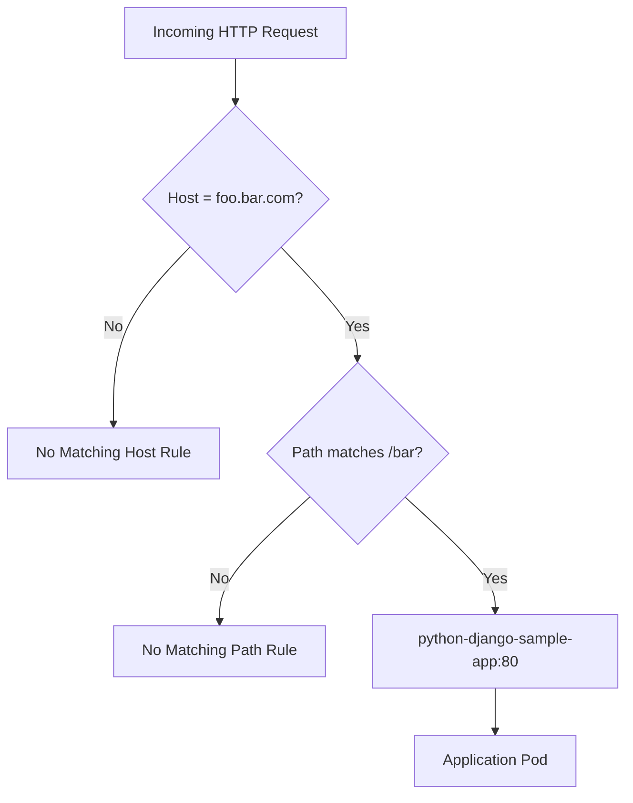

---

# 🚦 14. What Does "Ingress Routes Traffic" Mean?

When we say:

> **Ingress routes traffic**

it simply means:

> **The Ingress Controller receives an HTTP request, checks the routing rules, and forwards the request to the correct Kubernetes Service.**

The complete process is:

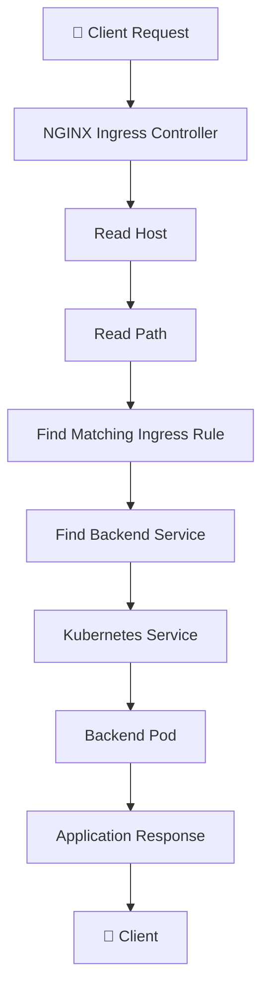

---

# 🌐 15. Enabling the NGINX Ingress Controller

I enabled the Minikube Ingress addon using:

```bash
minikube addons enable ingress
```

This enabled the NGINX Ingress Controller.

I verified it using:

```bash
kubectl get pods -A | grep nginx
```

The controller was running inside:

```text
ingress-nginx
```

namespace.

The important component was:

```text
ingress-nginx-controller
```

### Architecture

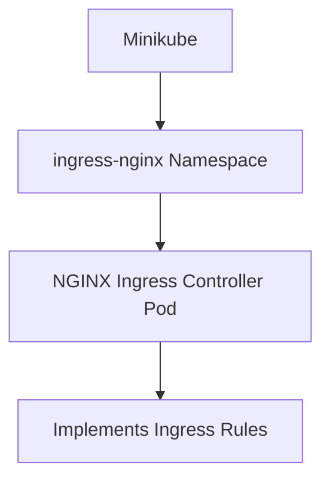

---

# 🔎 16. Applying and Checking the Ingress

I applied the configuration using:

```bash
kubectl apply -f ingress.yml
```

Then I checked:

```bash
kubectl get ingress
```

The output was similar to:

```text
NAME              CLASS    HOSTS         ADDRESS        PORTS
ingress-example   <none>   foo.bar.com   192.168.49.2   80
```

This tells me:

| Field | Meaning |
|---|---|
| `ingress-example` | Name of my Ingress |
| `foo.bar.com` | Host configured in the rule |
| `192.168.49.2` | Minikube/Ingress address |
| `80` | HTTP port |

---

# 📜 17. Checking NGINX Ingress Controller Logs

I checked the controller logs using:

```bash
kubectl logs <ingress-controller-pod> -n ingress-nginx
```

The logs showed that the NGINX Ingress Controller:

- Started NGINX
- Detected the Ingress resource
- Detected configuration changes
- Reloaded the NGINX configuration
- Updated the Ingress status

The concept is:

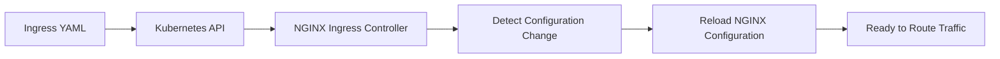

---

# 🧪 18. Testing the Application Directly

Before testing Ingress, I verified that the application itself was working.

From inside Minikube, I tested the Service:

```bash
curl http://10.105.250.39/demo/ -L
```

The application returned its HTML page.

This proved:

```text
Pod works
   ↓
Service works
   ↓
Application responds
```

This is important because it allows me to isolate problems.

If the Service works but Ingress does not work, I can focus on the Ingress configuration.

---

# ❌ 19. Why Did I Get `404 Not Found`?

I ran:

```bash
curl -L http://192.168.49.2
```

and received:

```text
<html>
<head><title>404 Not Found</title></head>
<body>
<center><h1>404 Not Found</h1></center>
<hr><center>nginx</center>
</body>
</html>
```

This was an important troubleshooting lesson.

My Ingress rule expected:

```text
Host = foo.bar.com

Path = /bar
```

But I requested:

```text
http://192.168.49.2
```

The request did not match my expected Ingress rule.

### What Happened?

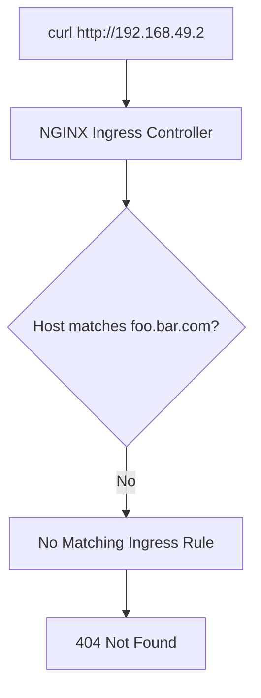

### Important Lesson

> **Reaching the Ingress Controller does not automatically mean the request will reach the application. The request must match an Ingress rule.**

---

# 🧠 20. Why `/etc/hosts` Was Needed

`foo.bar.com` was being used as a local test hostname.

I added a mapping inside:

```text
/etc/hosts
```

The mapping was:

```text
192.168.49.2    foo.bar.com
```

This means:

```text
foo.bar.com
      ↓
192.168.49.2
```

So when I use:

```text
foo.bar.com
```

my machine knows that it should resolve to:

```text
192.168.49.2
```

### Flow

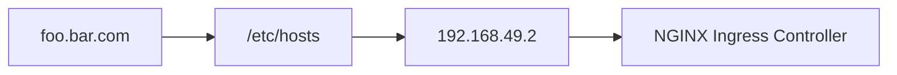

I verified it using:

```bash
ping foo.bar.com
```

and it resolved to:

```text
192.168.49.2
```

---

# 🔗 21. Why Does the Hostname Matter?

When I run:

```bash
curl http://foo.bar.com/bar
```

the HTTP request contains information equivalent to:

```text
Host: foo.bar.com
```

NGINX can inspect this Host value and compare it against:

```yaml
host: foo.bar.com
```

Then it checks the path:

```text
/bar
```

against:

```yaml
path: /bar
```

### Complete Request Flow

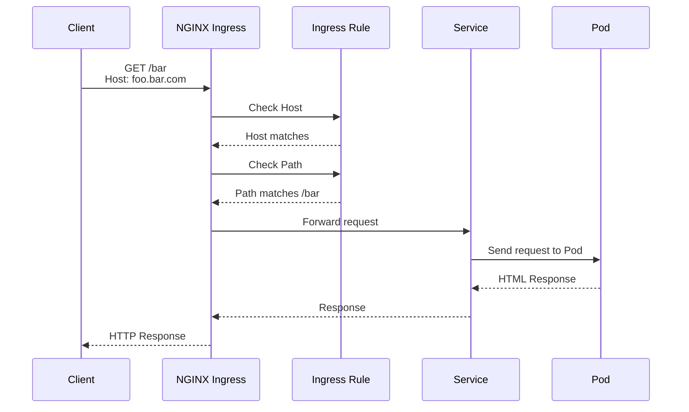

---

# 🆚 22. NodePort vs Ingress

| Feature | NodePort | Ingress |
|---|---|---|
| Main purpose | Expose a Service | Route HTTP/HTTPS traffic |
| Example | `192.168.49.2:30007` | `foo.bar.com/bar` |
| Works with Service | ✅ | ✅ |
| Host-based routing | ❌ | ✅ |
| Path-based routing | ❌ | ✅ |
| Requires Ingress Controller | ❌ | ✅ |
| Good for multiple HTTP applications | Less convenient | ✅ |
| HTTP/HTTPS routing rules | ❌ | ✅ |

### Visual Comparison

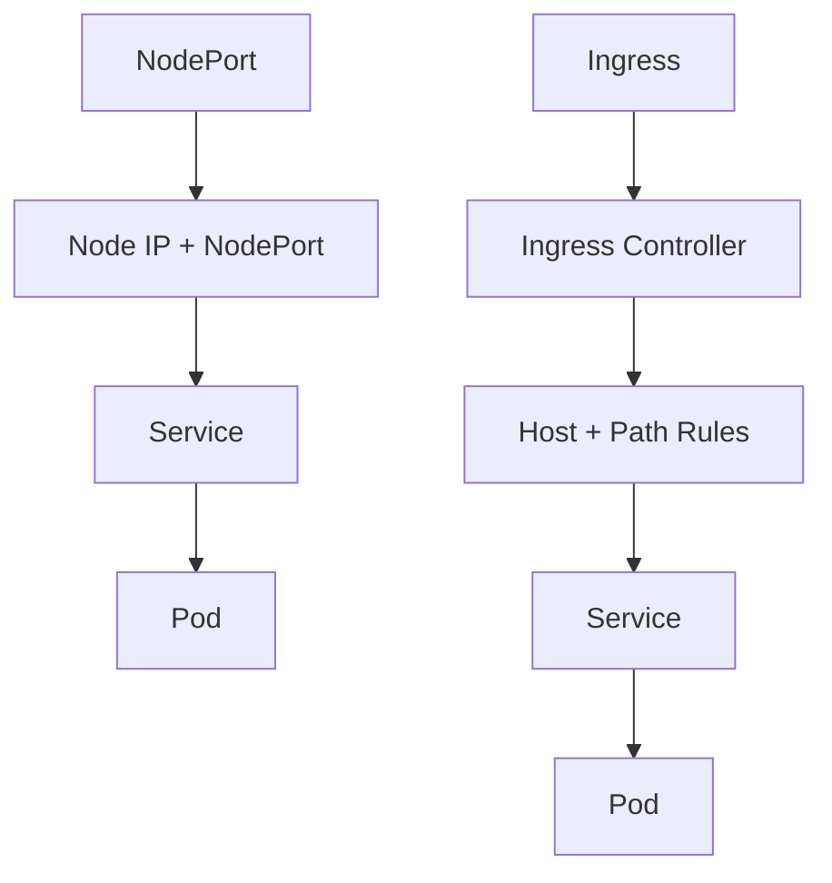

---

# ❓ 23. Why Not Create a LoadBalancer Service for Everything?

A `LoadBalancer` Service can expose a Service externally.

However, when I have many HTTP applications, I may need multiple external entry points.

Ingress provides a common HTTP/HTTPS entry point and can route traffic to multiple Services.

For example:


### Key Difference

> **LoadBalancer Service exposes a Service externally, while Ingress provides HTTP/HTTPS routing rules to Services.**

---

# 🆚 24. Host-Based vs Path-Based Routing

## 🌎 Host-Based Routing

Different hostnames can route to different Services.

```mermaid
flowchart LR
    A["👤 Client"] --> B["Ingress Controller"]

    B -->|"app1.example.com"| C["Service 1"]
    B -->|"app2.example.com"| D["Service 2"]
    B -->|"api.example.com"| E["Service 3"]
```

Example:

```text
app1.example.com → Service 1
app2.example.com → Service 2
api.example.com  → Service 3
```

### Definition

> **Host-based routing uses the hostname to decide which Service should receive the request.**

---

## 🛣️ Path-Based Routing

The same hostname can use different paths.

```mermaid
flowchart LR
    A["👤 Client"] --> B["Ingress Controller"]

    B -->|"example.com/app1"| C["Service 1"]
    B -->|"example.com/app2"| D["Service 2"]
    B -->|"example.com/api"| E["Service 3"]
```

Example:

```text
example.com/app1 → Service 1
example.com/app2 → Service 2
example.com/api  → Service 3
```

### Definition

> **Path-based routing uses the URL path to decide which Service should receive the request.**

---

# 🖥️ 25. Why Did I Use `minikube ssh`?

During the practical, I used:

```bash
minikube ssh
```

This opened a shell inside the Minikube node.

Inside Minikube, I could test the application Service:

```bash
curl http://10.105.250.39/demo/ -L
```

This was useful for testing connectivity from inside the Kubernetes node.

However:

> **I do not need to SSH into Minikube to create an Ingress.**

I can manage my Kubernetes cluster directly from the Ubuntu EC2 machine.

```text
Ubuntu EC2
     |
     ├── kubectl
     ├── minikube
     ├── curl
     └── vim
```

### Relationship

```mermaid
flowchart TB
    A["Ubuntu EC2"] --> B["Minikube Cluster"]

    A --> C["kubectl"]
    A --> D["minikube"]
    A --> E["curl"]

    B --> F["Kubernetes"]
    F --> G["Pods"]
    F --> H["Services"]
    F --> I["Ingress"]
```

### Important Point

`minikube ssh` is useful when I specifically want to enter the Minikube node.

It is **not required** to create an Ingress.

---

# 🧪 26. Important Commands

## Minikube

```bash
minikube status
```

```bash
minikube start
```

```bash
minikube ip
```

```bash
minikube ssh
```

## Kubernetes

```bash
kubectl get nodes
```

```bash
kubectl get pods
```

```bash
kubectl get pods -A
```

```bash
kubectl get svc
```

## Ingress

```bash
minikube addons enable ingress
```

```bash
kubectl apply -f ingress.yml
```

```bash
kubectl get ingress
```

```bash
kubectl describe ingress ingress-example
```

## Ingress Controller

```bash
kubectl get pods -A | grep nginx
```

```bash
kubectl logs <ingress-controller-pod> -n ingress-nginx
```

## Hostname Testing

```bash
sudo vim /etc/hosts
```

Add:

```text
192.168.49.2    foo.bar.com
```

Then:

```bash
ping foo.bar.com
```

## Application Testing

```bash
curl http://192.168.49.2:30007/demo/
```

Then test through Ingress:

```bash
curl http://foo.bar.com/bar
```

---

# 🔥 27. Complete Practical Flow

The complete sequence I followed was:

```mermaid
flowchart TD
    A["1. Verify Minikube"] --> B["2. Check Kubernetes Node"]
    B --> C["3. Verify Application Pod"]
    C --> D["4. Verify Service"]
    D --> E["5. Enable NGINX Ingress"]
    E --> F["6. Create ingress.yml"]
    F --> G["7. kubectl apply"]
    G --> H["8. kubectl get ingress"]
    H --> I["9. Check NGINX Controller"]
    I --> J["10. Configure /etc/hosts"]
    J --> K["11. Test foo.bar.com"]
    K --> L["12. Send HTTP Request"]
    L --> M["13. NGINX Checks Host"]
    M --> N["14. NGINX Checks Path"]
    N --> O["15. Route to Service"]
    O --> P["16. Service Routes to Pod"]
    P --> Q["17. Application Response"]
```

---

# 🏗️ 28. Final Architecture of My Practical

```mermaid
flowchart TB
    C["👤 Client"]

    DNS["/etc/hosts<br/>foo.bar.com → 192.168.49.2"]

    IP["Minikube<br/>192.168.49.2"]

    IC["NGINX Ingress Controller"]

    ING["Ingress Resource<br/>ingress-example"]

    SVC["Service<br/>python-django-sample-app<br/>Port 80"]

    POD["Python Application Pod"]

    APP["🌐 Application"]

    C -->|"http://foo.bar.com/bar"| DNS
    DNS --> IP
    IP --> IC
    IC --> ING
    ING -->|"Host + Path Match"| SVC
    SVC --> POD
    POD --> APP
    APP --> C
```

---

# 🧠 29. My Final Mental Model

Whenever I see:

```text
http://foo.bar.com/bar
```

I should mentally think:

```mermaid
flowchart TD
    A["👤 HTTP Request<br/>foo.bar.com/bar"] --> B["NGINX Ingress Controller"]

    B --> C["Check Host<br/>foo.bar.com"]

    C --> D["Check Path<br/>/bar"]

    D --> E["Matching Ingress Rule"]

    E --> F["python-django-sample-app Service"]

    F --> G["Application Pod"]

    G --> H["Application"]
```

The most important relationship is:

```text
INGRESS
   ↓
SERVICE
   ↓
POD
```

And:

```text
INGRESS
   =
Routing Rules

INGRESS CONTROLLER
   =
Implements the Rules

SERVICE
   =
Backend Endpoint

POD
   =
Runs the Application
```

---

# 🎯 30. What I Understand Now

I can now explain Kubernetes Ingress in simple words:

> **Ingress is a Kubernetes resource where I define HTTP/HTTPS routing rules.**

> **Ingress Controller is the component that receives traffic and implements those rules.**

> **The controller checks information such as the hostname and URL path to determine which Service should receive the request.**

> **The Service then directs the request to the appropriate Pod.**

Therefore:

```mermaid
flowchart LR
    A["👤 Client"] --> B["Ingress Controller"]
    B --> C["Ingress Rules"]
    C --> D["Service"]
    D --> E["Pod"]
    E --> F["Application"]
```

---

# 💡 31. Important Lessons From My Troubleshooting

## Lesson 1 — Check the Cluster First

If:

```bash
kubectl get pods
```

fails with:

```text
no route to host
```

check:

```bash
minikube status
```

If Minikube is stopped:

```bash
minikube start
```

---

## Lesson 2 — Reaching NGINX Does Not Mean the Application Will Respond

This:

```bash
curl http://192.168.49.2
```

returned:

```text
404 Not Found
nginx
```

This showed that NGINX was reachable.

It did **not** mean that the request matched my application routing rule.

---

## Lesson 3 — Host and Path Matter

My Ingress expected:

```text
Host = foo.bar.com

Path = /bar
```

Therefore the request should be:

```bash
curl http://foo.bar.com/bar
```

---

## Lesson 4 — `/etc/hosts` Provides Local Hostname Resolution

I mapped:

```text
192.168.49.2    foo.bar.com
```

so that:

```text
foo.bar.com
      ↓
192.168.49.2
```

---

## Lesson 5 — Ingress Does Not Replace the Service

The flow remains:

```text
Client
  ↓
Ingress Controller
  ↓
Ingress Rule
  ↓
Service
  ↓
Pod
```

---

## Lesson 6 — `minikube ssh` Is Not Required for Creating Ingress

I can manage my Kubernetes cluster directly from the Ubuntu EC2 machine.

```text
Ubuntu EC2
     |
     v
kubectl
     |
     v
Minikube Kubernetes Cluster
```

`minikube ssh` is useful when I specifically want to enter the Minikube node.

---

# 🏆 32. Key Takeaways

- ✅ Ingress is a Kubernetes API resource.
- ✅ Ingress defines HTTP/HTTPS routing rules.
- ✅ Ingress does not implement routing by itself.
- ✅ An Ingress Controller is required.
- ✅ NGINX is an example of an Ingress Controller.
- ✅ The Ingress Controller implements the Ingress rules.
- ✅ Ingress routes traffic to Services.
- ✅ Services route/select backend Pods.
- ✅ Host-based routing uses the hostname.
- ✅ Path-based routing uses the URL path.
- ✅ Host + Path can be used together.
- ✅ `/etc/hosts` can provide local hostname resolution in a lab.
- ✅ `minikube ssh` is useful for testing from inside the Minikube node.
- ✅ Kubernetes can be managed directly from the Ubuntu EC2 machine.
- ✅ NodePort and Ingress solve different problems.
- ✅ A 404 from NGINX can mean the request reached the Ingress Controller but did not match an Ingress rule.
- ✅ Before troubleshooting Kubernetes resources, verify that Minikube is running.

---

# 🎤 33. Interview Questions

### Q1. What is Kubernetes Ingress?

> Kubernetes Ingress is an API resource used to define HTTP/HTTPS routing rules for sending external traffic to Services inside a Kubernetes cluster.

### Q2. What is an Ingress Controller?

> An Ingress Controller is the component that actually receives incoming traffic and implements the routing rules defined by Ingress resources.

### Q3. Is Ingress a Load Balancer?

> Ingress is not the same thing as a LoadBalancer Service. Ingress primarily provides HTTP/HTTPS routing based on hosts and paths, while a LoadBalancer Service exposes a Service externally.

### Q4. Can I create an Ingress without an Ingress Controller?

> I can create the Ingress resource, but without an Ingress Controller there is no component to implement those routing rules.

### Q5. What does Ingress route traffic to?

> Ingress routes traffic to Kubernetes Services, and the Service then sends the traffic to backend Pods.

### Q6. What is host-based routing?

> Host-based routing routes requests based on the hostname, such as `app1.example.com` or `app2.example.com`.

### Q7. What is path-based routing?

> Path-based routing routes requests based on the URL path, such as `/app1`, `/app2`, or `/api`.

### Q8. Why did I use `/etc/hosts`?

> I used `/etc/hosts` to map my test hostname `foo.bar.com` to the Minikube IP `192.168.49.2` for local hostname resolution.

### Q9. Why did I use `minikube ssh`?

> I used `minikube ssh` to enter the Minikube node and test connectivity from inside the Kubernetes environment. It was not required to create the Ingress.

---

# 🧩 34. One-Line Interview Explanation

> **Kubernetes Ingress is an API resource used to define HTTP/HTTPS routing rules, while an Ingress Controller such as NGINX implements those rules and routes incoming requests to Kubernetes Services based on hosts and paths.**

---

# 📌 35. Final Cheat Sheet

```text
┌─────────────────────────────────────────────┐
│              KUBERNETES INGRESS             │
├─────────────────────────────────────────────┤
│                                             │
│ Ingress                                     │
│   ↓                                         │
│ Defines routing rules                       │
│                                             │
│ Ingress Controller                          │
│   ↓                                         │
│ Implements routing rules                    │
│                                             │
│ Host-Based Routing                          │
│   ↓                                         │
│ Routes using hostname                       │
│                                             │
│ Path-Based Routing                          │
│   ↓                                         │
│ Routes using URL path                       │
│                                             │
│ Service                                     │
│   ↓                                         │
│ Backend endpoint                            │
│                                             │
│ Pod                                         │
│   ↓                                         │
│ Runs application                            │
│                                             │
└─────────────────────────────────────────────┘
```

### ⭐ Remember This

```mermaid
flowchart LR
    A["👤 CLIENT"] --> B["INGRESS CONTROLLER"]
    B --> C["INGRESS RULE"]
    C --> D["HOST + PATH"]
    D --> E["SERVICE"]
    E --> F["POD"]
    F --> G["APPLICATION"]
```

```text
INGRESS
   ↓
"Which request should go where?"

INGRESS CONTROLLER
   ↓
"Actually performs the routing"

SERVICE
   ↓
"Connects to the backend Pod"

POD
   ↓
"Runs the application"
```

---

<p align="center">

# 🎉 DAY 38 COMPLETE

### Kubernetes Ingress — Learned, Practiced & Documented

**Ingress • Ingress Controller • NGINX • Host Routing • Path Routing • Services • Minikube**

</p>
