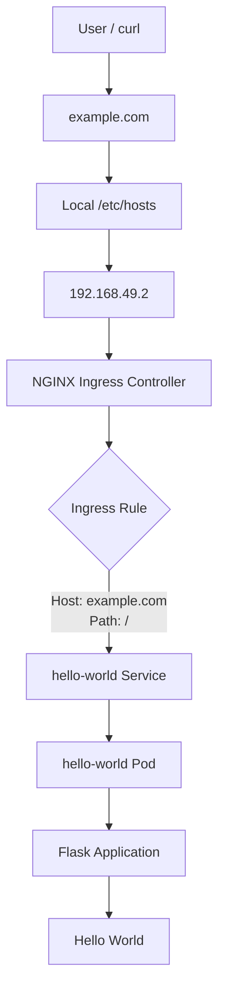
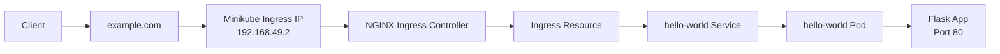
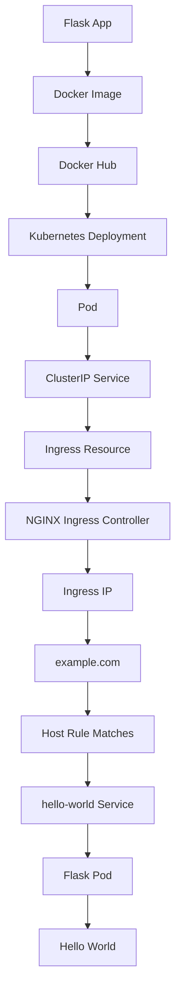

<div align="center">

#  Kubernetes Ingress — Flask Application Practical

</div>

<div align="center">

# 🌐 Kubernetes Ingress with Flask

### Flask → Docker → Docker Hub → Deployment → Pod → Service → Ingress → NGINX Ingress Controller → Host-Based Routing

</div>

---

## 📌 What We Built

In this practical, I deployed a simple Flask application inside Kubernetes and exposed it through a Kubernetes Service and finally through an NGINX Ingress Controller.

The complete journey was:

```text
Flask Application
       ↓
Docker Image
       ↓
Docker Hub
       ↓
Kubernetes Deployment
       ↓
Pod
       ↓
ClusterIP Service
       ↓
Ingress Resource
       ↓
NGINX Ingress Controller
       ↓
Ingress IP
       ↓
example.com
       ↓
Hello, World!
```

---

# 1️⃣ Flask Application

I created a simple Flask application that returns:

```text
Hello, World!
```

### `app.py`

```python
from flask import Flask

app = Flask(__name__)

@app.route('/')
def hello_world():
    return 'Hello, World!'

if __name__ == '__main__':
    app.run(host='0.0.0.0', port=80)
```

The application listens on:

```text
Port: 80
```

I created the files using Vim:

```bash
vim app.py
vim Dockerfile
vim requirements.txt
```

My project structure became:

```text
Flask/
├── Dockerfile
├── app.py
├── requirements.txt
└── k8s/
    ├── deployment.yaml
    ├── service.yaml
    └── ingress.yaml
```

---

# 2️⃣ Dockerfile

My Dockerfile uses Python as the base image and installs Flask from `requirements.txt`.

```dockerfile
# Use the official image as a parent image
FROM python:3.7-slim

# Set the working directory in the container
WORKDIR /app

# Copy the dependencies file to the working directory
COPY requirements.txt .

# Install any needed packages specified in requirements.txt
RUN pip install --no-cache-dir -r requirements.txt

# Copy the content of the local src directory to the working directory
COPY . .

# Run app.py when the container launches
CMD ["python", "app.py"]
```

---

# 3️⃣ Requirements File

### `requirements.txt`

```text
Flask==2.2.5
```

This tells Docker to install Flask when building the image.

---

# 4️⃣ Build and Push Docker Image

After creating the application files, I created the Docker image and pushed it to Docker Hub.

My image name was:

```text
yuvi2102/cka-ingress-demo:v1
```

I logged into Docker Hub:

```bash
docker login
```

Then pushed the image:

```bash
docker push yuvi2102/cka-ingress-demo:v1
```

The push was successful:

```text
v1: digest: sha256:4684fcb449993ae4065a887a63b0268d2c24f7b9e5eeee258376534f55ea08c9
```

### 🧠 Why did we push the image?

Kubernetes needs to pull the container image to create our application Pod.

```text
Dockerfile
    ↓
Docker Image
    ↓
Docker Hub
    ↓
Kubernetes
    ↓
Pod
```

---

# 5️⃣ Kubernetes Deployment

Inside the `k8s` directory:

```bash
cd k8s
```

I created:

```bash
vim deployment.yaml
```

### `deployment.yaml`

```yaml
apiVersion: apps/v1
kind: Deployment

metadata:
  name: hello-world
  labels:
    app: hello-world

spec:
  replicas: 1

  selector:
    matchLabels:
      app: hello-world

  template:
    metadata:
      labels:
        app: hello-world

    spec:
      containers:
        - name: hello-world
          image: yuvi2102/cka-ingress-demo:v1
          ports:
            - containerPort: 80
```

I applied it:

```bash
kubectl apply -f deployment.yaml
```

Output:

```text
deployment.apps/hello-world created
```

Then I checked the Deployment:

```bash
kubectl get deploy
```

and checked the Pods:

```bash
kubectl get pods
```

The Pod was:

```text
hello-world-xxxxx    1/1    Running
```

### 🧠 What happened?

The Deployment created a Pod, and the Pod started our Flask container.

```text
Deployment
     ↓
Pod
     ↓
Flask Container
     ↓
Flask Application
```

---

# 6️⃣ Kubernetes Service

After the Pod was running, I created a Service.

```bash
vim service.yaml
```

### `service.yaml`

```yaml
apiVersion: v1
kind: Service

metadata:
  name: hello-world

spec:
  selector:
    app: hello-world

  ports:
    - protocol: TCP
      port: 80
      targetPort: 80
```

I applied it:

```bash
kubectl apply -f service.yaml
```

Then:

```bash
kubectl get svc
```

The Service received a ClusterIP similar to:

```text
hello-world    ClusterIP    10.99.192.205    80/TCP
```

---

# 7️⃣ 🧠 Important — Service Selector and Pod Labels

This was one of the important things I learned.

My Pod has:

```yaml
labels:
  app: hello-world
```

My Service has:

```yaml
selector:
  app: hello-world
```

They must match.

```text
Pod
└── label
    app: hello-world
           ▲
           │ MATCH
           ▼
Service
└── selector
    app: hello-world
```

Because they match, the Service knows which Pod should receive traffic.

---

# 8️⃣ Understanding `port` and `targetPort`

The Service contains:

```yaml
ports:
  - port: 80
    targetPort: 80
```

### `port`

```yaml
port: 80
```

This is the port exposed by the Kubernetes Service.

### `targetPort`

```yaml
targetPort: 80
```

This is the port on the Pod/container where our application is running.

Therefore:

```text
Client
   ↓
Service :80
   ↓
Pod :80
   ↓
Flask :80
```

---

# 9️⃣ Testing the ClusterIP

The Service had a ClusterIP:

```text
10.99.192.205
```

I tried:

```bash
curl 10.99.192.205
```

but it did not return the expected response from my current shell/network context.

This taught me that a ClusterIP is intended for communication inside the Kubernetes cluster.

So we used a temporary curl Pod.

---

# 🔟 Temporary Curl Pod Method

First I checked Minikube:

```bash
minikube status
```

The cluster was running:

```text
minikube
type: Control Plane
host: Running
kubelet: Running
apiserver: Running
kubeconfig: Configured
```

Then I created a temporary curl Pod:

```bash
kubectl run curl --image=curlimages/curl -it --rm -- sh
```

### Understanding the command

```text
kubectl
    ↓
Kubernetes CLI

run
    ↓
Create a Pod

curl
    ↓
Pod name

--image=curlimages/curl
    ↓
Use the curl container image

-it
    ↓
Interactive terminal

--rm
    ↓
Delete the temporary Pod after exiting

-- sh
    ↓
Open a shell inside the Pod
```

Inside the temporary Pod:

```bash
curl http://10.99.192.205
```

Output:

```text
Hello, World!
```

### 🧠 Why did this work?

The temporary curl Pod was running inside the Kubernetes cluster network.

```text
Temporary Curl Pod
        ↓
ClusterIP
        ↓
hello-world Service
        ↓
hello-world Pod
        ↓
Flask Application
        ↓
Hello, World!
```

When finished:

```bash
exit
```

Because we used:

```bash
--rm
```

the temporary curl Pod was automatically deleted.

---

# 1️⃣1️⃣ Another Method — Port Forwarding

We also learned another way to test the Service.

```bash
kubectl port-forward svc/hello-world 8080:80
```

This means:

```text
localhost:8080
      ↓
hello-world Service:80
      ↓
Pod:80
      ↓
Flask
```

Then from another terminal:

```bash
curl http://localhost:8080
```

Expected:

```text
Hello, World!
```

### 🧠 Two methods to test the ClusterIP

#### Method 1 — Temporary Curl Pod

```bash
kubectl run curl --image=curlimages/curl -it --rm -- sh
```

Then:

```bash
curl http://10.99.192.205
```

#### Method 2 — Port Forward

```bash
kubectl port-forward svc/hello-world 8080:80
```

Then:

```bash
curl http://localhost:8080
```

---

# 1️⃣2️⃣ Creating the Ingress Resource

Now I moved to the main concept: **Ingress**.

I created:

```bash
vim ingress.yaml
```

### `ingress.yaml`

```yaml
apiVersion: networking.k8s.io/v1
kind: Ingress

metadata:
  name: hello-world
  annotations:
    nginx.ingress.kubernetes.io/rewrite-target: /

spec:
  ingressClassName: nginx

  rules:
    - host: "example.com"

      http:
        paths:
          - path: /
            pathType: Prefix

            backend:
              service:
                name: hello-world
                port:
                  number: 80
```

I applied it:

```bash
kubectl apply -f ingress.yaml
```

Output:

```text
ingress.networking.k8s.io/hello-world created
```

Then:

```bash
kubectl get ingress
```

Initially I got something like:

```text
NAME          CLASS    HOSTS         ADDRESS    PORTS
hello-world   nginx    example.com              80
```

The important observation was:

```text
ADDRESS
<empty>
```

---

# 1️⃣3️⃣ 🧠 Why Was the Ingress ADDRESS Empty?

This was one of the most important concepts I understood.

I had created the **Ingress resource**, but nobody was actually watching and implementing that resource.

So I needed an:

# NGINX Ingress Controller

The simple difference is:

```text
Ingress
    =
Routing Configuration / Rules

Ingress Controller
    =
Actual component that watches
and implements those rules
```

So:

```text
Ingress Resource
       ↓
"example.com → hello-world Service"
       ↓
NGINX Ingress Controller
       ↓
Actually handles the traffic
```

---

# 1️⃣4️⃣ Ingress vs Ingress Controller

This distinction is extremely important.

### Ingress

Ingress is the configuration.

For example:

```text
example.com
     ↓
hello-world Service
```

### Ingress Controller

The controller is the actual software that watches Ingress resources and implements the routing rules.

In our practical:

```text
NGINX = Ingress Controller
```

Therefore:

```text
Ingress Resource
      ↓
NGINX Ingress Controller
      ↓
NGINX handles incoming traffic
```

---

# 1️⃣5️⃣ Installing NGINX Ingress Controller in Minikube

For this practical, I used the NGINX Ingress Controller provided by Minikube.

A useful thing I learned was:

> When I need to install/configure something in Kubernetes, I should search the official Kubernetes documentation first.

For this specific practical, I can search:

```text
Kubernetes NGINX Ingress Controller Minikube
```

The Minikube documentation shows the NGINX Ingress Controller addon.

I enabled it using:

```bash
minikube addons enable ingress
```

Output included:

```text
Using image registry.k8s.io/ingress-nginx/controller:v1.14.3
```

and finally:

```text
The 'ingress' addon is enabled
```

---

# 1️⃣6️⃣ Verify NGINX Ingress Controller

I checked:

```bash
kubectl get pods -n ingress-nginx
```

I saw:

```text
NAME
ingress-nginx-admission-create-xxxxx
ingress-nginx-admission-patch-xxxxx
ingress-nginx-controller-xxxxx
```

The important Pod is:

```text
ingress-nginx-controller
```

and it was:

```text
1/1    Running
```

### 🧠 This is the actual NGINX Ingress Controller.

It watches the Ingress resources and configures NGINX according to the routing rules.

---

# 1️⃣7️⃣ Check Ingress Again

After the NGINX Ingress Controller was running:

```bash
kubectl get ingress
```

I finally received an ADDRESS:

```text
NAME          CLASS    HOSTS         ADDRESS        PORTS
hello-world   nginx    example.com   192.168.49.2   80
```

Our Ingress address was:

```text
192.168.49.2
```

---

# 1️⃣8️⃣ Check NGINX Ingress Controller Service

I ran:

```bash
kubectl get svc -n ingress-nginx
```

I saw:

```text
NAME                       TYPE       CLUSTER-IP      EXTERNAL-IP   PORT(S)

ingress-nginx-controller   NodePort   10.105.181.80   <none>
80:32326/TCP,443:32317/TCP
```

So the NGINX controller Service was using NodePort.

```text
HTTP
80 → 32326

HTTPS
443 → 32317
```

---

# 1️⃣9️⃣ Changing Service Type

Another concept I learned was that sometimes we may need to change a Service type.

For example:

```yaml
type: LoadBalancer
```

can be changed to:

```yaml
type: NodePort
```

depending on the environment and requirement.

### LoadBalancer

```text
type: LoadBalancer
```

Requests an external load-balancing mechanism from the underlying environment.

### NodePort

```text
type: NodePort
```

Exposes the Service through a port on the Kubernetes node.

Example:

```text
Service Port 80
      ↓
NodePort 32326
```

---

# 2️⃣0️⃣ Editing the NGINX Ingress Controller Service

The command we learned was:

```bash
kubectl edit svc ingress-nginx-controller -n ingress-nginx
```

### 🧠 Understanding the entire command

```text
kubectl
   ↓
Kubernetes command-line tool

edit
   ↓
Modify an existing Kubernetes resource

svc
   ↓
Service

ingress-nginx-controller
   ↓
Name of the Service

-n ingress-nginx
   ↓
Namespace containing the Service
```

So the complete meaning is:

> Open the `ingress-nginx-controller` Service inside the `ingress-nginx` namespace and allow me to modify it.

---

# 2️⃣1️⃣ Testing the Ingress IP Directly

After receiving:

```text
192.168.49.2
```

I tried:

```bash
curl 192.168.49.2
```

I received:

```html
<html>
<head><title>404 Not Found</title></head>
<body>
<center><h1>404 Not Found</h1></center>
<hr><center>nginx</center>
</body>
</html>
```

At first this looked like an NGINX problem.

But NGINX was actually working.

The actual problem was **Host-Based Routing**.

---

# 2️⃣2️⃣ 🧠 Why Did `curl 192.168.49.2` Return 404?

Our Ingress configuration contains:

```yaml
host: "example.com"
```

Therefore NGINX expects:

```text
Host: example.com
```

But when I ran:

```bash
curl 192.168.49.2
```

I was accessing the IP directly.

The request therefore did not match the Host rule:

```text
Expected:
example.com

Received:
192.168.49.2
```

So:

```text
curl 192.168.49.2
        ↓
NGINX Ingress Controller
        ↓
Host does not match example.com
        ↓
No matching Ingress rule
        ↓
404 Not Found
```

### 🔥 Important realization

The `404 Not Found` actually proved that the request **reached NGINX**.

NGINX was running.

The problem was that the request did not contain the Host expected by our Ingress rule.

---

# 2️⃣3️⃣ Testing with `curl --resolve`

To solve this temporarily, I used:

```bash
curl --resolve example.com:80:192.168.49.2 http://example.com
```

### Understanding `--resolve`

The format is:

```text
--resolve HOST:PORT:IP
```

So:

```text
--resolve example.com:80:192.168.49.2
```

means:

> For this curl request, temporarily resolve `example.com` to `192.168.49.2` on port `80`.

This allows us to reach:

```text
192.168.49.2
```

while still sending:

```text
Host: example.com
```

Therefore the NGINX Ingress Controller can match:

```yaml
host: "example.com"
```

The complete flow becomes:

```text
curl
 ↓
example.com
 ↓
192.168.49.2
 ↓
NGINX Ingress Controller
 ↓
Host = example.com
 ↓
Ingress rule matches
 ↓
hello-world Service
 ↓
hello-world Pod
 ↓
Flask Application
 ↓
Hello, World!
```

Result:

```text
Hello, World!
```

---

# 2️⃣4️⃣ `/etc/hosts` Method

We also learned another method.

Open:

```bash
sudo vim /etc/hosts
```

Add:

```text
192.168.49.2    example.com
```

This creates a local hostname-to-IP mapping:

```text
example.com
     ↓
192.168.49.2
```

Now we can simply run:

```bash
curl http://example.com
```

and receive:

```text
Hello, World!
```

---

# 2️⃣5️⃣ `--resolve` vs `/etc/hosts`

| Method | Meaning |
|---|---|
| `curl --resolve` | Temporary hostname → IP mapping for a curl request |
| `/etc/hosts` | Local hostname → IP mapping |
| DNS | Real hostname → IP resolution |

### Temporary method

```bash
curl --resolve example.com:80:192.168.49.2 http://example.com
```

### `/etc/hosts` method

```text
192.168.49.2    example.com
```

Then:

```bash
curl http://example.com
```

---

# 2️⃣6️⃣ Final Successful Test 🎉

After mapping:

```text
192.168.49.2    example.com
```

I ran:

```bash
curl http://example.com
```

and finally received:

```text
Hello, World!
```

🎉 The complete Ingress routing setup worked.

---

# 2️⃣7️⃣ Complete Traffic Flow



---

# 2️⃣8️⃣ Complete Kubernetes Architecture



---

# 2️⃣9️⃣ Host-Based Routing

Our Ingress uses:

```yaml
host: "example.com"
```

This is **host-based routing**.

The hostname determines where traffic goes.

For example:

```text
example.com
     ↓
Frontend Service

api.example.com
     ↓
API Service

shop.example.com
     ↓
Shop Service
```

Our practical:

```text
example.com
     ↓
hello-world Service
```

---

# 3️⃣0️⃣ Path-Based Routing

Ingress can also route based on paths.

For example:

```text
example.com/
       ↓
frontend Service

example.com/api
       ↓
backend Service

example.com/admin
       ↓
admin Service
```

Our current Ingress uses:

```yaml
path: /
pathType: Prefix
```

So requests matching `/` are routed to:

```text
hello-world Service
```

---

# 3️⃣1️⃣ Backend Understanding

Our Ingress contains:

```yaml
backend:
  service:
    name: hello-world
    port:
      number: 80
```

This means:

> If the Host and Path match, send the request to the `hello-world` Service on port `80`.

Important:

```text
Ingress
   ↓
Service
   ↓
Pod
```

Ingress routes traffic to the **Service**, not directly to the Pod.

---

# 3️⃣2️⃣ Why Ingress Is Useful

Without Ingress, multiple applications might need separate external entry points:

```text
Application 1 → LoadBalancer
Application 2 → LoadBalancer
Application 3 → LoadBalancer
```

With Ingress:

```text
                    ┌──→ Service 1
                    │
Client → Ingress ───┼──→ Service 2
                    │
                    └──→ Service 3
```

For example:

```text
example.com/api
       ↓
API Service

example.com/web
       ↓
Web Service

example.com/admin
       ↓
Admin Service
```

So a single Ingress entry point can route traffic to multiple Services.

---

# 3️⃣3️⃣ Troubleshooting Journey

## ❌ Problem 1 — ClusterIP Curl Did Not Work

I tried:

```bash
curl 10.99.192.205
```

### Solution

I created a temporary curl Pod:

```bash
kubectl run curl --image=curlimages/curl -it --rm -- sh
```

Then:

```bash
curl http://10.99.192.205
```

Result:

```text
Hello, World!
```

### Alternative

Port forwarding:

```bash
kubectl port-forward svc/hello-world 8080:80
```

Then:

```bash
curl http://localhost:8080
```

---

## ❌ Problem 2 — Ingress ADDRESS Was Empty

Initially:

```text
NAME          CLASS    HOSTS         ADDRESS
hello-world   nginx    example.com
```

### Reason

The Ingress resource existed, but an Ingress Controller was not yet implementing the rules.

### Solution

Enable NGINX:

```bash
minikube addons enable ingress
```

Verify:

```bash
kubectl get pods -n ingress-nginx
```

---

## ❌ Problem 3 — Ingress IP Returned 404

I ran:

```bash
curl 192.168.49.2
```

and got:

```text
404 Not Found
```

### Reason

The Ingress expected:

```text
Host: example.com
```

but I accessed the IP directly.

### Solution 1 — `--resolve`

```bash
curl --resolve example.com:80:192.168.49.2 http://example.com
```

### Solution 2 — `/etc/hosts`

Add:

```text
192.168.49.2    example.com
```

Then:

```bash
curl http://example.com
```

Result:

```text
Hello, World!
```

---

# 3️⃣4️⃣ Important Commands to Remember

### Check Deployments

```bash
kubectl get deploy
```

### Check Pods

```bash
kubectl get pods
```

### Check Services

```bash
kubectl get svc
```

### Check Ingress

```bash
kubectl get ingress
```

### Check NGINX Ingress Controller Pods

```bash
kubectl get pods -n ingress-nginx
```

### Check NGINX Ingress Controller Service

```bash
kubectl get svc -n ingress-nginx
```

### Enable NGINX Ingress in Minikube

```bash
minikube addons enable ingress
```

### Edit NGINX Ingress Controller Service

```bash
kubectl edit svc ingress-nginx-controller -n ingress-nginx
```

### Temporary Curl Pod

```bash
kubectl run curl --image=curlimages/curl -it --rm -- sh
```

### Port Forward

```bash
kubectl port-forward svc/hello-world 8080:80
```

### Test with `--resolve`

```bash
curl --resolve example.com:80:192.168.49.2 http://example.com
```

### Edit `/etc/hosts`

```bash
sudo vim /etc/hosts
```

Add:

```text
192.168.49.2    example.com
```

### Final Test

```bash
curl http://example.com
```

Expected:

```text
Hello, World!
```

---

# 3️⃣5️⃣ 🧠 Final Memory Map



---

# 3️⃣6️⃣ What I Should Remember

### 1. Deployment creates and manages Pods

```text
Deployment → Pod
```

### 2. Service provides stable access to Pods

```text
Service → Pod
```

### 3. Service selector must match Pod labels

```yaml
Pod:
  app: hello-world

Service:
  selector:
    app: hello-world
```

### 4. ClusterIP is mainly for internal cluster communication

```text
ClusterIP → Service → Pod
```

### 5. Temporary curl Pod allows testing from inside the cluster

```bash
kubectl run curl --image=curlimages/curl -it --rm -- sh
```

### 6. Port forwarding is another way to test

```bash
kubectl port-forward svc/hello-world 8080:80
```

### 7. Ingress defines HTTP/HTTPS routing rules

```text
example.com → hello-world Service
```

### 8. Ingress Controller implements those rules

```text
Ingress Resource
       ↓
NGINX Ingress Controller
```

### 9. NGINX Ingress Controller must be enabled/installed

```bash
minikube addons enable ingress
```

### 10. Direct IP access can return 404 when Host-based routing is configured

```bash
curl 192.168.49.2
```

can return:

```text
404 Not Found
```

because the Ingress expects:

```text
example.com
```

### 11. `--resolve` provides a temporary hostname mapping

```bash
curl --resolve example.com:80:192.168.49.2 http://example.com
```

### 12. `/etc/hosts` provides a local hostname mapping

```text
192.168.49.2    example.com
```

Then:

```bash
curl http://example.com
```

returns:

```text
Hello, World!
```

---

# 3️⃣7️⃣ My Complete Understanding

> I first created a simple Flask application and packaged it into a Docker image. I pushed that image to Docker Hub and used the image in a Kubernetes Deployment. The Deployment created a Pod running my Flask application.

> Then I created a ClusterIP Service to provide stable access to my Pod. I understood that the Service selector `app: hello-world` must match the Pod label `app: hello-world`. I also understood the difference between the Service `port` and `targetPort`.

> When I tried to access the ClusterIP directly, I learned that ClusterIP is intended for internal Kubernetes communication. I therefore used a temporary curl Pod to test the Service from inside the cluster. I also learned that port forwarding is another way to test the Service.

> Next, I created an Ingress resource with the rule `example.com → hello-world Service`. Initially, the Ingress had no ADDRESS. I understood that creating an Ingress resource alone is not enough because something must watch the resource and implement its routing rules.

> That component is the Ingress Controller. In this practical, I used the NGINX Ingress Controller. I enabled it using `minikube addons enable ingress` and verified it using `kubectl get pods -n ingress-nginx`.

> After the NGINX Ingress Controller was running, my Ingress received the address `192.168.49.2`.

> When I directly ran `curl 192.168.49.2`, I received a `404 Not Found`. I learned that this did not mean NGINX was broken. In fact, it proved that my request reached NGINX. The actual problem was that my Ingress configuration expected the Host `example.com`, while I was accessing the IP address directly.

> I then learned two ways to solve this hostname problem. The first is the temporary `curl --resolve` method:

```bash
curl --resolve example.com:80:192.168.49.2 http://example.com
```

> The second is to add a local hostname mapping in `/etc/hosts`:

```text
192.168.49.2    example.com
```

> After doing this, I could run:

```bash
curl http://example.com
```

> and finally receive:

```text
Hello, World!
```

> Therefore, the complete concept I learned is:

```text
Client
   ↓
example.com
   ↓
192.168.49.2
   ↓
NGINX Ingress Controller
   ↓
Ingress Rule
   ↓
hello-world Service
   ↓
hello-world Pod
   ↓
Flask Application
   ↓
Hello, World!
```

---

# 🏆 FINAL PRACTICAL SUMMARY

```text
                    KUBERNETES CLUSTER

┌─────────────────────────────────────────────────────────────┐
│                                                             │
│  Deployment                                                 │
│      │                                                      │
│      ▼                                                      │
│  hello-world Pod                                            │
│      │                                                      │
│      │ Flask :80                                            │
│      ▼                                                      │
│  hello-world Service :80                                    │
│      ▲                                                      │
│      │                                                      │
│  Ingress Resource                                           │
│      │                                                      │
│      │ Host: example.com                                    │
│      │ Path: /                                              │
│      ▼                                                      │
│  NGINX Ingress Controller                                   │
│      │                                                      │
└──────┼──────────────────────────────────────────────────────┘
       │
       ▼
192.168.49.2
       │
       ▼
example.com
       │
       ▼
Hello, World!
```

<div align="center">

# 🎉 KUBERNETES INGRESS PRACTICAL COMPLETE 🎉

### Flask → Docker → Docker Hub → Deployment → Pod → Service → Ingress → NGINX → Host Routing → Hello World

</div>
