# 🔐 Kubernetes RBAC — Complete Concept Explained

> **RBAC = Role-Based Access Control**
>
> The easiest way to understand RBAC is:
>
> **WHO can do WHAT, and WHERE?**

---

## 🔐 1. What Problem Does RBAC Solve?

Imagine your Kubernetes cluster is a company.

There are different people and applications working inside the cluster:

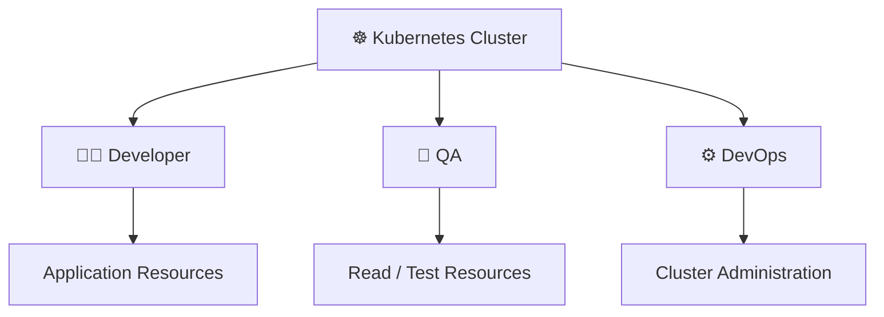

We don't want everyone to have unlimited permissions.

For example:

```text
QA
 ↓
Delete production resources ❌

Developer
 ↓
Delete important cluster resources ❌

Application
 ↓
Modify cluster configuration ❌
```

So Kubernetes needs a security mechanism that answers:

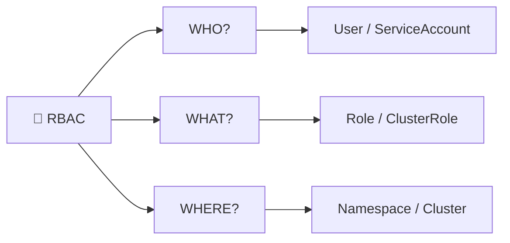

That mechanism is **RBAC**.

---

# 🧠 2. What Does RBAC Mean?

```text
RBAC
 │
 ├── Role
 ├── Based
 ├── Access
 └── Control
```

**RBAC = Role-Based Access Control**

The basic idea is:

> Give permissions based on someone's role.

For example:

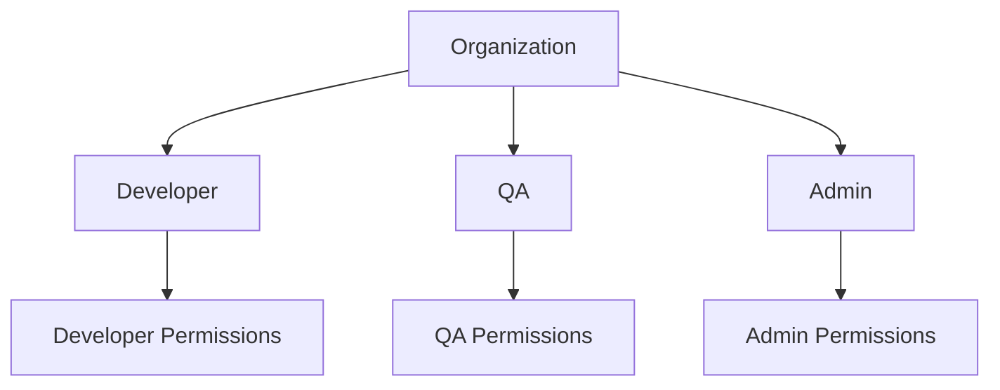

---

# 🧩 3. Understand RBAC Using a Company Example

Forget Kubernetes for a moment.

Imagine a company has an employee:

```text
Rahul
```

The company says:

> Rahul can create and delete files inside the Development department.

Now we have three important questions.

### WHO?

```text
Rahul
```

### WHAT?

```text
Create files
Delete files
```

### WHERE?

```text
Development Department
```

So:

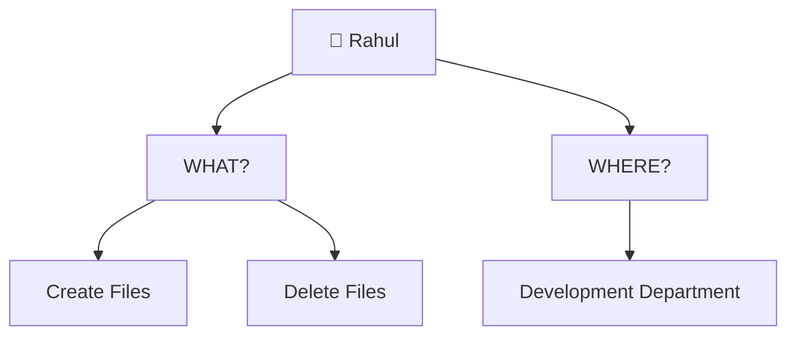

This is basically what Kubernetes RBAC does.

---

# ☸️ 4. Replace the Company With Kubernetes

In our practical, we created:

```text
WHO = foo
```

But `foo` wasn't a normal human Kubernetes user.

We created a:

```text
ServiceAccount
```

So:

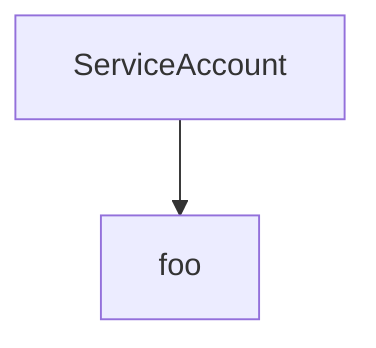

Think:

> **ServiceAccount = Identity**

---

# 1️⃣ ServiceAccount = WHO

We created:

```yaml
apiVersion: v1
kind: ServiceAccount
metadata:
  name: foo
  namespace: test
```

This created:

```text
ServiceAccount: foo
Namespace: test
```

You can think of it as:

```text
👤 foo
```

`foo` is now an identity.

But there is one very important point:

> Creating `foo` does NOT automatically give `foo` our custom permissions.

So:

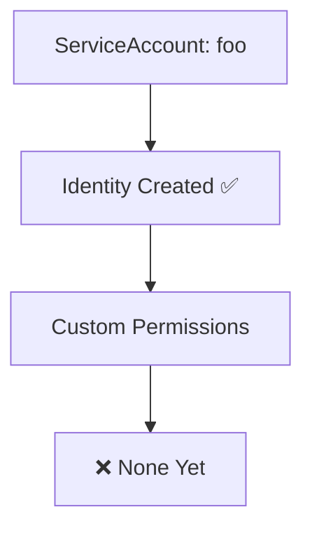

Think of it like creating an employee account:

```text
Employee: Rahul

Account created ✅

Permissions:
Nothing yet ❌
```

Same idea:

```text
ServiceAccount: foo

Created ✅

Custom permissions:
None yet ❌
```

---

# 2️⃣ We Tested `foo`

We asked Kubernetes:

```bash
kubectl auth can-i --as system:serviceaccount:test:foo get pods -n test
```

This command is simply asking:

> **Can `foo` get Pods in the `test` namespace?**

Kubernetes answered:

```text
no
```

Why?

Because:

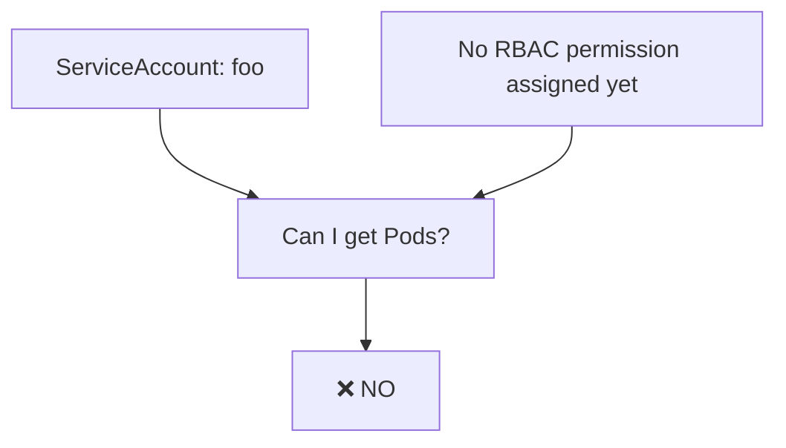

At this point:

```text
foo
 ↓
get Pods
 ↓
❌ NO
```

---

# 3️⃣ Role = WHAT Permissions?

Next, we created a:

```text
Role
```

Our Role was:

```text
Role = testadmin
```

Think of a Role as a **permission sheet**.

For example:

```text
Role: testadmin

Permissions:

Get Pods
Create Pods
Delete Pods
Create Deployments
Delete Deployments
etc.
```

Our actual Role contained:

```yaml
rules:
- apiGroups: ["*"]
  resources: ["*"]
  verbs: ["*"]
```

This was intentionally very broad for our practical.

---

# 🧠 What Does `resources: ["*"]` Mean?

It means the rule covers all resources that the rule applies to.

Conceptually:

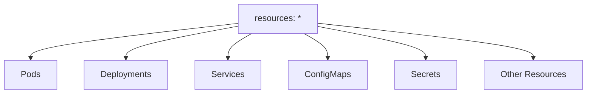

---

# 🧠 What Does `verbs: ["*"]` Mean?

It means all supported actions covered by the rule.

For example:

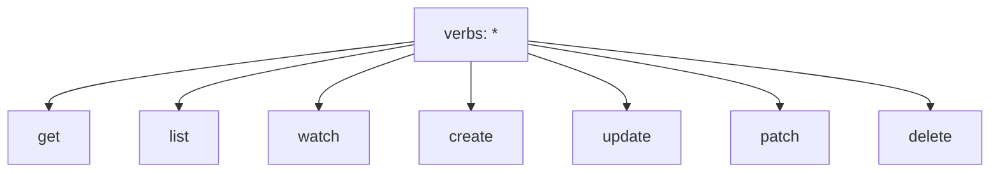

So our Role was intentionally very powerful.

Conceptually:

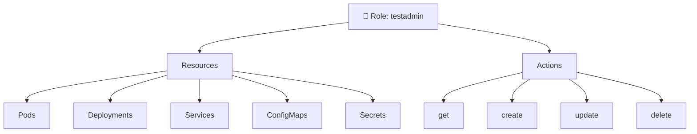

---

# ❗ 4. Creating a Role Does NOT Assign It

This is the part that causes the most confusion.

We created:

```text
foo
```

and:

```text
testadmin
```

But they were still separate.

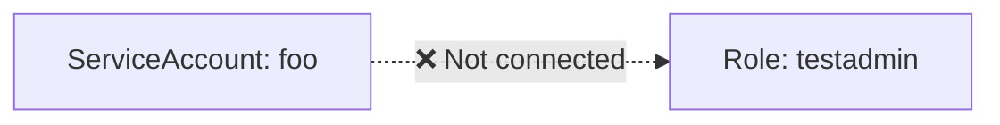

We checked again:

```bash
kubectl auth can-i --as system:serviceaccount:test:foo get pods -n test
```

Result:

```text
no
```

Why?

Because:

> **A Role only defines permissions. It does not automatically give those permissions to a ServiceAccount.**

Think of the Role as a permission card:

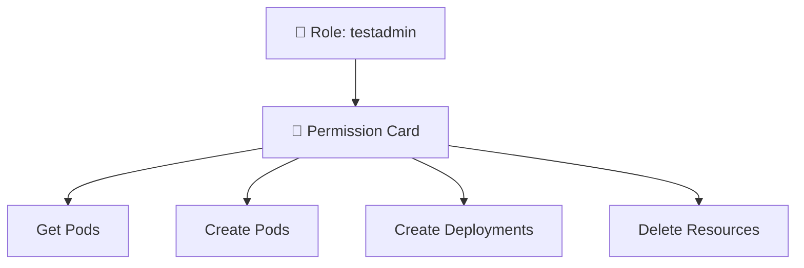

The card exists.

But:

```text
Who gets the card?
```

We haven't answered that yet.

That's why we need **RoleBinding**.

---

# 5️⃣ RoleBinding = CONNECT

We then created:

```text
RoleBinding
```

Its job is:

> **Connect WHO with WHAT permissions.**

We had:

```text
WHO
 ↓
foo
```

and:

```text
WHAT
 ↓
testadmin
```

RoleBinding connects them:


In simple English:

> Give `foo` the permissions defined in `testadmin`.

---

# 🔥 6. The Complete RBAC Chain

This is the most important diagram to remember:

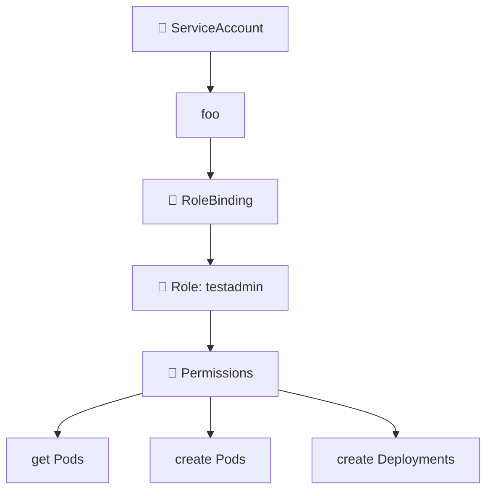

Think of it as:

```text
WHO
 ↓
foo

CONNECT
 ↓
RoleBinding

WHAT
 ↓
Role

PERMISSIONS
 ↓
get / create / delete
```

---

# 7️⃣ Now Our `yes` Makes Sense

After creating RoleBinding, we ran:

```bash
kubectl auth can-i --as system:serviceaccount:test:foo get pods -n test
```

Now Kubernetes returned:

```text
yes
```

Why?

Because Kubernetes could now follow the complete chain:

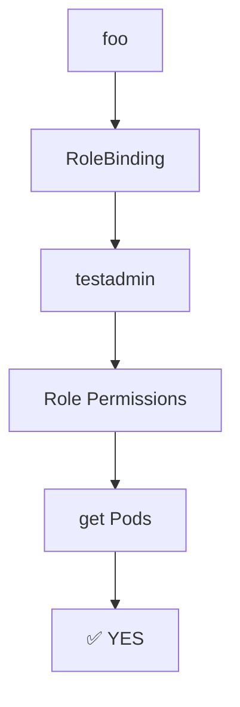

So now:

```text
foo
 ↓
RoleBinding
 ↓
testadmin
 ↓
get Pods
 ↓
✅ YES
```

---

# 8️⃣ Why Could `foo` Create Pods?

We tested:

```bash
kubectl auth can-i \
--as system:serviceaccount:test:foo \
create pods -n test
```

Result:

```text
yes
```

Why?

Because our Role contains:

```yaml
resources: ["*"]
verbs: ["*"]
```

So the requested operation:

```text
Resource = Pods
Action = create
```

is covered by the Role.

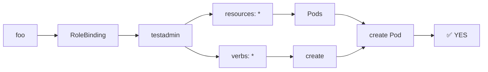

---

# 9️⃣ Why Could `foo` Create Deployments?

We ran:

```bash
kubectl auth can-i \
--as system:serviceaccount:test:foo \
create deploy -n test
```

Result:

```text
yes
```

Again:

```text
resources: *
```

covers Deployments.

And:

```text
verbs: *
```

covers create.

Therefore:


---

# 🔟 Namespace Is Extremely Important

Then we tested:

```bash
kubectl auth can-i \
--as system:serviceaccount:test:foo \
create deploy -n test-space
```

Result:

```text
no
```

Why?

Because our Role was created in:

```yaml
metadata:
  namespace: test
```

So the Role is **namespace-scoped**.

Our RoleBinding was also created in:

```text
test
```

Therefore, the permissions we created through that RoleBinding apply to:

```text
test
```

not automatically to every namespace.

---

# 🧠 Think About Namespace Like a Department

Imagine:

```text
Company
│
├── Development Department
│      │
│      └── Rahul has permissions
│
└── Finance Department
       │
       └── Rahul does not automatically have permissions
```

Kubernetes works similarly:

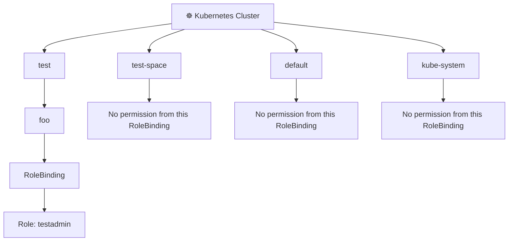

So:

```text
test
 ↓
foo → create deployment
 ↓
✅ YES
```

But:

```text
test-space
 ↓
foo → create deployment
 ↓
❌ NO
```

---

# 🧠 1️⃣1️⃣ What Does Namespace-Scoped Mean?

Our Role was:

```text
Role
 ↓
namespace: test
```

Therefore:

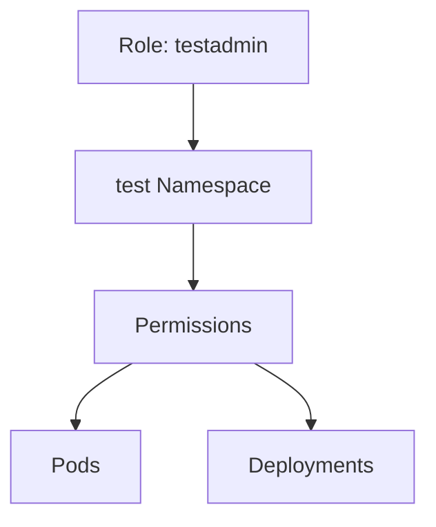

The important idea:

> A normal `Role` is namespaced.

So our practical behaved like:

```text
foo
 │
 └── test namespace
       │
       ├── get pods       ✅
       ├── create pods    ✅
       └── create deploy  ✅
```

But:

```text
foo
 │
 └── test-space
       │
       └── create deploy  ❌
```

---

# 1️⃣2️⃣ ClusterRole and ClusterRoleBinding

Then our teacher introduced:

```text
ClusterRole
ClusterRoleBinding
```

The question was:

> What if we want permissions to work across the cluster?

The basic difference is:

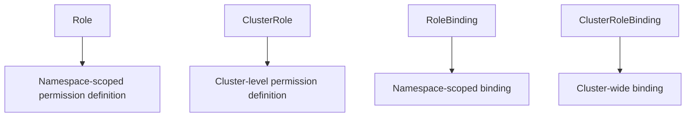

Remember:

```text
Role
 ↓
Namespace-scoped

ClusterRole
 ↓
Cluster-level permission definition
```

And:

```text
RoleBinding
 ↓
Namespace-scoped binding

ClusterRoleBinding
 ↓
Cluster-wide binding
```

---

# 🔥 1️⃣3️⃣ What Did We Do With `cluster-admin`?

We already had:

```text
foo
```

Then we created:

```text
ClusterRoleBinding
```

and connected `foo` to:

```text
cluster-admin
```

Conceptually:

```mermaid
flowchart TD
    A["ServiceAccount: foo"] --> B["ClusterRoleBinding"]
    B --> C["ClusterRole: cluster-admin"]
    C --> D["🌍 Cluster-wide authorization"]
```

This means `foo` now receives the permissions associated with the `cluster-admin` ClusterRole through the ClusterRoleBinding.

---

# ⚠️ 1️⃣4️⃣ Why Is `cluster-admin` Powerful?

`cluster-admin` is a built-in ClusterRole with extremely broad administrative permissions.

So in our lab, we effectively gave:

```text
foo
 ↓
cluster-admin permissions
```

through:

```text
ClusterRoleBinding
```

Therefore `foo` became extremely powerful.

```mermaid
flowchart TD
    A["foo"] --> B["ClusterRoleBinding"]
    B --> C["cluster-admin"]
    C --> D["Very Broad Administrative Access"]

    D --> E["test"]
    D --> F["default"]
    D --> G["kube-system"]
```

---

# 1️⃣5️⃣ We Tested `kube-system`

We ran:

```bash
kubectl auth can-i \
--as system:serviceaccount:test:foo \
create deploy -n kube-system
```

Result:

```text
yes
```

Before ClusterRoleBinding, our namespace-scoped RoleBinding only gave us the permissions associated with the `test` namespace.

Now we also had:

```mermaid
flowchart TD
    A["foo"] --> B["ClusterRoleBinding"]
    B --> C["cluster-admin"]
    C --> D["Cluster-wide authorization"]
    D --> E["kube-system"]
    E --> F["create deployment"]
    F --> G["✅ YES"]
```

---

# 1️⃣6️⃣ We Tested `default`

Then:

```bash
kubectl auth can-i \
--as system:serviceaccount:test:foo \
create deploy -n default
```

Result:

```text
yes
```

Again:

```mermaid
flowchart TD
    A["foo"] --> B["ClusterRoleBinding"]
    B --> C["cluster-admin"]
    C --> D["Cluster-wide authorization"]
    D --> E["default"]
    E --> F["create deployment"]
    F --> G["✅ YES"]
```

---

# 🚨 1️⃣7️⃣ Important: `foo` Was NOT Moved

Do NOT think:

> "foo was moved from `test` to `default`."

❌ No.

`foo` is still:

```text
ServiceAccount
name: foo
namespace: test
```

The ClusterRoleBinding simply gives that identity cluster-wide authorization through the referenced ClusterRole.

```mermaid
flowchart TD
    A["ServiceAccount"] --> B["foo"]
    B --> C["Namespace: test"]

    B --> D["ClusterRoleBinding"]
    D --> E["cluster-admin"]

    E --> F["Cluster-wide authorization"]

    F --> G["test"]
    F --> H["default"]
    F --> I["kube-system"]
```

So the identity remains:

```text
test:foo
```

but its permissions can now apply across the cluster through the ClusterRoleBinding.

---

# 🧠 1️⃣8️⃣ Before vs After ClusterRoleBinding

## Before ClusterRoleBinding

We had:

```mermaid
flowchart TD
    A["foo"] --> B["RoleBinding"]
    B --> C["Role: testadmin"]
    C --> D["test namespace"]

    D --> E["test → ✅"]
    D --> F["default → ❌"]
    D --> G["kube-system → ❌"]
```

So:

```text
test        → ✅
default     → ❌
kube-system → ❌
```

---

## After ClusterRoleBinding

We added:

```mermaid
flowchart TD
    A["foo"] --> B["ClusterRoleBinding"]
    B --> C["ClusterRole: cluster-admin"]
    C --> D["Cluster-wide authorization"]

    D --> E["test → ✅"]
    D --> F["default → ✅"]
    D --> G["kube-system → ✅"]
```

So:

```text
test        → ✅
default     → ✅
kube-system → ✅
```

---

# 🎯 1️⃣9️⃣ The Entire Practical

This is the complete story of what we did:

```mermaid
flowchart TD
    A["☸️ Kubernetes Cluster"] --> B["test Namespace"]

    B --> C["👤 ServiceAccount: foo"]

    C --> D["❌ Initially No Custom Permissions"]

    D --> E["📜 Role: testadmin"]

    E --> F["resources: *"]
    E --> G["verbs: *"]

    F --> H["Pods / Deployments / Services / etc."]
    G --> I["get / create / update / delete / etc."]

    C --> J["🔗 RoleBinding"]

    J --> K["Connects foo → testadmin"]

    K --> L["📦 test Namespace Permissions"]

    L --> M["get Pods ✅"]
    L --> N["create Pods ✅"]
    L --> O["create Deployments ✅"]

    C --> P["🔗 ClusterRoleBinding"]

    P --> Q["📜 ClusterRole: cluster-admin"]

    Q --> R["🌍 Cluster-wide Authorization"]

    R --> S["test ✅"]
    R --> T["default ✅"]
    R --> U["kube-system ✅"]
```

---

# 🧠 2️⃣0️⃣ The Four Things You Must Remember

## 1. ServiceAccount = WHO

```text
foo
```

means:

> Who are we giving permissions to?

```mermaid
flowchart TD
    A["WHO?"] --> B["ServiceAccount"]
    B --> C["foo"]
```

---

## 2. Role = WHAT

```text
testadmin
```

means:

> What permissions are available?

```mermaid
flowchart TD
    A["WHAT?"] --> B["Role: testadmin"]
    B --> C["Resources"]
    B --> D["Verbs"]

    C --> E["Pods"]
    C --> F["Deployments"]
    C --> G["Services"]

    D --> H["get"]
    D --> I["create"]
    D --> J["delete"]
```

---

## 3. RoleBinding = CONNECT

```text
foo ───── RoleBinding ───── testadmin
```

means:

> Give `foo` the permissions defined in `testadmin`.

```mermaid
flowchart LR
    A["WHO<br/>foo"] --> B["🔗 RoleBinding"] --> C["WHAT<br/>testadmin"]
```

---

## 4. Namespace = WHERE

Our Role and RoleBinding were associated with:

```text
test
```

Therefore:

```mermaid
flowchart LR
    A["foo"] --> B["test namespace"]
    B --> C["Permissions"]
    C --> D["✅"]

    A --> E["test-space"]
    E --> F["❌"]
```

---

# 🔥 2️⃣1️⃣ ClusterRoleBinding

When we use:

```text
ClusterRole
+
ClusterRoleBinding
```

we can provide cluster-wide authorization.

```mermaid
flowchart TD
    A["ServiceAccount: foo"] --> B["ClusterRoleBinding"]
    B --> C["ClusterRole"]
    C --> D["🌍 Cluster-wide authorization"]

    D --> E["test"]
    D --> F["default"]
    D --> G["kube-system"]
```

---

# 🏆 2️⃣2️⃣ The Ultimate RBAC Memory Trick

Whenever you see RBAC, ask:

```mermaid
flowchart TD
    A["🔐 RBAC"] --> B["WHO?"]
    A --> C["WHAT?"]
    A --> D["WHERE?"]

    B --> E["User / ServiceAccount"]
    C --> F["Role / ClusterRole"]
    D --> G["Namespace / Cluster"]

    E --> H["🔗 CONNECT"]
    F --> H

    H --> I["RoleBinding / ClusterRoleBinding"]

    I --> J["🔐 ACCESS"]
```

Remember:

```text
WHO?
 ↓
User / ServiceAccount

WHAT?
 ↓
Role / ClusterRole

CONNECT?
 ↓
RoleBinding / ClusterRoleBinding

WHERE?
 ↓
Namespace / Cluster
```

Or simply:

```text
WHO + WHAT + CONNECT + WHERE
```

That's RBAC.

---

# 🔥 2️⃣3️⃣ Your Practical as a Story

You can explain the entire practical like this:

> First, I created a namespace called `test`. Then I created a ServiceAccount called `foo`, which acted as my identity. Initially, `foo` had no custom permissions, so `kubectl auth can-i` returned `no`.
>
> Then I created a Role called `testadmin` containing permissions. However, `foo` still couldn't use those permissions because the Role was only defining the permissions; it wasn't assigned to `foo`.
>
> So I created a RoleBinding. The RoleBinding connected the ServiceAccount `foo` to the Role `testadmin`. After that, `foo` could get Pods, create Pods, and create Deployments inside the `test` namespace.
>
> When I tested `test-space`, the result was `no` because the RoleBinding was namespace-scoped to `test`.
>
> Finally, I created a ClusterRoleBinding connecting `foo` to the `cluster-admin` ClusterRole. This gave `foo` very broad cluster-wide authorization, which is why the same identity could perform actions in namespaces such as `kube-system` and `default`.

---

# 🎓 FINAL CONCEPT

```mermaid
flowchart LR
    A["👤 WHO<br/>ServiceAccount: foo"] --> B["🔗 CONNECT<br/>RoleBinding"]
    B --> C["📜 WHAT<br/>Role: testadmin"]
    C --> D["📦 WHERE<br/>test namespace"]
    D --> E["🔐 ACCESS"]

    A --> F["🔗 ClusterRoleBinding"]
    F --> G["📜 ClusterRole: cluster-admin"]
    G --> H["🌍 WHERE<br/>Cluster"]
    H --> E
```

### 🧠 One-line memory:

```text
ServiceAccount = WHO
Role = WHAT
RoleBinding = CONNECT
Namespace = WHERE
ClusterRoleBinding = CLUSTER-WIDE CONNECTION
```

### 🚀 What We Actually Achieved

```text
                  RBAC
                   │
                   ↓
            ServiceAccount
                 foo
                   │
          ┌────────┴────────┐
          ↓                 ↓
     RoleBinding      ClusterRoleBinding
          ↓                 ↓
    testadmin Role     cluster-admin
          ↓                 ↓
    test namespace    Whole cluster
          ↓                 ↓
       Limited       Broad access
```

**The most important thing to understand is not the YAML.**

**Understand the relationship:**

```text
WHO
 ↓
foo

WHAT
 ↓
Role

CONNECT
 ↓
Binding

WHERE
 ↓
Namespace / Cluster

        ↓

🔐 ACCESS
```
