# 🔐 Kubernetes RBAC — Practical Understanding

## 🔒 What Did We Actually Do?

We created an identity called **`foo`**, gave it some permissions, and then tested whether Kubernetes allowed it to perform actions.

Think of it like a company:

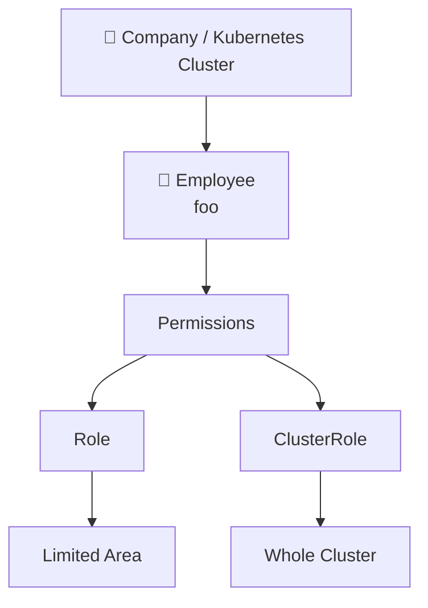

### Kubernetes Terminology

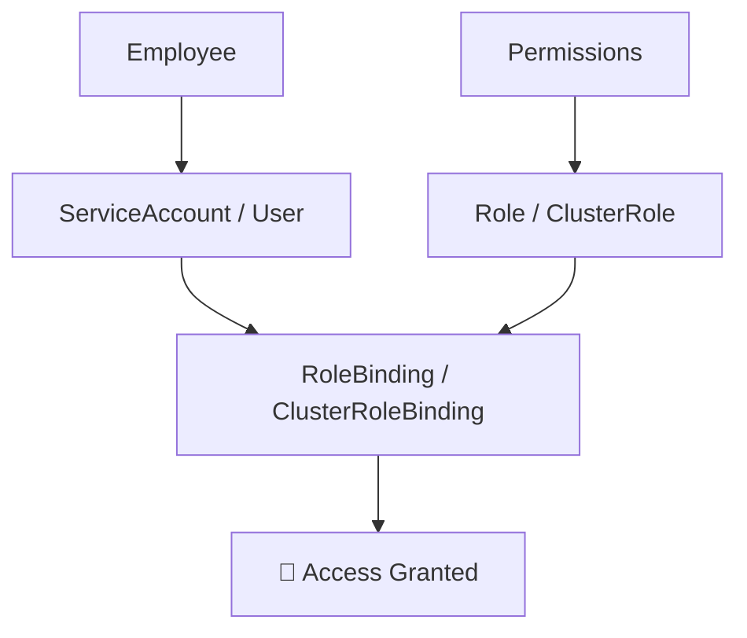

---

# 1️⃣ First, We Created a Namespace

We did:

```bash
kubectl create ns test
```

So now our cluster looked like:

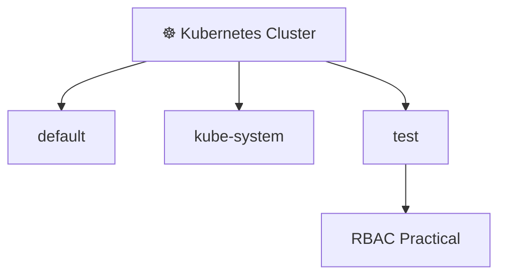

We decided to do our RBAC experiment inside the **`test` namespace**.

---

# 2️⃣ Then We Created a ServiceAccount Called `foo`

We created:

```yaml
apiVersion: v1
kind: ServiceAccount
metadata:
  name: foo
  namespace: test
```

So:

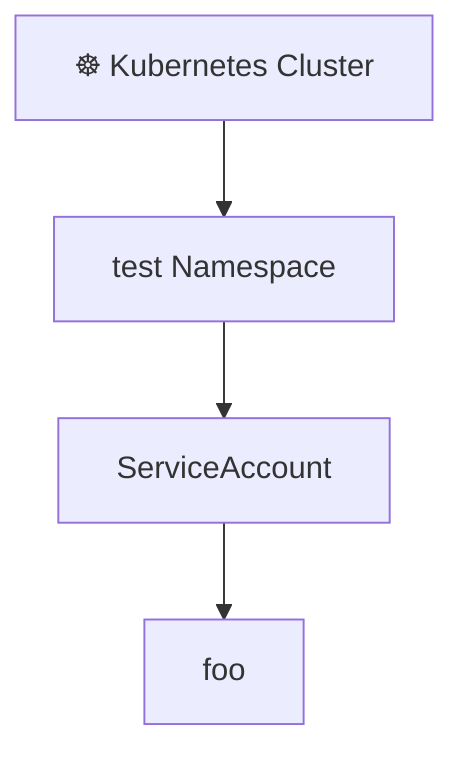

### What Is `foo`?

`foo` is an **identity**.

Think:

> `foo` = a person/application identity

But `foo` doesn't have our custom permissions yet.

---

# 3️⃣ We Asked Kubernetes: Can `foo` Get Pods?

We ran:

```bash
kubectl auth can-i \
--as system:serviceaccount:test:foo \
get pods -n test
```

Kubernetes answered:

```text
no
```

### Why?

Because we had created the identity:

```text
foo
```

but we hadn't given it our RBAC permissions.

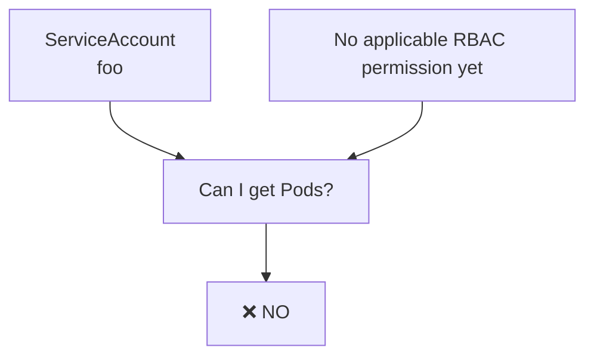

---

# 4️⃣ Then We Created a Role

We created:

```yaml
kind: Role

metadata:
  namespace: test
  name: testadmin

rules:
- apiGroups: ["*"]
  resources: ["*"]
  verbs: ["*"]
```

The Role is basically a **permission document**.

It says:

```text
Role: testadmin

Resources:
    EVERYTHING

Actions:
    EVERYTHING
```

For example:

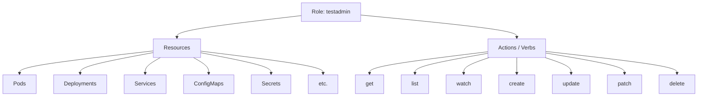

Because we used:

```yaml
resources: ["*"]
verbs: ["*"]
```

we intentionally made this Role very powerful.

---

# 5️⃣ But Then We Checked Again

We ran:

```bash
kubectl auth can-i --as system:serviceaccount:test:foo get pods -n test
```

And Kubernetes STILL said:

```text
no
```

This is the most important part of the practical.

### ❗ A Role Does NOT Automatically Give Permissions

Creating a Role only defines the permissions.

It does **not** automatically assign those permissions to `foo`.

Think about it like a permission card:

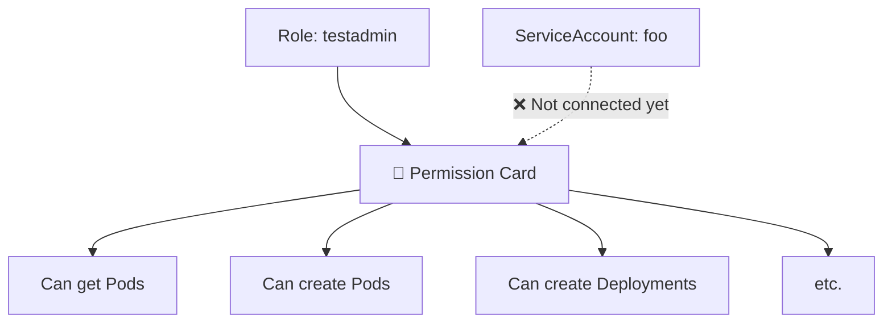

At this point:

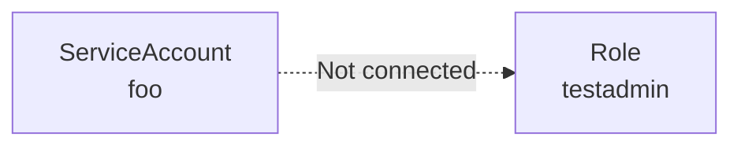

So:

```text
Role exists ✅
ServiceAccount exists ✅
Connection ❌
```

Therefore:

```text
foo → get pods → ❌ NO
```

---

# 6️⃣ Then We Created RoleBinding

This was the missing piece.

We created:

```yaml
kind: RoleBinding

metadata:
  name: testadminbinding
  namespace: test

subjects:
- kind: ServiceAccount
  name: foo
  apiGroup: ""

roleRef:
  kind: Role
  name: testadmin
  apiGroup: rbac.authorization.k8s.io
```

### RoleBinding's Job

> **Connect WHO with WHAT permissions.**


So:

```text
WHO?
 ↓
foo

WHAT?
 ↓
testadmin Role

CONNECT THEM
 ↓
RoleBinding
```

---

# 7️⃣ Now We Checked Again

We ran:

```bash
kubectl auth can-i --as system:serviceaccount:test:foo get pods -n test
```

This time:

```text
yes
```

🔥 Why?

Because now the complete RBAC chain existed:

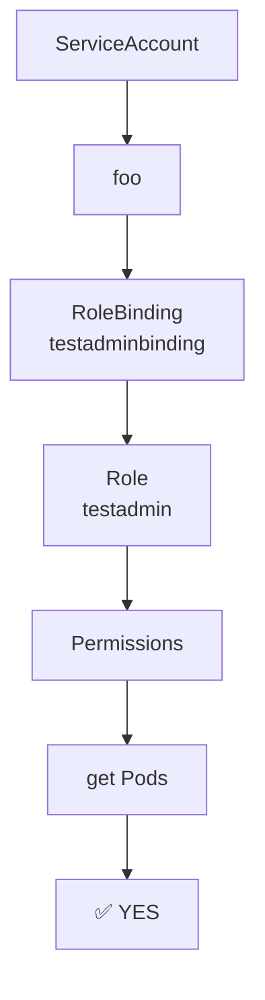

Therefore:

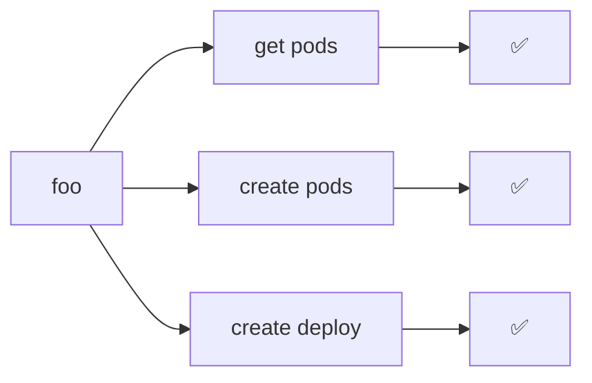

---

# 8️⃣ Why Could `foo` Create Pods?

We tested:

```bash
kubectl auth can-i \
--as system:serviceaccount:test:foo \
create pods -n test
```

Result:

```text
yes
```

Why?

Look at our Role:

```yaml
resources: ["*"]
verbs: ["*"]
```

`*` means everything covered by the rule.

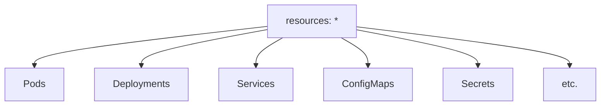

And:

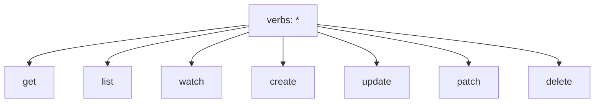

Therefore:


---

# 9️⃣ Why Could It Create Deployments?

We ran:

```bash
kubectl auth can-i \
--as system:serviceaccount:test:foo \
create deploy -n test
```

Result:

```text
yes
```

Again:

```yaml
resources: ["*"]
verbs: ["*"]
```

means the Role allows the requested action on that resource within its applicable scope.

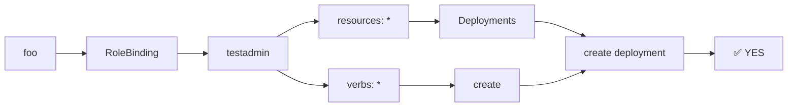

---

# 🔟 Then We Tested `test-space`

We ran:

```bash
kubectl auth can-i \
--as system:serviceaccount:test:foo \
create deploy -n test-space
```

Result:

```text
no
```

And THIS is where we learned **namespace scope**.

Our Role was:

```yaml
metadata:
  namespace: test
```

Our RoleBinding was:

```yaml
metadata:
  namespace: test
```

So the permission was associated with the `test` namespace.

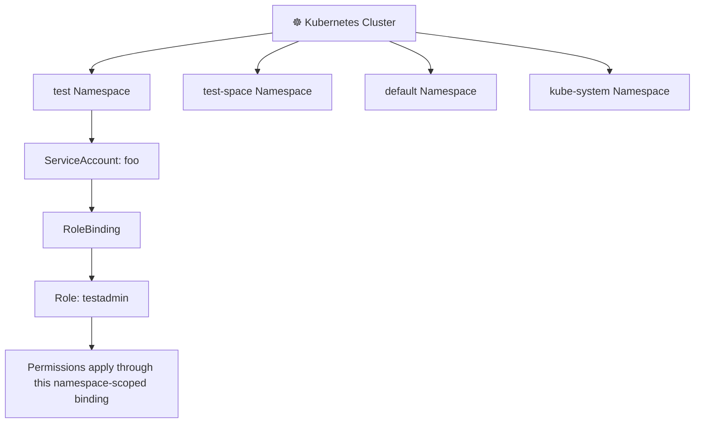

Therefore:

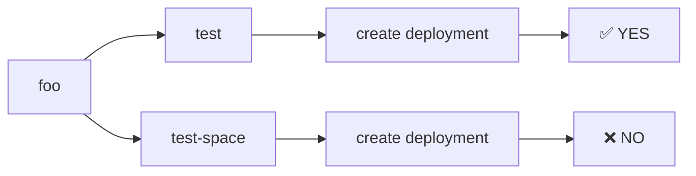

### 🧠 Important

`foo` had permission through this RoleBinding in:

```text
test
```

but not automatically in:

```text
test-space
```

---

# 1️⃣1️⃣ Then We Introduced ClusterRoleBinding

Now we wanted to show:

> "What if we want the permissions to work across the cluster?"

So we created:

```text
kind: ClusterRoleBinding
```

and connected:

```text
foo
 ↓
cluster-admin
```

The important part was:

```yaml
subjects:
- kind: ServiceAccount
  name: foo
  namespace: test
```

and:

```yaml
roleRef:
  kind: ClusterRole
  name: cluster-admin
```

So now:

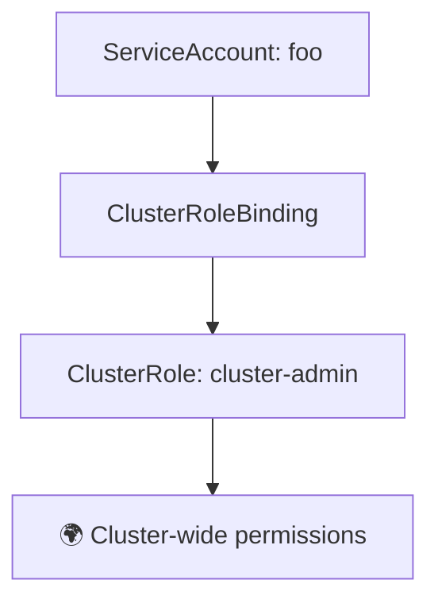

---

# 1️⃣2️⃣ What Is `cluster-admin`?

`cluster-admin` is a built-in ClusterRole with extremely broad administrative permissions.

So we basically said:

> "Take `foo` and give it the permissions of `cluster-admin` through a ClusterRoleBinding."

That is why `foo` became extremely powerful in the lab.

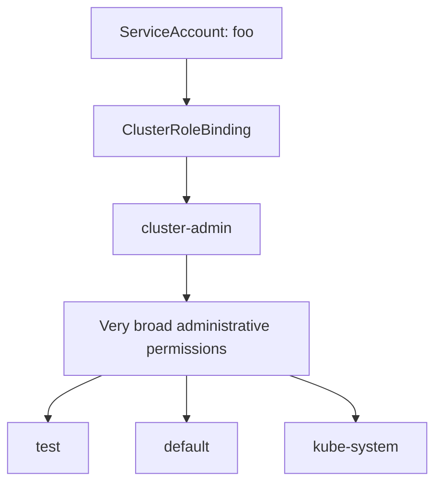

---

# 1️⃣3️⃣ Then We Tested `kube-system`

We ran:

```bash
kubectl auth can-i \
--as system:serviceaccount:test:foo \
create deploy -n kube-system
```

Result:

```text
yes
```

Before ClusterRoleBinding, `foo` didn't have that permission through our `test` Role.

Now:

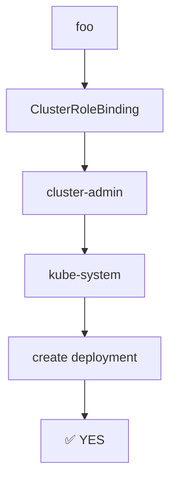

---

# 1️⃣4️⃣ Then We Tested `default`

We ran:

```bash
kubectl auth can-i \
--as system:serviceaccount:test:foo \
create deploy -n default
```

Result:

```text
yes
```

Again:

```mermaid
flowchart TD
    A["foo"] --> B["ClusterRoleBinding"]
    B --> C["cluster-admin"]
    C --> D["default"]
    D --> E["create deployment"]
    E --> F["✅ YES"]
```

---

# 🔥 So What ACTUALLY Happened?

This is the entire practical.

## Namespace-Scoped RBAC

```mermaid
flowchart TD
    A["☸️ Kubernetes Cluster"] --> B["test Namespace"]

    B --> C["ServiceAccount: foo"]

    C --> D["WHO?"]

    C --> E["RoleBinding<br/>testadminbinding"]

    E --> F["Role: testadmin"]

    F --> G["WHAT?"]

    G --> H["Permissions"]

    H --> I["get Pods"]
    H --> J["create Pods"]
    H --> K["create Deployments"]

    I --> L["✅"]
    J --> M["✅"]
    K --> N["✅"]

    E --> O["Scope: test namespace"]
```

Then we added:

## Cluster-Wide RBAC

```mermaid
flowchart TD
    A["ServiceAccount: foo"] --> B["ClusterRoleBinding"]
    B --> C["ClusterRole: cluster-admin"]
    C --> D["🌍 CLUSTER-WIDE ACCESS"]

    D --> E["test"]
    D --> F["kube-system"]
    D --> G["default"]
    D --> H["Other namespaces"]

    E --> I["✅"]
    F --> J["✅"]
    G --> K["✅"]
    H --> L["✅"]
```

---

# 🧠 The Easiest Way to Remember It

Remember these **4 things**:

## 1. ServiceAccount = WHO

```text
foo
```

means:

> Who are we giving permissions to?

```mermaid
flowchart TD
    A["WHO?"] --> B["ServiceAccount"]
    B --> C["foo"]
```

---

## 2. Role = WHAT

```text
testadmin
```

means:

> What permissions are available?

For example:

```text
get Pods
create Pods
create Deployments
...
```

```mermaid
flowchart TD
    A["WHAT?"] --> B["Role: testadmin"]
    B --> C["Resources"]
    B --> D["Verbs"]

    C --> E["Pods"]
    C --> F["Deployments"]
    C --> G["Services"]

    D --> H["get"]
    D --> I["create"]
    D --> J["delete"]
```

---

## 3. RoleBinding = CONNECT

```text
foo ───── RoleBinding ───── testadmin
```

means:

> Give `foo` the permissions defined in `testadmin`.

```mermaid
flowchart LR
    A["WHO<br/>foo"] --> B["RoleBinding"]
    B --> C["WHAT<br/>testadmin"]
    C --> D["Permissions"]
```

---

## 4. Namespace = WHERE

Our Role was created in:

```text
test
```

Therefore:

```text
foo → test → permissions ✅
```

but:

```text
foo → test-space → permissions ❌
```

```mermaid
flowchart LR
    A["foo"] --> B["test namespace"]
    B --> C["Permissions"]
    C --> D["✅"]

    A --> E["test-space"]
    E --> F["No permission from this RoleBinding"]
    F --> G["❌"]
```

---

# 🔥 Then ClusterRoleBinding

ClusterRoleBinding changes the scope of the binding:

```mermaid
flowchart TD
    A["foo"] --> B["ClusterRoleBinding"]
    B --> C["ClusterRole"]
    C --> D["Cluster-wide authorization"]

    D --> E["test"]
    D --> F["default"]
    D --> G["kube-system"]
    D --> H["Other namespaces"]
```

So now:

```text
foo → test          ✅
foo → default       ✅
foo → kube-system   ✅
```

---

# 🏆 FINAL MEMORY TRICK

Whenever you see RBAC, ask these 3 questions:

```mermaid
flowchart TD
    A["🔐 RBAC"] --> B["WHO?"]
    A --> C["WHAT?"]
    A --> D["WHERE?"]

    B --> E["User / ServiceAccount"]
    C --> F["Role / ClusterRole"]
    D --> G["Namespace / Cluster"]

    E --> H["Binding"]
    F --> H
    G --> H

    H --> I["🔐 ACCESS"]
```

Or even simpler:

```mermaid
flowchart LR
    A["WHO?"] --> B["ServiceAccount / User"]
    B --> C["CONNECT"]
    C --> D["RoleBinding / ClusterRoleBinding"]
    D --> E["WHAT?"]
    E --> F["Role / ClusterRole"]
    F --> G["WHERE?"]
    G --> H["Namespace / Cluster"]
    H --> I["🔐 ACCESS"]
```

---

# 🎯 Your Practical in One Line

> **We created a ServiceAccount `foo`, created a Role containing permissions, used RoleBinding to give those permissions to `foo` inside the `test` namespace, proved it with `kubectl auth can-i`, then created a ClusterRoleBinding connecting `foo` to the `cluster-admin` ClusterRole, which allowed `foo` to perform actions across other namespaces such as `kube-system` and `default`.**

---

<p align="center">

# 🔐 KUBERNETES RBAC PRACTICAL

### WHO → WHAT → CONNECT → WHERE

**ServiceAccount → Role → RoleBinding → Namespace Scope**

**ServiceAccount → ClusterRole → ClusterRoleBinding → Cluster-wide Scope**

</p>
