<div align="center">

# DAY 41 — KUBERNETES CONFIGMAPS & SECRETS

</div>

## 🧪 Complete Practical Session — From First Command to Secret Homework

<p align="center">

## 🟪 DevOps Course — Day 41

**ConfigMaps → Environment Variables → Volume Mounts → Secrets → Secret Homework**

</p>

---

# 🎯 WHAT THIS PRACTICAL IS ABOUT

In this practical, we learned how Kubernetes handles **application configuration** and **sensitive information**.

The teacher explained two important Kubernetes resources:

- 🟦 **ConfigMap**
- 🔐 **Secret**

The practical started with a simple application problem:

```text
🐍 Backend Application
        |
        | needs configuration
        ↓
🗄️ Database
```

The backend application may need information such as:

```text
DB_PORT
DB_HOST
DB_CONNECTION_TYPE
DB_USERNAME
DB_PASSWORD
```

Instead of hardcoding these values inside the application, Kubernetes provides resources that allow us to store configuration separately and provide it to Pods when required.

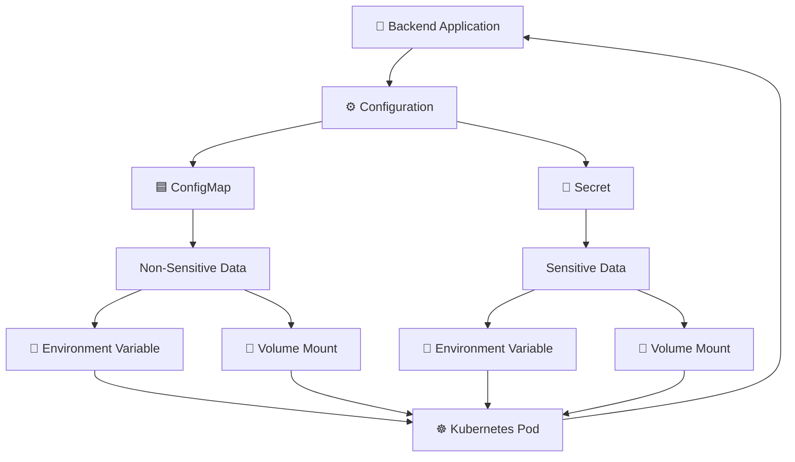

---

# 🧠 1. WHY DO WE NEED CONFIGURATION OUTSIDE THE APPLICATION?

Imagine our backend application connects to a database.

The application needs:

```text
DB_PORT
DB_USERNAME
DB_PASSWORD
```

We should not simply hardcode these values inside the application.

For example:

```python
DB_PORT = 3306
```

Imagine the database administrator changes:

```text
3306 → 3307
```

But our application still contains:

```text
3306
```

Then the application may try to connect using the wrong port.

This is why configuration should be kept outside the application.

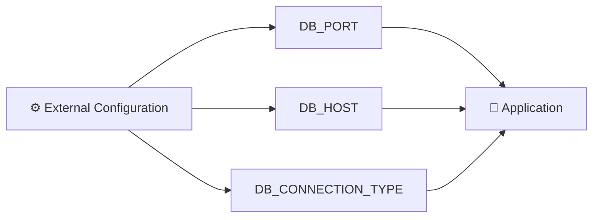

The general idea is:

```text
Application
     |
     | reads configuration
     ↓
Environment Variables / Configuration Files
```

Inside Kubernetes, ConfigMaps and Secrets help us achieve this.

---

# 🟦 2. WHAT IS A CONFIGMAP?

A **ConfigMap** is a Kubernetes resource used to store **non-sensitive configuration data**.

For example:

```text
DB_PORT = 3306
```

Our practical ConfigMap was:

```text
Name: test-cm
Key:  db-port
Value: 3306
```

Conceptually:

```text
┌──────────────────────────────┐
│ 🟦 ConfigMap: test-cm        │
│                              │
│ db-port = 3306               │
└──────────────────────────────┘
```

The application can later consume this information.

---

# 🧪 3. CHECK EXISTING DEPLOYMENTS

We first checked the Deployments already running in the Kubernetes cluster.

We accidentally typed:

```bash
KUBECTL GET DEPLOY
```

This failed:

```text
KUBECTL: command not found
```

### Why?

Linux commands are case-sensitive.

The correct command is:

```bash
kubectl get deploy
```

We got output similar to:

```text
NAME                READY   UP-TO-DATE   AVAILABLE   AGE
hello-world         1/1     1            1           39h
kubeshark-front     1/1     1            1           4d2h
kubeshark-hub       1/1     1            1           4d2h
sample-python-app   2/2     2            2           4d14h
```

Our important application was:

```text
sample-python-app
```

---

# 🧪 4. CHECK EXISTING CONFIGMAPS

We ran:

```bash
kubectl get cm
```

This displayed ConfigMaps already present in the cluster.

We eventually created our own:

```text
test-cm
```

The important part was:

```text
test-cm
   |
   └── db-port = 3306
```

---

# 📝 5. CREATE THE CONFIGMAP YAML

We opened a YAML file:

```bash
vim cm.yaml
```

Our first attempt had a YAML syntax mistake:

```yaml
apiVersion: v1
kind: ConfigMap
metadata:
  name: test-cm
data::
  db-port: "3306"
```

The mistake was:

```yaml
data::
```

There were two `:` characters.

We then ran:

```bash
kubectl apply -f cm.yaml
```

Kubernetes returned:

```text
Error from server (BadRequest): error when creating "cm.yaml":
ConfigMap in version "v1" cannot be handled as a ConfigMap:
strict decoding error: unknown field "data:"
```

### 🔥 LESSON

YAML syntax matters.

Wrong:

```yaml
data::
```

Correct:

```yaml
data:
```

---

# ✅ 6. CORRECT CONFIGMAP YAML

We corrected the file:

```yaml
apiVersion: v1
kind: ConfigMap

metadata:
  name: test-cm

data:
  db-port: "3306"
```

Then:

```bash
kubectl apply -f cm.yaml
```

Output:

```text
configmap/test-cm created
```

We verified:

```bash
kubectl get cm
```

Now `test-cm` appeared in the list.

---

# 🔎 7. DESCRIBE THE CONFIGMAP

We ran:

```bash
kubectl describe cm test-cm
```

Output included:

```text
Name:         test-cm
Namespace:    default
Labels:       <none>
Annotations:  <none>

Data
====
db-port:
----
3306

BinaryData
====

Events:  <none>
```

This confirms:

```text
ConfigMap
   |
   └── db-port = 3306
```

---

# 🐳 8. OUR SAMPLE PYTHON APPLICATION

For the practical we used the existing:

```text
Docker-Zero-to-Hero
```

repository.

We first tried:

```bash
git clone https://github.com/iam-veeramalla/Docker-Zero-to-Hero.git
```

But Git returned:

```text
fatal: destination path 'Docker-Zero-to-Hero' already exists and is not an empty directory.
```

This meant the repository was already present.

We checked:

```bash
ls
```

and saw:

```text
Docker-Zero-to-Hero
```

We checked its contents:

```bash
ls -la Docker-Zero-to-Hero
```

It contained:

```text
.git
README.md
commands.md
examples
networking.md
volumes.md
```

Then:

```bash
cd Docker-Zero-to-Hero
```

```bash
ls
```

Then:

```bash
cd examples
```

```bash
ls
```

We entered the Python application:

```bash
cd python-web-app/
```

Then:

```bash
ls
```

We saw:

```text
Dockerfile
deployment.yml
devops
requirements.txt
service.yml
```

---

# 🐍 9. OUR PYTHON APPLICATION DEPLOYMENT

Our Deployment was:

```yaml
apiVersion: apps/v1
kind: Deployment

metadata:
  name: sample-python-app
  labels:
    app: sample-python-app

spec:
  replicas: 2

  selector:
    matchLabels:
      app: sample-python-app

  template:
    metadata:
      labels:
        app: sample-python-app

    spec:
      containers:
        - name: python-app
          image: abhishekf5/python-sample-app-demo:v1

          ports:
            - containerPort: 8000
```

The important part:

```yaml
replicas: 2
```

means Kubernetes maintains two Pods.

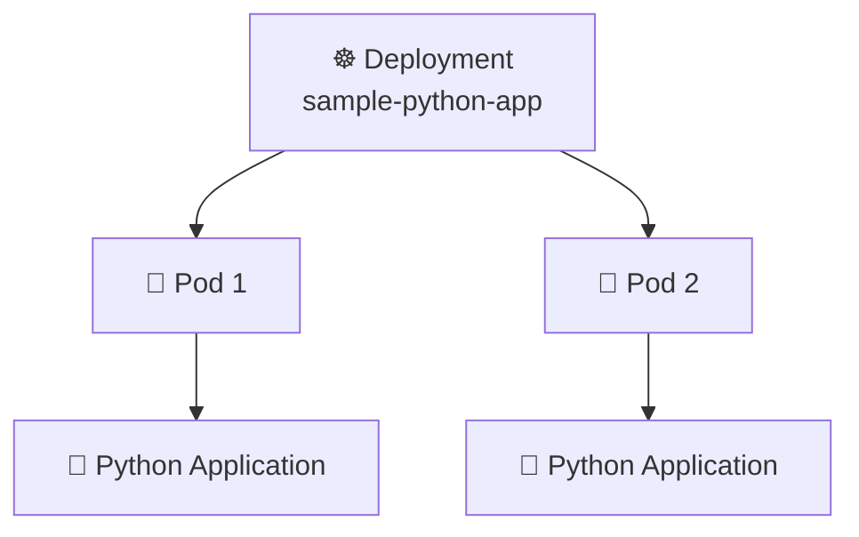

---

# 🚀 10. APPLY THE DEPLOYMENT

We ran:

```bash
kubectl apply -f deployment.yml
```

Initially:

```text
deployment.apps/sample-python-app unchanged
```

This means the Deployment already matched what was specified in the YAML.

We then checked the Pods:

```bash
kubectl get pods -w
```

We could see our two application Pods:

```text
sample-python-app-5ddcb9f87b-9l699
sample-python-app-5ddcb9f87b-m745n
```

---

# 🌱 11. CONFIGMAP AS AN ENVIRONMENT VARIABLE

Now we wanted to provide the ConfigMap value to the application as an environment variable.

We added:

```yaml
env:
  - name: DB-PORT
    valueFrom:
      configMapKeyRef:
        name: test-cm
        key: db-port
```

The important field is:

```yaml
configMapKeyRef:
```

This means:

> Get a specific key from a ConfigMap.

---

# 🧠 12. UNDERSTANDING THE CONFIGMAP ENVIRONMENT YAML

This:

```yaml
env:
  - name: DB-PORT
```

means:

```text
Create an environment variable named DB-PORT
```

This:

```yaml
valueFrom:
```

means:

```text
The value should come from another Kubernetes resource.
```

This:

```yaml
configMapKeyRef:
```

means:

```text
Get the value from a ConfigMap.
```

This:

```yaml
name: test-cm
```

means:

```text
Use the ConfigMap named test-cm.
```

This:

```yaml
key: db-port
```

means:

```text
Get the db-port key from test-cm.
```

So:

```text
🟦 test-cm
     |
     └── db-port = 3306
              |
              ↓
      configMapKeyRef
              |
              ↓
      DB-PORT=3306
              |
              ↓
         ☸️ Pod
              |
              ↓
      🐍 Application
```

---

# 🚀 13. APPLY THE UPDATED DEPLOYMENT

We ran:

```bash
kubectl apply -f deployment.yml
```

Output:

```text
deployment.apps/sample-python-app configured
```

Because the Pod template changed, Kubernetes created new Pods.

Then:

```bash
kubectl get pod -w
```

We saw new Pods such as:

```text
sample-python-app-57855c9dcc-pblsv
sample-python-app-57855c9dcc-wq7d4
```

---

# 🔎 14. ENTER THE POD

We used:

```bash
kubectl exec -it sample-python-app-57855c9dcc-pblsv -- /bin/bash
```

Inside the container we ran:

```bash
env | grep -i DB
```

Output:

```text
DB-PORT=3306
```

🔥 This proved that our ConfigMap value was successfully injected into the Pod as an environment variable.

The flow was:

```text
🟦 ConfigMap
      |
      ↓
test-cm
      |
      ↓
db-port = 3306
      |
      ↓
configMapKeyRef
      |
      ↓
DB-PORT=3306
      |
      ↓
🐳 Container
      |
      ↓
🐍 Application
```

---

# ⚠️ 15. THE PROBLEM WITH ENVIRONMENT VARIABLES

The teacher then showed an important problem.

Suppose the ConfigMap contains:

```text
db-port = 3306
```

The Pod receives:

```text
DB-PORT=3306
```

Now imagine the database changes its port:

```text
3306 → 3307
```

We update the ConfigMap.

The ConfigMap now contains:

```text
db-port = 3307
```

But the already-running process still has:

```text
DB-PORT=3306
```

The environment variable inside the running process does not automatically change.

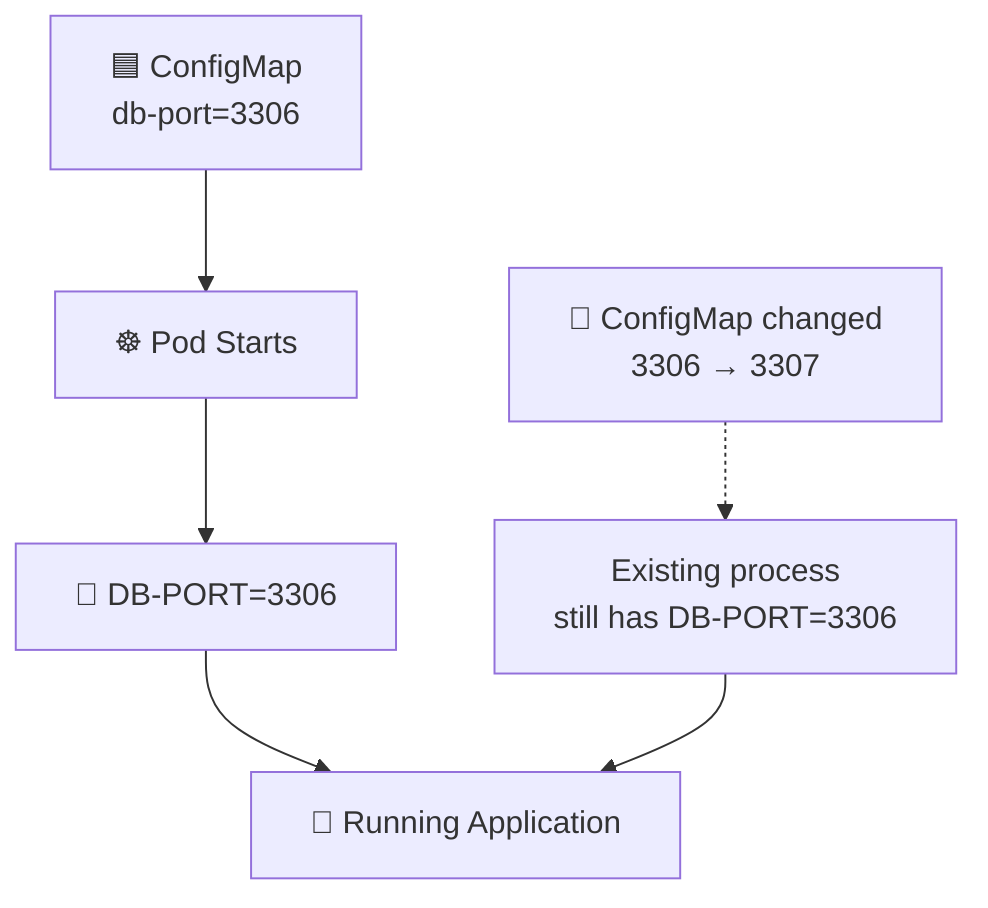

This is why the teacher introduced:

```text
📁 Volume Mounts
```

---

# 📁 16. CONFIGMAP AS A VOLUME

Instead of:

```text
ConfigMap
    ↓
Environment Variable
```

we can use:

```text
ConfigMap
    ↓
Volume
    ↓
File
```

The flow becomes:

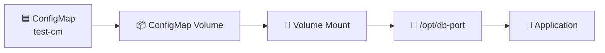

---

# 📦 17. CREATE A CONFIGMAP VOLUME

Inside the Deployment we added:

```yaml
volumes:
  - name: db-connection
    configMap:
      name: test-cm
```

Understand this as:

```text
Create a volume
      |
      ↓
Volume name = db-connection
      |
      ↓
Read its data from ConfigMap = test-cm
```

Conceptually:

```text
🟦 test-cm
    |
    ↓
📦 db-connection volume
```

---

# 📁 18. MOUNT THE VOLUME INSIDE THE CONTAINER

We added:

```yaml
volumeMounts:
  - name: db-connection
    mountPath: /opt
```

This means:

```text
Take the volume called:

db-connection

and mount it inside the container at:

/opt
```

The names must match:

```yaml
volumes:
  - name: db-connection
```

and:

```yaml
volumeMounts:
  - name: db-connection
```

---

# 🧩 19. COMPLETE CONFIGMAP VOLUME CONFIGURATION

Our Deployment section became:

```yaml
containers:
  - name: python-app
    image: abhishekf5/python-sample-app-demo:v1

    volumeMounts:
      - name: db-connection
        mountPath: /opt

    ports:
      - containerPort: 8000

volumes:
  - name: db-connection
    configMap:
      name: test-cm
```

Notice:

```text
env:
```

was removed.

So we no longer used:

```text
DB-PORT
```

as an environment variable.

Instead:

```text
ConfigMap
    ↓
Volume
    ↓
/opt
    ↓
db-port
```

---

# 🚀 20. APPLY THE VOLUME CONFIGURATION

We ran:

```bash
kubectl apply -f deployment.yml
```

Output:

```text
deployment.apps/sample-python-app configured
```

Then:

```bash
kubectl get pods
```

and:

```bash
kubectl get pods -w
```

We saw new Pods created from the updated Deployment.

---

# 🔎 21. VERIFY THE CONFIGMAP VOLUME

We entered one of the Pods:

```bash
kubectl exec -it sample-python-app-789588d595-kgvvc -- /bin/bash
```

First we checked:

```bash
env | grep DB
```

There was no DB environment variable.

That was expected because we removed the `env` section.

Then:

```bash
ls /opt
```

Output:

```text
db-port
```

So Kubernetes created:

```text
/opt/db-port
```

Then:

```bash
cat /opt/db-port
```

Output:

```text
3306
```

Therefore:

```text
🟦 ConfigMap
      |
      ↓
📦 ConfigMap Volume
      |
      ↓
📁 Volume Mount
      |
      ↓
/opt
      |
      ↓
📄 db-port
      |
      ↓
3306
```

---

# 🔄 22. CHANGE THE CONFIGMAP VALUE

Initially:

```text
db-port = 3306
```

Inside the Pod:

```text
/opt/db-port
```

contained:

```text
3306
```

We changed the ConfigMap value.

For example:

```text
3306 → 3307
```

Then applied:

```bash
kubectl apply -f cm.yml
```

We checked:

```bash
kubectl describe cm test-cm
```

and saw:

```text
db-port:
----
3307
```

We then checked the Pods:

```bash
kubectl get pods
```

The Pods were still running.

They were not recreated just because the ConfigMap changed.

Then:

```bash
kubectl exec -it sample-python-app-789588d595-kgvvc -- /bin/bash
```

and:

```bash
cat /opt/db-port
```

After Kubernetes propagated the change, the file showed:

```text
3307
```

---

# 🔄 23. TEST THE CONFIGMAP UPDATE AGAIN

We changed:

```text
3307 → 3309
```

Then:

```bash
kubectl apply -f cm.yml
```

Immediately checking the mounted file could still show the old value.

After waiting a little:

```bash
cat /opt/db-port
```

eventually showed:

```text
3309
```

The teacher explained that Kubernetes continuously handles the mounted ConfigMap and it can take some time for the updated value to appear inside the Pod.

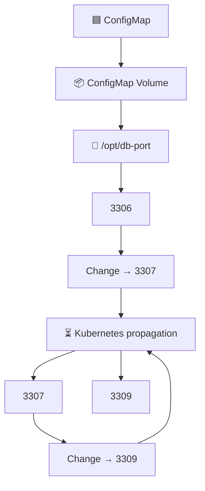

---

# 🌱 24. ENVIRONMENT VARIABLE VS VOLUME MOUNT

## 🌱 Environment Variable

```text
ConfigMap
    ↓
configMapKeyRef
    ↓
Environment Variable
    ↓
Running Process
```

Example:

```text
DB-PORT=3306
```

If the ConfigMap changes, an already-running process does not automatically receive a new environment variable value.

---

## 📁 Volume Mount

```text
ConfigMap
    ↓
ConfigMap Volume
    ↓
Volume Mount
    ↓
File
    ↓
Application
```

Example:

```text
/opt/db-port
```

contains:

```text
3306
```

After the ConfigMap changes, Kubernetes can propagate the changed content to the mounted file.

---

# 🔐 25. WHY DO WE NEED A SECRET?

ConfigMaps are intended for:

```text
Non-sensitive configuration
```

But applications may also need:

```text
DB_USERNAME
DB_PASSWORD
API_TOKEN
Credentials
Certificates
```

These are sensitive values.

For this reason Kubernetes provides:

```text
🔐 Secret
```

The teacher explained that ConfigMaps and Secrets solve a similar configuration problem, but they are intended for different types of information.

```text
🟦 ConfigMap
     ↓
Non-sensitive configuration


🔐 Secret
     ↓
Sensitive configuration
```

---

# 🗄️ 26. THE etcd SECURITY CONCEPT

The teacher explained that Kubernetes stores cluster state in:

```text
etcd
```

Kubernetes resources are persisted there.

Therefore, storing sensitive information as ordinary configuration creates security concerns.

The teacher's overall security explanation was:

```text
Sensitive Information
        |
        ↓
🔐 Secret
        |
        ├── Encryption at Rest
        |
        └── RBAC / Least Privilege
```

The important security concepts are:

```text
🔐 Encryption at Rest
🛡️ RBAC
🔑 Least Privilege
```

---

# 🛡️ 27. RBAC AND LEAST PRIVILEGE

Even if Kubernetes protects Secret data appropriately at rest, we still need to control:

```text
WHO can access the Secret?
```

For example:

```text
👨‍💻 Developer

Pods           ✅
Deployments    ✅
ConfigMaps     ✅
Secrets        ❌
```

An authorized DevOps engineer might have:

```text
Pods           ✅
Deployments    ✅
ConfigMaps     ✅
Secrets        ✅
```

This is the principle of:

```text
Least Privilege
```

Meaning:

> Give a user only the permissions they actually need.

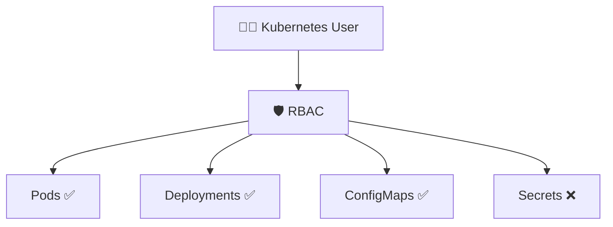

---

# 🔐 28. CREATE A SECRET

We first ran:

```bash
kubectl create secret
```

Kubernetes displayed the available Secret types:

```text
docker-registry
generic
tls
```

For this practical we used:

```text
generic
```

A generic Secret is represented as:

```text
Opaque
```

---

# ❌ 29. FIRST GENERIC SECRET ATTEMPT

We ran:

```bash
kubectl create secret generic
```

Kubernetes returned:

```text
error: exactly one NAME is required, got 0
```

Why?

Because Kubernetes expected us to provide the Secret name.

The general structure is:

```text
kubectl create secret generic <NAME>
```

---

# ✅ 30. CREATE THE SECRET

We successfully ran:

```bash
kubectl create secret generic test-secret --from-literal=db-port="3306"
```

Output:

```text
secret/test-secret created
```

Our Secret was:

```text
🔐 Secret
    |
    ├── Name: test-secret
    |
    ├── Key: db-port
    |
    └── Value: 3306
```

---

# 🔎 31. DESCRIBE THE SECRET

We ran:

```bash
kubectl describe secret test-secret
```

Output included:

```text
Name:         test-secret
Namespace:    default

Type:  Opaque

Data
====
db-port:  4 bytes
```

Notice that the actual Secret value was not displayed directly in the `describe` output.

---

# ✏️ 32. EDIT THE SECRET

We also ran:

```bash
kubectl edit secret test-secret
```

We exited without making changes.

Kubernetes returned:

```text
Edit cancelled, no changes made.
```

---

# 📄 33. VIEW SECRET AS YAML

We ran:

```bash
kubectl get secret test-secret -o yaml
```

The important part looked like:

```yaml
apiVersion: v1
data:
  db-port: MzMwNg==
kind: Secret
metadata:
  creationTimestamp: "2026-08-31T09:07:04Z"
  name: test-secret
  namespace: default
type: Opaque
```

The value:

```text
MzMwNg==
```

is the Base64 representation of:

```text
3306
```

---

# 🔢 34. DECODE THE BASE64 VALUE

We ran:

```bash
echo MzMwNg== | base64 --decode
```

Output:

```text
3306
```

So:

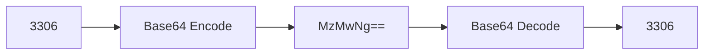

---

# ⚠️ 35. BASE64 IS NOT ENCRYPTION

This is one of the most important things we learned.

Do NOT think:

```text
Base64 = Encryption
```

Instead:

```text
Base64 = Encoding
```

For example:

```text
MzMwNg==
    ↓
Base64 Decode
    ↓
3306
```

Therefore, someone who has the Base64 value can decode it.

The security concepts discussed by the teacher were:

```text
🔐 Encryption at Rest
+
🛡️ RBAC
+
🔑 Least Privilege
```

---

# 📊 36. CONFIGMAP VS SECRET

| Feature | 🟦 ConfigMap | 🔐 Secret |
|---|---|---|
| Purpose | Non-sensitive configuration | Sensitive configuration |
| Example | DB port | DB password |
| Environment variable | `configMapKeyRef` | `secretKeyRef` |
| Volume source | `configMap:` | `secret:` |
| Example resource | `test-cm` | `test-secret` |
| YAML data | Normal configuration data | Secret data represented in Base64 |
| Base64 encryption? | N/A | ❌ Base64 is not encryption |
| Security | Normal Kubernetes permissions | RBAC, least privilege and encryption-at-rest considerations |

---

# 🧩 37. FOUR IMPORTANT YAML CONCEPTS

Remember these four combinations:

```text
🟦 ConfigMap + Environment Variable
                ↓
        configMapKeyRef
```

```text
🟦 ConfigMap + Volume
                ↓
           configMap:
```

```text
🔐 Secret + Environment Variable
                ↓
          secretKeyRef
```

```text
🔐 Secret + Volume
                ↓
             secret:
```

The memory trick:

```text
             KUBERNETES CONFIGURATION
                       |
          ┌────────────┴────────────┐
          ↓                         ↓
     🟦 ConfigMap               🔐 Secret
     Non-sensitive               Sensitive
          |                         |
     ┌────┴────┐               ┌────┴────┐
     ↓         ↓               ↓         ↓
    ENV      VOLUME            ENV      VOLUME
     ↓         ↓               ↓         ↓
configMap    configMap     secretKeyRef  secret
KeyRef
```

---

# 📝 38. SECRET HOMEWORK GIVEN BY THE TEACHER

The teacher then gave us an assignment.

We need to repeat the same exercise using a Secret.

The example is:

```text
Secret name:
test-secret-one
```

The Secret should contain:

```text
DB_PASSWORD = AB
```

Conceptually:

```text
🔐 test-secret-one
       |
       └── DB_PASSWORD = AB
```

---

# 🛠️ 39. CREATE THE NEW SECRET

The command to practice is:

```bash
kubectl create secret generic test-secret-one --from-literal=DB_PASSWORD="AB"
```

Understand it step by step:

```text
kubectl
   ↓
create
   ↓
secret
   ↓
generic
   ↓
test-secret-one
   ↓
DB_PASSWORD=AB
```

---

# 🔎 40. VERIFY THE NEW SECRET

Check all Secrets:

```bash
kubectl get secret
```

Then:

```bash
kubectl describe secret test-secret-one
```

Then:

```bash
kubectl get secret test-secret-one -o yaml
```

The Secret YAML will show the Secret data represented in Base64.

Again:

```text
Base64 ≠ Encryption
```

---

# 🌱 41. SECRET AS AN ENVIRONMENT VARIABLE

The teacher said:

> Instead of `configMapKeyRef`, use `secretKeyRef`.

Previously we used:

```yaml
env:
  - name: DB-PORT
    valueFrom:
      configMapKeyRef:
        name: test-cm
        key: db-port
```

For the Secret homework we use:

```yaml
env:
  - name: DB_PASSWORD
    valueFrom:
      secretKeyRef:
        name: test-secret-one
        key: DB_PASSWORD
```

---

# 🧠 42. UNDERSTANDING `secretKeyRef`

Read this:

```yaml
env:
  - name: DB_PASSWORD
    valueFrom:
      secretKeyRef:
        name: test-secret-one
        key: DB_PASSWORD
```

as:

```text
Create an environment variable
        |
        ↓
Name = DB_PASSWORD
        |
        ↓
Get the value from a Secret
        |
        ↓
Secret name = test-secret-one
        |
        ↓
Secret key = DB_PASSWORD
```

The complete flow:

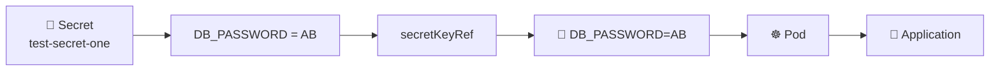

---

# 🚀 43. APPLY THE SECRET-BASED DEPLOYMENT

After modifying:

```text
deployment.yml
```

we apply it:

```bash
kubectl apply -f deployment.yml
```

Then:

```bash
kubectl get pods
```

If the Pod template changed, Kubernetes creates updated Pods.

Then enter a Pod:

```bash
kubectl exec -it <pod-name> -- /bin/bash
```

And check:

```bash
env | grep -i DB
```

The expected concept is:

```text
DB_PASSWORD=AB
```

This proves:

```text
🔐 Secret
      ↓
secretKeyRef
      ↓
🌱 Environment Variable
      ↓
☸️ Pod
      ↓
🐍 Application
```

---

# 📁 44. SECRET AS A VOLUME — HOMEWORK

The teacher also asked us to repeat the ConfigMap volume exercise using a Secret.

Previously we had:

```yaml
volumes:
  - name: db-connection
    configMap:
      name: test-cm
```

Now we replace the ConfigMap source with a Secret:

```yaml
volumes:
  - name: db-secret
    secret:
      secretName: test-secret-one
```

Then mount it:

```yaml
volumeMounts:
  - name: db-secret
    mountPath: /opt
```

---

# 🧠 45. SECRET VOLUME FLOW

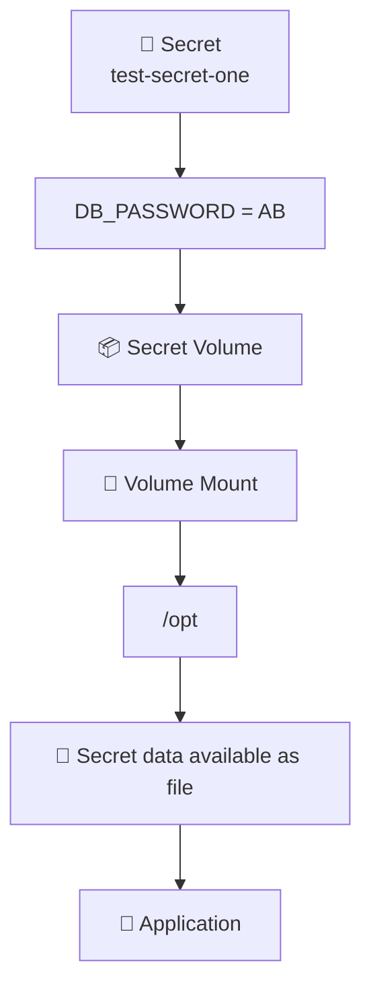

The basic idea:

```text
Secret
   ↓
Secret Volume
   ↓
Volume Mount
   ↓
/opt
   ↓
Secret data available as files
```

---

# 🧪 46. VERIFY THE SECRET VOLUME

After applying the Deployment:

```bash
kubectl apply -f deployment.yml
```

Check:

```bash
kubectl get pods
```

Enter:

```bash
kubectl exec -it <pod-name> -- /bin/bash
```

Check:

```bash
ls /opt
```

The Secret key is represented as a file inside the mounted directory.

For example:

```text
/opt/DB_PASSWORD
```

The application can read the file when required.

---

# 🏗️ 47. COMPLETE CONFIGMAP PRACTICAL ARCHITECTURE

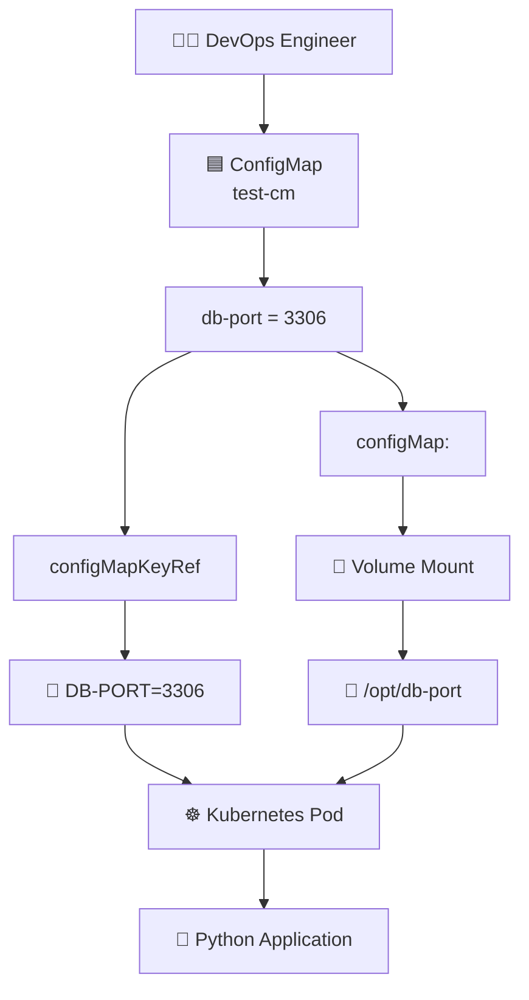

---

# 🔐 48. COMPLETE SECRET PRACTICAL ARCHITECTURE

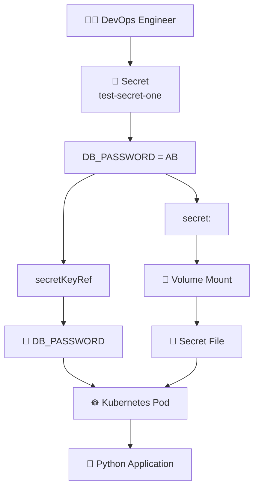

---

# 🔥 49. COMPLETE DAY 41 FLOW

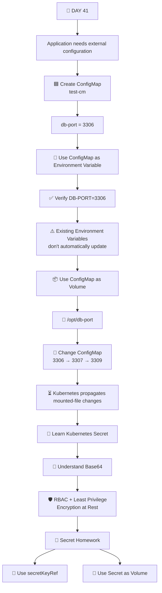

---

# 🧪 50. ALL IMPORTANT COMMANDS WE USED

## ☸️ Kubernetes Deployment Commands

```bash
kubectl get deploy
```

```bash
kubectl get pods
```

```bash
kubectl get pods -w
```

```bash
kubectl apply -f deployment.yml
```

```bash
kubectl exec -it <pod-name> -- /bin/bash
```

```bash
env | grep -i DB
```

```bash
exit
```

---

## 🟦 ConfigMap Commands

```bash
vim cm.yaml
```

```bash
cat cm.yaml
```

```bash
kubectl apply -f cm.yaml
```

```bash
kubectl get cm
```

```bash
kubectl describe cm test-cm
```

```bash
vim cm.yml
```

```bash
kubectl apply -f cm.yml
```

```bash
kubectl describe cm test-cm
```

Inside the Pod:

```bash
ls /opt
```

```bash
cat /opt/db-port
```

---

## 🔐 Secret Commands

```bash
kubectl create secret
```

```bash
kubectl create secret generic
```

```bash
kubectl create secret generic test-secret --from-literal=db-port="3306"
```

```bash
kubectl describe secret test-secret
```

```bash
kubectl edit secret test-secret
```

```bash
kubectl get secret test-secret -o yaml
```

```bash
echo MzMwNg== | base64 --decode
```

Homework:

```bash
kubectl create secret generic test-secret-one --from-literal=DB_PASSWORD="AB"
```

---

# ⚠️ 51. COMMAND ERRORS WE EXPERIENCED

## ❌ Wrong Kubernetes Command

```bash
KUBECTL GET DEPLOY
```

Output:

```text
KUBECTL: command not found
```

### ✅ Correct

```bash
kubectl get deploy
```

Linux is case-sensitive.

---

## ❌ Wrong ConfigMap YAML

```yaml
data::
```

### Error

```text
unknown field "data:"
```

### ✅ Correct

```yaml
data:
```

---

## ❌ Wrong `cd` Usage

We tried:

```bash
cd ls -la Docker-Zero-to-Hero
```

Result:

```text
cd: too many arguments
```

Correct approach:

```bash
ls -la Docker-Zero-to-Hero
```

then:

```bash
cd Docker-Zero-to-Hero
```

---

## ❌ Wrong kubectl Usage

We tried:

```bash
kubectl -f cm.yml
```

Result:

```text
error: unknown shorthand flag: 'f' in -f
```

### ✅ Correct

```bash
kubectl apply -f cm.yml
```

---

## ❌ Missing Secret Name

We tried:

```bash
kubectl create secret generic
```

Result:

```text
error: exactly one NAME is required, got 0
```

### ✅ Correct Pattern

```bash
kubectl create secret generic <secret-name> ...
```

Example:

```bash
kubectl create secret generic test-secret --from-literal=db-port="3306"
```

---

## ❌ Vim Inside the Container

Inside the application container we tried:

```bash
vim cm.yml
```

Result:

```text
bash: vim: command not found
```

The container image did not contain `vim`.

We exited:

```bash
exit
```

and edited the YAML from the Ubuntu host.

---

# 🧠 52. WHAT WE ACTUALLY DID

This practical was not simply:

```text
Create ConfigMap
Create Secret
```

We followed the complete learning path:

```text
1️⃣ Checked existing Deployments
        ↓
2️⃣ Checked existing ConfigMaps
        ↓
3️⃣ Created test-cm
        ↓
4️⃣ Stored db-port=3306
        ↓
5️⃣ Described the ConfigMap
        ↓
6️⃣ Used ConfigMap as Environment Variable
        ↓
7️⃣ Applied Deployment
        ↓
8️⃣ Entered the Pod
        ↓
9️⃣ Verified DB-PORT=3306
        ↓
🔟 Learned Environment Variable limitation
        ↓
1️⃣1️⃣ Removed Environment Variable configuration
        ↓
1️⃣2️⃣ Created ConfigMap-backed Volume
        ↓
1️⃣3️⃣ Mounted it at /opt
        ↓
1️⃣4️⃣ Verified /opt/db-port
        ↓
1️⃣5️⃣ Read 3306 from the file
        ↓
1️⃣6️⃣ Changed ConfigMap to 3307
        ↓
1️⃣7️⃣ Observed mounted file update
        ↓
1️⃣8️⃣ Changed ConfigMap to 3309
        ↓
1️⃣9️⃣ Observed mounted file update
        ↓
2️⃣0️⃣ Created test-secret
        ↓
2️⃣1️⃣ Described the Secret
        ↓
2️⃣2️⃣ Viewed Secret YAML
        ↓
2️⃣3️⃣ Learned Base64 representation
        ↓
2️⃣4️⃣ Decoded Base64
        ↓
2️⃣5️⃣ Learned Base64 ≠ Encryption
        ↓
2️⃣6️⃣ Learned RBAC / Least Privilege
        ↓
2️⃣7️⃣ Received Secret homework
```

---

# 🎯 53. THE MOST IMPORTANT CONCEPT

Think about the problem like this:

```text
              APPLICATION
                   |
                   |
          "I need configuration"
                   |
                   ↓
        ┌──────────────────────┐
        │   Is it sensitive?   │
        └──────────┬───────────┘
                   |
          ┌────────┴────────┐
          ↓                 ↓
         NO                YES
          |                 |
          ↓                 ↓
   🟦 ConfigMap        🔐 Secret
          |                 |
          ↓                 ↓
   Non-sensitive        Sensitive
   configuration       information
          |                 |
     ┌────┴────┐       ┌────┴────┐
     ↓         ↓       ↓         ↓
    ENV      VOLUME    ENV      VOLUME
     ↓         ↓       ↓         ↓
configMap    configMap secretKeyRef secret
KeyRef
```

---

# 🧠 54. FINAL INTERVIEW ANSWER

If an interviewer asks:

> **What is the difference between ConfigMap and Secret in Kubernetes?**

Answer:

> **ConfigMaps and Secrets are both Kubernetes resources used to provide configuration data to applications running inside Pods. ConfigMaps are intended for non-sensitive configuration such as database ports, hostnames, and other normal configuration values. Secrets are intended for sensitive information such as passwords, credentials, and tokens. Both can be consumed as environment variables or mounted as volumes. ConfigMaps use `configMapKeyRef` for individual environment variables, while Secrets use `secretKeyRef`. For volumes, ConfigMaps use `configMap:` and Secrets use `secret:`. Secret data shown in Kubernetes YAML is Base64-encoded, but Base64 is encoding and not encryption. Proper RBAC, least privilege, and encryption-at-rest are important security considerations for protecting Secrets.**

---

# 🧠 55. FINAL MEMORY TRICK

Remember:

```text
🟦 CONFIGMAP
     |
     ├── Non-sensitive configuration
     |
     ├── ENV
     |     ↓
     |  configMapKeyRef
     |
     └── VOLUME
           ↓
        configMap:
```

And:

```text
🔐 SECRET
     |
     ├── Sensitive configuration
     |
     ├── ENV
     |     ↓
     |  secretKeyRef
     |
     └── VOLUME
           ↓
         secret:
```

The easiest way to remember:

```text
CONFIGMAP
    |
    +── configMapKeyRef → Environment Variable
    |
    └── configMap: → Volume


SECRET
    |
    +── secretKeyRef → Environment Variable
    |
    └── secret: → Volume
```

---

# 🏠 56. DAY 41 SECRET HOMEWORK

## Part 1 — Create the Secret

```bash
kubectl create secret generic test-secret-one --from-literal=DB_PASSWORD="AB"
```

---

## Part 2 — Use Secret as Environment Variable

In `deployment.yml`:

```yaml
env:
  - name: DB_PASSWORD
    valueFrom:
      secretKeyRef:
        name: test-secret-one
        key: DB_PASSWORD
```

Apply:

```bash
kubectl apply -f deployment.yml
```

Check:

```bash
kubectl get pods
```

Enter:

```bash
kubectl exec -it <pod-name> -- /bin/bash
```

Verify:

```bash
env | grep -i DB
```

Expected concept:

```text
DB_PASSWORD=AB
```

---

# 📁 57. SECRET VOLUME HOMEWORK

Use:

```yaml
volumes:
  - name: db-secret
    secret:
      secretName: test-secret-one
```

Mount it:

```yaml
volumeMounts:
  - name: db-secret
    mountPath: /opt
```

Then:

```bash
kubectl apply -f deployment.yml
```

Check:

```bash
kubectl get pods
```

Enter:

```bash
kubectl exec -it <pod-name> -- /bin/bash
```

Then:

```bash
ls /opt
```

The Secret key will be represented as a file inside the mounted directory.

---

# 📊 58. PRACTICAL CHEAT SHEET

| What you want | Kubernetes configuration |
|---|---|
| Store normal configuration | `ConfigMap` |
| Store sensitive configuration | `Secret` |
| ConfigMap → Environment Variable | `configMapKeyRef` |
| Secret → Environment Variable | `secretKeyRef` |
| ConfigMap → Volume | `configMap:` |
| Secret → Volume | `secret:` |
| Create ConfigMap from YAML | `kubectl apply -f cm.yml` |
| Create generic Secret | `kubectl create secret generic ...` |
| Check ConfigMaps | `kubectl get cm` |
| Describe ConfigMap | `kubectl describe cm test-cm` |
| Check Secrets | `kubectl get secret` |
| Describe Secret | `kubectl describe secret test-secret` |
| View Secret YAML | `kubectl get secret test-secret -o yaml` |
| Decode Base64 | `base64 --decode` |
| Enter Pod | `kubectl exec -it <pod> -- /bin/bash` |
| Check environment variables | `env \| grep -i DB` |
| Check mounted files | `ls /opt` |
| Read mounted ConfigMap | `cat /opt/db-port` |

---

# 🏆 59. DAY 41 CHECKLIST

## 🟦 ConfigMap

- [x] Understand why configuration should be external
- [x] Understand ConfigMap
- [x] Create `test-cm`
- [x] Store `db-port`
- [x] Use ConfigMap as Environment Variable
- [x] Verify `DB-PORT=3306`
- [x] Understand Environment Variable limitation
- [x] Use ConfigMap as Volume
- [x] Mount ConfigMap at `/opt`
- [x] Verify `/opt/db-port`
- [x] Read `3306` from the file
- [x] Change ConfigMap to `3307`
- [x] Observe mounted file update
- [x] Change ConfigMap to `3309`
- [x] Observe mounted file update

## 🔐 Secret

- [x] Understand why Secrets exist
- [x] Understand sensitive configuration
- [x] Create generic Secret
- [x] Create `test-secret`
- [x] Describe Secret
- [x] View Secret YAML
- [x] Understand Base64
- [x] Decode Base64
- [x] Understand Base64 ≠ Encryption
- [x] Understand RBAC
- [x] Understand Least Privilege
- [ ] Create `test-secret-one`
- [ ] Store `DB_PASSWORD`
- [ ] Use `secretKeyRef`
- [ ] Verify Secret as Environment Variable
- [ ] Use Secret as a Volume
- [ ] Verify Secret file inside the Pod

---

# 🔥 60. COMPLETE DAY 41 ARCHITECTURE

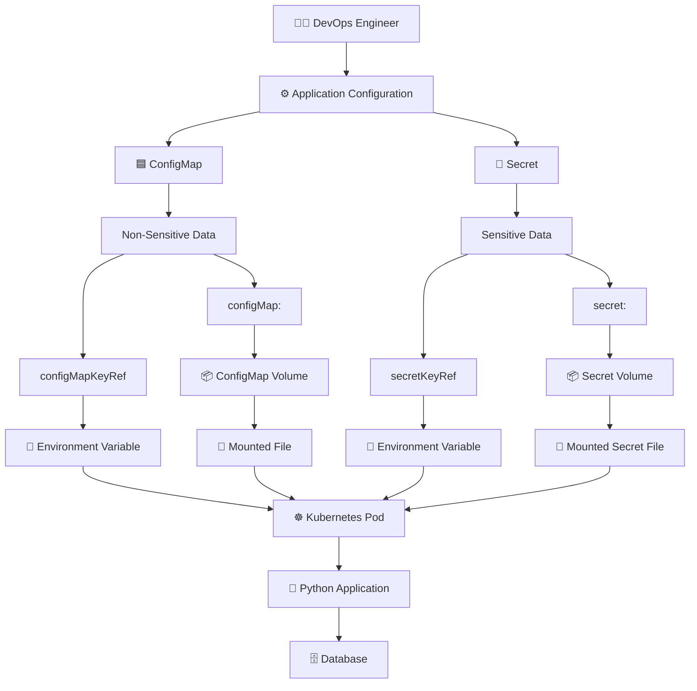

---

# 🧠 61. ONE-MINUTE REVISION

```text
What is ConfigMap?
        ↓
Stores NON-SENSITIVE configuration
        ↓
Example: DB_PORT=3306


What is Secret?
        ↓
Stores SENSITIVE information
        ↓
Example: DB_PASSWORD=AB


How can ConfigMap be used?
        ↓
Environment Variable
        ↓
configMapKeyRef

OR

Volume
        ↓
configMap:


How can Secret be used?
        ↓
Environment Variable
        ↓
secretKeyRef

OR

Volume
        ↓
secret:


Why not hardcode configuration?
        ↓
Configuration may change
        ↓
Application should not need code changes


Why volume mounts?
        ↓
Mounted ConfigMap files can receive
updated ConfigMap content after propagation


Is Base64 encryption?
        ↓
❌ NO
        ↓
Base64 is encoding


How do we protect Secrets?
        ↓
🔐 Encryption at Rest
🛡️ RBAC
🔑 Least Privilege
```

---

# 🎓 62. WHAT THE TEACHER EXPECTS YOU TO DO NEXT

The teacher has already demonstrated the complete ConfigMap practical.

Now the assignment is:

```text
                  CONFIGMAP PRACTICAL
                         |
                         ↓
              YOU ALREADY DID THIS
                         |
                         ↓
             Repeat the same concept
                         |
                         ↓
                    🔐 SECRET
                         |
          ┌──────────────┴──────────────┐
          ↓                             ↓
   Secret as ENV                  Secret as Volume
          ↓                             ↓
   secretKeyRef                     secret:
          ↓                             ↓
     Verify inside                  Mount inside
        Pod                            Pod
```

The key learning objective is not just memorizing commands.

You should understand that:

```text
ConfigMap and Secret
        ↓
Store configuration separately
        ↓
Deployment references them
        ↓
Pod receives the configuration
        ↓
Application consumes the configuration
```

---

# 🚀 DAY 41 FINAL SUMMARY

```text
┌─────────────────────────────────────────────────────────────┐
│                    ☸️ KUBERNETES                            │
│                                                             │
│  🟦 CONFIGMAP                         🔐 SECRET             │
│                                                             │
│  Non-sensitive data                   Sensitive data        │
│                                                             │
│  Example:                              Example:             │
│  db-port=3306                          DB_PASSWORD=AB       │
│                                                             │
│       |                                      |              │
│       ↓                                      ↓              │
│  configMapKeyRef                       secretKeyRef         │
│       |                                      |              │
│       ↓                                      ↓              │
│  Environment Variable                  Environment Variable │
│                                                             │
│       OR                                     OR              │
│                                                             │
│  configMap:                             secret:              │
│       |                                      |              │
│       ↓                                      ↓              │
│  ConfigMap Volume                       Secret Volume        │
│       |                                      |              │
│       ↓                                      ↓              │
│  Mounted File                           Mounted File         │
│                                                             │
└─────────────────────────────────────────────────────────────┘
```

---

<p align="center">

# 🔥 DAY 41 — KUBERNETES CONFIGMAPS & SECRETS

### 🟦 ConfigMap → Non-Sensitive Configuration
### 🔐 Secret → Sensitive Configuration

**Learn → Execute → Verify → Understand → Practice**

## 🚀 DAY 41 COMPLETE

</p>
