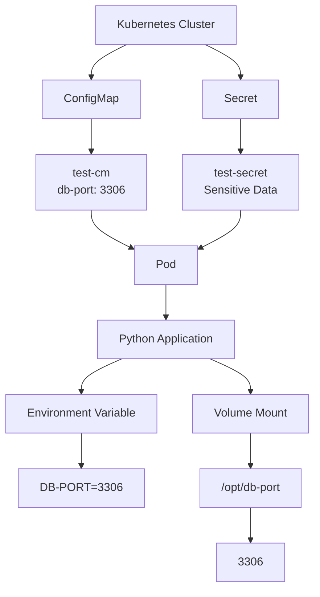
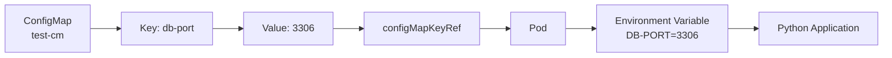
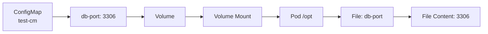
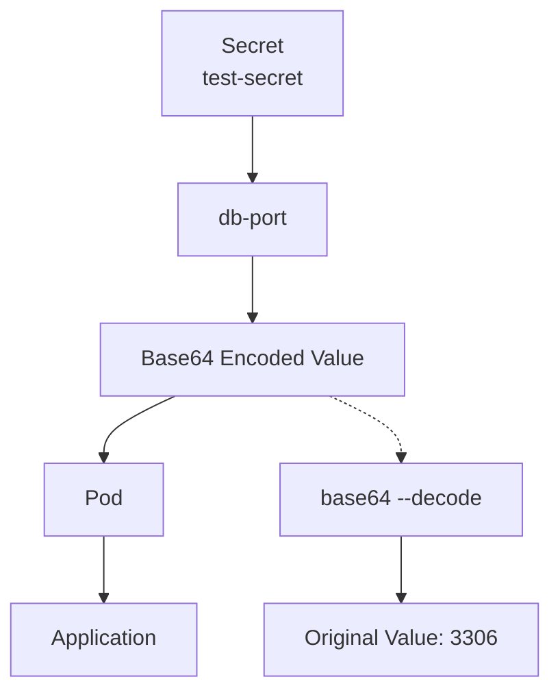
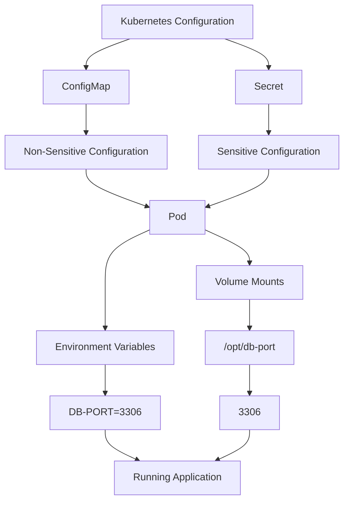
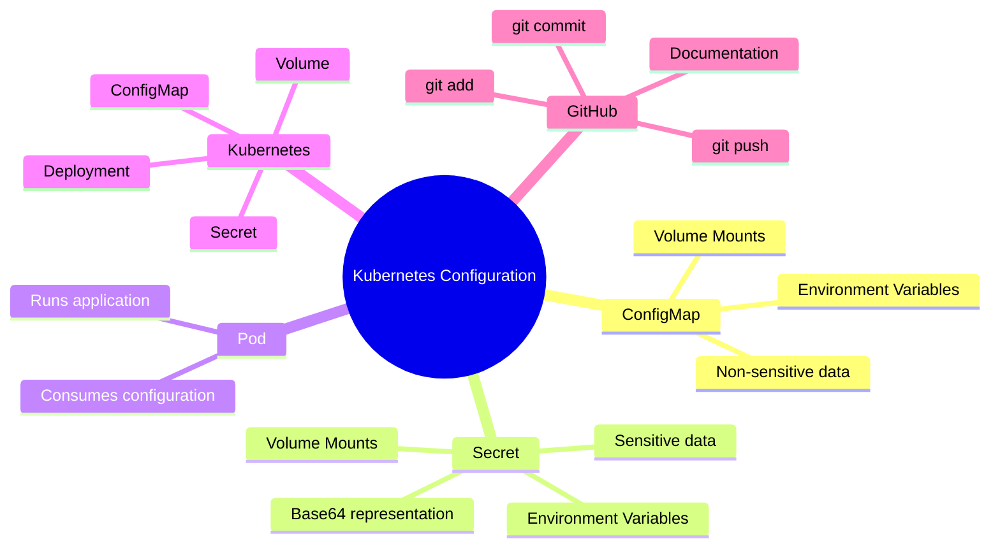

<div align="center">

# 🔐 DAY 41 — KUBERNETES CONFIGMAPS & SECRETS

### 🚀 Complete Hands-On Kubernetes Practical


</div>

---

# 📚 What I Learned

In Day 41, I learned how Kubernetes manages application configuration using:

- 🔵 ConfigMaps
- 🔐 Secrets
- 🌱 Environment Variables
- 📦 Volume Mounts
- 🚀 Deployments
- 🐳 Pods and Containers
- 🔎 Kubernetes resource inspection
- 🔓 Base64 encoding and decoding
- 🐙 Git and GitHub documentation workflow

The main goal was to understand how configuration can be separated from the application container image.

---

# 🧠 ConfigMap vs Secret

| Feature | 🔵 ConfigMap | 🔐 Secret |
|---|---|---|
| Purpose | Non-sensitive configuration | Sensitive configuration |
| Example | DB port, application mode | Password, token, credentials |
| Environment Variable | ✅ | ✅ |
| Volume Mount | ✅ | ✅ |
| Base64 Representation | ❌ | ✅ |
| Encryption by Base64 | ❌ | ❌ |
| Suitable for passwords | ❌ | ✅ |

> ⚠️ Base64 encoding is **not encryption**.

---

# 🏗️ Kubernetes Configuration Architecture



---

# 🔵 CONFIGMAP PRACTICAL

## 1️⃣ Check Existing Deployments

```bash
kubectl get deploy
```

## 2️⃣ Check Existing ConfigMaps

```bash
kubectl get cm
```

## 3️⃣ Create ConfigMap YAML

```bash
vim cm.yaml
```

### `cm.yaml`

```yaml
apiVersion: v1
kind: ConfigMap

metadata:
  name: test-cm

data:
  db-port: "3306"
```

## 4️⃣ View ConfigMap YAML

```bash
cat cm.yaml
```

## 5️⃣ Apply ConfigMap

```bash
kubectl apply -f cm.yaml
```

Expected:

```text
configmap/test-cm created
```

## 6️⃣ Verify ConfigMap

```bash
kubectl get cm
```

## 7️⃣ Describe ConfigMap

```bash
kubectl describe cm test-cm
```

Expected data:

```text
Data
====
db-port:
----
3306
```

## 8️⃣ View Complete ConfigMap

```bash
kubectl get configmap test-cm -o yaml
```

Example:

```yaml
apiVersion: v1
data:
  db-port: "3306"
kind: ConfigMap
metadata:
  name: test-cm
```

---

# 🐳 GETTING THE DEMO APPLICATION

The practical used the `python-web-app` project from the Docker-Zero-to-Hero repository.

## 1️⃣ Clone Repository

```bash
git clone https://github.com/iam-veeramalla/Docker-Zero-to-Hero.git
```

## 2️⃣ Check Repository

```bash
git remote -v
```

```bash
ls
```

## 3️⃣ Check Cloned Repository

```bash
ls -la Docker-Zero-to-Hero
```

## 4️⃣ Enter Repository

```bash
cd Docker-Zero-to-Hero
```

## 5️⃣ List Files

```bash
ls
```

## 6️⃣ Check Examples

```bash
ls examples
```

## 7️⃣ Find Requirements File

```bash
find . -iname "req.yaml" -o -iname "requirements.txt"
```

Result:

```text
./examples/python-web-app/requirements.txt
```

## 8️⃣ Enter Examples

```bash
cd examples
```

```bash
ls
```

## 9️⃣ Enter Python Web App

```bash
cd python-web-app/
```

```bash
ls
```

---

# 🚀 KUBERNETES DEPLOYMENT

## 1️⃣ Edit Deployment

```bash
vim deployment.yml
```

## 2️⃣ View Deployment

```bash
cat deployment.yml
```

### Initial Deployment

```yaml
apiVersion: apps/v1
kind: Deployment

metadata:
  name: sample-python-app

  labels:
    app: sample-python-app

spec:
  replicas: 2

  selector:
    matchLabels:
      app: sample-python-app

  template:
    metadata:
      labels:
        app: sample-python-app

    spec:
      containers:

        - name: python-app

          image: abhishekf5/python-sample-app-demo:v1

          ports:
            - containerPort: 8000
```

## 3️⃣ Apply Deployment

```bash
kubectl apply -f deployment.yml
```

## 4️⃣ Check Pods

```bash
kubectl get pods
```

## 5️⃣ Watch Pods

```bash
kubectl get pods -w
```

---

# 🌱 CONFIGMAP → ENVIRONMENT VARIABLE

The ConfigMap contains:

```yaml
data:
  db-port: "3306"
```

The Deployment consumes this value using `configMapKeyRef`.

## Deployment Configuration

```yaml
containers:

  - name: python-app

    image: abhishekf5/python-sample-app-demo:v1

    env:

      - name: DB-PORT

        valueFrom:

          configMapKeyRef:
            name: test-cm
            key: db-port

    ports:
      - containerPort: 8000
```

---

# 🔄 ConfigMap → Environment Variable Flow



---

# 🔄 APPLY UPDATED DEPLOYMENT

```bash
kubectl apply -f deployment.yml
```

Check Pods:

```bash
kubectl get pods
```

---

# 🧪 VERIFY ENVIRONMENT VARIABLE INSIDE POD

## Enter Pod

```bash
kubectl exec -it <pod-name> -- /bin/bash
```

Example:

```bash
kubectl exec -it sample-python-app-5ddcb9f87b-9l699 -- /bin/bash
```

Inside the container:

```bash
env | grep DB
```

Expected:

```text
DB-PORT=3306
```

Exit:

```bash
exit
```

---

# 📦 CONFIGMAP → VOLUME MOUNT

A ConfigMap can also be mounted as files inside the Pod.

## Deployment Configuration

```yaml
containers:

  - name: python-app

    image: abhishekf5/python-sample-app-demo:v1

    volumeMounts:

      - name: db-connection
        mountPath: /opt

    ports:
      - containerPort: 8000

volumes:

  - name: db-connection

    configMap:
      name: test-cm
```

---

# 🔄 ConfigMap → Volume Mount Flow



---

# 🔄 APPLY VOLUME CONFIGURATION

Edit Deployment:

```bash
vim deployment.yml
```

Apply:

```bash
kubectl apply -f deployment.yml
```

Check Pods:

```bash
kubectl get pods
```

---

# 🧪 VERIFY CONFIGMAP VOLUME

Enter the Pod:

```bash
kubectl exec -it <pod-name> -- /bin/bash
```

Check mounted directory:

```bash
ls /opt
```

Expected file:

```text
db-port
```

Read the file:

```bash
cat /opt/db-port
```

Expected:

```text
3306
```

Exit:

```bash
exit
```

---

# 🔐 KUBERNETES SECRET PRACTICAL

## 1️⃣ Check Secret Command

```bash
kubectl create secret
```

## 2️⃣ Check Generic Secret Syntax

```bash
kubectl create secret generic
```

## 3️⃣ Create Secret

```bash
kubectl create secret generic test-secret --from-literal=db-port="3306"
```

Expected:

```text
secret/test-secret created
```

---

# 🔎 INSPECT THE SECRET

## Describe Secret

```bash
kubectl describe secret test-secret
```

## Edit Secret

```bash
kubectl edit secret test-secret
```

## View Secret YAML

```bash
kubectl get secret test-secret -o yaml
```

Example:

```yaml
apiVersion: v1
kind: Secret

metadata:
  name: test-secret

data:
  db-port: <BASE64_VALUE>

type: Opaque
```

---

# 🔓 BASE64 DECODING

The practical demonstrated Base64 decoding:

```bash
echo MzMwNg== | base64 --decode
```

Output:

```text
3306
```

The Secret value can also be decoded directly:

```bash
kubectl get secret test-secret \
  -o jsonpath='{.data.db-port}' | base64 --decode
```

Expected:

```text
3306
```

> ⚠️ Base64 is **encoding**, not encryption.

---

# 🔐 SECRET FLOW



---

# 🐳 POD INTERACTION COMMANDS

Check Deployments:

```bash
kubectl get deploy
```

Check Pods:

```bash
kubectl get pods
```

Watch Pods:

```bash
kubectl get pods -w
```

Enter Pod:

```bash
kubectl exec -it <pod-name> -- /bin/bash
```

Check Environment Variables:

```bash
env
```

Check DB Environment Variable:

```bash
env | grep DB
```

Check Mounted Directory:

```bash
ls /opt
```

Read Mounted ConfigMap:

```bash
cat /opt/db-port
```

Exit Container:

```bash
exit
```

---

# 🧩 COMPLETE CONFIGURATION FLOW



---

# 🐙 GITHUB DOCUMENTATION WORKFLOW

After completing the Kubernetes practical, I copied the required project files into my own GitHub repository.

Repository structure:

```text
My-Devops-Cloud-Journey
└── DevOps-Labs-and-Projects
    └── 21-K8-ConfigMaps-Secrets
```

---

## 1️⃣ Go Home

```bash
cd ~
```

## 2️⃣ Clone Personal Repository

```bash
git clone https://github.com/Yuvii2102/My-Devops-Cloud-Journey.git
```

## 3️⃣ Enter Repository

```bash
cd My-Devops-Cloud-Journey
```

## 4️⃣ Check Git Remote

```bash
git remote -v
```

Expected:

```text
origin  https://github.com/Yuvii2102/My-Devops-Cloud-Journey.git (fetch)
origin  https://github.com/Yuvii2102/My-Devops-Cloud-Journey.git (push)
```

## 5️⃣ Enter Day 41 Directory

```bash
cd DevOps-Labs-and-Projects/21-K8-ConfigMaps-Secrets
```

## 6️⃣ Check Files

```bash
ls
```

---

# 📋 COPY PRACTICAL FILES

## Copy Python Web App Files

```bash
cp -r ~/Docker-Zero-to-Hero/examples/python-web-app/* .
```

## Verify Files

```bash
ls -la
```

## Copy Deployment

```bash
cp ~/Docker-Zero-to-Hero/examples/python-web-app/deployment.yml .
```

## Copy ConfigMap

```bash
cp ~/Docker-Zero-to-Hero/examples/python-web-app/cm.yml .
```

## Copy Service

```bash
cp ~/Docker-Zero-to-Hero/examples/python-web-app/service.yml .
```

## Copy Requirements

```bash
cp ~/Docker-Zero-to-Hero/examples/python-web-app/requirements.txt .
```

## Copy `devops` Directory Contents

```bash
cp -a ~/Docker-Zero-to-Hero/examples/python-web-app/devops/. devops/
```

## Verify Final Files

```bash
ls -la
```

---

# 📝 DOCUMENT THE PRACTICAL

Edit README:

```bash
vim README.md
```

Check Git status:

```bash
git status
```

Check differences:

```bash
git diff
```

---

# ➕ STAGE CHANGES

```bash
git add .
```

Verify staged changes:

```bash
git status
```

---

# 💾 COMMIT CHANGES

```bash
git commit -m "Add Kubernetes ConfigMaps and Secrets practical"
```

---

# 🚀 PUSH TO GITHUB

```bash
git push origin main
```

---

# 📜 VIEW COMMAND HISTORY

```bash
history
```

---

# ❌ COMMANDS THAT WERE ENTERED INCORRECTLY

During the practical, some commands were entered incorrectly and then corrected.

### ❌ Incorrect

```bash
deployment.yml
```

A YAML file is not a shell command.

### ✅ Correct

```bash
cat deployment.yml
```

or:

```bash
vim deployment.yml
```

---

### ❌ Incorrect

```bash
kubectl -f cm.yml
```

### ✅ Correct

```bash
kubectl apply -f cm.yml
```

---

### ❌ Incorrect

```bash
cd~
```

### ✅ Correct

```bash
cd ~
```

---

### ❌ Incorrect

```bash
git dif
```

### ✅ Correct

```bash
git diff
```

---

### ❌ Incorrect

```bash
cp ~/Docker-Zero-to-Hero/examples/python-web-app/devops .
```

The `devops` item is a directory.

### ✅ Correct

```bash
cp -a ~/Docker-Zero-to-Hero/examples/python-web-app/devops/. devops/
```

---

### ❌ Incorrect

```bash
cp ~/Docker-Zero-to-Hero/examples/python-web-app/requirements.yml .
```

The actual file found was:

```text
requirements.txt
```

### ✅ Correct

```bash
cp ~/Docker-Zero-to-Hero/examples/python-web-app/requirements.txt .
```

---

# 🧠 WHAT I UNDERSTOOD

### 🔵 ConfigMap

ConfigMaps store **non-sensitive configuration** separately from the application.

Example:

```text
test-cm
└── db-port = 3306
```

---

### 🌱 Environment Variable

A ConfigMap value can be injected into a Pod as an environment variable.

```text
ConfigMap
     ↓
configMapKeyRef
     ↓
DB-PORT=3306
     ↓
Application
```

---

### 📦 Volume Mount

A ConfigMap can also be mounted as a file.

```text
ConfigMap
     ↓
Volume
     ↓
/opt/db-port
     ↓
3306
```

---

### 🔐 Secret

Secrets are designed for sensitive configuration such as:

- Passwords
- Tokens
- Credentials
- API keys

Secrets can also be consumed using:

- Environment Variables
- Volume Mounts

---

# ⚖️ ENVIRONMENT VARIABLE vs VOLUME

| Method | Result |
|---|---|
| ConfigMap → Environment Variable | `DB-PORT=3306` |
| ConfigMap → Volume | `/opt/db-port` containing `3306` |
| Secret → Environment Variable | Secret value exposed to the process environment |
| Secret → Volume | Secret value exposed as a file |

---

# 🎯 DAY 41 PRACTICAL FLOW


---

# 📂 FINAL PROJECT STRUCTURE

```text
21-K8-ConfigMaps-Secrets/
│
├── README.md
├── Dockerfile
├── cm.yml
├── deployment.yml
├── requirements.txt
├── service.yml
│
└── devops/
    └── ...
```

---

# 🏆 KEY TAKEAWAYS



### Important commands practiced:

```bash
kubectl get cm
kubectl describe cm test-cm
kubectl get cm test-cm -o yaml

kubectl apply -f cm.yml
kubectl apply -f deployment.yml

kubectl get deploy
kubectl get pods
kubectl get pods -w

kubectl exec -it <pod-name> -- /bin/bash

env | grep DB

ls /opt
cat /opt/db-port

kubectl create secret generic test-secret --from-literal=db-port="3306"

kubectl describe secret test-secret
kubectl edit secret test-secret
kubectl get secret test-secret -o yaml

kubectl get secret test-secret \
  -o jsonpath='{.data.db-port}' | base64 --decode
```

---

# 🔐 SECURITY REMINDER

> ⚠️ Never commit real passwords, API keys, tokens, AWS credentials, or other sensitive information to GitHub.

Kubernetes Secrets commonly expose values in Base64 form under `data`, but:

```text
Base64 ≠ Encryption
```

For public documentation, use dummy values or placeholders.

---

# 📌 ONE-SENTENCE SUMMARY

> **ConfigMaps store non-sensitive configuration, Secrets are intended for sensitive configuration, and Kubernetes Pods can consume both through environment variables or volume-mounted files.**

---

<div align="center">

# 🔥 DAY 41 COMPLETE 🔥

## ☸️ KUBERNETES CONFIGMAPS & SECRETS

### 🔵 ConfigMap • 🔐 Secret • 🌱 Environment Variables • 📦 Volume Mounts

**LEARN → PRACTICE → VERIFY → DOCUMENT → PUSH 🚀**

</div>
