<div align="center">

# ☸️ DAY 41 — KUBERNETES CONFIGMAPS & SECRETS

### 🔐 Configuration Management • Environment Variables • Volume Mounts • Secrets • RBAC


</div>

---

# 📚 TABLE OF CONTENTS

- 🎯 [What We Learned](#-what-we-learned)
- 🧠 [Why Configuration Management Is Needed](#-why-configuration-management-is-needed)
- 🟦 [What Is a ConfigMap?](#-what-is-a-configmap)
- 🔐 [What Is a Secret?](#-what-is-a-secret)
- ⚔️ [ConfigMap vs Secret](#️-configmap-vs-secret)
- 🗄️ [Kubernetes API Server and etcd](#️-kubernetes-api-server-and-etcd)
- 🔑 [RBAC and Least Privilege](#-rbac-and-least-privilege)
- 🧪 [Practical 1 — Create ConfigMap](#-practical-1--create-configmap)
- 🌱 [Practical 2 — ConfigMap as Environment Variable](#-practical-2--configmap-as-environment-variable)
- 📁 [Practical 3 — ConfigMap as Volume Mount](#-practical-3--configmap-as-volume-mount)
- 🔄 [Practical 4 — Update Mounted ConfigMap](#-practical-4--update-mounted-configmap)
- 🔐 [Practical 5 — Create Secret](#-practical-5--create-secret)
- 🔎 [Practical 6 — Inspect and Decode Secret](#-practical-6--inspect-and-decode-secret)
- ⚠️ [Errors and Mistakes](#️-errors-and-mistakes)
- 🧠 [Complete Practical Architecture](#-complete-practical-architecture)
- 🎤 [Interview Questions](#-interview-questions)
- 🏆 [Key Takeaways](#-key-takeaways)
- ✅ [Day 41 Complete](#-day-41-complete)

---

# 🎯 WHAT WE LEARNED

In Day 41, we learned how Kubernetes manages application configuration using:

```text
🟦 ConfigMaps
🔐 Secrets
```

The practical covered:

```text
ConfigMap
   ↓
Environment Variables
   ↓
Volume Mounts
   ↓
Dynamic ConfigMap Updates
   ↓
Secrets
   ↓
Base64
   ↓
RBAC
   ↓
Least Privilege
```

We also used a real Python application running inside Kubernetes and connected our ConfigMap to its Deployment.

---

# 🧠 WHY CONFIGURATION MANAGEMENT IS NEEDED

Imagine we have a backend application.

The application communicates with a database.

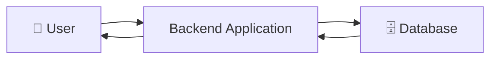

The application needs information such as:

```text
DB_HOST
DB_PORT
DB_USERNAME
DB_PASSWORD
DB_CONNECTION_TYPE
```

For example:

```text
DB_PORT = 3306
```

---

# ❌ THE PROBLEM WITH HARDCODING

A bad practice would be putting configuration directly inside the application:

```text
DB_HOST = "database"
DB_PORT = "3306"
DB_USERNAME = "admin"
DB_PASSWORD = "password"
```

Why is this a problem?

Because configuration can change.

For example:

```text
Before:

DB_PORT = 3306
```

Later:

```text
DB_PORT = 3307
```

If the value is hardcoded inside the application, the application code/image may need to be changed.

That is not a good configuration-management practice.

---

# ✅ EXTERNAL CONFIGURATION

Instead of hardcoding configuration inside the application, configuration can be provided externally.

Two common approaches are:

```text
Environment Variables
        OR
Configuration Files
```

For example:

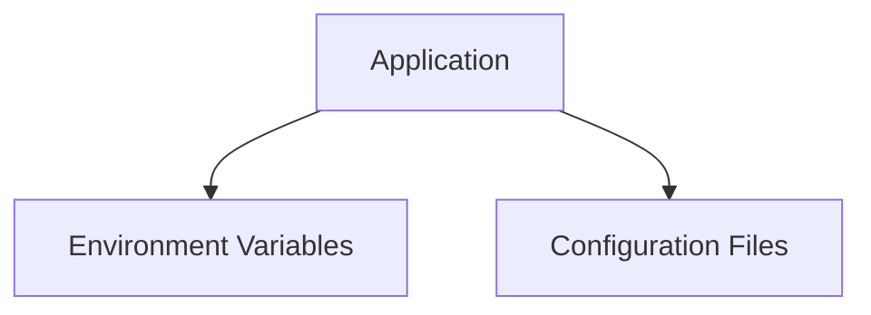

Kubernetes provides resources that help us manage this configuration.

---

# 🟦 WHAT IS A CONFIGMAP?

A **ConfigMap** is a Kubernetes resource used to store **non-sensitive configuration data**.

Examples:

```text
DB_HOST
DB_PORT
DB_CONNECTION_TYPE
Application settings
Configuration values
```

The basic idea:

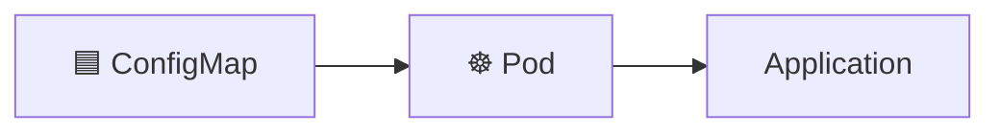

The configuration does not have to be hardcoded into the application image.

---

# 🔐 WHAT IS A SECRET?

A **Secret** is a Kubernetes resource intended for **sensitive information**.

Examples:

```text
DB_USERNAME
DB_PASSWORD
API_TOKEN
Credentials
TLS-related sensitive data
```

The basic idea:

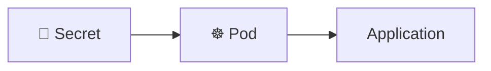

---

# ⚔️ CONFIGMAP VS SECRET

| Feature | ConfigMap | Secret |
|---|---|---|
| Purpose | Non-sensitive configuration | Sensitive information |
| DB Port | ✅ | ❌ |
| DB Host | ✅ | ❌ |
| Connection Type | ✅ | ❌ |
| DB Username | ❌ | ✅ |
| DB Password | ❌ | ✅ |
| API Token | ❌ | ✅ |
| Can be used by Pods | ✅ | ✅ |
| Environment Variables | ✅ | ✅ |
| Volume Mounts | ✅ | ✅ |
| Base64 representation | ❌ | ✅ |
| Encryption at Rest | Not the Secret mechanism | Supported when configured |
| RBAC importance | Important | 🔥 Extremely important |

### 🎤 INTERVIEW ANSWER

> ConfigMaps and Secrets are both Kubernetes resources used to store and provide configuration data to applications running inside Pods. ConfigMaps are intended for non-sensitive configuration, whereas Secrets are intended for sensitive information such as passwords, credentials and tokens.

---

# 🗄️ KUBERNETES API SERVER AND ETCD

Kubernetes stores cluster state in **etcd**.

A simplified flow is:

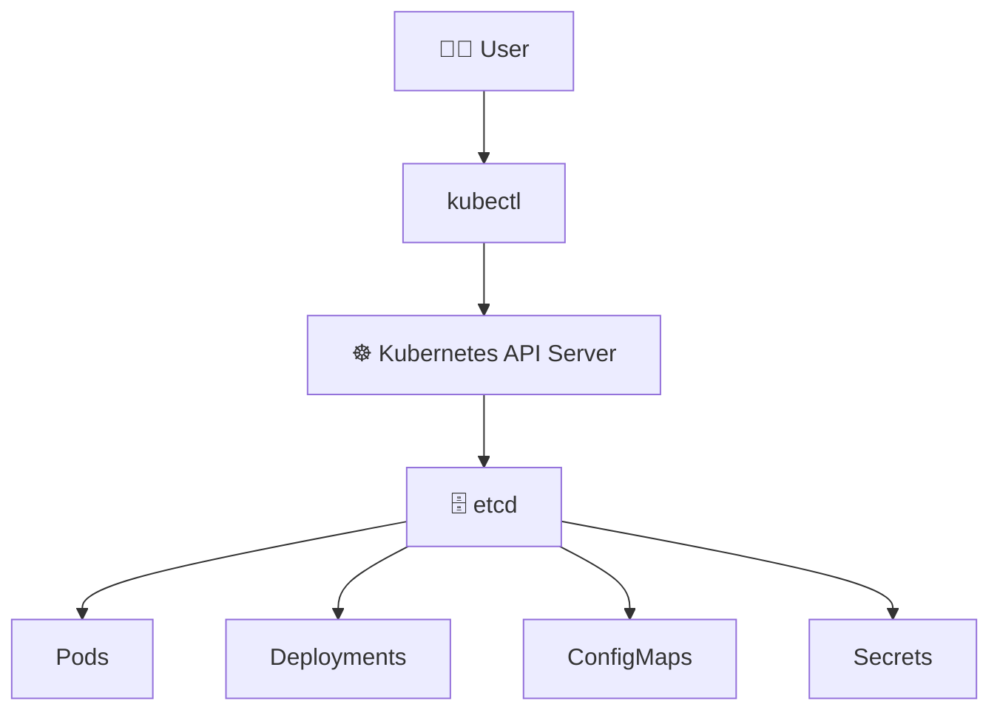

When we create a Kubernetes resource:

```text
kubectl
   ↓
API Server
   ↓
etcd
```

The Kubernetes API Server manages communication with etcd.

---

# 🔐 SECRETS AND ENCRYPTION AT REST

The teacher explained that Secrets can be protected using **encryption at rest**.

Conceptually:

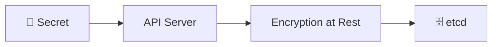

The important concept is:

```text
Secret
   ↓
Encryption
   ↓
Encrypted data
   ↓
etcd
```

Kubernetes also allows custom encryption configurations.

---

# 🔑 RBAC AND LEAST PRIVILEGE

Even if Secrets are protected at rest, access to the Secret resource itself must also be controlled.

This is where:

```text
RBAC
```

comes into the picture.

RBAC means:

```text
Role-Based Access Control
```

It determines:

```text
WHO
 ↓
CAN DO WHAT
 ↓
ON WHICH RESOURCE
```

For example:

```text
Developer
   |
   ├── Pods        ✅
   ├── Deployments ✅
   ├── ConfigMaps  ✅
   └── Secrets     ❌
```

A DevOps engineer who requires Secret access might have:

```text
DevOps Engineer
   |
   ├── Pods        ✅
   ├── Deployments ✅
   ├── ConfigMaps  ✅
   └── Secrets     ✅
```

This follows the security principle:

```text
🛡️ LEAST PRIVILEGE
```

Only give a user the permissions they actually need.

---

# 🧪 PRACTICAL 1 — CREATE CONFIGMAP

We first checked our existing Deployments.

```bash
kubectl get deploy
```

We saw:

```text
NAME                READY   UP-TO-DATE   AVAILABLE
hello-world         1/1     1            1
kubeshark-front     1/1     1            1
kubeshark-hub       1/1     1            1
sample-python-app   2/2     2            2
```

Our application for this practical was:

```text
sample-python-app
```

---

# 🔎 CHECK EXISTING CONFIGMAPS

We ran:

```bash
kubectl get cm
```

`cm` is the short form of:

```text
configmap
```

The cluster already contained several ConfigMaps.

We created our own:

```text
test-cm
```

---

# 📝 CREATE CONFIGMAP YAML

We opened the file:

```bash
vim cm.yaml
```

The intended configuration was:

```yaml
apiVersion: v1
kind: ConfigMap
metadata:
  name: test-cm
data:
  db-port: "3306"
```

This creates:

```text
ConfigMap
   |
   +── Name: test-cm
   |
   +── db-port = 3306
```

---

# ❌ FIRST CONFIGMAP ERROR

Initially our YAML contained:

```yaml
data::
```

instead of:

```yaml
data:
```

We executed:

```bash
kubectl apply -f cm.yaml
```

and received:

```text
Error from server (BadRequest):
ConfigMap in version "v1" cannot be handled as a ConfigMap:
strict decoding error: unknown field "data:"
```

We checked the file:

```bash
cat cm.yaml
```

and found:

```yaml
data::
  db-port: "3306"
```

The problem was the extra `:`.

---

# ✅ FIX CONFIGMAP

We corrected the YAML:

```yaml
apiVersion: v1
kind: ConfigMap
metadata:
  name: test-cm
data:
  db-port: "3306"
```

Then:

```bash
kubectl apply -f cm.yaml
```

Result:

```text
configmap/test-cm created
```

---

# 🔎 VERIFY CONFIGMAP

We ran:

```bash
kubectl get cm
```

and saw:

```text
test-cm
```

Then:

```bash
kubectl describe cm test-cm
```

Important output:

```text
Data
====
db-port:
----
3306
```

Therefore our ConfigMap was successfully created:

```text
test-cm
   |
   └── db-port = 3306
```

---

# 🐳 PREPARE THE PYTHON APPLICATION

We used the Python application from the Docker-Zero-to-Hero repository.

We checked:

```bash
ls -la Docker-Zero-to-Hero
```

Then:

```bash
cd Docker-Zero-to-Hero
```

We checked:

```bash
ls examples
```

and found:

```text
first-docker-file
golang-multi-stage-docker-build
python-web-app
```

We entered:

```bash
cd examples
cd python-web-app
```

The directory contained:

```text
Dockerfile
deployment.yml
devops
requirements.txt
service.yml
```

---

# 📄 PYTHON DEPLOYMENT

Our Deployment looked like:

```yaml
apiVersion: apps/v1
kind: Deployment

metadata:
  name: sample-python-app
  labels:
    app: sample-python-app

spec:
  replicas: 2

  selector:
    matchLabels:
      app: sample-python-app

  template:
    metadata:
      labels:
        app: sample-python-app

    spec:
      containers:
        - name: python-app
          image: abhishekf5/python-sample-app-demo:v1

          ports:
            - containerPort: 8000
```

The Deployment had:

```text
replicas: 2
```

Therefore Kubernetes maintained two Pods.

---

# 🚀 APPLY DEPLOYMENT

We ran:

```bash
kubectl apply -f deployment.yml
```

Initially:

```text
deployment.apps/sample-python-app unchanged
```

This means the existing Deployment already matched the manifest.

---

# 🔎 CHECK PODS

We ran:

```bash
kubectl get pods -w
```

We saw two Python application Pods.

We entered one:

```bash
kubectl exec -it sample-python-app-5ddcb9f87b-9l699 -- /bin/bash
```

Inside the container:

```bash
env | grep DB
```

There was no DB environment variable.

That was expected because the ConfigMap had not yet been connected to the Deployment.

---

# 🌱 PRACTICAL 2 — CONFIGMAP AS ENVIRONMENT VARIABLE

We modified `deployment.yml`.

We added:

```yaml
env:
  - name: DB-PORT
    valueFrom:
      configMapKeyRef:
        name: test-cm
        key: db-port
```

Let's understand every part.

```text
name: DB-PORT
```

This is the environment variable name.

```text
name: test-cm
```

This identifies the ConfigMap.

```text
key: db-port
```

This identifies the key inside the ConfigMap.

Therefore:

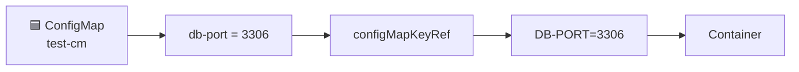

---

# 🚀 APPLY UPDATED DEPLOYMENT

We ran:

```bash
kubectl apply -f deployment.yml
```

Result:

```text
deployment.apps/sample-python-app configured
```

Because the Pod template changed, Kubernetes created new Pods.

We checked:

```bash
kubectl get pods -w
```

New Pods appeared:

```text
sample-python-app-57855c9dcc-pblsv
sample-python-app-57855c9dcc-wq7d4
```

---

# 🔍 VERIFY ENVIRONMENT VARIABLE

We entered the new Pod:

```bash
kubectl exec -it sample-python-app-57855c9dcc-pblsv -- /bin/bash
```

Then:

```bash
env | grep -i DB
```

Output:

```text
DB-PORT=3306
```

🎉 SUCCESS!

The ConfigMap value was successfully injected into the container as an environment variable.

---

# 🧩 ENVIRONMENT VARIABLE FLOW

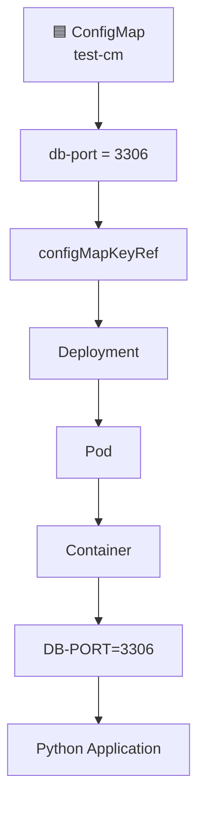

---

# ⚠️ IMPORTANT PROBLEM WITH ENVIRONMENT VARIABLES

Now we tested an important real-world scenario.

Suppose:

```text
ConfigMap:

db-port = 3306
```

The container receives:

```text
DB-PORT=3306
```

Now the database port changes.

ConfigMap becomes:

```text
db-port = 3307
```

The already-running container's environment does not dynamically become:

```text
DB-PORT=3307
```

The existing process continues with the environment it received.

Therefore:

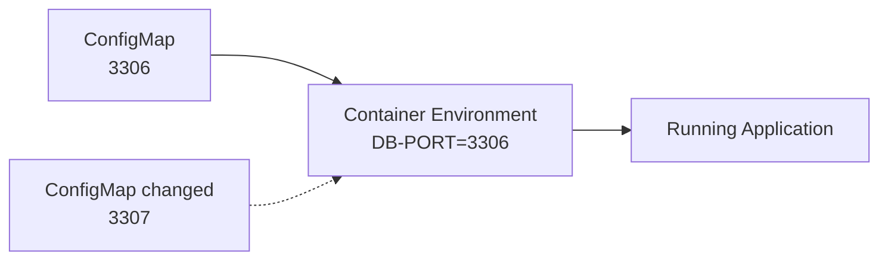

The application can therefore continue trying to use the old value.

---

# 💡 WHY VOLUME MOUNTS?

Instead of using an environment variable, we can mount ConfigMap data as files.

The concept becomes:

```text
ConfigMap
    ↓
Volume
    ↓
Mounted File
    ↓
Application reads file
```

This allows configuration files mounted from a ConfigMap to reflect ConfigMap updates after Kubernetes propagates the change.

---

# 📁 PRACTICAL 3 — CONFIGMAP AS VOLUME MOUNT

We removed the environment variable configuration from the Deployment.

Then we added:

```yaml
volumeMounts:
  - name: db-connection
    mountPath: /opt
```

And:

```yaml
volumes:
  - name: db-connection
    configMap:
      name: test-cm
```

---

# 🧠 UNDERSTANDING `volumes`

This:

```yaml
volumes:
  - name: db-connection
    configMap:
      name: test-cm
```

means:

```text
Create a volume called:

db-connection

Use:

test-cm

as the ConfigMap source.
```

---

# 🧠 UNDERSTANDING `volumeMounts`

This:

```yaml
volumeMounts:
  - name: db-connection
    mountPath: /opt
```

means:

```text
Take the volume:

db-connection

and mount it inside the container at:

/opt
```

The names must match:

```text
volumes:
  name: db-connection

volumeMounts:
  name: db-connection
```

---

# 🧩 VOLUME ARCHITECTURE

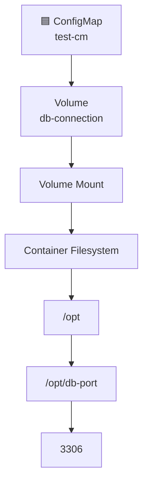

---

# 🚀 APPLY VOLUME MOUNT

We ran:

```bash
kubectl apply -f deployment.yml
```

Result:

```text
deployment.apps/sample-python-app configured
```

New Pods were created.

We checked:

```bash
kubectl get pods
```

and saw:

```text
sample-python-app-789588d595-kgvvc
sample-python-app-789588d595-xczqt
```

---

# 🔍 ENTER THE POD

We entered:

```bash
kubectl exec -it sample-python-app-789588d595-kgvvc -- /bin/bash
```

Then checked:

```bash
env | grep DB
```

There was no output.

Why?

Because the environment-variable configuration had been removed.

That was expected.

---

# 📁 CHECK THE MOUNTED DIRECTORY

We ran:

```bash
ls /opt
```

Output:

```text
db-port
```

Kubernetes created a file corresponding to the ConfigMap key.

We then ran:

```bash
cat /opt/db-port
```

Output:

```text
3306
```

Therefore:

```text
ConfigMap
   |
   +── db-port = 3306
            |
            v
      ConfigMap Volume
            |
            v
           /opt
            |
            v
      /opt/db-port
            |
            v
           3306
```

---

# 🔄 PRACTICAL 4 — UPDATE MOUNTED CONFIGMAP

Initially:

```text
db-port = 3306
```

We changed the ConfigMap to:

```text
db-port = 3307
```

Then applied:

```bash
kubectl apply -f cm.yml
```

Output:

```text
configmap/test-cm configured
```

---

# 🔎 VERIFY CONFIGMAP UPDATE

We ran:

```bash
kubectl describe cm test-cm
```

Output:

```text
Data
====
db-port:
----
3307
```

The ConfigMap was updated successfully.

---

# 🔍 CHECK POD

We ran:

```bash
kubectl get pods
```

The existing Python Pods were still running.

They were not recreated simply because the ConfigMap value changed.

We then entered the existing Pod:

```bash
kubectl exec -it sample-python-app-789588d595-kgvvc -- /bin/bash
```

and checked:

```bash
cat /opt/db-port
```

Output:

```text
3307
```

🎉 The mounted file reflected the new ConfigMap value.

---

# 🔄 SECOND UPDATE — 3307 → 3309

We changed:

```text
3307
```

to:

```text
3309
```

Then:

```bash
kubectl apply -f cm.yml
```

Initially, the mounted file could still show the old value.

After waiting for Kubernetes to propagate the change:

```bash
cat /opt/db-port
```

Output:

```text
3309
```

---

# ⏳ IMPORTANT OBSERVATION

The mounted ConfigMap update is not necessarily instantaneous.

The flow is:

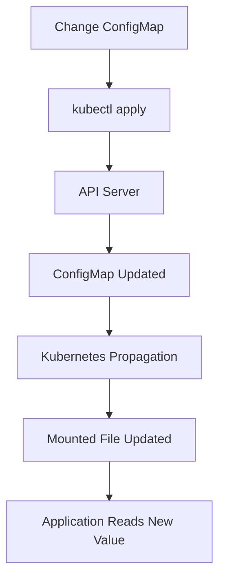

Therefore:

```text
3306
  ↓
3307
  ↓
3309
```

was successfully demonstrated through the mounted file.

---

# 🆚 ENVIRONMENT VARIABLE VS VOLUME MOUNT

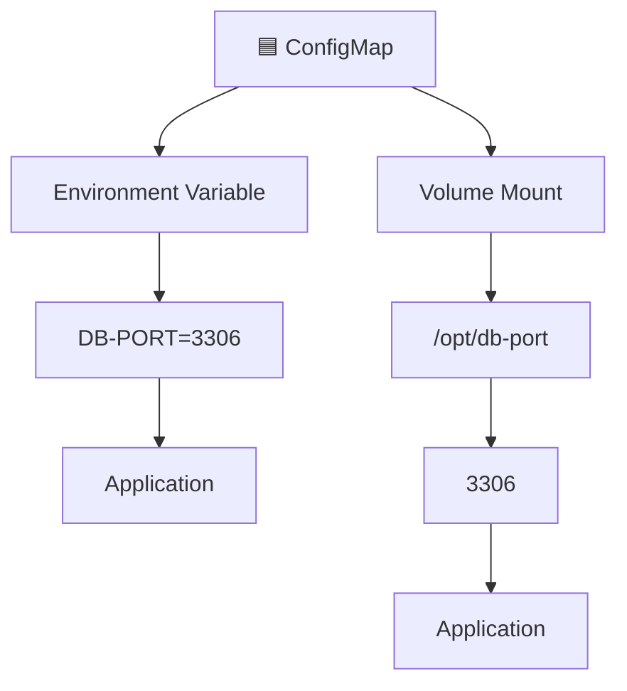

### Environment Variable

```text
ConfigMap
   ↓
Environment Variable
   ↓
Container Process
```

The running process does not dynamically receive later ConfigMap changes through its environment.

### Volume Mount

```text
ConfigMap
   ↓
Volume
   ↓
Mounted File
```

The mounted file can be updated after Kubernetes propagates ConfigMap changes.

---

# 🔐 PRACTICAL 5 — CREATE SECRET

After completing ConfigMap, we started Secrets.

We first ran:

```bash
kubectl create secret
```

Kubernetes displayed the available Secret types:

```text
docker-registry
generic
tls
```

---

# 📦 SECRET TYPES

### 1️⃣ Docker Registry Secret

```text
docker-registry
```

Used for credentials required to access a container registry.

### 2️⃣ Generic Secret

```text
generic
```

Creates a generic Secret.

The resulting type is:

```text
Opaque
```

### 3️⃣ TLS Secret

```text
tls
```

Used for storing TLS certificate-related data and its associated key.

---

# ❌ GENERIC SECRET WITHOUT NAME

We ran:

```bash
kubectl create secret generic
```

Kubernetes returned:

```text
error: exactly one NAME is required, got 0
```

A Secret name is required.

---

# 🔐 CREATE GENERIC SECRET

We created the Secret using:

```bash
kubectl create secret generic test-secret --from-literal=db-port="3306"
```

Output:

```text
secret/test-secret created
```

Our Secret was:

```text
Name:
test-secret

Type:
Opaque

Key:
db-port

Value:
3306
```

---

# 🔎 PRACTICAL 6 — INSPECT SECRET

We ran:

```bash
kubectl describe secret test-secret
```

Important output:

```text
Name:         test-secret
Namespace:    default

Type:         Opaque

Data
====
db-port:      4 bytes
```

Notice:

```text
db-port: 4 bytes
```

The actual value was not displayed in the `describe` output.

---

# ✏️ EDIT SECRET

We also ran:

```bash
kubectl edit secret test-secret
```

We cancelled the edit:

```text
Edit cancelled, no changes made.
```

No changes were made.

---

# 🔎 GET SECRET AS YAML

We ran:

```bash
kubectl get secret test-secret -o yaml
```

Important section:

```yaml
data:
  db-port: MzMwNg==
```

Instead of:

```text
3306
```

we saw:

```text
MzMwNg==
```

---

# ⚠️ BASE64 IS NOT ENCRYPTION

This is one of the most important concepts from the practical.

We decoded:

```bash
echo MzMwNg== | base64 --decode
```

Output:

```text
3306
```

Therefore:

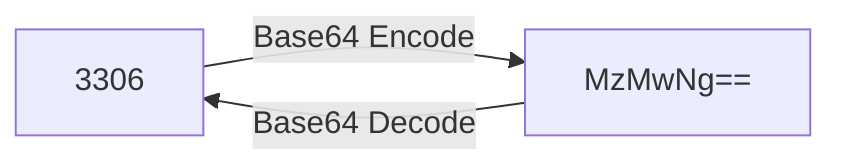

So:

```text
Base64 ≠ Encryption
```

Base64 is simply an encoding mechanism.

It should NOT be treated as a security mechanism by itself.

---

# 🔐 SECRET SECURITY MODEL

The important Secret security concepts discussed were:

```text
🔐 Encryption at Rest
        +
🔑 RBAC
        +
🛡️ Least Privilege
```

Conceptually:

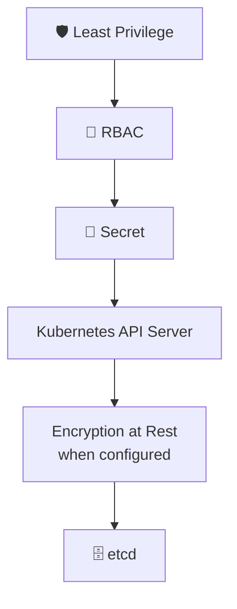

---

# 🧩 COMPLETE CONFIGMAP FLOW

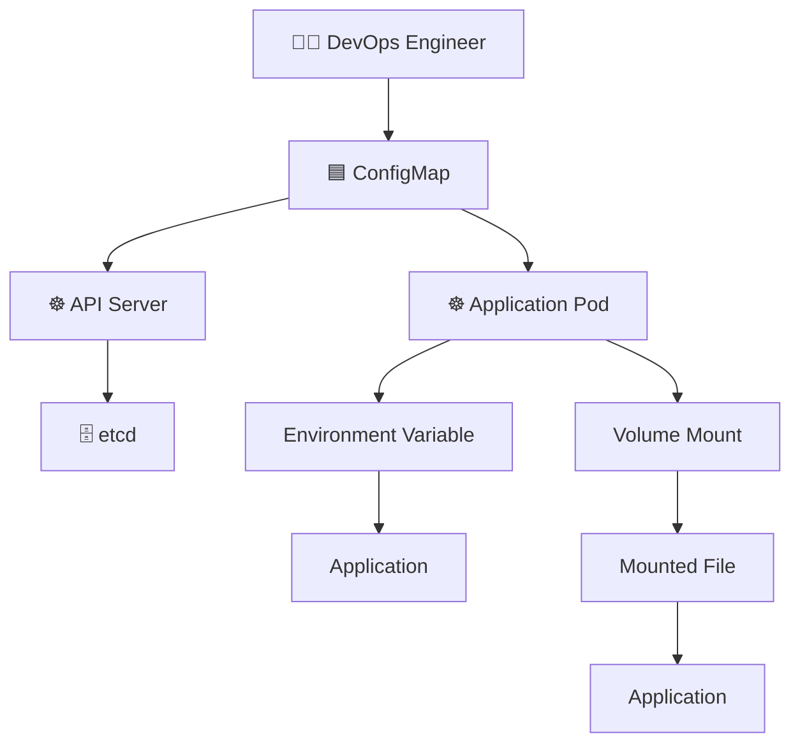

---

# 🧩 COMPLETE SECRET FLOW

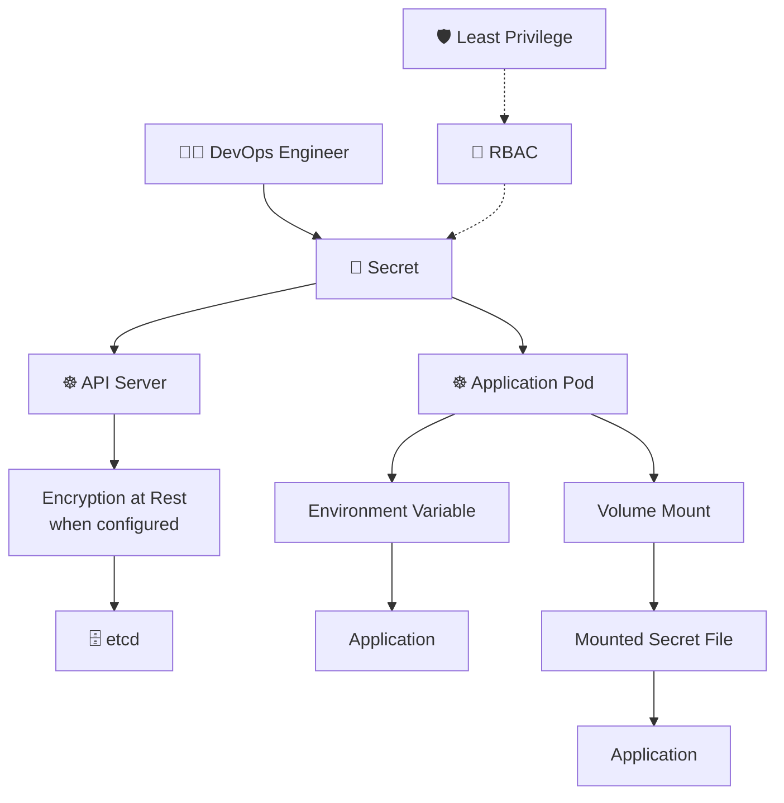

---

# 🧠 COMPLETE DAY 41 ARCHITECTURE

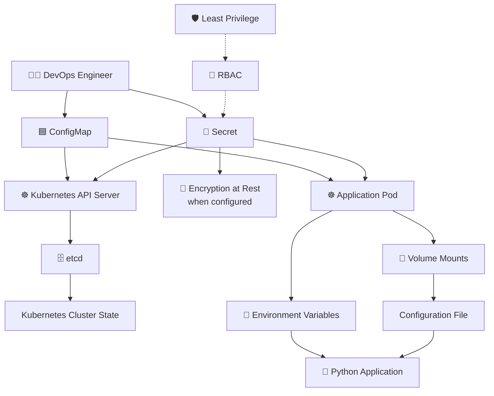

---

# 🎤 INTERVIEW QUESTIONS

## Q1. What is a ConfigMap?

A ConfigMap is a Kubernetes resource used to store non-sensitive configuration data and make that configuration available to applications running inside Pods.

Examples:

```text
DB_HOST
DB_PORT
DB_CONNECTION_TYPE
Application configuration
```

---

## Q2. What is a Secret?

A Secret is a Kubernetes resource intended to store sensitive information such as:

```text
Passwords
Credentials
API Tokens
TLS-related sensitive data
```

---

## Q3. What is the difference between ConfigMap and Secret?

The simplest answer:

```text
ConfigMap → Non-sensitive configuration

Secret → Sensitive information
```

Both can provide data to Pods using:

```text
Environment Variables
Volume Mounts
```

---

## Q4. How do you use a ConfigMap as an environment variable?

Example:

```yaml
env:
  - name: DB-PORT
    valueFrom:
      configMapKeyRef:
        name: test-cm
        key: db-port
```

This means:

```text
test-cm
   |
   └── db-port = 3306
              |
              v
        DB-PORT=3306
```

---

## Q5. How do you use a ConfigMap as a volume?

Example:

```yaml
volumeMounts:
  - name: db-connection
    mountPath: /opt

volumes:
  - name: db-connection
    configMap:
      name: test-cm
```

The ConfigMap key:

```text
db-port
```

became:

```text
/opt/db-port
```

inside the container.

---

## Q6. What happens when a ConfigMap used as an environment variable changes?

The existing running process does not automatically receive the new value through its environment.

If the application had:

```text
DB-PORT=3306
```

and the ConfigMap changes to:

```text
3307
```

the existing process continues using its existing environment.

---

## Q7. What happens when a ConfigMap is mounted as a volume?

The mounted file can reflect ConfigMap updates after Kubernetes propagates the change.

We demonstrated:

```text
3306
 ↓
3307
 ↓
3309
```

without restarting the existing Pod.

---

## Q8. Is Base64 encryption?

❌ No.

Base64 is encoding.

Example:

```text
3306
   ↓
MzMwNg==
```

and:

```bash
echo MzMwNg== | base64 --decode
```

returns:

```text
3306
```

Therefore:

```text
Base64 ≠ Encryption
```

---

## Q9. Why is RBAC important for Secrets?

Because users who have permission to read Secrets may be able to retrieve sensitive Secret data through Kubernetes APIs.

Therefore:

```text
Only users who require Secret access
should receive Secret permissions.
```

This follows:

```text
🛡️ Least Privilege
```

---

## Q10. Where does Kubernetes store cluster state?

Kubernetes uses:

```text
etcd
```

The API Server communicates with etcd to persist Kubernetes cluster state.

---

# 🧠 FINAL MENTAL MODEL

Do not just memorize the YAML.

Understand the problem.

```text
                APPLICATION
                     |
                     v
            Needs Configuration
                     |
             +-------+-------+
             |               |
             v               v
      NON-SENSITIVE       SENSITIVE
             |               |
             v               v
        🟦 ConfigMap      🔐 Secret
             |               |
       +-----+-----+   +-----+-----+
       |           |   |           |
       v           v   v           v
      ENV        VOLUME ENV       VOLUME
                   |                |
                   v                v
                 FILE             FILE
       |           |   |           |
       +-----+-----+   +-----+-----+
             |               |
             +-------+-------+
                     |
                     v
                    POD
                     |
                     v
               APPLICATION
```

---

# 🔥 OUR ACTUAL CONFIGMAP PRACTICAL

We created:

```text
ConfigMap:
test-cm
```

with:

```text
db-port = 3306
```

Then consumed it as an environment variable:

```text
DB-PORT=3306
```

Then changed the design to a volume mount:

```text
/opt/db-port
```

Then demonstrated updates:

```text
3306
 ↓
3307
 ↓
3309
```

The Pod remained running while the mounted file reflected the updated ConfigMap value after propagation.

---

# 🔐 OUR ACTUAL SECRET PRACTICAL

We created:

```text
Secret:
test-secret
```

using:

```bash
kubectl create secret generic test-secret --from-literal=db-port="3306"
```

Kubernetes created:

```text
Type: Opaque
```

We inspected it:

```bash
kubectl describe secret test-secret
```

Then:

```bash
kubectl get secret test-secret -o yaml
```

showed:

```yaml
data:
  db-port: MzMwNg==
```

Finally:

```bash
echo MzMwNg== | base64 --decode
```

returned:

```text
3306
```

---

# ⚠️ ALL ERRORS WE ENCOUNTERED

### ❌ 1. Uppercase `KUBECTL`

```bash
KUBECTL GET DEPLOY
```

Result:

```text
KUBECTL: command not found
```

Correct:

```bash
kubectl get deploy
```

Linux commands are case-sensitive.

---

### ❌ 2. `data::`

Incorrect:

```yaml
data::
```

Correct:

```yaml
data:
```

---

### ❌ 3. `cd ls -la`

We accidentally ran:

```bash
cd ls -la Docker-Zero-to-Hero
```

Result:

```text
cd: too many arguments
```

Correct:

```bash
ls -la Docker-Zero-to-Hero
cd Docker-Zero-to-Hero
```

---

### ❌ 4. Running YAML as a Command

We typed:

```bash
deployment.yml
```

Result:

```text
deployment.yml: command not found
```

Correct:

```bash
kubectl apply -f deployment.yml
```

---

### ❌ 5. YAML Syntax Error

We encountered:

```text
yaml: line 27: could not find expected ':'
```

This was caused by incorrect YAML syntax/indentation.

After correcting the file:

```bash
kubectl apply -f deployment.yml
```

worked.

---

### ❌ 6. Vim Inside Container

Inside the Python container:

```bash
vim cm.yml
```

Result:

```text
vim: command not found
```

The container image did not contain Vim.

We exited the container and edited the file from the host.

---

### ❌ 7. Incorrect `kubectl -f`

We ran:

```bash
kubectl -f cm.yml
```

Result:

```text
unknown shorthand flag: 'f' in -f
```

Correct:

```bash
kubectl apply -f cm.yml
```

---

### ❌ 8. Secret Without Name

We ran:

```bash
kubectl create secret generic
```

Result:

```text
exactly one NAME is required, got 0
```

Correct:

```bash
kubectl create secret generic test-secret --from-literal=db-port="3306"
```

---

# 🧠 COMMAND CHEAT SHEET

## Deployment

```bash
kubectl get deploy
kubectl apply -f deployment.yml
```

## ConfigMap

```bash
kubectl get cm
kubectl apply -f cm.yml
kubectl describe cm test-cm
```

## Pods

```bash
kubectl get pods
kubectl get pods -w
kubectl exec -it <pod-name> -- /bin/bash
```

## Environment Variable

```bash
env | grep -i DB
```

## Mounted ConfigMap

```bash
ls /opt
cat /opt/db-port
```

## Secret

```bash
kubectl create secret
kubectl create secret generic test-secret --from-literal=db-port="3306"
kubectl describe secret test-secret
kubectl edit secret test-secret
kubectl get secret test-secret -o yaml
```

## Base64

```bash
echo MzMwNg== | base64 --decode
```

---

# 🏆 KEY TAKEAWAYS

```text
1️⃣ ConfigMap
   → Used for non-sensitive configuration.

2️⃣ Secret
   → Used for sensitive information.

3️⃣ Environment Variable
   → Existing running processes do not dynamically receive
     later ConfigMap changes through their environment.

4️⃣ Volume Mount
   → ConfigMap data can be mounted as files.

5️⃣ Mounted ConfigMap
   → Mounted files can reflect ConfigMap updates after
     Kubernetes propagation.

6️⃣ Base64
   → Encoding, NOT encryption.

7️⃣ Encryption at Rest
   → Can protect Secret data when properly configured.

8️⃣ RBAC
   → Controls who can access Kubernetes resources.

9️⃣ Least Privilege
   → Give users only the permissions they actually need.

🔟 etcd
   → Stores Kubernetes cluster state.
```

---

# 🚀 DAY 41 — COMPLETE FLOW

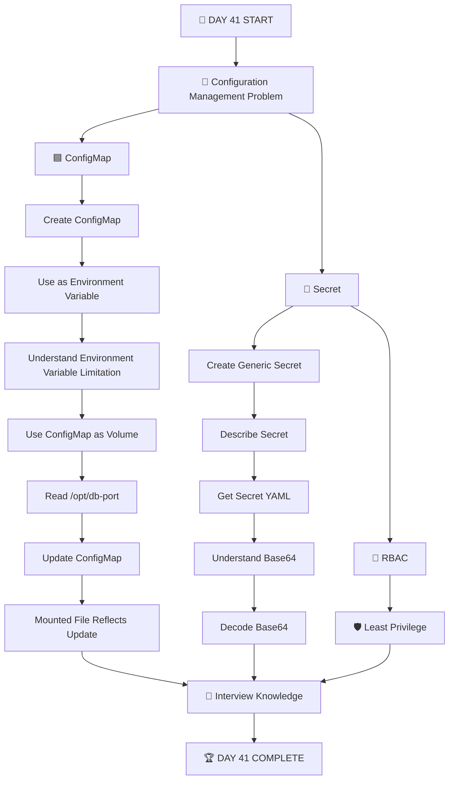

---

# 🧠 THE ONE THING TO REMEMBER

```text
                 KUBERNETES CONFIGURATION
                          |
             +------------+------------+
             |                         |
             v                         v
       🟦 ConfigMap               🔐 Secret
             |                         |
       Non-sensitive               Sensitive
             |                         |
             +------------+------------+
                          |
                          v
                         POD
                          |
                +---------+---------+
                |                   |
                v                   v
        Environment Variable    Volume Mount
                |                   |
                |                   v
                |                File
                |
                v
          Running Process
```

### In one sentence:

> **ConfigMaps store non-sensitive configuration, Secrets are intended for sensitive configuration, and both can be consumed by Pods through environment variables or volume mounts — while Secret security depends on controls such as encryption at rest and RBAC/least privilege.**

---

<div align="center">

# 🔥 DAY 41 COMPLETE 🔥

## ☸️ KUBERNETES CONFIGMAPS & SECRETS

### 🟦 ConfigMap • 🔐 Secret • 🌱 Environment Variables • 📁 Volume Mounts • 🔑 RBAC

**Learn → Practice → Break → Fix → Verify → Understand**

</div>
