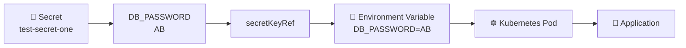
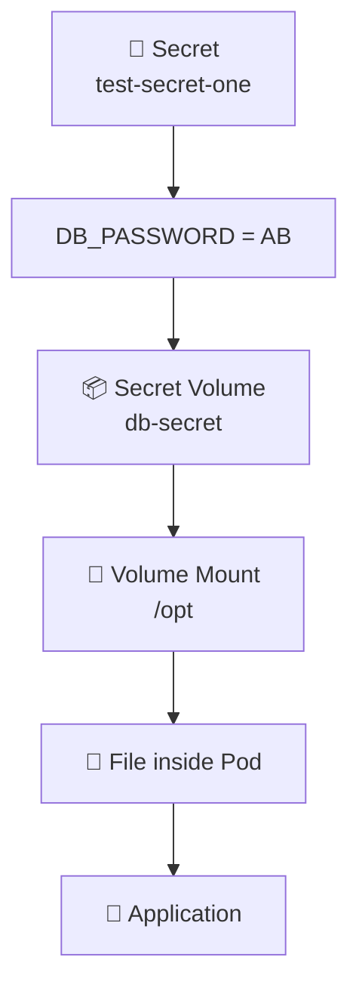
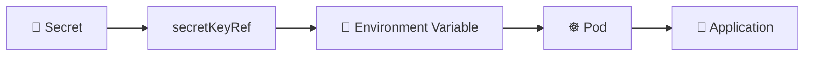
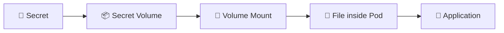
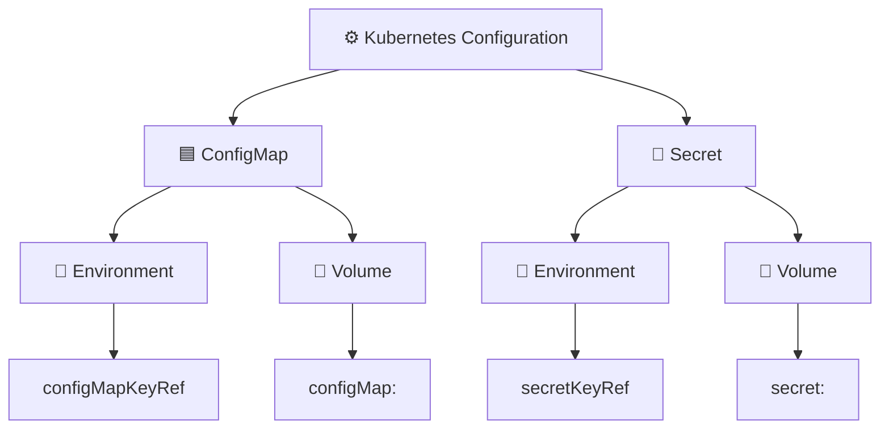
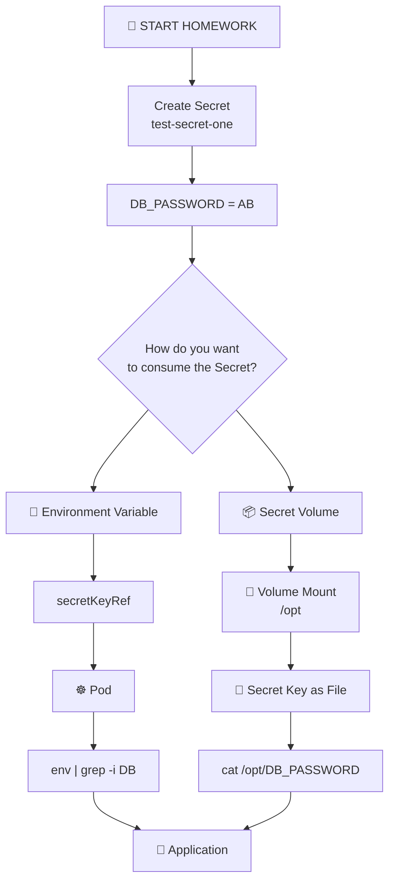
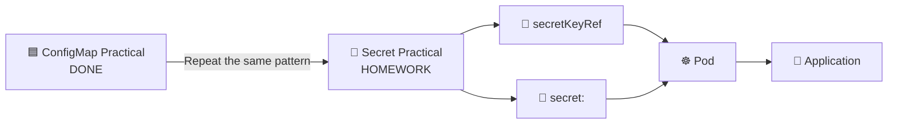

# 🔐 DAY 41 — KUBERNETES SECRETS HOMEWORK

## 🧪 Complete Practical — Repeat the ConfigMap Exercise Using Secrets

<p align="center">

### 🔐 Secret → Environment Variable → Volume Mount

**Teacher's Assignment**

</p>

---

# 🎯 WHAT YOUR TEACHER WANTS YOU TO DO

You already completed the practical using a **ConfigMap**:

```text
ConfigMap
    ↓
Deployment
    ↓
Pod
    ↓
Environment Variable / Volume Mount
```

Now your teacher wants you to **repeat the same practical using a Secret instead of a ConfigMap**.

The main purpose is to understand:

```text
🟦 ConfigMap
      ↓
Non-sensitive configuration

        VS

🔐 Secret
      ↓
Sensitive configuration
```

You are **not learning a completely new concept**.

You are taking the exact ConfigMap pattern you already practiced and replacing the ConfigMap references with Secret references.

---

# 🔐 1️⃣ CREATE ANOTHER SECRET

You already successfully created:

```text
test-secret
```

Your teacher now wants you to create a **new Secret specifically for a DB password**.

The Secret should contain:

```text
Secret name:
test-secret-one

Key:
DB_PASSWORD

Value:
AB
```

The practice value is simply:

```text
AB
```

So conceptually:

```text
🔐 test-secret-one
        |
        └── DB_PASSWORD = AB
```

### Command

```bash
kubectl create secret generic test-secret-one --from-literal=DB_PASSWORD="AB"
```

After creating it, you can verify it with:

```bash
kubectl get secret
```

and:

```bash
kubectl describe secret test-secret-one
```

---

# 🧠 2️⃣ UNDERSTAND WHAT WE ARE CHANGING

Previously, with the ConfigMap, you used:

```yaml
configMapKeyRef:
  name: test-cm
  key: db-port
```

This means:

```text
Go to ConfigMap
       ↓
Find ConfigMap: test-cm
       ↓
Find key: db-port
       ↓
Get its value
       ↓
Provide that value to the container
```

Now your teacher wants you to replace that with:

```yaml
secretKeyRef:
  name: test-secret-one
  key: DB_PASSWORD
```

This means:

```text
Go to Secret
       ↓
Find Secret: test-secret-one
       ↓
Find key: DB_PASSWORD
       ↓
Get its value
       ↓
Provide that value to the container
```

The most important change is:

```text
configMapKeyRef
       ↓
secretKeyRef
```

---

# 🌱 3️⃣ SECRET AS AN ENVIRONMENT VARIABLE

Your previous ConfigMap configuration looked like this:

```yaml
env:
  - name: DB-PORT
    valueFrom:
      configMapKeyRef:
        name: test-cm
        key: db-port
```

The Secret equivalent is:

```yaml
env:
  - name: DB_PASSWORD
    valueFrom:
      secretKeyRef:
        name: test-secret-one
        key: DB_PASSWORD
```

---

# 🔄 4️⃣ UNDERSTAND THE SECRET ENVIRONMENT VARIABLE FLOW



So the complete idea is:

```text
🔐 Secret
     ↓
secretKeyRef
     ↓
🌱 Environment Variable
     ↓
☸️ Pod
     ↓
🐍 Application
```

---

# 📝 5️⃣ WHAT EACH FIELD MEANS

Look at:

```yaml
env:
  - name: DB_PASSWORD
    valueFrom:
      secretKeyRef:
        name: test-secret-one
        key: DB_PASSWORD
```

### `env`

```yaml
env:
```

Means:

> Create an environment variable inside the container.

---

### `name`

```yaml
name: DB_PASSWORD
```

Means:

> The environment variable inside the container will be called `DB_PASSWORD`.

---

### `valueFrom`

```yaml
valueFrom:
```

Means:

> The value will come from another Kubernetes resource.

---

### `secretKeyRef`

```yaml
secretKeyRef:
```

Means:

> Get the value from a specific key inside a Secret.

---

### `name`

```yaml
name: test-secret-one
```

Means:

> Use the Secret named `test-secret-one`.

---

### `key`

```yaml
key: DB_PASSWORD
```

Means:

> Get the `DB_PASSWORD` key from that Secret.

---

# 🚀 6️⃣ APPLY THE DEPLOYMENT

After adding the Secret reference to your `deployment.yml`, apply it:

```bash
kubectl apply -f deployment.yml
```

Then check the Pods:

```bash
kubectl get pods
```

If the Pod template changed, Kubernetes will create updated Pods.

You can watch them using:

```bash
kubectl get pods -w
```

---

# 🔎 7️⃣ ENTER THE POD

Once the new Pod is running:

```bash
kubectl exec -it <pod-name> -- /bin/bash
```

For example:

```bash
kubectl exec -it sample-python-app-<pod-id> -- /bin/bash
```

Then check the environment variables:

```bash
env | grep -i DB
```

You should see the Secret being provided to the container as an environment variable.

Conceptually:

```text
DB_PASSWORD=AB
```

The complete flow is:

```text
🔐 test-secret-one
        |
        | DB_PASSWORD = AB
        ↓
secretKeyRef
        |
        ↓
DB_PASSWORD
        |
        ↓
☸️ Pod
        |
        ↓
🐍 Application
```

---

# 📁 8️⃣ SECRET AS A VOLUME

Your teacher also wants you to repeat the **ConfigMap volume mount exercise** using a Secret.

Previously, you used:

```yaml
volumes:
  - name: db-connection
    configMap:
      name: test-cm
```

This meant:

```text
Create a volume
       ↓
Read its data from ConfigMap
       ↓
ConfigMap = test-cm
```

Now replace the ConfigMap with a Secret:

```yaml
volumes:
  - name: db-secret
    secret:
      secretName: test-secret-one
```

The important change is:

```text
configMap:
     ↓
secret:
```

---

# 📂 9️⃣ MOUNT THE SECRET VOLUME

The volume itself is not enough.

We also need to mount it inside the container.

Use:

```yaml
volumeMounts:
  - name: db-secret
    mountPath: /opt
```

So the complete concept is:

```yaml
containers:
  - name: python-app
    image: abhishekf5/python-sample-app-demo:v1

    volumeMounts:
      - name: db-secret
        mountPath: /opt

volumes:
  - name: db-secret
    secret:
      secretName: test-secret-one
```

---

# 🧠 🔟 UNDERSTAND SECRET VOLUME MOUNT



The flow is:

```text
🔐 Secret
     ↓
📦 Secret Volume
     ↓
📁 Volume Mount
     ↓
/opt
     ↓
📄 File inside Pod
     ↓
🐍 Application
```

---

# 🧪 1️⃣1️⃣ VERIFY THE SECRET VOLUME

After modifying `deployment.yml`, apply it:

```bash
kubectl apply -f deployment.yml
```

Check the Pods:

```bash
kubectl get pods
```

Enter one of the Pods:

```bash
kubectl exec -it <pod-name> -- /bin/bash
```

Then check:

```bash
ls /opt
```

The Secret key will be represented as a file inside the mounted directory.

For example:

```text
DB_PASSWORD
```

You can then read the mounted file:

```bash
cat /opt/DB_PASSWORD
```

The exact file name comes from the Secret key.

Conceptually:

```text
🔐 test-secret-one

DB_PASSWORD = AB

        ↓

📦 Secret Volume

        ↓

📁 /opt

        ↓

📄 /opt/DB_PASSWORD

        ↓

AB
```

---

# 🔥 1️⃣2️⃣ YOUR TWO HOMEWORK EXERCISES

Your teacher is essentially giving you **two exercises**.

## Exercise 1 — Secret → Environment Variable



Use:

```yaml
env:
  - name: DB_PASSWORD
    valueFrom:
      secretKeyRef:
        name: test-secret-one
        key: DB_PASSWORD
```

Then:

```bash
kubectl apply -f deployment.yml
```

Check:

```bash
kubectl get pods
```

Enter:

```bash
kubectl exec -it <pod-name> -- /bin/bash
```

Verify:

```bash
env | grep -i DB
```

---

# 📁 Exercise 2 — Secret → Volume Mount



Use:

```yaml
volumes:
  - name: db-secret
    secret:
      secretName: test-secret-one
```

and:

```yaml
volumeMounts:
  - name: db-secret
    mountPath: /opt
```

Then:

```bash
kubectl apply -f deployment.yml
```

Check:

```bash
kubectl get pods
```

Enter:

```bash
kubectl exec -it <pod-name> -- /bin/bash
```

Check:

```bash
ls /opt
```

Then:

```bash
cat /opt/DB_PASSWORD
```

---

# 🆚 1️⃣3️⃣ CONFIGMAP VS SECRET — THE EXACT PATTERN

You already learned this with ConfigMap:

```text
🟦 CONFIGMAP

ConfigMap
    ↓
Deployment
    ↓
configMapKeyRef
    ↓
Environment Variable
    ↓
Pod
```

Or:

```text
🟦 CONFIGMAP

ConfigMap
    ↓
Deployment
    ↓
configMap:
    ↓
Volume
    ↓
Volume Mount
    ↓
File inside Pod
```

Now repeat the same thing with Secret:

```text
🔐 SECRET

Secret
    ↓
Deployment
    ↓
secretKeyRef
    ↓
Environment Variable
    ↓
Pod
```

Or:

```text
🔐 SECRET

Secret
    ↓
Deployment
    ↓
secret:
    ↓
Volume
    ↓
Volume Mount
    ↓
File inside Pod
```

---

# 🧠 1️⃣4️⃣ THE FOUR THINGS YOU MUST REMEMBER

There are four important keywords.

```text
🟦 CONFIGMAP + ENVIRONMENT VARIABLE

configMapKeyRef:
```

```text
🔐 SECRET + ENVIRONMENT VARIABLE

secretKeyRef:
```

```text
🟦 CONFIGMAP + VOLUME

configMap:
```

```text
🔐 SECRET + VOLUME

secret:
```

Remember them like this:



---

# 📊 1️⃣5️⃣ SIMPLE COMPARISON TABLE

| Purpose | ConfigMap | Secret |
|---|---|---|
| Type of information | Non-sensitive | Sensitive |
| Environment variable | `configMapKeyRef` | `secretKeyRef` |
| Volume source | `configMap:` | `secret:` |
| Example resource | `test-cm` | `test-secret-one` |
| Example key | `db-port` | `DB_PASSWORD` |
| Example value | `3306` | `AB` |

---

# 🧩 1️⃣6️⃣ SIDE-BY-SIDE COMPARISON

## 🟦 What you already did

```yaml
env:
  - name: DB-PORT
    valueFrom:
      configMapKeyRef:
        name: test-cm
        key: db-port
```

## 🔐 What you now need to do

```yaml
env:
  - name: DB_PASSWORD
    valueFrom:
      secretKeyRef:
        name: test-secret-one
        key: DB_PASSWORD
```

The only major change is:

```text
configMapKeyRef
        ↓
secretKeyRef
```

---

# 📁 1️⃣7️⃣ VOLUME SIDE-BY-SIDE

## 🟦 What you already did

```yaml
volumes:
  - name: db-connection
    configMap:
      name: test-cm
```

## 🔐 What you now need to do

```yaml
volumes:
  - name: db-secret
    secret:
      secretName: test-secret-one
```

The important change is:

```text
configMap:
     ↓
secret:
```

And notice the Secret volume uses:

```yaml
secretName:
```

to identify the Secret.

---

# 🧠 1️⃣8️⃣ THE WHOLE HOMEWORK IN ONE DIAGRAM



---

# 📝 1️⃣9️⃣ STEP-BY-STEP COMMAND CHECKLIST

## Step 1 — Create the Secret

```bash
kubectl create secret generic test-secret-one --from-literal=DB_PASSWORD="AB"
```

---

## Step 2 — Verify Secret

```bash
kubectl get secret
```

```bash
kubectl describe secret test-secret-one
```

---

## Step 3 — Modify Deployment for Environment Variable

Add:

```yaml
env:
  - name: DB_PASSWORD
    valueFrom:
      secretKeyRef:
        name: test-secret-one
        key: DB_PASSWORD
```

---

## Step 4 — Apply Deployment

```bash
kubectl apply -f deployment.yml
```

---

## Step 5 — Check Pods

```bash
kubectl get pods
```

or:

```bash
kubectl get pods -w
```

---

## Step 6 — Enter Pod

```bash
kubectl exec -it <pod-name> -- /bin/bash
```

---

## Step 7 — Verify Secret Environment Variable

```bash
env | grep -i DB
```

Expected concept:

```text
DB_PASSWORD=AB
```

---

## Step 8 — Practice Secret Volume

Use:

```yaml
volumes:
  - name: db-secret
    secret:
      secretName: test-secret-one
```

and:

```yaml
volumeMounts:
  - name: db-secret
    mountPath: /opt
```

---

## Step 9 — Apply Again

```bash
kubectl apply -f deployment.yml
```

---

## Step 10 — Enter Pod Again

```bash
kubectl exec -it <pod-name> -- /bin/bash
```

---

## Step 11 — Check Mounted Files

```bash
ls /opt
```

---

## Step 12 — Read the Secret File

```bash
cat /opt/DB_PASSWORD
```

---

# 🎯 2️⃣0️⃣ WHAT YOUR TEACHER IS REALLY TESTING

Your teacher is not simply asking:

> "Can you create a Secret?"

He wants to see whether you understood the **same ConfigMap pattern**.

You already know:

```text
ConfigMap
     ↓
Reference it
     ↓
Deployment
     ↓
Pod
```

Now you should be able to do:

```text
Secret
     ↓
Reference it
     ↓
Deployment
     ↓
Pod
```

And you should know both methods:

```text
                🔐 SECRET
                    |
             ┌──────┴──────┐
             ↓             ↓
       🌱 Environment   📁 Volume
             |             |
             ↓             ↓
       secretKeyRef     secret:
             |             |
             ↓             ↓
            Pod           Pod
```

---

# 🧠 2️⃣1️⃣ EASIEST MEMORY TRICK

Just remember these substitutions:

```text
CONFIGMAP                         SECRET
─────────                         ──────

configMapKeyRef       →          secretKeyRef

configMap:            →          secret:

test-cm               →          test-secret-one
```

So:

```text
🟦 ConfigMap

configMapKeyRef
       ↓
Environment Variable
```

becomes:

```text
🔐 Secret

secretKeyRef
       ↓
Environment Variable
```

And:

```text
🟦 ConfigMap

configMap:
       ↓
Volume
```

becomes:

```text
🔐 Secret

secret:
       ↓
Volume
```

---

# 🔥 2️⃣2️⃣ FINAL REVISION

```text
              KUBERNETES
                   |
          Application needs data
                   |
                   ↓
        ┌──────────────────────┐
        │   Is data sensitive? │
        └──────────┬───────────┘
                   |
            ┌──────┴──────┐
            ↓             ↓
           NO            YES
            |             |
            ↓             ↓
     🟦 ConfigMap     🔐 Secret
            |             |
       Non-sensitive    Sensitive
       configuration    information
            |             |
       ┌────┴────┐   ┌────┴────┐
       ↓         ↓   ↓         ↓
      ENV      VOLUME ENV     VOLUME
       ↓         ↓   ↓         ↓
configMapKeyRef configMap: secretKeyRef secret:
```

---

# 🏆 2️⃣3️⃣ YOUR NEXT TASK

Your exact sequence is:

```text
1️⃣ Create test-secret-one
          ↓
2️⃣ Store DB_PASSWORD=AB
          ↓
3️⃣ Reference it using secretKeyRef
          ↓
4️⃣ Apply deployment.yml
          ↓
5️⃣ Check Pods
          ↓
6️⃣ Enter Pod
          ↓
7️⃣ Verify DB_PASSWORD
          ↓
8️⃣ Repeat the exercise using Secret as a Volume
          ↓
9️⃣ Mount Secret at /opt
          ↓
🔟 Check the Secret file
          ↓
1️⃣1️⃣ Read the file
          ↓
🎯 Homework Complete
```

---

# 🔐 DAY 41 — SECRET HOMEWORK COMPLETE

### What you already completed:

```text
🟦 ConfigMap
    ↓
🌱 Environment Variable
    ↓
📁 Volume Mount
    ↓
🔄 ConfigMap Updates
```

### What your teacher now wants:

```text
🔐 Secret
    ↓
🌱 Environment Variable
    ↓
secretKeyRef
    ↓
☸️ Pod
```

and:

```text
🔐 Secret
    ↓
📦 Secret Volume
    ↓
📁 Volume Mount
    ↓
📄 File inside Pod
```

## 🔥 The goal is simple:

> **Take everything you learned with ConfigMaps and repeat the same practical with Secrets.**



<p align="center">

## 🔐 SECRET HOMEWORK — YOUR NEXT PRACTICAL

### Learn → Create → Reference → Apply → Verify

</p>
