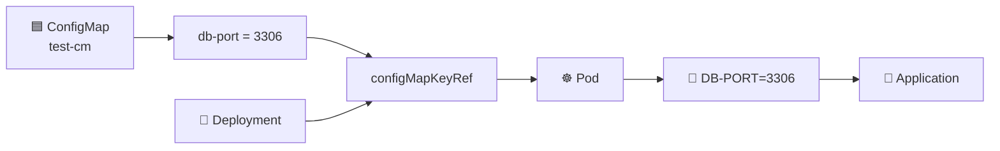
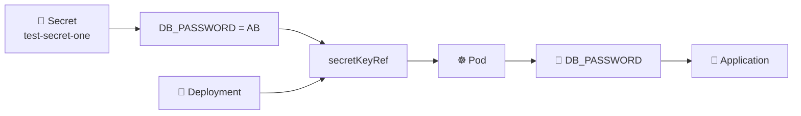
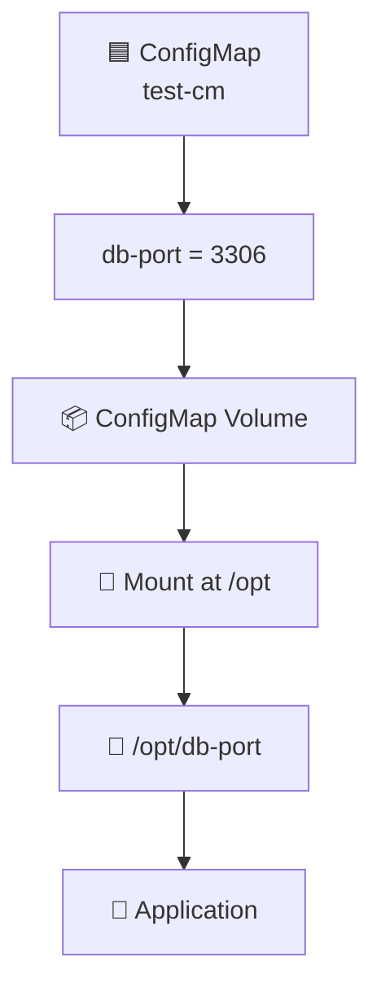
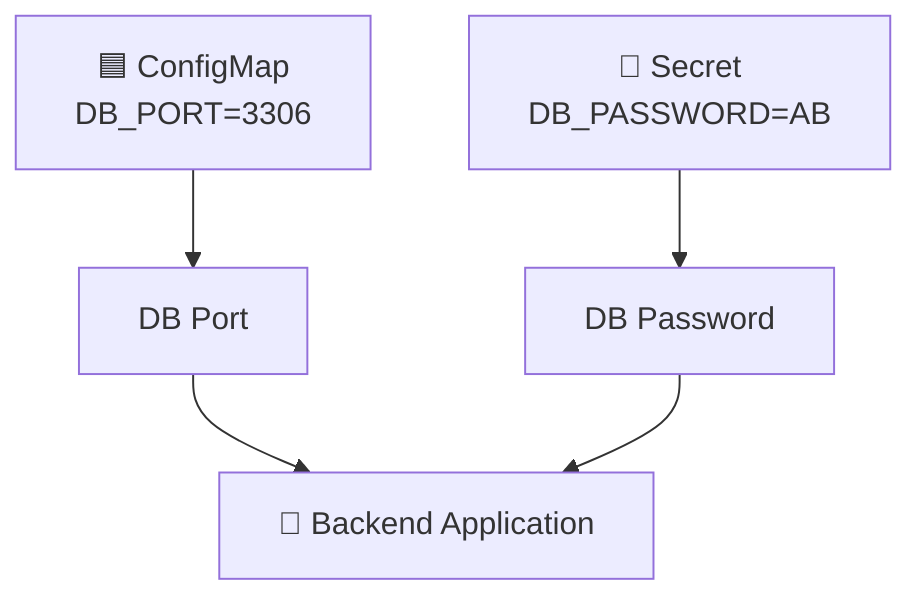
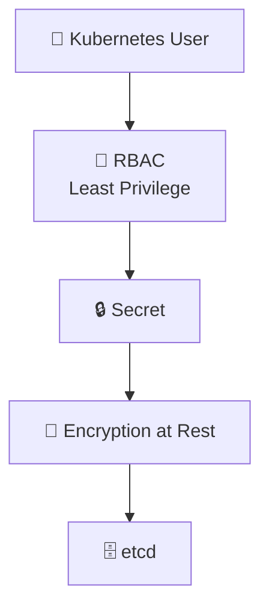

# 🟦 ConfigMap vs 🔐 Secret — Practical Understanding

The **basic mechanism is almost the same**:

```text
                    KUBERNETES
                        │
              Application needs data
                        │
             ┌──────────┴──────────┐
             ↓                     ↓
       🟦 ConfigMap           🔐 Secret
       Non-sensitive           Sensitive
       configuration           information
             │                     │
             └──────────┬──────────┘
                        ↓
                   Deployment
                        ↓
                      Pod
                        ↓
                  Application
```

The **main difference is what kind of data you are storing**.

| 🟦 ConfigMap | 🔐 Secret |
|---|---|
| **Purpose:** Non-sensitive configuration | **Purpose:** Sensitive configuration |
| **Example:** DB port `3306` | **Example:** DB password |
| **Kubernetes object:** ConfigMap | **Kubernetes object:** Secret |
| **Environment variable:** `configMapKeyRef` | **Environment variable:** `secretKeyRef` |
| **Volume:** `configMap:` | **Volume:** `secret:` |
| **Your example:** `test-cm` | **Your example:** `test-secret-one` |
| **Data protection:** Not intended to protect sensitive data | **Data protection:** Intended for sensitive data; encryption at rest can be configured |
| **RBAC:** Can restrict access | **RBAC:** Should use strict/least-privilege access |

---

# 🟦 How Your ConfigMap Worked Practically

You created:

```text
test-cm

db-port = 3306
```

Then you told the Deployment:

```text
"I need db-port from test-cm."
```

Using:

```yaml
configMapKeyRef:
  name: test-cm
  key: db-port
```

Kubernetes then gave your container:

```text
DB-PORT=3306
```

So:



### Final result

Inside the container:

```text
DB-PORT=3306
```

That's exactly what you verified with:

```bash
env | grep -i DB
```

---

# 🔐 How Secret Works Practically

Now imagine instead of:

```text
db-port = 3306
```

you have:

```text
DB_PASSWORD = AB
```

You don't want to treat a password like ordinary configuration.

So you create:

```text
🔐 test-secret-one

DB_PASSWORD = AB
```

Then the Deployment says:

```text
"I need DB_PASSWORD from test-secret-one."
```

Using:

```yaml
secretKeyRef:
  name: test-secret-one
  key: DB_PASSWORD
```

Kubernetes provides it to the container.



### Final result

The application receives:

```text
DB_PASSWORD=AB
```

The **way of consuming it is almost identical** to ConfigMap.

---

# 🔥 So What Actually Changes?

This is the most important thing.

You already learned:

```yaml
configMapKeyRef:
```

For a Secret:

```yaml
secretKeyRef:
```

That's the environment-variable difference.

Think:

```text
🟦 CONFIGMAP                    🔐 SECRET

configMapKeyRef       ───→      secretKeyRef
```

That's it.

---

# 📁 What About Volume Mounts?

You also practiced another ConfigMap method.

Your ConfigMap:

```text
test-cm
   ↓
db-port = 3306
```

was mounted into:

```text
/opt
```

and Kubernetes created:

```text
/opt/db-port
```

You verified:

```bash
cat /opt/db-port
```

Result:

```text
3306
```

The flow was:



---

# 🔐 Secret Does the Same Thing With a Volume

Instead of:

```yaml
configMap:
  name: test-cm
```

you use:

```yaml
secret:
  secretName: test-secret-one
```

So:

```text
🟦 ConfigMap

ConfigMap
    ↓
Volume
    ↓
/opt/db-port
```

becomes:

```text
🔐 Secret

Secret
    ↓
Volume
    ↓
/opt/DB_PASSWORD
```

The mechanism is the same.

Only the **source resource changes**.

---

# 🧠 The Best Way to Understand It

Imagine your application needs two things:

```text
Application
    │
    ├── DB Port = 3306
    │
    └── DB Password = AB
```

The port isn't normally considered sensitive:

```text
🟦 ConfigMap
DB_PORT = 3306
```

The password is sensitive:

```text
🔐 Secret
DB_PASSWORD = AB
```

Then Kubernetes injects both into the application.



---

# 🔒 Why Can't We Just Put Everything in ConfigMap?

This is exactly the problem your teacher explained.

Suppose you put:

```text
DB_USERNAME = admin
DB_PASSWORD = AB
DB_PORT = 3306
```

inside a ConfigMap.

Now the password is being treated as ordinary configuration.

Your teacher explained two security concerns:

## 1️⃣ Someone with Kubernetes access

If somebody has sufficient permissions, they could inspect the ConfigMap:

```bash
kubectl describe configmap test-cm
```

or:

```bash
kubectl edit configmap test-cm
```

They could potentially see the sensitive value.

## 2️⃣ etcd

Kubernetes stores cluster state in `etcd`.

Your teacher's key point was:

```text
ConfigMap
    ↓
API Server
    ↓
etcd
```

Sensitive information should therefore not simply be placed into ConfigMaps.

---

# 🔐 What Does Secret Improve?

The Secret mechanism gives you a resource specifically intended for sensitive data.

Your teacher explained:

```text
Secret
   ↓
API Server
   ↓
Encryption at Rest
   ↓
etcd
```

So the important concept is:

> **Secrets can be configured to be encrypted at rest when stored in etcd.**

And there is another important layer:

```text
RBAC
 ↓
Who is allowed to access Secrets?
```

Your teacher connected this with **least privilege**.

For example:

```text
Developer
   │
   ├── Pods          ✅
   ├── Deployments   ✅
   ├── ConfigMaps    ✅
   └── Secrets       ❌
```

While an authorized DevOps/admin identity might have access to Secrets.

So security becomes:



---

# ⚠️ One Very Important Interview Point

Don't say:

> **"Secrets are automatically completely secure because Kubernetes encrypts them."**

That's too strong.

The better understanding from your teacher's explanation is:

```text
Secret
   ↓
Can be encrypted at rest
   +
Strong RBAC / least privilege
   ↓
Better protection for sensitive data
```

Also, the value you see from:

```bash
kubectl get secret test-secret -o yaml
```

may appear as Base64 text such as:

```text
MzMwNg==
```

Base64 is **encoding, not encryption**.

You already demonstrated that with:

```bash
echo MzMwNg== | base64 --decode
```

which gives:

```text
3306
```

So:

```text
Base64 ≠ Encryption
```

That's a very important distinction.

---

# 🎯 FINAL PRACTICAL COMPARISON

Think of the two like this:

```text
                 CONFIGMAP                 SECRET
                 ─────────                 ──────

Resource       → test-cm                → test-secret-one

Data           → db-port=3306           → DB_PASSWORD=AB

Environment    → configMapKeyRef         → secretKeyRef

Volume         → configMap:              → secret:

Purpose        → Non-sensitive data      → Sensitive data

Final result   → Data reaches Pod        → Data reaches Pod
```

---

# 🧠 One-Line Memory Trick

> **ConfigMap and Secret work almost the same way when consumed by a Pod; the big difference is that ConfigMap is for non-sensitive configuration, while Secret is designed for sensitive information and should be protected with appropriate encryption and RBAC.**

So bro, **you don't need to redo your ConfigMap practical to understand the Secret practical**. You already did the difficult part.

You learned the mechanism:

```text
Resource → Deployment → Pod → Application
```

Now just remember:

```text
🟦 ConfigMap              🔐 Secret
     │                         │
     ├─ configMapKeyRef        ├─ secretKeyRef
     │                         │
     └─ configMap:             └─ secret:
```

That's the whole practical relationship.
