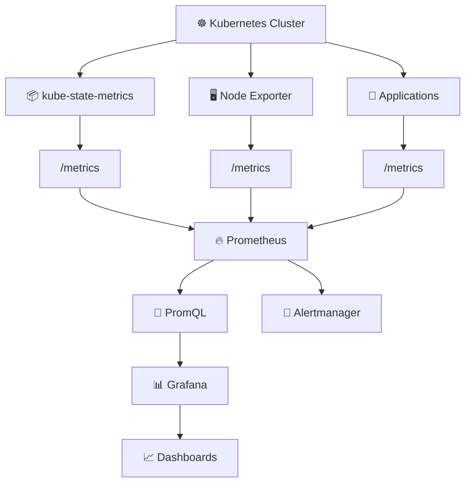
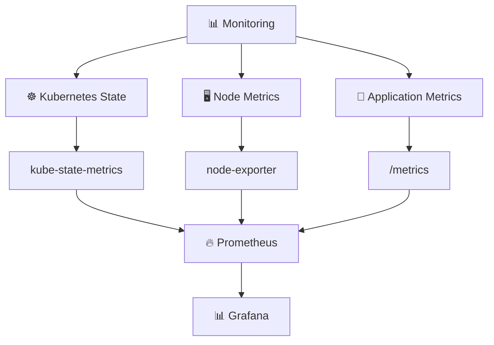
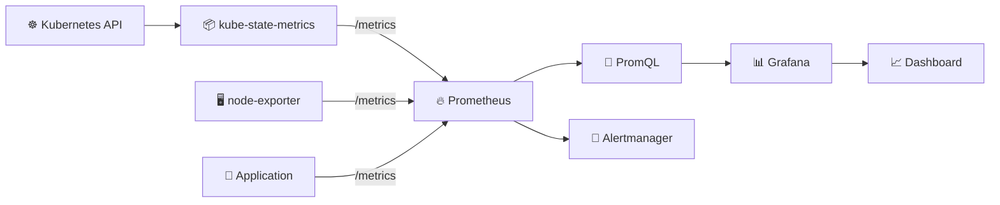
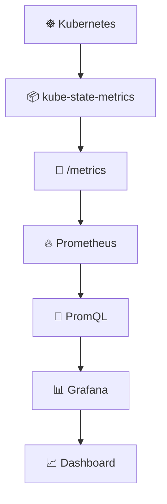

<div align="center">

# 📊 DAY 42 — KUBERNETES MONITORING USING PROMETHEUS & GRAFANA

### ☸️ Kubernetes → 🔥 Prometheus → 📈 PromQL → 📊 Grafana


### 🚀 Hands-On Kubernetes Monitoring Practical

</div>

---

# 📌 1. Practical Overview

In this practical, I implemented monitoring for my Kubernetes cluster using **Prometheus and Grafana**.

The main goal was to understand the complete monitoring flow:

- Install Prometheus inside Kubernetes.
- Understand the Prometheus components.
- Access `kube-state-metrics`.
- View raw Kubernetes metrics through `/metrics`.
- Access the Prometheus UI.
- Query Kubernetes metrics using PromQL.
- Verify that Prometheus is receiving Kubernetes metrics.
- Configure Prometheus as a Grafana data source.
- Access Grafana.
- Visualize Prometheus metrics through Grafana dashboards.

The most important concept from this practical is:

```text
Kubernetes
    ↓
kube-state-metrics
    ↓
/metrics
    ↓
Prometheus
    ↓
PromQL
    ↓
Grafana
    ↓
Dashboards / Visualization
```

---

# 🏗️ 2. Monitoring Architecture



---

# ☁️ 3. Environment Used in My Practical

I performed this practical using **Minikube running on an AWS EC2 instance**.

### EC2 Public IP used during the practical

```text
44.222.63.221
```

### Minikube IP

```text
192.168.49.2
```

### Important Ports

| Component | Port |
|---|---:|
| Prometheus Browser Access | `9090` |
| Grafana Browser Access | `3000` |
| kube-state-metrics Internal Port | `8080` |
| kube-state-metrics NodePort | `30904` |

> **Note:** These IP addresses and NodePorts belonged to this specific lab environment. If the EC2 public IP or Kubernetes NodePort changes in a future run, use the new values returned by AWS/Kubernetes.

---

# ☸️ 4. Start the Minikube Cluster

First, start Minikube.

```bash
minikube start
```

Check whether Minikube is running correctly.

```bash
minikube status
```

Check the Kubernetes node.

```bash
kubectl get nodes
```

A healthy Minikube cluster should show the node in the `Ready` state.

---

# 📦 5. Add the Prometheus Helm Repository

Prometheus was installed using **Helm**.

Add the Prometheus Community Helm repository.

```bash
helm repo add prometheus-community https://prometheus-community.github.io/helm-charts
```

Update the repositories.

```bash
helm repo update
```

---

# 🔥 6. Install Prometheus

Install the Prometheus stack.

```bash
helm install prometheus prometheus-community/prometheus
```

Check the installed Helm release.

```bash
helm list
```

---

# 🔍 7. Verify Prometheus Pods

Check all Kubernetes Pods.

```bash
kubectl get pods
```

The Prometheus installation created several important components.

Examples from my environment included:

```text
prometheus-server
prometheus-alertmanager
prometheus-kube-state-metrics
prometheus-prometheus-node-exporter
prometheus-prometheus-pushgateway
```

These components perform different monitoring responsibilities.

| Component | Purpose |
|---|---|
| `prometheus-server` | Collects, stores and queries metrics |
| `prometheus-kube-state-metrics` | Exposes Kubernetes object/state metrics |
| `prometheus-prometheus-node-exporter` | Exposes node/system metrics |
| `prometheus-alertmanager` | Handles alerts generated by Prometheus |
| `prometheus-prometheus-pushgateway` | Allows short-lived jobs to push metrics |

---

# 🌐 8. Check Kubernetes Services

List the Services.

```bash
kubectl get svc
```

This allowed me to identify the Services created for Prometheus and its components.

Important Services included:

```text
prometheus-server
prometheus-alertmanager
prometheus-kube-state-metrics
prometheus-prometheus-node-exporter
prometheus-prometheus-pushgateway
```

---

# 🧠 9. Understanding kube-state-metrics

`kube-state-metrics` is extremely important when monitoring Kubernetes.

It talks to the Kubernetes API and exposes information about Kubernetes objects as Prometheus metrics.

Examples include information about:

```text
Pods
Deployments
ReplicaSets
Services
ConfigMaps
DaemonSets
Nodes
Namespaces
PersistentVolumes
```

The flow is:

```text
Kubernetes API
      ↓
kube-state-metrics
      ↓
Prometheus-formatted metrics
      ↓
/metrics
      ↓
Prometheus
```

---

# 📡 10. Check the kube-state-metrics Service

I checked the kube-state-metrics Service using:

```bash
kubectl get svc prometheus-kube-state-metrics
```

The original service exposed kube-state-metrics internally on:

```text
8080
```

---

# 🌍 11. Expose kube-state-metrics Using NodePort

To access kube-state-metrics from outside the Minikube cluster during this lab, I exposed its Service using NodePort.

```bash
kubectl expose service prometheus-kube-state-metrics \
  --type=NodePort \
  --target-port=8080 \
  --name=prometheus-kube-state-metrics-ext
```

Then I checked the Services again.

```bash
kubectl get svc
```

My generated NodePort was:

```text
30904
```

So the mapping became:

```text
kube-state-metrics
       ↓
Port 8080
       ↓
Kubernetes NodePort Service
       ↓
Port 30904
```

---

# 🔐 12. Allow the NodePort Through AWS Security Group

Because Minikube was running on an EC2 instance, external browser traffic also had to pass through the EC2 Security Group.

For this practical, TCP port:

```text
30904
```

was allowed.

The network flow was:

```text
My Browser
     ↓
EC2 Security Group
     ↓
44.222.63.221:30904
     ↓
EC2 Instance
     ↓
Minikube
     ↓
kube-state-metrics
```

> For production environments, monitoring ports should not normally be exposed publicly to `0.0.0.0/0`. Access should be restricted appropriately.

---

# 🌐 13. Access kube-state-metrics in the Browser

Using my EC2 public IP and the generated NodePort, I accessed:

```text
http://44.222.63.221:30904/
```

The browser displayed the **kube-state-metrics** page.

The page contained links such as:

```text
Metrics
Healthz
Livez
```

This confirmed that kube-state-metrics was running successfully.

---

# 📊 14. Access Raw Kubernetes Metrics

The most important endpoint was:

```text
http://44.222.63.221:30904/metrics
```

Opening `/metrics` displayed a large amount of raw Prometheus-formatted Kubernetes information.

Examples included:

```text
kube_configmap_info
kube_configmap_created

kube_deployment_created
kube_deployment_status_replicas
kube_deployment_status_replicas_ready

kube_daemonset_info
kube_pod_info
```

This is the raw information that Prometheus can scrape.

---

# 🧠 15. What `/metrics` Actually Means

Prometheus-compatible applications/exporters expose metrics through an HTTP endpoint, commonly:

```text
/metrics
```

For example, I could see metrics similar to:

```text
kube_deployment_status_replicas{
  namespace="default",
  deployment="prometheus-server"
} 1
```

This tells us:

```text
Metric:
kube_deployment_status_replicas

Namespace:
default

Deployment:
prometheus-server

Current value:
1
```

So kube-state-metrics converts Kubernetes state into metrics that Prometheus understands.

---

# 🔥 16. Access Prometheus

Prometheus was running inside the Kubernetes cluster.

To access its UI externally from my EC2 lab, I used port forwarding.

```bash
kubectl port-forward service/prometheus-server -n default 9090:80 --address=0.0.0.0
```

The mapping is:

```text
EC2 Port 9090
      ↓
kubectl port-forward
      ↓
prometheus-server Service
      ↓
Service Port 80
      ↓
Prometheus
```

The port-forward command must remain running while accessing Prometheus through this route.

---

# 🔐 17. Prometheus Security Group Port

Because I was accessing the forwarded port through the EC2 public IP, TCP port:

```text
9090
```

also needed to be reachable through the EC2 Security Group for this lab setup.

---

# 🌐 18. Open Prometheus UI

I accessed Prometheus using:

```text
http://44.222.63.221:9090
```

The Prometheus Query page allowed me to execute PromQL queries.

---

# 🔎 19. PromQL

Prometheus uses **PromQL — Prometheus Query Language**.

PromQL is used to retrieve and analyze the time-series metrics stored by Prometheus.

For example, instead of manually reading thousands of lines from:

```text
/metrics
```

I can query exactly what I need using PromQL.

---

# 📈 20. Query the prometheus-server Deployment

The important PromQL query I executed was:

```promql
kube_deployment_status_replicas{namespace="default",deployment="prometheus-server"}
```

This means:

```text
kube_deployment_status_replicas
                ↓
Give me Deployment replica information

namespace="default"
                ↓
Only from the default namespace

deployment="prometheus-server"
                ↓
Only for the prometheus-server Deployment
```

---

# ✅ 21. Successful Prometheus Result

After executing:

```promql
kube_deployment_status_replicas{namespace="default",deployment="prometheus-server"}
```

Prometheus returned:

```text
Result series: 1
```

and the value:

```text
1
```

This was an important confirmation.

It proved that:

```text
Kubernetes
      ↓
kube-state-metrics
      ↓
Prometheus scraping
      ↓
Prometheus storage
      ↓
PromQL query
      ↓
Successful Kubernetes metric
```

So Prometheus was successfully retrieving Kubernetes deployment state information.

---

# 🔄 22. Where Does Prometheus Get Its Data From?

Prometheus works using **scrape configurations**.

A scrape configuration tells Prometheus:

> Which endpoint should I periodically contact to collect metrics?

Conceptually:

```yaml
scrape_configs:
  - job_name: "example"
    static_configs:
      - targets:
          - "server:port"
```

Prometheus then contacts the target and retrieves metrics.

---

# ⚙️ 23. Check the Prometheus ConfigMap

The Prometheus configuration created by the Helm chart can be inspected through Kubernetes ConfigMaps.

First list the ConfigMaps.

```bash
kubectl get cm
```

Then inspect the Prometheus Server ConfigMap.

```bash
kubectl get cm prometheus-server -o yaml
```

If I intentionally need to modify it manually for a learning exercise, I can use:

```bash
kubectl edit cm prometheus-server
```

Inside the configuration, the important area is:

```yaml
scrape_configs:
```

This defines the targets Prometheus scrapes.

> In Helm-managed environments, permanent configuration changes are generally better made through Helm values rather than manually editing generated resources, because Helm upgrades can overwrite manual edits.

---

# 📡 24. Adding Another Metrics Endpoint Conceptually

If an application exposes:

```text
IP:PORT/metrics
```

Prometheus needs a scrape configuration that points to that target.

Conceptually:

```yaml
scrape_configs:
  - job_name: "state-metrics"
    static_configs:
      - targets:
          - "<METRICS-TARGET>:<PORT>"
```

For the lab, kube-state-metrics was externally reachable through:

```text
44.222.63.221:30904/metrics
```

However, because Prometheus and kube-state-metrics are running inside the same Kubernetes cluster, an internal Kubernetes Service address is generally preferable to routing Prometheus out through the EC2 public IP.

The main concept remains:

```text
Target exposes /metrics
          ↓
Prometheus scrape configuration
          ↓
Prometheus collects metrics
          ↓
PromQL
```

---

# 🚀 25. Monitoring Developer Applications

Monitoring does not stop with Kubernetes itself.

Developers may create applications such as:

```text
Python Application
Java Application
Node.js Application
Go Application
Microservices
APIs
```

These applications can expose their own metrics.

For example:

```text
my-application
      ↓
/metrics
```

The application can expose information such as:

```text
HTTP request count
HTTP response codes
Request latency
Application errors
Active requests
Custom business metrics
```

---

# 🧑‍💻 26. Prometheus Client Libraries

Developers can use Prometheus client libraries to expose application-specific metrics.

The general flow is:

```text
Application Code
       ↓
Prometheus Client Library
       ↓
/metrics Endpoint
       ↓
Prometheus
       ↓
Grafana
```

As a DevOps engineer, I need to understand:

1. Where the application's metrics endpoint is.
2. Which port exposes it.
3. How Prometheus discovers/scrapes it.
4. How to query the metrics.
5. How to visualize them.

---

# 📊 27. Prometheus vs Grafana

Prometheus and Grafana have different responsibilities.

### 🔥 Prometheus

Prometheus is responsible for:

```text
Collect Metrics
      ↓
Store Metrics
      ↓
Query Metrics
```

### 📊 Grafana

Grafana is responsible for:

```text
Connect to Data Source
      ↓
Run Queries
      ↓
Visualize Results
      ↓
Create Dashboards
```

Therefore:

```text
Kubernetes
     ↓
Metrics
     ↓
Prometheus
     ↓
PromQL
     ↓
Grafana
     ↓
Graphs / Dashboards
```

The easiest way to remember this is:

> **Prometheus collects and stores the metrics. Grafana uses Prometheus as a data source and presents those metrics visually.**

---

# 📊 28. Check Grafana

Grafana was also running inside Kubernetes.

Check its Service.

```bash
kubectl get svc grafana
```

Check the Grafana Pod.

```bash
kubectl get pods | grep grafana
```

---

# 🌐 29. Port Forward Grafana

To access Grafana externally from my EC2 lab, I used:

```bash
kubectl port-forward service/grafana -n default 3000:80 --address=0.0.0.0
```

This means:

```text
EC2 Port 3000
      ↓
kubectl port-forward
      ↓
Grafana Service
      ↓
Service Port 80
      ↓
Grafana
```

Keep this terminal running while using Grafana through the forwarded port.

---

# 🔐 30. Grafana Security Group Port

For my browser to access the forwarded Grafana port through the EC2 public IP, TCP port:

```text
3000
```

needed to be reachable through the EC2 Security Group in this lab.

---

# 🌍 31. Open Grafana

I opened Grafana using:

```text
http://44.222.63.221:3000
```

This displayed the Grafana UI.

---

# 🔗 32. Add Prometheus as the Grafana Data Source

Inside Grafana, I navigated through:

```text
Connections
     ↓
Data Sources
     ↓
Add Data Source
     ↓
Prometheus
```

For my practical setup, Prometheus was accessible through:

```text
http://44.222.63.221:9090
```

After configuring the data source, Grafana could query Prometheus.

The relationship became:

```text
Grafana
   ↓
Prometheus Data Source
   ↓
Prometheus
   ↓
Stored Metrics
```

In an in-cluster production-style setup, using the Prometheus Kubernetes Service DNS name is preferable when Grafana can reach it internally.

---

# 📈 33. Grafana Dashboard Visualization

After connecting Prometheus, I went to the Grafana dashboard section.

The available dashboards included:

```text
Prometheus Stats
Prometheus 2.0 Stats
Grafana metrics
```

I opened:

```text
Prometheus 2.0 Stats
```

The dashboard successfully displayed graphs and monitoring panels.

Examples included:

```text
Samples Appended
Scrape Duration
Memory Profile
WAL Corruptions
Active Appenders
Blocks Loaded
Head Chunks
Head Block GC Activity
Compaction Activity
Reload Count
Query Durations
Rule Group Eval Duration
Rule Group Eval Activity
```

This confirmed the complete flow:

```text
Prometheus Metrics
       ↓
Grafana Data Source
       ↓
Grafana Queries
       ↓
Graphs
       ↓
Dashboard
```

---

# 🆔 34. Kubernetes Grafana Dashboard ID

A Kubernetes monitoring dashboard ID referred to during this practical was:

```text
3662
```

The basic dashboard import idea is:

```text
Grafana
    ↓
Dashboards
    ↓
Import
    ↓
Dashboard ID
    ↓
Select Prometheus Data Source
    ↓
Import
```

This can provide a pre-built Kubernetes visualization dashboard instead of manually creating every panel.

> Dashboard IDs can change or become outdated, so verify the dashboard when re-running the lab later.

---

# 📡 35. Three Important Sources of Monitoring Data

The complete Kubernetes monitoring setup can involve three major metric sources.



### Kubernetes Object Metrics

Provided by:

```text
kube-state-metrics
```

### Node/System Metrics

Provided by:

```text
node-exporter
```

### Application Metrics

Provided through:

```text
Application /metrics
```

---

# 🚨 36. Alertmanager

The Prometheus Helm installation also included Alertmanager.

Its role is different from Grafana.

```text
Prometheus
     ↓
Alerting Rule
     ↓
Alert Condition Triggered
     ↓
Alertmanager
     ↓
Notification Handling
```

Prometheus detects conditions.

Alertmanager manages the resulting alerts.

---

# 🧠 37. Complete Monitoring Data Flow



---

# 🎯 38. What I Learned

### kube-state-metrics

```text
Kubernetes API
      ↓
Kubernetes Object State
      ↓
Prometheus Metrics
```

### Node Exporter

```text
Kubernetes Node
      ↓
CPU / Memory / System Metrics
      ↓
Prometheus
```

### Prometheus

```text
Scrape
  ↓
Collect
  ↓
Store
  ↓
Query
```

### PromQL

```text
Select and analyze Prometheus time-series metrics
```

### Grafana

```text
Prometheus Data
      ↓
Graphs
      ↓
Panels
      ↓
Dashboards
```

### Alertmanager

```text
Prometheus Alert
      ↓
Alertmanager
      ↓
Notification Handling
```

---

# 🔥 39. Most Important Concept to Remember

If I return to this practical later, I only need to remember this:

```text
KUBERNETES
     ↓
EXPORTERS / APPLICATIONS
     ↓
/metrics
     ↓
PROMETHEUS
     ↓
PROMQL
     ↓
GRAFANA
     ↓
VISUALIZATION
```

Prometheus answers:

```text
What monitoring data do I have?
```

Grafana answers:

```text
How can I visualize that monitoring data?
```

---

# 🌐 40. URLs Used During My Practical

### kube-state-metrics Home

```text
http://44.222.63.221:30904/
```

### kube-state-metrics Raw Metrics

```text
http://44.222.63.221:30904/metrics
```

### Prometheus

```text
http://44.222.63.221:9090
```

### Grafana

```text
http://44.222.63.221:3000
```

### Prometheus Data Source Used in Grafana During the Lab

```text
http://44.222.63.221:9090
```

---

# 🔎 41. PromQL Query Used During My Practical

```promql
kube_deployment_status_replicas{namespace="default",deployment="prometheus-server"}
```

My successful result was:

```text
Result series: 1

Value: 1
```

This verified that Prometheus was successfully retrieving Kubernetes Deployment state metrics.

---

# 🔁 42. How to Re-Execute This Practical Later

If I return to this practical after a month, I can follow this sequence.

### Step 1 — Start Minikube

```bash
minikube start
```

### Step 2 — Verify Minikube

```bash
minikube status
```

### Step 3 — Verify Kubernetes

```bash
kubectl get nodes
kubectl get pods
kubectl get svc
```

### Step 4 — Verify Prometheus Components

```bash
kubectl get pods | grep prometheus
```

### Step 5 — Check kube-state-metrics

```bash
kubectl get svc prometheus-kube-state-metrics
```

### Step 6 — Check the externally exposed kube-state-metrics Service

```bash
kubectl get svc prometheus-kube-state-metrics-ext
```

If this Service does not exist, create it again:

```bash
kubectl expose service prometheus-kube-state-metrics \
  --type=NodePort \
  --target-port=8080 \
  --name=prometheus-kube-state-metrics-ext
```

Then run:

```bash
kubectl get svc prometheus-kube-state-metrics-ext
```

Check the **current NodePort** because it may not always be `30904`.

### Step 7 — Test Metrics

Using the current IP and NodePort:

```text
http://<EC2-PUBLIC-IP>:<NODEPORT>/metrics
```

For this specific practical it was:

```text
http://44.222.63.221:30904/metrics
```

### Step 8 — Start Prometheus Port Forward

```bash
kubectl port-forward service/prometheus-server -n default 9090:80 --address=0.0.0.0
```

### Step 9 — Open Prometheus

```text
http://<EC2-PUBLIC-IP>:9090
```

For this lab:

```text
http://44.222.63.221:9090
```

### Step 10 — Execute PromQL

```promql
kube_deployment_status_replicas{namespace="default",deployment="prometheus-server"}
```

### Step 11 — Start Grafana Port Forward

Run this from another terminal because the Prometheus port-forward command remains active:

```bash
kubectl port-forward service/grafana -n default 3000:80 --address=0.0.0.0
```

### Step 12 — Open Grafana

```text
http://<EC2-PUBLIC-IP>:3000
```

For this lab:

```text
http://44.222.63.221:3000
```

### Step 13 — Verify Prometheus Data Source

```text
Grafana
  ↓
Connections
  ↓
Data Sources
  ↓
Prometheus
```

### Step 14 — Open Dashboard

```text
Dashboards
    ↓
Prometheus 2.0 Stats
```

At this point the complete monitoring environment should be working again.

---

# 📋 43. ALL COMMANDS USED IN THIS PRACTICAL

Below is the quick command reference from beginning to end.

### Add Prometheus Helm Repository

```bash
helm repo add prometheus-community https://prometheus-community.github.io/helm-charts
```

### Update Helm Repositories

```bash
helm repo update
```

### Start Minikube

```bash
minikube start
```

### Check Minikube Status

```bash
minikube status
```

### Check Kubernetes Nodes

```bash
kubectl get nodes
```

### Install Prometheus

```bash
helm install prometheus prometheus-community/prometheus
```

### Check Helm Releases

```bash
helm list
```

### Check Pods

```bash
kubectl get pods
```

### Check Prometheus Pods

```bash
kubectl get pods | grep prometheus
```

### Check Kubernetes Services

```bash
kubectl get svc
```

### Check kube-state-metrics Service

```bash
kubectl get svc prometheus-kube-state-metrics
```

### Expose kube-state-metrics Through NodePort

```bash
kubectl expose service prometheus-kube-state-metrics \
  --type=NodePort \
  --target-port=8080 \
  --name=prometheus-kube-state-metrics-ext
```

### Check the Exposed kube-state-metrics Service

```bash
kubectl get svc prometheus-kube-state-metrics-ext
```

### Check ConfigMaps

```bash
kubectl get cm
```

### View Prometheus Server ConfigMap

```bash
kubectl get cm prometheus-server -o yaml
```

### Edit Prometheus Server ConfigMap

```bash
kubectl edit cm prometheus-server
```

### Port Forward Prometheus

```bash
kubectl port-forward service/prometheus-server -n default 9090:80 --address=0.0.0.0
```

### Check Grafana Service

```bash
kubectl get svc grafana
```

### Check Grafana Pod

```bash
kubectl get pods | grep grafana
```

### Port Forward Grafana

```bash
kubectl port-forward service/grafana -n default 3000:80 --address=0.0.0.0
```

---

# 📋 44. QUICK COMMAND SHEET

```bash
# Start Kubernetes
minikube start

# Check Minikube
minikube status

# Check node
kubectl get nodes

# Check Pods
kubectl get pods

# Check Services
kubectl get svc

# Check ConfigMaps
kubectl get cm

# Check Prometheus components
kubectl get pods | grep prometheus

# Check kube-state-metrics
kubectl get svc prometheus-kube-state-metrics

# Check externally exposed kube-state-metrics
kubectl get svc prometheus-kube-state-metrics-ext

# View Prometheus configuration
kubectl get cm prometheus-server -o yaml

# Edit Prometheus configuration
kubectl edit cm prometheus-server

# Access Prometheus
kubectl port-forward service/prometheus-server -n default 9090:80 --address=0.0.0.0

# Check Grafana
kubectl get svc grafana

# Access Grafana
kubectl port-forward service/grafana -n default 3000:80 --address=0.0.0.0
```

---

# 📌 45. Quick Port Reference

| Service | Port | Purpose |
|---|---:|---|
| Prometheus | `9090` | Prometheus UI |
| Grafana | `3000` | Grafana UI |
| kube-state-metrics | `8080` | Internal metrics endpoint |
| kube-state-metrics-ext | `30904` | NodePort generated in this lab |

---

# 📌 46. Quick URL Reference

| Component | URL Used in This Lab |
|---|---|
| kube-state-metrics | `http://44.222.63.221:30904/` |
| Raw Kubernetes Metrics | `http://44.222.63.221:30904/metrics` |
| Prometheus | `http://44.222.63.221:9090` |
| Grafana | `http://44.222.63.221:3000` |

---

# 📌 47. Quick PromQL Reference

### prometheus-server Deployment Replicas

```promql
kube_deployment_status_replicas{namespace="default",deployment="prometheus-server"}
```

Result obtained during the practical:

```text
1
```

---

# 🧠 48. Final Understanding

The complete practical taught me how the monitoring pieces connect together.



### In one sentence:

> **kube-state-metrics exposes Kubernetes state as metrics, Prometheus collects and stores those metrics, PromQL retrieves the required information, and Grafana uses Prometheus as a data source to turn that information into visual dashboards.**

---

<div align="center">

# ✅ DAY 42 COMPLETE

## 📊 KUBERNETES MONITORING USING PROMETHEUS & GRAFANA

### ☸️ Kubernetes → 📡 Metrics → 🔥 Prometheus → 🔎 PromQL → 📊 Grafana

**DevOps Hands-On Learning Journey 🚀**

</div>
