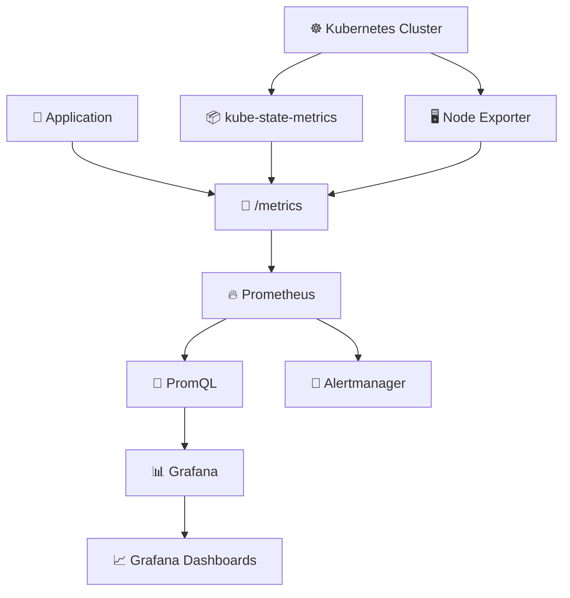
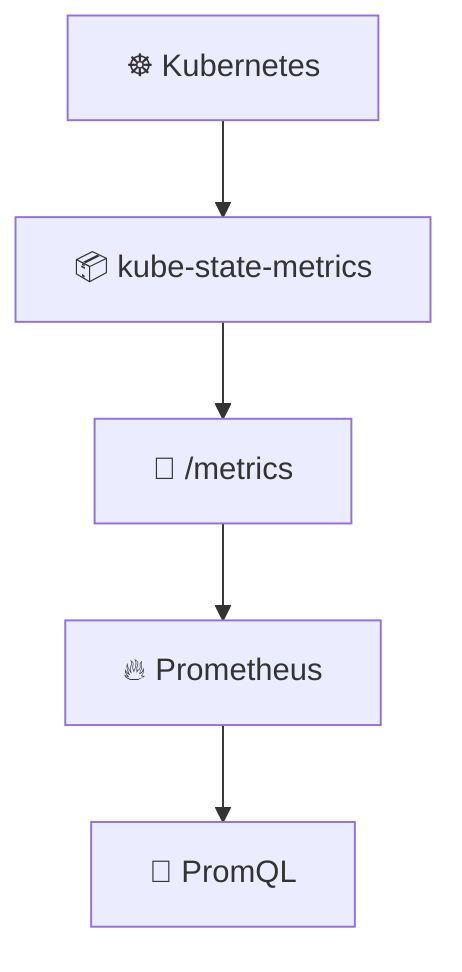
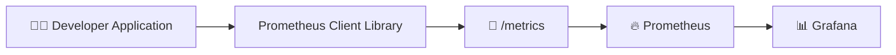
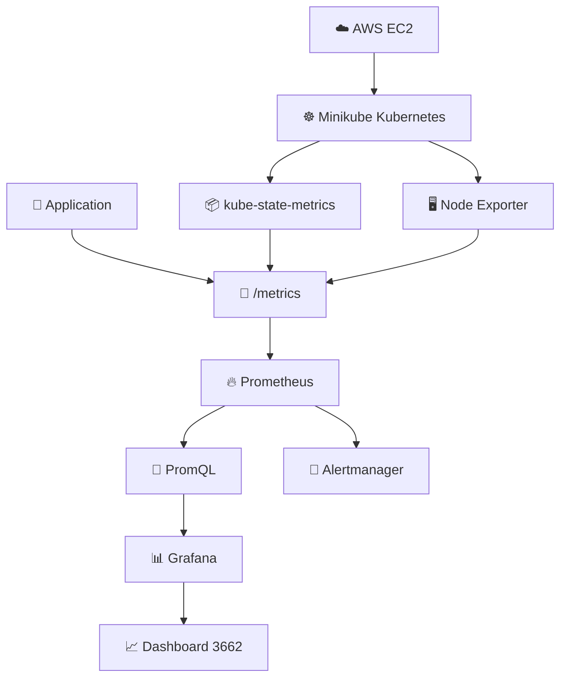

<div align="center">
  
# 📊 DAY 23 — KUBERNETES MONITORING USING PROMETHEUS & GRAFANA

</div>

<p align="center">

# ☸️ Kubernetes Monitoring

### 🔥 Prometheus + 📊 Grafana

**Collect → Store → Query → Visualize**

</p>

---

## 🎯 Objective

In this practical, I implemented Kubernetes monitoring using **Prometheus and Grafana** on an AWS EC2 instance running a **Minikube Kubernetes cluster**.

The complete monitoring flow is:

```text
                         ☸️ KUBERNETES CLUSTER
                                  │
                 ┌────────────────┼────────────────┐
                 │                │                │
                 ▼                ▼                ▼
        kube-state-metrics   Node Exporter    Application
                 │                │                │
                 └────────────────┼────────────────┘
                                  ▼
                              /metrics
                                  │
                                  ▼
                           🔥 PROMETHEUS
                                  │
                               PromQL
                                  │
                                  ▼
                            📊 GRAFANA
                                  │
                                  ▼
                            📈 DASHBOARDS
```

---

# 🏗️ Monitoring Architecture



---

# ☁️ Environment Used

| Component | Value |
|---|---|
| ☁️ Cloud | AWS EC2 |
| ☸️ Kubernetes | Minikube |
| 🌐 EC2 Public IP used in this practical | `44.222.63.221` |
| 🔥 Prometheus | `9090` |
| 📊 Grafana | `3000` |
| 📦 kube-state-metrics Service Port | `8080` |
| 🌐 kube-state-metrics NodePort | `30904` |
| 🆔 Grafana Dashboard ID | `3662` |

> ⚠️ The EC2 Public IP and NodePort are environment-specific. If the EC2 instance or Kubernetes environment is recreated, verify the current values using `kubectl get svc` before using the URLs below.

---

# 🧠 1. What is Kubernetes Monitoring?

Kubernetes monitoring means continuously collecting information about the health and state of the Kubernetes cluster.

We want to know things such as:

```text
Pod status
Deployment replicas
Node resources
Container information
CPU usage
Memory usage
Application requests
Application errors
Application latency
```

The basic idea is:

```text
Kubernetes
    ↓
Metrics Exporters / Applications
    ↓
/metrics
    ↓
Prometheus
    ↓
PromQL
    ↓
Grafana
    ↓
Dashboards
```

---

# 📦 2. Components Used

| Component | Purpose |
|---|---|
| 🔥 Prometheus | Collects, stores and queries metrics |
| 📦 kube-state-metrics | Exposes Kubernetes object/state metrics |
| 🖥️ Node Exporter | Exposes node/system-level metrics |
| 📊 Grafana | Visualizes Prometheus metrics |
| 🚨 Alertmanager | Handles Prometheus alerts |
| 📤 Pushgateway | Allows suitable short-lived jobs to push metrics |

---

# 🔥 3. Add Prometheus Helm Repository

```bash
helm repo add prometheus-community https://prometheus-community.github.io/helm-charts
```

### Simple meaning

Adds the Prometheus Community Helm repository so Helm can download Prometheus charts.

---

# 🔄 4. Update Helm Repositories

```bash
helm repo update
```

### Simple meaning

Updates the local Helm repository information.

---

# ☸️ 5. Start Minikube

```bash
minikube start
```

### Simple meaning

Starts the Minikube Kubernetes cluster.

---

# 🔍 6. Check Minikube Status

```bash
minikube status
```

This verifies that the Minikube components are running.

---

# 🖥️ 7. Check Kubernetes Nodes

```bash
kubectl get nodes
```

The node should normally show:

```text
Ready
```

`Ready` means Kubernetes can schedule workloads on the node.

---

# 🔥 8. Install Prometheus

```bash
helm install prometheus prometheus-community/prometheus
```

This installs Prometheus using Helm.

After installation, Prometheus-related resources are created, including components such as:

```text
prometheus-server
prometheus-alertmanager
prometheus-kube-state-metrics
prometheus-prometheus-node-exporter
prometheus-prometheus-pushgateway
```

---

# 📦 9. Check Helm Releases

```bash
helm list
```

This shows the Helm releases installed in the current namespace.

---

# 📦 10. Check Kubernetes Pods

```bash
kubectl get pods
```

To specifically check Prometheus-related Pods:

```bash
kubectl get pods | grep prometheus
```

---

# 🌐 11. Check Kubernetes Services

```bash
kubectl get svc
```

This is an important command because it shows the Services and their ports.

During this practical, kube-state-metrics was exposed through a NodePort.

---

# 📦 12. Check kube-state-metrics Service

```bash
kubectl get svc prometheus-kube-state-metrics
```

The practical used:

```text
Service Port = 8080
NodePort     = 30904
```

Therefore:

```text
8080
 ↓
Kubernetes Service Port

30904
 ↓
NodePort used to access kube-state-metrics
```

---

# 🧠 13. What is kube-state-metrics?

`kube-state-metrics` exposes metrics about the **state of Kubernetes resources**.

Examples include:

```text
Deployments
Pods
ReplicaSets
DaemonSets
StatefulSets
Services
ConfigMaps
Nodes
Namespaces
```

The flow is:

```text
Kubernetes API
      ↓
kube-state-metrics
      ↓
/metrics
      ↓
Prometheus
```

Important difference:

```text
kube-state-metrics
        ≠
Prometheus
```

kube-state-metrics **exposes** Kubernetes state as metrics.

Prometheus **scrapes and stores** those metrics.

---

# 📡 14. Access kube-state-metrics

The EC2 Public IP used during this practical was:

```text
44.222.63.221
```

The kube-state-metrics NodePort used was:

```text
30904
```

Therefore the endpoint was:

```text
http://44.222.63.221:30904/
```

The important metrics endpoint was:

```text
http://44.222.63.221:30904/metrics
```

Opening `/metrics` displayed the raw Prometheus metric data.

---

# 📊 15. What is available on /metrics?

The `/metrics` endpoint exposes Prometheus-formatted metrics.

Examples:

```text
kube_configmap_info
kube_configmap_created
kube_deployment_created
kube_deployment_status_replicas
kube_deployment_status_replicas_ready
kube_daemonset_info
kube_pod_info
```

For example:

```text
kube_deployment_status_replicas{
    namespace="default",
    deployment="prometheus-server"
} 1
```

This tells us:

```text
Metric:
kube_deployment_status_replicas

Namespace:
default

Deployment:
prometheus-server

Value:
1
```

---

# 🔥 16. Access Prometheus

Prometheus was accessed using port forwarding:

```bash
kubectl port-forward service/prometheus-server -n default 9090:80 --address=0.0.0.0
```

The mapping is:

```text
EC2 :9090
    ↓
kubectl port-forward
    ↓
Prometheus Service :80
    ↓
Prometheus
```

Then Prometheus can be opened in the browser:

```text
http://44.222.63.221:9090
```

---

# 🔎 17. Prometheus Query Interface

Prometheus provides a query interface where we can use:

```text
PromQL
```

PromQL means:

```text
Prometheus Query Language
```

PromQL allows us to query the metrics stored by Prometheus.

---

# 📈 18. PromQL Query Used

The query used during this practical was:

```promql
kube_deployment_status_replicas{namespace="default",deployment="prometheus-server"}
```

After entering the query:

```text
Execute
```

Prometheus returned the matching metric.

---

# 🧠 19. Understanding the PromQL Query

The metric name is:

```promql
kube_deployment_status_replicas
```

The first label filters the namespace:

```promql
namespace="default"
```

The second label filters the Deployment:

```promql
deployment="prometheus-server"
```

So the complete query means:

```text
Show me the number of replicas
of the prometheus-server Deployment
inside the default namespace.
```

---

# 📡 20. How Prometheus Scraping Works

Prometheus works by scraping metric endpoints.

```text
Prometheus
    │
    │ HTTP request
    ▼
Target /metrics
    │
    │ Metric response
    ▼
Prometheus
    │
    ▼
Stores metrics
```

Therefore:

```text
Target exposes /metrics
          ↓
Prometheus scrapes it
          ↓
Prometheus stores the metrics
          ↓
PromQL queries the metrics
```

---

# ⚙️ 21. Prometheus ConfigMap

First check ConfigMaps:

```bash
kubectl get cm
```

Check the Prometheus ConfigMap:

```bash
kubectl get cm prometheus-server -o yaml
```

Open/edit the ConfigMap:

```bash
kubectl edit cm prometheus-server
```

Inside the configuration, an important section is:

```yaml
scrape_configs:
```

This section defines the targets that Prometheus scrapes.

---

# 📡 22. Static Scrape Configuration Concept

A static target configuration can look like:

```yaml
scrape_configs:
  - job_name: "state-metrics"
    static_configs:
      - targets:
          - "44.222.63.221:30904"
```

This tells Prometheus to scrape:

```text
http://44.222.63.221:30904/metrics
```

The flow becomes:

```text
Prometheus
    ↓
44.222.63.221:30904
    ↓
/metrics
    ↓
kube-state-metrics
    ↓
Metric data
```

> ⚠️ For a reusable Kubernetes setup, verify the current Service/NodePort before using this configuration. In production, Kubernetes service discovery/internal Service DNS is generally preferable to hard-coding a public EC2 IP and NodePort.

---

# 📊 23. Prometheus Data Flow



---

# 📊 24. Install Grafana

Add the Grafana Helm repository:

```bash
helm repo add grafana https://grafana.github.io/helm-charts
```

Update Helm repositories:

```bash
helm repo update
```

Install Grafana:

```bash
helm install grafana grafana/grafana
```

---

# 🔐 25. Get Grafana Admin Password

```bash
kubectl get secret --namespace default grafana -o jsonpath="{.data.admin-password}" | base64 --decode ; echo
```

Grafana username:

```text
admin
```

Password:

```text
The password returned by the command above
```

---

# 🔍 26. Check Grafana Pod

```bash
kubectl get pods | grep grafana
```

---

# 🌐 27. Check Grafana Service

```bash
kubectl get svc grafana
```

---

# 🔌 28. Port Forward Grafana

```bash
kubectl port-forward service/grafana -n default 3000:80 --address=0.0.0.0
```

The mapping is:

```text
EC2 :3000
    ↓
kubectl port-forward
    ↓
Grafana Service :80
    ↓
Grafana
```

Open Grafana:

```text
http://44.222.63.221:3000
```

---

# 🔗 29. Connect Grafana to Prometheus

This is one of the most important concepts of the practical.

```text
🔥 PROMETHEUS
      │
      │ Stores and provides metrics
      ▼
📊 GRAFANA
      │
      │ Queries Prometheus
      ▼
📈 VISUAL DASHBOARDS
```

Grafana uses Prometheus as its **data source**.

Inside Grafana:

```text
Connections
    ↓
Data Sources
    ↓
Prometheus
```

The Prometheus URL used during this practical was:

```text
http://44.222.63.221:9090
```

---

# 🧠 30. Prometheus vs Grafana

```text
                 PROMETHEUS
                     │
             Collects metrics
                     │
              Stores metrics
                     │
                PromQL
                     │
                     ▼
                  GRAFANA
                     │
             Runs PromQL queries
                     │
              Visualizes data
                     │
                     ▼
                DASHBOARDS
```

### Simple memory trick

```text
Prometheus = Collect + Store + Query

Grafana = Visualize
```

---

# 📈 31. Visualize Prometheus Data in Grafana

The same PromQL query can be used inside a Grafana panel:

```promql
kube_deployment_status_replicas{namespace="default",deployment="prometheus-server"}
```

Prometheus displays the metric result.

Grafana can visualize that result as:

```text
📈 Time Series
📊 Graph
🔢 Stat
📋 Table
🚦 Gauge
```

Therefore:

```text
Prometheus
    ↓
Metric data
    ↓
PromQL
    ↓
Grafana
    ↓
Visualization
```

---

# 🆔 32. Grafana Dashboard ID 3662

The Grafana dashboard ID used during this practical was:

```text
3662
```

The process is:

```text
Grafana
   ↓
Dashboards
   ↓
Import
   ↓
Enter Dashboard ID
   ↓
3662
   ↓
Select Prometheus data source
   ↓
Import
   ↓
Dashboard
```

This provides pre-built visualizations instead of creating every panel manually.

---

# 📊 33. Grafana Dashboard

After importing the dashboard, Grafana displays Prometheus metrics visually.

Examples of information that can be visualized include:

```text
Samples
Scrape Duration
Memory Profile
Active Appenders
Blocks Loaded
Head Chunks
Query Durations
Reload Count
Rule Group Activity
```

The exact panels depend on the imported dashboard and available metrics.

---

# 🚀 34. Application Monitoring

Kubernetes monitoring is not only about Kubernetes resources.

Applications written by developers can also expose Prometheus metrics.

For example:

```text
Application
     ↓
Prometheus Client Library
     ↓
/metrics
     ↓
Prometheus
     ↓
Grafana
```

Application metrics can include:

```text
HTTP request count
HTTP response codes
Request latency
Application errors
Active requests
Custom application metrics
```

The application must expose a metrics endpoint that Prometheus can scrape.

---

# 👨‍💻 35. Developer Application Monitoring



The important idea is:

```text
Application exposes metrics
            ↓
Prometheus collects them
            ↓
Grafana visualizes them
```

---

# 🚨 36. Alertmanager

Prometheus also includes Alertmanager.

The basic flow is:

```text
Prometheus
    ↓
Alert Rule
    ↓
Condition becomes true
    ↓
Alertmanager
    ↓
Notification
```

Prometheus evaluates alert conditions.

Alertmanager handles alert routing and notifications.

---

# 📦 37. Prometheus Components

### prometheus-server

```text
Main Prometheus server.

Responsibilities:
- Scrape metrics
- Store metrics
- Execute PromQL queries
```

### prometheus-kube-state-metrics

```text
Exposes Kubernetes object/state metrics.
```

### prometheus-prometheus-node-exporter

```text
Exposes node/system-level metrics.
```

### prometheus-alertmanager

```text
Handles Prometheus alerts.
```

### prometheus-prometheus-pushgateway

```text
Allows suitable short-lived jobs to push metrics.
```

---

# 🌐 38. Browser URLs Used

### kube-state-metrics

```text
http://44.222.63.221:30904/
```

### kube-state-metrics metrics

```text
http://44.222.63.221:30904/metrics
```

### Prometheus

```text
http://44.222.63.221:9090
```

### Grafana

```text
http://44.222.63.221:3000
```

### Prometheus URL configured inside Grafana

```text
http://44.222.63.221:9090
```

---

# 🔌 39. Ports Used

```text
kube-state-metrics Service Port
8080

kube-state-metrics NodePort
30904

Prometheus
9090

Grafana
3000
```

### Port meaning

```text
8080
 ↓
kube-state-metrics internal Service port

30904
 ↓
kube-state-metrics NodePort

9090
 ↓
Prometheus browser / port-forward port

3000
 ↓
Grafana browser / port-forward port
```

---

# ☁️ 40. AWS EC2 Security Group

Because the services were accessed through the EC2 Public IP, the required ports needed to be reachable through the EC2 Security Group.

Ports used:

```text
9090
3000
30904
```

Traffic flow:

```text
Internet
    ↓
AWS Security Group
    ↓
EC2
    ↓
Kubernetes
    ↓
Prometheus / Grafana / NodePort
```

> ⚠️ For production, monitoring interfaces should normally be protected with appropriate network controls and authentication rather than being openly exposed to the internet.

---

# 🔄 41. Complete Monitoring Flow



---

# 🧠 42. What I Learned

```text
kube-state-metrics
        ↓
Provides Kubernetes state metrics

Node Exporter
        ↓
Provides node/system metrics

Application
        ↓
Can expose application metrics

/metrics
        ↓
Endpoint exposing Prometheus metrics

Prometheus
        ↓
Collects + Stores + Queries metrics

PromQL
        ↓
Queries Prometheus metrics

Grafana
        ↓
Visualizes Prometheus data

Alertmanager
        ↓
Handles alerts

Pushgateway
        ↓
Allows suitable short-lived jobs to push metrics
```

---

# 🧩 43. One-Line Memory Trick

```text
kube-state-metrics → Kubernetes state metrics

Node Exporter → Node/system metrics

/metrics → Metrics endpoint

Prometheus → Collect + Store + Query

PromQL → Query Prometheus

Grafana → Visualize metrics

Alertmanager → Handle alerts

Pushgateway → Push metrics from suitable short-lived jobs
```

---

# 🔁 44. How to Execute This Practical Again

## Step 1 — Start Minikube

```bash
minikube start
```

## Step 2 — Check Minikube

```bash
minikube status
```

## Step 3 — Check Nodes

```bash
kubectl get nodes
```

## Step 4 — Check Pods

```bash
kubectl get pods
```

## Step 5 — Check Services

```bash
kubectl get svc
```

## Step 6 — Check Prometheus Pods

```bash
kubectl get pods | grep prometheus
```

## Step 7 — Check Grafana Pod

```bash
kubectl get pods | grep grafana
```

## Step 8 — Check kube-state-metrics

```bash
kubectl get svc prometheus-kube-state-metrics
```

## Step 9 — Verify the current NodePort

```bash
kubectl get svc
```

Look for:

```text
prometheus-kube-state-metrics
```

and verify its current NodePort.

## Step 10 — Start Prometheus

```bash
kubectl port-forward service/prometheus-server -n default 9090:80 --address=0.0.0.0
```

Open:

```text
http://<EC2-PUBLIC-IP>:9090
```

## Step 11 — Start Grafana

Open another terminal:

```bash
kubectl port-forward service/grafana -n default 3000:80 --address=0.0.0.0
```

Open:

```text
http://<EC2-PUBLIC-IP>:3000
```

## Step 12 — Get Grafana Password

```bash
kubectl get secret --namespace default grafana -o jsonpath="{.data.admin-password}" | base64 --decode ; echo
```

## Step 13 — Open kube-state-metrics Metrics

```text
http://<EC2-PUBLIC-IP>:<CURRENT-NODEPORT>/metrics
```

## Step 14 — Open Prometheus

```text
http://<EC2-PUBLIC-IP>:9090
```

## Step 15 — Run PromQL

```promql
kube_deployment_status_replicas{namespace="default",deployment="prometheus-server"}
```

## Step 16 — Configure Grafana

Use the Prometheus data source URL:

```text
http://<EC2-PUBLIC-IP>:9090
```

## Step 17 — Import Grafana Dashboard

```text
3662
```

## Step 18 — Use PromQL inside Grafana

```promql
kube_deployment_status_replicas{namespace="default",deployment="prometheus-server"}
```

---

# 📜 45. ALL COMMANDS USED — FIRST TO LAST

```text
helm repo add prometheus-community https://prometheus-community.github.io/helm-charts

helm repo update

minikube start

minikube status

kubectl get nodes

helm install prometheus prometheus-community/prometheus

helm list

kubectl get pods

kubectl get pods | grep prometheus

kubectl get svc

kubectl get svc prometheus-kube-state-metrics

kubectl get cm

kubectl get cm prometheus-server -o yaml

kubectl edit cm prometheus-server

helm repo add grafana https://grafana.github.io/helm-charts

helm repo update

helm install grafana grafana/grafana

kubectl get secret --namespace default grafana -o jsonpath="{.data.admin-password}" | base64 --decode ; echo

kubectl get pods | grep grafana

kubectl get svc grafana

kubectl port-forward service/prometheus-server -n default 9090:80 --address=0.0.0.0

kubectl port-forward service/grafana -n default 3000:80 --address=0.0.0.0
```

---

# 🔎 46. PROMQL USED

```text
kube_deployment_status_replicas{namespace="default",deployment="prometheus-server"}
```

---

# 🌐 47. FINAL ADDRESSES USED IN THIS PRACTICAL

```text
http://44.222.63.221:30904/

http://44.222.63.221:30904/metrics

http://44.222.63.221:9090

http://44.222.63.221:3000
```

---

# 🏆 48. FINAL CONCEPT

```text
                 ☸️ KUBERNETES
                       │
          ┌────────────┼────────────┐
          ▼            ▼            ▼
 kube-state-metrics  Node Exporter  Application
          │            │            │
          └────────────┼────────────┘
                       ▼
                    /metrics
                       │
                       ▼
                🔥 PROMETHEUS
                       │
                    PromQL
                       │
                       ▼
                 📊 GRAFANA
                       │
                       ▼
                📈 DASHBOARDS
                       │
                       ▼
                  👨‍💻 DEVOPS
```

### The entire practical in one sentence:

> **Kubernetes components and applications expose metrics → Prometheus collects and stores those metrics → PromQL queries them → Grafana uses Prometheus as its data source and visualizes the metrics in dashboards.**

---

# 🚀 DAY 42 COMPLETE

<p align="center">

## ☸️ KUBERNETES MONITORING

### 🔥 PROMETHEUS + 📊 GRAFANA

**COLLECT → STORE → QUERY → VISUALIZE**

</p>

---
