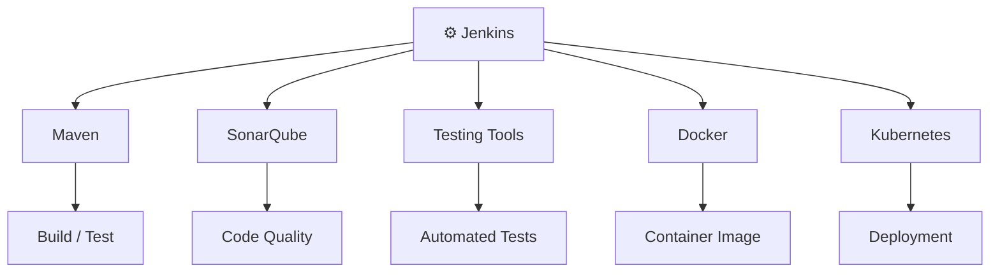
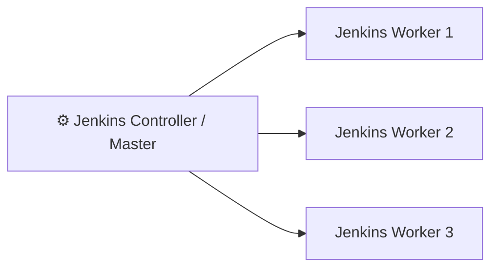
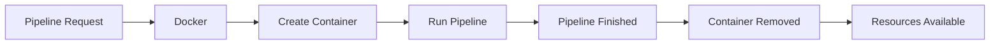
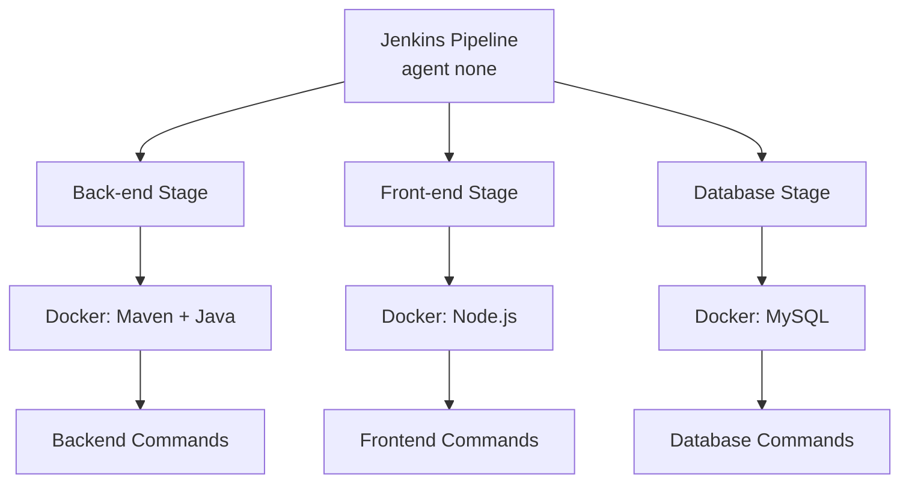
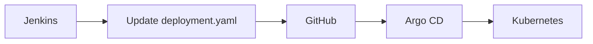
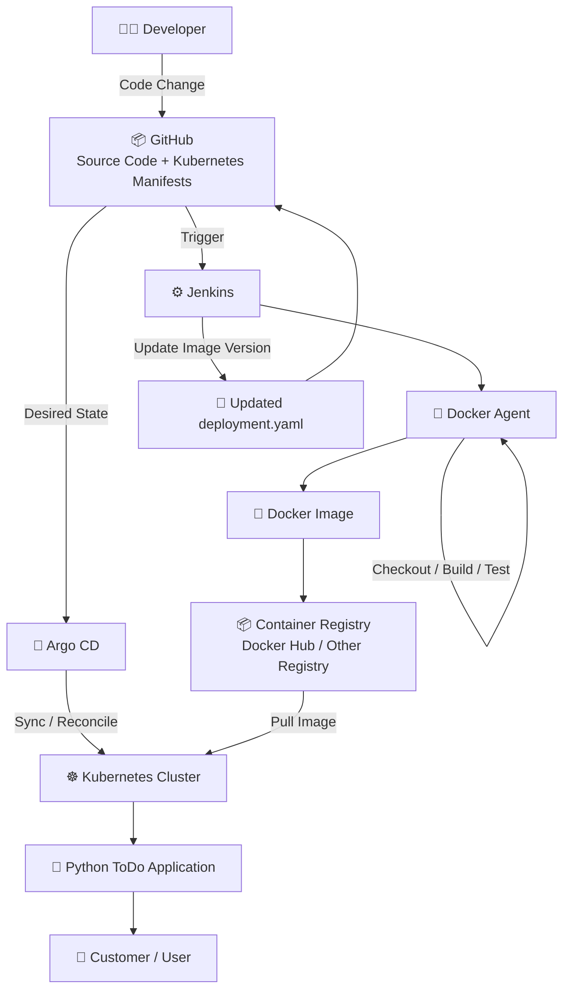

# 🚀 CI/CD + Jenkins + Docker Agents + Kubernetes + Argo CD

> A complete beginner-friendly reference for understanding modern CI/CD, Jenkins pipelines, Docker agents, multi-stage/multi-agent pipelines, Kubernetes deployment, and GitOps with Argo CD.

---

# 📚 Table of Contents

- [1. What is CI/CD?](#1-what-is-cicd)
- [2. Why Do We Need CI/CD?](#2-why-do-we-need-cicd)
- [3. Real-World CI/CD Flow](#3-real-world-cicd-flow)
- [4. Continuous Integration](#4-continuous-integration)
- [5. Continuous Delivery](#5-continuous-delivery)
- [6. Common CI/CD Stages](#6-common-cicd-stages)
- [7. Version Control System](#7-version-control-system)
- [8. How Jenkins Fits Into CI/CD](#8-how-jenkins-fits-into-cicd)
- [9. Jenkins as an Orchestrator](#9-jenkins-as-an-orchestrator)
- [10. Jenkins Master and Worker Architecture](#10-jenkins-master-and-worker-architecture)
- [11. Problems With Permanent Worker VMs](#11-problems-with-permanent-worker-vms)
- [12. Docker as a Jenkins Agent](#12-docker-as-a-jenkins-agent)
- [13. Why Docker Agents Are Useful](#13-why-docker-agents-are-useful)
- [14. Your First Jenkins Pipeline](#14-your-first-jenkins-pipeline)
- [15. Jenkins Pipeline Structure](#15-jenkins-pipeline-structure)
- [16. Pipeline Syntax / Snippet Generator](#16-pipeline-syntax--snippet-generator)
- [17. Multi-Stage Pipeline](#17-multi-stage-pipeline)
- [18. Multi-Agent Pipeline](#18-multi-agent-pipeline)
- [19. Legacy VM vs Docker Agent](#19-legacy-vm-vs-docker-agent)
- [20. Python ToDo Application CI/CD](#20-python-todo-application-cicd)
- [21. Docker Image and Container Flow](#21-docker-image-and-container-flow)
- [22. Kubernetes Deployment](#22-kubernetes-deployment)
- [23. Why Argo CD?](#23-why-argo-cd)
- [24. GitOps](#24-gitops)
- [25. GitHub as the Source of Truth](#25-github-as-the-source-of-truth)
- [26. Complete End-to-End Architecture](#26-complete-end-to-end-architecture)
- [27. Tool Responsibilities](#27-tool-responsibilities)
- [28. Important Terms](#28-important-terms)
- [29. Interview Explanation](#29-interview-explanation)
- [30. Final Mental Model](#30-final-mental-model)

---

# 1. What is CI/CD?

## CI/CD = Continuous Integration + Continuous Delivery/Deployment

CI/CD is a way of **automating the process of taking developer code changes and safely delivering them to users**.

Instead of manually doing:

```text
Code
 ↓
Build
 ↓
Test
 ↓
Security Check
 ↓
Deploy
```

every time a developer makes a change, we automate these activities.

```text
Developer
    ↓
Code Change
    ↓
GitHub / GitLab / Bitbucket
    ↓
CI/CD Pipeline
    ↓
Build
    ↓
Test
    ↓
Security / Quality Checks
    ↓
Deploy
    ↓
Customer
```

### Simple definition

> **CI/CD is the automated process of integrating, testing, validating, and delivering software reliably and repeatedly.**

---

# 2. Why Do We Need CI/CD?

Imagine a developer changes one small feature.

Without CI/CD:

```text
Developer
   ↓
Write Code
   ↓
Manually Build
   ↓
Manually Test
   ↓
Manually Security Scan
   ↓
Manually Deploy
```

If developers make hundreds of changes, doing everything manually becomes slow and error-prone.

The application could take:

```text
Months → Weeks → Days → Hours
```

to reach the customer.

CI/CD automates these repetitive activities.

```text
Code Change
     ↓
Automatic Pipeline
     ↓
Build
     ↓
Test
     ↓
Security
     ↓
Deployment
```

### Main goal

> **Deliver software faster, more reliably, and with fewer manual steps.**

---

# 3. Real-World CI/CD Flow

Imagine you are an application developer.

You are sitting in India and your customer is sitting in the USA.

You write an application on your laptop.

How does your application reach your customer?

```mermaid
flowchart LR
    A["👨‍💻 Developer"] --> B["📦 GitHub / VCS"]
    B --> C["⚙️ CI/CD Pipeline"]
    C --> D["🔨 Build"]
    D --> E["🧪 Testing"]
    E --> F["🔍 Code Quality"]
    F --> G["🔐 Security"]
    G --> H["📊 Reports"]
    H --> I["🟢 Dev"]
    I --> J["🟡 Staging"]
    J --> K["🔴 Production"]
    K --> L["👥 Customer"]
```



The exact stages can change depending on:

- Organization
- Application
- Programming language
- Security requirements
- Customer requirements
- Industry

For example, a banking application may have many more security and compliance checks than a simple website.

---

# 4. Continuous Integration

## What is Continuous Integration?

Continuous Integration means developers **frequently integrate their code changes into a shared version-control repository**, while automated builds and tests verify those changes.

Example:

```text
Developer
    ↓
Code Change
    ↓
GitHub
    ↓
CI Pipeline
    ↓
Build
    ↓
Unit Tests
    ↓
Code Analysis
    ↓
Security Checks
```

The idea is:

> **Integrate code frequently and automatically validate it.**

---

# 5. Continuous Delivery

## What is Continuous Delivery?

Continuous Delivery means the application is automatically prepared and delivered through the required environments so that it is ready for release.

A typical flow can be:

```text
CI
 ↓
Build + Test + Validate
 ↓
Dev
 ↓
Staging
 ↓
Approval / Validation
 ↓
Production
```

In many modern systems, deployment to production can also be automated.

So you may also hear:

- Continuous Delivery
- Continuous Deployment

### Simple difference

```text
Continuous Integration
        ↓
Integrate + Build + Test + Validate

Continuous Delivery
        ↓
Prepare and deliver application to environments

Continuous Deployment
        ↓
Automatically deploy validated changes to production
```

---

# 6. Common CI/CD Stages

A real organization may have many stages.

A common example is:

```text
1. Checkout
       ↓
2. Build
       ↓
3. Unit Testing
       ↓
4. Static Code Analysis
       ↓
5. Security / Vulnerability Scan
       ↓
6. Functional / E2E Testing
       ↓
7. Generate Reports
       ↓
8. Package / Create Artifact
       ↓
9. Deploy
```

---

## 6.1 Checkout

Get the latest source code from the version control system.

```text
GitHub
   ↓
Checkout
   ↓
Source Code
```

---

## 6.2 Build

Compile or package the application.

Examples:

```text
Java       → Maven / Gradle
Node.js    → npm
Python     → package/build tools
```

---

## 6.3 Unit Testing

Unit testing tests a **small individual piece of code**.

Example:

Suppose you have:

```python
def add(a, b):
    return a + b
```

A unit test might check:

```text
Input:
2 + 3

Expected:
5
```

So:

```text
add(2, 3)
   ↓
5 ✅
```

### Simple definition

> **Unit testing checks whether a specific function or small piece of code works correctly.**

---

## 6.4 Static Code Analysis

Static code analysis checks the source code **without actually running the application**.

It can identify things such as:

- Syntax problems
- Formatting issues
- Unused variables
- Code smells
- Poor coding practices
- Potential bugs

Example:

```text
Source Code
    ↓
Static Analysis
    ↓
Code Quality Report
```

Tools such as SonarQube can be integrated into CI/CD pipelines for code-quality analysis.

---

## 6.5 Security / Vulnerability Testing

Before delivering software, organizations may scan it for security problems.

```text
Application
    ↓
Security Scan
    ↓
Vulnerabilities?
    ↓
Yes / No
```

The goal is:

> **Do not deliver known serious security vulnerabilities to customers.**

---

## 6.6 Functional / End-to-End Testing

Unit testing checks a small piece of code.

Functional or end-to-end testing checks whether the application works correctly as a complete system or feature flow.

For example:

```text
Login
  ↓
Dashboard
  ↓
Add Product
  ↓
Checkout
  ↓
Payment
```

The test verifies the complete workflow.

---

## 6.7 Reports

Organizations need evidence of what happened.

Examples:

```text
Unit Tests:
100 passed
5 failed

Code Quality:
Passed

Security:
No critical vulnerabilities

E2E:
Passed
```

These reports help developers, QA teams, DevOps engineers, and management understand the health of the application.

---

## 6.8 Deployment

Finally, the application must be deployed somewhere users can access it.

```text
Application
    ↓
Deployment Platform
    ↓
Production
    ↓
Customer
```

Possible platforms include:

- Virtual Machines
- Docker
- Kubernetes
- Cloud platforms

---

# 7. Version Control System

Developers usually don't write the entire application in one day.

They make changes gradually.

Example:

```text
Version 1
    ↓
Version 2
    ↓
Version 3
    ↓
Version 4
    ↓
...
    ↓
Version 15
```

These changes need to be stored and tracked.

This is where a **Version Control System (VCS)** is used.

Examples:

- GitHub
- GitLab
- Bitbucket

### Important

**Git** is the version-control technology.

**GitHub** is a platform that hosts Git repositories and provides collaboration features.

```text
Developer
    ↓
Git
    ↓
GitHub Repository
```

---

# 8. How Jenkins Fits Into CI/CD

Once the developer pushes code to GitHub, something needs to perform all the automated tasks.

This is where Jenkins can come in.

```text
Developer
    ↓
GitHub
    ↓
Jenkins
    ↓
Pipeline
    ↓
Build
    ↓
Test
    ↓
Security
    ↓
Deploy
```

Jenkins can watch a repository and trigger pipelines based on configured events.

---

# 9. Jenkins as an Orchestrator

One of the most important concepts:

> **Jenkins acts as an orchestrator.**

What does that mean?

Jenkins itself does not necessarily perform every specialized task.

Instead, it coordinates different tools.

For example:



### Example

Jenkins might say:

```text
Run Maven
      ↓
Run tests
      ↓
Run SonarQube
      ↓
Build Docker image
      ↓
Deploy to Kubernetes
```

Jenkins coordinates this workflow.

### Simple meaning of orchestration

> **Orchestration = coordinating multiple tasks, tools, systems, or resources to complete one larger workflow.**

---

# 10. Jenkins Master and Worker Architecture

In a traditional Jenkins architecture, you may have:



The Jenkins controller is responsible mainly for things such as:

- Pipeline coordination
- Scheduling
- Managing jobs
- Maintaining Jenkins configuration

Workers/agents execute the actual pipeline workloads.

> Modern Jenkins documentation generally uses **controller** and **agent** terminology, although older tutorials often say **master** and **slave**.

---

# 11. Problems With Permanent Worker VMs

Suppose an organization has:

```text
Jenkins Controller
       │
       ├── Worker VM 1 → Java / Maven
       ├── Worker VM 2 → Node.js
       ├── Worker VM 3 → Python
       └── Worker VM 4 → Windows
```

These are permanent virtual machines.

### Problem 1 — Idle resources

Suppose Worker 3 is only used once a week.

Most of the time:

```text
Worker VM
   ↓
No pipeline
   ↓
Still running
   ↓
Resources being consumed
```

---

### Problem 2 — Dependency conflicts

One team may require:

```text
Node.js 16
```

Another team may require:

```text
Node.js 18
```

One application may require:

```text
Java 11
```

Another may require:

```text
Java 17
```

Managing everything on permanent workers becomes difficult.

---

### Problem 3 — Maintenance

DevOps engineers may need to:

```text
Update OS
Update Java
Update Node.js
Update Python
Update dependencies
Apply security patches
Fix broken packages
Maintain configurations
```

This creates a lot of operational work.

---

# 12. Docker as a Jenkins Agent

Instead of maintaining permanent worker environments, Jenkins can use Docker containers as agents.

Example:

```text
Jenkins
   ↓
Docker
   ↓
Create Container
   ↓
Run Pipeline
   ↓
Finish
   ↓
Remove Container
```

For example:

```groovy
agent {
    docker {
        image 'node:16-alpine'
    }
}
```

This tells Jenkins:

> **Run this pipeline using a Docker container created from the `node:16-alpine` image.**

---

# 13. Why Docker Agents Are Useful

Docker containers are lightweight and can provide isolated environments.

Suppose your pipeline needs Node.js 16.

```text
node:16-alpine
      ↓
Container
      ↓
Pipeline
```

Another pipeline can use:

```text
node:18-alpine
      ↓
Container
      ↓
Pipeline
```

There is no need to install both versions globally on the same worker environment.

---

## Container Lifecycle

The general idea is:



### Important

The Docker container used as the agent is generally **temporary for that pipeline execution**.

It is created when required and removed after the work finishes.

---

# 14. Your First Jenkins Pipeline

A simple Jenkinsfile:

```groovy
pipeline {
    agent {
        docker { image 'node:16-alpine' }
    }

    stages {
        stage('Test') {
            steps {
                sh 'node --version'
            }
        }
    }
}
```

The purpose is simple:

> **Run a Jenkins pipeline inside a Node.js Docker container and verify that Node.js is available.**

---

# 15. Jenkins Pipeline Structure

Understand the hierarchy:

```text
pipeline
   │
   ├── agent
   │
   └── stages
          │
          └── stage
                │
                └── steps
                       │
                       └── command
```

---

## 15.1 `pipeline`

```groovy
pipeline {
```

This is the main Jenkins Pipeline block.

Everything belonging to the pipeline goes inside it.

---

## 15.2 `agent`

```groovy
agent {
    docker {
        image 'node:16-alpine'
    }
}
```

`agent` answers:

> **Where should the pipeline run?**

Here:

```text
Jenkins
   ↓
Docker Agent
   ↓
node:16-alpine
   ↓
Pipeline
```

---

## 15.3 `stages`

```groovy
stages {
```

`stages` contains the major phases of the pipeline.

For example:

```text
Stages
  │
  ├── Build
  ├── Test
  ├── Security
  └── Deploy
```

---

## 15.4 `stage`

```groovy
stage('Test') {
```

A stage represents a major phase.

Examples:

```groovy
stage('Build')
stage('Test')
stage('Security')
stage('Deploy')
```

---

## 15.5 `steps`

```groovy
steps {
```

Steps contain the actual commands/actions that Jenkins executes.

Think:

```text
Stage
  ↓
Steps
  ↓
Commands
```

---

## 15.6 `sh`

```groovy
sh 'node --version'
```

`sh` executes a shell command.

So Jenkins runs:

```bash
node --version
```

Because the agent uses a Node.js image, the command should return a Node.js version.

Example:

```text
v16.x.x
```

---

# 16. Pipeline Syntax / Snippet Generator

You do not need to memorize every Jenkins syntax.

Jenkins provides a **Pipeline Syntax / Snippet Generator** utility.

It can help generate Jenkins Pipeline syntax for different operations.

For example, if you don't remember how to perform a Git checkout:

```text
Pipeline Syntax
      ↓
Choose Git / checkout
      ↓
Provide repository details
      ↓
Generate Pipeline Script
      ↓
Copy generated syntax
      ↓
Use it in Jenkinsfile
```

Similarly, you can generate syntax for shell commands and other supported Jenkins steps.

### Remember

> **Pipeline Syntax / Snippet Generator is a useful helper when learning Jenkins Pipeline syntax.**

---

# 17. Multi-Stage Pipeline

A real application usually needs more than one stage.

Example:

```text
Pipeline
   │
   ├── Checkout
   ├── Build
   ├── Test
   ├── Security
   ├── Package
   └── Deploy
```

Example:

```groovy
pipeline {
    agent {
        docker {
            image 'node:16-alpine'
        }
    }

    stages {

        stage('Build') {
            steps {
                sh 'npm install'
            }
        }

        stage('Test') {
            steps {
                sh 'npm test'
            }
        }

        stage('Deploy') {
            steps {
                sh 'kubectl apply -f deployment.yml'
            }
        }
    }
}
```

The important idea:

> **A stage represents a major phase of the CI/CD workflow.**

---

# 18. Multi-Agent Pipeline

Now consider a three-tier application:

```text
Application
    │
    ├── Frontend
    ├── Backend
    └── Database
```

Each component may need a different environment.

For example:

```text
Frontend → Node.js
Backend  → Java + Maven
Database → MySQL
```

Instead of using one common agent for the entire pipeline, each stage can use its own Docker agent.

---

## `agent none`

The pipeline can start with:

```groovy
pipeline {
    agent none
```

This means:

> **Do not assign one common agent to the entire pipeline.**

Individual stages can define their own agents.

---

## Complete Concept



---

# 19. Multi-Agent Example

```groovy
pipeline {
    agent none

    stages {

        stage('Back-end') {
            agent {
                docker {
                    image 'maven:3.8.1-adoptopenjdk-11'
                }
            }

            steps {
                sh 'mvn --version'
            }
        }

        stage('Front-end') {
            agent {
                docker {
                    image 'node:16-alpine'
                }
            }

            steps {
                sh 'node --version'
            }
        }

        stage('DB') {
            agent {
                docker {
                    image 'mysql:latest'
                }
            }

            steps {
                // Database-related commands
            }
        }
    }
}
```

> The MySQL example above is only demonstrating the idea of a database-specific agent. In a real pipeline, database operations would require the appropriate client, connection details, credentials, networking, and commands.

---

# 20. Multi-Stage vs Multi-Agent

These two terms are different.

## Multi-Stage

Means:

> **There are multiple stages in the pipeline.**

```text
Pipeline
   │
   ├── Build
   ├── Test
   └── Deploy
```

---

## Multi-Agent

Means:

> **Different parts of the pipeline can run using different agents/environments.**

```text
Backend  → Maven Container
Frontend → Node Container
DB       → MySQL Container
```

---

## Together

```text
              Jenkins Pipeline
                     │
                 agent none
                     │
       ┌─────────────┼─────────────┐
       ↓             ↓             ↓
    Backend       Frontend       Database
       ↓             ↓             ↓
    Maven          Node.js        MySQL
   Container      Container      Container
```

---

# 21. Legacy VM vs Docker Agent

## 🏗️ Legacy Approach

```text
Jenkins
   │
   ├── VM 1 → Maven / Java
   ├── VM 2 → Node.js
   └── VM 3 → Python
```

The VMs are permanent.

If Node.js changes:

```text
Node.js 16
    ↓
Node.js 18
```

Someone has to:

```text
Access VM
   ↓
Upgrade Node.js
   ↓
Check dependencies
   ↓
Test
   ↓
Maintain
```

---

## 🐳 Docker Approach

```text
Jenkins
   │
   ├── Backend → Maven Container → Remove
   │
   ├── Frontend → Node Container → Remove
   │
   └── DB → Database Container → Remove
```

If Node.js changes:

```text
node:16-alpine
       ↓
Change Jenkinsfile
       ↓
node:18-alpine
       ↓
New container
       ↓
Pipeline
```

The environment is defined by the image.

---

# 22. Python ToDo Application CI/CD

Now we connect all the concepts to a real application.

The example application is a:

> 🐍 **Python ToDo Application**

The source code is stored in GitHub.

The goal is:

```text
Developer
    ↓
GitHub
    ↓
Jenkins
    ↓
Build / Test
    ↓
Docker Image
    ↓
Container Registry
    ↓
Update Kubernetes Manifest
    ↓
GitHub
    ↓
Argo CD
    ↓
Kubernetes
    ↓
ToDo Application
```

---

# 23. Stage 1 — Checkout Python Code

Jenkins first gets the application source code.

```text
GitHub
   ↓
Checkout
   ↓
Python Application
```

SCM = **Source Code Management**

Examples:

```text
GitHub
GitLab
Bitbucket
```

---

# 24. Stage 2 — Build Docker Image

The Python application has a `Dockerfile`.

Jenkins can build an image:

```text
Python Application
        ↓
    Dockerfile
        ↓
   docker build
        ↓
🐳 Docker Image
```

Example:

```text
todo-app:35
```

Here:

```text
todo-app → Application name
35       → Version / build number
```

The exact naming convention depends on the organization.

---

# 25. Stage 3 — Push Docker Image

After building the image, Jenkins pushes it to a container registry.

For example:

```text
Jenkins
   ↓
Docker Image
   ↓
Docker Hub / Container Registry
```

Example:

```text
myuser/todo-app:35
```

Now Kubernetes can pull the image.

```text
Container Registry
       │
       │ todo-app:35
       ↓
   Kubernetes
```

---

# 26. Stage 4 — Update `deployment.yaml`

Suppose your Kubernetes deployment currently contains:

```yaml
image: myuser/todo-app:34
```

Jenkins builds version:

```text
35
```

Jenkins updates:

```yaml
image: myuser/todo-app:35
```

Then Jenkins commits the updated manifest to GitHub.



This is the important bridge between CI and GitOps-based CD.

---

# 27. Why Argo CD?

You could technically use tools such as Ansible to perform deployments.

But the teacher is introducing **Argo CD** because it is designed specifically for continuous delivery using a declarative GitOps model.

---

## Ansible

Ansible is primarily used for:

```text
Automation
Configuration Management
Provisioning
```

It can also automate Kubernetes-related tasks.

```text
Ansible
    ↓
Kubernetes
```

---

## Argo CD

Argo CD is designed around:

```text
Git
 ↓
Desired State
 ↓
Kubernetes
```

Argo CD continuously monitors the desired state and synchronizes the Kubernetes environment accordingly.

```text
GitHub
   ↓
Argo CD
   ↓
Kubernetes
```

---

# 28. GitOps

GitOps is a way of managing infrastructure and application deployment using Git as the source of the desired configuration.

The basic idea:

```text
Git Repository
      ↓
Desired State
      ↓
GitOps Tool
      ↓
Kubernetes
```

For example, Git says:

```yaml
image: myuser/todo-app:35
```

That represents the desired state.

Argo CD compares that desired state with what is actually running in Kubernetes.

---

# 29. GitHub as the Source of Truth

This is one of the most important concepts.

Suppose GitHub says:

```text
Desired:
todo-app:35
```

But Kubernetes currently has:

```text
Running:
todo-app:34
```

Argo CD detects the difference.

```text
GitHub
Desired State
    │
    ↓
Argo CD
    │
    │ Compare
    ↓
Kubernetes
Actual State
```

Difference:

```text
Desired = 35
Actual  = 34
```

Argo CD synchronizes Kubernetes.

```text
Argo CD
   ↓
Kubernetes
   ↓
todo-app:35
```

### Simple definition

> **Git is the source of truth for the desired application state.**

---

# 30. Jenkins vs Argo CD Responsibilities

This distinction is extremely important.

## Jenkins

Jenkins is mainly responsible for the **CI/automation side**.

```text
Jenkins
   ↓
Checkout
   ↓
Build
   ↓
Test
   ↓
Scan
   ↓
Create Docker Image
   ↓
Push Image
   ↓
Update Git
```

---

## Argo CD

Argo CD is responsible for the **GitOps continuous delivery side**.

```text
GitHub
   ↓
Argo CD
   ↓
Compare Desired vs Actual
   ↓
Synchronize
   ↓
Kubernetes
```

---

## Kubernetes

Kubernetes is the **runtime platform**.

It actually runs the application.

```text
Kubernetes
    ↓
Pods
    ↓
Containers
    ↓
Application
```

---

# 31. Complete End-to-End Architecture

This is the architecture you should remember.



---

# 32. Complete Flow in Simple Words

Let's walk through the entire process.

### Step 1 — Developer writes code

```text
👨‍💻 Developer
      ↓
Python ToDo Application
```

---

### Step 2 — Developer pushes code

```text
Developer
    ↓
GitHub
```

---

### Step 3 — Jenkins detects the change

```text
GitHub
   ↓
Jenkins
```

---

### Step 4 — Jenkins starts the pipeline

```text
Jenkins
   ↓
Docker Agent
```

A temporary container can provide the required environment.

---

### Step 5 — Checkout

```text
GitHub
   ↓
Python Source Code
```

---

### Step 6 — Build and test

```text
Source Code
    ↓
Build
    ↓
Tests
    ↓
Security / Quality Checks
```

---

### Step 7 — Create Docker image

```text
Python Application
      ↓
Dockerfile
      ↓
Docker Build
      ↓
todo-app:35
```

---

### Step 8 — Push image

```text
todo-app:35
      ↓
Container Registry
```

---

### Step 9 — Update Kubernetes manifest

Jenkins changes:

```yaml
image: myuser/todo-app:34
```

to:

```yaml
image: myuser/todo-app:35
```

---

### Step 10 — Commit the change to GitHub

```text
Jenkins
   ↓
deployment.yaml
   ↓
GitHub
```

---

### Step 11 — Argo CD detects the change

```text
GitHub
   ↓
Argo CD
```

Argo CD sees:

```text
Desired = todo-app:35
```

---

### Step 12 — Argo CD synchronizes Kubernetes

```text
Argo CD
   ↓
Kubernetes
```

Kubernetes gets the desired version.

---

### Step 13 — Kubernetes runs the application

```text
Kubernetes
    ↓
Pod
    ↓
Container
    ↓
Python ToDo Application
```

---

### Step 14 — Customer accesses the application

```text
Application
    ↓
👥 Customer
```

---

# 33. Complete Architecture in One Diagram

```text
                     👨‍💻 DEVELOPER
                           │
                           │ Code Change
                           ↓
                    📦 GITHUB / GIT
                           │
                           │ Event
                           ↓
                     ⚙️ JENKINS
                           │
                           ↓
                    🐳 DOCKER AGENT
                           │
                ┌──────────┼──────────┐
                ↓          ↓          ↓
             Checkout    Build      Test
                │          │          │
                └──────────┼──────────┘
                           ↓
                    🐳 DOCKER IMAGE
                           │
                           ↓
                  📦 CONTAINER REGISTRY
                           │
                           │
                           │ Image Version
                           ↓
                  📝 deployment.yaml
                           │
                           ↓
                    📦 GITHUB / GIT
                           │
                           │ Desired State
                           ↓
                      🔄 ARGO CD
                           │
                           │ Sync / Reconcile
                           ↓
                   ☸️ KUBERNETES
                           │
                           ↓
                    🐍 TODO APP
                           │
                           ↓
                      👥 CUSTOMER
```

---

# 34. Where Does Docker Agent Fit?

Do not confuse these two Docker concepts.

## Docker Agent

Used by **Jenkins to run the pipeline**.

```text
Jenkins
   ↓
Docker Agent
   ↓
Run CI Pipeline
```

---

## Application Docker Image

Used to **package your application**.

```text
Python Application
       ↓
Docker Build
       ↓
todo-app:35
       ↓
Container Registry
       ↓
Kubernetes
```

They are related to Docker, but they have different purposes.

```text
Docker Agent
     ↓
Runs CI/CD work

Application Image
     ↓
Packages the application
```

---

# 35. Workload vs Compute

These terms are important when discussing Jenkins scaling.

## Workload

A **workload** is the actual work that needs to be performed.

For example:

```text
Build application
Run tests
Run security scan
Build Docker image
Deploy application
```

That is your workload.

---

## Compute

**Compute** means the resources used to perform that workload.

Examples:

```text
CPU
RAM
Virtual Machines
Servers
Containers
Cloud instances
```

Example:

```text
Workload:
Run Maven build

        ↓

Compute:
CPU + RAM + Environment
```

---

# 36. What Does Dynamic Mean?

Dynamic means:

> **Resources are created or adjusted when needed instead of keeping everything permanently available.**

Example:

```text
No pipeline
    ↓
No temporary agent needed

Pipeline starts
    ↓
Create Docker agent

Pipeline finishes
    ↓
Remove Docker agent
```

This is a dynamic approach.

---

# 37. What Does Infrastructure Mean?

Infrastructure means the underlying resources required to run applications and systems.

Examples:

```text
Servers
Virtual Machines
Networking
Storage
Kubernetes Clusters
Load Balancers
Databases
Cloud Resources
```

In your Jenkins example:

```text
AWS EC2
    ↓
Infrastructure

Jenkins
    ↓
Tool running on infrastructure

Docker
    ↓
Runs containers

Pipeline
    ↓
Workload
```

---

# 38. What Does Orchestration Mean?

Orchestration means **coordinating multiple components and actions to achieve a larger workflow**.

For Jenkins:

```text
Jenkins
   │
   ├── Git
   ├── Maven
   ├── Testing
   ├── SonarQube
   ├── Docker
   └── Kubernetes
```

Jenkins coordinates these tools.

For Kubernetes:

```text
Kubernetes
   │
   ├── Pods
   ├── Containers
   ├── Services
   ├── Deployments
   └── Networking
```

Kubernetes orchestrates application workloads.

---

# 39. Why Modern Systems Prefer Dynamic Resources

Traditional approach:

```text
Permanent VM
     ↓
Always running
     ↓
Pipeline sometimes runs
     ↓
VM often idle
```

Dynamic approach:

```text
Pipeline Request
      ↓
Create Required Environment
      ↓
Run Workload
      ↓
Finish
      ↓
Release Environment
```

This can provide:

- Better resource utilization
- Easier environment management
- Less manual maintenance
- Better isolation
- Easier version changes
- Easier scaling

---

# 40. Jenkins Pipeline vs Freestyle Project

Jenkins historically supported **Freestyle projects**.

In a Freestyle project, much of the configuration is entered through Jenkins UI fields.

```text
Jenkins UI
   ↓
Text Boxes
   ↓
Configuration
```

This can be convenient, but it has an important drawback:

> The configuration is not naturally maintained as version-controlled code in the same way as a Jenkinsfile.

---

## Pipeline Approach

Instead:

```text
Jenkinsfile
    ↓
Pipeline as Code
    ↓
GitHub
    ↓
Version Control
    ↓
Peer Review
```

This gives you:

- Version history
- Code review
- Collaboration
- Reproducibility
- Easier changes
- Better visibility

### Recommended learning approach

> When learning modern Jenkins, focus on **Pipeline as Code and Jenkinsfiles** rather than relying only on Freestyle projects.

---

# 41. Jenkinsfile

A `Jenkinsfile` is a file containing the definition of your Jenkins Pipeline.

Example:

```text
Repository
│
├── application code
├── Dockerfile
├── deployment.yaml
└── Jenkinsfile
```

The Jenkinsfile can define:

```text
Agent
Stages
Steps
Environment
Conditions
Post actions
```

---

# 42. Pipeline → Stage → Step

This hierarchy is extremely important.

```text
Pipeline
   │
   ├── Stage
   │     └── Steps
   │
   ├── Stage
   │     └── Steps
   │
   └── Stage
         └── Steps
```

Example:

```groovy
stage('Test') {
    steps {
        sh 'npm test'
    }
}
```

Meaning:

```text
Stage
 ↓
Test

Steps
 ↓
Run npm test
```

---

# 43. One Agent vs Multiple Agents

## One Agent

```groovy
pipeline {
    agent {
        docker {
            image 'node:16-alpine'
        }
    }
}
```

Concept:

```text
Pipeline
   ↓
One Docker Environment
   ↓
All stages
```

---

## Multiple Agents

```groovy
pipeline {
    agent none

    stages {
        stage('Backend') {
            agent {
                docker {
                    image 'maven:...'
                }
            }
        }

        stage('Frontend') {
            agent {
                docker {
                    image 'node:...'
                }
            }
        }
    }
}
```

Concept:

```text
Pipeline
   ↓
agent none
   │
   ├── Backend → Maven Container
   │
   └── Frontend → Node Container
```

---

# 44. Why Containers Help With Dependency Conflicts

Suppose:

```text
Team A → Node.js 16
Team B → Node.js 18
Team C → Python 3
Team D → Java 11
```

With a shared permanent VM, these requirements can become difficult to manage.

With containers:

```text
Node.js 16 Container
Node.js 18 Container
Python Container
Java 11 Container
```

Each environment is isolated.

```text
Pipeline
   │
   ├── Node 16 Container
   ├── Node 18 Container
   ├── Python Container
   └── Java Container
```

---

# 45. Scaling Concept

Suppose 100 developers are working.

There may be many pipeline requests.

With permanent workers:

```text
Jenkins
   │
   ├── Worker 1
   ├── Worker 2
   ├── Worker 3
   ├── Worker 4
   ├── ...
   └── Worker 20
```

Some workers may be idle.

With dynamic container-based execution:

```text
Pipeline Request
      ↓
Required Environment
      ↓
Container Created
      ↓
Execute
      ↓
Container Removed
```

The underlying infrastructure can also be designed to scale dynamically.

---

# 46. CI/CD Alternatives

Jenkins is not the only CI/CD solution.

Examples include:

```text
Jenkins
GitHub Actions
GitLab CI/CD
CircleCI
Travis CI
```

The concepts are similar:

```text
Code Change
    ↓
Trigger
    ↓
Pipeline
    ↓
Build
    ↓
Test
    ↓
Deploy
```

The syntax, architecture, and available features differ between tools.

---

# 47. Jenkins vs GitHub Actions — Basic Idea

## Jenkins

```text
GitHub
   ↓
Jenkins
   ↓
Agent
   ↓
Pipeline
```

Jenkins infrastructure is commonly managed by the organization.

---

## GitHub Actions

```text
GitHub
   ↓
GitHub Actions
   ↓
Runner
   ↓
Workflow
```

A runner is the environment that executes the workflow.

GitHub-hosted runners can provide managed execution environments, while self-hosted runners can be managed by the organization.

---

# 48. Jenkins Docker Agent vs GitHub Actions Runner

Don't confuse the terminology.

```text
Jenkins
   ↓
Agent
   ↓
Runs Jenkins pipeline
```

GitHub Actions:

```text
GitHub Actions
   ↓
Runner
   ↓
Runs workflow
```

Both provide compute where automation executes.

---

# 49. Complete CI/CD Responsibility Map

```text
┌─────────────────────────────────────────────┐
│                 GITHUB                      │
│                                             │
│ Source Code + Jenkinsfile + Manifests      │
└───────────────────┬─────────────────────────┘
                    │
                    ↓
┌─────────────────────────────────────────────┐
│                 JENKINS                     │
│                                             │
│ CI / Automation / Orchestration             │
│                                             │
│ Checkout → Build → Test → Scan → Package    │
└───────────────────┬─────────────────────────┘
                    │
                    ↓
┌─────────────────────────────────────────────┐
│              CONTAINER REGISTRY             │
│                                             │
│ Stores Application Docker Images            │
└───────────────────┬─────────────────────────┘
                    │
                    │
          Git Manifest Updated
                    │
                    ↓
┌─────────────────────────────────────────────┐
│                 ARGO CD                     │
│                                             │
│ GitOps / Continuous Delivery                │
│                                             │
│ Desired State → Kubernetes                  │
└───────────────────┬─────────────────────────┘
                    │
                    ↓
┌─────────────────────────────────────────────┐
│               KUBERNETES                    │
│                                             │
│ Runs the Application                        │
└───────────────────┬─────────────────────────┘
                    │
                    ↓
                 👥 USER
```

---

# 50. Important Terms

| Term | Simple Meaning |
|---|---|
| **CI** | Continuously integrate and validate code changes |
| **CD** | Continuously deliver/deploy applications |
| **VCS** | Version Control System |
| **Git** | Version control technology |
| **GitHub** | Platform for hosting Git repositories |
| **Jenkins** | CI/CD automation server |
| **Pipeline** | Automated sequence of CI/CD activities |
| **Jenkinsfile** | Pipeline definition stored as code |
| **Stage** | Major phase of a pipeline |
| **Step** | Actual action/command inside a stage |
| **Agent** | Environment where Jenkins executes work |
| **Docker Agent** | Docker container used to execute Jenkins work |
| **Worker** | Jenkins execution machine/agent |
| **Orchestration** | Coordinating multiple tasks/tools/resources |
| **Workload** | Actual work being executed |
| **Compute** | CPU/RAM/servers/resources used to execute workloads |
| **Infrastructure** | Underlying resources used to run systems |
| **Dynamic** | Resources created/changed according to demand |
| **Docker Image** | Packaged template used to create containers |
| **Container** | Running instance of an image |
| **Container Registry** | Stores container images |
| **Kubernetes** | Container orchestration platform |
| **Argo CD** | GitOps continuous delivery tool for Kubernetes |
| **GitOps** | Managing desired system state through Git |
| **Manifest** | Configuration describing desired Kubernetes resources |
| **Deployment** | Kubernetes resource used to manage application Pods |
| **Source of Truth** | Authoritative place representing desired configuration |

---

# 51. Interview Explanation — "Explain Your CI/CD Process"

A simple interview answer:

> "In our CI/CD process, developers commit their changes to GitHub, which acts as our version-control system. Jenkins detects the change and triggers the pipeline. The pipeline first checks out the source code, then builds the application, runs unit and functional tests, performs code-quality and security checks, and creates the required artifact or Docker image. The image is pushed to a container registry. For Kubernetes deployments, Jenkins updates the required Kubernetes manifest with the new image version and commits that change back to Git. Argo CD monitors the Git repository and uses it as the desired state. When it detects the new version, it synchronizes the Kubernetes cluster, where the application is deployed and made available to users."

---

# 52. Interview — "Why Docker Agents?"

Answer:

> "Instead of maintaining permanent Jenkins worker VMs for every technology stack, we use Docker containers as Jenkins agents. Each pipeline or stage can use the environment it requires, such as Node.js, Maven, or Python. The container can be created when the workload starts and removed after execution. This provides better isolation, reduces manual dependency maintenance, and improves resource utilization."

---

# 53. Interview — "What is a Multi-Agent Pipeline?"

Answer:

> "A multi-agent pipeline is a Jenkins pipeline where different stages can execute using different agents. For example, the backend stage can use a Maven Docker image, the frontend stage can use a Node.js Docker image, and a database-related stage can use an appropriate database environment. We can use `agent none` at the pipeline level and define the required agent at the stage level."

---

# 54. Interview — "Why Pipeline as Code?"

Answer:

> "Instead of configuring Jenkins jobs only through the UI, we define the pipeline in a Jenkinsfile and store it in Git. This gives us version control, history, peer review, collaboration, and easier maintenance."

---

# 55. Interview — "Why Argo CD?"

Answer:

> "Argo CD is designed for declarative continuous delivery and GitOps. We store the desired Kubernetes configuration in Git, and Argo CD continuously monitors the repository and synchronizes the Kubernetes cluster with that desired state."

---

# 56. Interview — "Jenkins vs Argo CD?"

```text
Jenkins
   ↓
CI / Automation
   ↓
Build
Test
Scan
Package
Update Git
```

```text
Argo CD
   ↓
GitOps / CD
   ↓
Watch Git
Compare State
Synchronize Kubernetes
```

So:

> **Jenkins builds and automates. Argo CD delivers and synchronizes. Kubernetes runs the application.**

---

# 57. The Most Important Architecture to Remember

If you forget everything else, remember this:

```text
                 👨‍💻 DEVELOPER
                       │
                       │ Code
                       ↓
                 📦 GITHUB / GIT
                       │
                       │ Trigger
                       ↓
                  ⚙️ JENKINS
                       │
                       ↓
                🐳 DOCKER AGENT
                       │
          ┌────────────┼────────────┐
          ↓            ↓            ↓
       Checkout       Build        Test
          │            │            │
          └────────────┼────────────┘
                       ↓
                🐳 Docker Image
                       │
                       ↓
              📦 Container Registry
                       │
                       │
                 Update Git
                       ↓
                 📝 Manifest
                       │
                       ↓
                 📦 GITHUB / GIT
                       │
                       │ Desired State
                       ↓
                   🔄 ARGO CD
                       │
                       │ Sync
                       ↓
                ☸️ KUBERNETES
                       │
                       ↓
                 🐍 APPLICATION
                       │
                       ↓
                  👥 CUSTOMER
```

---

# 58. Final Mental Model 🧠

Think about the tools as people with different jobs.

```text
👨‍💻 Developer
      │
      │ Writes code
      ↓
📦 GitHub
      │
      │ Stores code + desired configuration
      ↓
⚙️ Jenkins
      │
      │ Automates CI
      ↓
🐳 Docker Agent
      │
      │ Provides temporary execution environment
      ↓
🔨 Build + 🧪 Test + 🔐 Security
      │
      ↓
🐳 Application Image
      │
      ↓
📦 Container Registry
      │
      │
      └──────→ 📝 Git Manifest Updated
                       │
                       ↓
                  📦 GitHub
                       │
                       ↓
                  🔄 Argo CD
                       │
                       │ GitOps
                       ↓
                ☸️ Kubernetes
                       │
                       ↓
                 🚀 Application
                       │
                       ↓
                    👥 User
```

---

# 🎯 One-Line Memory Trick

```text
GitHub = Store
Jenkins = Automate
Docker = Package
Registry = Store Image
Argo CD = Synchronize
Kubernetes = Run
Customer = Use
```

Or remember it as:

```text
CODE
 ↓
GIT
 ↓
JENKINS
 ↓
BUILD + TEST
 ↓
DOCKER IMAGE
 ↓
REGISTRY
 ↓
GIT MANIFEST
 ↓
ARGO CD
 ↓
KUBERNETES
 ↓
APPLICATION
 ↓
CUSTOMER
```

> 🚀 **This is the core CI/CD + Docker + Kubernetes + GitOps architecture you should keep in your mind.**
