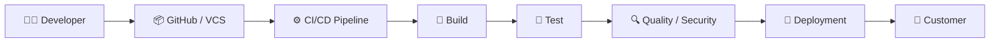
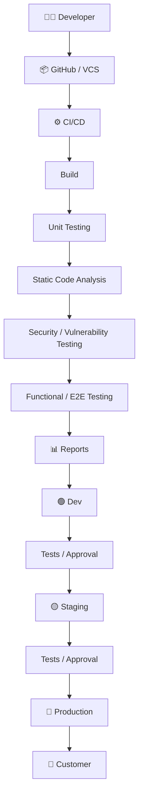
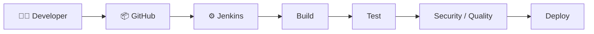
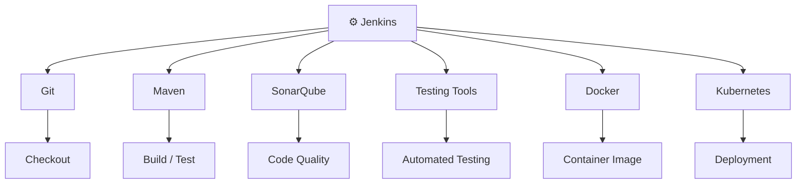
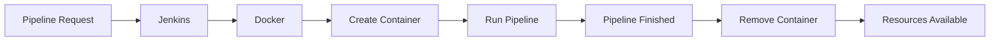
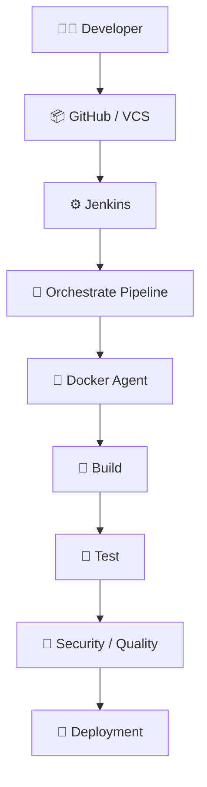

# 🚀 CI/CD + Jenkins + Docker Agents — Fundamentals

> A simple and practical understanding of CI/CD, Jenkins, agents, workloads, compute, orchestration, and Docker-based Jenkins agents.

---

## 📚 Table of Contents

- [1. What is CI/CD?](#1-what-is-cicd)
- [2. Why Do We Need CI/CD?](#2-why-do-we-need-cicd)
- [3. Real-World CI/CD Flow](#3-real-world-cicd-flow)
- [4. Continuous Integration](#4-continuous-integration)
- [5. Continuous Delivery](#5-continuous-delivery)
- [6. Common CI/CD Stages](#6-common-cicd-stages)
- [7. Version Control System](#7-version-control-system)
- [8. How Jenkins Fits Into CI/CD](#8-how-jenkins-fits-into-cicd)
- [9. Jenkins as an Orchestrator](#9-jenkins-as-an-orchestrator)
- [10. Jenkins Master and Worker Architecture](#10-jenkins-master-and-worker-architecture)
- [11. Problems With Permanent Worker VMs](#11-problems-with-permanent-worker-vms)
- [12. Docker as a Jenkins Agent](#12-docker-as-a-jenkins-agent)
- [13. Why Docker Agents Are Useful](#13-why-docker-agents-are-useful)

---

# 1. What is CI/CD?

## 🚀 CI/CD = Continuous Integration + Continuous Delivery

CI/CD is a process used to **automate the steps involved in taking application code from a developer and delivering it to the customer**.

Without CI/CD, many activities have to be performed manually:

```text
Developer
    ↓
Write Code
    ↓
Build Application
    ↓
Test Application
    ↓
Security Checks
    ↓
Deploy Application
    ↓
Customer
```

In modern DevOps, these activities are automated using CI/CD pipelines.



### Simple Definition

> **CI/CD is the automated process of building, testing, validating, and delivering software reliably and repeatedly.**

---

# 2. Why Do We Need CI/CD?

Imagine a developer makes a small change to an application.

If everything is done manually:

```text
Code Change
    ↓
Manual Build
    ↓
Manual Unit Testing
    ↓
Manual Functional Testing
    ↓
Manual Security Testing
    ↓
Manual Reporting
    ↓
Manual Deployment
```

Now imagine hundreds of developers making changes every day.

Doing all these activities manually becomes:

- Slow
- Error-prone
- Difficult to maintain
- Difficult to scale
- Time-consuming

Instead, CI/CD automates these activities.

```text
Code Change
     ↓
Automatic Pipeline
     ↓
Build
     ↓
Test
     ↓
Security
     ↓
Reports
     ↓
Deployment
```

### 🎯 Main Goal

> **Deliver applications faster, more reliably, and with fewer manual steps.**

---

# 3. Real-World CI/CD Flow

A developer may work on an application from their personal laptop while the customer may be located somewhere else in the world.

The application needs to go through several checks before reaching the customer.



The exact stages can change depending on:

- Organization
- Application
- Programming language
- Security requirements
- Customer requirements
- Industry

For example, a simple application may have fewer stages, while a banking or government application may require many additional security and compliance checks.

---

# 4. Continuous Integration

## 🔄 What is Continuous Integration?

Continuous Integration means developers **frequently integrate their code changes into a shared version-control repository and automatically validate those changes**.

Example:

```text
Developer
    ↓
Code Change
    ↓
GitHub
    ↓
CI Pipeline
    ↓
Build
    ↓
Unit Tests
    ↓
Code Analysis
    ↓
Security Checks
```

The idea is:

> **Integrate code frequently and automatically check whether the changes are working correctly.**

### Example

Suppose a developer creates an addition function:

```python
def add(a, b):
    return a + b
```

A unit test may check:

```text
2 + 3
  ↓
  5 ✅
```

If the test passes, the change can continue through the pipeline.

---

# 5. Continuous Delivery

## 🚀 What is Continuous Delivery?

Continuous Delivery means the application is automatically prepared and delivered through the required environments so that it can be released reliably.

A typical flow can be:

```text
CI
 ↓
Build
 ↓
Test
 ↓
Security
 ↓
Dev
 ↓
Staging
 ↓
Approval / Validation
 ↓
Production
```

### Simple Difference

```text
Continuous Integration
        ↓
Integrate + Build + Test + Validate

Continuous Delivery
        ↓
Prepare and deliver the application

Continuous Deployment
        ↓
Automatically deploy validated changes
```

The exact implementation depends on the organization's process.

---

# 6. Common CI/CD Stages

A real CI/CD pipeline can contain many stages.

A common example:

```text
1. Checkout
      ↓
2. Build
      ↓
3. Unit Testing
      ↓
4. Static Code Analysis
      ↓
5. Security / Vulnerability Scan
      ↓
6. Functional / E2E Testing
      ↓
7. Reports
      ↓
8. Package / Artifact
      ↓
9. Deployment
```

---

## 6.1 Checkout

Jenkins or another CI/CD tool gets the latest source code from the Version Control System.

```text
GitHub
   ↓
Checkout
   ↓
Source Code
```

---

## 6.2 Build

The application is compiled or packaged.

Examples:

```text
Java       → Maven / Gradle
Node.js    → npm
Python     → Python build/package tools
```

---

## 6.3 Unit Testing

Unit testing checks a **small individual piece of code**.

Example:

```text
Function:
add(2, 3)

Expected:
5
```

```text
add(2, 3)
    ↓
    5
    ↓
Pass ✅
```

### Simple Definition

> **Unit testing checks whether a specific function or small piece of code works correctly.**

---

## 6.4 Static Code Analysis

Static code analysis checks source code without actually running the application.

It can identify:

- Syntax problems
- Code smells
- Unused variables
- Formatting problems
- Poor coding practices
- Potential bugs

Example:

```text
Source Code
    ↓
Static Analysis
    ↓
Code Quality Report
```

Tools such as SonarQube can be integrated into CI/CD pipelines for code-quality analysis.

---

## 6.5 Security / Vulnerability Testing

Applications should be checked for security problems before delivery.

```text
Application
    ↓
Security Scan
    ↓
Vulnerabilities?
    ↓
Pass / Fail
```

The goal is to avoid delivering applications with known serious security vulnerabilities.

---

## 6.6 Functional / End-to-End Testing

Unit testing checks a small piece of code.

Functional or End-to-End testing checks the application workflow.

For example:

```text
Login
  ↓
Dashboard
  ↓
Add Product
  ↓
Checkout
  ↓
Payment
```

The complete workflow is tested.

---

## 6.7 Reports

Reports provide information about what happened during the pipeline.

For example:

```text
Unit Tests:
100 Passed
5 Failed

Code Quality:
Passed

Security:
No Critical Vulnerabilities

E2E:
Passed
```

Reports help developers, QA engineers, DevOps engineers, and management understand the health of the application.

---

## 6.8 Deployment

After the required checks pass, the application can be deployed.

```text
Application
    ↓
Deployment Platform
    ↓
Production
    ↓
Customer
```

Possible deployment platforms include:

- Virtual Machines
- Docker
- Kubernetes
- Cloud platforms

---

# 7. Version Control System

Developers usually don't create an entire application in one day.

They work on it gradually.

```text
Version 1
    ↓
Version 2
    ↓
Version 3
    ↓
Version 4
    ↓
...
    ↓
Version 15
```

These changes need to be stored and tracked.

This is where a **Version Control System (VCS)** is used.

### Examples

```text
GitHub
GitLab
Bitbucket
```

### Important Difference

**Git** is the version-control technology.

**GitHub** is a platform that hosts Git repositories and provides collaboration features.

```text
Developer
    ↓
Git
    ↓
GitHub Repository
```

---

## 🔄 How CI/CD Gets Triggered

When a developer is confident about a change:

```text
Developer
    ↓
Commit
    ↓
Push
    ↓
GitHub
    ↓
CI/CD Trigger
    ↓
Pipeline
```

So the Version Control System becomes an important starting point for CI/CD.

---

# 8. How Jenkins Fits Into CI/CD

Once the developer pushes code to GitHub, something needs to perform all the automated activities.

This is where **Jenkins** can be used.



Jenkins can be configured to watch a repository and trigger a pipeline when changes occur.

### Example

```text
Developer
    ↓
Push Code
    ↓
GitHub
    ↓
Change Event
    ↓
Jenkins
    ↓
Jenkins Pipeline
```

The Jenkins pipeline can then execute the required CI/CD stages.

---

# 9. Jenkins as an Orchestrator

One of the most important Jenkins concepts is:

> **Jenkins acts as an orchestrator.**

Jenkins does not necessarily perform every specialized task itself.

Instead, it coordinates different tools.



### Example

Jenkins may coordinate:

```text
Checkout Code
      ↓
Run Maven
      ↓
Run Unit Tests
      ↓
Run SonarQube
      ↓
Build Docker Image
      ↓
Deploy to Kubernetes
```

Jenkins coordinates this workflow.

### 🧠 What is Orchestration?

> **Orchestration means coordinating multiple tools, tasks, systems, or resources to complete a larger workflow.**

---

# 10. Jenkins Master and Worker Architecture

In traditional Jenkins architecture, Jenkins is commonly divided into:

```text
Jenkins Controller
       │
       ├── Agent / Worker 1
       ├── Agent / Worker 2
       └── Agent / Worker 3
```

Older Jenkins terminology commonly used:

```text
Master
Slave
```

Modern terminology uses:

```text
Controller
Agent
```

---

## Jenkins Controller

The controller is responsible mainly for:

- Managing Jenkins
- Scheduling jobs
- Managing pipeline execution
- Maintaining configuration
- Coordinating agents

---

## Jenkins Agent / Worker

Agents execute the actual workload.

```text
Jenkins Controller
       │
       │ Schedule
       ↓
Jenkins Agent
       │
       ↓
Execute Pipeline
```

---

## Example Organization

Imagine an organization with many teams:

```text
                  Jenkins Controller
                         │
             ┌───────────┼───────────┐
             ↓           ↓           ↓
          Agent 1     Agent 2     Agent 3
             │           │           │
         Team 1       Team 2       Team 3
```

Different agents can be assigned to different teams or workloads.

---

# 11. Problems With Permanent Worker VMs

The traditional approach might look like:

```text
Jenkins Controller
       │
       ├── VM 1 → Java / Maven
       ├── VM 2 → Node.js
       ├── VM 3 → Python
       └── VM 4 → Windows
```

These worker machines may remain running even when there is no workload.

---

## ❌ Problem 1 — Idle Resources

Suppose Worker VM 3 is required only occasionally.

```text
Worker VM
    ↓
No Pipeline
    ↓
Still Running
    ↓
Resources Being Used
```

The machine may remain idle.

---

## ❌ Problem 2 — Dependency Conflicts

Imagine:

```text
Team A → Node.js 16
Team B → Node.js 18
```

Or:

```text
Application A → Java 11
Application B → Java 17
```

Installing and maintaining different versions on shared worker machines can become complicated.

---

## ❌ Problem 3 — Maintenance

DevOps engineers may have to maintain:

```text
Operating System
Java
Node.js
Python
Maven
Dependencies
Security Patches
Configuration
```

For many worker VMs, this becomes a large maintenance task.

---

## ❌ Problem 4 — Scaling

Suppose there are many development teams.

You may need:

```text
Jenkins Controller
      ↓
20 Worker VMs
      ↓
More Developers
      ↓
More Worker VMs
```

As the organization grows, the Jenkins infrastructure can become large and expensive to maintain.

---

# 12. Docker as a Jenkins Agent

To solve many of these problems, Jenkins can use **Docker containers as agents**.

Instead of:

```text
Jenkins
   ↓
Permanent Worker VM
   ↓
Run Pipeline
```

we can use:

```text
Jenkins
   ↓
Docker
   ↓
Temporary Container
   ↓
Run Pipeline
   ↓
Container Removed
```

---

## Example

```groovy
pipeline {
    agent {
        docker {
            image 'node:16-alpine'
        }
    }

    stages {
        stage('Test') {
            steps {
                sh 'node --version'
            }
        }
    }
}
```

The important part is:

```groovy
agent {
    docker {
        image 'node:16-alpine'
    }
}
```

This tells Jenkins:

> **Run the pipeline using a Docker container created from the `node:16-alpine` image.**

---

## 🔄 Container Lifecycle



### Important Concept

The container can exist only for the duration of the work.

```text
Pipeline Request
      ↓
Create Container
      ↓
Execute Pipeline
      ↓
Finish
      ↓
Remove Container
```

---

# 13. Why Docker Agents Are Useful

Docker agents provide several important advantages.

---

## 🐳 1. Environment Isolation

Different pipelines can use different environments.

```text
Pipeline A
    ↓
Node.js 16 Container

Pipeline B
    ↓
Node.js 18 Container

Pipeline C
    ↓
Python Container

Pipeline D
    ↓
Java Container
```

The environments are isolated from each other.

---

## 🔄 2. Easy Version Changes

Suppose your pipeline currently uses:

```groovy
docker {
    image 'node:16-alpine'
}
```

Tomorrow you need Node.js 18.

Change it to:

```groovy
docker {
    image 'node:18-alpine'
}
```

The next pipeline can use the new image.

You don't need to manually log into a worker VM and upgrade Node.js.

---

## 🧹 3. Less Maintenance

### Permanent VM approach

```text
VM
 ↓
Install
 ↓
Configure
 ↓
Upgrade
 ↓
Patch
 ↓
Maintain
```

### Docker approach

```text
Docker Image
     ↓
Create Container
     ↓
Run Pipeline
     ↓
Remove Container
```

The environment is defined by the Docker image.

---

## 💰 4. Better Resource Utilization

Permanent worker:

```text
Worker VM
    ↓
No Pipeline
    ↓
Still Running ❌
```

Docker-based execution:

```text
No Pipeline
    ↓
No Temporary Container

Pipeline Starts
    ↓
Container Created

Pipeline Ends
    ↓
Container Removed
```

This can improve resource utilization.

---

## ⚡ 5. Faster Environment Creation

Instead of manually configuring a new VM:

```text
Create VM
   ↓
Install OS packages
   ↓
Install Node.js
   ↓
Install Dependencies
   ↓
Configure
```

a suitable Docker image can provide the required environment directly.

```text
Docker Image
     ↓
Container
     ↓
Ready Environment
```

---

# 🧠 Workload vs Compute

These terms are important when discussing Jenkins architecture.

## Workload

**Workload = the actual work that needs to be performed.**

Examples:

```text
Build Application
Run Tests
Run Security Scan
Build Docker Image
Deploy Application
```

These are workloads.

---

## Compute

**Compute = the resources used to execute the workload.**

Examples:

```text
CPU
RAM
Virtual Machines
Servers
Containers
Cloud Instances
```

Example:

```text
Workload:
Run Maven Build

        ↓

Compute:
CPU + RAM + Execution Environment
```

### Easy Way to Remember

```text
Workload = WHAT needs to be done

Compute = WHERE / WITH WHAT resources it is done
```

---

# 🔄 Dynamic Infrastructure

Dynamic means resources are created, removed, or scaled according to demand.

### Static Approach

```text
Worker VM
    ↓
Always Running
    ↓
Pipeline may or may not exist
```

### Dynamic Approach

```text
Pipeline Request
      ↓
Create Required Environment
      ↓
Run Workload
      ↓
Finish
      ↓
Release Environment
```

Docker agents are an example of this dynamic execution model.

---

# 🏗️ Infrastructure

Infrastructure means the underlying resources required to run applications and systems.

Examples:

```text
Servers
Virtual Machines
CPU
RAM
Storage
Networking
Kubernetes Clusters
Load Balancers
Cloud Resources
```

For example:

```text
AWS EC2
   ↓
Infrastructure

Jenkins
   ↓
Tool running on infrastructure

Docker
   ↓
Runs containers

Pipeline
   ↓
Workload
```

---

# 🎯 Why Move From Permanent VMs to Docker Agents?

### Traditional

```text
                    Jenkins
                       │
             ┌─────────┼─────────┐
             ↓         ↓         ↓
           VM 1       VM 2      VM 3
          Java       Node.js    Python
             │         │         │
             └─────Permanent─────┘
```

Problems:

```text
❌ Idle VMs
❌ Dependency conflicts
❌ Manual maintenance
❌ Version upgrades
❌ Scaling challenges
```

---

### Docker Agent Approach

```text
                     Jenkins
                        │
                  Docker Engine
                        │
          ┌─────────────┼─────────────┐
          ↓             ↓             ↓
      Node Container  Java Container  Python Container
          ↓             ↓             ↓
       Execute       Execute         Execute
          ↓             ↓             ↓
       Remove        Remove          Remove
```

Advantages:

```text
✅ Isolated environments
✅ Easy version changes
✅ Less maintenance
✅ Better resource utilization
✅ Temporary execution environments
```

---

# 🧠 The Complete Fundamentals Flow

Everything we learned so far connects like this:



---

# 📌 Key Concepts to Remember

```text
CI/CD
  ↓
Automates software delivery

Git / GitHub
  ↓
Stores and tracks code changes

Jenkins
  ↓
Automates and orchestrates the pipeline

Controller
  ↓
Schedules and manages Jenkins

Agent / Worker
  ↓
Executes the workload

Workload
  ↓
Actual work being performed

Compute
  ↓
Resources used to perform the work

Docker Agent
  ↓
Container used to execute Jenkins work

Dynamic
  ↓
Resources are created/removed according to demand

Orchestration
  ↓
Coordinates multiple tools and tasks

Infrastructure
  ↓
Underlying resources required to run systems
```

---

# 🏁 Fundamentals Complete

At this point you should understand:

```text
CI/CD
  ↓
Version Control
  ↓
Jenkins
  ↓
Orchestration
  ↓
Controller
  ↓
Agents / Workers
  ↓
Workloads + Compute
  ↓
Docker Agents
  ↓
Dynamic Execution
```

## 🚀 Next

The next part moves from **concepts → practical Jenkins Pipelines**:

```text
First Jenkins Pipeline
        ↓
Jenkinsfile
        ↓
Pipeline
        ↓
Agent
        ↓
Stages
        ↓
Steps
        ↓
Multi-Stage Pipeline
        ↓
Multi-Agent Pipeline
        ↓
Docker Agents
        ↓
Kubernetes
        ↓
Argo CD
        ↓
GitOps
```

> 🧠 **Remember:** Jenkins is the automation/orchestration layer, Docker provides the execution environment, Git stores the source and configuration, and later Kubernetes will run the application while Argo CD handles GitOps-based delivery.
