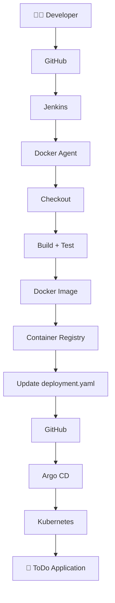

# 🚀 Jenkins Pipelines + Kubernetes + Argo CD

> **Part 2 of the CI/CD Learning Journey**  
> This section continues from **14** and focuses on Jenkins Pipelines, Docker agents, Kubernetes deployment, Argo CD, and GitOps.

---

## 📚 Table of Contents

- [14. Your First Jenkins Pipeline](#14-your-first-jenkins-pipeline)
- [15. Jenkins Pipeline Structure](#15-jenkins-pipeline-structure)
- [16. Pipeline Syntax / Snippet Generator](#16-pipeline-syntax--snippet-generator)
- [17. Multi-Stage Pipeline](#17-multi-stage-pipeline)
- [18. Multi-Agent Pipeline](#18-multi-agent-pipeline)
- [19. Legacy VM vs Docker Agent](#19-legacy-vm-vs-docker-agent)
- [20. Python ToDo Application CI/CD](#20-python-todo-application-cicd)
- [21. Docker Image and Container Flow](#21-docker-image-and-container-flow)
- [22. Kubernetes Deployment](#22-kubernetes-deployment)
- [23. Why Argo CD?](#23-why-argo-cd)
- [24. GitOps](#24-gitops)
- [25. GitHub as the Source of Truth](#25-github-as-the-source-of-truth)
- [26. Complete End-to-End Architecture](#26-complete-end-to-end-architecture)
- [27. Tool Responsibilities](#27-tool-responsibilities)
- [28. Important Terms](#28-important-terms)
- [29. Interview Explanation](#29-interview-explanation)
- [30. Final Mental Model](#30-final-mental-model)

---

# 14. Your First Jenkins Pipeline

A **Jenkins Pipeline** is a set of automated steps that Jenkins executes to build, test, scan, package, and deploy an application.

Instead of configuring every step manually through the Jenkins UI, we can define the pipeline as code inside a **Jenkinsfile**.

### Simple Pipeline

```groovy
pipeline {
    agent {
        docker {
            image 'node:16-alpine'
        }
    }

    stages {
        stage('Test') {
            steps {
                sh 'node --version'
            }
        }
    }
}
```

### What Happens?

```text
Jenkins
   ↓
Starts Pipeline
   ↓
Creates Docker Agent
   ↓
Uses node:16-alpine
   ↓
Runs Test Stage
   ↓
node --version
   ↓
Pipeline finishes
   ↓
Temporary container is removed
```

### Output

The command:

```bash
node --version
```

could produce:

```text
v16.x.x
```

The exact version depends on the image tag.

---

# 15. Jenkins Pipeline Structure

A Jenkins Declarative Pipeline generally follows this structure:

```groovy
pipeline {

    agent {
        docker {
            image 'node:16-alpine'
        }
    }

    stages {

        stage('Test') {

            steps {
                sh 'node --version'
            }

        }

    }
}
```

Let's understand each keyword.

---

## `pipeline`

```groovy
pipeline {
}
```

This is the main block of a Declarative Jenkins Pipeline.

Everything related to the pipeline is defined inside it.

---

## `agent`

```groovy
agent {
    docker {
        image 'node:16-alpine'
    }
}
```

The `agent` defines **where the pipeline runs**.

In this example, Jenkins uses a Docker container as the execution environment.

```text
Jenkins
   ↓
Docker Agent
   ↓
node:16-alpine
   ↓
Pipeline Commands
```

---

## `docker`

```groovy
docker {
    image 'node:16-alpine'
}
```

This tells Jenkins to use a Docker image as the agent.

The image already contains the required environment.

For example:

```text
node:16-alpine
```

provides Node.js.

Another application might require:

```text
maven:...
python:...
golang:...
```

---

## `image`

```groovy
image 'node:16-alpine'
```

Specifies the Docker image Jenkins should use.

### Best Practice

Avoid relying on:

```text
latest
```

Prefer a specific version such as:

```text
node:16-alpine
```

or another deliberately selected version.

This makes builds more predictable and reproducible.

---

## `stages`

```groovy
stages {
}
```

`stages` contains the major phases of the pipeline.

For example:

```text
Checkout
   ↓
Build
   ↓
Test
   ↓
Security Scan
   ↓
Package
   ↓
Deploy
```

---

## `stage`

```groovy
stage('Test') {
}
```

A `stage` represents one logical phase of the pipeline.

Examples:

```groovy
stage('Checkout')
stage('Build')
stage('Test')
stage('Docker Build')
stage('Deploy')
```

---

## `steps`

```groovy
steps {
}
```

`steps` contains the actual commands/actions Jenkins executes inside a stage.

Example:

```groovy
steps {
    sh 'node --version'
}
```

---

## `sh`

```groovy
sh 'node --version'
```

`sh` executes a shell command.

For example:

```groovy
sh 'pwd'
sh 'ls'
sh 'python --version'
sh 'docker --version'
```

---

# 16. Pipeline Syntax / Snippet Generator

Jenkins provides a **Pipeline Syntax** page that can help generate pipeline syntax.

This is particularly useful when you are learning Jenkins Pipeline or when you don't remember the exact syntax for a Jenkins step.

For example, Jenkins can help generate syntax for:

- Git checkout
- Shell commands
- Credentials
- Other Jenkins Pipeline steps

### Typical Workflow

```text
Jenkins
   ↓
Pipeline Syntax
   ↓
Select Required Step
   ↓
Provide Configuration
   ↓
Generate Script
   ↓
Copy Into Jenkinsfile
```

### Why Is It Useful?

You don't have to memorize every Jenkins Pipeline function.

Instead:

1. Select the required operation.
2. Configure it.
3. Generate the syntax.
4. Put the generated code into your Jenkinsfile.
5. Test and modify it as needed.

### Important

The Snippet Generator is a **learning and syntax-generation tool**.

You should still understand what the generated code does.

---

# 17. Multi-Stage Pipeline

Real applications usually require multiple steps.

For example:

```text
Checkout
   ↓
Build
   ↓
Test
   ↓
Security Scan
   ↓
Package
   ↓
Deploy
```

Jenkins allows us to represent these as multiple stages.

### Example

```groovy
pipeline {
    agent {
        docker {
            image 'node:16-alpine'
        }
    }

    stages {

        stage('Test') {
            steps {
                sh 'node --version'
            }
        }

        stage('Deploy') {
            steps {
                sh 'kubectl apply -f deployment.yml'
            }
        }

    }
}
```

### Pipeline Visualization

```text
┌───────────────┐
│ Jenkins       │
└───────┬───────┘
        ↓
┌───────────────┐
│ Docker Agent  │
└───────┬───────┘
        ↓
┌───────────────┐
│ Test          │
└───────┬───────┘
        ↓
┌───────────────┐
│ Deploy        │
└───────────────┘
```

### Important Note

The example:

```groovy
sh 'kubectl apply -f deployment.yml'
```

requires `kubectl` to actually exist in the execution environment.

A Node.js image does not automatically provide every DevOps tool.

In a real implementation, you would use an appropriate agent/image or tool setup that provides the required dependencies.

---

# 18. Multi-Agent Pipeline

Sometimes different stages require different environments.

For example, imagine a three-tier application:

```text
Frontend
Backend
Database
```

Each part may require different tools.

```text
Frontend → Node.js
Backend  → Java + Maven
Database → MySQL tools
```

Instead of using one environment for everything, Jenkins can assign different agents to different stages.

---

## `agent none`

Example:

```groovy
pipeline {
    agent none

    stages {

        stage('Back-end') {
            agent {
                docker {
                    image 'maven:3.8.1'
                }
            }

            steps {
                sh 'mvn --version'
            }
        }

        stage('Front-end') {
            agent {
                docker {
                    image 'node:16-alpine'
                }
            }

            steps {
                sh 'node --version'
            }
        }
    }
}
```

### What Does `agent none` Mean?

```groovy
agent none
```

means:

> Don't assign one global agent to the entire pipeline.

Instead, individual stages can define their own agents.

---

## Multi-Agent Architecture

```text
                    Jenkins Pipeline
                          │
             ┌────────────┴────────────┐
             ↓                         ↓
      Backend Stage             Frontend Stage
             ↓                         ↓
       Maven Agent                Node Agent
             ↓                         ↓
       Java/Maven                 Node.js
```

This is useful when different stages require different environments.

---

# 19. Legacy VM vs Docker Agent

Older Jenkins environments commonly used permanent worker/agent VMs.

### Legacy Architecture

```text
                  Jenkins Controller
                         │
          ┌──────────────┼──────────────┐
          ↓              ↓              ↓
      Worker VM       Worker VM       Worker VM
          ↓              ↓              ↓
       App A           App B           App C
```

Each VM could have its own dependencies.

For example:

```text
VM 1 → Java 7
VM 2 → Java 8
VM 3 → Python 2
VM 4 → Python 3
VM 5 → Node.js 15
```

---

## Problems With Permanent Worker VMs

### 1. Dependency Conflicts

Different applications may require different versions.

```text
Application A → Java 7
Application B → Java 8
```

Managing both environments becomes difficult.

---

### 2. Resource Waste

A worker VM may remain running even when there is no job.

```text
VM running
   ↓
No workload
   ↓
CPU/RAM still allocated
```

---

### 3. Maintenance

Administrators must maintain:

- Operating system
- Packages
- Runtime versions
- Security patches
- Jenkins agents
- Libraries

---

### 4. Scaling Problems

If workload suddenly increases:

```text
5 jobs
   ↓
Only 2 workers
   ↓
Jobs wait
```

You may need to create additional worker VMs.

---

## Docker Agent Approach

With Docker agents:

```text
Jenkins
   ↓
Creates Container
   ↓
Runs Pipeline
   ↓
Pipeline Finishes
   ↓
Container Removed
```

Example:

```text
node:16-alpine
maven:...
python:...
```

Each pipeline can use the environment it requires.

---

## Why Docker Agents Are Useful

### Environment Isolation

Different jobs can use different environments.

```text
Job A → Node.js container
Job B → Python container
Job C → Maven container
```

---

### Less Maintenance

Instead of manually configuring every VM:

```text
VM
 ├── OS
 ├── Java
 ├── Python
 ├── Node
 ├── Libraries
 └── Tools
```

the required environment can be defined through an image.

---

### Better Resource Utilization

Containers are generally lighter than full VMs and can be created when required.

This supports more dynamic infrastructure.

---

# 20. Python ToDo Application CI/CD

Now let's connect everything into a practical CI/CD project.

Imagine a Python ToDo application stored in GitHub.

```text
Python ToDo Application
        ↓
      GitHub
```

The goal is to automate the complete process:

```text
Code
 ↓
Checkout
 ↓
Build
 ↓
Test
 ↓
Docker Image
 ↓
Push Image
 ↓
Update Kubernetes Manifest
 ↓
Git Commit
 ↓
Argo CD
 ↓
Kubernetes
```

---

## Overall Flow



---

# 21. Docker Image and Container Flow

Docker provides a consistent way to package an application and its required runtime dependencies.

### Application

```text
Python ToDo App
```

can be packaged into:

```text
Docker Image
```

For example:

```text
todo-app:34
```

The image can then be pushed to a container registry.

```text
Jenkins
   ↓
docker build
   ↓
todo-app:34
   ↓
docker push
   ↓
Container Registry
```

---

## Image vs Container

### Docker Image

An image is the packaged application environment.

```text
Image
 ├── Application
 ├── Dependencies
 ├── Runtime
 └── Configuration
```

### Container

A container is a running instance created from an image.

```text
Image
  ↓
Container
  ↓
Running Application
```

---

## Versioned Images

Suppose the current image is:

```text
todo-app:34
```

A new code change can produce:

```text
todo-app:35
```

Then Kubernetes can be updated to use:

```yaml
image: todo-app:35
```

This makes application versions easier to track.

---

# 22. Kubernetes Deployment

Kubernetes is responsible for running the application.

A Kubernetes Deployment describes the desired state of application workloads.

Example:

```yaml
apiVersion: apps/v1
kind: Deployment

metadata:
  name: todo-app

spec:
  replicas: 2

  selector:
    matchLabels:
      app: todo-app

  template:
    metadata:
      labels:
        app: todo-app

    spec:
      containers:
        - name: todo-app
          image: todo-app:34
          ports:
            - containerPort: 8000
```

The important part for our CI/CD example is:

```yaml
image: todo-app:34
```

When a new image is built:

```text
todo-app:34
      ↓
todo-app:35
```

the Kubernetes manifest needs to be updated.

---

## Traditional Deployment Approach

One approach is:

```text
Jenkins
   ↓
kubectl apply
   ↓
Kubernetes
```

Jenkins directly performs the deployment.

This can work, but it is not a pure GitOps model.

---

# 23. Why Argo CD?

Argo CD is a **GitOps continuous delivery tool for Kubernetes**.

Instead of Jenkins directly changing the Kubernetes cluster, we can use Git as the desired-state source.

The flow becomes:

```text
Jenkins
   ↓
Update Kubernetes Manifest
   ↓
GitHub
   ↓
Argo CD
   ↓
Kubernetes
```

Argo CD watches the Git repository and compares:

```text
Desired State
     vs
Live State
```

If the cluster does not match the desired state, Argo CD can synchronize the application according to its configuration.

---

## Without GitOps

```text
Jenkins
   ↓
kubectl
   ↓
Kubernetes
```

---

## With GitOps

```text
Jenkins
   ↓
GitHub
   ↓
Argo CD
   ↓
Kubernetes
```

This separates:

```text
CI
+
CD
```

more clearly.

Jenkins can focus on building/testing/publishing and updating the desired configuration, while Argo CD handles Kubernetes synchronization.

---

# 24. GitOps

**GitOps** is an approach where Git stores the declarative desired state of infrastructure/application deployment.

The basic idea is:

```text
Git = Desired State
```

For Kubernetes, the Git repository may contain:

```text
deployment.yaml
service.yaml
configmap.yaml
```

or Helm/Kustomize configuration.

---

## GitOps Flow

```text
Developer
    ↓
Code Change
    ↓
Jenkins
    ↓
Build + Test
    ↓
Docker Image
    ↓
Container Registry
    ↓
Update Kubernetes Manifest
    ↓
Git Commit
    ↓
Argo CD
    ↓
Kubernetes
```

---

## Key GitOps Principle

Instead of manually changing the cluster:

```text
kubectl edit ...
```

the desired configuration is changed in Git.

Then the GitOps controller reconciles the cluster.

---

# 25. GitHub as the Source of Truth

In this architecture, GitHub can contain two important types of information.

### Application Source Code

```text
app.py
requirements.txt
Dockerfile
...
```

### Kubernetes Desired Configuration

```text
deployment.yaml
service.yaml
...
```

For example:

```yaml
image: todo-app:35
```

becomes the desired application version.

---

## Source of Truth

```text
GitHub
   │
   ├── Application Code
   │
   └── Kubernetes Desired State
```

Argo CD reads the Kubernetes configuration from Git.

It then compares the desired state with the actual Kubernetes cluster.

```text
Git
 ↓
Desired State

Kubernetes
 ↓
Live State

      ↓

Argo CD
      ↓
Reconciliation
```

---

# 26. Complete End-to-End Architecture

Now combine everything.

```mermaid
flowchart LR
    A["👨‍💻 Developer"] --> B["GitHub"]
    B --> C["Jenkins"]
    C --> D["Docker Agent"]
    D --> E["Checkout"]
    E --> F["Build"]
    F --> G["Test"]
    G --> H["Docker Image"]
    H --> I["Container Registry"]
    I --> J["Update deployment.yaml"]
    J --> K["GitHub"]
    K --> L["Argo CD"]
    L --> M["☸️ Kubernetes"]
    M --> N["🐍 ToDo Application"]
    N --> O["👤 Customer"]
```



---

## Step-by-Step

### Step 1 — Developer Changes Code

Developer modifies the Python application.

```text
Developer
    ↓
Code Change
```

---

### Step 2 — Push to GitHub

```text
Developer
    ↓
GitHub
```

---

### Step 3 — Jenkins Starts

Jenkins is triggered based on the configured repository/event mechanism.

```text
GitHub
   ↓
Jenkins
```

---

### Step 4 — Jenkins Uses Docker Agent

Jenkins starts an appropriate Docker-based execution environment.

```text
Jenkins
   ↓
Docker Agent
```

---

### Step 5 — Checkout

Jenkins obtains the source code.

```text
GitHub
   ↓
Checkout
   ↓
Workspace
```

---

### Step 6 — Build and Test

Jenkins runs required CI tasks.

```text
Build
 ↓
Unit Tests
 ↓
Quality Checks
 ↓
Security Checks
```

The exact stages depend on the application and organization.

---

### Step 7 — Build Docker Image

Jenkins builds:

```text
todo-app:35
```

---

### Step 8 — Push Image

The image is pushed to a container registry.

```text
Jenkins
   ↓
Container Registry
```

---

### Step 9 — Update Kubernetes Manifest

The Kubernetes manifest changes from:

```yaml
image: todo-app:34
```

to:

```yaml
image: todo-app:35
```

---

### Step 10 — Commit and Push to GitHub

```text
deployment.yaml
       ↓
Git Commit
       ↓
Git Push
       ↓
GitHub
```

---

### Step 11 — Argo CD Detects the Change

Argo CD monitors the configured Git repository/path.

It detects that the desired configuration changed.

```text
GitHub
   ↓
Argo CD
```

---

### Step 12 — Argo CD Synchronizes Kubernetes

Argo CD reconciles the Kubernetes application with the desired state.

```text
Desired State
     ↓
Argo CD
     ↓
Kubernetes
```

---

### Step 13 — Kubernetes Runs the New Version

Kubernetes starts the new application version.

```text
todo-app:35
     ↓
Kubernetes
     ↓
Application
     ↓
Customer
```

---

# 27. Tool Responsibilities

Understanding each tool's responsibility is extremely important.

| Tool | Main Responsibility |
|---|---|
| 🐙 GitHub | Source code + Git-based collaboration + desired configuration |
| 🔧 Jenkins | CI automation and pipeline orchestration |
| 🐳 Docker | Package applications and provide isolated execution environments |
| 📦 Container Registry | Store and distribute Docker images |
| ☸️ Kubernetes | Run and manage containerized workloads |
| 🚀 Argo CD | GitOps continuous delivery and Kubernetes reconciliation |

---

## Jenkins

Jenkins can coordinate:

```text
Checkout
Build
Test
Scan
Docker Build
Docker Push
Manifest Update
```

Think:

> **Jenkins = Automation / CI Orchestrator**

---

## Docker

Docker provides:

```text
Application Packaging
+
Containerized Execution Environment
```

Think:

> **Docker = Packaging + Container Runtime Ecosystem**

---

## Container Registry

Stores Docker images.

Examples include:

```text
Docker Hub
Amazon ECR
GitHub Container Registry
Google Artifact Registry
Azure Container Registry
```

Think:

> **Registry = Storage and Distribution for Container Images**

---

## Kubernetes

Runs the application.

Think:

> **Kubernetes = Container Orchestration / Runtime Platform**

---

## Argo CD

Reads desired configuration from Git and reconciles Kubernetes.

Think:

> **Argo CD = GitOps Continuous Delivery**

---

# 28. Important Terms

## Workload

A **workload** is the actual work that needs to be executed.

Examples:

```text
Build application
Run tests
Run security scan
Build Docker image
Deploy application
```

---

## Compute

**Compute** means the resources used to execute the workload.

Examples:

```text
CPU
RAM
VM
Container
Cloud instance
Kubernetes node
```

Simple distinction:

```text
Workload = What needs to be done

Compute = Where/how it gets executed
```

---

## Infrastructure

Infrastructure is the underlying technology resources required to run systems.

Examples:

```text
Servers
VMs
CPU
RAM
Storage
Network
Cloud resources
Kubernetes clusters
```

---

## Dynamic Infrastructure

Dynamic infrastructure means resources can be created, used, scaled, and removed according to demand.

Example:

```text
Job starts
   ↓
Docker Agent created
   ↓
Job executes
   ↓
Job finishes
   ↓
Agent removed
```

---

## Orchestration

Orchestration means coordinating multiple tools, processes, and resources to complete a workflow.

For example:

```text
Git
 ↓
Build
 ↓
Test
 ↓
Docker
 ↓
Registry
 ↓
GitOps
 ↓
Kubernetes
```

Jenkins can orchestrate many of these CI activities.

---

## Reconciliation

Reconciliation means continuously comparing:

```text
Desired State
     vs
Actual State
```

and taking action when they differ.

Argo CD performs this concept for Kubernetes applications managed through GitOps.

---

## Declarative Configuration

Declarative configuration describes **what the desired state should be**, rather than manually specifying every action required to reach it.

Example:

```yaml
replicas: 3
image: todo-app:35
```

This describes the desired state.

Kubernetes and GitOps systems use declarative configuration heavily.

---

# 29. Interview Explanation

### Question:

**Explain a modern CI/CD pipeline using Jenkins, Docker, Kubernetes, and Argo CD.**

### Answer:

> A developer pushes application code to GitHub. Jenkins is triggered and starts the CI pipeline. Jenkins can execute the pipeline using a Docker-based agent, then checks out the code, builds the application, runs tests and quality/security checks, and builds a Docker image. The image is pushed to a container registry. Jenkins then updates the Kubernetes deployment manifest with the new image version and commits the change back to GitHub. Argo CD monitors the Git repository as the desired state and detects the manifest change. It then reconciles and synchronizes the Kubernetes cluster with the desired configuration. Kubernetes runs the new application version for the users.

---

## Short Interview Version

```text
GitHub
   ↓
Jenkins
   ↓
Build + Test
   ↓
Docker Image
   ↓
Container Registry
   ↓
Update Kubernetes Manifest
   ↓
GitHub
   ↓
Argo CD
   ↓
Kubernetes
```

Remember:

> **Jenkins performs CI and automation.**

> **Docker packages the application and can provide isolated build environments.**

> **The registry stores the Docker image.**

> **Argo CD performs GitOps-based continuous delivery.**

> **Kubernetes runs the application.**

---

# 30. Final Mental Model

The most important thing is not memorizing every Jenkins syntax.

Understand the responsibility of each component.

```text
                    👨‍💻 Developer
                          │
                          ▼
                     🐙 GitHub
                          │
                          ▼
                     🔧 Jenkins
                          │
                          ▼
                    🐳 Docker Agent
                          │
                ┌─────────┴─────────┐
                │                   │
                ▼                   ▼
              Build               Test
                │                   │
                └─────────┬─────────┘
                          ▼
                    Docker Image
                          │
                          ▼
                 📦 Container Registry
                          │
                          ▼
               Update deployment.yaml
                          │
                          ▼
                     🐙 GitHub
                          │
                          ▼
                     🚀 Argo CD
                          │
                          ▼
                    ☸️ Kubernetes
                          │
                          ▼
                    🐍 Application
                          │
                          ▼
                      👤 User
```

---

## 🧠 The Whole Concept in One Sentence

> **Developer pushes code → Jenkins automates CI → Docker provides the required environment and packages the application → the image is stored in a registry → the Kubernetes desired state is updated in Git → Argo CD detects the Git change → Argo CD reconciles Kubernetes → the new application version runs.**

---

## 🔑 Remember These 10 Points

1. **Jenkins Pipeline = CI/CD workflow as code**
2. **Jenkinsfile = Pipeline definition stored as code**
3. **Agent = Environment where pipeline work executes**
4. **Docker Agent = Jenkins execution environment using a container**
5. **Stage = Logical phase of a pipeline**
6. **Steps = Commands/actions executed inside a stage**
7. **Multi-Agent Pipeline = Different stages can use different environments**
8. **Docker Image = Packaged application**
9. **Argo CD = GitOps continuous delivery for Kubernetes**
10. **Git = Desired State / Source of Truth in a GitOps workflow**

---

# 🎯 Final Architecture

```text
Developer
    ↓
GitHub
    ↓
Jenkins
    ↓
Docker Agent
    ↓
Checkout
    ↓
Build + Test
    ↓
Docker Image
    ↓
Container Registry
    ↓
Update deployment.yaml
    ↓
GitHub
    ↓
Argo CD
    ↓
Kubernetes
    ↓
Application
    ↓
Customer
```

---

# 🚀 What You Should Understand Before Practicals

Before starting the practical implementation, make sure these relationships are clear:

```text
Jenkins
  │
  ├── Pipeline
  ├── Stages
  ├── Steps
  └── Agents
        │
        └── Docker

Docker
  │
  ├── Image
  └── Container

CI/CD
  │
  ├── Build
  ├── Test
  ├── Scan
  └── Package

GitOps
  │
  ├── Git
  ├── Desired State
  └── Reconciliation

Argo CD
  │
  └── Git → Kubernetes

Kubernetes
  │
  └── Runs Application
```

> **Next practical goal:** build the Python ToDo CI/CD pipeline for real — Jenkins → Docker → Container Registry → Kubernetes manifest → GitHub → Argo CD → Kubernetes.
