# 🚀 GitHub Actions Practicals 1–4

> Hands-on GitHub Actions CI journey using a Python application  
> Repository: `Yuvii2102/github-actions-practice`

---

# 🎯 Objective

The goal of these practicals was to learn GitHub Actions practically by building a Python CI pipeline step by step.

We started with a simple GitHub Actions workflow and gradually added:

```text
First Workflow
      ↓
Checkout Repository
      ↓
Setup Python
      ↓
Run Application
      ↓
Install pytest
      ↓
Run Automated Tests
      ↓
Matrix Testing
      ↓
Multiple Python Versions
```

By the end of Practical 4, we had a working Python CI pipeline that automatically tested our application using Python 3.11, 3.12, and 3.13.

---

# 🧠 GitHub Actions Basic Architecture

GitHub Actions is a CI/CD automation platform provided by GitHub.

A basic GitHub Actions flow is:

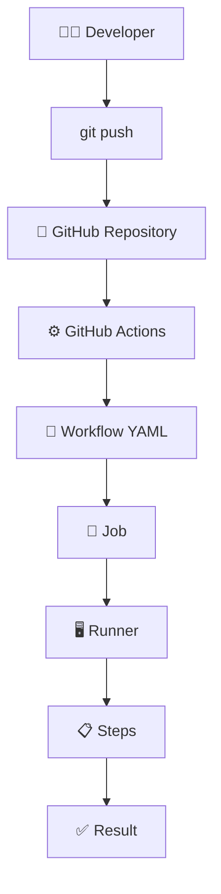

A workflow is written in YAML and stored inside:

```text
.github/workflows/
```

---

# 📁 Project Structure

Our project structure after Practicals 1–4:

```text
github-actions-practice/
│
├── app.py
│
├── test_app.py
│
├── .gitignore
│
└── .github/
    └── workflows/
        └── first-workflow.yml
```

The Python virtual environment was kept outside Git tracking using `.gitignore`.

Our `.gitignore`:

```text
venv/
__pycache__/
*.pyc
```

---

# 🧪 Practical 1 — First GitHub Actions Workflow

## 🎯 Objective

The objective of Practical 1 was to create our first GitHub Actions workflow and understand the basic structure of:

```text
Workflow
   ↓
Job
   ↓
Runner
   ↓
Steps
```

---

## 🐍 Create Python Application

We created:

```text
app.py
```

Content:

```python
def add(a, b):
    return a + b

print(add(10, 20))
```

Run the application:

```bash
python app.py
```

Output:

```text
30
```

---

## ⚙️ Create Workflow

We created:

```text
.github/workflows/first-workflow.yml
```

Initial workflow:

```yaml
name: My First GitHub Action

on:
  push:

jobs:
  build:
    runs-on: ubuntu-latest

    steps:
      - name: Say Hello
        run: echo "Hello from GitHub Actions"

      - name: Show Python Version
        run: python --version

      - name: Show Runner OS
        run: uname -a
```

---

## 🧠 Understanding the YAML

### `name`

```yaml
name: My First GitHub Action
```

Defines the name of the workflow.

---

### `on`

```yaml
on:
  push:
```

Defines when the workflow should run.

Here, the workflow runs whenever code is pushed to the repository.

```text
git push
   ↓
Workflow Triggered
```

---

### `jobs`

```yaml
jobs:
```

Defines the jobs that belong to the workflow.

---

### Job

```yaml
build:
```

`build` is the ID of our job.

---

### `runs-on`

```yaml
runs-on: ubuntu-latest
```

Specifies the runner used to execute the job.

Here we use a GitHub-hosted Ubuntu runner.

---

### `steps`

```yaml
steps:
```

A job contains individual steps.

---

### `run`

Example:

```yaml
run: echo "Hello from GitHub Actions"
```

The `run` keyword executes a shell command on the runner.

---

## 🔄 Practical 1 Flow

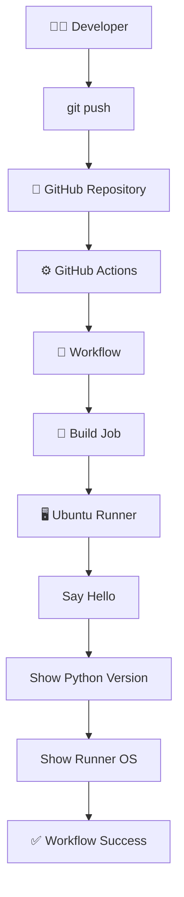

---

## ✅ Practical 1 Result

Our first GitHub Actions workflow executed successfully.

We learned:

```text
Workflow
   ↓
Job
   ↓
Runner
   ↓
Steps
   ↓
Commands
```

---

# 🧪 Practical 2 — Checkout + Setup Python + Run Application

## 🎯 Objective

In Practical 2, we moved from simply executing commands to preparing a Python environment and running our application through GitHub Actions.

We learned:

```text
actions/checkout
actions/setup-python
uses
with
python-version
```

---

## ⚙️ Updated Workflow

```yaml
name: Python Application CI

on:
  push:

jobs:
  build:
    runs-on: ubuntu-latest

    steps:
      - name: Checkout code
        uses: actions/checkout@v6

      - name: Set up Python
        uses: actions/setup-python@v5
        with:
          python-version: '3.12'

      - name: Show Python version
        run: python --version

      - name: Run Python application
        run: python app.py
```

---

## 🧩 `uses`

We used:

```yaml
uses: actions/checkout@v6
```

`actions/checkout` checks out the repository code onto the GitHub Actions runner.

This makes our repository files available to the workflow.

---

## 🐍 Setup Python

We used:

```yaml
uses: actions/setup-python@v5
```

with:

```yaml
with:
  python-version: '3.12'
```

This prepares Python 3.12 for the workflow.

---

## ⚠️ Important Understanding

This:

```yaml
actions/setup-python@v5
```

does NOT mean Python version 5.

There are two different versions:

```text
actions/setup-python@v5
        ↓
GitHub Action version


python-version: '3.12'
        ↓
Python version
```

---

## 🔄 Practical 2 Flow

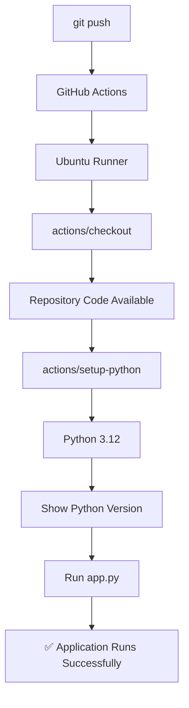

---

## ✅ Practical 2 Result

The workflow successfully:

```text
1. Started an Ubuntu runner
2. Checked out repository code
3. Set up Python 3.12
4. Displayed Python version
5. Executed app.py
```

---

# 🧪 Practical 3 — pytest CI

## 🎯 Objective

In Practical 3, we introduced automated testing into our GitHub Actions pipeline.

Instead of only running the application, GitHub Actions would now verify whether our code was working correctly.

We used:

```text
pytest
```

---

## 🧪 Create Test File

We created:

```text
test_app.py
```

Content:

```python
from app import add

def test_add():
    assert add(10, 20) == 30
```

---

## 🧠 Understanding the Test

The test imports:

```python
from app import add
```

Then calls:

```python
add(10, 20)
```

The expected result is:

```text
30
```

Therefore:

```python
assert add(10, 20) == 30
```

checks whether the actual result matches the expected result.

---

# 💻 Local pytest Setup

The Ubuntu system uses an externally managed Python environment, so we created a Python virtual environment.

First:

```bash
sudo apt update
```

Install Python virtual environment support:

```bash
sudo apt install python3-venv -y
```

Create the virtual environment:

```bash
python3 -m venv venv
```

Activate it:

```bash
source venv/bin/activate
```

Install pytest:

```bash
pip install pytest
```

Check pytest:

```bash
pytest --version
```

Run the test:

```bash
pytest test_app.py
```

Expected result:

```text
1 passed
```

---

# ⚙️ GitHub Actions pytest Workflow

We updated the workflow:

```yaml
name: Python Application CI

on:
  push:

jobs:
  build:
    runs-on: ubuntu-latest

    steps:
      - name: Checkout code
        uses: actions/checkout@v6

      - name: Set up Python
        uses: actions/setup-python@v5
        with:
          python-version: '3.12'

      - name: Show Python version
        run: python --version

      - name: Install pytest
        run: python -m pip install pytest

      - name: Run tests
        run: python -m pytest test_app.py
```

---

## 🧠 Why Install pytest in GitHub Actions?

Our local EC2 environment and GitHub Actions runner are different environments.

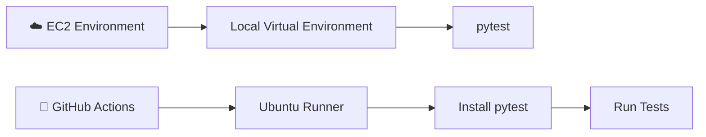

The GitHub-hosted runner needs its own dependencies.

Therefore, we install pytest inside the workflow:

```yaml
- name: Install pytest
  run: python -m pip install pytest
```

Then run:

```yaml
- name: Run tests
  run: python -m pytest test_app.py
```

---

## 🔄 Practical 3 CI Flow

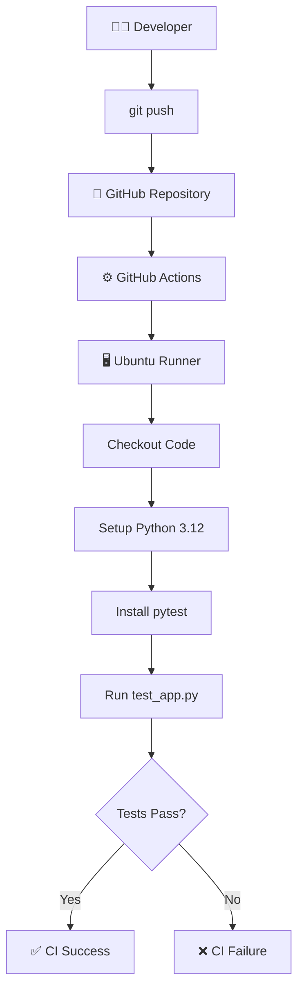

---

## ✅ Practical 3 Result

The test successfully passed:

```text
1 passed
```

We now had our first automated CI testing pipeline.

---

# 🧪 Practical 4 — Matrix Testing

## 🎯 Objective

In Practical 4, we learned how to test the same application against multiple Python versions automatically.

We tested:

```text
Python 3.11
Python 3.12
Python 3.13
```

Instead of creating three separate jobs manually, we used:

```yaml
strategy:
  matrix:
```

---

# ⚙️ Matrix Workflow

```yaml
name: Python Application CI

on:
  push:

jobs:
  build:
    runs-on: ubuntu-latest

    strategy:
      matrix:
        python-version: ["3.11", "3.12", "3.13"]

    steps:
      - name: Checkout code
        uses: actions/checkout@v6

      - name: Set up Python ${{ matrix.python-version }}
        uses: actions/setup-python@v5
        with:
          python-version: ${{ matrix.python-version }}

      - name: Show Python version
        run: python --version

      - name: Install pytest
        run: python -m pip install pytest

      - name: Run tests
        run: python -m pytest test_app.py
```

---

# 🧠 Understanding Matrix Strategy

The important section is:

```yaml
strategy:
  matrix:
    python-version: ["3.11", "3.12", "3.13"]
```

GitHub Actions creates separate job configurations for each value.

Conceptually:

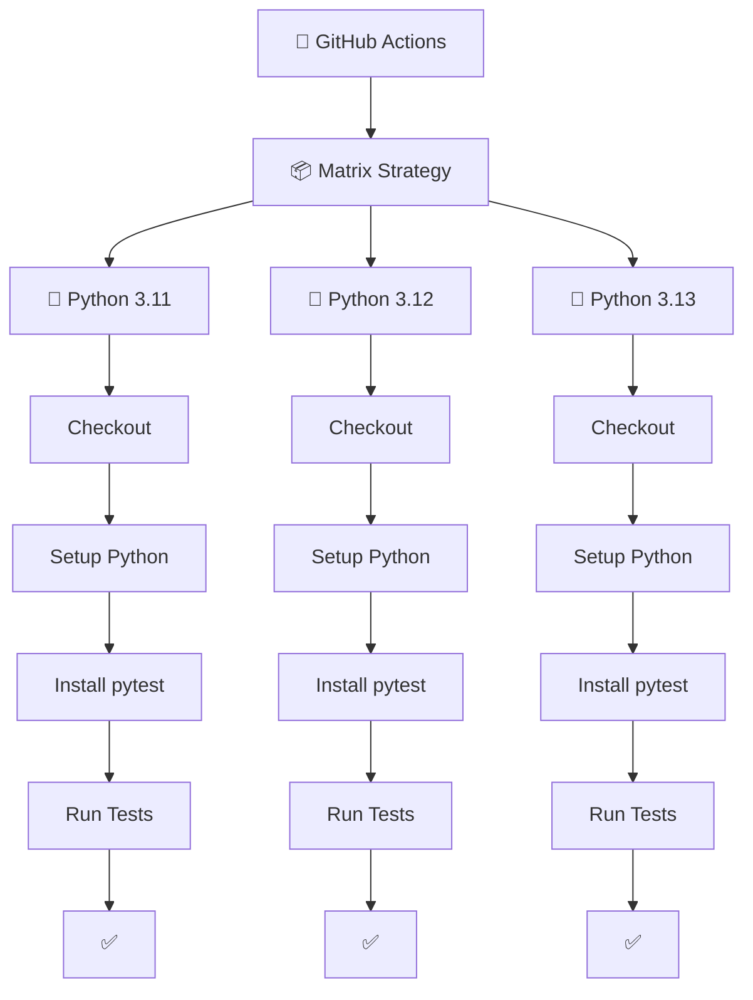

---

# 🔢 Matrix Configurations

Our matrix contains:

```yaml
python-version: ["3.11", "3.12", "3.13"]
```

Therefore GitHub Actions creates:

```text
Configuration 1 → Python 3.11
Configuration 2 → Python 3.12
Configuration 3 → Python 3.13
```

---

# 🧩 `${{ matrix.python-version }}`

We used:

```yaml
python-version: ${{ matrix.python-version }}
```

The expression retrieves the current matrix value.

For example:

```text
Matrix iteration 1
        ↓
matrix.python-version = 3.11
```

Then:

```text
Matrix iteration 2
        ↓
matrix.python-version = 3.12
```

Then:

```text
Matrix iteration 3
        ↓
matrix.python-version = 3.13
```

---

# 🔄 Matrix Testing Architecture

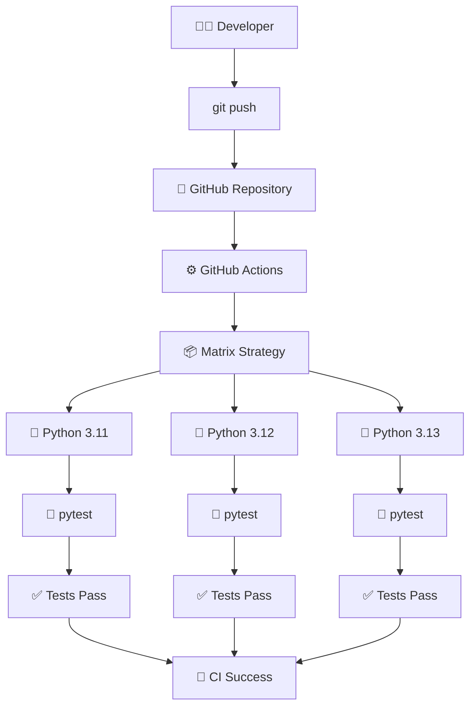

---

# 🧠 Why Matrix Testing?

Without matrix testing, we could manually create:

```text
Job 1 → Python 3.11
Job 2 → Python 3.12
Job 3 → Python 3.13
```

This would result in duplicated YAML.

Instead, we define the versions once:

```yaml
strategy:
  matrix:
    python-version: ["3.11", "3.12", "3.13"]
```

GitHub Actions automatically creates the required configurations.

This is useful when an application needs to support multiple versions of a programming language.

---

# 🔄 Complete Evolution of Practicals 1–4

## Practical 1

We started with a basic workflow:

```text
Git Push
   ↓
GitHub Actions
   ↓
Ubuntu Runner
   ↓
Run Commands
```

---

## Practical 2

We added application preparation:

```text
Git Push
   ↓
GitHub Actions
   ↓
Ubuntu Runner
   ↓
Checkout Code
   ↓
Setup Python
   ↓
Run Application
```

---

## Practical 3

We added automated testing:

```text
Git Push
   ↓
GitHub Actions
   ↓
Ubuntu Runner
   ↓
Checkout Code
   ↓
Setup Python
   ↓
Install pytest
   ↓
Run Tests
```

---

## Practical 4

We added multiple Python versions:

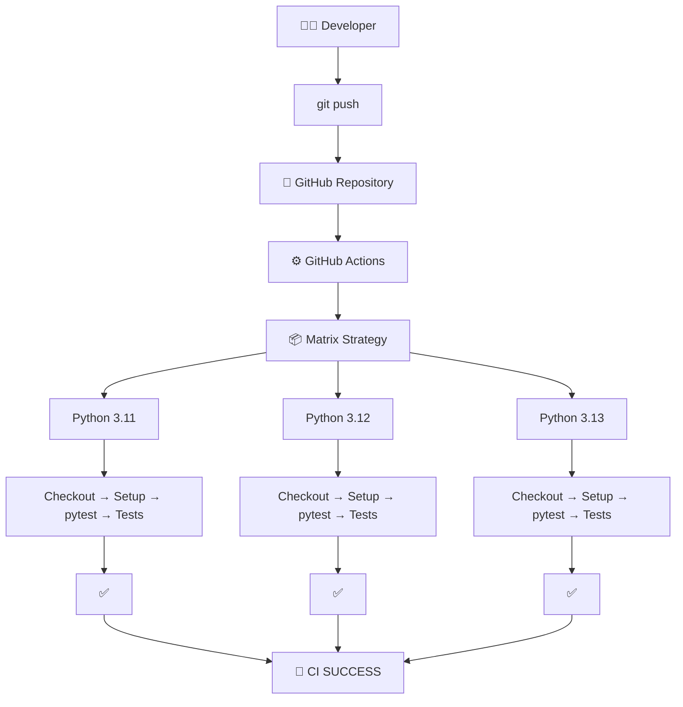

---

# 🧠 Important Concepts Learned

## 1. Workflow

A workflow is a YAML file that defines an automation process.

Location:

```text
.github/workflows/
```

Our workflow:

```text
.github/workflows/first-workflow.yml
```

---

## 2. Event

The `on` section defines when a workflow should execute.

Example:

```yaml
on:
  push:
```

Meaning:

```text
Code Push
   ↓
Workflow Triggered
```

---

## 3. Job

A job is a collection of steps that execute together on a runner.

Example:

```yaml
jobs:
  build:
```

---

## 4. Runner

A runner is the machine where the job executes.

Example:

```yaml
runs-on: ubuntu-latest
```

---

## 5. Steps

Steps are individual tasks inside a job.

Example:

```yaml
- name: Run tests
  run: python -m pytest test_app.py
```

---

## 6. `run`

`run` executes shell commands.

Example:

```yaml
run: python app.py
```

Multiple commands can be written using:

```yaml
run: |
  echo "Building application..."
  python app.py
```

---

## 7. `uses`

`uses` allows us to use an existing GitHub Action.

Example:

```yaml
uses: actions/checkout@v6
```

Another example:

```yaml
uses: actions/setup-python@v5
```

---

## 8. `with`

`with` provides configuration/input values to an action.

Example:

```yaml
with:
  python-version: '3.12'
```

---

## 9. Matrix

Matrix strategy allows the same job to run with different configurations.

Example:

```yaml
strategy:
  matrix:
    python-version: ["3.11", "3.12", "3.13"]
```

---

# 🏗️ GitHub Actions Mental Model

A simple way to remember the architecture:

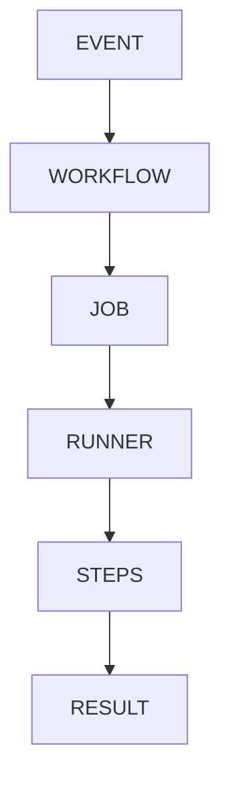

Our practical example:

```text
push
 ↓
Python Application CI
 ↓
build
 ↓
ubuntu-latest
 ↓
checkout
 ↓
setup Python
 ↓
install pytest
 ↓
run tests
 ↓
success
```

---

# 📊 Practicals 1–4 Summary

| Practical | Topic | What We Implemented | Result |
|---|---|---|---|
| 1 | First GitHub Action | Workflow + Job + Runner + Steps | ✅ |
| 2 | Python CI | Checkout + Setup Python + Run Application | ✅ |
| 3 | Automated Testing | pytest installation + test execution | ✅ |
| 4 | Matrix Testing | Python 3.11 + 3.12 + 3.13 | ✅ |

---

# 📈 Learning Progression

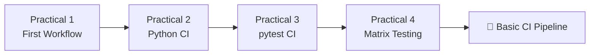

---

# 🎯 Final Understanding

After completing Practicals 1–4, we built a basic but real CI pipeline.

The entire concept can be remembered as:

```text
ONE REPOSITORY
      |
      ↓
ONE WORKFLOW
      |
      ↓
JOB
      |
      ↓
RUNNER
      |
      ↓
STEPS
      |
      ↓
AUTOMATED TESTING
      |
      ↓
MULTIPLE PYTHON VERSIONS
```

Our final pipeline:

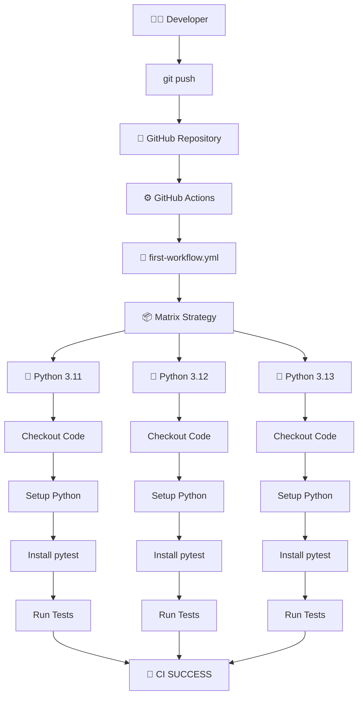

---

# 🏆 What We Achieved

```text
✅ Created our first GitHub Actions workflow

✅ Learned Workflow → Job → Runner → Steps

✅ Learned push trigger

✅ Used actions/checkout

✅ Used actions/setup-python

✅ Configured Python 3.12

✅ Created a Python application

✅ Created automated pytest tests

✅ Created a Python virtual environment

✅ Installed pytest locally

✅ Installed pytest inside GitHub Actions

✅ Ran tests automatically

✅ Learned Matrix Strategy

✅ Tested Python 3.11

✅ Tested Python 3.12

✅ Tested Python 3.13

✅ Built our first multi-version Python CI pipeline
```

---

# 🚀 Final Pipeline

```text
                    👨‍💻 DEVELOPER
                         |
                         | git push
                         ↓
                 🐙 GITHUB REPOSITORY
                         |
                         ↓
                  ⚙️ GITHUB ACTIONS
                         |
                         ↓
                  📄 WORKFLOW YAML
                         |
                         ↓
                   📦 MATRIX
                         |
             ┌───────────┼───────────┐
             ↓           ↓           ↓
        🐍 Python     🐍 Python    🐍 Python
           3.11         3.12         3.13
             ↓           ↓           ↓
         Checkout     Checkout    Checkout
             ↓           ↓           ↓
        Setup Python Setup Python Setup Python
             ↓           ↓           ↓
        Install pytest Install pytest Install pytest
             ↓           ↓           ↓
          Run Tests    Run Tests   Run Tests
             ↓           ↓           ↓
             ✅           ✅           ✅
             └───────────┼───────────┘
                         ↓
                   🎉 CI SUCCESS
```

---

# 📌 Conclusion

Practicals 1–4 established the foundation of GitHub Actions.

We progressed from a simple workflow that executed shell commands to a real Python CI pipeline capable of:

```text
Checkout Code
      ↓
Setup Python
      ↓
Install Dependencies
      ↓
Run Automated Tests
      ↓
Test Multiple Python Versions
      ↓
Report Success/Failure
```

This foundation can now be extended into advanced CI/CD concepts such as:

```text
Multiple Jobs
      ↓
Job Dependencies
      ↓
Secrets
      ↓
Environment Variables
      ↓
GitHub Contexts
      ↓
Artifacts
      ↓
Caching
      ↓
Docker
      ↓
Kubernetes
      ↓
Complete CI/CD Pipeline
```

# 🏁 GitHub Actions Practicals 1–4 — COMPLETED ✅
