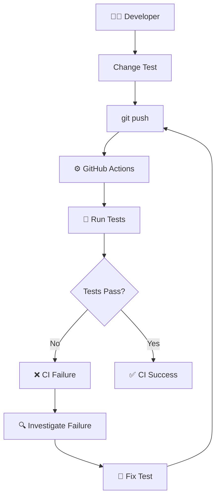
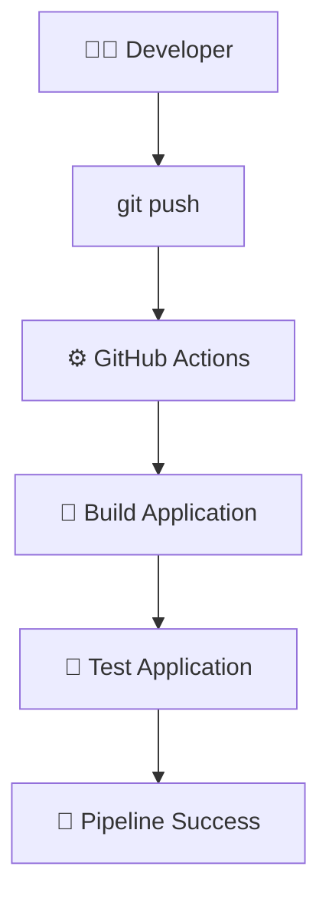
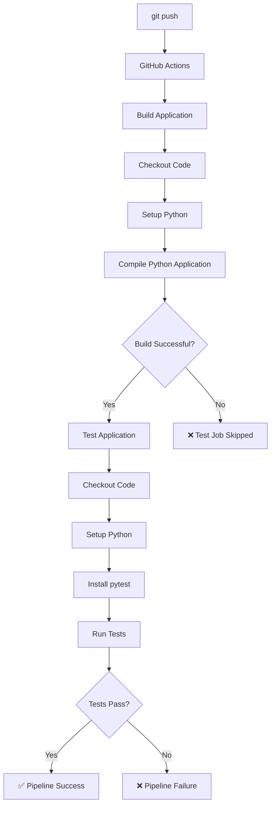
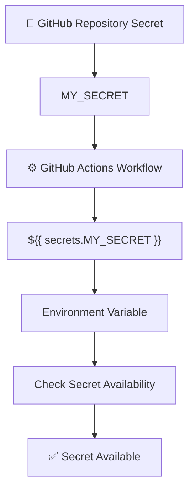
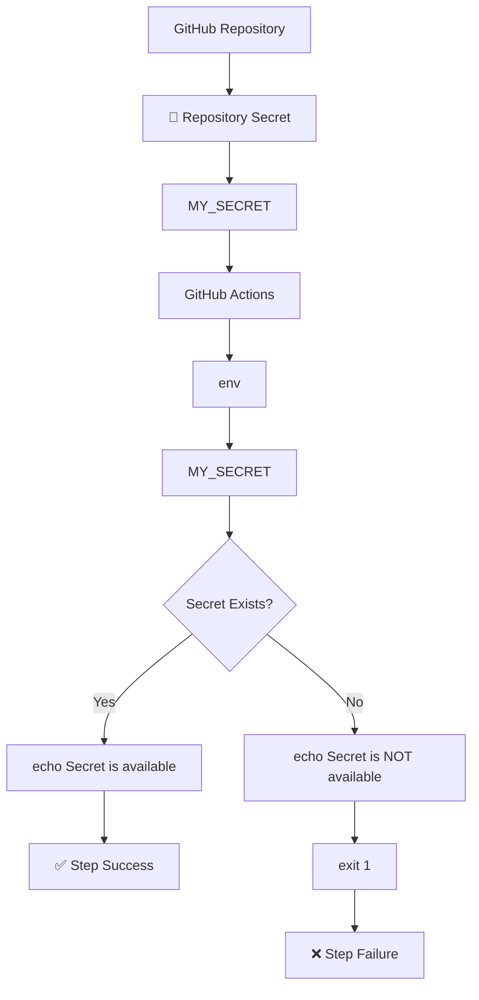
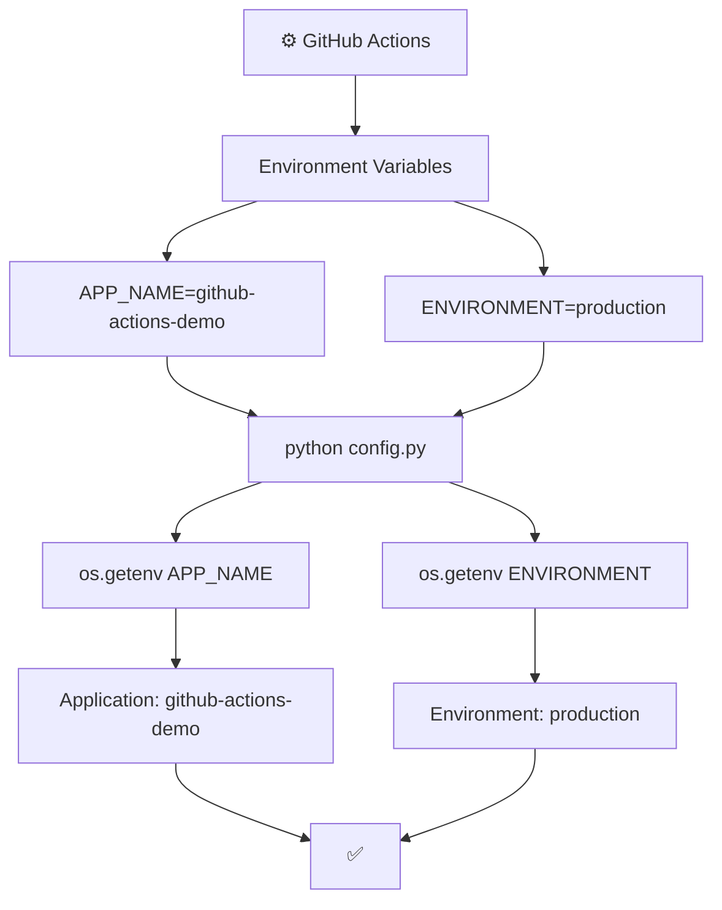
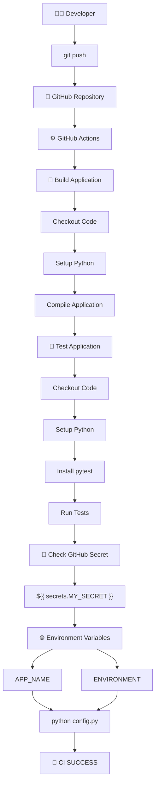
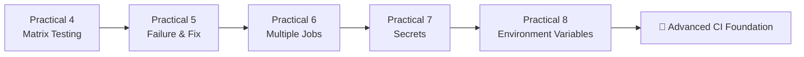
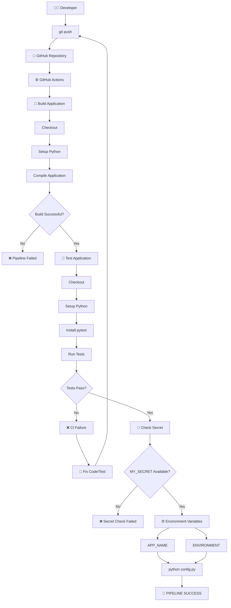

# 🚀 GitHub Actions Practicals 5–8

> Hands-on GitHub Actions CI journey — Practicals 5 to 8  
> Repository: `Yuvii2102/github-actions-practice`

---

# 🎯 Objective

In Practicals 5–8, we extended our basic Python CI pipeline and introduced more realistic GitHub Actions concepts.

We progressed from automated testing into:

```text
Practical 5
    ↓
Failure Handling + CI Feedback

Practical 6
    ↓
Multiple Jobs + Job Dependencies

Practical 7
    ↓
GitHub Actions Secrets

Practical 8
    ↓
Environment Variables
```

By the end of Practical 8, our pipeline had:

```text
Git Push
    ↓
Build Job
    ↓
Test Job
    ↓
Automated Tests
    ↓
GitHub Secret Validation
    ↓
Environment Variables
    ↓
CI Success
```

---

# 🧠 Starting Point

At the end of Practicals 1–4, we already had a Python CI pipeline capable of:

```text
Checkout Code
      ↓
Setup Python
      ↓
Install pytest
      ↓
Run Tests
      ↓
Matrix Testing
```

Practicals 5–8 expanded this foundation.

---

# 🧪 Practical 5 — Intentionally Failing CI Test

## 🎯 Objective

The objective of Practical 5 was to understand what happens when an automated test fails inside GitHub Actions.

Instead of always keeping the test correct, we intentionally introduced an incorrect expected value.

This allowed us to observe the complete CI feedback loop:

```text
Code Change
    ↓
Git Push
    ↓
GitHub Actions
    ↓
Test Failure
    ↓
❌ CI Failed
    ↓
Fix Code
    ↓
Git Push
    ↓
✅ CI Passed
```

---

# 🧪 Step 1 — Introduce a Failing Test

Our original test was:

```python
from app import add

def test_add():
    assert add(10, 20) == 30
```

The function returns:

```text
10 + 20 = 30
```

To intentionally create a failure, we changed the expected result from:

```python
30
```

to:

```python
31
```

The failing test became:

```python
from app import add

def test_add():
    assert add(10, 20) == 31
```

---

# 💻 Step 2 — Run the Test Locally

We ran:

```bash
pytest test_app.py
```

The test failed because:

```text
Actual result   = 30
Expected result = 31
```

The failure was similar to:

```text
assert 30 == 31
E AssertionError
1 failed
```

This demonstrated that pytest correctly detected the incorrect expectation.

---

# 📤 Step 3 — Push the Failing Test

We checked Git status:

```bash
git status
```

Then staged the test:

```bash
git add test_app.py
```

Committed:

```bash
git commit -m "Demonstrate failing CI test"
```

Pushed:

```bash
git push origin main
```

---

# ❌ GitHub Actions Failure

After the push, GitHub Actions automatically started a workflow.

Because the test was incorrect:

```text
10 + 20 = 30
```

but the test expected:

```text
31
```

the workflow failed.

GitHub Actions displayed:

```text
❌ Demonstrate failing CI test
```

---

# 🔧 Step 4 — Fix the Test

We corrected:

```python
assert add(10, 20) == 31
```

back to:

```python
assert add(10, 20) == 30
```

The final test became:

```python
from app import add

def test_add():
    assert add(10, 20) == 30
```

---

# 📤 Step 5 — Commit and Push the Fix

```bash
git add test_app.py
```

```bash
git commit -m "Fix failing test"
```

```bash
git push origin main
```

GitHub Actions automatically triggered again.

This time:

```text
Test
 ↓
Passed
 ↓
✅ CI Success
```

---

# 🔄 Practical 5 CI Feedback Loop



---

# 🧠 What We Learned

Practical 5 demonstrated an important CI principle:

> A CI pipeline should fail when the application or tests are incorrect.

A failed pipeline is not necessarily a bad thing.

It provides feedback to the developer before incorrect code moves further through the delivery process.

The important flow is:

```text
Write Code
    ↓
Push Code
    ↓
CI Tests Code
    ↓
Failure?
 ┌──┴──┐
Yes    No
 ↓      ↓
Fix    Continue
 ↓      ↓
Push   Success
```

---

# 🧪 Practical 5 Result

```text
Initial Test → ❌ Failed
      ↓
Investigated Failure
      ↓
Fixed Test
      ↓
Push Fix
      ↓
Final Test → ✅ Passed
```

---

# 🧪 Practical 6 — Multiple Jobs + `needs`

## 🎯 Objective

In Practical 6, we learned how to divide a workflow into multiple jobs.

Previously, our workflow mainly contained one job.

We changed the architecture to:

```text
Build Job
    ↓
Test Job
```

The Test job was configured to wait for the Build job using:

```yaml
needs: build
```

---

# 🏗️ New Pipeline Architecture



The important relationship is:

```text
Build
  ↓
Test
```

---

# ⚙️ Complete Workflow

The workflow became:

```yaml
name: Python Build and Test

on:
  push:

jobs:

  build:
    name: Build Application
    runs-on: ubuntu-latest

    steps:
      - name: Checkout code
        uses: actions/checkout@v6

      - name: Set up Python
        uses: actions/setup-python@v5
        with:
          python-version: '3.12'

      - name: Show Python version
        run: python --version

      - name: Build application
        run: |
          echo "Building Python application..."
          python -m compileall .
          echo "Build completed successfully"

  test:
    name: Test Application
    runs-on: ubuntu-latest
    needs: build

    steps:
      - name: Checkout code
        uses: actions/checkout@v6

      - name: Set up Python
        uses: actions/setup-python@v5
        with:
          python-version: '3.12'

      - name: Install pytest
        run: python -m pip install pytest

      - name: Run tests
        run: python -m pytest test_app.py
```

---

# 🏗️ Build Job

The Build job contains:

```yaml
build:
  name: Build Application
  runs-on: ubuntu-latest
```

The build step:

```yaml
- name: Build application
  run: |
    echo "Building Python application..."
    python -m compileall .
    echo "Build completed successfully"
```

`python -m compileall .` checks/compiles Python files into bytecode and provides a basic build/validation step.

---

# 🧪 Test Job

The Test job contains:

```yaml
test:
  name: Test Application
  runs-on: ubuntu-latest
  needs: build
```

The important line is:

```yaml
needs: build
```

This means:

```text
Build Application
       ↓
       ↓
must complete successfully
       ↓
Test Application
```

---

# 🧠 Understanding `needs`

Without `needs`, independent jobs can run in parallel.

Example:

```text
Build ──────────→
                  \
                   → Workflow
                  /
Test ───────────→
```

With:

```yaml
needs: build
```

we create a dependency:

```text
Build
  ↓
Test
```

So the Test job waits for the Build job.

---

# 🔄 Practical 6 Execution Flow



---

# 🧠 Important Concept — Jobs vs Steps

This practical also helped us understand the difference between **jobs** and **steps**.

### Job

A job is a major unit of work.

Example:

```text
Build Application
```

Another job:

```text
Test Application
```

### Step

A step is an individual operation inside a job.

Example:

```text
Checkout Code
Setup Python
Install pytest
Run Tests
```

Architecture:

```text
Workflow
   │
   ├── Build Job
   │     ├── Checkout
   │     ├── Setup Python
   │     └── Build
   │
   └── Test Job
         ├── Checkout
         ├── Setup Python
         ├── Install pytest
         └── Run Tests
```

---

# ⚠️ Important Observation

Each job runs on its own runner.

Therefore, the Test job checks out the repository again:

```yaml
- name: Checkout code
  uses: actions/checkout@v6
```

and sets up Python again:

```yaml
- name: Set up Python
  uses: actions/setup-python@v5
```

This is because jobs are separate execution environments.

---

# 🧪 Practical 6 Result

GitHub Actions displayed:

```text
Build Application   🟢
        ↓
Test Application    🟢
```

The workflow successfully demonstrated sequential jobs.

---

# 🧪 Practical 7 — GitHub Actions Secrets

## 🎯 Objective

In Practical 7, we learned how to securely store sensitive information using GitHub Actions Secrets.

Instead of putting sensitive values directly inside workflow YAML, we stored the value in GitHub.

Example:

```text
MY_SECRET
```

---

# 🔐 Why Secrets?

Sensitive information can include:

```text
Passwords
API Keys
Tokens
Cloud Credentials
Database Credentials
Kubeconfig
Registry Credentials
```

These values should not be hard-coded into source code or workflow files.

---

# 🔐 Secret Architecture



---

# ⚙️ Step 1 — Create Repository Secret

We went to:

```text
GitHub Repository
    ↓
Settings
    ↓
Secrets and variables
    ↓
Actions
    ↓
New repository secret
```

We created:

```text
Name:
MY_SECRET
```

For the practical, we used a fake demonstration value rather than a real credential.

---

# 🔐 Important Security Rule

The actual secret value should **never be printed**.

We should NOT do:

```yaml
run: echo "${{ secrets.MY_SECRET }}"
```

because that deliberately attempts to expose the secret.

Instead, we only verify that a value exists.

---

# ⚙️ Secret Usage in Workflow

We added:

```yaml
- name: Check GitHub Secret
  env:
    MY_SECRET: ${{ secrets.MY_SECRET }}
  run: |
    if [ -n "$MY_SECRET" ]; then
      echo "GitHub Secret is available"
    else
      echo "GitHub Secret is NOT available"
      exit 1
    fi
```

---

# 🧩 Understanding the Secret Reference

The important expression is:

```yaml
${{ secrets.MY_SECRET }}
```

This tells GitHub Actions to retrieve the repository secret named:

```text
MY_SECRET
```

We passed it into the step as an environment variable:

```yaml
env:
  MY_SECRET: ${{ secrets.MY_SECRET }}
```

The shell then checks:

```bash
if [ -n "$MY_SECRET" ]
```

This means:

```text
Is MY_SECRET non-empty?
```

---

# 🔄 Secret Validation Flow



---

# ❌ First Secret Attempt

Our first secret workflow attempt failed.

The first failure was caused by incorrect YAML indentation around:

```yaml
- name: Check GitHub Secret
```

YAML indentation is important because indentation defines the structure of the workflow.

We corrected the indentation and pushed the fix.

---

# 🔧 Correct Secret Step

The correct indentation was:

```yaml
      - name: Check GitHub Secret
        env:
          MY_SECRET: ${{ secrets.MY_SECRET }}
        run: |
          if [ -n "$MY_SECRET" ]; then
            echo "GitHub Secret is available"
          else
            echo "GitHub Secret is NOT available"
            exit 1
          fi
```

---

# 🔍 Secret Availability Problem

After fixing the YAML, the workflow reached the secret-check step but the secret was initially unavailable.

The important point was:

```text
YAML structure → ✅ Correct

Build → ✅

Tests → ✅

Secret Check → ❌
```

We then verified the repository secret configuration.

The repository contained:

```text
MY_SECRET
```

as a repository secret.

---

# 🔄 Fresh Workflow Run

After confirming that the repository secret existed, we created a fresh workflow run.

We used an empty commit because there were no working-tree changes:

```bash
git status
```

Output:

```text
On branch main
Your branch is up to date with 'origin/main'.

nothing to commit, working tree clean
```

We then triggered a fresh commit:

```bash
git commit --allow-empty -m "Test GitHub secret"
```

and pushed:

```bash
git push origin main
```

---

# ✅ Secret Practical Success

The fresh workflow run completed successfully:

```text
Build Application    🟢
Test Application     🟢
Check GitHub Secret  🟢
```

The secret value itself was never printed.

This successfully demonstrated secure secret usage.

---

# 🧠 Important Secret Concepts

```text
Secret stored in GitHub
        ↓
Referenced using secrets context
        ↓
Passed to environment variable
        ↓
Used by workflow
        ↓
Never deliberately printed
```

The important expression is:

```yaml
${{ secrets.MY_SECRET }}
```

---

# 🧪 Practical 7 Result

```text
Repository Secret
      ↓
MY_SECRET
      ↓
GitHub Actions
      ↓
Secret Check
      ↓
✅ Secret Available
```

---

# 🧪 Practical 8 — Environment Variables

## 🎯 Objective

In Practical 8, we learned how to define environment variables inside GitHub Actions and make them available to a particular step.

We created a Python application that reads environment variables using Python's `os.getenv()`.

---

# 🐍 Step 1 — Create `config.py`

We created:

```text
config.py
```

Content:

```python
import os

app_name = os.getenv("APP_NAME")
environment = os.getenv("ENVIRONMENT")

print(f"Application: {app_name}")
print(f"Environment: {environment}")
```

---

# 🧠 Understanding `os.getenv()`

The application reads:

```python
os.getenv("APP_NAME")
```

and:

```python
os.getenv("ENVIRONMENT")
```

These values come from environment variables.

The application itself does not hard-code the values.

---

# 💻 Local Environment Variable Test

We tested environment variables locally using:

```bash
export APP_NAME="github-actions-demo"
```

and:

```bash
export ENVIRONMENT="development"
```

Then:

```bash
python config.py
```

Expected output:

```text
Application: github-actions-demo
Environment: development
```

---

# ⚙️ Step 2 — GitHub Actions Environment Variables

We added the following step to the workflow:

```yaml
- name: Run application with environment variables
  env:
    APP_NAME: github-actions-demo
    ENVIRONMENT: production
  run: python config.py
```

This creates environment variables for that step:

```text
APP_NAME=github-actions-demo
ENVIRONMENT=production
```

Then:

```text
python config.py
```

reads those values.

---

# 🔄 Environment Variable Flow



---

# ⚙️ Complete Workflow After Practical 8

The workflow at this stage was:

```yaml
name: Python Build and Test

on:
  push:

jobs:

  build:
    name: Build Application
    runs-on: ubuntu-latest

    steps:
      - name: Checkout code
        uses: actions/checkout@v6

      - name: Set up Python
        uses: actions/setup-python@v5
        with:
          python-version: '3.12'

      - name: Show Python version
        run: python --version

      - name: Build application
        run: |
          echo "Building Python application..."
          python -m compileall .
          echo "Build completed successfully"

  test:
    name: Test Application
    runs-on: ubuntu-latest
    needs: build

    steps:
      - name: Checkout code
        uses: actions/checkout@v6

      - name: Set up Python
        uses: actions/setup-python@v5
        with:
          python-version: '3.12'

      - name: Install pytest
        run: python -m pip install pytest

      - name: Run tests
        run: python -m pytest test_app.py

      - name: Check GitHub Secret
        env:
          MY_SECRET: ${{ secrets.MY_SECRET }}
        run: |
          if [ -n "$MY_SECRET" ]; then
            echo "GitHub Secret is available"
          else
            echo "GitHub Secret is NOT available"
            exit 1
          fi

      - name: Run application with environment variables
        env:
          APP_NAME: github-actions-demo
          ENVIRONMENT: production
        run: python config.py
```

---

# 🧠 Environment Variables vs Secrets

One of the important concepts learned in Practical 7 and Practical 8 is the difference between secrets and normal environment variables.

```text
                    CONFIGURATION
                         |
             ┌───────────┴───────────┐
             ↓                       ↓
         🔐 SECRET             🌐 ENVIRONMENT
             |                       |
      Sensitive Data          Normal Configuration
             |                       |
      ${{ secrets.X }}          env:
                                APP_NAME: ...
```

### Secret

Example:

```yaml
env:
  MY_SECRET: ${{ secrets.MY_SECRET }}
```

Used for sensitive information.

### Environment Variable

Example:

```yaml
env:
  APP_NAME: github-actions-demo
  ENVIRONMENT: production
```

Used for normal configuration.

---

# 🧠 Scope of Environment Variables

In Practical 8, the variables were defined inside a particular step:

```yaml
- name: Run application with environment variables
  env:
    APP_NAME: github-actions-demo
    ENVIRONMENT: production
```

Therefore, they are available to that step.

Conceptually:

```text
Workflow
   |
   └── Test Job
         |
         ├── Run Tests
         |
         └── Run Application
               |
               ├── APP_NAME
               └── ENVIRONMENT
```

---

# 🔄 Complete Practicals 5–8 Architecture



---

# 📈 Evolution from Practical 4 to Practical 8

At Practical 4, we had:

```text
Matrix Testing
      ↓
Multiple Python Versions
```

Then Practical 5 introduced:

```text
Failure
   ↓
Fix
   ↓
Success
```

Practical 6 introduced:

```text
Build Job
   ↓
Test Job
```

Practical 7 introduced:

```text
GitHub Secrets
```

Practical 8 introduced:

```text
Environment Variables
```

---

# 🔄 Complete Learning Progression



---

# 🧠 Complete GitHub Actions Mental Model

After Practicals 5–8, our mental model became:

```text
                         GITHUB ACTIONS
                               |
                               ↓
                          WORKFLOW
                               |
                    ┌──────────┴──────────┐
                    ↓                     ↓
                 BUILD JOB             TEST JOB
                    |                     |
                    ↓                     ↓
                 RUNNER                RUNNER
                    |                     |
                    ↓                     ↓
                  STEPS                  STEPS
                                          |
                              ┌───────────┼───────────┐
                              ↓           ↓           ↓
                           pytest      Secret       Environment
                                        Check        Variables
                              |           |             |
                              └───────────┴─────────────┘
                                          |
                                          ↓
                                     ✅ SUCCESS
```

---

# 🧠 Key Concepts Learned in Practicals 5–8

## 1. CI Failure Is Useful

A failed test causes the CI pipeline to fail.

This helps detect problems early.

```text
Code
 ↓
Test
 ↓
Failure
 ↓
Fix
 ↓
Test Again
 ↓
Success
```

---

## 2. Multiple Jobs

A workflow can contain multiple jobs.

Example:

```text
Build Job
    ↓
Test Job
```

---

## 3. Job Dependencies

The `needs` keyword creates a dependency.

Example:

```yaml
needs: build
```

Meaning:

```text
Build must succeed
       ↓
Test can start
```

---

## 4. Secrets

Sensitive information should be stored as GitHub Secrets.

Example:

```yaml
${{ secrets.MY_SECRET }}
```

Secrets should not be deliberately printed.

---

## 5. Environment Variables

Normal configuration can be passed using:

```yaml
env:
  APP_NAME: github-actions-demo
  ENVIRONMENT: production
```

---

## 6. Environment Variables in Python

Python can access environment variables using:

```python
import os

os.getenv("APP_NAME")
```

---

## 7. YAML Indentation

GitHub Actions workflows use YAML, so indentation is critical.

Incorrect indentation can cause the workflow to fail before the actual job starts.

Example:

```yaml
steps:
  - name: Example
    run: echo "Hello"
```

The hierarchy must be maintained correctly.

---

# 📊 Practicals 5–8 Summary

| Practical | Topic | Main Concept | Result |
|---|---|---|---|
| 5 | Failing CI Test | Failure detection + fixing failed tests | ✅ |
| 6 | Multiple Jobs | Build + Test + `needs` | ✅ |
| 7 | GitHub Secrets | Secure secret storage and usage | ✅ |
| 8 | Environment Variables | Passing configuration to application | ✅ |

---

# 🏗️ Practical 5–8 Final Architecture



---

# 🏆 What We Achieved

```text
✅ Intentionally created a failing CI test

✅ Observed GitHub Actions failure

✅ Fixed the failed test

✅ Re-ran CI successfully

✅ Learned that CI failures provide useful feedback

✅ Created separate Build and Test jobs

✅ Learned the difference between Jobs and Steps

✅ Used needs: build for job dependency

✅ Understood that jobs run on separate runners

✅ Created a GitHub repository secret

✅ Used ${{ secrets.MY_SECRET }}

✅ Passed the secret through an environment variable

✅ Verified secret availability without printing its value

✅ Diagnosed and fixed YAML indentation

✅ Created config.py

✅ Used Python os.getenv()

✅ Created GitHub Actions environment variables

✅ Passed APP_NAME to the application

✅ Passed ENVIRONMENT to the application

✅ Verified environment variables inside GitHub Actions

✅ Built a more realistic CI pipeline
```

---

# 🎯 Final Understanding

Practicals 5–8 transformed our basic GitHub Actions workflow into a more realistic CI pipeline.

The progression can be remembered as:

```text
                 PRACTICALS 1–4
                       |
                       ↓
                BASIC PYTHON CI
                       |
                       ↓
              ┌────────────────┐
              │                │
              ↓                ↓
        PRACTICAL 5       PRACTICAL 6
        Failure/Fix       Multiple Jobs
              │                │
              └───────┬────────┘
                      ↓
                PRACTICAL 7
                   Secrets
                      ↓
                PRACTICAL 8
            Environment Variables
                      ↓
             🚀 ADVANCED CI
```

---

# 🚀 Final Pipeline After Practical 8

```text
                         👨‍💻 DEVELOPER
                              |
                              | git push
                              ↓
                     🐙 GITHUB REPOSITORY
                              |
                              ↓
                       ⚙️ GITHUB ACTIONS
                              |
                              ↓
                     💼 BUILD APPLICATION
                              |
                ┌─────────────┼─────────────┐
                ↓             ↓             ↓
             Checkout     Setup Python    Compile
                |             |             |
                └─────────────┴─────────────┘
                              |
                              ↓
                         BUILD SUCCESS
                              |
                              ↓
                      💼 TEST APPLICATION
                              |
                ┌─────────────┼─────────────┐
                ↓             ↓             ↓
             Checkout     Setup Python    pytest
                |             |             |
                └─────────────┴─────────────┘
                              |
                              ↓
                         RUN TESTS
                              |
                              ↓
                      🔐 SECRET CHECK
                              |
                              ↓
                       MY_SECRET
                              |
                              ↓
                    🌐 ENVIRONMENT VARS
                         /          \
                        /            \
                       ↓              ↓
                  APP_NAME       ENVIRONMENT
                       \              /
                        \            /
                         ↓          ↓
                       config.py
                           |
                           ↓
                     🎉 CI SUCCESS
```

---

# 📌 Final Conclusion

Practicals 5–8 built on the foundation from Practicals 1–4 and introduced important real-world CI concepts.

We learned how to:

```text
Detect failures
     ↓
Fix failures
     ↓
Separate Build and Test jobs
     ↓
Control job execution with needs
     ↓
Secure sensitive information with Secrets
     ↓
Pass normal configuration using Environment Variables
     ↓
Use configuration inside a Python application
```

The complete learning journey is now:

```text
Practical 1
First Workflow
      ↓
Practical 2
Checkout + Python Setup
      ↓
Practical 3
pytest CI
      ↓
Practical 4
Matrix Testing
      ↓
Practical 5
Failure + Fix
      ↓
Practical 6
Multiple Jobs + needs
      ↓
Practical 7
GitHub Secrets
      ↓
Practical 8
Environment Variables
      ↓
🚀 STRONG GITHUB ACTIONS CI FOUNDATION
```

# 🏁 GitHub Actions Practicals 5–8 — COMPLETED ✅
