# End-to-End CI/CD + GitOps Project — Django Todo Application

> A complete practical guide from the first step to the final deployment.
>
> This README is written so that even after one month, I can come back to this project, understand what every tool does, understand why we used it, reproduce the project, troubleshoot it, and explain it confidently in an interview.

---

# Table of Contents

1. [Project Overview](#project-overview)
2. [What Problem Are We Solving](#what-problem-are-we-solving)
3. [What We Built](#what-we-built)
4. [Final Architecture](#final-architecture)
5. [Technology Stack](#technology-stack)
6. [Project Repository](#project-repository)
7. [Project Structure](#project-structure)
8. [Understanding the Django Application](#understanding-the-django-application)
9. [Application Change We Made](#application-change-we-made)
10. [Git and GitHub](#git-and-github)
11. [Docker](#docker)
12. [Dockerfile](#dockerfile)
13. [Django Testing](#django-testing)
14. [SonarQube](#sonarqube)
15. [Jenkins](#jenkins)
16. [Jenkins Credentials](#jenkins-credentials)
17. [GitHub SSH Authentication with Jenkins](#github-ssh-authentication-with-jenkins)
18. [Jenkins Pipeline](#jenkins-pipeline)
19. [Complete Jenkinsfile](#complete-jenkinsfile)
20. [Jenkins Pipeline Stage Explanation](#jenkins-pipeline-stage-explanation)
21. [Docker Image Versioning](#docker-image-versioning)
22. [Docker Hub](#docker-hub)
23. [Kubernetes](#kubernetes)
24. [Kubernetes Deployment](#kubernetes-deployment)
25. [Kubernetes Service](#kubernetes-service)
26. [Deployment, Pods and Service Relationship](#deployment-pods-and-service-relationship)
27. [Minikube](#minikube)
28. [Argo CD](#argo-cd)
29. [GitOps](#gitops)
30. [Jenkins vs Argo CD](#jenkins-vs-argo-cd)
31. [Complete CI/CD Flow](#complete-cicd-flow)
32. [Build #10](#build-10)
33. [Build #11](#build-11)
34. [Real Problems We Faced](#real-problems-we-faced)
35. [Troubleshooting Guide](#troubleshooting-guide)
36. [Important Commands](#important-commands)
37. [How to Verify the Project](#how-to-verify-the-project)
38. [Important Concepts to Remember](#important-concepts-to-remember)
39. [Project in Four Layers](#project-in-four-layers)
40. [Interview Explanation](#interview-explanation)
41. [Common Interview Questions](#common-interview-questions)
42. [Final Project Status](#final-project-status)
43. [One-Minute Mental Model](#one-minute-mental-model)
44. [Final Takeaway](#final-takeaway)

---

# Project Overview

This project is an end-to-end **CI/CD + GitOps project** built around a Django Todo application.

The main purpose was to understand how multiple DevOps tools work together instead of learning them independently.

The project connects:

- Git
- GitHub
- Jenkins
- Docker
- Docker Hub
- SonarQube
- Kubernetes
- Minikube
- Argo CD

The final flow is:

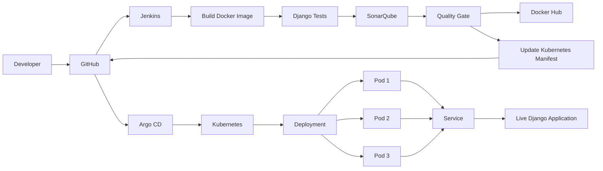

The most important thing to understand is that **the entire project is one continuous journey from source code to a running application**.

---

# What Problem Are We Solving

Imagine I am a developer.

I have a Django Todo application.

I make a change in the application.

For example:

```text
Todo List - Abhishek
```

is changed to:

```text
Todo List - Yuvraj
```

Now I want that change to automatically reach my running application.

Without CI/CD, I could manually do:

```text
Write code
    ↓
Test code
    ↓
Build Docker image
    ↓
Push Docker image
    ↓
Change Kubernetes YAML
    ↓
Deploy to Kubernetes
    ↓
Check application
```

Doing all of this manually every time is inefficient.

Therefore, we created an automated pipeline.

The goal is:

```text
Developer
    ↓
GitHub
    ↓
Jenkins
    ↓
Build
    ↓
Test
    ↓
Code Quality
    ↓
Docker Image
    ↓
GitOps
    ↓
Kubernetes
    ↓
Live Application
```

---

# What We Built

We built a complete pipeline where:

1. Developer changes application code.
2. Code is pushed to GitHub.
3. Jenkins checks out the code.
4. Jenkins builds a Docker image.
5. Jenkins runs Django tests.
6. Jenkins performs SonarQube analysis.
7. Jenkins waits for the SonarQube Quality Gate.
8. If everything passes, Jenkins pushes the Docker image to Docker Hub.
9. Jenkins updates the Kubernetes image tag in `deploy/deploy.yaml`.
10. Jenkins pushes the updated manifest to GitHub.
11. Argo CD detects the Git change.
12. Argo CD synchronizes Kubernetes.
13. Kubernetes deploys the new image.
14. Kubernetes runs three application replicas.
15. A Kubernetes Service exposes the application.
16. We access the final Django application.

The final application showed:

```text
Todo List - Yuvraj
```

This final screen was our proof that the complete flow worked.

---

# Final Architecture

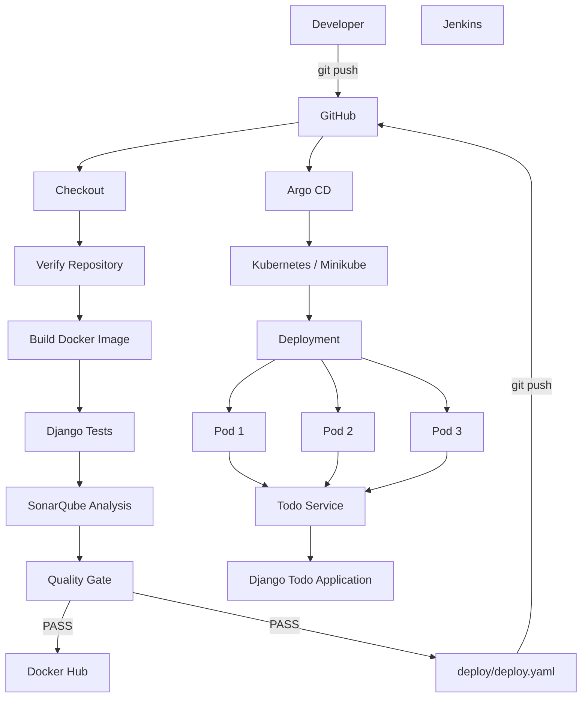

---

# The One Picture to Remember

If I forget everything else, remember this:

```mermaid
flowchart LR
    A[Developer] --> B[GitHub]
    B --> C[Jenkins]
    C --> D[Build]
    D --> E[Test]
    E --> F[SonarQube]
    F --> G[Quality Gate]
    G --> H[Docker Hub]
    H --> I[Git Manifest]
    I --> J[GitHub]
    J --> K[Argo CD]
    K --> L[Kubernetes]
    L --> M[3 Pods]
    M --> N[Service]
    N --> O[Application]
```

In one sentence:

> **GitHub stores the code, Jenkins validates and packages it, Docker Hub stores the image, Jenkins updates the Kubernetes configuration in GitHub, Argo CD deploys that Git state, and Kubernetes runs the application.**

---

# Technology Stack

| Technology | Purpose |
|---|---|
| Python | Application programming language |
| Django | Web application framework |
| Git | Version control |
| GitHub | Source code and Kubernetes configuration |
| Jenkins | Continuous Integration and automation |
| Docker | Application containerization |
| Docker Hub | Docker image registry |
| SonarQube | Static code analysis |
| Kubernetes | Container orchestration |
| Minikube | Local Kubernetes cluster |
| Argo CD | GitOps Continuous Delivery |

---

# Project Repository

GitHub repository:

```text
Yuvii2102/cicd-end-to-end
```

The repository contains both application code and deployment configuration.

The remote was configured using:

```bash
git remote set-url origin git@github.com:Yuvii2102/cicd-end-to-end.git
```

Check the remote:

```bash
git remote -v
```

---

# Project Structure

The main project structure is:

```text
cicd-end-to-end/
│
├── Dockerfile
├── Jenkinsfile
├── README.md
├── docker-compose.yml
├── db.sqlite3
├── manage.py
├── sonar-project.properties
│
├── staticfiles/
│
├── todoApp/
│
├── todos/
│   ├── models.py
│   ├── views.py
│   ├── urls.py
│   └── templates/
│       └── todos/
│           └── index.html
│
└── deploy/
    ├── deploy.yaml
    ├── service.yaml
    └── pod.yaml
```

Important files:

| File | Purpose |
|---|---|
| `manage.py` | Django management commands |
| `Dockerfile` | Builds the Docker image |
| `Jenkinsfile` | Defines the Jenkins pipeline |
| `sonar-project.properties` | SonarQube configuration |
| `deploy/deploy.yaml` | Kubernetes Deployment |
| `deploy/service.yaml` | Kubernetes Service |
| `deploy/pod.yaml` | Pod configuration |
| `todos/` | Todo application code |
| `README.md` | Project documentation |

---

# Understanding the Django Application

The application is a Django Todo application.

The basic structure is:

```text
Django
   ↓
todoApp
   ↓
todos
   ↓
Models
Views
URLs
Templates
   ↓
Todo Application
```

The application runs using Django's development server.

The application listens on:

```text
8000
```

---

# Application Change We Made

One of the important application changes was changing the title.

Original:

```text
Todo List - Abhishek
```

Changed to:

```text
Todo List - Yuvraj
```

The file changed was:

```text
todos/templates/todos/index.html
```

This was useful because it gave us a simple visual way to verify that the new application version had actually reached the final deployment.

At the end of the project, the browser displayed:

```text
Todo List - Yuvraj
```

---

# Git and GitHub

Git is used for version control.

GitHub is used to store the repository remotely.

The basic workflow is:

```text
Make Code Change
      ↓
git add
      ↓
git commit
      ↓
git push
      ↓
GitHub
```

Example:

```bash
git add .
git commit -m "Change Todo app name to Yuvraj"
git push origin main
```

Git allows us to track changes and GitHub provides the central repository.

---

# GitHub SSH Authentication

SSH authentication was tested using:

```bash
ssh -T git@github.com
```

The successful response was:

```text
Hi Yuvii2102! You've successfully authenticated, but GitHub does not provide shell access.
```

This is normal.

It means:

- GitHub recognized the SSH key.
- Authentication succeeded.
- GitHub does not provide an interactive shell.

---

# Important GitHub Concept

GitHub is doing two jobs in this project.

It stores:

```text
Application Source Code
```

and:

```text
Kubernetes Deployment Configuration
```

Therefore:

```text
GitHub
├── Application Code
├── Dockerfile
├── Jenkinsfile
├── SonarQube Configuration
└── Kubernetes YAML
```

This becomes extremely important for GitOps.

---

# Docker

Docker is used to package the Django application into a container image.

Think of Docker as a box containing:

```text
Python
Django
Application Code
Application Environment
```

Conceptually:

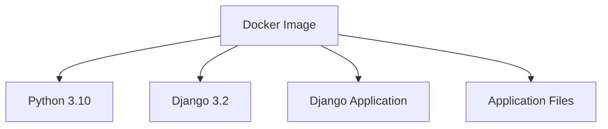

Instead of depending on the environment of the machine, we package the application into an image.

---

# Why Do We Need Docker?

Kubernetes needs a container image to run.

Therefore:

```text
Django Source Code
        ↓
Docker
        ↓
Docker Image
        ↓
Kubernetes
        ↓
Running Container
```

Docker solves the packaging problem.

Kubernetes solves the orchestration problem.

---

# Dockerfile

Our final Dockerfile is:

```dockerfile
FROM python:3.10

RUN pip install django==3.2

COPY . .

RUN python manage.py migrate

EXPOSE 8000

CMD ["python","manage.py","runserver","0.0.0.0:8000"]
```

---

# Dockerfile Explanation

## `FROM`

```dockerfile
FROM python:3.10
```

This gives the image Python 3.10.

We changed from:

```dockerfile
FROM python:3
```

to:

```dockerfile
FROM python:3.10
```

The reason was to use a specific Python version consistently.

---

## `RUN pip install`

```dockerfile
RUN pip install django==3.2
```

This installs Django 3.2 inside the image.

---

## `COPY`

```dockerfile
COPY . .
```

This copies the project files into the image.

---

## Django Migration

```dockerfile
RUN python manage.py migrate
```

This runs Django database migrations during image creation.

---

## `EXPOSE`

```dockerfile
EXPOSE 8000
```

This documents the application port.

Django runs on port 8000.

---

## `CMD`

```dockerfile
CMD ["python","manage.py","runserver","0.0.0.0:8000"]
```

This starts Django.

The important part is:

```text
0.0.0.0
```

It allows Django to listen on all interfaces inside the container.

---

# Django Testing

We added a Django test for Todo creation.

The test was:

```python
from django.test import TestCase
from .models import Todo


class TodoModelTest(TestCase):

    def test_todo_creation(self):
        todo = Todo.objects.create(
            title="Learn CI/CD"
        )

        self.assertEqual(todo.title, "Learn CI/CD")
```

The test checks:

```text
Create Todo
    ↓
Set title
    ↓
Save Todo
    ↓
Read title
    ↓
Compare expected value
    ↓
PASS
```

The commit created for this change was:

```text
e54c143 Add Django model test
```

---

# Why Did We Add a Test?

Because CI should validate the application before publishing it.

The pipeline should not blindly push every build.

The idea is:

```text
Build
  ↓
Test
  ↓
PASS → Continue
FAIL → Stop
```

If the test fails:

```text
Docker Build
    ↓
Django Test ❌
    ↓
Pipeline STOP
```

This prevents broken code from continuing through the pipeline.

---

# SonarQube

SonarQube is used for static code analysis.

Django tests answer:

> Does the application behave correctly according to our tests?

SonarQube answers:

> What is the quality of the source code?

The flow is:

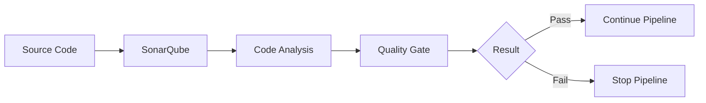

---

# SonarQube Configuration

The project contains:

```text
sonar-project.properties
```

Configuration:

```properties
sonar.projectKey=todo-app
sonar.projectName=todo-app
sonar.sources=todoApp,todos
sonar.python.version=3.10
sonar.exclusions=**/migrations/**,**/staticfiles/**,**/*.pyc
```

---

# SonarQube Configuration Explanation

## Project Key

```properties
sonar.projectKey=todo-app
```

Identifies the SonarQube project.

## Project Name

```properties
sonar.projectName=todo-app
```

Name displayed in SonarQube.

## Sources

```properties
sonar.sources=todoApp,todos
```

These are the application source directories.

## Python Version

```properties
sonar.python.version=3.10
```

Specifies Python 3.10.

## Exclusions

```properties
sonar.exclusions=**/migrations/**,**/staticfiles/**,**/*.pyc
```

These files and directories are excluded from analysis.

---

# SonarQube Docker Setup

SonarQube was running using Docker.

Containers:

```text
sonarqube
sonarqube-db
```

Database:

```text
postgres:15
```

SonarQube:

```text
sonarqube:community
```

After a reboot, the containers could be started using:

```bash
docker start sonarqube-db
docker start sonarqube
```

---

# SonarQube URL

SonarQube was available at:

```text
http://100.48.56.207:9000
```

We verified connectivity using curl and received HTTP 200.

---

# Jenkins

Jenkins is the main CI automation tool in this project.

Jenkins version:

```text
2.568.3
```

Jenkins job:

```text
todo-app-ci
```

Jenkins performs:

```text
Checkout
   ↓
Verify Repository
   ↓
Build Docker Image
   ↓
Run Django Tests
   ↓
SonarQube Analysis
   ↓
Quality Gate
   ↓
Push Docker Image
   ↓
Update Kubernetes Manifest
   ↓
Push Manifest to GitHub
```

---

# Jenkins as an Automation Worker

Think of Jenkins as an automated worker.

Without Jenkins:

```text
Developer
   ↓
Manually build
   ↓
Manually test
   ↓
Manually push
   ↓
Manually update deployment
```

With Jenkins:

```text
Developer
   ↓
GitHub
   ↓
Jenkins
   ↓
Automated Pipeline
```

---

# Jenkins Docker Access

Jenkins needs permission to run Docker commands.

Docker version:

```text
Docker version 29.1.3
```

The Docker group included:

```text
ubuntu
jenkins
```

This allowed Jenkins to execute Docker commands such as:

```bash
docker build
docker run
docker tag
docker login
docker push
```

---

# Jenkins Credentials

Three important Jenkins credentials were configured.

## 1. GitHub SSH

Credential ID:

```text
github-ssh
```

Type:

```text
SSH Username with private key
```

Username:

```text
git
```

Description:

```text
GitHub SSH access for Jenkins
```

---

## 2. SonarQube

Credential ID:

```text
sonarqube-token
```

Used to authenticate Jenkins with SonarQube.

---

## 3. Docker Hub

Credential ID:

```text
dockerhub-credentials
```

Used by Jenkins to authenticate with Docker Hub.

---

# Why Use Jenkins Credentials?

We should never hardcode secrets in the Jenkinsfile.

Bad:

```text
docker login -u username -p password
```

Better:

```text
Jenkins Credentials
        ↓
withCredentials
        ↓
Temporary Environment Variables
        ↓
Command
```

Secrets stay managed by Jenkins.

---

# GitHub SSH Authentication with Jenkins

The Ubuntu user and Jenkins user are separate operating-system users.

Therefore Jenkins cannot simply depend on the Ubuntu user's SSH key.

Instead Jenkins uses:

```text
github-ssh
```

The private key is temporarily exposed to the pipeline through:

```text
SSH_KEY
```

Then Git uses:

```bash
GIT_SSH_COMMAND="ssh -i $SSH_KEY -o StrictHostKeyChecking=no"
```

This allows Jenkins to push changes to GitHub.

---

# Jenkins + SonarQube Configuration

Jenkins was configured with:

```text
Name:
SonarQube
```

URL:

```text
http://localhost:9000
```

SonarQube scanner:

```text
SonarQubeScanner
```

Scanner version:

```text
SonarQube Scanner 8.1.0.6389
```

Credential:

```text
sonarqube-token
```

---

# Jenkins Pipeline

The final Jenkins pipeline contains eight major stages:

```text
1. Checkout
2. Verify Repository
3. Build Docker Image
4. Run Django Tests
5. SonarQube Analysis
6. Quality Gate
7. Push Docker Image
8. Update Kubernetes Manifest
```

The pipeline is the heart of the CI process.

---

# Complete Jenkinsfile

```groovy
pipeline {
    agent any

    stages {

        stage('Checkout') {
            steps {
                echo 'Checking out source code...'

                checkout scm
            }
        }

        stage('Verify Repository') {
            steps {
                sh '''
                    echo "Repository contents:"
                    ls -la

                    echo ""
                    echo "Git commit:"
                    git log -1 --oneline
                '''
            }
        }

        stage('Build Docker Image') {
            steps {
                sh '''
                    echo "Building Docker image..."

                    docker build -t todo-app:${BUILD_NUMBER} .

                    echo "Tagging image for Docker Hub..."

                    docker tag todo-app:${BUILD_NUMBER} yuvi2102/todo-app:${BUILD_NUMBER}
                '''
            }
        }

        stage('Run Django Tests') {
            steps {
                sh '''
                    echo "Running Django tests..."

                    docker run --rm todo-app:${BUILD_NUMBER} python manage.py test
                '''
            }
        }

        stage('SonarQube Analysis') {
            steps {
                script {
                    def scannerHome = tool 'SonarQubeScanner'

                    withSonarQubeEnv('SonarQube') {
                        sh "${scannerHome}/bin/sonar-scanner"
                    }
                }
            }
        }

        stage('Quality Gate') {
            steps {
                timeout(time: 5, unit: 'MINUTES') {
                    waitForQualityGate abortPipeline: true
                }
            }
        }

        stage('Push Docker Image') {
            steps {
                withCredentials([usernamePassword(
                    credentialsId: 'dockerhub-credentials',
                    usernameVariable: 'DOCKER_USERNAME',
                    passwordVariable: 'DOCKER_PASSWORD'
                )]) {
                    sh '''
                        echo "Logging in to Docker Hub..."

                        echo "$DOCKER_PASSWORD" | docker login \
                            -u "$DOCKER_USERNAME" \
                            --password-stdin

                        echo "Pushing Docker image..."

                        docker push yuvi2102/todo-app:${BUILD_NUMBER}

                        echo "Docker image pushed successfully!"
                    '''
                }
            }
        }

        stage('Update Kubernetes Manifest') {
            steps {
                withCredentials([sshUserPrivateKey(
                    credentialsId: 'github-ssh',
                    keyFileVariable: 'SSH_KEY',
                    usernameVariable: 'GIT_USERNAME'
                )]) {
                    sh '''
                        echo "Updating Kubernetes image tag..."

                        sed -i "s|image: yuvi2102/todo-app:.*|image: yuvi2102/todo-app:${BUILD_NUMBER}|" deploy/deploy.yaml

                        echo ""
                        echo "Updated Kubernetes image:"
                        grep "image:" deploy/deploy.yaml

                        echo ""
                        echo "Configuring Git..."

                        git config user.name "Jenkins"
                        git config user.email "jenkins@localhost"

                        echo ""
                        echo "Committing Kubernetes manifest..."

                        git add deploy/deploy.yaml

                        git commit -m "Update Kubernetes image to ${BUILD_NUMBER}" || true

                        echo ""
                        echo "Pushing updated manifest to GitHub..."

                        GIT_SSH_COMMAND="ssh -i $SSH_KEY -o StrictHostKeyChecking=no" git push origin HEAD:main

                        echo ""
                        echo "Kubernetes manifest pushed successfully!"
                    '''
                }
            }
        }
    }

    post {

        success {
            echo '✅ CI/CD Pipeline completed successfully!'
        }

        failure {
            echo '❌ CI/CD Pipeline failed!'
        }

        always {
            sh '''
                echo "Cleaning temporary Docker images..."

                docker rmi todo-app:${BUILD_NUMBER} || true

                docker rmi yuvi2102/todo-app:${BUILD_NUMBER} || true
            '''
        }
    }
}
```

---

# Jenkins Pipeline Stage Explanation

# Stage 1 — Checkout

```groovy
stage('Checkout') {
    steps {
        checkout scm
    }
}
```

Jenkins gets the source code from GitHub.

Conceptually:

```text
GitHub
   ↓
Jenkins Workspace
```

After this stage Jenkins has the project files.

---

# Stage 2 — Verify Repository

Commands:

```bash
ls -la
git log -1 --oneline
```

This confirms:

- The files exist.
- Jenkins checked out the repository.
- We can see the latest commit.

---

# Stage 3 — Build Docker Image

Jenkins runs:

```bash
docker build -t todo-app:${BUILD_NUMBER} .
```

If Jenkins is running Build #11:

```text
BUILD_NUMBER = 11
```

Therefore:

```text
todo-app:11
```

Then it is tagged for Docker Hub:

```text
yuvi2102/todo-app:11
```

---

# Stage 4 — Run Django Tests

Jenkins runs:

```bash
docker run --rm todo-app:${BUILD_NUMBER} python manage.py test
```

For Build #11:

```bash
docker run --rm todo-app:11 python manage.py test
```

If tests pass:

```text
Continue
```

If tests fail:

```text
Pipeline stops
```

---

# Stage 5 — SonarQube Analysis

Jenkins finds the configured scanner:

```groovy
def scannerHome = tool 'SonarQubeScanner'
```

Then:

```groovy
withSonarQubeEnv('SonarQube')
```

and runs:

```text
sonar-scanner
```

SonarQube analyzes the configured source directories.

---

# Stage 6 — Quality Gate

Jenkins waits:

```groovy
waitForQualityGate abortPipeline: true
```

The concept is:

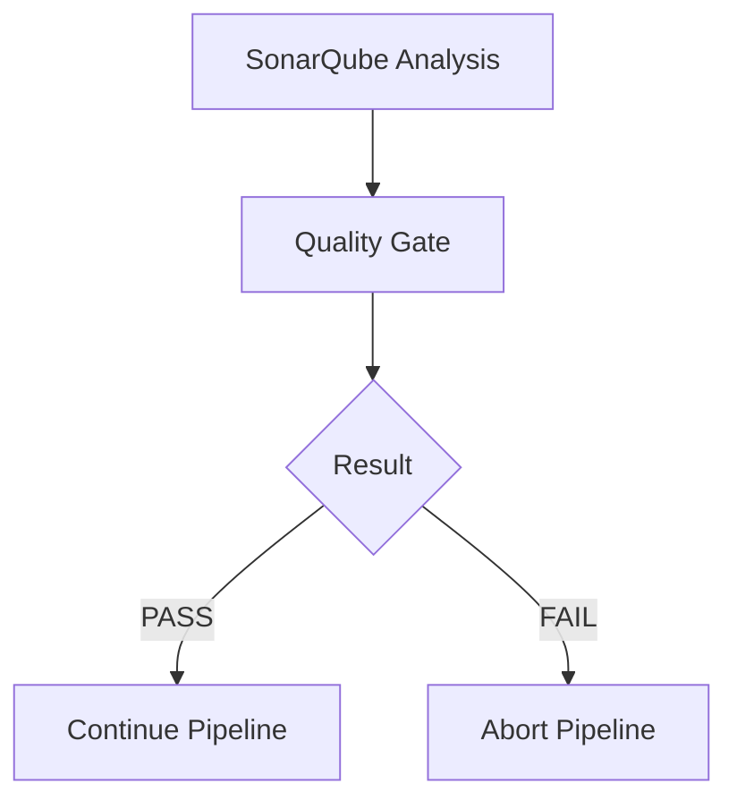

In our successful builds:

```text
Quality Gate = PASSED
```

---

# Stage 7 — Push Docker Image

Jenkins logs into Docker Hub using:

```text
dockerhub-credentials
```

Then pushes:

```bash
docker push yuvi2102/todo-app:${BUILD_NUMBER}
```

For Build #11:

```bash
docker push yuvi2102/todo-app:11
```

---

# Stage 8 — Update Kubernetes Manifest

This is one of the most important stages.

Jenkins changes:

```text
deploy/deploy.yaml
```

Suppose it contains:

```yaml
image: yuvi2102/todo-app:10
```

After Build #11 Jenkins changes it to:

```yaml
image: yuvi2102/todo-app:11
```

The command is:

```bash
sed -i "s|image: yuvi2102/todo-app:.*|image: yuvi2102/todo-app:${BUILD_NUMBER}|" deploy/deploy.yaml
```

Then Jenkins commits:

```bash
git add deploy/deploy.yaml
git commit -m "Update Kubernetes image to ${BUILD_NUMBER}"
```

Then pushes:

```bash
git push origin HEAD:main
```

Now GitHub contains the new desired Kubernetes state.

---

# Docker Image Versioning

We use Jenkins `BUILD_NUMBER` as the Docker image tag.

For example:

```text
Build #10 → yuvi2102/todo-app:10

Build #11 → yuvi2102/todo-app:11

Build #12 → yuvi2102/todo-app:12
```

This gives us traceability.

We can identify:

```text
Jenkins Build
      ↓
Docker Image
      ↓
Kubernetes Manifest
      ↓
Kubernetes Deployment
```

---

# Why Not Use `latest`?

If we use:

```text
latest
```

it becomes difficult to know exactly which build created the running image.

With versioned tags:

```text
:10
:11
:12
```

we know exactly which version is running.

---

# Docker Hub

Docker Hub repository:

```text
yuvi2102/todo-app
```

Example images:

```text
yuvi2102/todo-app:10
yuvi2102/todo-app:11
```

Docker Hub is the **container image registry**.

Remember:

```text
GitHub
    =
Source Code + Kubernetes Configuration

Docker Hub
    =
Docker Images
```

---

# Kubernetes

Kubernetes is responsible for running and managing the application containers.

We used:

```text
Minikube
```

as our Kubernetes cluster.

The basic relationship is:

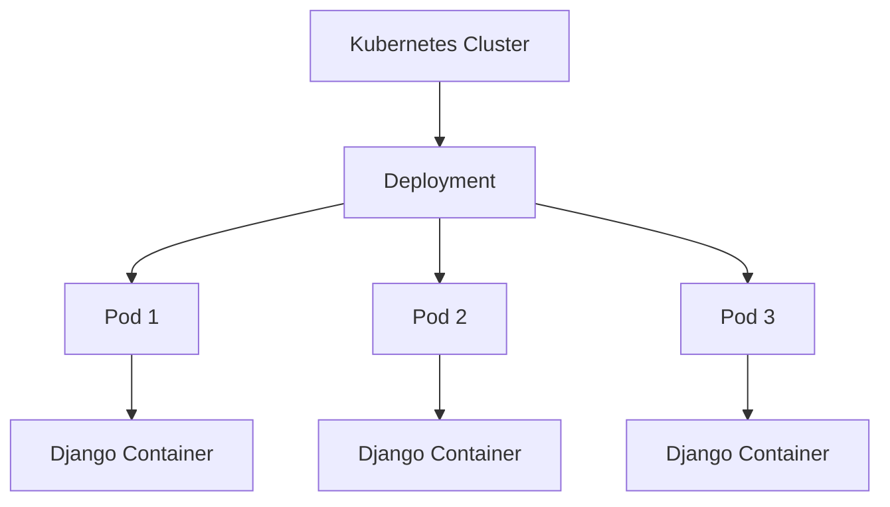

---

# Kubernetes Deployment

File:

```text
deploy/deploy.yaml
```

The important configuration is:

```yaml
apiVersion: apps/v1
kind: Deployment
metadata:
  name: todo-app
  labels:
    app: nginx
spec:
  replicas: 3
  selector:
    matchLabels:
      app: nginx
  template:
    metadata:
      labels:
        app: nginx
    spec:
      containers:
      - name: todo
        image: yuvi2102/todo-app:11
        ports:
        - containerPort: 8000
```

---

# Deployment Explanation

## `kind`

```yaml
kind: Deployment
```

This creates a Kubernetes Deployment.

---

## Name

```yaml
metadata:
  name: todo-app
```

The Deployment is named:

```text
todo-app
```

---

## Replicas

```yaml
replicas: 3
```

Kubernetes should maintain three application Pods.

---

## Selector

```yaml
selector:
  matchLabels:
    app: nginx
```

The Deployment manages Pods matching this label.

---

## Container

```yaml
containers:
- name: todo
```

The container is named:

```text
todo
```

---

## Image

Example final image:

```yaml
image: yuvi2102/todo-app:11
```

This tells Kubernetes which Docker image to run.

---

## Container Port

```yaml
containerPort: 8000
```

Django runs on port 8000.

---

# Deployment → ReplicaSet → Pods

Remember:

```text
Deployment
    ↓
ReplicaSet
    ↓
Pods
    ↓
Containers
```

The Deployment manages the desired number of Pods.

Our desired number:

```text
3
```

---

# What Is a Pod?

A Pod is the smallest deployable unit in Kubernetes.

In our project:

```text
Pod
└── Django Container
```

We had three Pods:

```text
Pod 1 → Django
Pod 2 → Django
Pod 3 → Django
```

All three use the same Docker image.

Final version:

```text
yuvi2102/todo-app:11
```

---

# Why Three Pods?

We configured:

```yaml
replicas: 3
```

This means Kubernetes should maintain three copies.

Conceptually:

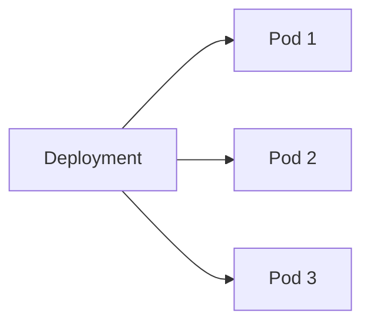

If one Pod fails, Kubernetes can create another Pod to maintain the desired state.

---

# Kubernetes Service

File:

```text
deploy/service.yaml
```

Configuration:

```yaml
apiVersion: v1
kind: Service
metadata:
  name: todo-service
spec:
  type: NodePort
  selector:
    app: nginx
  ports:
    - protocol: TCP
      port: 80
      targetPort: 8000
      nodePort: 31000
```

---

# Service Explanation

Our important ports are:

```text
NodePort     = 31000
Service Port = 80
Django Port  = 8000
```

---

# Service Port

```yaml
port: 80
```

The Kubernetes Service listens on port 80.

---

# Target Port

```yaml
targetPort: 8000
```

Traffic is forwarded to port 8000 on the application Pods.

Django is listening on:

```text
8000
```

Therefore:

```text
Service :80
    ↓
Pod :8000
```

---

# NodePort

```yaml
nodePort: 31000
```

This exposes the Service through port 31000 on the Kubernetes node.

Therefore the basic traffic flow is:

```text
Browser
   ↓
NodePort 31000
   ↓
Service
   ↓
Pod 8000
   ↓
Django
```

---

# Deployment, Pods and Service Relationship

The Deployment creates/manages Pods.

The Service sends traffic to the Pods.

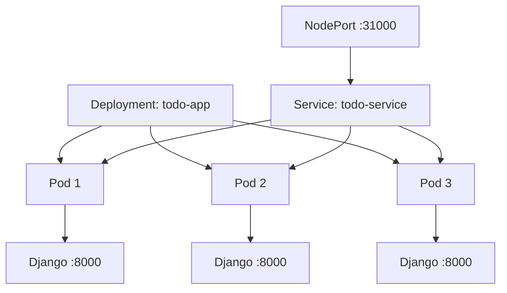

---

# Service Selector

The Pods have:

```yaml
labels:
  app: nginx
```

The Service has:

```yaml
selector:
  app: nginx
```

The labels match.

Therefore Kubernetes knows which Pods should receive traffic.

Conceptually:

```text
Service
   │
   ├── Pod 1
   ├── Pod 2
   └── Pod 3
```

---

# Kubernetes Endpoints

The Service endpoints were:

```text
10.244.0.90:8000
10.244.0.91:8000
10.244.0.92:8000
```

This confirmed that the Service was connected to the three application Pods.

Check endpoints using:

```bash
kubectl get endpoints
```

---

# Minikube

Minikube provides our Kubernetes cluster for this practical.

Start Minikube:

```bash
minikube start
```

Check status:

```bash
minikube status
```

Check Kubernetes nodes:

```bash
kubectl get nodes
```

Expected:

```text
NAME       STATUS   ROLES           AGE   VERSION
minikube   Ready    control-plane   ...   v1.35.1
```

The most important part is:

```text
STATUS = Ready
```

---

# Apply Kubernetes Manifests

Deployment:

```bash
kubectl apply -f deploy/deploy.yaml
```

Service:

```bash
kubectl apply -f deploy/service.yaml
```

Check:

```bash
kubectl get pods
kubectl get deployments
kubectl get svc
```

---

# Minikube Service

The Minikube Service URL was:

```text
http://192.168.49.2:31000
```

This allowed us to access the application through the Kubernetes Service.

---

# Argo CD

Argo CD is the GitOps Continuous Delivery component.

Its main responsibility is:

```text
Watch Git
   ↓
Compare desired state with actual state
   ↓
Synchronize Kubernetes
```

The simple flow is:

```text
GitHub
   ↓
Argo CD
   ↓
Kubernetes
```

---

# Why Did We Need Argo CD?

Without GitOps, we could have used:

```text
Jenkins
   ↓
kubectl apply
   ↓
Kubernetes
```

But our project uses:

```text
Jenkins
   ↓
Update Kubernetes YAML
   ↓
GitHub
   ↓
Argo CD
   ↓
Kubernetes
```

This gives us a GitOps workflow.

---

# Argo CD Installation

Create the namespace:

```bash
kubectl create namespace argocd
```

Install Argo CD:

```bash
kubectl apply -n argocd -f https://raw.githubusercontent.com/argoproj/argo-cd/stable/manifests/install.yaml
```

Check Argo CD Pods:

```bash
kubectl get pods -n argocd
```

The main Argo CD Pods became Running.

---

# Argo CD Version

The Argo CD UI showed:

```text
v3.5.2
```

---

# Expose Argo CD Server

We changed the Argo CD server Service to NodePort:

```bash
kubectl patch svc argocd-server -n argocd -p '{"spec":{"type":"NodePort"}}'
```

The Service exposed:

```text
80:30994
443:31761
```

---

# Access Argo CD UI

We used:

```bash
kubectl port-forward svc/argocd-server -n argocd 8081:443 --address=0.0.0.0
```

Then opened the Argo CD UI through the server IP and port 8081.

A self-signed certificate warning appeared.

That warning was expected for this setup.

---

# Argo CD Application

The Argo CD application was:

```text
todo-app
```

Configuration:

```text
Project:
default

Repository:
https://github.com/Yuvii2102/cicd-end-to-end.git

Revision:
main

Path:
deploy

Cluster:
https://kubernetes.default.svc

Namespace:
default

Auto-Sync:
Enabled
```

---

# Why Is the Path `deploy`?

The Kubernetes manifests are stored in:

```text
deploy/
```

Inside:

```text
deploy/
├── deploy.yaml
├── service.yaml
└── pod.yaml
```

Argo CD watches this directory.

Therefore when Jenkins changes:

```text
deploy/deploy.yaml
```

Argo CD can detect the change.

---

# What Does Auto-Sync Mean?

Auto-Sync means Argo CD can automatically synchronize Kubernetes with Git.

Example:

Git says:

```text
image: yuvi2102/todo-app:11
```

Kubernetes is running:

```text
image: yuvi2102/todo-app:10
```

Argo CD detects:

```text
Desired State ≠ Actual State
```

Then synchronizes:

```text
Git
 ↓
Argo CD
 ↓
Kubernetes
```

---

# GitOps

GitOps means Git is used as the source of truth for the desired deployment state.

Our desired state is stored in:

```text
GitHub
   ↓
deploy/deploy.yaml
```

Example:

```yaml
image: yuvi2102/todo-app:11
```

Argo CD compares that desired state with the actual Kubernetes state.

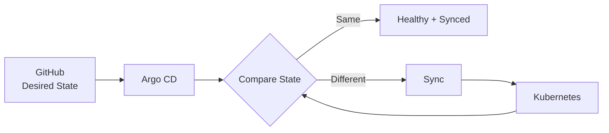

---

# The Most Important GitOps Idea

Remember:

```text
Git = Source of Truth
```

In our project:

```text
GitHub
   ↓
deploy/deploy.yaml
   ↓
Desired Kubernetes State
```

Argo CD makes Kubernetes match that state.

---

# Jenkins vs Argo CD

This is one of the most important interview concepts.

## Jenkins

Jenkins is responsible for CI and pipeline automation.

Jenkins:

```text
Checkout
Build
Test
SonarQube
Quality Gate
Push Docker Image
Update Git Manifest
```

## Argo CD

Argo CD is responsible for GitOps deployment.

Argo CD:

```text
Watch Git
Compare State
Sync Kubernetes
```

Remember:

```text
Jenkins
    ↓
"Is this code ready?"

Argo CD
    ↓
"Is Kubernetes matching Git?"
```

---

# Docker vs Kubernetes

Another important distinction.

Docker:

```text
Packages the application
into a container image
```

Kubernetes:

```text
Runs and manages
the containers
```

Think:

```text
Docker
   ↓
Creates Image
   ↓
Kubernetes
   ↓
Runs Image
```

---

# Docker Hub vs GitHub

They are different.

GitHub:

```text
Source Code
Dockerfile
Jenkinsfile
Kubernetes YAML
SonarQube Configuration
```

Docker Hub:

```text
Docker Images
```

Therefore:

```text
GitHub
=
Code + Configuration

Docker Hub
=
Container Images
```

---

# Deployment vs Pod vs Service

A simple analogy:

## Deployment

The manager:

> "I need three workers."

## Pods

The workers:

> "We are running the application."

## Service

The receptionist:

> "Send incoming traffic to one of the available workers."

So:

```text
Deployment
   ↓
Manages Pods
   ↓
Pods run Application
   ↓
Service provides Network Access
```

---

# Complete CI/CD Flow

This is the most important diagram in the entire project.

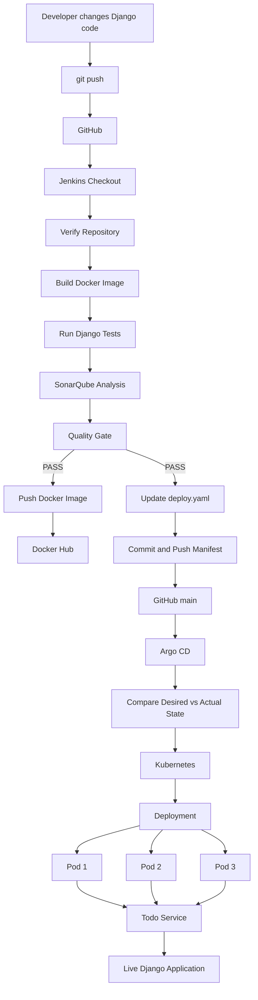

---

# Complete Journey in Simple Words

Suppose I change:

```text
Todo List - Abhishek
```

to:

```text
Todo List - Yuvraj
```

Then:

```text
1. I change the code.
        ↓
2. I push the code to GitHub.
        ↓
3. Jenkins gets the code.
        ↓
4. Jenkins builds a Docker image.
        ↓
5. Jenkins runs Django tests.
        ↓
6. Jenkins runs SonarQube.
        ↓
7. Quality Gate passes.
        ↓
8. Jenkins pushes the Docker image to Docker Hub.
        ↓
9. Jenkins changes deploy.yaml to the new image tag.
        ↓
10. Jenkins pushes deploy.yaml to GitHub.
        ↓
11. Argo CD detects the Git change.
        ↓
12. Argo CD synchronizes Kubernetes.
        ↓
13. Kubernetes deploys the new image.
        ↓
14. Kubernetes runs three Pods.
        ↓
15. Service sends traffic to the Pods.
        ↓
16. Browser shows:
    Todo List - Yuvraj
```

That is the entire project.

---

# Build #10

Build #10 was an important successful pipeline execution.

It successfully completed:

```text
Checkout                 ✓
Verify Repository        ✓
Docker Build             ✓
Django Tests             ✓
SonarQube Analysis       ✓
Quality Gate             ✓
Docker Hub Push          ✓
Kubernetes Manifest      ✓
Git Push                 ✓
Argo CD Sync             ✓
Kubernetes Deployment    ✓
```

Docker image:

```text
yuvi2102/todo-app:10
```

The Kubernetes Deployment was updated to version 10.

---

# Build #11

Build #11 was also successfully completed.

Docker image:

```text
yuvi2102/todo-app:11
```

The pipeline successfully completed:

```text
Checkout                 ✓
Verify Repository        ✓
Docker Build             ✓
Django Tests             ✓
SonarQube Analysis       ✓
Quality Gate             ✓
Docker Hub Push          ✓
Kubernetes Manifest      ✓
Git Push                 ✓
Argo CD Sync             ✓
Kubernetes Rollout       ✓
```

---

# Build #11 Git Verification

After Build #11, we checked the version stored in GitHub:

```bash
git show origin/main:deploy/deploy.yaml | grep "image:"
```

It showed:

```text
image: yuvi2102/todo-app:11
```

This proved that Jenkins successfully updated the Kubernetes manifest in GitHub.

---

# Build #11 Kubernetes Verification

Initially there was an interesting situation.

GitHub contained:

```text
yuvi2102/todo-app:11
```

but Kubernetes was still using:

```text
yuvi2102/todo-app:10
```

That meant:

```text
Jenkins = successful
GitHub = correct
Docker Hub = correct
Kubernetes = old state
```

Therefore the problem was between:

```text
GitHub
   ↓
Argo CD
   ↓
Kubernetes
```

---

# Argo CD Hard Refresh

We forced Argo CD to refresh:

```bash
kubectl -n argocd annotate application todo-app argocd.argoproj.io/refresh=hard --overwrite
```

After synchronization:

```text
GitHub
   ↓
image :11
   ↓
Argo CD
   ↓
Kubernetes
   ↓
image :11
```

This was an important troubleshooting lesson.

---

# Final Kubernetes Pods

After Build #11, the Pods were:

```text
todo-app-f48b6bf6-qd8pt   1/1 Running
todo-app-f48b6bf6-qvrwq   1/1 Running
todo-app-f48b6bf6-zsg4p   1/1 Running
```

All three replicas were running.

---

# Rollout Verification

Command:

```bash
kubectl rollout status deployment/todo-app
```

Result:

```text
deployment "todo-app" successfully rolled out
```

This confirmed that the new application version had successfully rolled out.

---

# Real Problems We Faced

These were the important problems encountered during the practical.

1. Jenkins Git push failed.
2. Dockerfile Python version needed to be made specific.
3. Kubernetes initially remained on an old image.
4. Local Git became behind GitHub.
5. Port 8000 was already in use.
6. Django `/todos` redirected to `/todos/`.

Understanding these problems is useful because they teach how the different components interact.

---

# Troubleshooting Guide

# Problem 1 — Jenkins Git Push Failed

Error:

```text
error: src refspec main does not match any
```

Why?

Jenkins checked out the repository in a detached HEAD state.

Therefore Jenkins did not necessarily have a local branch named:

```text
main
```

The original approach:

```bash
git push origin main
```

failed.

The fix was:

```bash
git push origin HEAD:main
```

Meaning:

```text
Current Jenkins HEAD
        ↓
Remote main branch
```

This fixed the problem.

---

# Problem 2 — Dockerfile Python Version

Original:

```dockerfile
FROM python:3
```

Changed to:

```dockerfile
FROM python:3.10
```

Reason:

- Use a specific Python version.
- Keep the environment predictable.
- Match the project's Python configuration.

---

# Problem 3 — Kubernetes Still Had Old Image

GitHub:

```text
yuvi2102/todo-app:11
```

Kubernetes:

```text
yuvi2102/todo-app:10
```

First verify Git:

```bash
git show origin/main:deploy/deploy.yaml | grep "image:"
```

If it shows:

```text
image: yuvi2102/todo-app:11
```

then Jenkins has successfully updated Git.

Next check Kubernetes:

```bash
kubectl get deployment todo-app -o jsonpath='{.spec.template.spec.containers[0].image}'
```

If it still shows version 10, check Argo CD.

Force refresh:

```bash
kubectl -n argocd annotate application todo-app argocd.argoproj.io/refresh=hard --overwrite
```

Then check again.

---

# Problem 4 — Local Git Behind GitHub

Jenkins pushes commits directly to GitHub.

Therefore GitHub can have commits that the local machine does not have yet.

We encountered this situation.

Fix:

```bash
git pull --rebase origin main
```

Then:

```bash
git push origin main
```

This synchronized the local repository with GitHub.

---

# Problem 5 — Port 8000 Already in Use

We used:

```bash
kubectl port-forward svc/todo-service 8000:80 --address=0.0.0.0
```

Trying to start another one produced:

```text
Unable to listen on port 8000
bind: address already in use
```

Why?

A previous port-forward process was already running.

Check:

```bash
sudo lsof -i :8000
```

or:

```bash
sudo ss -ltnp | grep :8000
```

If an existing port-forward is working, do not start another one.

---

# Problem 6 — Django `/todos` Redirect

We tested:

```bash
curl -I http://localhost:8000/todos
```

and received:

```text
HTTP/1.1 301 Moved Permanently
Location: /todos/
```

This is normal Django trailing-slash behavior.

The correct application path is:

```text
/todos/
```

Therefore:

```text
http://100.48.56.207:8000/todos/
```

was the final application URL.

---

# Important Commands

# Git Commands

Check status:

```bash
git status
```

Check remote:

```bash
git remote -v
```

View commits:

```bash
git log --oneline
```

Latest commit:

```bash
git log -1 --oneline
```

Pull latest changes:

```bash
git pull --rebase origin main
```

Push:

```bash
git push origin main
```

Check GitHub manifest:

```bash
git show origin/main:deploy/deploy.yaml | grep "image:"
```

---

# Docker Commands

Check Docker:

```bash
docker --version
```

List images:

```bash
docker images
```

Build image:

```bash
docker build -t todo-app:1 .
```

Run container:

```bash
docker run --rm todo-app:1
```

Run tests:

```bash
docker run --rm todo-app:1 python manage.py test
```

Tag image:

```bash
docker tag todo-app:1 yuvi2102/todo-app:1
```

Login:

```bash
docker login
```

Push:

```bash
docker push yuvi2102/todo-app:1
```

Running containers:

```bash
docker ps
```

All containers:

```bash
docker ps -a
```

---

# Kubernetes Commands

Check nodes:

```bash
kubectl get nodes
```

Check Pods:

```bash
kubectl get pods
```

Check Pods with IPs:

```bash
kubectl get pods -o wide
```

Check Deployments:

```bash
kubectl get deployments
```

Check Services:

```bash
kubectl get svc
```

Check endpoints:

```bash
kubectl get endpoints
```

Check Deployment image:

```bash
kubectl get deployment todo-app -o jsonpath='{.spec.template.spec.containers[0].image}'
```

Check rollout:

```bash
kubectl rollout status deployment/todo-app
```

Describe Deployment:

```bash
kubectl describe deployment todo-app
```

Describe Pod:

```bash
kubectl describe pod <pod-name>
```

View Pod logs:

```bash
kubectl logs <pod-name>
```

---

# Kubernetes Apply Commands

Apply Deployment:

```bash
kubectl apply -f deploy/deploy.yaml
```

Apply Service:

```bash
kubectl apply -f deploy/service.yaml
```

---

# Minikube Commands

Start:

```bash
minikube start
```

Check status:

```bash
minikube status
```

Get Minikube IP:

```bash
minikube ip
```

Get Service URL:

```bash
minikube service todo-service --url
```

Stop:

```bash
minikube stop
```

---

# Argo CD Commands

Check Argo CD Pods:

```bash
kubectl get pods -n argocd
```

Check Argo CD Services:

```bash
kubectl get svc -n argocd
```

Check Argo CD Applications:

```bash
kubectl get application -n argocd
```

Hard refresh:

```bash
kubectl -n argocd annotate application todo-app argocd.argoproj.io/refresh=hard --overwrite
```

Port forward Argo CD:

```bash
kubectl port-forward svc/argocd-server -n argocd 8081:443 --address=0.0.0.0
```

---

# Application Access

Our Kubernetes Service:

```text
todo-service
```

Service type:

```text
NodePort
```

NodePort:

```text
31000
```

Minikube Service URL:

```text
http://192.168.49.2:31000
```

We also used port forwarding:

```bash
kubectl port-forward svc/todo-service 8000:80 --address=0.0.0.0
```

Final application URL:

```text
http://100.48.56.207:8000/todos/
```

Expected result:

```text
Todo List - Yuvraj
```

---

# How to Verify the Project

If I come back to this project after one month, follow these steps in this exact order.

---

## Step 1 — Check Minikube

```bash
minikube status
```

It should be running.

---

## Step 2 — Check Kubernetes Node

```bash
kubectl get nodes
```

Expected:

```text
minikube   Ready
```

---

## Step 3 — Check Pods

```bash
kubectl get pods
```

Expected:

```text
3 application Pods
Running
```

---

## Step 4 — Check Deployment

```bash
kubectl get deployment
```

Expected:

```text
todo-app
```

---

## Step 5 — Check Running Image

```bash
kubectl get deployment todo-app -o jsonpath='{.spec.template.spec.containers[0].image}'
```

Expected final version:

```text
yuvi2102/todo-app:11
```

---

## Step 6 — Check Rollout

```bash
kubectl rollout status deployment/todo-app
```

Expected:

```text
successfully rolled out
```

---

## Step 7 — Check Service

```bash
kubectl get svc
```

Expected:

```text
todo-service
NodePort
80:31000/TCP
```

---

## Step 8 — Check Endpoints

```bash
kubectl get endpoints
```

Expected:

```text
Multiple Pod IPs on port 8000
```

---

## Step 9 — Check Argo CD

Argo CD application should show:

```text
Healthy
Synced
```

---

## Step 10 — Access Application

Run:

```bash
kubectl port-forward svc/todo-service 8000:80 --address=0.0.0.0
```

Then open:

```text
http://100.48.56.207:8000/todos/
```

Expected:

```text
Todo List - Yuvraj
```

---

# Important Concepts to Remember

# Continuous Integration

CI means frequently integrating code changes and automatically validating them.

Our Jenkins CI process:

```text
GitHub
   ↓
Jenkins
   ↓
Build
   ↓
Test
   ↓
SonarQube
   ↓
Quality Gate
```

---

# Continuous Delivery

Continuous Delivery means keeping software in a deployable state and automating the deployment preparation process.

Our flow:

```text
Jenkins
   ↓
Docker Image
   ↓
Kubernetes Manifest
   ↓
GitHub
   ↓
Argo CD
   ↓
Kubernetes
```

---

# GitOps

GitOps means Git stores the desired deployment state.

Our desired state:

```text
GitHub
   ↓
deploy/deploy.yaml
```

Argo CD watches it and synchronizes Kubernetes.

---

# Source of Truth

For Kubernetes deployment configuration:

```text
GitHub = Source of Truth
```

Example:

```yaml
image: yuvi2102/todo-app:11
```

Argo CD tries to make Kubernetes match that configuration.

---

# Container

A container is a running instance of a container image.

In our project:

```text
Docker Image
   ↓
Container
   ↓
Django Application
```

---

# Docker Image

The Docker image is the packaged application.

Example:

```text
yuvi2102/todo-app:11
```

---

# Docker Registry

Docker Hub is the registry where the Docker image is stored.

```text
Docker Image
   ↓
Docker Hub
```

---

# Kubernetes Cluster

A Kubernetes cluster is the environment where Kubernetes manages the application.

We used:

```text
Minikube
```

---

# Deployment

A Kubernetes Deployment manages the desired number and version of application Pods.

Our Deployment:

```text
todo-app
```

---

# Pod

A Pod runs our Django container.

We have:

```text
Pod 1
Pod 2
Pod 3
```

---

# Replica

We configured:

```yaml
replicas: 3
```

Therefore Kubernetes tries to keep three application replicas running.

---

# Service

The Service provides stable networking to the application Pods.

Our Service:

```text
todo-service
```

---

# NodePort

NodePort exposes the Service through a port on the Kubernetes node.

Our NodePort:

```text
31000
```

---

# targetPort

Django listens on:

```text
8000
```

The Service forwards traffic to:

```text
targetPort: 8000
```

Therefore:

```text
NodePort 31000
      ↓
Service port 80
      ↓
Pod port 8000
      ↓
Django
```

---

# Rolling Update

Suppose Kubernetes is running:

```text
yuvi2102/todo-app:10
```

A new Jenkins build creates:

```text
yuvi2102/todo-app:11
```

The Deployment changes.

Kubernetes performs a rollout so the application moves to the new version.

Conceptually:

```text
Old:

Pod 1 → :10
Pod 2 → :10
Pod 3 → :10

        ↓

Rolling Update

        ↓

New:

Pod 1 → :11
Pod 2 → :11
Pod 3 → :11
```

---

# Docker Image vs Kubernetes Manifest

These are two different things.

Docker Hub contains:

```text
yuvi2102/todo-app:11
```

GitHub contains:

```yaml
image: yuvi2102/todo-app:11
```

Docker Hub:

```text
Stores the actual image
```

GitHub:

```text
Stores the desired configuration
```

Argo CD:

```text
Connects Git desired state
to Kubernetes actual state
```

Kubernetes:

```text
Runs the application
```

---

# Jenkins vs Kubernetes

Jenkins:

```text
Automation / CI
```

Kubernetes:

```text
Container Orchestration / Runtime
```

---

# Jenkins vs Argo CD

Jenkins:

```text
Build
Test
Analyze
Package
Push Image
Update Git
```

Argo CD:

```text
Watch Git
Compare State
Deploy
Synchronize
```

---

# Project in Four Layers

Another easy way to understand the project is through four layers.

---

## Layer 1 — Source Code

```text
Developer
    ↓
Git
    ↓
GitHub
```

GitHub stores the application.

---

## Layer 2 — Continuous Integration

```text
Jenkins
    ↓
Build
    ↓
Test
    ↓
SonarQube
    ↓
Quality Gate
```

Jenkins validates the application.

---

## Layer 3 — Container Image

```text
Docker
    ↓
Docker Image
    ↓
Docker Hub
```

Docker packages the application and Docker Hub stores it.

---

## Layer 4 — Deployment

```text
GitHub Manifest
    ↓
Argo CD
    ↓
Kubernetes
    ↓
Pods
    ↓
Service
    ↓
Application
```

Argo CD deploys the desired Git state into Kubernetes.

---

# Four Layers in One Diagram

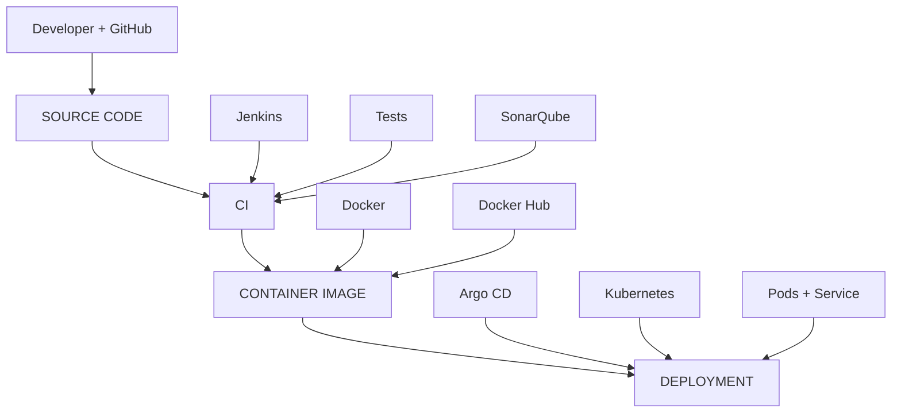

---

# What I Should Be Able to Answer

After understanding this project, I should be able to answer:

### Where is the application code?

GitHub.

### Who builds the application?

Jenkins.

### What does Jenkins build?

A Docker image.

### Where is the image stored?

Docker Hub.

### How do we test the application?

Django tests run inside the Docker image.

### How do we check source code quality?

SonarQube.

### What is the Quality Gate?

A checkpoint that decides whether the pipeline can continue.

### What happens if the Quality Gate fails?

The pipeline stops.

### How does Kubernetes know which image to run?

The image is specified in `deploy/deploy.yaml`.

### Who updates the image tag?

Jenkins.

### Where is the updated Kubernetes manifest stored?

GitHub.

### Who deploys that Git state?

Argo CD.

### Where does the application actually run?

Inside containers running in Kubernetes Pods.

### How many replicas?

Three.

### How do users reach the Pods?

Through the Kubernetes Service.

### What is the final image?

```text
yuvi2102/todo-app:11
```

### What did the final application show?

```text
Todo List - Yuvraj
```

---

# Interview Explanation

If an interviewer asks:

> "Explain your project."

I can say:

> I worked on an end-to-end CI/CD and GitOps project for a Django Todo application. The source code is stored in GitHub. Jenkins is used for Continuous Integration. Whenever a change is pushed, Jenkins checks out the source code, verifies the repository, builds a Docker image and runs the Django test suite. After the tests pass, Jenkins performs SonarQube analysis and waits for the Quality Gate. If the Quality Gate passes, Jenkins pushes a versioned Docker image to Docker Hub. Jenkins then updates the Kubernetes deployment manifest with the current Jenkins build number and pushes that change back to GitHub. Argo CD watches the Git repository and follows the GitOps approach, where Git is the source of truth. When Argo CD detects a difference between Git and Kubernetes, it synchronizes the Kubernetes cluster. Kubernetes then deploys the new Docker image using three replicas, and a NodePort Service exposes the application.

---

# 30-Second Interview Version

If I need a shorter answer:

> I built an end-to-end CI/CD and GitOps pipeline for a Django Todo application. GitHub stores the source code, Jenkins performs the CI process including Docker build, Django tests and SonarQube analysis. After the Quality Gate passes, Jenkins pushes a versioned Docker image to Docker Hub and updates the Kubernetes manifest in GitHub. Argo CD monitors that Git repository and synchronizes the desired state to Kubernetes. Kubernetes runs the application using three replicas behind a NodePort Service.

---

# Interview Diagram

If the interviewer asks me to draw the architecture, draw this:

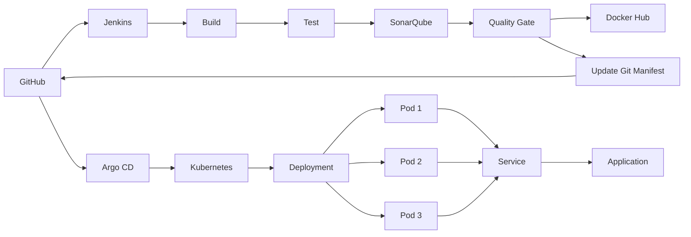

---

# Common Interview Questions

## Why did you use Jenkins?

Jenkins automates the CI process.

It performs:

```text
Checkout
Build
Test
SonarQube
Quality Gate
Docker Push
Git Manifest Update
```

---

## Why did you use Docker?

Docker packages the application and its environment into a portable container image.

---

## Why did you use Docker Hub?

Docker Hub stores the Docker images so Kubernetes can pull and run them.

---

## Why did you use SonarQube?

SonarQube performs static code analysis and provides a Quality Gate before the pipeline continues.

---

## What happens if tests fail?

The pipeline stops.

```text
Build
 ↓
Test ❌
 ↓
STOP
```

---

## What happens if Quality Gate fails?

Because we configured:

```groovy
waitForQualityGate abortPipeline: true
```

the pipeline is aborted.

---

## Why use `BUILD_NUMBER`?

It gives each Jenkins build a unique version.

Example:

```text
Build #10 → image :10
Build #11 → image :11
```

---

## Why not use `latest`?

Versioned image tags make it easier to trace exactly which build is running.

---

## What is GitOps?

GitOps means Git contains the desired deployment state and a tool such as Argo CD synchronizes that state with the Kubernetes cluster.

---

## Why did you use Argo CD?

Argo CD provides GitOps-based Continuous Delivery for Kubernetes.

It watches Git and synchronizes Kubernetes.

---

## Why use Jenkins and Argo CD together?

They have different responsibilities.

```text
Jenkins
=
CI

Argo CD
=
GitOps Continuous Delivery
```

Jenkins prepares and updates the deployment state.

Argo CD deploys that Git state.

---

## Why not let Jenkins directly run `kubectl apply`?

Our project follows GitOps.

Instead of:

```text
Jenkins
   ↓
kubectl apply
   ↓
Kubernetes
```

we use:

```text
Jenkins
   ↓
GitHub
   ↓
Argo CD
   ↓
Kubernetes
```

This keeps Git as the source of truth.

---

## Why three replicas?

Three replicas provide multiple running instances of the application.

Kubernetes tries to maintain the desired number of replicas.

---

## What is a Deployment?

A Deployment manages application Pods and maintains the desired state.

---

## What is a Pod?

A Pod is the smallest deployable unit in Kubernetes and runs our Django container.

---

## What is a Service?

A Service provides stable network access to the Pods.

---

## What is NodePort?

NodePort exposes the Service through a port on the Kubernetes node.

Our NodePort:

```text
31000
```

---

## What is `targetPort`?

It is the port where the application is listening inside the Pod.

Our Django application listens on:

```text
8000
```

---

## How did Jenkins push to GitHub?

Jenkins used the `github-ssh` credential.

Because Jenkins uses a detached HEAD during checkout, we used:

```bash
git push origin HEAD:main
```

---

## Why did `HEAD:main` solve the Jenkins problem?

Because Jenkins may not have a local `main` branch.

`HEAD:main` means:

```text
Current Jenkins commit
        ↓
Remote main branch
```

---

## How did you troubleshoot Kubernetes still running image 10?

First I checked GitHub:

```bash
git show origin/main:deploy/deploy.yaml | grep "image:"
```

GitHub showed:

```text
yuvi2102/todo-app:11
```

Then I checked Kubernetes.

Kubernetes was still running:

```text
yuvi2102/todo-app:10
```

That told me Jenkins had already successfully updated Git, but the Git state had not yet been synchronized to Kubernetes.

I forced an Argo CD refresh:

```bash
kubectl -n argocd annotate application todo-app argocd.argoproj.io/refresh=hard --overwrite
```

Then Kubernetes updated to version 11.

---

# How to Check the Running Image

Command:

```bash
kubectl get deployment todo-app -o jsonpath='{.spec.template.spec.containers[0].image}'
```

Expected:

```text
yuvi2102/todo-app:11
```

---

# How to Check the Pods

```bash
kubectl get pods
```

Expected:

```text
3 Pods
Running
```

---

# How to Check the Deployment

```bash
kubectl get deployment
```

Expected:

```text
todo-app
```

---

# How to Check the Service

```bash
kubectl get svc
```

Expected:

```text
todo-service
NodePort
80:31000/TCP
```

---

# How to Check the Rollout

```bash
kubectl rollout status deployment/todo-app
```

Expected:

```text
deployment "todo-app" successfully rolled out
```

---

# How to Check Argo CD

The Argo CD application should show:

```text
Healthy
Synced
```

---

# Final Project Status

| Component | Status |
|---|---|
| Django Application | Working |
| Git | Working |
| GitHub | Working |
| GitHub SSH | Working |
| Jenkins | Working |
| Jenkins Docker Access | Working |
| Docker Build | Working |
| Django Tests | Passing |
| SonarQube | Working |
| SonarQube Quality Gate | Passing |
| Docker Hub | Working |
| Kubernetes | Working |
| Minikube | Working |
| Kubernetes Deployment | Working |
| Kubernetes Service | Working |
| Argo CD | Working |
| GitOps | Working |
| Rolling Update | Working |
| Final Application | Working |

---

# Final Verified Version

Final Docker image:

```text
yuvi2102/todo-app:11
```

Final Kubernetes image:

```text
yuvi2102/todo-app:11
```

Replicas:

```text
3
```

Service:

```text
todo-service
```

NodePort:

```text
31000
```

Argo CD:

```text
Healthy
Synced
```

Kubernetes rollout:

```text
Successfully rolled out
```

Final application:

```text
Todo List - Yuvraj
```

---

# Final Application URL

Port forwarding:

```bash
kubectl port-forward svc/todo-service 8000:80 --address=0.0.0.0
```

Application:

```text
http://100.48.56.207:8000/todos/
```

---

# One-Minute Mental Model

When I forget this project, remember these five things.

## 1. GitHub stores everything important

```text
Application Code
+
Dockerfile
+
Jenkinsfile
+
Kubernetes YAML
```

---

## 2. Jenkins validates the application

```text
Checkout
   ↓
Build
   ↓
Test
   ↓
SonarQube
   ↓
Quality Gate
```

---

## 3. Docker Hub stores the application image

```text
Jenkins
   ↓
Docker Image
   ↓
Docker Hub
```

Example:

```text
yuvi2102/todo-app:11
```

---

## 4. Argo CD deploys Git state

```text
GitHub
   ↓
Argo CD
   ↓
Kubernetes
```

---

## 5. Kubernetes runs the application

```text
Deployment
   ↓
3 Pods
   ↓
Service
   ↓
Django Application
```

---

# The Entire Project in One Sentence

> A developer pushes Django code to GitHub, Jenkins builds and tests the application, SonarQube checks code quality, Jenkins pushes a versioned Docker image to Docker Hub and updates the Kubernetes manifest in GitHub, Argo CD detects the Git change and synchronizes Kubernetes, and Kubernetes runs the new Django application using three replicas behind a Service.

---

# The Entire Project in One Line

```text
Developer → GitHub → Jenkins → Docker Build → Django Tests → SonarQube → Quality Gate → Docker Hub → Update deploy.yaml → GitHub → Argo CD → Kubernetes → 3 Pods → Service → Live Application
```

---

# Final Takeaway

The main goal of this practical was not to learn Jenkins, Docker, Kubernetes, SonarQube and Argo CD as separate tools.

The goal was to understand how they work together.

The journey starts with source code:

```text
Developer
   ↓
GitHub
```

Jenkins performs Continuous Integration:

```text
GitHub
   ↓
Jenkins
   ↓
Build
   ↓
Test
   ↓
SonarQube
   ↓
Quality Gate
```

Docker packages the application:

```text
Docker
   ↓
Docker Image
   ↓
Docker Hub
```

Jenkins updates the Kubernetes desired state:

```text
deploy/deploy.yaml
   ↓
GitHub
```

Argo CD performs GitOps deployment:

```text
GitHub
   ↓
Argo CD
   ↓
Kubernetes
```

Kubernetes runs the application:

```text
Deployment
   ↓
3 Pods
   ↓
Service
   ↓
Django Todo Application
```

The final proof was:

```text
Todo List - Yuvraj
```

That means the application change successfully travelled through the complete pipeline.

---

# Final Architecture to Memorize

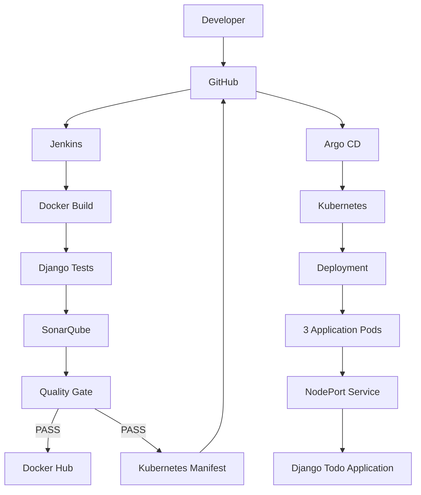

# PROJECT COMPLETE
