# CI/CD Process — Interview Explanation

## Question

**Q: Can you explain the CI/CD process in your current project?**

or

**Q: Can you talk about any CI/CD process that you have implemented?**

---

# Interview Answer

> Yes. In my current project, I implemented an end-to-end CI/CD pipeline for a Django Todo application using Jenkins, Docker, SonarQube, Docker Hub, Kubernetes and Argo CD.
>
> The process starts when a developer pushes the code to GitHub. Jenkins checks out the latest code and first verifies the repository. Then Jenkins builds a Docker image of the Django application using the Dockerfile. After that, it runs the Django test cases inside the Docker container.
>
> Once the tests pass, Jenkins performs static code analysis using SonarQube and waits for the Quality Gate. If the Quality Gate passes, Jenkins pushes the versioned Docker image to Docker Hub.
>
> After pushing the image, Jenkins updates the Kubernetes deployment manifest with the new Docker image tag and pushes that change back to GitHub. Then Argo CD detects the change in Git and synchronizes the desired state with our Kubernetes cluster.
>
> Kubernetes deploys the new image using a Deployment with three replicas. Finally, a NodePort Service exposes the application, and we can access the running Django Todo application.
>
> So the overall flow is:
>
> **GitHub → Jenkins → Build → Test → SonarQube → Quality Gate → Docker Hub → Update Kubernetes Manifest → GitHub → Argo CD → Kubernetes → Pods → Service → Application.**

---

# Architecture Diagram

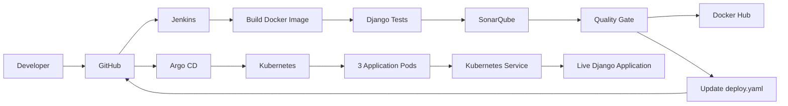

---

# Now Understand What I Am Saying

Do not just memorize the interview answer.

Understand what happens at every step.

---

## 1. Developer → GitHub

First, I make a change to the Django application.

For example, in our project we changed:

```text
Todo List - Abhishek
```

to:

```text
Todo List - Yuvraj
```

Then I commit and push the change:

```bash
git add .
git commit -m "Change Todo app name to Yuvraj"
git push origin main
```

Now the latest source code is available in GitHub.

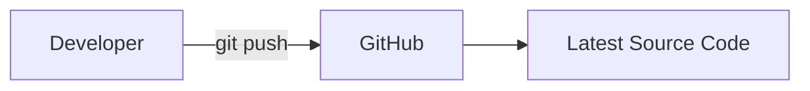

### Simple interview line

> GitHub is our source code repository where we store the application code and Kubernetes configuration.

---

# 2. GitHub → Jenkins

Once the code is available in GitHub, Jenkins checks out the repository.

Our Jenkins pipeline starts with:

```text
Checkout
```

Jenkins gets the project into its workspace.

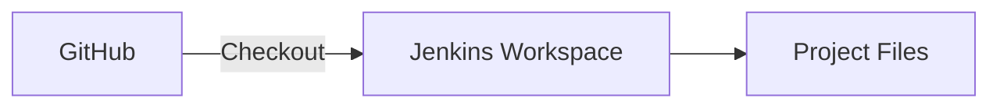

### Simple interview line

> Jenkins checks out the latest source code from GitHub and starts the CI pipeline.

---

# 3. Jenkins Builds the Docker Image

After checkout, Jenkins builds a Docker image.

The command used is:

```bash
docker build -t todo-app:${BUILD_NUMBER} .
```

For example, if Jenkins is running:

```text
Build #11
```

then:

```text
BUILD_NUMBER = 11
```

and the image becomes:

```text
todo-app:11
```

We then tag it for Docker Hub:

```text
yuvi2102/todo-app:11
```

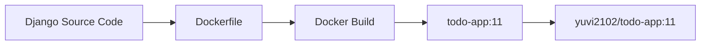

### Simple interview line

> Jenkins builds a versioned Docker image using the Dockerfile. We use the Jenkins build number as the image tag so every build can be tracked.

---

# 4. Jenkins Runs Django Tests

After creating the image, Jenkins runs the Django test cases inside the Docker container.

Command:

```bash
docker run --rm todo-app:${BUILD_NUMBER} python manage.py test
```

For Build #11:

```bash
docker run --rm todo-app:11 python manage.py test
```

Our test verifies Todo creation.

The basic idea is:

```text
Create Todo
    ↓
Set title = "Learn CI/CD"
    ↓
Check title
    ↓
PASS
```

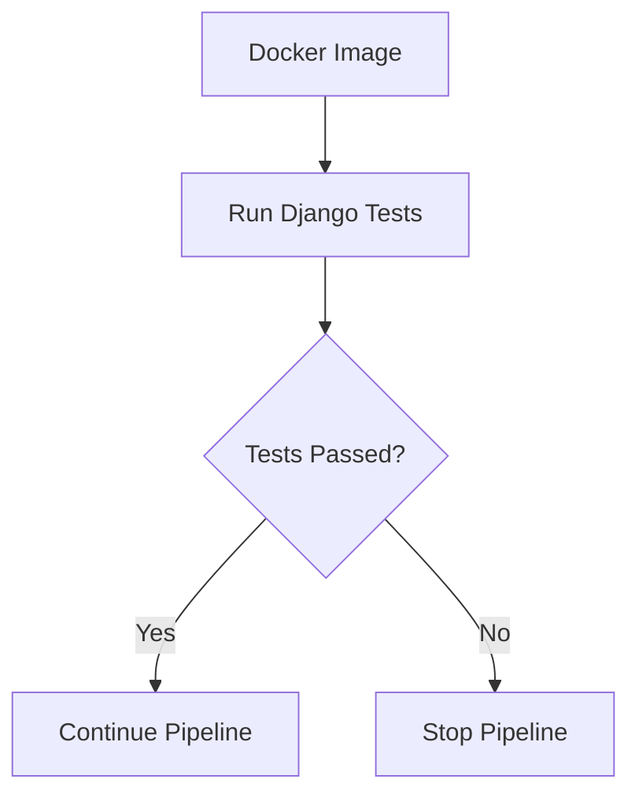

### Simple interview line

> After building the image, Jenkins runs the Django test cases. If the tests fail, the pipeline stops.

---

# 5. SonarQube Analysis

If the tests pass, Jenkins performs static code analysis using SonarQube.

The flow is:

```text
Source Code
    ↓
SonarQube
    ↓
Code Analysis
    ↓
Quality Gate
```

SonarQube helps us check the quality of the source code.

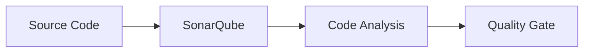

### Simple interview line

> After the tests pass, Jenkins performs static code analysis using SonarQube.

---

# 6. Quality Gate

The Quality Gate is a checkpoint.

Jenkins waits for the SonarQube Quality Gate result.

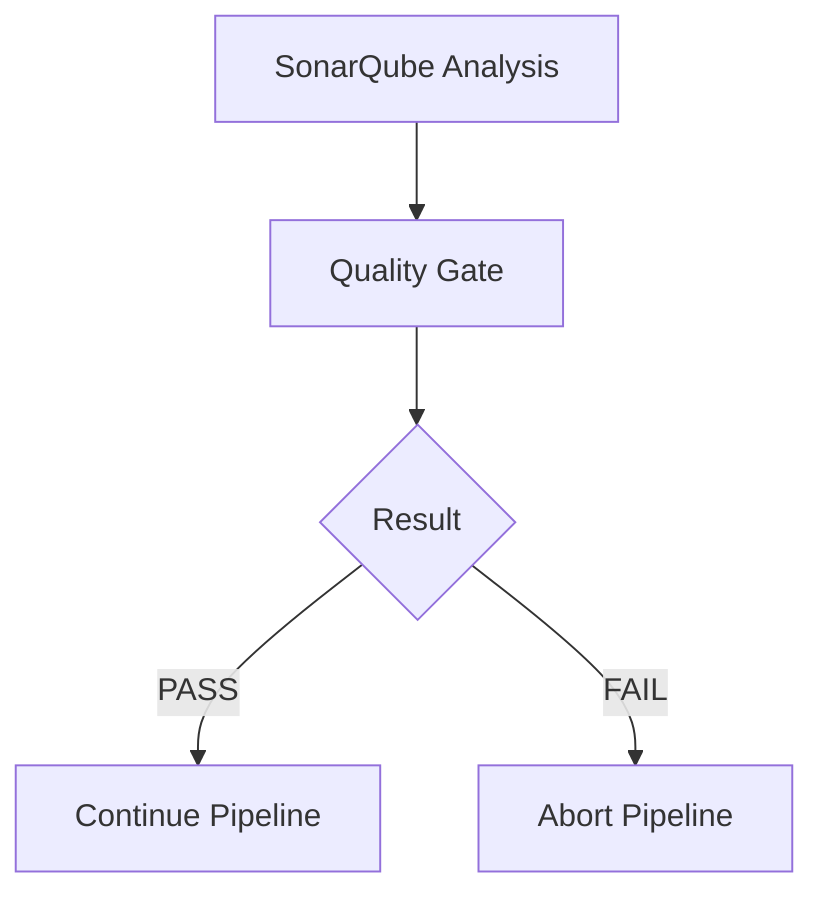

Our Jenkinsfile uses:

```groovy
waitForQualityGate abortPipeline: true
```

So if the Quality Gate fails, the pipeline is aborted.

### Simple interview line

> Jenkins waits for the SonarQube Quality Gate. If it passes, the pipeline continues; otherwise, the pipeline is stopped.

---

# 7. Push Docker Image to Docker Hub

After the tests and Quality Gate pass, Jenkins pushes the Docker image to Docker Hub.

For Build #11:

```text
yuvi2102/todo-app:11
```

The flow is:

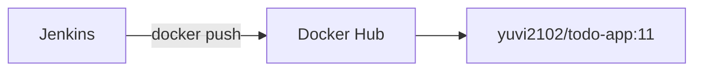

Docker Hub acts as our container image registry.

### Simple interview line

> Once all validations pass, Jenkins pushes the versioned Docker image to Docker Hub.

---

# 8. Jenkins Updates the Kubernetes Manifest

Now we have a Docker image:

```text
yuvi2102/todo-app:11
```

But Kubernetes needs to know which image version it should deploy.

Our Kubernetes Deployment is stored in:

```text
deploy/deploy.yaml
```

Jenkins updates the image tag.

For example:

```yaml
image: yuvi2102/todo-app:10
```

becomes:

```yaml
image: yuvi2102/todo-app:11
```

Jenkins uses:

```bash
sed -i "s|image: yuvi2102/todo-app:.*|image: yuvi2102/todo-app:${BUILD_NUMBER}|" deploy/deploy.yaml
```

Then Jenkins commits the change:

```bash
git add deploy/deploy.yaml
git commit -m "Update Kubernetes image to ${BUILD_NUMBER}"
```

and pushes it to GitHub:

```bash
git push origin HEAD:main
```

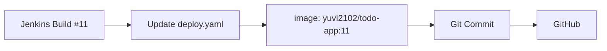

### Simple interview line

> After pushing the image, Jenkins updates the Kubernetes Deployment manifest with the new image tag and pushes that change back to GitHub.

---

# 9. Why Do We Push the Kubernetes Manifest to GitHub?

This is where **GitOps** comes into the project.

Instead of Jenkins directly doing:

```text
Jenkins
   ↓
kubectl apply
   ↓
Kubernetes
```

we use:

```text
Jenkins
   ↓
Update Kubernetes YAML
   ↓
GitHub
   ↓
Argo CD
   ↓
Kubernetes
```

This means Git stores the desired deployment state.

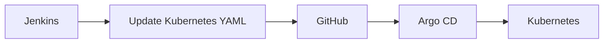

### Simple interview line

> We follow GitOps, so instead of Jenkins directly deploying to Kubernetes, Jenkins updates the Kubernetes manifest in Git, and Argo CD handles the deployment.

---

# 10. Argo CD

Argo CD watches the GitHub repository.

Our Argo CD application is:

```text
todo-app
```

It watches:

```text
Repository:
Yuvii2102/cicd-end-to-end

Branch:
main

Path:
deploy/
```

When the Git manifest changes, Argo CD detects the new desired state.

For example:

```text
GitHub:
yuvi2102/todo-app:11

Kubernetes:
yuvi2102/todo-app:10
```

Argo CD sees:

```text
Desired State ≠ Actual State
```

and synchronizes Kubernetes.

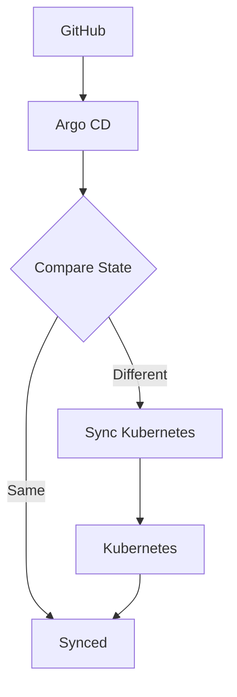

### Simple interview line

> Argo CD continuously watches the Git repository and synchronizes the Kubernetes cluster whenever the desired state changes.

---

# 11. Kubernetes Deploys the Application

After Argo CD synchronizes, Kubernetes deploys the new Docker image.

Our Deployment is:

```text
todo-app
```

It uses:

```yaml
replicas: 3
```

So Kubernetes maintains three Pods.

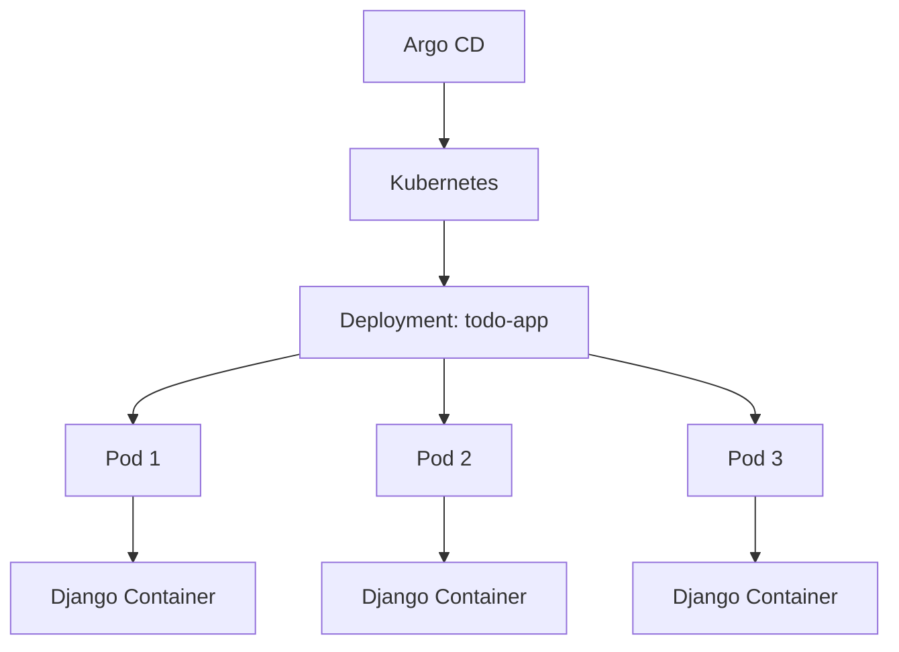

### Simple interview line

> Kubernetes runs the application using a Deployment with three replicas, so three Pods are maintained.

---

# 12. Kubernetes Service

The Pods are not directly exposed to users.

We created:

```text
todo-service
```

The Service is:

```text
NodePort
```

Important ports:

```text
NodePort     = 31000
Service Port = 80
Target Port  = 8000
```

The traffic flow is:

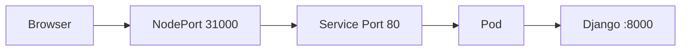

### Simple interview line

> A Kubernetes NodePort Service exposes the Django application and forwards traffic to the Pods on port 8000.

---

# 13. Final Application

After everything is successful, we can access the Django Todo application.

The application showed:

```text
Todo List - Yuvraj
```

This proved that our application change successfully travelled through the entire pipeline.

```mermaid
flowchart LR
    A[Code Change] --> B[GitHub]
    B --> C[Jenkins]
    C --> D[Docker]
    D --> E[Tests]
    E --> F[SonarQube]
    F --> G[Docker Hub]
    G --> H[GitHub Manifest]
    H --> I[Argo CD]
    I --> J[Kubernetes]
    J --> K[Pods]
    K --> L[Service]
    L --> M[Todo List - Yuvraj]
```

---

# Complete CI/CD Process

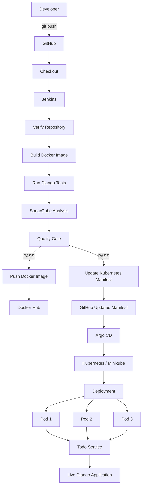

---

# The Most Important Difference: Jenkins vs Argo CD

This is something I should clearly understand before an interview.

## Jenkins

Jenkins handles the **CI and pipeline automation**.

```text
Jenkins
   ↓
Checkout
   ↓
Build
   ↓
Test
   ↓
SonarQube
   ↓
Quality Gate
   ↓
Push Docker Image
   ↓
Update Git Manifest
```

## Argo CD

Argo CD handles **GitOps Continuous Delivery**.

```text
Argo CD
   ↓
Watch Git
   ↓
Compare State
   ↓
Synchronize
   ↓
Kubernetes
```

The easiest way to remember:

> **Jenkins asks: "Is the code ready?"**

> **Argo CD asks: "Is Kubernetes matching Git?"**

---

# Docker vs Kubernetes

Another important interview distinction.

## Docker

Docker packages the application.

```text
Django Application
      ↓
Docker
      ↓
Docker Image
```

Example:

```text
yuvi2102/todo-app:11
```

## Kubernetes

Kubernetes runs and manages the containers.

```text
Docker Image
      ↓
Kubernetes
      ↓
Pods
```

Therefore:

> **Docker packages the application; Kubernetes manages and runs the containers.**

---

# GitHub vs Docker Hub

## GitHub

Stores:

```text
Source Code
Dockerfile
Jenkinsfile
Kubernetes YAML
SonarQube Configuration
```

## Docker Hub

Stores:

```text
Docker Images
```

Example:

```text
yuvi2102/todo-app:11
```

Therefore:

> **GitHub stores code and configuration, while Docker Hub stores container images.**

---

# Deployment vs Pod vs Service

Remember this simple analogy.

### Deployment

The manager:

> "I need three workers."

### Pods

The workers:

> "We are running the application."

### Service

The receptionist:

> "Send incoming traffic to one of the available workers."

So:

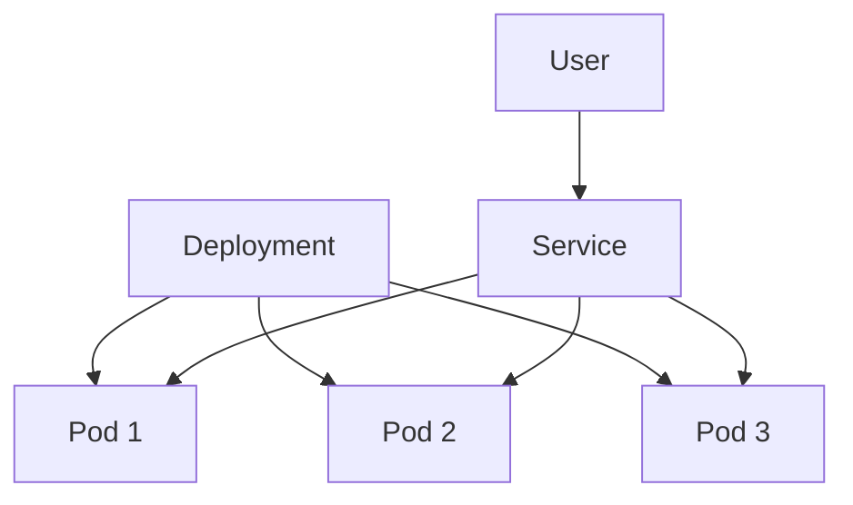

---

# Why Did We Use Versioned Docker Images?

We used Jenkins `BUILD_NUMBER`.

Example:

```text
Build #10 → yuvi2102/todo-app:10

Build #11 → yuvi2102/todo-app:11
```

This makes it easy to identify which build is running.

The traceability is:

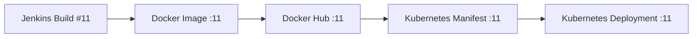

---

# Why Not Use `latest`?

If we use:

```text
latest
```

it is difficult to know exactly which Jenkins build created the image.

With:

```text
:10
:11
:12
```

we can clearly identify the version.

Therefore:

> Versioned image tags provide better traceability.

---

# What Happens If Tests Fail?

The pipeline stops.

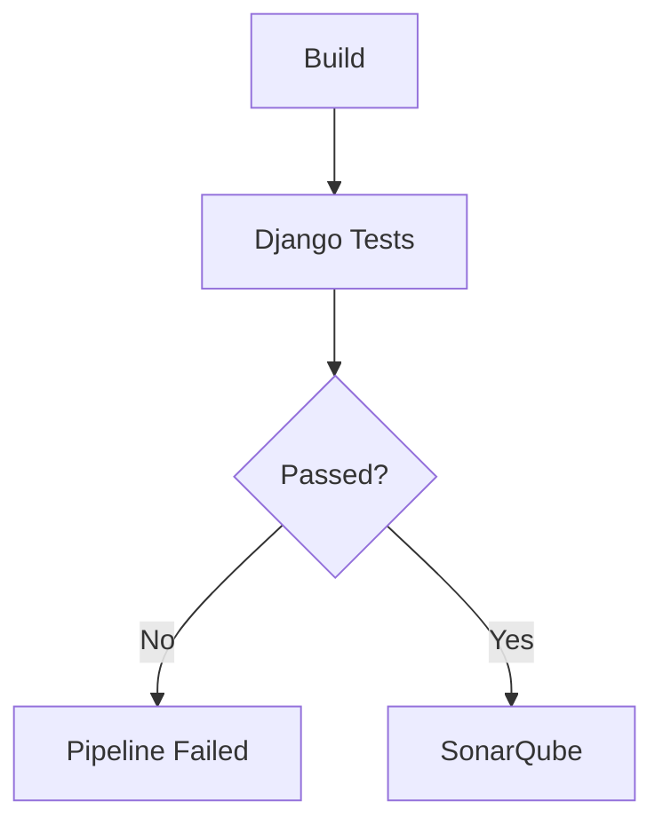

We don't want a broken application to continue through the rest of the pipeline.

---

# What Happens If SonarQube Quality Gate Fails?

The pipeline also stops.

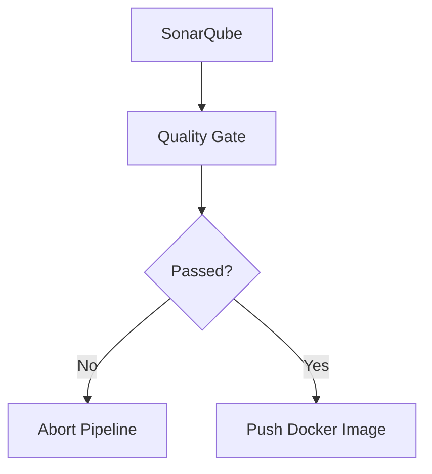

Our Jenkinsfile contains:

```groovy
waitForQualityGate abortPipeline: true
```

---

# Real Example From Our Project

We successfully reached Docker image version:

```text
yuvi2102/todo-app:11
```

The flow was:

```text
Jenkins Build #11
       ↓
Docker Image :11
       ↓
Django Tests PASS
       ↓
SonarQube PASS
       ↓
Quality Gate PASS
       ↓
Docker Hub :11
       ↓
deploy.yaml updated to :11
       ↓
GitHub
       ↓
Argo CD
       ↓
Kubernetes
       ↓
3 Pods
       ↓
Service
       ↓
Todo List - Yuvraj
```

---

# Important Troubleshooting Experience

One useful issue we faced was that GitHub showed:

```text
yuvi2102/todo-app:11
```

while Kubernetes was temporarily still running:

```text
yuvi2102/todo-app:10
```

This was a good example of how GitOps works.

We verified GitHub using:

```bash
git show origin/main:deploy/deploy.yaml | grep "image:"
```

It showed:

```text
image: yuvi2102/todo-app:11
```

Therefore Jenkins had successfully updated Git.

The remaining issue was synchronization between:

```text
GitHub
   ↓
Argo CD
   ↓
Kubernetes
```

We forced an Argo CD refresh:

```bash
kubectl -n argocd annotate application todo-app argocd.argoproj.io/refresh=hard --overwrite
```

After that, Kubernetes updated to:

```text
yuvi2102/todo-app:11
```

This taught us an important troubleshooting principle:

> Always identify which part of the pipeline has the problem instead of assuming the entire pipeline failed.

---

# Another Problem We Solved — Jenkins Git Push

Jenkins initially failed with:

```text
error: src refspec main does not match any
```

The reason was that Jenkins was working with a detached HEAD.

Instead of:

```bash
git push origin main
```

we used:

```bash
git push origin HEAD:main
```

This means:

```text
Current Jenkins commit
        ↓
Remote main branch
```

This fixed the Jenkins Git push.

---

# Final Verification

After the pipeline completed, we verified the Kubernetes deployment.

Check Pods:

```bash
kubectl get pods
```

We had three running Pods.

Check Deployment:

```bash
kubectl get deployments
```

Check Service:

```bash
kubectl get svc
```

Check the running image:

```bash
kubectl get deployment todo-app -o jsonpath='{.spec.template.spec.containers[0].image}'
```

Expected:

```text
yuvi2102/todo-app:11
```

Check rollout:

```bash
kubectl rollout status deployment/todo-app
```

Expected:

```text
deployment "todo-app" successfully rolled out
```

---

# Final Project Flow to Memorize

If I forget everything, remember this:

```text
DEVELOPER
    ↓
GITHUB
    ↓
JENKINS
    ↓
BUILD
    ↓
TEST
    ↓
SONARQUBE
    ↓
QUALITY GATE
    ↓
DOCKER HUB
    ↓
UPDATE KUBERNETES YAML
    ↓
GITHUB
    ↓
ARGO CD
    ↓
KUBERNETES
    ↓
3 PODS
    ↓
SERVICE
    ↓
DJANGO APPLICATION
```

---

# One-Line Explanation

> **GitHub stores the code, Jenkins builds and validates it, Docker packages it, Docker Hub stores the image, Jenkins updates the Kubernetes configuration in GitHub, Argo CD deploys the Git state, and Kubernetes runs the application.**

---

# 30-Second Interview Answer

> **"Yes. I implemented an end-to-end CI/CD pipeline for a Django Todo application. The code is stored in GitHub, and Jenkins handles the CI process. Jenkins checks out the code, builds a Docker image, runs Django tests, performs SonarQube analysis and validates the Quality Gate. Once everything passes, Jenkins pushes a versioned Docker image to Docker Hub and updates the Kubernetes Deployment manifest in GitHub. We follow GitOps, so Argo CD watches the Git repository and synchronizes the desired state with Kubernetes. Kubernetes then deploys the application using three replicas, and a NodePort Service exposes the application to users."**

---

# 10-Second Version

If the interviewer wants a very short answer:

> **"My CI/CD flow is GitHub → Jenkins → Docker Build → Tests → SonarQube → Quality Gate → Docker Hub → GitHub Manifest → Argo CD → Kubernetes → Pods → Service → Application."**

---

# Final Mental Model

Remember these seven statements:

```text
1. GitHub stores my code.

2. Jenkins automates my CI pipeline.

3. Docker packages my application.

4. Docker Hub stores my Docker image.

5. GitHub stores my desired Kubernetes configuration.

6. Argo CD synchronizes Git with Kubernetes.

7. Kubernetes runs my application.
```

And the complete project becomes:

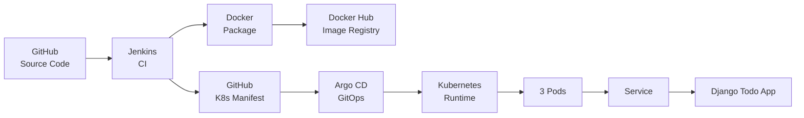

# Final Answer I Should Give in an Interview

> **"I implemented an end-to-end CI/CD and GitOps pipeline for a Django Todo application. The developer pushes code to GitHub, Jenkins checks out the code and performs the CI process by building the Docker image, running Django tests, performing SonarQube analysis and validating the Quality Gate. Once all checks pass, Jenkins pushes a versioned image to Docker Hub and updates the Kubernetes Deployment manifest in GitHub. Argo CD monitors that Git repository and follows the GitOps approach, so it detects the manifest change and synchronizes the Kubernetes cluster. Kubernetes then deploys the new image with three replicas, and a NodePort Service exposes the application. This gives us an automated flow from source code to a running application."**
