# CI/CD Pipeline — Interview Prep

## 1. Can you explain the CI/CD process in your current project or can you talk about any CI/CD process that you have implemented?

### A:

> **"Yes. In my current project, I implemented an end-to-end CI/CD pipeline for a Django Todo application using Jenkins, Docker, SonarQube, Docker Hub, Kubernetes and Argo CD.**
>
> **The process starts when a developer pushes the code to GitHub. Jenkins checks out the latest code and first verifies the repository. Then Jenkins builds a Docker image of the Django application using the Dockerfile. After that, it runs the Django test cases inside the Docker container.**
>
> **Once the tests pass, Jenkins performs static code analysis using SonarQube and waits for the Quality Gate. If the Quality Gate passes, Jenkins pushes the versioned Docker image to Docker Hub.**
>
> **After pushing the image, Jenkins updates the Kubernetes deployment manifest with the new Docker image tag and pushes that change back to GitHub. Then Argo CD detects the change in Git and synchronizes the desired state with our Kubernetes cluster. Kubernetes deploys the new image using a Deployment with three replicas. Finally, a NodePort Service exposes the application, and we can access the running Django Todo application.**
>
> **So the overall flow is: GitHub → Jenkins → Build → Test → SonarQube → Quality Gate → Docker Hub → Update Kubernetes Manifest → GitHub → Argo CD → Kubernetes → Pods → Service → Application."**

---

# CI/CD Architecture

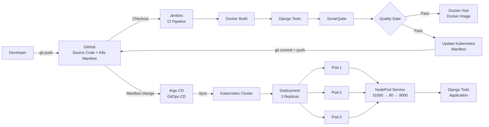

---

# Understand What You Are Saying

## Step 1 — Developer → GitHub

I make a change in my Django application and push it to GitHub.

For example:

```text
Todo List - Abhishek
```

became:

```text
Todo List - Yuvraj
```

GitHub is where our **source code and Kubernetes configuration** are stored.

---

## Step 2 — GitHub → Jenkins

Jenkins checks out the latest code.

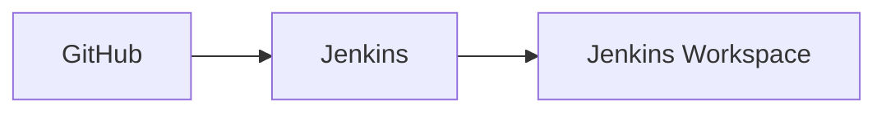

Now Jenkins has the project files and can start the CI process.

---

## Step 3 — Jenkins Builds Docker Image

Jenkins executes:

```bash
docker build -t todo-app:${BUILD_NUMBER} .
```

For example, Build #11 creates:

```text
todo-app:11
```

Then it is tagged:

```text
yuvi2102/todo-app:11
```

We use the Jenkins build number so every build has a **traceable version**.

---

## Step 4 — Jenkins Runs Tests

Jenkins runs:

```bash
docker run --rm todo-app:${BUILD_NUMBER} python manage.py test
```

Our Django test verifies that a Todo can be created correctly.

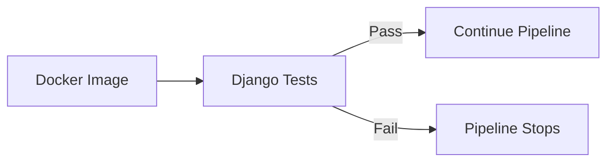

If the test fails:

```text
Pipeline STOP ❌
```

If it passes:

```text
Continue ✅
```

---

## Step 5 — SonarQube

After the tests pass, Jenkins performs static code analysis using SonarQube.

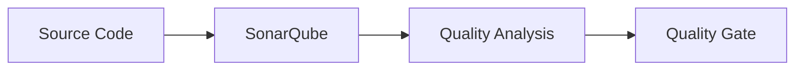

The **Quality Gate acts as a checkpoint**.

If the Quality Gate fails, the pipeline stops.

If it passes, Jenkins continues.

Our successful builds passed the Quality Gate.

---

## Step 6 — Push Image to Docker Hub

After validation passes, Jenkins pushes:

```text
yuvi2102/todo-app:11
```

to Docker Hub.

Think of Docker Hub as the **warehouse where our Docker images are stored**.

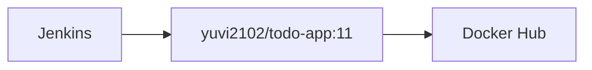

---

## Step 7 — Update Kubernetes Manifest

Now Jenkins changes:

```yaml
image: yuvi2102/todo-app:10
```

to:

```yaml
image: yuvi2102/todo-app:11
```

Then Jenkins commits and pushes that change to GitHub.

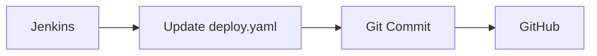

This is important because **we are following GitOps**.

Git becomes the **source of truth for the Kubernetes deployment configuration**.

---

## Step 8 — Argo CD

Argo CD watches the GitHub repository.

For example:

```text
Git says       → :11
Kubernetes has → :10
```

Argo CD detects the difference and synchronizes Kubernetes.

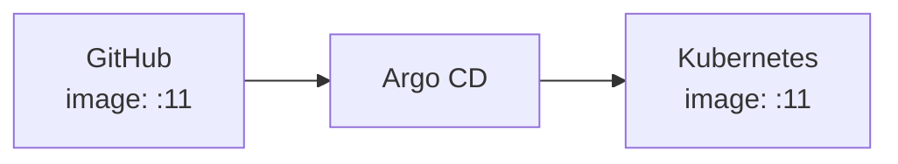

This is the **GitOps deployment part** of the project.

---

## Step 9 — Kubernetes

Kubernetes receives the desired configuration and deploys:

```text
yuvi2102/todo-app:11
```

Our Deployment contains:

```yaml
replicas: 3
```

So Kubernetes maintains three Pods.

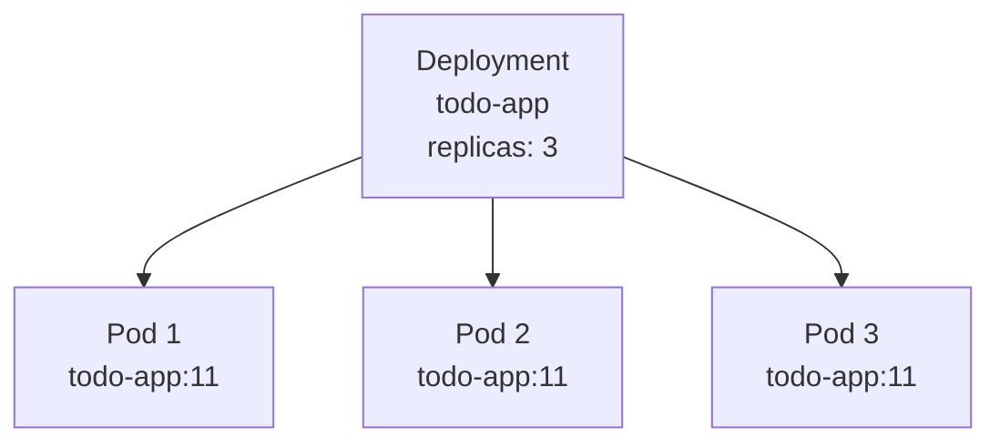

The Deployment is responsible for maintaining the desired number of Pods.

---

## Step 10 — Service → Application

The Django application runs inside the Pods on:

```text
Port 8000
```

Our Kubernetes Service uses:

```text
NodePort: 31000
Service Port: 80
Target Port: 8000
```

Traffic flows like this:

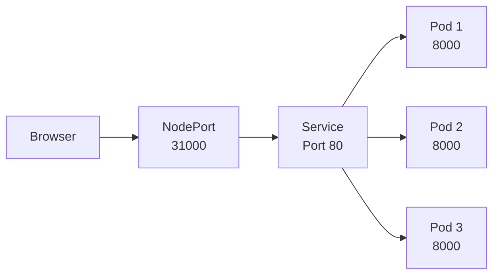

The Service provides a stable way to reach the application Pods.

---

# The Key Difference You MUST Remember

## What exactly does Jenkins do?

Say:

> **"Jenkins handles the CI part — checkout, build, testing, SonarQube analysis, Quality Gate, Docker image push, and updating the Kubernetes manifest in GitHub."**

## Then what does Argo CD do?

Say:

> **"Argo CD handles the GitOps deployment part. It watches the Kubernetes manifests in GitHub and synchronizes the desired state with the Kubernetes cluster."**

This shows the interviewer that you understand **why both Jenkins and Argo CD are used**.

---

# Easy Way to Memorize

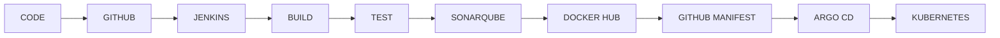

### Your Interview Mental Model

> **GitHub stores → Jenkins validates → Docker packages → Docker Hub stores → GitHub defines deployment → Argo CD deploys → Kubernetes runs.**

---

# 2. What are the different ways to trigger Jenkins pipelines?

### A:

This can be done in multiple ways. To briefly explain the different options:

- **Poll SCM:** Jenkins can periodically check the Git repository for changes. If changes are detected, Jenkins automatically starts the build. This can be configured in the **Build Triggers** section of a Jenkins job.

- **Git / Build Triggers:** Jenkins can be configured with a Git repository and branch using the Git plugin. Jenkins can monitor the repository and trigger a build when new changes are detected.

- **Webhooks:** A webhook can be configured in GitHub to notify Jenkins whenever code is pushed to the repository. Jenkins then automatically starts the pipeline with the updated code.

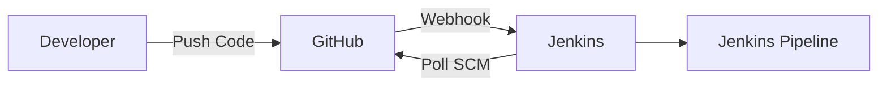

### Easy Interview Explanation

> **"There are multiple ways to trigger Jenkins pipelines. We can use Poll SCM, where Jenkins periodically checks the repository for changes. We can also configure Git-based build triggers to monitor a repository and branch. Another common approach is using webhooks, where GitHub notifies Jenkins whenever code is pushed, and Jenkins automatically starts the pipeline."**

### Simple Memory Trick

```text
Poll SCM     → Jenkins checks GitHub
Git Trigger  → Jenkins monitors repository
Webhook      → GitHub tells Jenkins
```

### Most Common in CI/CD

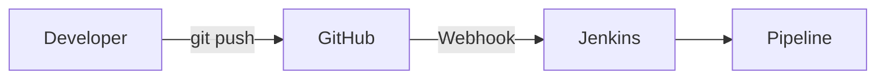

> **GitHub Push → Webhook → Jenkins → Pipeline**

---

# 3. How to backup Jenkins?

### A:

Backing up Jenkins is a very easy process. There are multiple default and configured files and folders in Jenkins that you might want to back up.

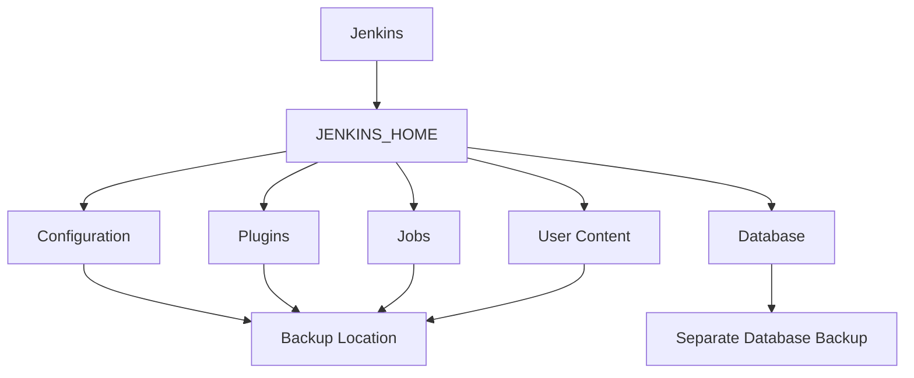

- **Configuration:** The `~/.jenkins` folder. You can use a tool like `rsync` to back up the entire directory to another location.

- **Plugins:** Back up the plugins installed in Jenkins by copying the `plugins` directory located in `JENKINS_HOME/plugins` to another location.

- **Jobs:** Back up Jenkins jobs by copying the `jobs` directory located in `JENKINS_HOME/jobs` to another location.

- **User Content:** If you have added any custom content, such as build artifacts, scripts, or job configurations, to the Jenkins environment, make sure to back those up as well.

- **Database Backup:** If you are using a database to store information such as build results, you will need to back up the database separately. This typically involves using a database backup tool, such as `mysqldump` for MySQL, to export the data to another location.

## Easy Interview Explanation

> **"Jenkins backup mainly involves backing up the JENKINS_HOME directory because it contains important Jenkins configuration, plugins, jobs, and other data. We can use tools like rsync to copy the directory to another backup location. If Jenkins uses an external database, that database should be backed up separately using the appropriate database backup tool."**

## Simple Memory Trick

```text
JENKINS_HOME
     │
     ├── Configuration
     ├── Plugins
     ├── Jobs
     ├── User Content
     └── Database → Backup Separately
```

> **JENKINS_HOME → Configuration + Plugins + Jobs + User Content**
>
> **External Database → Separate Database Backup**

---

# 4. How do you store/secure/handle secrets in Jenkins?

### A:

Again, there are multiple ways to achieve this. Let me give you a brief explanation of the possible options.

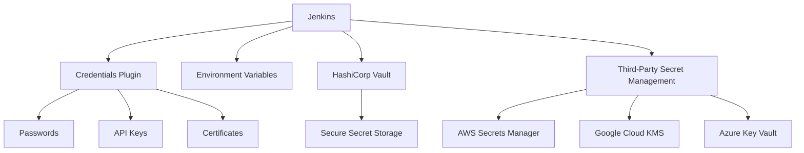

- **Credentials Plugin:** Jenkins provides a Credentials Plugin that can be used to store secrets such as passwords, API keys, and certificates. The secrets are encrypted and stored securely within Jenkins and can be retrieved in build scripts or used by other plugins.

- **Environment Variables:** Secrets can be stored as environment variables in Jenkins and referenced in build scripts. However, this method is less secure because environment variables may be exposed in build logs or the build environment.

- **HashiCorp Vault:** Jenkins can be integrated with HashiCorp Vault, which is a secure secrets management tool. Vault can be used to store and manage sensitive information, and Jenkins can retrieve the secrets when they are needed for builds.

- **Third-Party Secret Management Tools:** Jenkins can also be integrated with third-party secret management tools such as **AWS Secrets Manager, Google Cloud Key Management Service, and Azure Key Vault**.

## Easy Interview Explanation

> **"There are multiple ways to handle secrets in Jenkins. The most common approach is to use the Jenkins Credentials Plugin, where we securely store passwords, API keys, SSH keys, or certificates and access them when required by the pipeline. We can also use environment variables, although they are less secure if not handled properly. For larger environments, Jenkins can be integrated with external secret management tools like HashiCorp Vault, AWS Secrets Manager, or Azure Key Vault."**

## Simple Memory Trick

```text
Jenkins Secrets
      │
      ├── Credentials Plugin → Common Jenkins approach
      ├── Environment Variables → Less secure
      ├── HashiCorp Vault → External secret management
      └── Cloud Secret Managers
              ├── AWS Secrets Manager
              ├── Google Cloud KMS
              └── Azure Key Vault
```

### One-Line Answer

> **"For Jenkins secrets, I prefer the Credentials Plugin for Jenkins-managed secrets, and for larger production environments I would use an external secret manager such as HashiCorp Vault or AWS Secrets Manager."**

---

# 5. What is the latest version of Jenkins or which version of Jenkins are you using?

### A:

This is a simple question interviewers may ask to understand whether you are actually using Jenkins in your day-to-day work.

For your project, you can answer based on the version you are actually using:

> **"I am currently using Jenkins version 2.568.3 in my project."**

If they ask about the latest Jenkins version, make sure you verify the current version before answering because Jenkins releases change over time.

---

# 6. What are Shared Modules in Jenkins?

### A:

Shared modules in Jenkins refer to a collection of **reusable code and resources** that can be shared across multiple Jenkins jobs.

They help with:

- Easier maintenance
- Reduced code duplication
- Consistency across multiple build processes

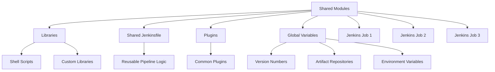

### Examples of Shared Modules

- **Libraries:** Custom Java libraries, shell scripts, and other resources that can be reused across multiple jobs.

- **Jenkinsfile:** A shared Jenkinsfile can be used to define the build process for multiple jobs. This reduces duplication and makes it easier to manage pipeline logic across projects.

- **Plugins:** Common plugins can be installed once and reused across multiple Jenkins jobs, reducing the overhead of managing plugins individually.

- **Global Variables:** Shared global variables can be defined and used across multiple jobs. For example, common build parameters such as version numbers, artifact repositories, and environment variables.

## Easy Interview Explanation

> **"Shared modules in Jenkins are reusable code and resources that can be used across multiple Jenkins jobs. They help us avoid duplication and maintain consistency. For example, we can have shared libraries, reusable Jenkins pipeline code, common plugins, and global variables that can be used by multiple jobs."**

## Simple Memory Trick

```text
Shared Modules
      │
      ├── Libraries
      ├── Jenkinsfile / Pipeline Logic
      ├── Plugins
      └── Global Variables
```

### One-Line Answer

> **"Shared modules allow us to reuse common Jenkins code and resources across multiple jobs, which reduces duplication and makes pipeline maintenance easier."**

---

# 7. Can you use Jenkins to build applications with multiple programming languages using different agents in different stages?

### A:

Yes. Jenkins can be used to build applications with multiple programming languages by using **different build agents in different stages** of the build process.

Jenkins supports multiple build agents, which can run jobs on different platforms and with different configurations.

By using different agents for different stages, we can make sure that the **required programming language, tools, libraries, and dependencies** are available for each stage.

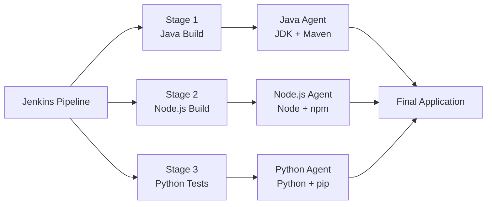

### Example

For example:

```text
Java Application
      ↓
Java Agent
JDK + Maven
```

and:

```text
Node.js Application
      ↓
Node.js Agent
Node.js + npm
```

Each agent can have a different:

- Operating system
- Programming language version
- Libraries
- Build tools
- Required dependencies

## Different Agents in Different Stages

A Jenkins pipeline can define different agents for different stages.

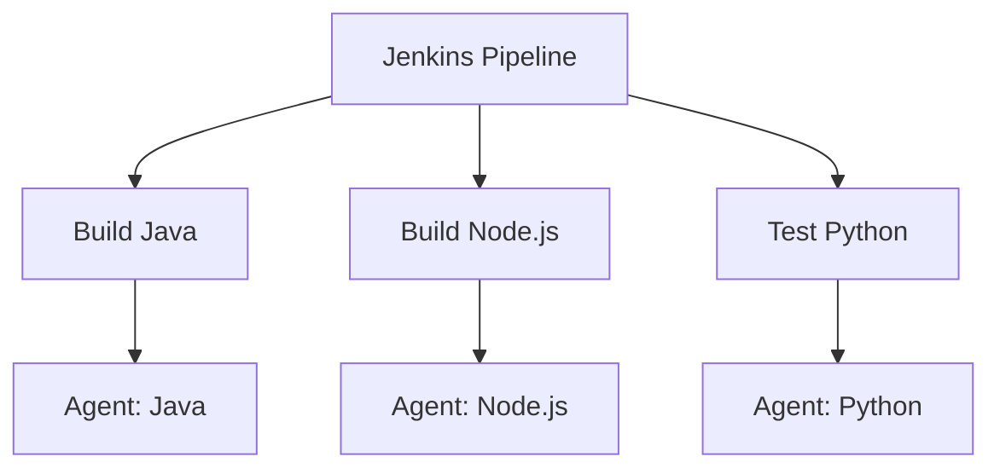

This allows Jenkins to choose the appropriate environment for each stage.

## Jenkins Plugins

Jenkins also provides a wide range of plugins that support different programming languages, build tools, testing frameworks, and deployment tools.

This makes it easier to integrate different parts of the build process and manage the dependencies required for each stage.

## Easy Interview Explanation

> **"Yes. Jenkins supports multiple build agents, so we can use different agents for different stages of a pipeline. For example, we can use a Java agent with JDK and Maven to build Java code, and a Node.js agent with Node and npm to build a Node.js application. Each agent can have its own operating system, programming language version, libraries, and tools. This makes Jenkins flexible enough to handle applications with multiple programming languages."**

## Simple Memory Trick

```text
Jenkins Pipeline
      │
      ├── Java Stage
      │      ↓
      │   Java Agent
      │
      ├── Node.js Stage
      │      ↓
      │   Node.js Agent
      │
      └── Python Stage
             ↓
          Python Agent
```

> **Different stages → Different agents → Different tools and languages**

---

# 8. How to set up Auto Scaling Group for Jenkins in AWS?

### A:

Here is a high-level overview of how to set up an **Auto Scaling Group (ASG)** for Jenkins in AWS:

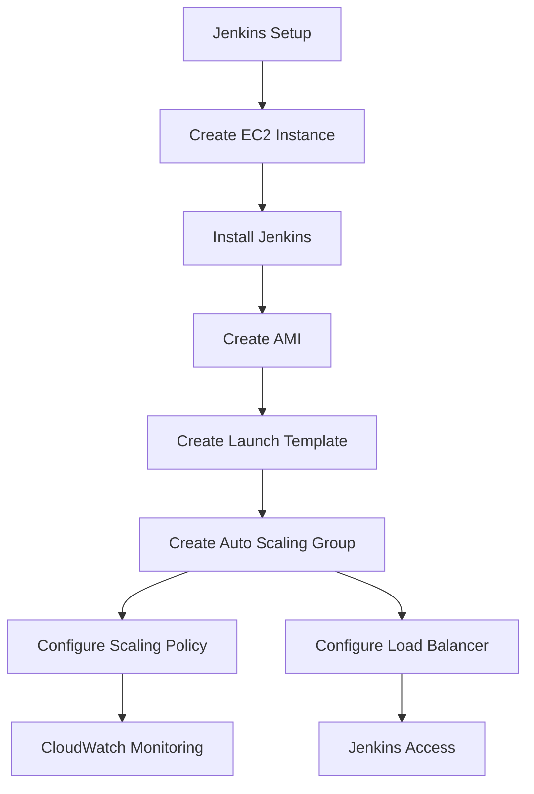

### 1. Launch EC2 Instance

Create an **EC2 instance** with the required configuration and install Jenkins on it.

This instance will be used as the **base image** for the Auto Scaling Group.

```text
EC2 Instance
     ↓
Install Jenkins
     ↓
Configure Jenkins
     ↓
Create AMI
```

### 2. Create Launch Configuration / Launch Template

Create a launch configuration or launch template that specifies:

- EC2 instance type
- Jenkins AMI
- Storage
- Security groups
- Key pair
- Other required configurations

> **Note:** In modern AWS setups, **Launch Templates** are generally used instead of the older Launch Configuration approach.

### 3. Create Auto Scaling Group

Create an Auto Scaling Group and associate it with the launch template.

Specify:

```text
Desired Capacity → Number of instances normally required
Minimum Capacity → Minimum instances
Maximum Capacity → Maximum instances
```

For example:

```text
Minimum → 1
Desired → 2
Maximum → 4
```

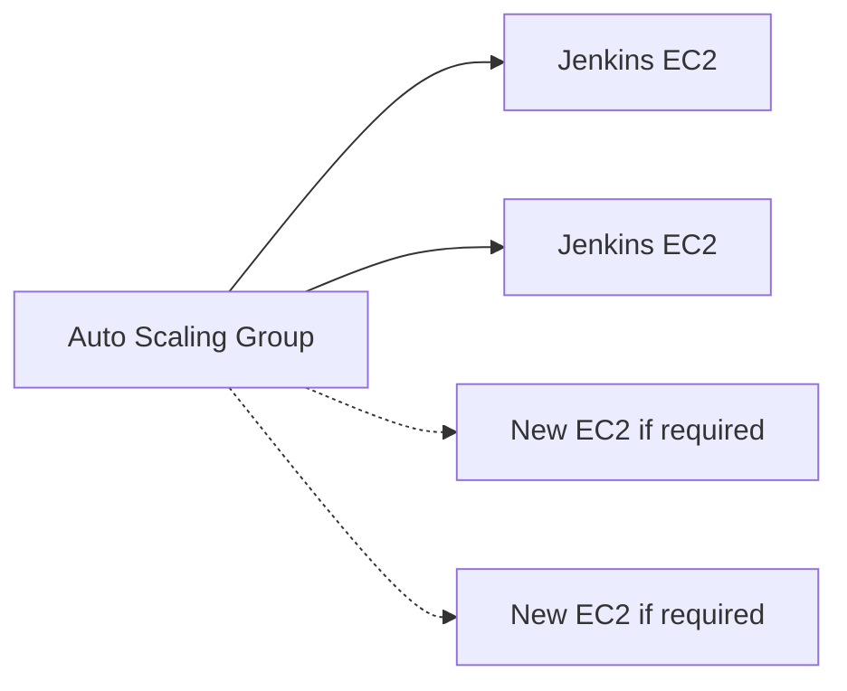

### 4. Configure Scaling Policy

Configure a scaling policy to determine when EC2 instances should be added or removed.

This can be based on metrics such as:

- CPU utilization
- Request count
- Other CloudWatch metrics

For example:

```text
High Load
   ↓
Scaling Policy
   ↓
Add EC2 Instance
```

When the load decreases:

```text
Low Load
   ↓
Scaling Policy
   ↓
Remove EC2 Instance
```

### 5. Configure Load Balancer

Create an **Elastic Load Balancer (ELB)** and configure it to forward traffic to the instances in the Auto Scaling Group.

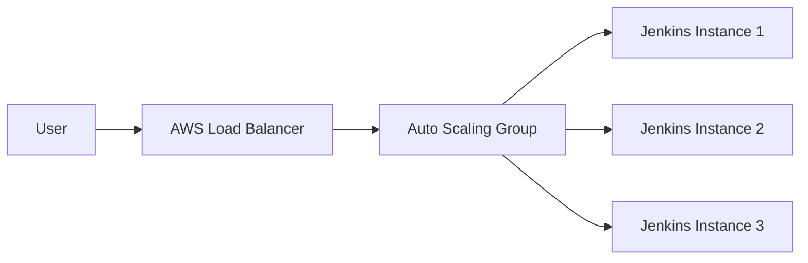

### 6. Connect to Jenkins

Users can access Jenkins through the **Load Balancer endpoint**.

```text
User
 ↓
Load Balancer
 ↓
Jenkins EC2 Instance
 ↓
Jenkins
```

### 7. Monitor Using CloudWatch

Use **Amazon CloudWatch** to monitor the EC2 instances and Auto Scaling Group.

CloudWatch can monitor metrics such as:

```text
CPU Utilization
Instance Health
Load
Scaling Activity
```

```mermaid
flowchart LR
    EC2["EC2 Instances"] --> CW["CloudWatch"]
    CW --> POLICY["Scaling Policy"]
    POLICY --> ASG["Auto Scaling Group"]
    ASG --> EC2
```

## Easy Interview Explanation

> **"To set up Auto Scaling for Jenkins in AWS, first I create and configure an EC2 instance with Jenkins and use it as the base image. Then I create a Launch Template using that AMI and create an Auto Scaling Group with minimum, desired, and maximum capacity. I configure scaling policies based on metrics such as CPU utilization and use a Load Balancer to distribute traffic. Finally, I use CloudWatch to monitor the instances and scaling activities."**

## Simple Memory Trick

```text
EC2 + Jenkins
      ↓
     AMI
      ↓
Launch Template
      ↓
Auto Scaling Group
      ↓
Scaling Policy
      ↓
Load Balancer
      ↓
CloudWatch
```

> **EC2 → AMI → Launch Template → Auto Scaling Group → Scaling Policy → Load Balancer → CloudWatch**

---

# 9. How to add a new worker node in Jenkins?

### A:

To add a new worker node in Jenkins:

1. Log in to the **Jenkins master/controller**.
2. Go to **Manage Jenkins → Manage Nodes**.
3. Click **New Node**.
4. Enter a name for the new node.
5. Select **Permanent Agent**.
6. Configure the connection method, such as **SSH**.
7. Configure the required details for the worker node.
8. Click **Launch**.

```mermaid
flowchart LR
    A["Jenkins Controller"] --> B["Manage Jenkins"]
    B --> C["Manage Nodes"]
    C --> D["New Node"]
    D --> E["Permanent Agent"]
    E --> F["Configure SSH"]
    F --> G["Launch"]
    G --> H["Worker Node"]
```

## Easy Interview Explanation

> **"To add a new worker node, I go to Manage Jenkins, then Manage Nodes, and select New Node. I provide the node name, select Permanent Agent, configure the SSH connection, and launch the agent."**

---

# 10. How to add a new plugin in Jenkins?

### A:

There are two common ways to install a Jenkins plugin.

### 1. Using CLI

We can install a plugin using the Jenkins CLI:

```bash
java -jar jenkins-cli.jar install-plugin <PLUGIN_NAME>
```

For example:

```bash
java -jar jenkins-cli.jar install-plugin git
```

### 2. Using Jenkins UI

We can install a plugin from the Jenkins UI:

1. Click **Manage Jenkins**.
2. Click **Manage Plugins**.
3. Go to the **Available Plugins** section.
4. Search for the required plugin.
5. Select the plugin.
6. Click **Install**.

```mermaid
flowchart TD
    A["Jenkins"] --> B{"Install Plugin"}

    B -->|"CLI"| C["jenkins-cli.jar"]
    C --> D["install-plugin <PLUGIN_NAME>"]

    B -->|"UI"| E["Manage Jenkins"]
    E --> F["Manage Plugins"]
    F --> G["Available Plugins"]
    G --> H["Search Plugin"]
    H --> I["Install"]
```

## Easy Interview Explanation

> **"We can install Jenkins plugins either through the Jenkins CLI or through the UI. From the UI, we go to Manage Jenkins, then Manage Plugins, search for the required plugin under Available Plugins, and install it."**

## Simple Memory Trick

### Add Worker Node

```text
Manage Jenkins
      ↓
Manage Nodes
      ↓
New Node
      ↓
Permanent Agent
      ↓
SSH
      ↓
Launch
```

### Add Plugin

```text
CLI → jenkins-cli.jar → install-plugin

OR

UI → Manage Jenkins → Manage Plugins → Search → Install
```

---

# 11. What is JNLP and why is it used in Jenkins?

### A:

**JNLP (Java Network Launch Protocol)** is used in Jenkins to allow **agents (worker nodes)** to connect to and be managed by the Jenkins controller remotely.

This allows Jenkins to distribute build tasks across multiple agents, which helps with **scalability and performance**.

```mermaid
flowchart LR
    M["Jenkins Controller"]

    M -->|"JNLP Connection"| A1["Agent 1"]
    M -->|"JNLP Connection"| A2["Agent 2"]
    M -->|"JNLP Connection"| A3["Agent 3"]

    A1 --> T1["Build Task"]
    A2 --> T2["Build Task"]
    A3 --> T3["Build Task"]

    T1 --> M
    T2 --> M
    T3 --> M
```

## How it works

When a Jenkins agent is launched using JNLP:

```text
Jenkins Controller
       ↓
   JNLP Connection
       ↓
   Jenkins Agent
       ↓
 Receives Build Task
       ↓
 Executes Build
       ↓
 Sends Result Back
       ↓
Jenkins Controller
```

The agent connects to the Jenkins controller and receives build tasks. It executes those tasks and sends the build results back to the controller, where they can be viewed in the Jenkins UI.

## Why is JNLP used?

JNLP allows Jenkins to:

- Connect agents remotely
- Distribute build workloads
- Run builds on multiple agents
- Improve scalability
- Improve build performance

```mermaid
flowchart TD
    J["Jenkins Controller"]
    J --> A["Multiple Jenkins Agents"]

    A --> B["Distribute Build Tasks"]
    B --> C["Parallel / Faster Builds"]
    C --> D["Better Scalability"]
```

## Easy Interview Explanation

> **"JNLP is used in Jenkins to connect agents to the Jenkins controller remotely. When an agent connects using JNLP, the controller can assign build tasks to that agent. The agent executes the tasks and sends the results back to the controller. This allows Jenkins to distribute workloads across multiple agents and improves scalability and performance."**

## Simple Memory Trick

```text
JNLP
 ↓
Agent connects to Controller
 ↓
Controller assigns Build
 ↓
Agent executes Build
 ↓
Result sent back
```

> **JNLP = Remote connection between Jenkins Controller and Agent**

---

# 12. What are some of the common plugins that you use in Jenkins?

### A:

There are many plugins available in Jenkins. Some of the common plugins I have worked with are:

- **Git Plugin:** Used to integrate Jenkins with Git repositories such as GitHub and to checkout source code.

- **Pipeline Plugin:** Used to create and run CI/CD pipelines using a `Jenkinsfile`.

- **Docker Pipeline Plugin:** Used to build, run, and work with Docker containers and images from Jenkins pipelines.

- **SonarQube Scanner Plugin:** Used to integrate Jenkins with SonarQube for static code analysis and Quality Gate checks.

- **Credentials Binding Plugin:** Used to securely access stored credentials such as passwords, tokens, and other secrets inside Jenkins pipelines.

```mermaid
flowchart TD
    J["Jenkins"]

    J --> G["Git Plugin"]
    J --> P["Pipeline Plugin"]
    J --> D["Docker Pipeline Plugin"]
    J --> S["SonarQube Scanner Plugin"]
    J --> C["Credentials Binding Plugin"]

    G --> G1["Checkout Source Code"]
    P --> P1["CI/CD Pipeline"]
    D --> D1["Build Docker Image"]
    S --> S1["Code Quality Analysis"]
    C --> C1["Secure Credentials"]
```

## Easy Interview Explanation

> **"Some common Jenkins plugins I use are the Git plugin for checking out source code from GitHub, the Pipeline plugin for creating CI/CD pipelines using Jenkinsfiles, the Docker Pipeline plugin for working with Docker images and containers, and the SonarQube Scanner plugin for code quality analysis and Quality Gates. I also use the Credentials Binding plugin to securely handle credentials in pipelines."**

## Simple Memory Trick

Remember these 5:

```text
Git
 ↓
Pipeline
 ↓
Docker
 ↓
SonarQube
 ↓
Credentials
```

### One-Line Answer

> **"The main plugins I use are Git, Pipeline, Docker Pipeline, SonarQube Scanner, and Credentials Binding."**
