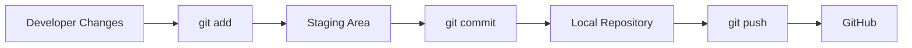
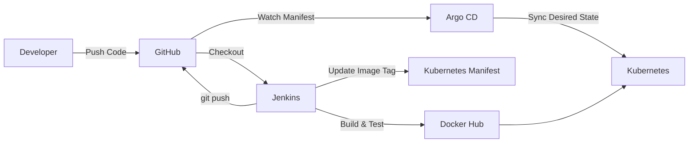
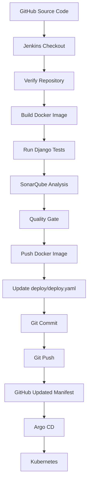
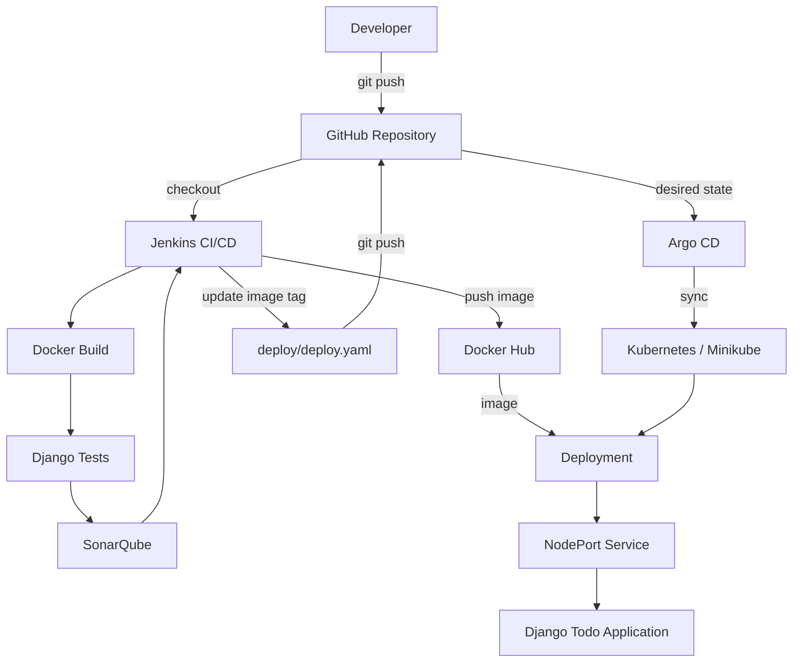
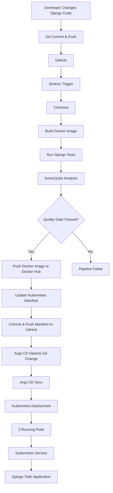

<h1 align="center">End-to-End CI/CD Project</h1>

## 1. Project Overview

This project is an end-to-end CI/CD and GitOps implementation for a Django Todo application.

The goal was to automate the complete application delivery process:

```text
Developer
    ↓
GitHub
    ↓
Jenkins
    ↓
Build Docker Image
    ↓
Run Django Tests
    ↓
SonarQube Analysis
    ↓
Quality Gate
    ↓
Push Docker Image to Docker Hub
    ↓
Update Kubernetes Manifest
    ↓
Push Manifest to GitHub
    ↓
Argo CD
    ↓
Kubernetes
    ↓
Running Application
```

---

# 2. Technologies Used

| Technology | Purpose |
|---|---|
| Git | Version control |
| GitHub | Source code repository |
| Jenkins | CI/CD automation |
| Docker | Containerization |
| Docker Hub | Container image registry |
| SonarQube | Code quality analysis |
| Kubernetes | Container orchestration |
| Minikube | Local Kubernetes cluster |
| Argo CD | GitOps continuous delivery |
| Django | Application |
| PostgreSQL | SonarQube database |

---

# 3. Project Repository

GitHub repository:

```text
Yuvii2102/cicd-end-to-end
```

Repository:

```text
https://github.com/Yuvii2102/cicd-end-to-end
```

The project contains:

```text
cicd-end-to-end/
│
├── Dockerfile
├── Jenkinsfile
├── README.md
├── db.sqlite3
├── manage.py
├── sonar-project.properties
│
├── staticfiles/
│
├── todoApp/
│
├── todos/
│
└── deploy/
    ├── deploy.yaml
    ├── service.yaml
    └── pod.yaml
```

---

# 4. Application

The application is a Django Todo application.

The application allows users to work with Todo items.

We also changed the UI from:

```text
Todo List - Abhishek
```

to:

```text
Todo List - Yuvraj
```

This change was useful because we could verify that a source-code change travelled through the complete CI/CD pipeline and finally appeared in the deployed application.

---

# 5. Git Setup

The project is maintained in Git.

First check Git:

```bash
git --version
```

Configure identity:

```bash
git config --global user.name "Yuvraj"
git config --global user.email "your-email@example.com"
```

Initialize a repository if required:

```bash
git init
```

Check status:

```bash
git status
```

---

# 6. GitHub Repository

The local repository is connected to GitHub.

Check remote:

```bash
git remote -v
```

The remote was configured using SSH:

```bash
git remote set-url origin git@github.com:Yuvii2102/cicd-end-to-end.git
```

Test SSH authentication:

```bash
ssh -T git@github.com
```

Successful result:

```text
Hi Yuvii2102! You've successfully authenticated,
but GitHub does not provide shell access.
```

This confirms that SSH authentication with GitHub works.

---

# 7. Basic Git Workflow

Our normal workflow is:

```bash
git status

git add .

git commit -m "Add changes"

git push origin main
```

The basic Git flow is:



---

# 8. Dockerization

The Django application needs to be packaged into a container.

We created a `Dockerfile`.

## Dockerfile

```dockerfile
FROM python:3.10

RUN pip install django==3.2

COPY . .

RUN python manage.py migrate

EXPOSE 8000

CMD ["python","manage.py","runserver","0.0.0.0:8000"]
```

---

# 9. Understanding the Dockerfile

### Base image

```dockerfile
FROM python:3.10
```

Uses Python 3.10 as the base image.

### Install Django

```dockerfile
RUN pip install django==3.2
```

Installs Django 3.2.

### Copy application

```dockerfile
COPY . .
```

Copies the project files into the container.

### Run migrations

```dockerfile
RUN python manage.py migrate
```

Creates the required Django database structure during image build.

### Expose application port

```dockerfile
EXPOSE 8000
```

Documents that the Django application listens on port `8000`.

### Start application

```dockerfile
CMD ["python","manage.py","runserver","0.0.0.0:8000"]
```

Starts Django and makes it accessible outside the container.

---

# 10. Build Docker Image Manually

Before automation, we can build the image manually:

```bash
docker build -t todo-app:test .
```

Check images:

```bash
docker images
```

Run the container:

```bash
docker run -p 8000:8000 todo-app:test
```

Then access:

```text
http://localhost:8000
```

---

# 11. Docker Hub

Docker Hub is used as the container image registry.

Repository:

```text
yuvi2102/todo-app
```

The image naming format is:

```text
yuvi2102/todo-app:<tag>
```

For example:

```text
yuvi2102/todo-app:10
```

The tag is based on the Jenkins build number.

---

# 12. Jenkins Setup

Jenkins is used to automate the CI/CD pipeline.

Our Jenkins server:

```text
Jenkins version: 2.568.3
```

Jenkins URL:

```text
http://100.48.56.207:8080
```

Jenkins job:

```text
todo-app-ci
```

Check Jenkins service:

```bash
sudo systemctl status jenkins
```

Jenkins was running successfully.

---

# 13. Docker Access for Jenkins

Jenkins needs permission to execute Docker commands.

Check Docker:

```bash
docker --version
```

Our Docker version:

```text
29.1.3
```

Jenkins was added to the Docker group.

The Docker group contained:

```text
ubuntu
jenkins
```

This allows Jenkins pipeline stages to execute Docker commands.

---

# 14. Jenkins Credentials

We configured the following Jenkins credentials.

### GitHub SSH

Credential ID:

```text
github-ssh
```

Used by Jenkins to push changes back to GitHub.

### SonarQube Token

Credential ID:

```text
sonarqube-token
```

Used for SonarQube authentication.

### Docker Hub

Credential ID:

```text
dockerhub-credentials
```

Used by Jenkins to authenticate with Docker Hub.

---

# 15. Why Jenkins Credentials Are Used

Passwords and tokens should not be hardcoded inside the Jenkinsfile.

Instead:

```text
Jenkins Credentials
        ↓
Pipeline
        ↓
Securely injected when required
```

For example:

```groovy
withCredentials(...)
```

This keeps secrets outside the source code.

---

# 16. SonarQube Setup

SonarQube is used for static code analysis.

We used:

```text
SonarQube
```

URL:

```text
http://100.48.56.207:9000
```

SonarQube runs using Docker.

Containers:

```text
sonarqube
sonarqube-db
```

Images:

```text
sonarqube:community
postgres:15
```

---

# 17. Starting SonarQube After Reboot

After the server was rebooted, the containers needed to be started again:

```bash
docker start sonarqube-db
docker start sonarqube
```

Check:

```bash
docker ps
```

---

# 18. SonarQube Project

Project key:

```text
todo-app
```

Project name:

```text
todo-app
```

We created:

```text
sonar-project.properties
```

Content:

```properties
sonar.projectKey=todo-app
sonar.projectName=todo-app
sonar.sources=todoApp,todos
sonar.python.version=3.10
sonar.exclusions=**/migrations/**,**/staticfiles/**,**/*.pyc
```

---

# 19. Jenkins SonarQube Configuration

In Jenkins we configured:

```text
Name:
SonarQube

URL:
http://localhost:9000
```

Scanner:

```text
SonarQubeScanner
```

Scanner version:

```text
SonarQube Scanner 8.1.0.6389
```

The Jenkins pipeline uses:

```groovy
withSonarQubeEnv('SonarQube')
```

to connect the pipeline with SonarQube.

---

# 20. Django Test

We added a Django model test to verify that the application code works correctly.

```python
from django.test import TestCase
from .models import Todo

class TodoModelTest(TestCase):
    def test_todo_creation(self):
        todo = Todo.objects.create(
            title="Learn CI/CD"
        )

        self.assertEqual(todo.title, "Learn CI/CD")
```

This test verifies that a Todo object can be created correctly.

---

# 21. Kubernetes

Kubernetes is used to run the Dockerized application.

For learning and testing, we used:

```text
Minikube
```

Start Minikube:

```bash
minikube start
```

Check cluster:

```bash
kubectl get nodes
```

Our Minikube node was:

```text
minikube
Ready
control-plane
v1.35.1
```

---

# 22. Kubernetes Deployment

File:

```text
deploy/deploy.yaml
```

Content:

```yaml
apiVersion: apps/v1
kind: Deployment

metadata:
  name: todo-app
  labels:
    app: nginx

spec:
  replicas: 3

  selector:
    matchLabels:
      app: nginx

  template:
    metadata:
      labels:
        app: nginx

    spec:
      containers:
      - name: todo
        image: yuvi2102/todo-app:11

        ports:
        - containerPort: 8000
```

---

# 23. Understanding the Deployment

The Deployment is called:

```text
todo-app
```

It maintains:

```text
3 replicas
```

The container:

```text
todo
```

uses:

```text
yuvi2102/todo-app:<BUILD_NUMBER>
```

The container listens on:

```text
8000
```

The label:

```yaml
app: nginx
```

is used by the Service selector.

---

# 24. Kubernetes Service

File:

```text
deploy/service.yaml
```

Content:

```yaml
apiVersion: v1
kind: Service

metadata:
  name: todo-service

spec:
  type: NodePort

  selector:
    app: nginx

  ports:
    - protocol: TCP
      port: 80
      targetPort: 8000
      nodePort: 31000
```

---

# 25. Understanding the Service

The Service is:

```text
todo-service
```

Service type:

```text
NodePort
```

Service port:

```text
80
```

Container target port:

```text
8000
```

NodePort:

```text
31000
```

Traffic flow:

```text
User
 ↓
NodePort 31000
 ↓
Service port 80
 ↓
Pod port 8000
 ↓
Django application
```

---

# 26. Apply Kubernetes Manifests

Deploy the application:

```bash
kubectl apply -f deploy/deploy.yaml
```

Apply the Service:

```bash
kubectl apply -f deploy/service.yaml
```

Check Deployment:

```bash
kubectl get deployments
```

Check Pods:

```bash
kubectl get pods
```

Check Service:

```bash
kubectl get svc
```

---

# 27. Kubernetes Pods

The Deployment creates three Pods.

Example:

```text
todo-app-xxxxx
todo-app-xxxxx
todo-app-xxxxx
```

Check:

```bash
kubectl get pods
```

We verified three replicas were running.

---

# 28. Kubernetes Service Verification

Check Service:

```bash
kubectl get svc
```

Our Service looked like:

```text
todo-service
NodePort
10.105.124.47
80:31000/TCP
```

Check endpoints:

```bash
kubectl get endpoints todo-service
```

The Service had three endpoints:

```text
10.244.0.90:8000
10.244.0.91:8000
10.244.0.92:8000
```

This proves the Service was correctly connected to the Pods.

---

# 29. Access Application Through Minikube

Run:

```bash
minikube service todo-service --url
```

The URL returned:

```text
http://192.168.49.2:31000
```

Testing:

```bash
curl -I http://192.168.49.2:31000
```

The application returned a redirect to:

```text
/todos
```

This confirmed the Kubernetes application was reachable.

---

# 30. Argo CD

Argo CD is used for GitOps-based Continuous Delivery.

The key idea is:

```text
Git = Desired State
       ↓
    Argo CD
       ↓
 Kubernetes = Actual State
```

Argo CD continuously watches the Git repository and synchronizes Kubernetes with the manifests stored in Git.

---

# 31. Install Argo CD

Argo CD was installed into:

```text
argocd
```

namespace.

Check:

```bash
kubectl get pods -n argocd
```

---

# 32. Argo CD UI

Argo CD server was exposed using NodePort/port forwarding.

Port forwarding:

```bash
kubectl port-forward svc/argocd-server \
  -n argocd 8081:443 \
  --address=0.0.0.0
```

Argo CD UI:

```text
https://100.48.56.207:8081
```

---

# 33. Argo CD Application

Application name:

```text
todo-app
```

Repository:

```text
https://github.com/Yuvii2102/cicd-end-to-end.git
```

Branch:

```text
main
```

Path:

```text
deploy
```

Cluster:

```text
https://kubernetes.default.svc
```

Namespace:

```text
default
```

Auto-Sync:

```text
Enabled
```

Final state:

```text
Healthy
Synced
```

---

# 34. GitOps Architecture

Our GitOps flow is:



---

# 35. Jenkins Pipeline

The Jenkins pipeline contains these stages:

```text
1. Checkout
2. Verify Repository
3. Build Docker Image
4. Run Django Tests
5. SonarQube Analysis
6. Quality Gate
7. Push Docker Image
8. Update Kubernetes Manifest
```

---

# 36. Stage 1 — Checkout

```groovy
stage('Checkout') {
    steps {
        echo 'Checking out source code...'
        checkout scm
    }
}
```

Purpose:

```text
GitHub
  ↓
Jenkins Workspace
```

Jenkins downloads the source code into its workspace.

---

# 37. Stage 2 — Verify Repository

```groovy
stage('Verify Repository') {
    steps {
        sh '''
            echo "Repository contents:"
            ls -la

            echo ""
            echo "Git commit:"
            git log -1 --oneline
        '''
    }
}
```

Purpose:

- Verify repository contents.
- Verify the commit Jenkins checked out.

---

# 38. Stage 3 — Build Docker Image

```groovy
stage('Build Docker Image') {
    steps {
        sh '''
            echo "Building Docker image..."

            docker build -t todo-app:${BUILD_NUMBER} .

            echo "Tagging image for Docker Hub..."

            docker tag todo-app:${BUILD_NUMBER} \
                yuvi2102/todo-app:${BUILD_NUMBER}
        '''
    }
}
```

The important part is:

```text
BUILD_NUMBER
```

Jenkins automatically provides this value.

For example:

```text
Build #10
```

creates:

```text
todo-app:10
```

and:

```text
yuvi2102/todo-app:10
```

---

# 39. Stage 4 — Run Django Tests

```groovy
stage('Run Django Tests') {
    steps {
        sh '''
            echo "Running Django tests..."

            docker run --rm \
                todo-app:${BUILD_NUMBER} \
                python manage.py test
        '''
    }
}
```

The test runs inside the newly created Docker image.

Flow:

```text
Docker Image
     ↓
docker run
     ↓
python manage.py test
     ↓
Tests Pass / Fail
```

If tests fail, the pipeline stops.

---

# 40. Stage 5 — SonarQube Analysis

```groovy
stage('SonarQube Analysis') {
    steps {
        script {
            def scannerHome = tool 'SonarQubeScanner'

            withSonarQubeEnv('SonarQube') {
                sh "${scannerHome}/bin/sonar-scanner"
            }
        }
    }
}
```

Purpose:

```text
Source Code
    ↓
SonarQube Scanner
    ↓
SonarQube
    ↓
Code Quality Analysis
```

---

# 41. Stage 6 — Quality Gate

```groovy
stage('Quality Gate') {
    steps {
        timeout(time: 5, unit: 'MINUTES') {
            waitForQualityGate abortPipeline: true
        }
    }
}
```

The pipeline waits for the SonarQube Quality Gate.

If the Quality Gate fails:

```text
Pipeline stops
```

If it passes:

```text
Pipeline continues
```

Our project successfully passed the Quality Gate.

---

# 42. Stage 7 — Push Docker Image

Jenkins logs into Docker Hub using stored credentials.

```groovy
stage('Push Docker Image') {
    steps {
        withCredentials([usernamePassword(
            credentialsId: 'dockerhub-credentials',
            usernameVariable: 'DOCKER_USERNAME',
            passwordVariable: 'DOCKER_PASSWORD'
        )]) {
            sh '''
                echo "$DOCKER_PASSWORD" | docker login \
                    -u "$DOCKER_USERNAME" \
                    --password-stdin

                docker push \
                    yuvi2102/todo-app:${BUILD_NUMBER}
            '''
        }
    }
}
```

Flow:

```text
Jenkins
   ↓
Docker Login
   ↓
Docker Hub
   ↓
yuvi2102/todo-app:<BUILD_NUMBER>
```

---

# 43. Stage 8 — Update Kubernetes Manifest

This is the important GitOps step.

Jenkins changes the Kubernetes Deployment image:

```groovy
sed -i \
"s|image: yuvi2102/todo-app:.*|image: yuvi2102/todo-app:${BUILD_NUMBER}|" \
deploy/deploy.yaml
```

For Build #11:

```yaml
image: yuvi2102/todo-app:11
```

The updated manifest is then committed and pushed to GitHub.

---

# 44. Git Configuration Inside Jenkins

Jenkins configures Git identity:

```bash
git config user.name "Jenkins"
git config user.email "jenkins@localhost"
```

Then stages the Kubernetes manifest:

```bash
git add deploy/deploy.yaml
```

Creates a commit:

```bash
git commit -m "Update Kubernetes image to ${BUILD_NUMBER}" || true
```

Then pushes:

```bash
git push origin HEAD:main
```

---

# 45. Why `HEAD:main` Was Important

One of the important problems we encountered was Build #9.

Jenkins checked out the repository in a **detached HEAD state**.

Because of that:

```bash
git push origin main
```

failed with:

```text
src refspec main does not match any
```

We changed it to:

```bash
git push origin HEAD:main
```

This means:

```text
Current Jenkins HEAD
        ↓
Remote main branch
```

Build #10 and Build #11 then successfully pushed the updated manifest.

This is an important real-world CI/CD troubleshooting lesson.

---

# 46. Final Jenkins Cleanup

After the pipeline finishes:

```groovy
post {
    always {
        sh '''
            docker rmi todo-app:${BUILD_NUMBER} || true
            docker rmi yuvi2102/todo-app:${BUILD_NUMBER} || true
        '''
    }
}
```

This removes temporary Docker images from the Jenkins machine.

---

# 47. Complete Jenkins Flow



---

# 48. Build #10

Build #10 was successfully completed.

The pipeline:

```text
Checkout
    ↓
Verify Repository
    ↓
Build Docker Image
    ↓
Django Tests
    ↓
SonarQube Analysis
    ↓
Quality Gate
    ↓
Push Docker Image
    ↓
Update Kubernetes Manifest
    ↓
Push to GitHub
```

Docker image:

```text
yuvi2102/todo-app:10
```

The Kubernetes manifest was updated to:

```yaml
image: yuvi2102/todo-app:10
```

Argo CD synchronized the change.

---

# 49. Build #11

Build #11 also completed successfully.

Docker image:

```text
yuvi2102/todo-app:11
```

GitHub manifest became:

```yaml
image: yuvi2102/todo-app:11
```

However, Kubernetes initially still showed:

```text
yuvi2102/todo-app:10
```

This helped us understand an important GitOps troubleshooting concept.

---

# 50. Argo CD Refresh Issue

The Git repository contained the new image:

```text
yuvi2102/todo-app:11
```

But Kubernetes was temporarily still running:

```text
yuvi2102/todo-app:10
```

We forced Argo CD to refresh:

```bash
kubectl -n argocd annotate application todo-app \
argocd.argoproj.io/refresh=hard \
--overwrite
```

After the refresh, Argo CD detected the new desired state and synchronized Kubernetes.

---

# 51. Kubernetes Rollout

After synchronization:

```bash
kubectl get pods
```

The Pods became:

```text
todo-app-f48b6bf6-qd8pt   1/1 Running
todo-app-f48b6bf6-qvrwq   1/1 Running
todo-app-f48b6bf6-zsg4p   1/1 Running
```

Three replicas were running successfully.

---

# 52. Verify Deployment

Check:

```bash
kubectl get deployment todo-app
```

Check Pods:

```bash
kubectl get pods
```

Check image:

```bash
kubectl describe deployment todo-app
```

Check rollout:

```bash
kubectl rollout status deployment/todo-app
```

The rollout completed successfully.

---

# 53. Final Application Access

To access the application directly through the Kubernetes Service:

```bash
kubectl port-forward svc/todo-service \
    8000:80 \
    --address=0.0.0.0
```

Then:

```text
http://100.48.56.207:8000/todos/
```

---

# 54. Django Redirect

When testing:

```bash
curl -I http://localhost:8000/todos
```

we received:

```text
HTTP/1.1 301 Moved Permanently
Location: /todos/
```

This is normal Django URL behavior because Django redirects to the trailing-slash URL.

Final URL:

```text
http://100.48.56.207:8000/todos/
```

---

# 55. Final Verification

The browser displayed:

```text
Todo List - Yuvraj
```

This was the final proof that our source-code change successfully travelled through the entire pipeline.

```text
Source Code Change
       ↓
GitHub
       ↓
Jenkins
       ↓
Docker Build
       ↓
Django Tests
       ↓
SonarQube
       ↓
Quality Gate
       ↓
Docker Hub
       ↓
Kubernetes Manifest
       ↓
GitHub
       ↓
Argo CD
       ↓
Kubernetes
       ↓
Django Application
       ↓
"Todo List - Yuvraj"
```

---

# 56. Complete Project Architecture



---

# 57. CI vs CD in Our Project

## Continuous Integration

Jenkins performs:

```text
Checkout
   ↓
Build
   ↓
Test
   ↓
SonarQube Analysis
   ↓
Quality Gate
   ↓
Docker Image
```

This is the **CI part**.

---

## Continuous Delivery

The deployment side is:

```text
Docker Image
   ↓
Kubernetes Manifest Update
   ↓
GitHub
   ↓
Argo CD
   ↓
Kubernetes
```

This is the **CD / GitOps part**.

---

# 58. Jenkins vs Argo CD

This is extremely important for interviews.

### Jenkins

Jenkins is responsible for:

```text
CI
Build
Test
Code Quality
Docker Image
Push Image
Update Manifest
```

### Argo CD

Argo CD is responsible for:

```text
Watch Git
Detect Desired State
Sync Kubernetes
Maintain Application State
```

Simple explanation:

> **Jenkins builds the application and updates the deployment configuration in Git. Argo CD watches Git and synchronizes that desired state into Kubernetes.**

---

# 59. Why GitOps?

Without GitOps:

```text
Jenkins
   ↓
kubectl apply
   ↓
Kubernetes
```

With our GitOps approach:

```text
Jenkins
   ↓
Update Kubernetes Manifest
   ↓
GitHub
   ↓
Argo CD
   ↓
Kubernetes
```

Git becomes the source of truth for Kubernetes configuration.

---

# 60. Why Docker?

Docker packages the application and its dependencies into a consistent image.

```text
Django Application
      +
Dependencies
      ↓
Docker Image
      ↓
Docker Hub
      ↓
Kubernetes
```

This reduces environment-related differences between development, testing and deployment.

---

# 61. Why Kubernetes?

Kubernetes manages the application containers.

In our project it provides:

- Deployment
- Replica management
- Service discovery
- Pod management
- Rolling updates
- Application availability

We configured:

```text
3 replicas
```

of the Todo application.

---

# 62. Why SonarQube?

SonarQube adds automated code quality checking to the pipeline.

```text
Code
 ↓
SonarQube
 ↓
Quality Gate
 ↓
Pass → Continue
Fail → Stop
```

This prevents code that fails the configured quality criteria from continuing through the pipeline.

---

# 63. Why Docker Hub?

Docker Hub acts as the container registry.

```text
Jenkins
   ↓
Build Image
   ↓
Tag Image
   ↓
Docker Hub
```

Example:

```text
yuvi2102/todo-app:11
```

Kubernetes can then use that image.

---

# 64. Important Project Files

```text
Dockerfile
    ↓
Defines application container

Jenkinsfile
    ↓
Defines CI/CD pipeline

sonar-project.properties
    ↓
Defines SonarQube analysis

deploy/deploy.yaml
    ↓
Defines Kubernetes Deployment

deploy/service.yaml
    ↓
Defines Kubernetes Service
```

---

# 65. Important Commands Used

## Git

```bash
git status
git add .
git commit -m "message"
git log --oneline
git push origin main
git remote -v
git remote set-url origin <url>
git push origin HEAD:main
```

## Docker

```bash
docker --version
docker build -t todo-app:test .
docker images
docker run -p 8000:8000 todo-app:test
docker ps
docker login
docker push yuvi2102/todo-app:<tag>
```

## Kubernetes

```bash
minikube start

kubectl get nodes
kubectl get pods
kubectl get deployments
kubectl get svc
kubectl get endpoints

kubectl apply -f deploy/deploy.yaml
kubectl apply -f deploy/service.yaml

kubectl rollout status deployment/todo-app

kubectl describe deployment todo-app
```

## Argo CD

```bash
kubectl get pods -n argocd

kubectl port-forward svc/argocd-server \
  -n argocd 8081:443 \
  --address=0.0.0.0

kubectl -n argocd annotate application todo-app \
argocd.argoproj.io/refresh=hard \
--overwrite
```

---

# 66. Problems We Faced and Solutions

## Problem 1 — Jenkins Git Push Failed

### Error

```text
src refspec main does not match any
```

### Reason

Jenkins checked out the repository in detached HEAD state.

### Solution

Instead of:

```bash
git push origin main
```

we used:

```bash
git push origin HEAD:main
```

---

## Problem 2 — SonarQube Containers After Reboot

After the server rebooted, SonarQube was not running.

### Solution

```bash
docker start sonarqube-db
docker start sonarqube
```

---

## Problem 3 — Kubernetes Was Still Running Old Image

GitHub contained:

```text
yuvi2102/todo-app:11
```

but Kubernetes was temporarily running:

```text
yuvi2102/todo-app:10
```

### Solution

Force Argo CD refresh:

```bash
kubectl -n argocd annotate application todo-app \
argocd.argoproj.io/refresh=hard \
--overwrite
```

Argo CD then synchronized the latest desired state.

---

## Problem 4 — Django Redirect

Testing:

```bash
curl -I http://localhost:8000/todos
```

returned:

```text
301 Moved Permanently
Location: /todos/
```

### Reason

Django's URL configuration uses a trailing slash.

### Correct URL

```text
/todos/
```

This was normal behavior, not an application failure.

---

# 67. The Complete CI/CD Story

If an interviewer asks:

> "Explain your CI/CD project."

Answer:

> I implemented an end-to-end CI/CD and GitOps pipeline for a Django Todo application. The source code is stored in GitHub and Jenkins checks out the code and starts the pipeline. Jenkins builds a Docker image, runs Django tests and performs SonarQube code-quality analysis. The pipeline waits for the SonarQube Quality Gate, and if it passes, Jenkins pushes the Docker image to Docker Hub using the Jenkins build number as the image tag.
>
> After that, Jenkins updates the Kubernetes Deployment manifest with the new Docker image tag and pushes that change back to GitHub. Argo CD watches the Git repository and detects the updated Kubernetes manifest. It then synchronizes the desired state to our Minikube Kubernetes cluster. Kubernetes runs three replicas of the application behind a NodePort Service.
>
> Finally, I verified the application through the Kubernetes Service and confirmed that the source-code change, `Todo List - Yuvraj`, was visible in the running application.

---

# 68. One-Line Architecture

Remember this:

```text
GitHub → Jenkins → Docker → Tests → SonarQube → Docker Hub → GitHub Manifest → Argo CD → Kubernetes
```

---

# 69. What Each Tool Does

```text
Git
 ↓
Version Control

GitHub
 ↓
Stores Source Code + Kubernetes Manifests

Jenkins
 ↓
CI/CD Automation

Docker
 ↓
Containerizes Application

SonarQube
 ↓
Code Quality

Docker Hub
 ↓
Stores Container Images

Kubernetes
 ↓
Runs Containers

Minikube
 ↓
Local Kubernetes Environment

GitOps
 ↓
Git as Source of Truth

Argo CD
 ↓
Synchronizes Git → Kubernetes
```

---

# 70. Final Project Flow



---

# 71. Final Result

The final architecture achieved:

```text
                    CI
                     ↓
GitHub → Jenkins → Build → Test → SonarQube
                     ↓
              Quality Gate
                     ↓
              Docker Image
                     ↓
                Docker Hub
                     ↓
                    CD
                     ↓
            Update Git Manifest
                     ↓
                  GitHub
                     ↓
                Argo CD
                     ↓
               Kubernetes
                     ↓
              3 Application Pods
                     ↓
              Kubernetes Service
                     ↓
              Django Todo App
```

The final application was successfully running with:

```text
Docker Image:
yuvi2102/todo-app:11

Kubernetes:
3 replicas

Service:
todo-service

Application:
Todo List - Yuvraj

Argo CD:
Healthy + Synced
```

---

# 72. Most Important Things to Understand

Do not just memorize the commands. Understand these relationships:

### 1. GitHub

```text
Stores code and Kubernetes configuration.
```

### 2. Jenkins

```text
Automates CI/CD.
```

### 3. Docker

```text
Packages the application into an image.
```

### 4. SonarQube

```text
Checks code quality.
```

### 5. Docker Hub

```text
Stores Docker images.
```

### 6. Kubernetes

```text
Runs and manages application containers.
```

### 7. GitOps

```text
Git becomes the desired state.
```

### 8. Argo CD

```text
Synchronizes Git desired state with Kubernetes.
```

---

# 73. The Main Concept

The most important thing I learned from this project is:

```text
CI is about building and validating the application.

CD is about delivering the validated application.

GitOps means Git stores the desired deployment state.

Argo CD makes Kubernetes match that desired state.
```

Therefore:

```text
                    CI
                     ↓
            Jenkins Pipeline
                     ↓
         Build + Test + Quality
                     ↓
               Docker Image
                     ↓
                    CD
                     ↓
              GitOps Repository
                     ↓
                 Argo CD
                     ↓
                Kubernetes
```

> **This project demonstrates how source code moves from a developer's Git commit all the way to a running application in Kubernetes using automated CI/CD and GitOps.**
