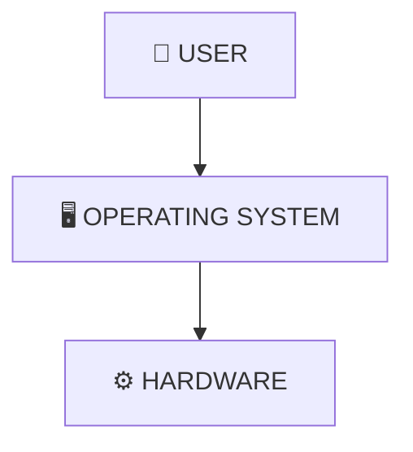
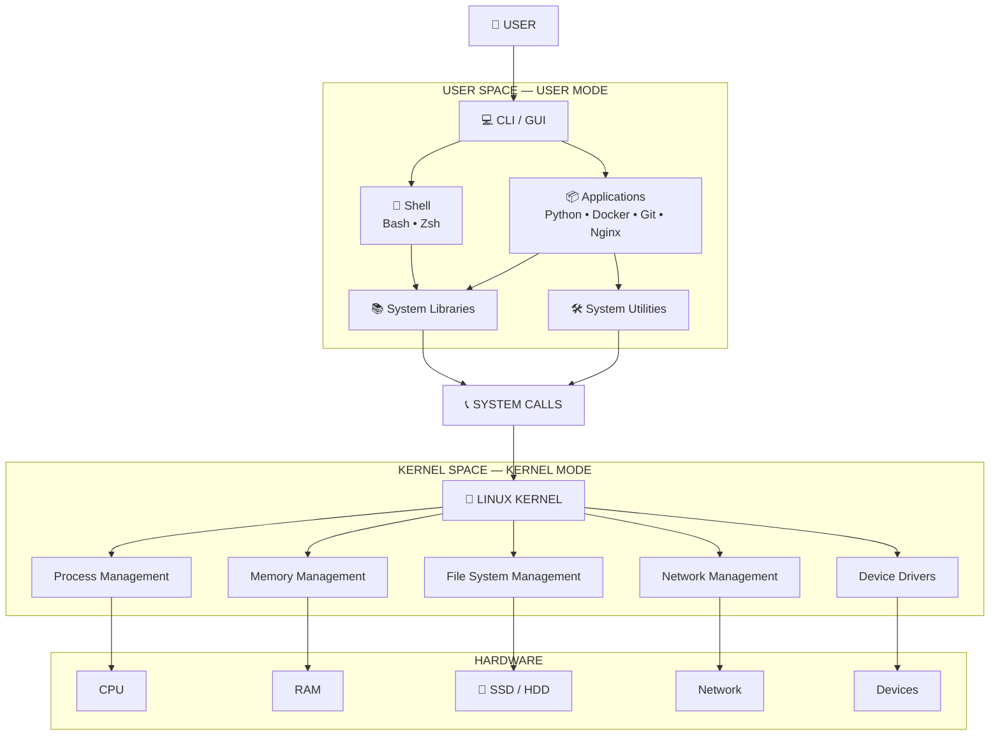
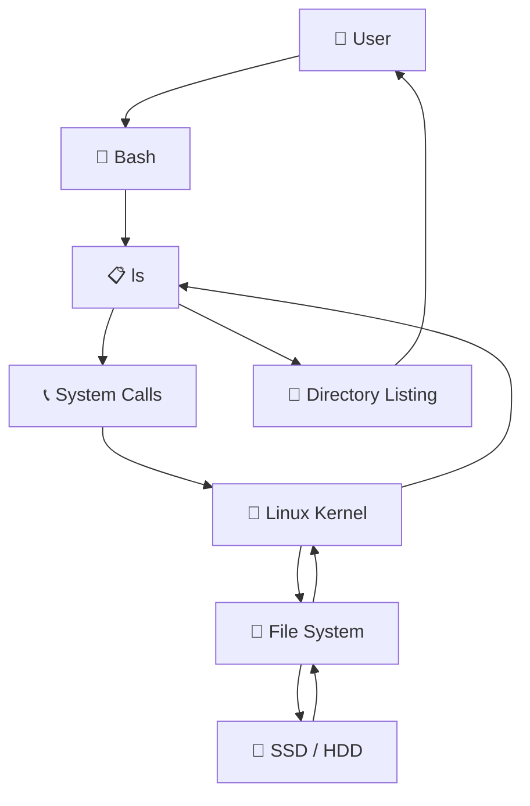
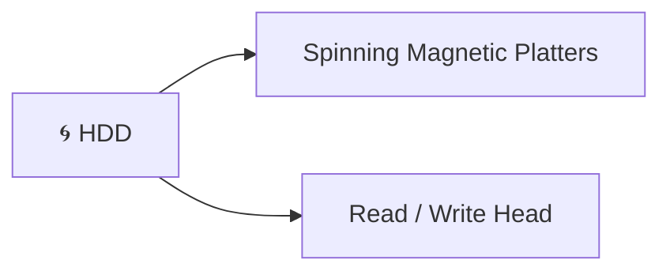
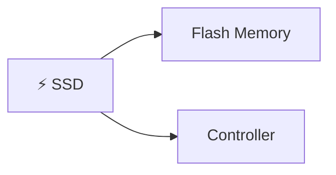
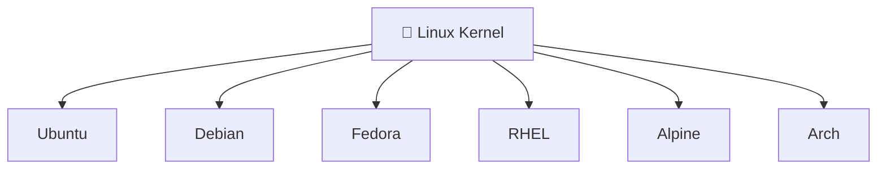
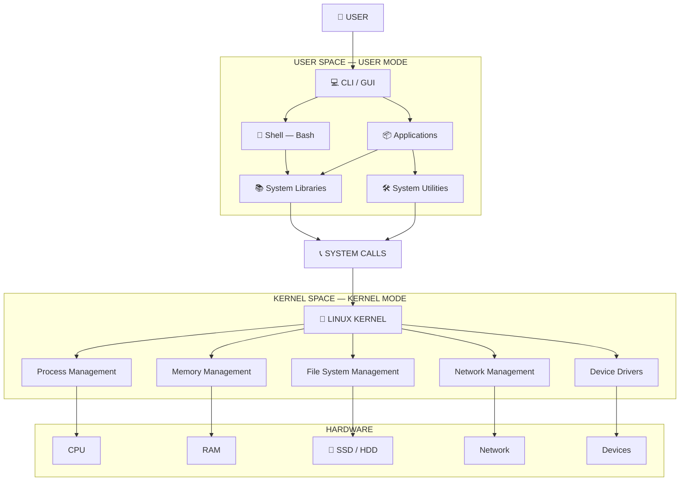

# 🐧 LINUX FUNDAMENTALS

## 1. Introduction to Linux

Before learning Linux commands, it is important to understand the basic structure of a computer and how the operating system interacts with hardware.

A computer mainly consists of:

* **Hardware**
* **Software**

Hardware refers to the physical components of a computer, while software refers to the programs that run on the computer.

The basic relationship is:



The operating system acts as a bridge between users/applications and hardware.

---

# 2. Hardware

Hardware means the **physical components of a computer that can be touched**.

Examples include:

```text
CPU
RAM
SSD / HDD
Motherboard
Network Card
Keyboard
Mouse
Monitor
```

Some important hardware components and their basic responsibilities are:

```text
CPU        → Performs calculations and executes instructions
RAM        → Provides temporary working memory
SSD / HDD  → Permanently stores data
Network    → Allows communication over a network
```

Applications require these hardware resources to perform their work.

For example, when a Python program runs, it requires CPU time, RAM and possibly storage.

Applications do not normally directly control all the hardware. The operating system manages access to these resources.

---

# 3. Operating System

An **Operating System (OS)** is software that manages hardware resources and provides an interface through which users and applications can use those resources.

Some examples of operating systems are:

```text
Windows
Linux
macOS
```

The basic relationship is:

```text
Application
     ↓
Operating System
     ↓
Hardware
```

The operating system manages resources such as:

```text
CPU
RAM
Storage
Network
Devices
```

It also manages processes, files and other system resources.

---

# 4. Linux

**Technically, Linux refers to the Linux kernel.**

The Linux kernel is the **core component** responsible for managing system resources and communicating with hardware.

The kernel handles important operations such as:

```text
Process Management
Memory Management
File System Management
Network Management
Device Drivers
```

Therefore:

```text
Linux Kernel = Core of Linux
```

A complete Linux-based operating system contains the Linux kernel together with user-space software such as shells, libraries, utilities and applications.

---

# 5. Linux Architecture

The Linux environment can be broadly understood using two major areas:

```text
User Space
     ↓
System Calls
     ↓
Kernel Space
     ↓
Hardware
```

### Complete architecture



The most important relationship is:

> **User-space programs → System Calls → Linux Kernel → Hardware**

---

# 6. User Space

**User Space** is the area where normal user-level programs and applications run.

It contains:

```text
Applications
Shell
System Libraries
System Utilities
```

Examples include:

```text
Python
Docker
Git
Nginx
Bash
ls
grep
```

Normal applications run with **limited privileges** and do not have unrestricted access to the system hardware.

---

# 7. User Mode and Kernel Mode

Linux separates normal program execution from highly privileged kernel execution.

### User Mode

Normal applications generally run in **User Mode** with limited privileges.

Examples:

```text
Python
Git
Nginx
Shell
System Utilities
```

### Kernel Mode

The Linux kernel runs in **Kernel Mode**, where it has the privileges required to manage system resources and hardware.

The basic difference is:

```text
USER MODE
    ↓
Normal programs
Limited privileges

KERNEL MODE
    ↓
Linux Kernel
Privileged access
```

This separation helps improve **security and system stability**.

If every application had unrestricted access to the system, a faulty or malicious application could potentially damage important parts of the machine.

For example, a normal Python application should not be able to freely:

```text
Delete the entire disk
Modify kernel memory
Control every hardware device
Access everything in RAM
```

Therefore, normal programs request services from the kernel instead of directly controlling the hardware.

---

# 8. System Calls

Applications sometimes need the kernel to perform operations for them.

Examples include:

```text
Read a file
Write a file
Allocate memory
Create a process
Communicate over a network
```

For these operations, user-space programs use **system calls**.

A system call provides a controlled interface between User Space and the Linux kernel.

The simplified flow is:

```text
Application
     ↓
System Call
     ↓
Linux Kernel
     ↓
System Resource / Hardware
```

For example, when an application needs to read a file:

```text
Application
     ↓
System Call
     ↓
Linux Kernel
     ↓
File System
     ↓
Storage
```

Libraries often provide convenient functions that ultimately use system calls when interaction with the kernel is required.

---

# 9. Shell

A **Shell is a program that interprets commands**.

For example, when we type:

```bash
ls
```

the shell interprets the command and starts the appropriate program.

Some common shells are:

```text
Bash
Zsh
Fish
Dash
Ksh
```

For Linux and DevOps learning, the most important shell to know first is:

```text
Bash
```

The shell provides a command-line interface through which we interact with the Linux system.

---

# 10. CLI and GUI

There are two common ways to interact with an operating system.

## CLI — Command Line Interface

The CLI allows us to interact with the system by typing commands.

Examples:

```bash
ls
cd
mkdir
rm
pwd
```

For DevOps, the CLI is especially important because a large amount of server and infrastructure work is performed through the command line.

## GUI — Graphical User Interface

A GUI allows us to interact with the system using graphical elements such as:

```text
Folders
Files
Applications
Settings
Windows
Menus
```

Examples include graphical desktop environments on Windows, Ubuntu and macOS.

---

# 11. System Utilities

System utilities are programs that provide common functionality for working with and managing the Linux system.

Examples include:

```text
ls
grep
cp
mv
rm
systemctl
```

For example:

```bash
ls
```

lists directory contents.

```bash
grep
```

is used to search text.

```bash
systemctl
```

is used to manage system services on systems using systemd.

These utilities run in User Space.

---

# 12. System Libraries

System libraries provide **reusable functionality that applications can use**.

Examples include:

```text
glibc
libc
OpenSSL
```

Applications can use functions provided by libraries instead of implementing everything themselves.

Libraries may also provide functionality that eventually interacts with the operating system through system calls.

The important point is:

> **Libraries provide reusable functionality for applications.**

---

# 13. Example — What Happens When We Run `ls`?

Suppose we type:

```bash
ls
```

A simplified representation is:



The simplified flow is:

```text
You
 ↓
Bash
 ↓
ls
 ↓
System Calls
 ↓
Linux Kernel
 ↓
File System / Storage
 ↓
Result
 ↓
You
```

The user does not directly communicate with the hardware. The kernel manages access to the underlying system resources.

---

# 14. Storage

Storage is used to **permanently store data**.

Examples of data stored on storage devices include:

```text
Operating System
Applications
Documents
Photos
Videos
Docker Images
Logs
Configuration Files
```

Two common types of storage are:

```text
SSD
HDD
```

Both are storage devices.

---

# 15. HDD — Hard Disk Drive

**HDD = Hard Disk Drive**

An HDD uses **magnetic spinning platters** and mechanical components.

A simplified representation is:



Important characteristics:

```text
Mechanical storage
Spinning platters
Moving parts
Generally slower than SSD
Usually lower cost per GB
Useful for bulk storage
```

---

# 16. SSD — Solid State Drive

**SSD = Solid State Drive**

An SSD uses **flash memory** and does not contain spinning mechanical platters.

A simplified representation is:



Important characteristics:

```text
Flash memory
No spinning platters
No mechanical moving parts
Generally faster than HDD
Quiet
Usually higher cost per GB
```

---

# 17. SSD vs HDD

| Feature          | SSD                            | HDD              |
| ---------------- | ------------------------------ | ---------------- |
| Technology       | Flash memory                   | Magnetic disk    |
| Moving parts     | No                             | Yes              |
| Speed            | Generally faster               | Generally slower |
| Noise            | Quiet                          | Can make noise   |
| Cost per GB      | Usually higher                 | Usually lower    |
| Shock resistance | Generally better               | Generally worse  |
| Common use       | OS, applications, fast storage | Bulk storage     |

Easy way to remember:

```text
SSD → Flash Memory → Faster ⚡

HDD → Spinning Magnetic Disk → Mechanical 🌀
```

---

# 18. Linux and Storage

SSD and HDD are **hardware devices**.

The Linux kernel manages access to the storage.

```text
Application
     ↓
System Call
     ↓
Linux Kernel
     ↓
File System
     ↓
SSD / HDD
```

Therefore:

```text
SSD / HDD
    ↓
Hardware

Linux Kernel
    ↓
Manages access to storage
```

---

# 19. Example — Reading a File

Suppose we run:

```bash
cat notes.txt
```

The simplified flow is:

```text
You
 ↓
Bash
 ↓
cat
 ↓
System Call
 ↓
Linux Kernel
 ↓
File System
 ↓
SSD / HDD
 ↓
File Data
 ↓
cat
 ↓
Terminal
 ↓
You
```

The important concept is that the application requests access to the file, while the kernel manages the underlying system resources.

---

# 20. `sudo`

In Linux, commands sometimes require administrative privileges.

For example:

```bash
sudo apt update
```

`sudo` allows an authorized user to execute a command as another user, with **root as the default**.

The basic idea is:

```text
Normal User
     ↓
sudo
     ↓
Elevated Privileges
     ↓
Administrative Operation
```

Users, groups, permissions and `sudo` are important Linux concepts that are covered separately.

---

# 21. Linux Distribution

Although Linux technically refers to the kernel, we commonly use the term Linux when talking about complete Linux-based operating systems.

A **Linux distribution** combines the Linux kernel with user-space software, packages, tools, configuration and other components required to provide a usable operating system environment.

Examples include:

```text
Ubuntu
Debian
Fedora
RHEL
Rocky Linux
AlmaLinux
Alpine
Arch
```

The basic relationship is:



Think of the Linux kernel as the **foundation**, while each distribution provides its own collection of packages, tools, defaults and configuration around that kernel.

---

# 22. Important Linux Distributions

## Ubuntu

Ubuntu is widely used for:

```text
Learning
Servers
Cloud
DevOps
Development
```

It is a common distribution for learning Linux and DevOps.

## Debian

Debian is known for stability and is an important base for Ubuntu.

```text
Debian
   ↓
Ubuntu
```

## Fedora

Fedora is a modern Linux distribution associated with the Red Hat ecosystem and often provides newer technologies earlier.

## RHEL

RHEL stands for **Red Hat Enterprise Linux**.

It is widely used in enterprise environments.

## Rocky Linux / AlmaLinux

These are enterprise-oriented Linux distributions compatible with the RHEL ecosystem.

## Alpine Linux

Alpine Linux is a lightweight distribution that is frequently encountered when working with containers.

## Arch Linux

Arch Linux is known for customization and a rolling-release model and is generally aimed at more experienced users.

---

# 23. Package Manager

Linux distributions provide **package managers** to make software installation and management easier.

A package manager can be used to:

```text
Install software
Update package information
Upgrade packages
Remove software
Manage dependencies
```

Different distributions use different package managers:

| Distribution    | Package Manager |
| --------------- | --------------- |
| Ubuntu / Debian | `apt`           |
| Fedora / RHEL   | `dnf`           |
| Arch            | `pacman`        |
| openSUSE        | `zypper`        |

For your current learning:

```text
Ubuntu → APT
```

---

# 24. APT

APT is the package manager commonly used on Ubuntu and Debian-based systems.

For example:

```bash
sudo apt install nginx
```

APT can obtain packages from configured repositories and handle required dependencies.

The basic flow is:

```text
Ubuntu Machine
      ↓
     APT
      ↓
Repository
      ↓
Package
      ↓
Download
      ↓
Install
```

---

# 25. Package Repository

A **package repository** is a location containing software packages and information about those packages.

For example, when running:

```bash
sudo apt install nginx
```

APT conceptually:

```text
Checks configured repositories
          ↓
Finds nginx
          ↓
Downloads package
          ↓
Resolves dependencies
          ↓
Installs package
          ↓
Configures package
```

This is why package managers make software installation easier.

---

# 26. `apt update`

The command:

```bash
sudo apt update
```

refreshes the local package information from the configured repositories.

It does **not** mean that all installed software is upgraded.

The basic idea is:

```text
Repository
     ↓
Latest Package Information
     ↓
apt update
     ↓
Local Package Information Refreshed
```

Therefore:

> **`apt update` refreshes package information.**

---

# 27. `apt upgrade`

The command:

```bash
sudo apt upgrade
```

is used to upgrade installed packages when newer versions are available.

The difference is:

```text
apt update
     ↓
Refresh package information

apt upgrade
     ↓
Upgrade installed packages
```

This distinction is important when working with Ubuntu and Debian-based systems.

---

# 28. Important APT Commands

### Update package information

```bash
sudo apt update
```

### Upgrade installed packages

```bash
sudo apt upgrade
```

### Install a package

```bash
sudo apt install nginx
```

### Remove a package

```bash
sudo apt remove nginx
```

### Search for a package

```bash
apt search nginx
```

### Remove unused dependencies

```bash
sudo apt autoremove
```

---

# 29. WSL

If Windows is being used, **WSL (Windows Subsystem for Linux)** provides a way to run a Linux environment within Windows.

The basic installation command is:

```bash
wsl --install
```

After installation and setup, a Linux distribution can be opened and used to practice Linux commands.

---

# 30. Docker as a Linux Practice Environment

Docker can also be used to run an Ubuntu container for practicing Linux commands.

The basic idea is:

```text
Your Computer
      ↓
    Docker
      ↓
Ubuntu Container
      ↓
Linux Environment
      ↓
Linux Commands
```

A running container can be entered using:

```bash
docker exec -it <container-id> /bin/bash
```

Once inside the container, commands such as:

```bash
ls
pwd
cd
mkdir
touch
cat
```

can be practiced.

A container is an isolated environment running on the computer.

---

# 31. Final Linux Mental Model

The complete Linux concept can now be connected together:



---

# 32. 🎯 What I Need to Remember

### 1️⃣ Hardware

Physical components:

```text
CPU
RAM
SSD / HDD
Network
Devices
```

### 2️⃣ Operating System

Manages hardware resources and provides an interface for users and applications.

### 3️⃣ Linux Kernel

The core of Linux that manages system resources and hardware.

### 4️⃣ User Space

Contains:

```text
Applications
Shell
Libraries
Utilities
```

### 5️⃣ User Mode

Normal programs execute with limited privileges.

### 6️⃣ Kernel Mode

The Linux kernel executes with the privileges required to manage system resources.

### 7️⃣ System Calls

Provide a controlled interface through which user-space programs request services from the kernel.

### 8️⃣ Shell

A program that interprets commands.

```text
Bash
```

is the main shell to focus on first.

### 9️⃣ SSD vs HDD

```text
SSD → Flash Memory → Generally Faster

HDD → Spinning Magnetic Disk → Mechanical
```

### 🔟 Linux Distribution

```text
Linux Kernel
     ↓
Linux Distribution
     ↓
Ubuntu / Debian / Fedora / RHEL / etc.
```

### 1️⃣1️⃣ Package Manager

```text
Ubuntu / Debian → APT
Fedora / RHEL   → DNF
Arch            → Pacman
openSUSE        → Zypper
```

### 1️⃣2️⃣ APT

```text
apt update
    ↓
Refresh package information

apt upgrade
    ↓
Upgrade installed packages
```

---

# 🧠 FINAL MEMORY CHAIN

The entire topic can be remembered as:

```text
                         👤 USER
                            ↓
                       USER SPACE
                            ↓
             ┌──────────────┼──────────────┐
             ↓              ↓              ↓
       Applications       Shell        Utilities
             │              │              │
             └──────────────┼──────────────┘
                            ↓
                      System Calls
                            ↓
                    🐧 LINUX KERNEL
                            ↓
             ┌──────────────┼──────────────┐
             ↓              ↓              ↓
            CPU            RAM          SSD / HDD
                            ↓
                        HARDWARE
```

> **Main concept:**
> **Users and applications run in User Space. They request services from the Linux Kernel through controlled interfaces such as system calls. The Linux Kernel manages system resources and hardware.**
