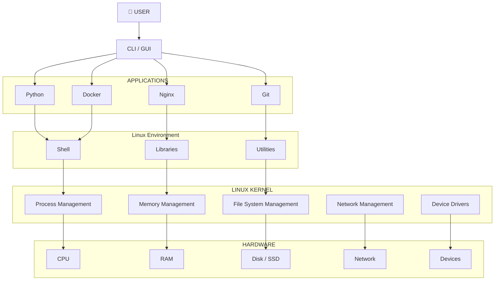
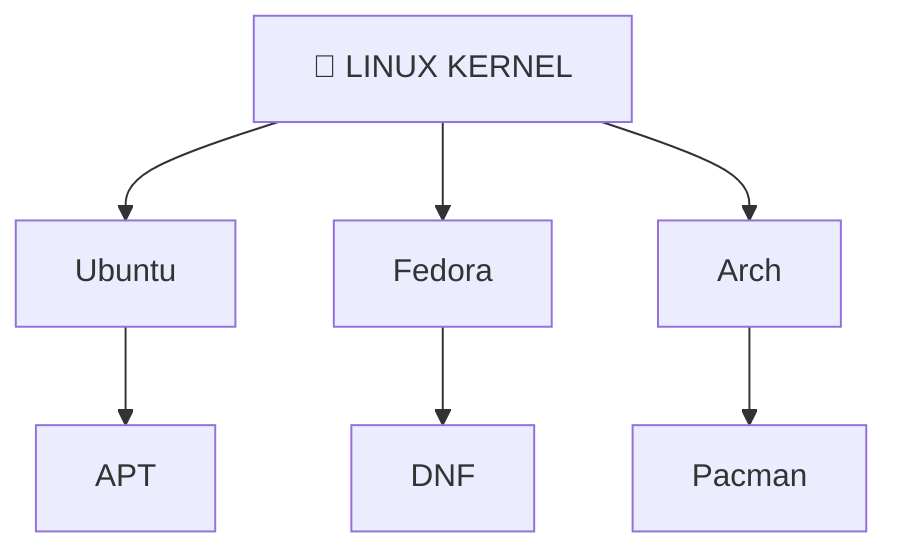

# 🐧 Linux Fundamentals — From Absolute Basics

## First, understand the BIG picture

Before learning Linux commands, I first need to understand how a computer actually works.

The basic flow is:

```text
                YOU
                 │
                 ▼
             CLI / GUI
                 │
                 ▼
        ┌─────────────────┐
        │ Operating System│
        │                 │
        │ Linux Kernel    │
        │ Libraries       │
        │ Utilities       │
        │ Shell           │
        └─────────────────┘
                 │
                 ▼
              HARDWARE
       ┌────────────────────┐
       │ CPU                │
       │ RAM                │
       │ Disk / Storage     │
       │ Network            │
       │ Other Devices      │
       └────────────────────┘
```

This picture is the foundation for understanding Linux.

---

# 1. What is Hardware?

Hardware means the **physical components of a computer**.

Examples of hardware are:

* CPU
* RAM
* Hard Disk / SSD
* Motherboard
* Network Card
* Keyboard
* Mouse
* Monitor

These are the physical things that we can touch.

For example:

```text
CPU          → Performs calculations
RAM          → Temporary working memory
Disk         → Stores data permanently
Network Card → Communicates over the network
```

Now one question comes.

Can I directly tell the CPU:

> Hey CPU, give me 500 MB memory and run my Python program.

No.

The hardware cannot understand what I want directly.

So we need software that communicates with the hardware.

That software is called the **Operating System**.

---

# 2. Why do we need an Operating System?

There are mainly two things that want to use the hardware.

### Users

Users are people like us.

We may want to:

* Create a file
* Delete a file
* Create a folder
* Run a program
* Connect to the internet
* Check system resources

### Applications

Applications also need hardware resources.

Examples are:

* Chrome
* YouTube
* Python Program
* Docker
* Nginx
* Java Application
* VS Code

For example, when I run a Python program:

```text
Python Program
      ↓
Needs CPU
      ↓
Needs RAM
      ↓
Needs Disk
```

But applications normally do not directly control the hardware.

So we need an intermediate layer between applications and hardware.

That intermediate layer is the **Operating System**.

---

# 3. What is an Operating System?

An Operating System is software that acts as a **bridge between users/applications and hardware**.

The simple definition is:

> **An Operating System manages hardware resources and provides an interface for users and applications to use those resources.**

The flow is:

```text
Application
     ↓
Operating System
     ↓
Hardware
```

Instead of a Python program directly managing the CPU or RAM, the Operating System manages everything.

---

# 4. What does the Operating System actually do?

The Operating System performs different types of management.

## Process Management

Process management means managing running programs.

Examples:

* Chrome
* Python
* Docker
* Nginx

All these programs run as processes.

The Operating System decides how much CPU time each process receives.

---

## Memory Management

Memory management means managing RAM.

For example:

```text
Chrome  → 2 GB RAM
Python  → 500 MB RAM
Docker  → 1 GB RAM
```

The Operating System manages how RAM is allocated to each process.

---

## File System Management

The Operating System also manages files and directories.

Examples:

```text
/home/user/file.txt
/etc/nginx/nginx.conf
/var/log/
```

Everything related to creating, reading, writing and deleting files is managed through the file system.

---

## Device Management

The Operating System manages hardware devices using drivers.

Examples:

* Keyboard
* Disk
* Network Card
* USB Devices

Drivers help the Operating System communicate with hardware devices.

---

## Network Management

The Operating System also handles network communication.

For example:

```text
Your Application
        ↓
Operating System
        ↓
Network Interface
        ↓
Internet
```

So whenever an application connects to the internet, the Operating System manages that communication.

---

# 5. How does a User interact with the OS?

Normally I cannot communicate with the Operating System by directly touching hardware.

I need an interface.

There are mainly two interfaces.

## GUI

GUI means **Graphical User Interface**.

Examples are:

* Windows Desktop
* Ubuntu Desktop
* macOS Desktop

In GUI, I interact by clicking things like:

* Folder
* File
* Application
* Settings

So GUI is based on graphical interaction.

---

## CLI

CLI means **Command Line Interface**.

Instead of clicking, I type commands.

Examples:

```bash
ls
cd
mkdir
rm
pwd
```

CLI is very important for DevOps because most server administration and cloud work is done using the command line.

So as a DevOps learner, I will spend a lot of time using CLI.

---

# 6. So what exactly is Linux?

This is where many beginners get confused.

Technically, **Linux refers to the Linux Kernel**.

The Linux Kernel is the core component that manages resources and communicates with hardware.

The architecture looks like this:

```text
              Linux Operating System
                     │
        ┌────────────┴────────────┐
        │                         │
    User Space                 Kernel
        │                         │
 Shell, Utilities,         Process Management
 Libraries, Applications   Memory Management
                           File Systems
                           Networking
                           Drivers
                                │
                                ▼
                             Hardware
```

So the important point is:

> **Linux Kernel = Core of Linux**

The kernel is the heart of the Linux operating system.

---

# 7. What is the Linux Kernel?

The Linux Kernel is responsible for major low-level operations.

The basic architecture is:

```text
User Applications
        ↓
Shell
        ↓
System Libraries
        ↓
System Utilities
        ↓
Linux Kernel
        ↓
Hardware
```

Now I need to understand every component one by one.

---

# 8. Hardware Layer

At the bottom of Linux architecture, we have hardware.

Hardware includes:

* CPU
* RAM
* Disk
* Network
* Peripherals

The Linux Kernel communicates with all these hardware components.

The hardware itself does not understand user commands.

The kernel acts as the manager.

---

# 9. Linux Kernel

The Linux Kernel is the **heart and core** of Linux.

It performs the following important functions:

* Process Management
* Memory Management
* File System Management
* Network Management
* Device Drivers

For example, if I run:

```bash
python3 app.py
```

The Python application needs CPU and memory.

The Linux Kernel provides those resources and manages them.

So applications depend on the kernel for system resources.

---

# 10. System Libraries

System Libraries provide commonly used functionality for applications.

Examples are:

* glibc
* libc
* OpenSSL

I don't need to memorize these names now.

The important thing is:

> **Libraries provide reusable functionality that applications can use to interact with the Operating System.**

Applications use libraries instead of implementing everything from scratch.

---

# 11. System Utilities

System Utilities are tools that help us manage the Linux system.

Examples are:

```bash
ls
grep
systemctl
cp
mv
rm
```

Some examples:

```bash
ls
```

`ls` shows files and directories.

```bash
grep
```

`grep` searches text.

```bash
systemctl
```

`systemctl` manages services.

These utilities are normal programs that run in User Space.

---

# 12. Shell

The Shell is very important for Linux and DevOps.

A Shell is a **program that interprets commands**.

For example, when I type:

```bash
ls
```

The shell understands the command and helps execute it.

Common shells are:

* Bash
* Zsh
* Fish
* Dash
* Ksh

The shell I will use most during Linux and DevOps learning is:

# Bash

---

## Simple command flow

Whenever I type:

```bash
ls
```

I should imagine this flow:

```text
YOU
 ↓
Bash / Shell
 ↓
Linux System
 ↓
Linux Kernel
 ↓
File System / Hardware
 ↓
Result
```

The important point is:

> I don't directly communicate with the hardware.

The Shell helps me interact with the Linux system.

---

# 13. User Applications

At the top of Linux architecture, we have User Applications.

Examples are:

* Chrome
* Python
* Java
* Docker
* Nginx
* Vim
* Git

These applications use the Operating System to access system resources.

The complete picture becomes:

```text
        USER
          │
          ▼
      Shell / GUI
          │
          ▼
   User Applications
          │
          ▼
   System Libraries
          │
          ▼
   System Utilities
          │
          ▼
     Linux Kernel
          │
          ▼
       Hardware
```

Even though there are many components, the most important relationship is:

> **Application → Operating System → Hardware**

---

# 14. Linux vs Windows vs macOS

Linux is not the only Operating System.

The three major operating system families are:

* Windows
* Linux
* macOS

All three are different operating systems.

Linux is extremely important for DevOps because most servers, cloud infrastructure, containers and production workloads use Linux.

That is why learning Linux is essential for a DevOps Engineer.

---

# 15. Why is Linux so popular in DevOps?

There are several reasons why Linux is widely used.

## 1. Free and Open Source

Linux source code is publicly available.

Companies can use and modify Linux without paying traditional operating system licensing fees.

That makes Linux very popular in enterprise and cloud environments.

---

## 2. Performance

Linux is generally lightweight and efficient.

It works well even with relatively limited resources.

Because of this, Linux is commonly used for:

* Servers
* Containers
* Cloud Machines
* Embedded Systems

---

## 3. Security

Linux provides strong user separation and permission mechanisms.

Examples include:

* root
* user
* groups
* file permissions

These concepts improve security and will be studied later.

---

## 4. Stability

Linux is widely used for systems that need to run continuously for long periods.

Servers often run Linux because stability is extremely important.

---

# 16. Linux History

I don't need to memorize every date.

I just need to understand how Linux evolved.

## Unix

Unix was one of the earliest major operating systems.

It introduced many concepts that influenced modern operating systems.

---

## Minix

Minix was created as a Unix-like educational operating system.

It later became important in the story of Linux.

---

## Windows

Microsoft developed Windows with a strong graphical interface.

This made computers easier for ordinary users.

---

## Linux

In the early 1990s, **Linus Torvalds** created the Linux Kernel.

Linux became an important open-source Unix-like operating system kernel.

Later it became the foundation for many Linux distributions.

---

# 17. What is a Linux Distribution?

This is one of the most important concepts.

I often hear names like:

* Ubuntu
* Debian
* Fedora
* Red Hat
* Rocky Linux
* AlmaLinux
* Alpine
* Arch

These are not completely different kernels.

They are **Linux Distributions** built around the Linux Kernel.

They differ in:

* Packages
* Tools
* Defaults
* Release Models
* Management Systems

The idea is:

```text
                 Linux Kernel
                      │
        ┌─────────────┼─────────────┐
        ↓             ↓             ↓
     Ubuntu        Fedora         Arch
        │             │             │
     Packages      Packages      Packages
     Tools         Tools         Tools
     Defaults      Defaults      Defaults
```

So the Linux Kernel is the common foundation.

---

# 18. Simple analogy for Linux Distribution

I can think of the Linux Kernel as an **engine**.

Different companies build different vehicles around the same engine idea.

Similarly:

```text
Linux Kernel
      ↓
Linux Distribution
      ↓
Ubuntu
Fedora
Debian
Rocky Linux
Alpine
Arch
```

All these distributions share the Linux Kernel foundation.

But they differ in software, packages and configuration.

---

# 19. Important Linux Distributions

## Ubuntu

Ubuntu is one of the most beginner-friendly Linux distributions.

It is widely used for:

* Learning
* Servers
* Cloud
* DevOps
* Development

For my learning, Ubuntu is an excellent choice.

---

## Debian

Debian is known for stability.

Ubuntu is based on Debian.

```text
Debian
   ↓
Ubuntu
```

So Debian is an important foundation for Ubuntu.

---

## Fedora

Fedora is a modern Linux distribution.

It is associated with the Red Hat ecosystem and often receives newer technologies earlier.

---

## RHEL

RHEL means **Red Hat Enterprise Linux**.

It is very important in enterprise environments.

Many companies use RHEL for production servers.

---

## Rocky Linux and AlmaLinux

Rocky Linux and AlmaLinux are enterprise-oriented distributions.

They are compatible with the RHEL ecosystem.

They are commonly used as alternatives in enterprise environments.

---

## Alpine Linux

Alpine Linux is very lightweight.

I will frequently encounter Alpine while working with Docker containers.

---

## Arch Linux

Arch Linux is known for:

* Customization
* Rolling Release Model

It is generally preferred by more experienced Linux users.

---

# 20. Why do many Linux commands work across distributions?

Many Linux distributions share common Linux concepts.

For example, a Bash script like:

```bash
#!/bin/bash

echo "Hello"
```

can generally run on many Linux distributions if the required commands and dependencies are available.

But package management commands are different.

For example:

Ubuntu:

```bash
apt
```

RHEL / Fedora:

```bash
dnf
```

Arch:

```bash
pacman
```

So I need to learn both:

> **Linux Fundamentals + Distribution Specific Tools**

---

# 21. How can I get Linux?

I don't always need AWS EC2 to learn Linux.

There are different options.

## Option 1 — WSL

WSL means:

> **Windows Subsystem for Linux**

WSL allows me to run a Linux environment inside Windows.

The basic installation command is:

```bash
wsl --install
```

After installation and restart, I can open Ubuntu or another Linux distribution and start practicing Linux commands.

For beginners, WSL is very convenient.

---

## Option 2 — Docker

Another option is Docker.

Docker can run an Ubuntu container.

The flow is:

```text
Windows / macOS
       ↓
     Docker
       ↓
Ubuntu Container
       ↓
Linux Environment
```

Then I can enter the container using:

```bash
docker exec -it <container-id> /bin/bash
```

After entering the container, I may see:

```text
root@ubuntu-dev:/#
```

Now I can practice Linux commands like:

```bash
ls
pwd
cd
mkdir
touch
cat
```

This provides a Linux practice environment.

---

# 22. What is a Container?

I don't need to master Docker now.

I just need to understand the basic concept.

A Container is an **isolated environment running on my computer**.

The idea is:

```text
Your Computer
      │
      ▼
    Docker
      │
      ▼
Ubuntu Container
      │
      ▼
Linux Commands
```

My teacher uses Docker because it is an easy way to practice Linux without installing another operating system.

---

# 23. Why does the Docker command have so many options?

Sometimes Docker commands look very long.

That is because they may perform multiple configurations.

Conceptually, a Docker command may do things like:

* Create Ubuntu Container
* Give it a Name
* Give it a Hostname
* Allocate CPU Limits
* Allocate Memory Limits
* Mount Local Storage
* Map Ports
* Set Environment Variables
* Run Bash

I don't need to memorize the complete command now.

The important concepts are:

```bash
docker run
```

This creates and runs a container.

And:

```bash
docker exec -it <container> /bin/bash
```

This enters a running container.

---

# 24. Package Manager

Suppose I have a fresh Ubuntu machine.

I want to install Python.

I could manually search the internet, download files, install dependencies and configure everything.

That would be difficult.

Linux distributions solve this problem using **Package Managers**.

A Package Manager helps me:

* Install Software
* Update Software
* Upgrade Software
* Remove Software
* Manage Dependencies

So instead of manually installing software, I use the package manager.

---

# 25. Ubuntu uses APT

Ubuntu and Debian use the package manager called **APT**.

Example:

```bash
sudo apt install python3
```

This command tells Ubuntu:

> Install Python 3 along with all required dependencies.

APT automatically manages dependencies and installation.

For Ubuntu, APT is the package manager I need to remember first.

---

# 26. What is a Repository?

A Repository is another important concept.

A Repository is a location or server that contains software packages.

The flow is:

```text
Your Ubuntu Machine
        │
        │ apt install
        ▼
    Repository
        │
        ▼
 Python Package
        │
        ▼
    Download
        │
        ▼
     Install
```

Ubuntu maintains repositories from which APT downloads packages.

So APT gets software from configured repositories.

---

# 27. What happens when I run `apt install`?

Suppose I run:

```bash
sudo apt install nginx
```

Conceptually, this happens:

```text
You
 ↓
APT
 ↓
Check Configured Repositories
 ↓
Find Nginx
 ↓
Download Package
 ↓
Resolve Dependencies
 ↓
Install
 ↓
Configure
```

That is why package managers are so useful.

They automatically download and install everything required.

---

# 28. Why do we run `apt update`?

This is a very important concept.

Many beginners think:

```bash
apt update
```

means:

> Update all installed software.

That is not correct.

`apt update` actually **refreshes the local package lists** from the configured repositories.

The flow is:

```text
Repository
     ↓
Latest Package Information
     ↓
apt update
     ↓
Local Package Lists Updated
```

So when I run:

```bash
sudo apt update
```

It means:

> Go to the repositories and refresh my information about available packages and versions.

It does not upgrade installed packages.

---

# 29. What does `apt upgrade` do?

`apt upgrade` upgrades installed packages.

Example:

```bash
sudo apt upgrade -y
```

The difference is:

```text
apt update
      ↓
Refresh Package Information

apt upgrade
      ↓
Upgrade Installed Packages
```

So I should always remember:

### `apt update`

**Refresh package information**

### `apt upgrade`

**Upgrade installed packages**

This difference is very important during interviews and practical work.

---

# 30. Most Important APT Commands

These are the APT commands I should remember.

## Update package information

```bash
sudo apt update
```

## Upgrade installed packages

```bash
sudo apt upgrade
```

## Install a package

```bash
sudo apt install nginx
```

## Remove a package

```bash
sudo apt remove nginx
```

## Remove unused dependencies

```bash
sudo apt autoremove
```

## Search for a package

```bash
apt search nginx
```

These are the most commonly used APT commands.

---

# 31. Other Package Managers

Different Linux distributions use different package managers.

| Distribution    | Package Manager |
| --------------- | --------------- |
| Ubuntu / Debian | `apt`           |
| Fedora / RHEL   | `dnf`           |
| Arch            | `pacman`        |
| openSUSE        | `zypper`        |

For my current learning, I should mainly focus on:

> **Ubuntu → APT**

Later I can learn other package managers.

---

# 32. One complete example

Imagine I have a fresh Ubuntu machine.

I want to install Nginx.

First I run:

```bash
sudo apt update
```

This refreshes the package information.

Then I run:

```bash
sudo apt install nginx
```

Now APT performs the following steps:

```text
Checks Repositories
        ↓
Finds Nginx
        ↓
Downloads Nginx
        ↓
Downloads Dependencies
        ↓
Installs Nginx
        ↓
Configures Nginx
```

That is the complete idea behind installing software using APT.

---

# 33. My Entire Linux Lesson in One Picture

This is the complete picture I should remember.



And around the Linux Kernel we have different Linux distributions.



---

# 🎯 What I should actually remember

I don't need to memorize every sentence.

I should understand these important concepts.

## 1. Hardware

Physical components of a computer.

Examples:

* CPU
* RAM
* Disk
* Network

## 2. Operating System

The Operating System acts as a bridge between users/applications and hardware.

## 3. Linux Kernel

The Linux Kernel is the core of Linux and manages system resources.

## 4. Shell

The Shell allows me to interact with Linux through commands.

The most common shell is:

```text
Bash
```

## 5. Linux Distribution

A Linux Distribution is a complete Linux-based operating system built around the Linux Kernel.

Examples:

* Ubuntu
* Debian
* Fedora
* RHEL
* Rocky Linux
* Alpine
* Arch

## 6. Ubuntu

Ubuntu is beginner-friendly and widely used for Linux, Cloud and DevOps learning.

## 7. WSL

WSL allows me to run Linux inside Windows.

```bash
wsl --install
```

## 8. Docker

Docker can provide an Ubuntu container for practicing Linux.

```bash
docker exec -it <container> /bin/bash
```

## 9. Package Manager

A Package Manager installs, upgrades, removes software and manages dependencies.

For Ubuntu:

```text
APT
```

## 10. Important APT Commands

```bash
sudo apt update
sudo apt upgrade
sudo apt install <package>
sudo apt remove <package>
apt search <package>
```

---

# 🧠 Final Mental Chain

If someone asks me:

> Explain Linux from the basics.

I should think like this:

```text
Hardware
    ↓
Operating System
    ↓
Linux
    ↓
Linux Kernel
    ↓
Shell + Libraries + Utilities
    ↓
Applications
    ↓
Linux Distributions
    ↓
Ubuntu / Debian / Fedora / RHEL / etc.
    ↓
Package Manager
    ↓
APT / DNF / Pacman
```

The complete Linux understanding starts from **Hardware**, then the **Operating System**, then the **Linux Kernel**, followed by **User Space**, **Shell**, **Applications**, **Linux Distributions**, and finally **Package Managers** like APT.
