# 🐧 Linux Fundamentals

## 1. The Big Picture

Before learning Linux commands, first we need to understand how Linux is actually structured.

The easiest way to understand it is:

```text
USER
  ↓
USER SPACE
  ↓
LINUX KERNEL
  ↓
HARDWARE
```

So basically, the user works with programs in **User Space**, and whenever those programs need to access system resources or hardware, the **Linux Kernel** handles it.

The kernel then communicates with the actual **hardware**.

### Complete picture

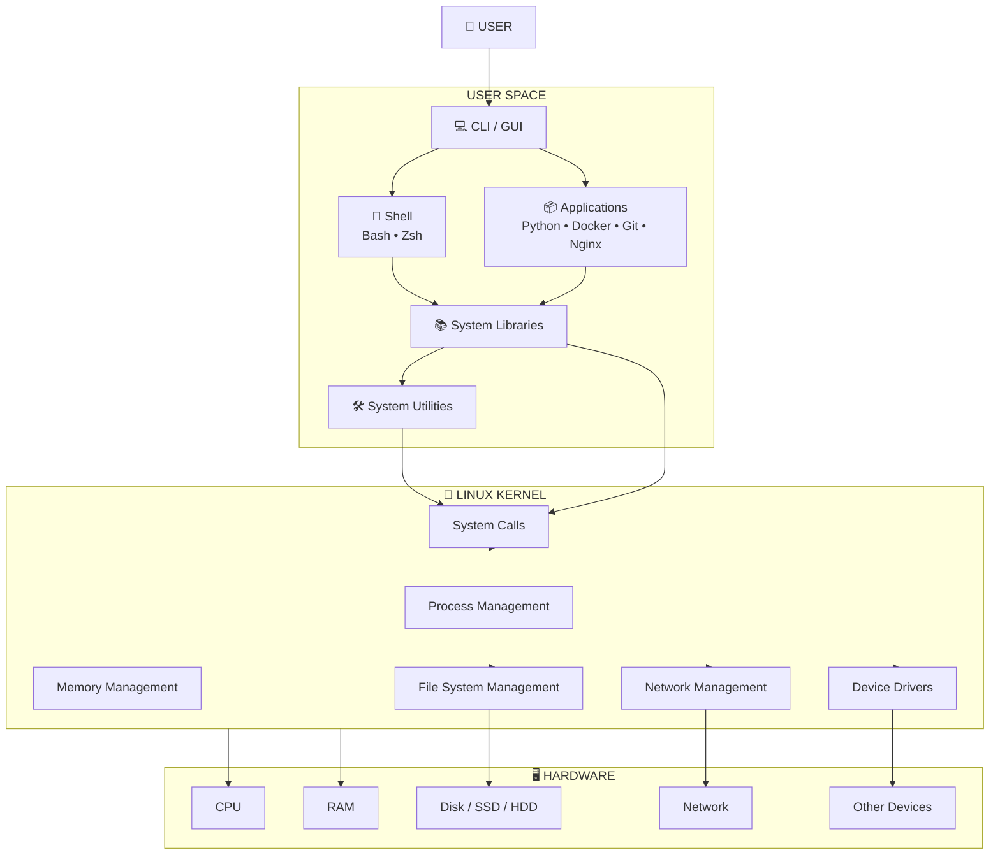

The most important relationship here is:

```text
Applications
      ↓
Linux Kernel
      ↓
Hardware
```

---

# 2. What is Hardware?

So first, what exactly is hardware?

Hardware basically means the **physical components of a computer**.

For example:

```text
CPU
RAM
Hard Disk / SSD
Motherboard
Network Card
Keyboard
Mouse
Monitor
```

These are things that we can physically touch.

We can understand some of them like this:

```text
CPU      → Performs calculations
RAM      → Temporary working memory
Disk     → Stores data
Network  → Communicates over a network
```

Now the question is, if we have an application, can that application directly communicate with the CPU or disk?

For example, can an application simply say:

```text
"Hey CPU, give me some memory and run my program."
```

No.

Something has to manage access to the hardware.

That is where the **Operating System** comes in.

---

# 3. What is an Operating System?

The Operating System acts as a **bridge between users/applications and hardware**.

In simple words:

> An Operating System manages hardware resources and provides an interface for users and applications to use those resources.

We can understand it like this:

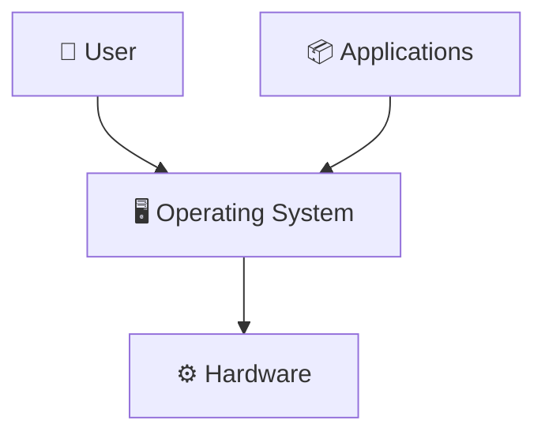

For example:

```text
Python Application
       ↓
Operating System
       ↓
CPU / RAM / Disk
```

So the application doesn't have to directly control the hardware.

The Operating System manages that interaction.

---

# 4. What is Linux?

This is something beginners usually get confused about.

Technically, **Linux refers to the Linux Kernel**.

The kernel is basically the **core component** of Linux.

Its job is to manage system resources and communicate with the hardware.

For example, the kernel handles things like:

```text
Process Management
Memory Management
File Systems
Networking
Drivers
```

We can see it like this:

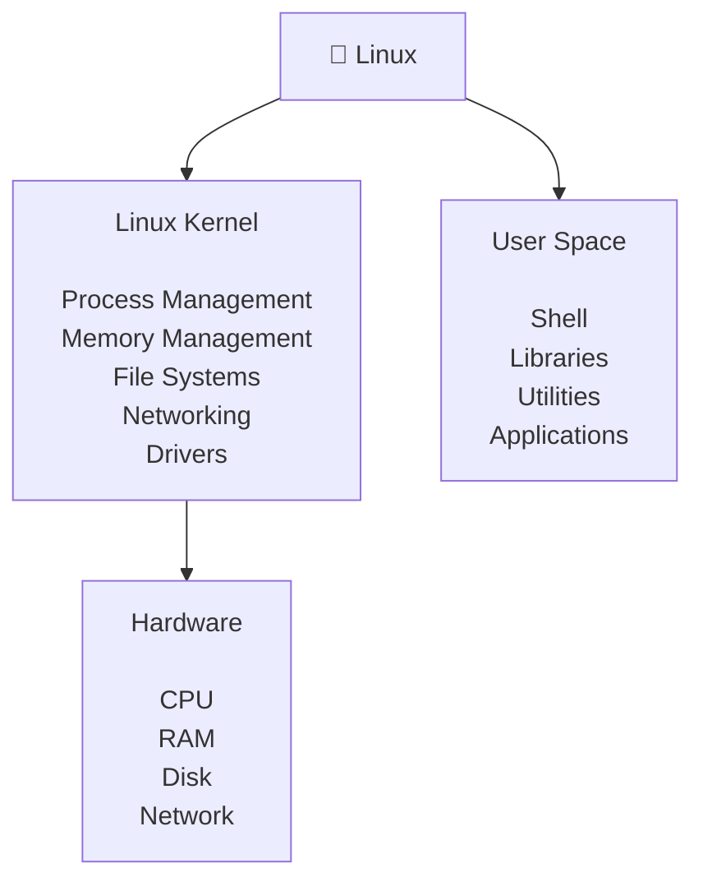

So remember:

```text
Linux Kernel = Core of Linux
```

---

# 5. Linux Architecture

Now let's understand the **Linux Architecture**.

A simple way of looking at Linux architecture is:

```text
Applications
     ↓
Shell
     ↓
System Libraries
     ↓
System Utilities
     ↓
Linux Kernel
     ↓
Hardware
```

There are different components involved here.

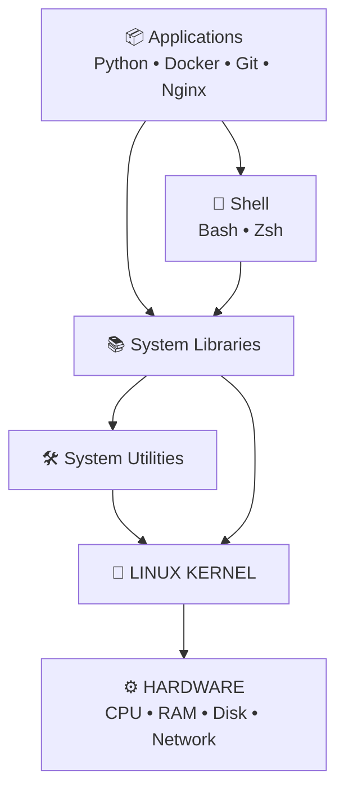

The important thing to understand is that the **kernel is the heart or core of the system**.

The applications and other user-level programs are above the kernel, while the actual hardware is below the kernel.

---

# 6. What is User Space?

So now what exactly is **User Space**?

Basically, User Space is where the normal applications and user-level programs run.

For example:

```text
Python
Docker
Git
Nginx
Shell
System Utilities
Libraries
```

We can represent User Space like this:

```text
USER SPACE
│
├── Applications
├── Shell
├── Libraries
└── Utilities
```

These programs normally **do not have unrestricted access to hardware**.

That is important because we don't want every normal application to have complete control over the system.

---

# 7. Privileged vs Non-Privileged Mode

This is another important concept.

We can compare it to a building.

Suppose there is a normal employee:

```text
Normal employee
      ↓
Limited access
```

And then there is a building administrator:

```text
Building administrator
      ↓
High-level access
```

Linux also has a similar separation.

Normal programs don't get the same level of access as the Linux Kernel.

---

## Non-Privileged Mode

Normal applications generally run with **limited privileges**.

For example:

```text
Python Application
Shell
Git
Nginx
Normal User Programs
```

These programs should not be able to freely do things like:

```text
Control the CPU
Access any RAM location
Directly control hardware
Modify critical kernel data
Access everything on the disk
```

If every application had complete access to everything, it could become a serious problem.

So this separation helps improve:

```text
Security
System Stability
```

---

## Privileged Mode

The Linux Kernel operates with very high privileges.

The kernel can manage:

```text
CPU
RAM
Disk
Network
Devices
Processes
File Systems
```

So we can represent it like this:

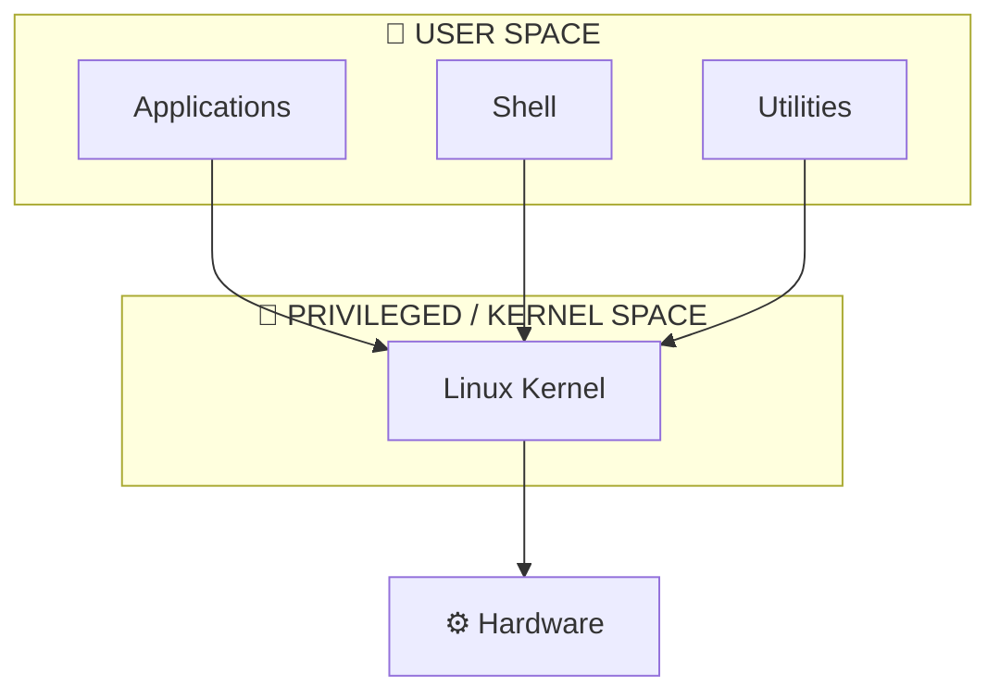

### Easy way to remember

```text
Non-Privileged
      ↓
Normal programs
      ↓
Limited access


Privileged
      ↓
Kernel
      ↓
High-level system access
```

---

# 8. Why do we need Non-Privileged Mode?

Let's say we run:

```bash
python3 app.py
```

Now imagine if Python had complete access to the system.

Could it do something like:

```text
Delete the entire disk
Modify kernel memory
Control every device
```

That would obviously be dangerous.

So ❌ we don't want every application to have that kind of access.

If every application had complete access to the system, a buggy or malicious application could damage the entire machine.

That's why normal applications have limited access.

The basic idea is:

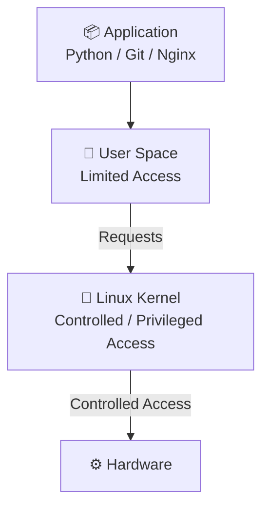

So the main thing to remember is:

> **Normal programs request services from the kernel instead of directly controlling the hardware.**

---

# 9. What are System Calls?

Now suppose an application needs the kernel to perform some operation.

For example, an application wants to read a file.

The application cannot simply directly access the disk.

It uses something called a **System Call**.

The flow is:

```text
Application
     ↓
System Call
     ↓
Linux Kernel
     ↓
File System
     ↓
Disk
```

We can see the same thing using a diagram:

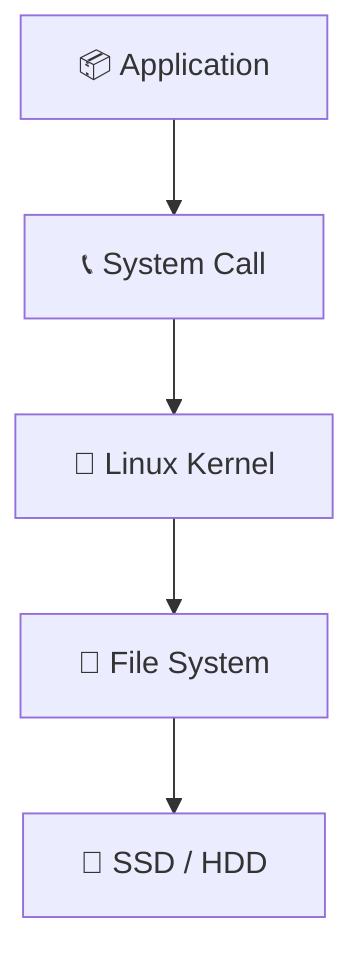

So the important point is:

> **System calls provide a controlled way for user-space programs to request services from the kernel.**

---

# 10. What is a Shell?

Now let's understand the **Shell**.

A Shell is basically a **program that interprets commands**.

For example, when we type:

```bash
ls
```

the shell understands that command and helps execute it.

There are different types of shells:

```text
Bash
Zsh
Fish
Dash
Ksh
```

For Linux and DevOps, the shell we will commonly encounter is:

```text
Bash
```

---

# 11. What happens when we type `ls`?

Suppose I open the terminal and type:

```bash
ls
```

What actually happens?

First, I type the command.

```text
You
 ↓
Bash
```

Bash understands the command and executes the `ls` utility.

Then:

```text
You
 ↓
Bash
 ↓
ls
```

The `ls` utility needs information about the files and directories.

It uses a system call to request the required information from the kernel.

So the complete flow can be understood as:

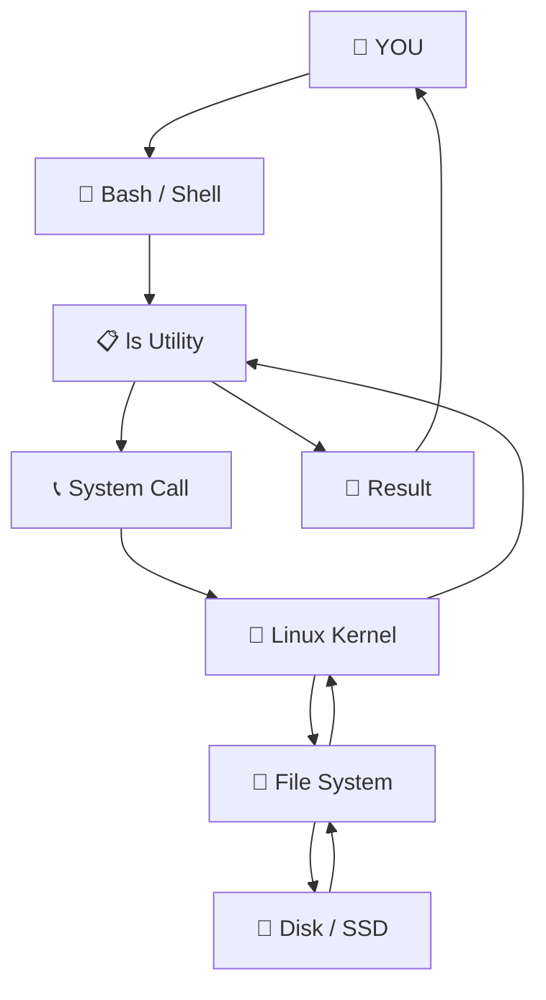

### Simple version

```text
You
 ↓
Bash
 ↓
ls
 ↓
System Call
 ↓
Linux Kernel
 ↓
File System / Disk
 ↓
Result
 ↓
You
```

The important thing here is:

> **You don't directly communicate with the hardware.**

The Linux Kernel manages access to the hardware.

---

# 12. What is Disk / Storage?

Now let's talk about **storage**.

Disk storage is used to **permanently store data**.

For example, your system can store:

```text
Operating System
Applications
Documents
Photos
Videos
Docker Images
Logs
Configuration Files
```

Two common types of storage devices are:

```text
HDD
SSD
```

Both are storage devices.

---

# 13. What is HDD?

HDD means:

> **Hard Disk Drive**

An HDD uses **magnetic spinning platters** and mechanical components.

A simplified view:

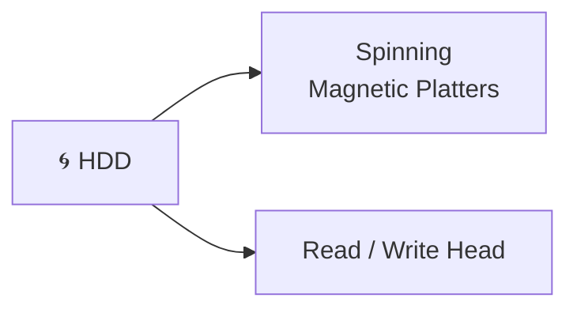

Some characteristics of HDD:

```text
Mechanical
Spinning platters
Moving parts
Generally slower than SSD
Usually lower cost per GB
Good for bulk storage
```

The important thing is that an HDD has moving mechanical parts.

---

# 14. What is SSD?

SSD means:

> **Solid State Drive**

An SSD uses **flash memory**.

Unlike an HDD, it doesn't have spinning mechanical platters.

A simplified view:

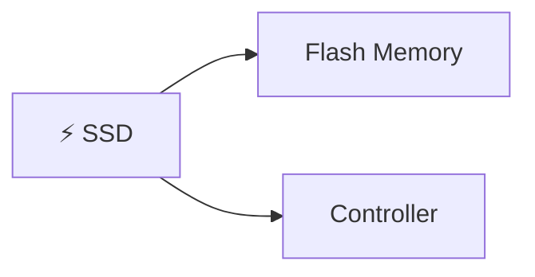

Some characteristics:

```text
Flash memory
No spinning platters
No mechanical moving parts
Faster response
Quiet
Generally more expensive per GB
```

---

# 15. SSD vs HDD

We can compare them like this:

| Feature          | SSD                            | HDD             |
| ---------------- | ------------------------------ | --------------- |
| Technology       | Flash memory                   | Magnetic disk   |
| Moving parts     | No                             | Yes             |
| Speed            | Faster                         | Slower          |
| Noise            | Quiet                          | Can make noise  |
| Cost per GB      | Usually higher                 | Usually lower   |
| Shock resistance | Generally better               | Generally worse |
| Common use       | OS, applications, fast storage | Bulk storage    |

The easiest way to remember:

```text
SSD → Speed ⚡

HDD → Spinning Disk 🌀
```

---

# 16. Where does SSD/HDD fit into Linux?

The SSD or HDD is actually **hardware**.

Linux doesn't directly become the disk.

The Linux Kernel manages access to that hardware.

So we can understand the flow like this:

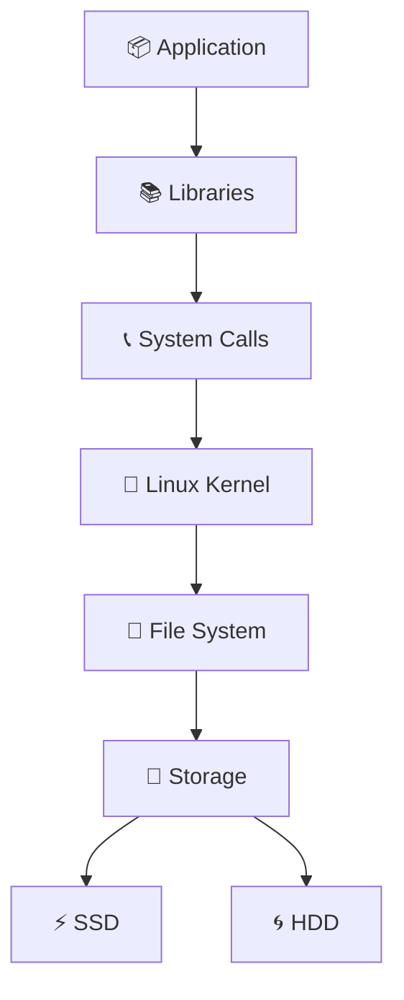

So remember:

```text
SSD / HDD = Hardware

Linux Kernel = Manages access to storage
```

---

# 17. Complete Example — Reading a File

Now let's take everything we learned and use one practical example.

Suppose we run:

```bash
cat notes.txt
```

What happens?

First, we type the command.

```text
You
 ↓
Bash
```

Bash executes the `cat` utility.

```text
You
 ↓
Bash
 ↓
cat
```

Now `cat` needs to read the contents of `notes.txt`.

So it uses a system call.

The request goes to the Linux Kernel.

The kernel works with the file system and storage to get the data.

The complete flow is:

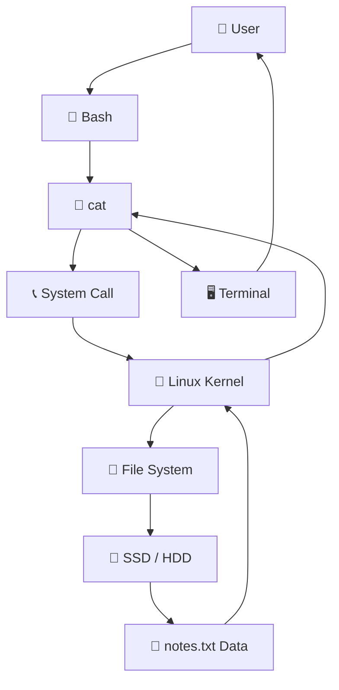

### Simple flow

```text
You
 ↓
Bash
 ↓
cat
 ↓
System Call
 ↓
Linux Kernel
 ↓
File System
 ↓
SSD / HDD
 ↓
Data
 ↓
Terminal
 ↓
You
```

This one example helps connect many of the Linux concepts together.

---

# 18. Linux Distribution

Now another important concept is **Linux Distribution**.

We often hear names such as:

```text
Ubuntu
Debian
Fedora
RHEL
Rocky Linux
AlmaLinux
Alpine
Arch
```

These are Linux distributions built around the Linux Kernel.

They have their own:

```text
Packages
Tools
Defaults
Release Models
```

We can visualize it like this:

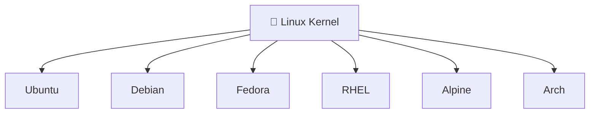

So basically, think of the **Linux Kernel as the common foundation**.

Different distributions are built around that foundation.

---

# 19. Ubuntu and APT

For our current learning, one important combination is:

```text
Ubuntu → APT
```

APT is a **package manager**.

It helps us with things like:

```text
Install software
Update package information
Upgrade packages
Remove software
Manage dependencies
```

For example:

```bash
sudo apt install nginx
```

Here we are using APT to install the Nginx package.

---

# 20. Why do we use `sudo`?

You will often see commands such as:

```bash
sudo apt update
```

So what is `sudo`?

`sudo` allows an authorized user to run a command with **elevated privileges**.

We can understand it like this:

```text
Normal User
     ↓
   sudo
     ↓
Elevated Privileges
     ↓
Administrative Operation
```

So when we perform certain administrative operations, we may need elevated privileges.

Users, groups, permissions and `sudo` will be covered more deeply when studying Linux user management and file permissions.

---

# 21. Complete Linux Mental Model

Now let's put everything together.

This is the most important diagram to remember:

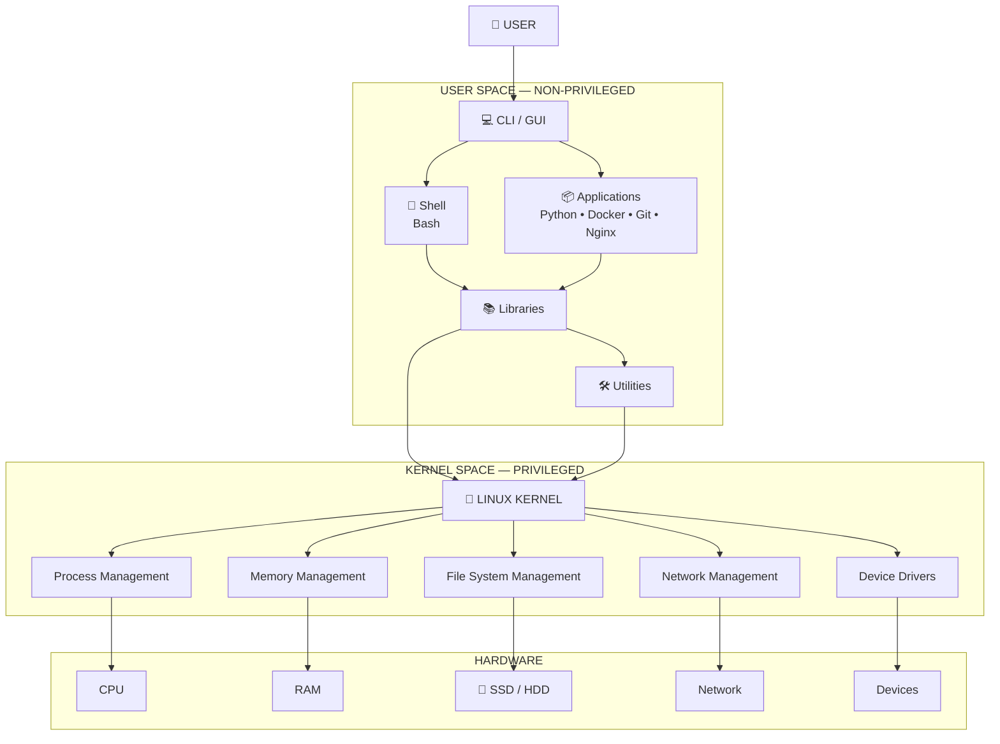

So now we have:

```text
USER
  ↓
USER SPACE
  ↓
System Calls
  ↓
LINUX KERNEL
  ↓
HARDWARE
```

Inside User Space we have:

```text
Applications
Shell
Libraries
Utilities
```

And the Kernel handles things such as:

```text
Process Management
Memory Management
File System Management
Network Management
Device Drivers
```

And finally, the kernel manages the hardware:

```text
CPU
RAM
SSD / HDD
Network
Devices
```

---

# 22. The Things I Should Remember

I don't need to memorize every single line.

I mainly need to understand these concepts.

## 1️⃣ Hardware

```text
CPU
RAM
Disk
Network
Devices
```

## 2️⃣ Operating System

The Operating System acts as a bridge between users/applications and hardware.

## 3️⃣ Linux Kernel

The Linux Kernel is the core of Linux and manages system resources and hardware.

## 4️⃣ User Space

```text
Applications
Shell
Libraries
Utilities
```

These are normal user-level programs.

## 5️⃣ Kernel Space

```text
Linux Kernel
```

The kernel operates with high-level system access.

## 6️⃣ Non-Privileged Mode

Normal applications run with limited privileges.

## 7️⃣ Privileged Mode

The kernel operates with high-level privileges to manage the system.

## 8️⃣ System Calls

System calls provide a controlled way for applications to request services from the kernel.

## 9️⃣ SSD vs HDD

```text
SSD → Flash memory → Faster

HDD → Spinning magnetic disk → Slower
```

## 🔟 Linux Distribution

```text
Linux Kernel
     ↓
Distribution
     ↓
Ubuntu / Debian / Fedora / RHEL / etc.
```

---

# 🧠 FINAL MEMORY CHAIN

If someone asks me:

> **"Explain Linux from the basics."**

I should think about this:

```text
Hardware
   ↓
Linux Kernel
   ↓
User Space
   ↓
Applications / Shell / Libraries / Utilities
   ↓
System Calls
   ↓
Linux Kernel
   ↓
Hardware
```

And Linux distributions are built around the Linux Kernel:

```text
Linux Kernel
     ↓
Linux Distribution
     ↓
Ubuntu / Fedora / RHEL / Alpine / etc.
```

Ubuntu uses APT as its package manager:

```text
Ubuntu
   ↓
APT
```

---

# ⭐ Simplest Mental Model

```text
                👤 USER
                   │
                   ▼
           ┌─────────────────┐
           │   USER SPACE    │
           │                 │
           │ Applications    │
           │ Shell           │
           │ Libraries       │
           │ Utilities       │
           └────────┬────────┘
                    │
               System Calls
                    │
                    ▼
           ┌─────────────────┐
           │  LINUX KERNEL   │
           │                 │
           │ Process         │
           │ Memory          │
           │ File System     │
           │ Network         │
           │ Drivers         │
           └────────┬────────┘
                    │
                    ▼
           ┌─────────────────┐
           │    HARDWARE     │
           │                 │
           │ CPU             │
           │ RAM             │
           │ SSD / HDD       │
           │ Network         │
           │ Devices         │
           └─────────────────┘
```

> 🧠 **The main thing I need to remember:**
>
> **Users and applications run in User Space, they request services through the Linux Kernel, and the Kernel manages access to the Hardware.**
