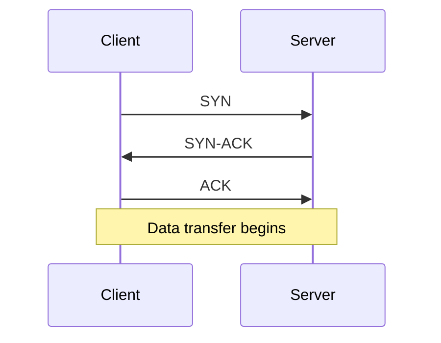
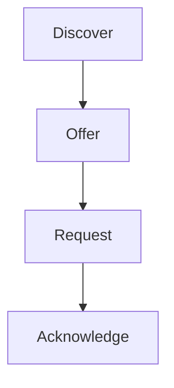
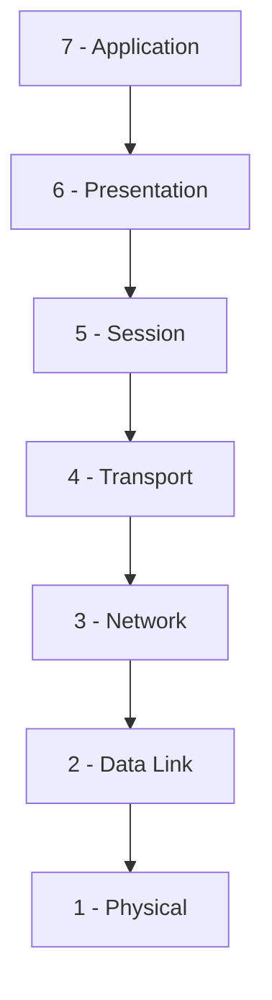
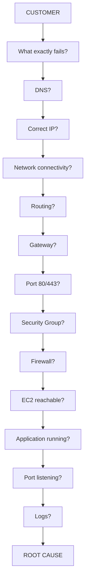
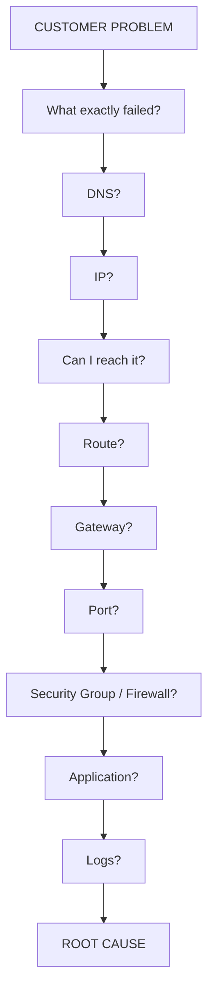

# 🌐 Networking Fundamentals

These are my networking notes for my **Cloud Support Associate preparation**.

My main goal here is not just to memorize networking terms. I want to understand **what each thing does and, more importantly, what I should check when something is not working.**

---

# 1. 🌐 What is a Computer Network?

I understood a computer network as a group of **two or more devices connected together** so that they can communicate and exchange data and resources.

Some examples of network devices are:

* Computers
* Phones
* Servers
* Printers
* Routers
* Switches

These devices communicate with each other using **networking protocols**.

For example:

```text
Laptop ───── Router ───── Internet ───── Web Server
```

Suppose I want to access:

```text
amazon.com
```

My laptop needs some way to communicate with the server where Amazon is hosted.

That whole communication is basically **networking**.

---

## 📮 Simple example

I can compare networking with sending a letter.

```text
You
 ↓
Your address
 ↓
Post office
 ↓
Other post offices
 ↓
Destination address
 ↓
Receiver
```

Networking works in a similar way:

```text
Your computer
 ↓
Source IP
 ↓
Routers
 ↓
Destination IP
 ↓
Server
```

So I can think of:

**Source → Path → Destination**

---

# 2. ☁️ Why do I need Networking in Cloud Support?

This is very important for Cloud Support.

Suppose a customer tells me:

> "My application is running on an AWS EC2 instance, but I can't access it."

I cannot just say:

> "Restart the server." 😅

I need to investigate where exactly the problem is.

I might check:

```text
Is EC2 running?
      ↓
Is the application running?
      ↓
Is the application listening on the correct port?
      ↓
Is the Security Group allowing the port?
      ↓
Is the subnet correct?
      ↓
Is the route table correct?
      ↓
Is the gateway available?
      ↓
Is DNS resolving correctly?
      ↓
Is the server actually receiving packets?
      ↓
Check logs
```

This is why networking is **extremely important for Cloud Support**.

---

# 3. 🧠 Networking Concepts I Need to Know

The main concepts covered here are:

* IP address
* MAC address
* Port
* Protocol
* HTTP
* HTTPS
* TCP
* UDP
* DNS
* DHCP
* SSH
* Packet
* Logs
* Subnet
* Route table
* Gateway
* Security Group
* Network devices
* Switch
* Router
* Firewall
* OSI model
* Cloud Support troubleshooting mindset

---

# 4. 🌐 IP Address

An IP address is basically the **network address used to identify where a device/interface is reachable on a network**.

Example:

```text
192.168.1.10
```

I think of an IP address like a **house address**.

If I want to send something to a particular house, I need its address.

Similarly, in networking, the network needs an address to know where traffic should go.

---

## Real-world example

Suppose my laptop has:

```text
192.168.1.10
```

And the web server has:

```text
142.250.183.14
```

When my laptop sends traffic to the web server:

```text
Source       → 192.168.1.10
Destination  → 142.250.183.14
```

So IP addresses help identify the source and destination.

---

## ☁️ Cloud Support example

An EC2 instance might have:

```text
Private IP → 10.0.1.25
```

When troubleshooting connectivity, I need to know the IP of the EC2 instance.

---

# 5. 🆔 MAC Address

A MAC address identifies a **network interface on the local network**.

Example:

```text
00:1A:2B:3C:4D:5E
```

The simple way I remember it is:

```text
IP  → Where?
MAC → Which local network interface?
```

---

## Real-world example

Suppose my laptop wants to communicate with another device on the same LAN.

It may need to find:

```text
IP → MAC
```

Protocols such as **ARP** help discover the MAC address associated with an IPv4 address on the local network.

So the basic relationship is:

```text
IP
 ↓
ARP
 ↓
MAC
```

---

# 6. 🚪 Port

A port identifies a **particular network service on a machine**.

The easiest way I remember it:

```text
IP   = Building address
Port = Particular door/service
```

For example:

```text
Server: 10.0.1.25

SSH    → 22
HTTP   → 80
HTTPS  → 443
```

So:

```text
10.0.1.25:443
```

means:

> Connect to the HTTPS service on that server.

---

## ☁️ Cloud Support example

Customer says:

> "My website isn't opening."

I would think:

```text
Is server reachable?
       ↓
Is application running?
       ↓
Is it listening on port 443?
       ↓
Is port 443 allowed through firewall/security group?
```

This is a very common Cloud Support troubleshooting path.

---

# 7. 📜 Protocol

A protocol is basically a **set of rules that defines how devices communicate**.

I can compare it with humans.

If two people don't agree on a language or communication rules, communication becomes difficult.

Computers also need rules.

Some examples are:

```text
HTTP
HTTPS
TCP
UDP
DNS
DHCP
SSH
```

Each protocol has a specific purpose.

---

# 8. 🌐 HTTP

**HTTP = Hypertext Transfer Protocol**

HTTP is used for communication between a **client and a web server**.

Normally:

```text
HTTP → Port 80
```

For example, if I type:

```text
http://example.com
```

my browser sends an HTTP request to the web server.

The server sends an HTTP response back.

```text
Browser
   ↓ HTTP request
Web Server
   ↓ HTTP response
Browser
```

One important thing I need to remember:

> **HTTP itself does not provide encryption.**

---

# 9. 🔐 HTTPS

**HTTPS = HTTP over TLS**

HTTPS provides encrypted communication between the client and server.

Normally:

```text
HTTPS → Port 443
```

For example, when I log into a bank website, I don't want someone on the network to simply read:

* Username
* Password
* Banking information

HTTPS/TLS helps protect this communication through:

* Encryption
* Server authentication

So:

```text
HTTP
 ↓
Web communication
 ↓
No TLS encryption
```

Whereas:

```text
HTTPS
 ↓
Web communication
 ↓
TLS protection
 ↓
Usually port 443
```

---

# 10. 🔄 TCP

TCP is a **connection-oriented transport protocol** that provides:

* Reliable delivery
* Ordered delivery
* Connection-oriented communication
* Ports

Suppose I'm downloading a file.

I don't want the data to arrive like:

```text
Packet 1
Packet 4
Packet 2
Packet 7
```

with missing data and no recovery.

TCP helps provide **reliable and ordered delivery**, including retransmission when necessary.

---

## TCP 3-way handshake

Before normal TCP data transfer, the endpoints establish a connection using the **TCP 3-way handshake**.



Simple way to remember:

```text
Client → SYN
Server → SYN-ACK
Client → ACK

Then data transfer begins.
```

---

# 11. 📡 UDP

UDP is a **connectionless transport protocol**.

Unlike TCP, it does not provide TCP's built-in reliability and ordering.

It is generally simpler and has less protocol overhead than TCP.

---

## Real-world example

DNS queries commonly use UDP.

For example:

```text
Laptop
   ↓
"What is the IP of amazon.com?"
   ↓
DNS Server
   ↓
"Here is the IP"
```

UDP is also commonly used for:

* DNS
* Streaming
* Voice/video
* Online gaming

The application can choose how much reliability it needs.

---

# 12. 📖 DNS

**DNS = Domain Name System**

DNS converts **domain names into IP addresses**.

I think of it like a phonebook.

```text
Human-friendly name
        ↓
amazon.com
        ↓
DNS
        ↓
IP address
```

For example, when I type:

```text
amazon.com
```

my computer needs an IP address to communicate with the destination.

DNS helps answer:

```text
amazon.com → <IP address>
```

Then my computer can connect to that destination.

---

## ☁️ Cloud Support troubleshooting

Suppose a customer says:

> "The website isn't opening."

I can check whether the domain resolves.

For example:

```bash
nslookup example.com
```

or:

```bash
dig example.com
```

If DNS resolution fails, the problem may be **DNS-related rather than the web server itself**.

---

# 13. 🧩 DHCP

The term is **DHCP**.

**DHCP = Dynamic Host Configuration Protocol**

DHCP automatically provides network configuration to a device.

It can provide things like:

* IP address
* Subnet mask/prefix
* Default gateway
* DNS server

---

## Real-world example

When I connect my laptop to Wi-Fi, I normally don't manually enter:

```text
IP = ?
Gateway = ?
DNS = ?
```

Usually DHCP provides this configuration automatically.

---

## DHCP DORA

The classic DHCP process is called **DORA**.



Simple:

```text
Discover
   ↓
Offer
   ↓
Request
   ↓
Acknowledge
```

We'll go deeper into DORA later.

---

# 14. 🔑 SSH

**SSH = Secure Shell**

SSH allows me to securely access a remote machine through a **command-line interface**.

Normally:

```text
SSH → TCP port 22
```

---

## ☁️ Cloud Support example

Suppose I have an EC2 Linux server:

```text
EC2
10.0.1.25
```

I need to investigate why an application isn't working.

I can SSH into the server and check:

```text
Is the process running?
Is the service running?
Is the port listening?
Are there errors in the logs?
```

SSH is one of the most important tools for **Linux and Cloud Support**.

---

# 15. 📦 Packet

A packet is a **unit of data carried across a network**.

Instead of sending a huge amount of data as one giant piece, networking breaks the data into smaller units.

I can think about moving house.

```text
Huge amount of belongings
        ↓
Pack into multiple boxes
        ↓
Transport boxes
        ↓
Reassemble at destination
```

Networking is similar:

```text
Application data
      ↓
Transport/network processing
      ↓
Packets
      ↓
Network
      ↓
Destination
```

---

## ☁️ Cloud Support example

If one server can't communicate with another server, I may need to investigate whether packets are:

```text
Leaving the source?
       ↓
Taking the correct route?
       ↓
Being blocked?
       ↓
Reaching the destination?
```

Tools such as:

```text
ping
traceroute
tcpdump
```

become useful.

We'll learn these later.

---

# 16. 📝 Logs

Logs are records of events generated by:

* Systems
* Applications
* Services

I think of logs as the **history book of a server/application**.

For example:

```text
Application started
User connected
Database connection failed
Permission denied
Connection timeout
Service stopped
```

---

## Real-world example

Customer says:

> "The application was working yesterday, but today it is failing."

Instead of guessing, I check the logs.

I might find:

```text
Database connection failed
```

Now I know the application itself may not be the root cause.

### My Cloud Support mindset:

> **Don't guess. Check the evidence.**

Logs are one of my best sources of evidence.

---

# 17. 🏠 Subnet

A subnet is a **smaller network created from a larger IP network**.

For example:

```text
10.0.0.0/16
```

can be divided into:

```text
10.0.1.0/24
10.0.2.0/24
10.0.3.0/24
```

I can think of it like a large apartment complex:

```text
Large network
      ↓
Different buildings/sections
      ↓
Smaller networks = subnets
```

---

## ☁️ AWS example

A VPC might contain:

```text
VPC:      10.0.0.0/16

Subnet A: 10.0.1.0/24
Subnet B: 10.0.2.0/24
```

Different resources can be placed into different subnets.

We'll later learn **public vs private subnets** properly.

---

# 18. 🛣️ Route Table

A route table contains rules that tell **network traffic where to go**.

I can compare it with a GPS.

```text
Destination
     ↓
Which direction should I take?
```

A route table answers:

> "For this destination, where should I send the traffic?"

Example:

```text
Destination       Target
10.0.0.0/16       local
0.0.0.0/0         Internet Gateway
```

Meaning:

```text
10.0.0.0/16
→ Keep traffic within the VPC/local routing domain.

0.0.0.0/0
→ For other destinations, send traffic toward the Internet Gateway.
```

---

## ☁️ Cloud Support scenario

Customer says:

> "My EC2 instance has a public IP, but I can't reach it."

I don't immediately blame EC2.

I check:

```text
EC2
 ↓
Subnet
 ↓
Route table
 ↓
Internet Gateway
 ↓
Security Group
 ↓
Network ACL
```

Routing is a major part of cloud troubleshooting.

---

# 19. 🚪 Gateway

A gateway is a **device or network endpoint that provides a path from one network to another**.

The common concept I'll hear first is the **Default Gateway**.

My machine uses the default gateway when the destination is outside its local network.

Example:

```text
Laptop
192.168.1.10
     ↓
Default Gateway
192.168.1.1
     ↓
Internet
```

I remember it like:

> "If I don't know how to reach that outside network, send the traffic to my gateway."

---

## AWS

An **Internet Gateway (IGW)** provides a path between a VPC and the internet when the relevant routing and public addressing configuration allow it.

---

# 20. 🛡️ Security Group

This is very important for AWS Cloud Support.

An AWS Security Group acts as a **virtual firewall for resources such as EC2 instances**.

It controls allowed network traffic based on rules such as:

* Protocol
* Port
* Source/Destination

Example:

```text
Protocol: TCP
Port: 22
Source: Your IP
```

This allows SSH connections from that source.

Another example:

```text
Protocol: TCP
Port: 443
Source: 0.0.0.0/0
```

This allows HTTPS traffic from IPv4 addresses broadly, assuming the rest of the network path is configured correctly.

---

## ☁️ Cloud Support scenario

Customer:

> "My EC2 server is running, but SSH isn't working."

I check:

```text
EC2 running?          ✓
Correct IP?           ✓
SSH service running?  ?
Port 22 listening?    ?
Security Group?       ← Is TCP 22 allowed?
Route?                ?
```

A blocked Security Group rule can prevent the connection.

---

# 21. 🖧 Network Devices

The main network devices I should know now are:

```text
Switch
Router
Firewall
```

---

# 22. 🔀 Switch

A switch connects devices within a **local network**.

It forwards Ethernet frames based primarily on **MAC addresses**.

Example:

```text
PC1 ──┐
PC2 ──┼── Switch
PC3 ──┘
```

I remember:

> **Switch = connects devices inside a local network.**

---

# 23. 🛣️ Router

A router connects different **IP networks** and forwards packets based on routing information.

Example:

```text
Network A
192.168.1.0/24
       ↓
     Router
       ↓
Network B
10.0.0.0/24
```

I remember:

> **Router = connects different networks.**

### Cloud Support connection

AWS route tables determine where traffic should go, and AWS networking components provide routing paths between networks.

---

# 24. 🔥 Firewall

A firewall controls network traffic according to defined rules.

It can:

* Allow traffic
* Block traffic

Example:

```text
Internet
   ↓
Firewall
   ↓
Server
```

Rules:

```text
Allow TCP 443
Block TCP 22
```

So:

```text
HTTPS → allowed
SSH   → blocked
```

In AWS, **Security Groups** are a major example of virtual firewall controls.

---

# 25. 🌐 OSI Model

Now comes the big one.

**OSI = Open Systems Interconnection**

The OSI model is a conceptual model that divides network communication into **7 layers**.

Each layer has a different responsibility.

I can think about sending a parcel:

```text
I create the message
       ↓
Prepare it
       ↓
Start communication
       ↓
Make sure delivery works
       ↓
Find the destination
       ↓
Prepare it for the local network
       ↓
Send it through cable/Wi-Fi
```

Networking works in a similar layered way.

---

# 26. 🔢 The 7 OSI Layers



The seven layers are:

```text
7 → Application
6 → Presentation
5 → Session
4 → Transport
3 → Network
2 → Data Link
1 → Physical
```

---

# 27. 🧠 What does the OSI Model ACTUALLY mean?

This is important.

I don't want to think:

> "OSI is just seven layers I need to memorize for an interview."

Instead, I understand it as:

> **OSI gives me a structured way to understand where something is happening in network communication.**

For example, a customer says:

> "I cannot access the website."

I can think:

```text
Application
 ↓
Is the web application working?

Transport
 ↓
Is TCP/port 443 working?

Network
 ↓
Is IP connectivity/routing working?

Data Link
 ↓
Is local network communication working?

Physical
 ↓
Is the underlying connection available?
```

This gives me a structured troubleshooting approach.

---

# 28. ☁️ Router

### What is a router?

A router connects different networks and decides where network traffic should go.

I can think of a router like a **road junction**.

```text
Your Network
     ↓
   Router
     ↓
  Internet
```

Suppose my laptop is on:

```text
192.168.1.0/24
```

The internet is a different network.

The router provides the path between them.

---

## Scenario

I open:

```text
google.com
```

My laptop needs to send traffic outside the local network.

It sends the traffic toward its default gateway/router.

```text
Laptop
   ↓
Router
   ↓
Internet
   ↓
Google
```

### Cloud Support scenario

Suppose:

```text
EC2 A → EC2 B ✓
```

works inside the VPC.

But:

```text
EC2 A → Internet ✗
```

doesn't work.

I might check the **route table and internet gateway/path**.

Remember:

> **Router = connects different networks and helps traffic find its way.**

---

# 29. 🛣️ Route

A route is an **instruction telling traffic where to go**.

I can compare it with Google Maps:

```text
You → Highway → Destination
```

The route tells me which way to go.

In networking:

```text
Destination → Where should traffic go?
```

Example:

```text
Destination: 0.0.0.0/0
Target: Internet Gateway
```

This basically means:

> "For destinations outside the local network, send the traffic toward the Internet Gateway."

Scenario:

```text
EC2
 ↓
Route table
 ↓
"Internet traffic → Internet Gateway"
 ↓
Internet
```

If the route is missing:

```text
EC2
 ↓
Route table
 ↓
❌ No path to internet
```

Remember:

> **Route = direction/path for network traffic.**

---

# 30. 🧱 Network ACL

This is important in AWS.

A **Network ACL (NACL)** is a set of rules that can allow or block network traffic for a **subnet**.

I can think of it as a security gate around a whole area.

```text
          NACL
     ┌─────────────┐
     │   Subnet    │
     │             │
     │ EC2  EC2    │
     │             │
     └─────────────┘
```

It can have rules such as:

```text
Allow traffic
Block traffic
```

---

## Scenario

Suppose my EC2 is inside a subnet.

Customer says:

> "My application isn't reachable."

I check:

```text
Application ✓
Port ✓
Security Group ✓
       ↓
     NACL?
```

If the NACL blocks the traffic, the request may not reach the EC2.

### Simple difference

```text
Security Group
→ Controls traffic for the resource/interface

NACL
→ Controls traffic at the subnet level
```

I don't need to worry about the deeper differences yet. I'll study them properly when I start AWS networking.

Remember:

> **NACL = security rules for a subnet.**

---

# 31. 🌐 HTTP

HTTP is a protocol used for communication between a **browser and a web server**.

I can think of it like:

```text
Browser
   ↓
"Give me the webpage"
   ↓
Web Server
   ↓
"Here is the webpage"
   ↓
Browser
```

That's HTTP communication.

Normally:

```text
HTTP → Port 80
```

Scenario:

```text
http://example.com
```

The browser communicates with the web server using HTTP.

```text
Browser
   ↓
HTTP request
   ↓
Server
   ↓
HTTP response
   ↓
Browser
```

Remember:

> **HTTP = communication used by websites.**

---

# 32. 🔐 TLS

TLS sounds complicated, but I understand the basic idea simply.

TLS protects data while it travels between my computer and the server.

I can think about sending a letter.

Without protection:

```text
You → Letter → Server
```

Someone who can read the traffic may be able to see the contents.

With TLS:

```text
You
 ↓
🔒 Protected communication
 ↓
Server
```

The communication is encrypted.

---

# 33. 🔐 HTTPS

Now I combine HTTP and TLS:

```text
HTTP + TLS
    ↓
  HTTPS
```

So HTTPS means:

> **Web communication protected using TLS.**

Normally:

```text
HTTPS → Port 443
```

Scenario:

```text
https://example.com
```

The browser and server establish a secure TLS connection, then HTTP communication happens through that protected connection.

```text
Browser
   ↓
TLS protection
   ↓
HTTP communication
   ↓
Server
```

Remember:

```text
HTTP
→ Website communication

HTTPS
→ Website communication + TLS protection
```

---

# 34. ⚙️ Service

This is especially important for **Linux and Cloud Support**.

A service is a program that runs in the **background** and provides some function.

Examples:

* SSH service
* Web server
* Database service

For example, an SSH server runs as a service.

---

## Scenario

Customer says:

> "I can't SSH into my Linux server."

I connect through another available method and check whether the SSH service is running.

Conceptually:

```text
Server
  ↓
SSH service
  ↓
Running? ✓
```

If the service isn't running:

```text
SSH connection
      ↓
     ✗
```

Remember:

> **Service = a program running in the background to provide a function.**

---

# 35. 🪪 Certificate

I mainly hear about certificates when discussing **HTTPS/TLS**.

A TLS certificate helps a browser verify that it is communicating with the **correct website/server**.

I think of it like an **ID card for a website**.

```text
Website
   ↓
Certificate
   ↓
"Yes, this website is who it says it is."
```

---

## Scenario

I visit:

```text
https://example.com
```

The server presents its certificate during the TLS setup.

The browser checks:

```text
Is the certificate valid?
Is it for this website?
Has it expired?
Can it be trusted?
```

If something is wrong, the browser may show a certificate warning.

Example:

```text
Certificate expired
       ↓
HTTPS problem
       ↓
Browser warning
```

Remember:

> **Certificate = website's digital ID used with TLS.**

---

# 36. ⚙️ TLS Configuration

TLS configuration means:

> **The settings that control how HTTPS/TLS works on the server.**

For example, the server needs to be configured to:

```text
Use HTTPS
      ↓
Use the correct certificate
      ↓
Accept secure connections
```

---

## Scenario

Customer says:

> "HTTP works, but HTTPS doesn't."

I check:

```text
HTTP → 80 → ✓

HTTPS → 443 → ✗
```

Then I investigate:

```text
Is port 443 open?
       ↓
Is something listening on 443?
       ↓
Is HTTPS configured?
       ↓
Is the certificate correct?
       ↓
Is the certificate expired?
       ↓
Check logs
```

---

# 37. 🔥 Put Everything Together

Imagine the customer says:

> "My website on EC2 isn't opening."

Now I think:

```text
                 USER
                   ↓
                  DNS
                   ↓
               IP address
                   ↓
                 Route
                   ↓
                Gateway
                   ↓
              Network ACL
                   ↓
             Security Group
                   ↓
                Port 443
                   ↓
              Web service
                   ↓
              HTTPS / TLS
                   ↓
              Certificate
                   ↓
                Website
```

Now all these words are connected.

Each one has a job.

---

# 38. 🧠 Super Simple Cheat Sheet

| Word              | Simple meaning                          | What I think                 |
| ----------------- | --------------------------------------- | ---------------------------- |
| Router            | Connects different networks             | Road junction                |
| Route             | Tells traffic where to go               | Google Maps direction        |
| NACL              | Allows/blocks traffic for a subnet      | Gate around an area          |
| HTTP              | Website communication                   | Web conversation             |
| HTTPS             | Website communication protected by TLS  | Secure web conversation      |
| TLS               | Protects communication with encryption  | Locked communication         |
| Certificate       | Website's digital ID                    | ID card                      |
| TLS configuration | Settings for HTTPS/TLS                  | Security settings            |
| Service           | Background program providing a function | Worker running in background |

---

# 39. 🎯 Scenario to Test My Understanding

Imagine:

```text
EC2 is running.
Application is running.
DNS is working.
But the website doesn't open using https://
```

I think:

```text
DNS ✓
 ↓
EC2 ✓
 ↓
Application ✓
 ↓
HTTPS?
 ↓
Port 443?
 ↓
Security Group?
 ↓
NACL?
 ↓
Firewall?
 ↓
Is service listening on 443?
 ↓
TLS configuration?
 ↓
Certificate?
 ↓
Logs
```

This is how I want to start thinking as a **Cloud Support Associate**.

> **Don't just know what a component is. Know what question to ask when that component could be causing a problem.**

---

# 40. 🌐 OSI Model — Understanding the Layers

The OSI model is a way of dividing network communication into **7 layers**.

Each layer has a different job.

The seven layers are:

```text
7️⃣ Application
6️⃣ Presentation
5️⃣ Session
4️⃣ Transport
3️⃣ Network
2️⃣ Data Link
1️⃣ Physical
```

---

# 41. 7️⃣ Application Layer

This is the layer closest to the **user/application**.

It deals with network services that applications use.

Examples:

```text
HTTP
HTTPS
DNS
SSH
```

### Scenario

I open:

```text
https://example.com
```

My browser uses HTTPS to communicate with the web server.

```text
Browser
   ↓
Application Layer
   ↓
HTTPS
```

Remember:

> **Layer 7 = Application communication**

---

# 42. 6️⃣ Presentation Layer

This layer deals with how data is represented.

For example:

* Formatting
* Encoding
* Encryption

For my Cloud Support preparation, the main idea is:

> It helps make data understandable between systems.

Scenario:

One system sends data in one format and another system needs it in a usable format.

Encryption-related processing can also be associated with this layer in the OSI model.

Remember:

> **Layer 6 = Data format / representation**

I don't need to spend too much time on this layer right now.

---

# 43. 5️⃣ Session Layer

This layer helps start, manage, and end **communication sessions between applications**.

I think of it as:

```text
Start conversation
       ↓
Keep conversation going
       ↓
End conversation
```

Scenario:

Two applications communicate with each other.

The session layer conceptually manages that communication session.

Remember:

> **Layer 5 = Session / conversation**

Again, I don't need to over-focus on this one right now.

---

# 44. 4️⃣ Transport Layer ⭐

This is very important for Cloud Support.

The transport layer handles communication between applications using protocols such as:

```text
TCP
UDP
```

Ports are also associated with this layer.

Examples:

```text
HTTPS → TCP → Port 443
SSH   → TCP → Port 22
```

### Scenario

Customer says:

> "I can't access my HTTPS website."

I might check:

```text
Is TCP 443 allowed?
       ↓
Is the application listening on 443?
```

Remember:

> **Layer 4 = TCP/UDP + Ports**

---

# 45. 3️⃣ Network Layer ⭐

This is also very important.

The network layer deals with:

* IP addresses
* Routing

The main protocol I need to know here is:

```text
IP
```

Scenario:

My EC2 wants to communicate with another network.

```text
EC2
 ↓
IP
 ↓
Router / Route
 ↓
Destination network
```

The network layer helps determine where packets should go.

Remember:

> **Layer 3 = IP + Routing**

---

# 46. 2️⃣ Data Link Layer ⭐

This layer handles communication on the **local network**.

Important concepts:

* MAC address
* Ethernet
* Switch

Scenario:

Two computers are connected to the same local network:

```text
PC A
 ↓
Switch
 ↓
PC B
```

The switch uses MAC addresses to forward Ethernet frames.

Remember:

> **Layer 2 = MAC + Switch + local network**

---

# 47. 1️⃣ Physical Layer

This is the actual **physical transmission of bits**.

Examples:

* Network cable
* Fiber
* Radio/Wi-Fi signals

### Wi-Fi example

```text
Laptop
  ↓
Wi-Fi signal
  ↓
Router
```

### Cable example

```text
Computer
   ↓
Ethernet cable
   ↓
Switch
```

Remember:

> **Layer 1 = Physical connection**

---

# 48. 🧠 Easiest Way to Remember All 7

I don't want to memorize complicated definitions.

I remember them like this:

```text
7️⃣ Application  → HTTP, HTTPS, DNS, SSH
6️⃣ Presentation → Data format
5️⃣ Session      → Communication session
4️⃣ Transport    → TCP, UDP, Ports
3️⃣ Network      → IP, Routing
2️⃣ Data Link    → MAC, Switch
1️⃣ Physical     → Cable, Wi-Fi
```

---

# 49. 🔥 Cloud Support Example Using OSI

Customer says:

> "I cannot access my website."

I can use the OSI model to think about where the problem might be.

```text
7️⃣ Application
       ↓
Is the website/application working?

4️⃣ Transport
       ↓
Is TCP working?
Is port 443 open?

3️⃣ Network
       ↓
Is the IP correct?
Is routing working?

2️⃣ Data Link
       ↓
Is local network communication working?

1️⃣ Physical
       ↓
Is there a network connection?
```

For Cloud Support, I'll spend much more time on:

```text
L7
L4
L3
L2
```

than memorizing Layers 5 and 6.

---

# 50. 🎯 One Important Example

Suppose:

```text
Website → Not opening
```

I can think:

```text
Layer 7 → Is the application working?
    ↓
Layer 4 → Is TCP 443 working?
    ↓
Layer 3 → Is IP/routing working?
    ↓
Layer 2 → Is local network working?
    ↓
Layer 1 → Is there connectivity?
```

That's why the OSI model is useful.

It gives me a way to break a **big networking problem into smaller problems**.

---

## ⭐ Four Layers I Especially Need to Remember

```text
L7 → Application → HTTP/HTTPS/DNS/SSH
L4 → Transport  → TCP/UDP/Ports
L3 → Network    → IP/Routing
L2 → Data Link  → MAC/Switch
```

These four will come up again and again when doing real troubleshooting scenarios.

---

# 51. 🧠 Cloud Support Mindset

This is probably the most important part of the lesson.

I should not troubleshoot like this:

```text
Problem
 ↓
Random command
 ↓
Restart server
 ↓
Still broken
 ↓
Panic 😭
```

Instead, I should think:

```text
Customer reports problem
        ↓
Understand the symptom
        ↓
Identify the layer/component
        ↓
Check connectivity
        ↓
Check DNS
        ↓
Check IP/routing
        ↓
Check port
        ↓
Check firewall/security group
        ↓
Check application
        ↓
Check logs
        ↓
Find root cause
        ↓
Fix
        ↓
Verify
```

This is the mindset I need to develop.

---

# 52. 🔥 Real-World Cloud Support Scenario

Imagine an AWS customer says:

> "My website hosted on an EC2 instance is not opening."

I should not immediately restart EC2.

I think:

### Step 1 — DNS

Does `example.com` resolve to the expected IP?

### Step 2 — IP/connectivity

Can we reach the destination?

### Step 3 — Routing

Is the subnet's route table configured correctly?

### Step 4 — Gateway

Is there a valid path to/from the internet?

### Step 5 — Security

Is TCP 443 allowed by the Security Group?

### Step 6 — Server

Is EC2 running?

### Step 7 — Application

Is the web server running?

### Step 8 — Port

Is something listening on 443?

### Step 9 — Logs

Do application/system logs show an error?

That's **Cloud Support thinking**.

---

# 53. 📝 My Networking Cheat Sheet

| Concept        | Simple meaning                                    | I think of it as                    |
| -------------- | ------------------------------------------------- | ----------------------------------- |
| IP address     | Network address                                   | House address                       |
| MAC address    | Local network interface address                   | Local identity                      |
| Port           | Identifies a service                              | Door                                |
| Protocol       | Communication rules                               | Language/rules                      |
| Packet         | Unit of network data                              | Package/box                         |
| DNS            | Name → IP resolution                              | Phonebook                           |
| DHCP           | Automatically provides network configuration      | Reception desk assigning an address |
| SSH            | Secure remote access                              | Remote terminal                     |
| HTTP           | Web communication                                 | Web conversation                    |
| HTTPS          | Web communication protected by TLS                | Secure web conversation             |
| TCP            | Reliable, ordered transport                       | Registered/reliable delivery        |
| UDP            | Connectionless transport                          | Lightweight delivery                |
| Subnet         | Smaller network                                   | Section of a large area             |
| Route table    | Decides where traffic goes                        | GPS                                 |
| Gateway        | Path to another network                           | Exit gate                           |
| Security Group | AWS virtual firewall rules                        | Security guard                      |
| Switch         | Connects devices in a local network               | Office switchboard                  |
| Router         | Connects different networks                       | Road junction                       |
| Firewall       | Allows/blocks traffic                             | Security checkpoint                 |
| Logs           | Record of events                                  | CCTV/history                        |
| OSI model      | Framework for understanding network communication | Troubleshooting map                 |

---

# 54. 🎯 What I Want to Understand

I don't want to master everything at once.

The core picture is:

```text
                 NETWORK COMMUNICATION

Application
    ↓
Protocol (HTTP/HTTPS/DNS/SSH)
    ↓
Port
    ↓
TCP / UDP
    ↓
IP Address
    ↓
Routing
    ↓
Gateway
    ↓
Network
    ↓
Destination
```

And when something breaks:

```text
DNS?
 ↓
IP?
 ↓
Route?
 ↓
Gateway?
 ↓
Port?
 ↓
Firewall / Security Group?
 ↓
Application?
 ↓
Logs?
```

This is the foundation I'm building on.

---

# 55. 🧠 Cloud Support Troubleshooting Questions

## 1. 🌐 Customer Cannot Access a Website

Customer says:

> "The website is not opening."

I think:

```text
Does DNS resolve the domain?
        ↓
Does the domain resolve to the correct IP?
        ↓
Can I reach the IP?
        ↓
Is the route correct?
        ↓
Is the gateway reachable?
        ↓
Is port 443 open?
        ↓
Is the firewall allowing it?
        ↓
Is the Security Group allowing it?
        ↓
Is the web server running?
        ↓
Is the application listening on port 443?
        ↓
What do the logs say?
```

---

# 56. 🔌 Server is Running but Application is Unreachable

Customer says:

> "My EC2 instance is running, but I can't access my application."

I think:

```text
Is EC2 actually running?
        ↓
Is the application running?
        ↓
Is the application listening?
        ↓
Which port is it listening on?
        ↓
Is that port allowed?
        ↓
Security Group?
        ↓
Network ACL?
        ↓
Route table?
        ↓
Gateway?
        ↓
Can packets reach the server?
        ↓
Check logs
```

### Key lesson

> **Server running ≠ application reachable.**

---

# 57. 🚪 Port 443 is Not Reachable

Customer says:

> "The server is reachable, but HTTPS isn't working."

I think:

```text
Is the server reachable?
        ↓
Is the application running?
        ↓
Is something listening on 443?
        ↓
Is TCP 443 allowed?
        ↓
Security Group?
        ↓
Firewall?
        ↓
Network ACL?
        ↓
Is the application actually configured for HTTPS?
        ↓
Check application/TLS logs
```

---

# 58. 🔐 SSH is Not Working

Customer says:

> "I cannot SSH into my EC2 instance."

I think:

```text
Is EC2 running?
        ↓
Am I using the correct IP?
        ↓
Can I reach the IP?
        ↓
Is TCP port 22 allowed?
        ↓
Security Group?
        ↓
Network ACL?
        ↓
Route table?
        ↓
Gateway?
        ↓
Is SSH service running?
        ↓
Is the SSH server listening on port 22?
        ↓
Check server logs
```

Remember:

```text
SSH → TCP → Port 22
```

---

# 59. 🌍 Website Works Using IP but Not Domain Name

This is a very important interview scenario.

Customer says:

> "If I enter the IP address, the website works. But if I enter the domain name, it doesn't."

I think:

```text
Application?
       ↓
Probably working
       ↓
IP connectivity?
       ↓
Probably working
       ↓
DNS?
       ↓
Check DNS
       ↓
Does domain resolve?
       ↓
Does it resolve to the correct IP?
```

My first suspect is:

```text
DNS
```

Because:

```text
IP works
Domain doesn't
     ↓
DNS becomes a strong suspect
```

---

# 60. 📛 Domain Doesn't Resolve

Customer says:

> "The domain name isn't resolving."

I think:

```text
Does DNS query reach DNS server?
        ↓
Is DNS server reachable?
        ↓
Does the DNS record exist?
        ↓
Is the record correct?
        ↓
Is there a typo in the domain?
        ↓
Is DNS configuration correct?
```

For example:

```bash
nslookup example.com
```

I'm trying to answer:

> **"Can the name be translated into an IP?"**

---

# 61. 📦 Packets are Not Reaching the Server

Customer says:

> "The client is sending requests, but the server isn't receiving them."

I think:

```text
Client
  ↓
Is packet leaving client?
  ↓
Correct destination IP?
  ↓
Correct route?
  ↓
Gateway?
  ↓
Firewall?
  ↓
Security Group?
  ↓
Network ACL?
  ↓
Server interface?
  ↓
Is packet reaching server?
```

This is where **packet-level troubleshooting** becomes important.

---

# 62. 🔄 Server Can Communicate Internally but Not With Internet

Imagine:

```text
EC2 A → EC2 B
✓ Works
```

But:

```text
EC2 → Internet
✗ Doesn't work
```

I think:

```text
Is private networking working?
        ↓
Yes
        ↓
Check route table
        ↓
Is there a 0.0.0.0/0 route?
        ↓
Is the target correct?
        ↓
Internet Gateway?
        ↓
Public IP / addressing?
        ↓
Security Group?
        ↓
Network ACL?
```

### Important lesson

> Don't immediately blame the application.

The problem may be **routing or internet connectivity**.

---

# 63. 🛣️ Server Has an IP but Cannot Reach Another Network

Customer says:

> "My server has an IP address, but it can't communicate with another network."

I think:

```text
Does the destination belong to the local network?
        ↓
If not
        ↓
Where should the packet go?
        ↓
Route table
        ↓
Default gateway / specific gateway
        ↓
Router
        ↓
Destination network
```

The important question is:

> **"Does the machine know where to send the packet?"**

---

# 64. 🚧 Customer's Request is Being Blocked

Customer says:

> "The application is running and listening on the correct port, but customers cannot connect."

I think:

```text
Application ✓
        ↓
Port listening ✓
        ↓
Network path?
        ↓
Firewall?
        ↓
Security Group?
        ↓
Network ACL?
        ↓
Is traffic explicitly allowed?
```

This is where I start thinking about:

```text
ALLOW
  vs
DENY
```

---

# 65. 🏠 Two Machines Cannot Communicate on Same Network

Imagine:

```text
PC-A
192.168.1.10

PC-B
192.168.1.20
```

Both should be on the same subnet, but communication fails.

I think:

```text
Are both IP addresses correct?
        ↓
Are they in the same subnet?
        ↓
Can they resolve each other's local MAC address?
        ↓
ARP?
        ↓
Switch?
        ↓
Network interface?
        ↓
Firewall?
```

Important relationship:

```text
IP
 ↓
ARP
 ↓
MAC
 ↓
Switch
```

We'll study this properly later.

---

# 66. 📡 DNS Works, but Website Doesn't

Customer says:

> "DNS is resolving correctly, but the website still doesn't open."

Now I don't keep checking DNS.

I move forward:

```text
DNS ✓
 ↓
Correct IP? ✓
 ↓
Can we reach IP?
 ↓
Routing?
 ↓
Gateway?
 ↓
Port 443?
 ↓
Firewall?
 ↓
Security Group?
 ↓
Application?
 ↓
Logs?
```

### Cloud Support lesson

> **Once I've proven one layer is working, I move to the next layer.**

I shouldn't keep checking the same thing.

---

# 67. 🐌 Website is Extremely Slow

Customer says:

> "The website opens, but it takes 30 seconds."

I shouldn't immediately assume:

> "Network problem."

I think:

```text
DNS slow?
      ↓
Network latency?
      ↓
TCP connection slow?
      ↓
TLS handshake slow?
      ↓
Server overloaded?
      ↓
Application slow?
      ↓
Database slow?
      ↓
Check CPU/memory/logs
```

Important support mindset:

> **"Not every network-looking problem is a network problem."**

---

# 68. 🔒 HTTPS Doesn't Work but HTTP Works

Customer says:

> "HTTP works on port 80, but HTTPS doesn't work on port 443."

I think:

```text
Application running?
        ↓
Port 80 → works ✓
        ↓
Port 443 → fails
        ↓
Is TCP 443 listening?
        ↓
Is 443 allowed by firewall?
        ↓
Security Group?
        ↓
TLS configured?
        ↓
Certificate?
        ↓
Application HTTPS configuration?
        ↓
Logs
```

This narrows my investigation significantly.

---

# 69. 📡 TCP Connection is Failing

Customer says:

> "The application is running, but clients can't establish a TCP connection."

I first check the network and port:

```text
Correct destination IP?
        ↓
Correct destination port?
        ↓
Is service listening?
        ↓
Is route available?
        ↓
Is packet reaching server?
        ↓
Firewall?
        ↓
Security Group?
        ↓
Network ACL?
        ↓
Server/application?
```

Remember:

```text
TCP
 ↓
Connection
 ↓
Port
```

---

# 70. 🤝 TCP Connection Isn't Being Established

I know:

```text
SYN
 ↓
SYN-ACK
 ↓
ACK
```

Now imagine:

```text
Client → SYN → Server
Server → ???
```

I ask:

> Why didn't SYN-ACK come back?

I investigate:

```text
Is server reachable?
        ↓
Is port open?
        ↓
Is service listening?
        ↓
Firewall?
        ↓
Security Group?
        ↓
Server issue?
```

This is much better than simply memorizing:

> "TCP has a 3-way handshake."

---

# 71. 💻 Application is Running but Port Isn't Listening

Customer says:

> "The application process is running, but nobody can connect."

I think:

```text
Process running?
      ↓
YES
      ↓
Is it listening on expected port?
      ↓
NO
      ↓
Application configuration?
      ↓
Wrong port?
      ↓
Wrong bind address?
      ↓
Application logs?
```

This is a very common **Linux + Cloud Support** scenario.

---

# 72. 📝 Application Suddenly Stopped Working

Customer says:

> "Everything was working yesterday. Today it's down."

I think:

```text
Is server running?
        ↓
Is process running?
        ↓
Is service running?
        ↓
Is port listening?
        ↓
DNS?
        ↓
Network?
        ↓
Firewall/Security Group?
        ↓
Application logs?
        ↓
System logs?
        ↓
What changed recently?
```

The last question is extremely important:

> **"What changed?"**

Possible changes can include:

* Configuration changes
* Deployments
* Firewall changes
* DNS changes
* Certificates
* Permissions

These can cause failures.

---

# 73. 🧱 Firewall vs Application Problem

Customer says:

> "The application is working locally on the server, but I can't access it remotely."

I think:

```text
Test application locally
        ↓
Works ✓
        ↓
Application probably healthy
        ↓
Test remotely
        ↓
Fails ✗
        ↓
Network path?
        ↓
Port?
        ↓
Firewall?
        ↓
Security Group?
        ↓
Routing?
```

This is a powerful troubleshooting technique:

> **Compare local vs remote behavior.**

---

# 74. 🧠 Full Cloud Support Scenario

Interview question:

> "A customer says their website hosted on an EC2 instance is not accessible. How would you troubleshoot it?"

My brain should immediately start:



The flow is:

```text
CUSTOMER
   ↓
What exactly fails?
   ↓
DNS?
   ↓
Correct IP?
   ↓
Network connectivity?
   ↓
Routing?
   ↓
Gateway?
   ↓
Port 80/443?
   ↓
Security Group?
   ↓
Firewall?
   ↓
EC2 reachable?
   ↓
Application running?
   ↓
Port listening?
   ↓
Logs?
   ↓
ROOT CAUSE
```

That's the mindset I want to develop.

---

# 75. 🔥 The Golden Rule

Whenever I get a Cloud Support problem, I should ask myself:

## 1. What exactly is failing?

Not:

> "The server is down."

Instead ask:

> **"What exactly cannot be done?"**

---

## 2. Where is it failing?

```text
DNS?
 ↓
Network?
 ↓
Routing?
 ↓
TCP?
 ↓
Port?
 ↓
Firewall?
 ↓
Application?
 ↓
Logs?
```

---

## 3. What evidence do I have?

I shouldn't say:

> "I think the firewall is blocking it."

Instead:

> "I tested connectivity and confirmed the service is listening on port 443, but the connection is being blocked before reaching the application. I'll investigate the firewall/Security Group rules."

The important idea is:

> **Evidence > Guessing.**

---

## 4. Change ONE thing at a time

### Bad troubleshooting

```text
Change Security Group
Restart server
Change route
Restart application
Change DNS
```

Now I don't know what actually fixed the problem.

### Better troubleshooting

```text
Check DNS
   ↓
Check IP
   ↓
Check route
   ↓
Check port
   ↓
Check firewall
   ↓
Check application
```

> **One step at a time.**

---

# 76. ☁️ Cloud Support Troubleshooting — Interview Answers

## Scenario 1 — EC2 is Running, but SSH Isn't Working

### Question

The EC2 instance is running, but SSH isn't working. What would I check, and in what order?

### My answer

I would check step by step:

```text
EC2 running?
     ↓
Correct IP address?
     ↓
Can I reach the IP?
     ↓
Is port 22 allowed?
     ↓
Security Group?
     ↓
Network ACL?
     ↓
Route table?
     ↓
Gateway?
     ↓
Is SSH service running?
     ↓
Is SSH listening on port 22?
     ↓
Check logs
```

Remember:

```text
SSH → TCP → Port 22
```

### Simple interview answer

> "First, I would make sure I'm using the correct IP. Then I would check connectivity and whether TCP port 22 is allowed by the Security Group and other network rules. After that, I would check the route and gateway, and finally verify that the SSH service is running and listening on port 22."

---

# 77. Scenario 2 — IP Works, Domain Doesn't

### Question

`example.com` doesn't open, but accessing the server using its IP works. What would I suspect first? Why?

### My answer

I would suspect **DNS first**.

Because:

```text
IP address → Works ✓
Domain name → Doesn't work ✗
```

So I check:

```text
Does the domain resolve?
        ↓
Does it give the correct IP?
```

Example:

```bash
nslookup example.com
```

### Simple interview answer

> "I would check DNS first because the website works using the IP address but not using the domain name. I would verify whether the domain is resolving to the correct IP."

---

# 78. Scenario 3 — HTTP Works, HTTPS Doesn't

### Question

HTTP on port 80 works, but HTTPS on port 443 doesn't. What would I investigate?

### My answer

Since:

```text
Port 80 → Works ✓
```

but:

```text
Port 443 → Doesn't work ✗
```

I would focus on HTTPS and port 443.

```text
Is application running?
        ↓
Is port 443 listening?
        ↓
Is port 443 allowed?
        ↓
Security Group?
        ↓
Firewall?
        ↓
Network ACL?
        ↓
HTTPS/TLS configuration?
        ↓
Certificate?
        ↓
Logs
```

### Simple interview answer

> "Since HTTP is working, I would focus on port 443. I would check whether the application is listening on 443, whether the Security Group and firewall allow it, and whether HTTPS, TLS, and the certificate are configured correctly."

---

# 79. Scenario 4 — DNS Works, but Website Doesn't Open

### Question

DNS resolves correctly, but the website still doesn't open. What would I check next?

### My answer

DNS is already confirmed:

```text
DNS → Works ✓
```

So I don't keep checking DNS.

I move forward:

```text
Correct IP?
     ↓
Can I reach the IP?
     ↓
Route?
     ↓
Gateway?
     ↓
Port 80/443?
     ↓
Firewall?
     ↓
Security Group?
     ↓
Application?
     ↓
Logs
```

### Simple interview answer

> "Since DNS is working, I would move to the network connection. I would check the IP, route, gateway, required port, Security Group, firewall, and then the application and logs."

---

# 80. Scenario 5 — Application is Running, but Clients Cannot Connect

### Question

The application process is running, but clients cannot connect. What question should I ask about the port?

### My answer

I ask:

> **"Is the application listening on the expected port?"**

For example:

```text
Application running ✓
        ↓
Is it listening on port 443?
        ↓
YES / NO
```

If NO:

```text
Check application configuration
        ↓
Check correct port
        ↓
Check logs
```

If YES:

```text
Check firewall
       ↓
Security Group
       ↓
Network ACL
       ↓
Route
```

### Simple interview answer

> "I would check whether the application is actually listening on the expected port."

---

# 81. Scenario 6 — EC2 Can Talk to Another EC2 but Not the Internet

### Question

Which networking components would I investigate?

### My answer

Since:

```text
EC2 → EC2 ✓
```

works, but:

```text
EC2 → Internet ✗
```

doesn't, I would check the internet path.

```text
Route table
     ↓
Is there a route to the internet?
     ↓
Internet Gateway?
     ↓
Public IP/addressing?
     ↓
Security Group?
     ↓
Network ACL?
```

### Simple interview answer

> "Since communication between the EC2 instances works, I would check the route table, Internet Gateway, public addressing, Security Group, and Network ACL for internet connectivity."

---

# 82. Scenario 7 — Works Locally but Fails Remotely

### Question

The application works directly on the server but fails when accessed remotely. Where would I focus?

### My answer

This is a useful clue.

```text
Application on server → Works ✓

Remote access → Fails ✗
```

So I focus on the **network path between the client and server**.

```text
Is the application listening?
        ↓
Correct port?
        ↓
Firewall?
        ↓
Security Group?
        ↓
Network ACL?
        ↓
Route?
        ↓
Gateway?
```

### Simple interview answer

> "Because the application works locally, I would focus on the network path. I would check the port, firewall, Security Group, Network ACL, routing, and gateway."

---

# 83. Scenario 8 — "My Server Has an IP. Why Can't I Reach It?"

### Question

What else must be true for communication to work?

### My answer

Having an IP is **not enough**.

I also need:

```text
Correct IP
    +
Correct route
    +
Gateway/path
    +
Correct port
    +
Firewall allows traffic
    +
Security Group allows traffic
    +
Application is running
    +
Application is listening on the port
```

### Simple interview answer

> "Having an IP address doesn't guarantee connectivity. I would also check the route, gateway, port, firewall, Security Group, and whether the application is running and listening."

---

# 84. Scenario 9 — TCP Connection Cannot Be Established

### Question

What would I check before blaming the application?

### My answer

I would first check the network and port:

```text
Correct destination IP?
        ↓
Correct port?
        ↓
Is the service listening?
        ↓
Is there a route?
        ↓
Can packets reach the server?
        ↓
Firewall?
        ↓
Security Group?
        ↓
Network ACL?
```

Only after checking these would I focus more deeply on the application.

### Simple interview answer

> "Before blaming the application, I would check the destination IP, port, route, packet path, firewall, Security Group, and Network ACL. I would also verify that the service is listening on the expected port."

---

# 85. 🔥 Scenario 10 — Full Interview Question

### Question

> "My EC2 instance is healthy, my application is running, DNS is resolving, but users still cannot access the website. Walk me through your troubleshooting approach."

### My answer

I would troubleshoot it step by step.

First, I already know:

```text
EC2 → Healthy ✓
Application → Running ✓
DNS → Working ✓
```

So I move to the network path:

```text
Correct IP?
     ↓
Can users reach the IP?
     ↓
Route table?
     ↓
Gateway?
     ↓
Port 80/443?
     ↓
Security Group?
     ↓
Firewall?
     ↓
Network ACL?
     ↓
Is application listening?
     ↓
Check logs
```

Then I find exactly where the connection is failing.

### 🎤 Interview-style answer

> "First, I would confirm the exact problem users are seeing. Since the EC2 instance is healthy, the application is running, and DNS is resolving, I would check the network path. I would verify the IP, route table, gateway, required port, Security Group, firewall, and Network ACL. Then I would verify that the application is listening on the expected port and check the logs for errors. I would test each step one by one until I find where the connection is failing."

---

# 86. 🧠 The Pattern Behind ALL 10 Questions

This is the biggest thing I want to remember.



Or simply:

```text
       CUSTOMER PROBLEM
              ↓
      What exactly failed?
              ↓
             DNS?
              ↓
             IP?
              ↓
       Can I reach it?
              ↓
            Route?
              ↓
           Gateway?
              ↓
             Port?
              ↓
    Security Group / Firewall?
              ↓
         Application?
              ↓
            Logs?
              ↓
          ROOT CAUSE
```

---

# 🔥 FINAL THING I WANT TO REMEMBER

The most important thing from this networking preparation is:

> **I should not just memorize what a networking component is. I should understand what question to ask when that component could be causing a problem.**

Whenever I get a Cloud Support issue, I should think:

```text
What exactly is failing?
        ↓
Where is it failing?
        ↓
What evidence do I have?
        ↓
Check one thing at a time
        ↓
Find the root cause
        ↓
Fix it
        ↓
Verify it
```

The complete troubleshooting picture in my head should be:

```text
Customer
   ↓
DNS
   ↓
IP
   ↓
Connectivity
   ↓
Route
   ↓
Gateway
   ↓
Port
   ↓
Security Group / Firewall / NACL
   ↓
Service
   ↓
Application
   ↓
Logs
   ↓
Root Cause
```

This is the networking foundation I need for my **Cloud Support Associate preparation**.
