# 🖥️ OS DAY 16 — COMPLETE OS TROUBLESHOOTING

**Cloud Support Engineer Preparation | Linux | Operating Systems | Troubleshooting**

---

## 🎯 What I'm Learning Today

Today, I'm bringing together everything I've learned about operating systems.

I need to start thinking like a Cloud Support Engineer.

### My Golden Rule

- ❌ Don't randomly restart the server.
- ❌ Don't guess the cause without evidence.
- ✅ Understand the problem.
- ✅ Collect evidence.
- ✅ Identify the root cause.
- ✅ Apply the appropriate fix.
- ✅ Verify that the customer's problem is resolved.

### My Troubleshooting Approach

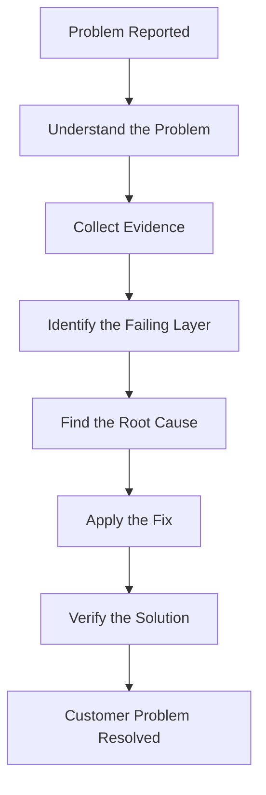

---

# 1. Scenario: Linux Machine Is Very Slow 🐌

Imagine a customer reports that their Linux server has become very slow.

I should investigate CPU, memory, load average, disk space, and historical resource usage before deciding what action to take.

## Step 1 — Check CPU Utilization

```bash
top
```

To find processes consuming the most CPU:

```bash
ps aux --sort=-%cpu | head
```

I should check:

- CPU utilization.
- Processes consuming excessive CPU.
- Whether CPU usage remains high.
- Load average and overall system responsiveness.

### Troubleshooting Flow

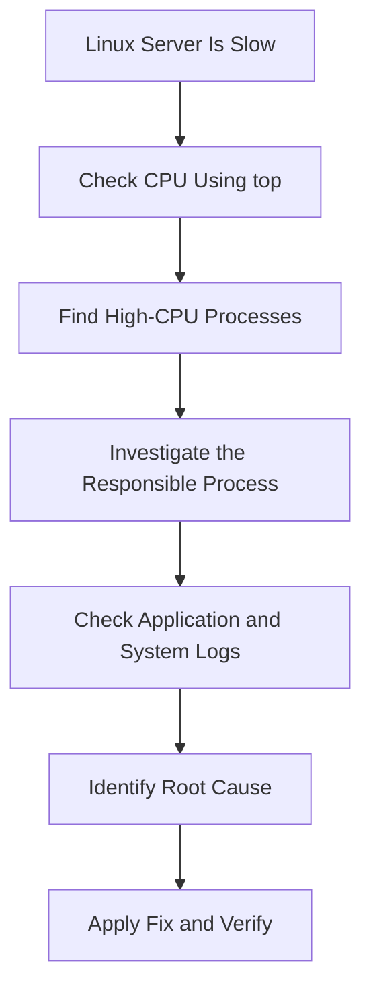

## Step 2 — Check Memory Usage

```bash
free -h
```

To find processes consuming the most memory:

```bash
ps aux --sort=-%mem | head
```

I should check:

- Available RAM.
- Memory used by applications.
- Swap usage.
- Possible memory exhaustion.

**Important:** High memory usage alone does not necessarily indicate a problem. Linux uses available memory for caching. Check available memory, swap activity, and application behavior together.

## Step 3 — Check Load Average

```bash
uptime
```

Example output:

```text
load average: 2.00, 1.50, 1.20
```

These values represent average system load over approximately:

- `2.00` — Last 1 minute.
- `1.50` — Last 5 minutes.
- `1.20` — Last 15 minutes.

Load average reflects the average number of processes that are runnable or waiting in certain uninterruptible states.

**Important:** Interpret load average alongside the number of CPU cores and the workload. A load average of `2.00` does not automatically mean the server is unhealthy.

## Step 4 — Check Disk Space

```bash
df -h
```

This command displays filesystem capacity, used space, and available space.

A nearly full filesystem can cause applications to fail when they need to write files, logs, or temporary data.

## Step 5 — Find Directories Consuming Disk Space

```bash
du -sh /var/*
```

To inspect top-level directories:

```bash
du -sh /* 2>/dev/null
```

These commands help identify directories consuming significant disk space.

## Step 6 — Check Historical CPU Usage

```bash
sar -u
```

If `sar` is installed and historical data collection is configured, it can help investigate CPU utilization over time.

### 🧠 Interview Question: How Would You Troubleshoot a Slow Linux Machine?

**Answer:**

I would check CPU using `top`, memory using `free -h`, load using `uptime`, and disk usage using `df -h` and `du`. I would investigate resource-intensive processes and historical CPU usage using `sar` when available. Finally, I would identify the bottleneck, investigate its cause, and apply the appropriate fix.

---

# 2. Scenario: Server Is Heating Up 🔥

Imagine a customer reports that a server is getting unusually hot.

I should investigate resource utilization and the physical condition of the machine where applicable.

## Commands to Use

```bash
top
```

Check CPU utilization and running processes.

```bash
ps aux --sort=-%cpu | head
```

Identify processes consuming excessive CPU.

```bash
free -h
```

Check memory and swap usage.

```bash
uptime
```

Check load average.

```bash
sar -u
```

Review historical CPU utilization when historical data is available.

## What Else Should I Investigate?

**For a physical server:**

- Cooling fans.
- Airflow and ventilation.
- Dust accumulation.
- Ambient temperature.
- Hardware health and temperature sensors.

**For an AWS EC2 instance:**

- CPU utilization in CloudWatch.
- Resource-intensive processes.
- Memory and disk usage.
- Application logs.
- Monitoring alerts and workload changes.

An EC2 instance does not give me direct access to its physical cooling hardware. Physical infrastructure issues should be handled through the appropriate AWS support channels when warranted.

### Troubleshooting Flow

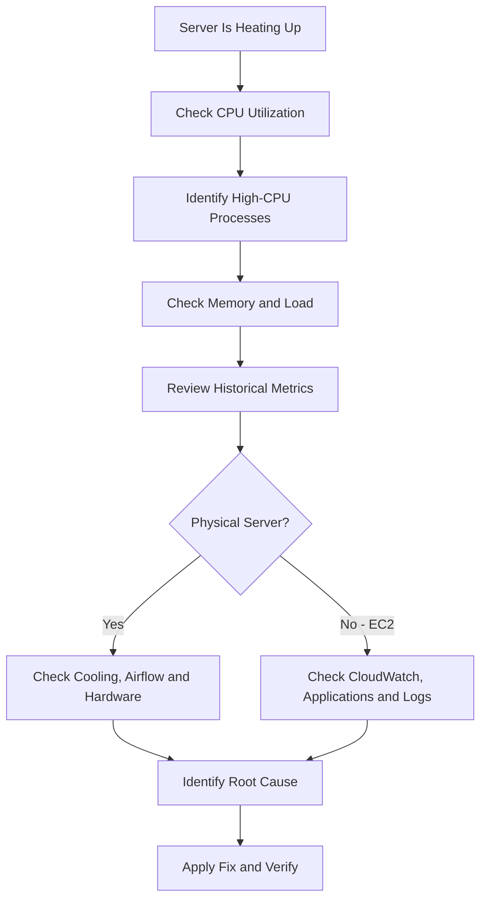

### 🧠 Interview Question: How Would You Troubleshoot a Heating Server?

**Answer:**

I would check CPU utilization, high-CPU processes, memory, load, and historical metrics. For a physical server, I would also investigate cooling, airflow, and hardware conditions. For an EC2 instance, I would review CloudWatch metrics and application behavior. I would identify the cause before taking corrective action.

---

# 3. Scenario: Disk Has Free Space, but a File Cannot Be Created ❌

Imagine a customer reports that the filesystem has 20 GB of free space, but they cannot create a file.

Possible causes include inode exhaustion, permission problems, filesystem restrictions, or other errors.

## Step 1 — Check Disk Space

```bash
df -h
```

Example:

```text
Filesystem      Size  Used  Avail  Use%
/dev/sda1        50G   30G    20G   60%
```

There is available disk space, but file creation is still failing.

## Step 2 — Check Inodes

```bash
df -i
```

Example:

```text
Filesystem      Inodes   IUsed   IFree  IUse%
/dev/sda1       100000  100000       0   100%
```

The filesystem has no free inodes.

### What Is an Inode?

An inode stores filesystem metadata about a file, such as ownership, permissions, and pointers to its data blocks.

When a filesystem runs out of available inodes, it may be unable to create new files even when storage space remains available.

This can happen when a directory tree contains a very large number of small files.

## Step 3 — Check Directory Permissions

```bash
ls -ld /path/to/directory
```

Check whether the user has the required permissions to create a file in the directory.

Also inspect the exact error message.

### Troubleshooting Flow

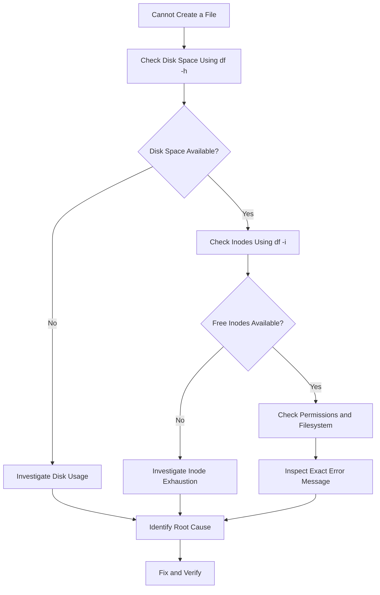

### 🧠 Interview Question: Disk Space Is Available, but a File Cannot Be Created. Why?

**Answer:**

One possible cause is inode exhaustion. I would use `df -i` to check inode availability. I would also check directory permissions, filesystem status, and the exact error message before concluding that inode exhaustion is the root cause.

---

# 4. Scenario: Linux Server Does Not Boot ❌

Imagine a server powers on but fails to boot into Linux.

I should identify the stage at which the boot process fails.

## Linux Boot Process

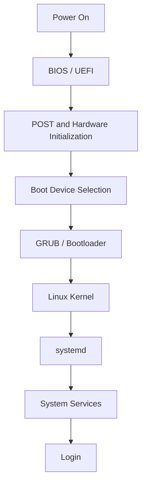

## If BIOS/UEFI Does Not Detect the Disk

Investigate:

- Storage device detection.
- Disk connections, where accessible.
- Storage hardware health.
- BIOS/UEFI configuration.

## If the Disk Is Detected but the System Cannot Boot

Check:

- Correct boot device.
- Boot order.
- Bootloader availability.
- Boot configuration.
- Operating system and filesystem accessibility.

## If the Kernel Starts but Boot Does Not Complete

Investigate:

- Kernel messages.
- Failed system services.
- `systemd` errors.
- Boot logs.

When the system is accessible, or from a suitable recovery environment with access to the relevant logs, use:

```bash
journalctl -b
```

To inspect logs from the previous boot, if they are retained:

```bash
journalctl -b -1
```

Previous boot logs might not be available if persistent journal storage is not configured.

### Troubleshooting Flow

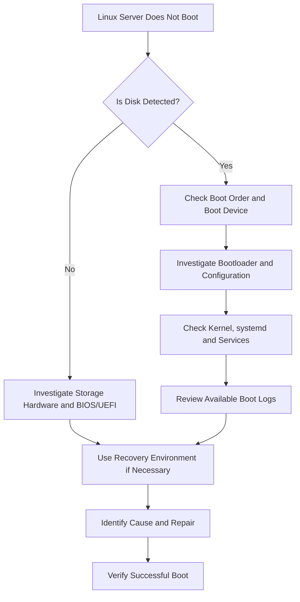

### 🧠 Interview Question: How Would You Troubleshoot a Linux Boot Failure?

**Answer:**

I would identify the stage where the boot process fails. First, I would check whether the storage device is detected, then verify the boot order and bootloader. If the kernel starts, I would investigate `systemd`, failed services, kernel messages, and available boot logs. I would use a recovery environment if necessary.

---

# 5. Scenario: Bootable Device Not Found 💻

The error `Bootable Device Not Found` means the system could not find a usable boot device through its current boot configuration.

I should not immediately assume that GRUB is broken.

## Troubleshooting Steps

1. Check whether BIOS/UEFI detects the storage device.
2. Verify that the correct boot device is selected.
3. Check the boot order.
4. Investigate the bootloader.
5. Check boot configuration and filesystem accessibility.
6. Use a recovery environment if required.
7. Repair the identified problem and verify that the system boots.

### Troubleshooting Flow

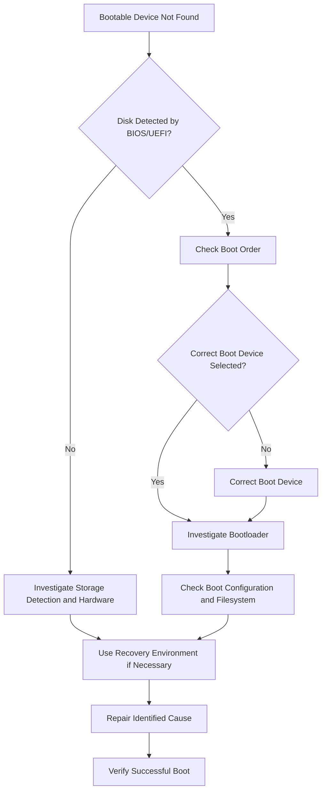

### 🧠 Interview Question: What Would You Do for Bootable Device Not Found?

**Answer:**

First, I would check whether the storage device is detected by BIOS/UEFI. If it is detected, I would verify the boot order and selected boot device. Then I would investigate the bootloader, boot configuration, and filesystem using a recovery environment if necessary.

---

# 6. Scenario: SSH Is Not Working 🔐

Imagine a customer reports that they cannot connect to their EC2 instance using SSH.

I need to combine my operating system and networking knowledge.

## Step 1 — Verify the Destination IP

```bash
ssh username@IP
```

Confirm that I am connecting to the correct IP address and using the correct username.

## Step 2 — Check Network Connectivity and AWS Configuration

For an EC2 instance, investigate:

- Security Group inbound rules.
- Network ACL rules, where applicable.
- Route tables and gateways.
- Public IP or private network connectivity.
- Network firewalls and the client's network.
- Whether TCP port 22 is reachable.

## Step 3 — Check Listening Ports

On the server, if I have access through SSH or an alternative management method:

```bash
sudo ss -lntp
```

Check whether the SSH service is listening on the expected port, usually `22`.

## Step 4 — Check SSH Service Status

On Ubuntu:

```bash
sudo systemctl status ssh
```

On distributions where the service is named `sshd`:

```bash
sudo systemctl status sshd
```

## Step 5 — Check SSH Logs

On Ubuntu:

```bash
sudo journalctl -u ssh
```

Depending on the distribution, the service unit may instead be named `sshd`.

## Step 6 — Investigate Authentication

If the error is `Permission denied`, investigate:

- Correct username.
- Correct SSH private key.
- Key and file permissions.
- Server-side authentication configuration.
- Account access restrictions.

## Common SSH Errors

| Error | Possible Causes |
|---|---|
| Connection timed out | Network path, routing, security rules, firewall, or unreachable host |
| Connection refused | No listener on the target port or an active rejection |
| Permission denied | Incorrect username, key, or authentication configuration |
| Host key verification failed | Host identity mismatch or changed host key |

### Troubleshooting Flow

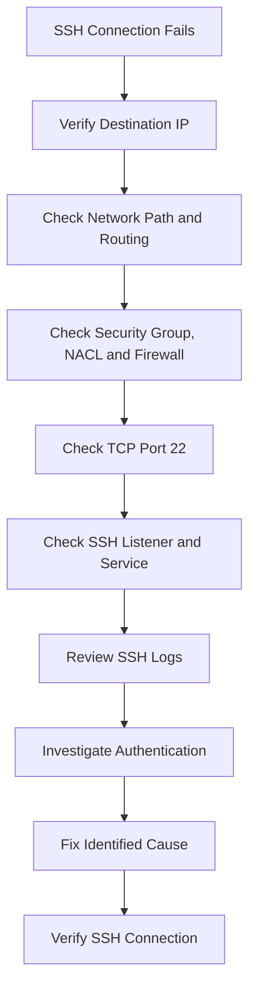

### 🧠 Interview Question: How Would You Troubleshoot SSH?

**Answer:**

I would verify the destination IP and network path, then check Security Groups, route tables, network ACLs, and firewall rules. Next, I would check whether port 22 is listening, verify the SSH service, review logs, and investigate authentication if necessary.

---

# 7. Scenario: A Service Is Not Running ❌

Imagine a customer reports that their web application is unavailable.

I should first check the service status instead of immediately restarting it.

## Step 1 — Check Service Status

```bash
sudo systemctl status nginx
```

This checks the status of the Nginx service.

## Step 2 — Check Service Logs

```bash
sudo journalctl -u nginx
```

Look for startup failures, configuration errors, permission issues, and other relevant messages.

## Step 3 — Start the Service If Appropriate

If the service is stopped and the cause is understood, or starting it is a safe diagnostic action:

```bash
sudo systemctl start nginx
```

If a restart is necessary after investigating the problem:

```bash
sudo systemctl restart nginx
```

Then verify the service:

```bash
sudo systemctl status nginx
```

## Step 4 — Verify the Actual Application

A running service does not automatically mean the application is accessible.

Check listening ports:

```bash
sudo ss -lntp
```

Test the local HTTP endpoint if appropriate:

```bash
curl -I http://localhost
```

Also check application logs and external connectivity.

### Troubleshooting Flow

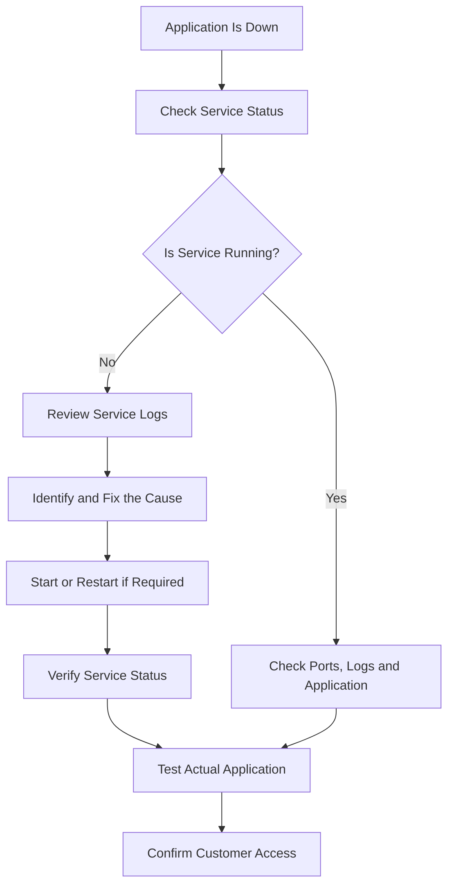

### 🧠 Interview Question: How Would You Troubleshoot a Service That Is Not Running?

**Answer:**

I would check the service using `systemctl status` and investigate its logs using `journalctl`. I would identify the cause, such as a configuration error, missing dependency, or port conflict. After applying the appropriate fix, I would start or restart the service if required and verify that the application is accessible.

---

# 8. The Big Troubleshooting Method 🧠

This is one of the most important concepts for my Cloud Support Engineer preparation.

Whenever a customer reports a problem, I should follow a structured troubleshooting approach.

## Step 1 — Understand the Problem

Ask these questions:

- What exactly is failing?
- When did the problem start?
- Is it affecting one user or everyone?
- What is the exact error message?
- Was there a recent change?
- Is the issue continuous or intermittent?

## Step 2 — Check the Basics

Investigate the relevant areas:

- Is the server running?
- Is network connectivity available?
- Is the service running?
- Is the required port listening?
- Is CPU usage unusually high?
- Is enough memory available?
- Is disk space available?
- Are permissions correct?
- Are there relevant errors in the logs?

## Step 3 — Collect Evidence

### Important Linux Commands

| Purpose | Command |
|---|---|
| CPU and processes | `top` |
| Top CPU-consuming processes | `ps aux --sort=-%cpu \| head` |
| Memory usage | `free -h` |
| Top memory-consuming processes | `ps aux --sort=-%mem \| head` |
| Load average | `uptime` |
| Disk space | `df -h` |
| Inode usage | `df -i` |
| Directory disk usage | `du -sh /path` |
| Historical CPU statistics | `sar -u` |
| Listening TCP ports | `ss -lntp` |
| Service status | `systemctl status <service>` |
| Service logs | `journalctl -u <service>` |
| Current boot logs | `journalctl -b` |
| Previous boot logs | `journalctl -b -1` |

**Note:** The `sar` command requires the relevant sysstat utilities and historical data collection. Some commands also require elevated privileges to display complete information.

## Step 4 — Identify the Failing Layer

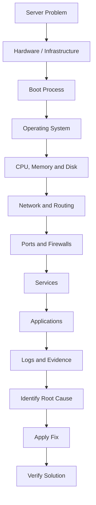

The troubleshooting path depends on the symptoms. I should not blindly follow every layer if the evidence already identifies the failing component.

## Step 5 — Fix the Problem

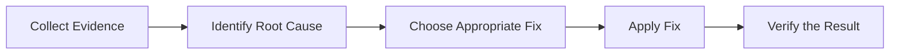

I should avoid unnecessary restarts, destructive commands, or configuration changes before understanding their impact.

## Step 6 — Verify the Solution

After applying a fix, I should confirm that:

- The service is running.
- The expected port is listening.
- The application responds correctly.
- The customer can access the service.
- The original error no longer occurs.
- Monitoring and logs show no new related failures.

**A successful command does not automatically mean the customer's problem is resolved.**

---

# 9. Cloud Support Master Scenario: EC2 Web Server Is Not Responding ☁️

Imagine a customer reports that their website hosted on an EC2 instance is not responding.

I should investigate the infrastructure, network, operating system, service, and application.

### Troubleshooting Flow

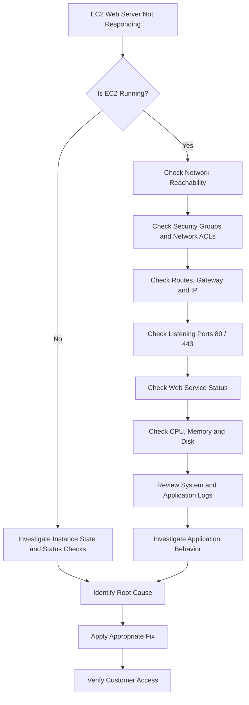

## My Investigation Checklist

### AWS Infrastructure

- EC2 instance state.
- Instance status checks.
- Security Group rules.
- Network ACL rules.
- Route tables and gateway configuration.
- Correct public or private IP connectivity.

### Linux Operating System

- CPU and memory usage.
- Disk space and inodes.
- Listening ports.
- Service status.
- System logs.

### Application

- Application health.
- Configuration errors.
- Dependencies.
- Application logs.
- HTTP response.
- Customer connectivity.

For an HTTPS issue, I should also investigate TLS certificates, TLS configuration, and port 443.

The objective is to isolate the failing component before making changes.

---

# 10. Day 16 Interview Questions and Answers 🎯

## Q1. How Would You Troubleshoot a Slow Linux Machine?

I would check CPU using `top`, memory using `free -h`, load using `uptime`, and disk usage using `df -h` and `du`. I would investigate resource-intensive processes and historical CPU data using `sar` when available. Then I would identify the bottleneck and investigate its cause.

## Q2. Disk Space Is Available, but a File Cannot Be Created. Why?

The filesystem may have exhausted its inodes. I would check `df -i`, verify directory permissions, and inspect the exact error message to identify the cause.

## Q3. How Would You Troubleshoot a Heating Server?

I would check CPU utilization, resource-intensive processes, memory, load, and historical metrics. For a physical server, I would also inspect cooling and hardware conditions. For an EC2 instance, I would investigate CloudWatch metrics, applications, and logs.

## Q4. How Would You Troubleshoot SSH?

I would verify the destination IP and network path, check Security Groups, routes, network ACLs, and firewall rules, and confirm that port 22 is reachable. Then I would investigate the SSH listener, service logs, and authentication.

## Q5. What Would You Do for Bootable Device Not Found?

I would first check whether the storage device is detected by BIOS/UEFI. Then I would verify the boot order and selected device before investigating the bootloader, boot configuration, and filesystem.

## Q6. How Would You Troubleshoot a Service That Is Not Running?

I would check `systemctl status` and review logs using `journalctl`. I would investigate configuration errors, dependencies, permissions, and port conflicts. After fixing the cause, I would start or restart the service if necessary and verify the application.

## Q7. Why Should We Avoid Randomly Restarting a Server?

A restart may temporarily hide the symptoms without resolving the root cause. It can also interrupt customer workloads and remove useful diagnostic evidence. I should investigate first and restart only when it is an appropriate corrective action.

## Q8. What Is the Difference Between Disk Space and Inodes?

Disk space represents the available storage capacity for file data. Inodes store filesystem metadata about files. A filesystem can have free disk space but no free inodes, preventing new files from being created.

## Q9. What Is Load Average in Linux?

Load average represents the average number of processes that are runnable or waiting in certain uninterruptible states over 1, 5, and 15 minutes. I should interpret it alongside CPU core count and workload.

## Q10. What Is Your General Troubleshooting Approach?

I understand the problem, collect evidence, identify the failing layer, determine the root cause, apply the appropriate fix, and verify that the customer's actual problem is resolved.

---

# 11. Master OS Troubleshooting Framework 🧠

This framework connects the operating system concepts I have learned throughout my OS preparation.

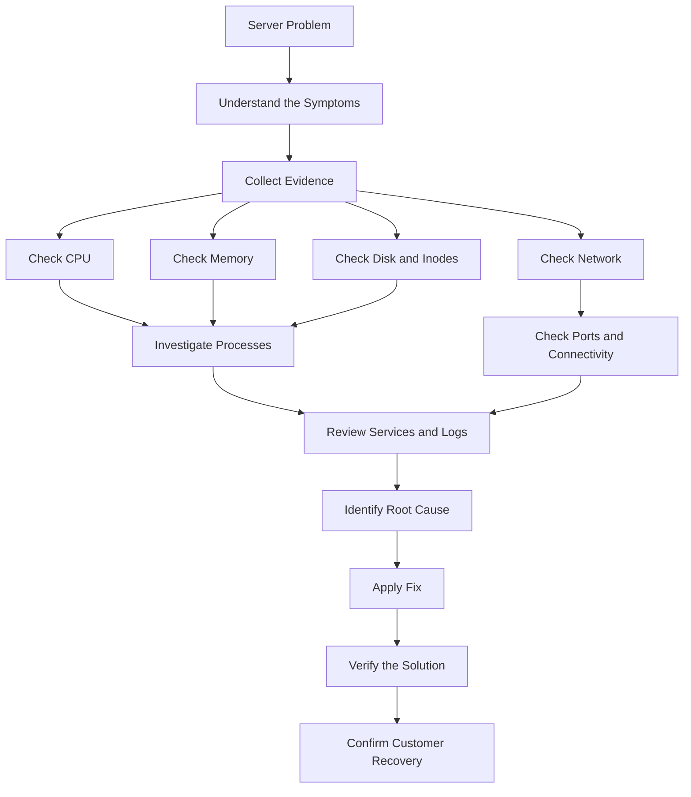

---

# 12. Quick Command Memory ⚡

| Problem | Command | Purpose |
|---|---|---|
| CPU and processes | `top` | Monitor system activity |
| High CPU processes | `ps aux --sort=-%cpu \| head` | Find CPU-intensive processes |
| Memory usage | `free -h` | Check RAM and swap |
| High memory processes | `ps aux --sort=-%mem \| head` | Find memory-intensive processes |
| Load average | `uptime` | Check system load |
| Disk capacity | `df -h` | Check filesystem space |
| Inode capacity | `df -i` | Check inode availability |
| Directory size | `du -sh /var/*` | Find directories consuming space |
| Historical CPU | `sar -u` | Review CPU statistics |
| Listening ports | `ss -lntp` | Inspect listening TCP sockets |
| Service status | `systemctl status nginx` | Check service state |
| Service logs | `journalctl -u nginx` | Inspect service logs |
| Current boot logs | `journalctl -b` | Review current boot |
| Previous boot logs | `journalctl -b -1` | Review previous boot if available |
| SSH service | `systemctl status ssh` | Check SSH on Ubuntu |
| HTTP response | `curl -I http://localhost` | Test a local HTTP endpoint |

---

# 🔥 THE GOLDEN RULE

**Don't randomly restart the server. Find the problem layer, collect evidence, identify the root cause, fix it, and verify that the actual customer problem is resolved.**

---

# 🚀 DAY 16 — COMPLETE!

## 🏆 My Biggest Takeaway

Today, I connected Linux commands, operating system concepts, boot troubleshooting, service management, and networking into one structured approach.

As I prepare for Cloud Support Engineer interviews, I want to develop the habit of investigating problems systematically instead of guessing.

## My Final Mindset

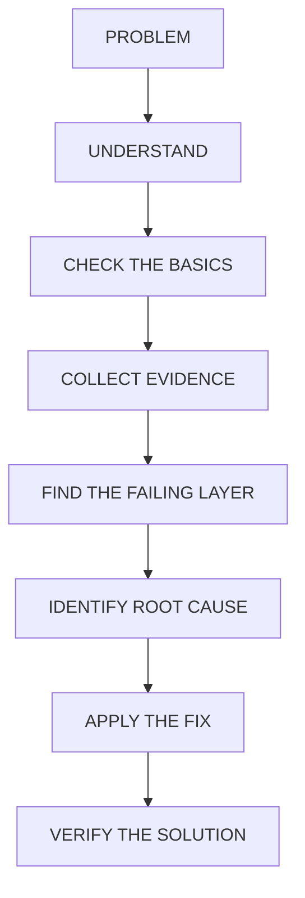

**I don't troubleshoot by guessing. I troubleshoot by collecting evidence.** 🔥

---

**#Linux #OperatingSystems #Troubleshooting #CloudSupport #AWS #DevOps #LearningInPublic**
