# 🚀 DAY 17 — FINAL OS INTERVIEW REVISION

**Cloud Support Engineer Preparation | Linux | Operating Systems | Interview Revision**

---

## 🎯 What I'm Learning Today

Today is the final day of my Operating Systems roadmap.

I have already learned the concepts. Today, I'm converting everything into interview-ready answers.

### My Interview Rule

**Explain the concept clearly → Give troubleshooting steps → Mention commands when useful.**

I don't need to give a huge textbook answer in an interview. I need to demonstrate that I understand the concept and know how to troubleshoot it.

---

# 🧠 PART 1 — LINUX BOOT PROCESS

## Q1. Explain the Linux Boot Process

### Simple Understanding

When I switch on a computer, the system follows these stages:

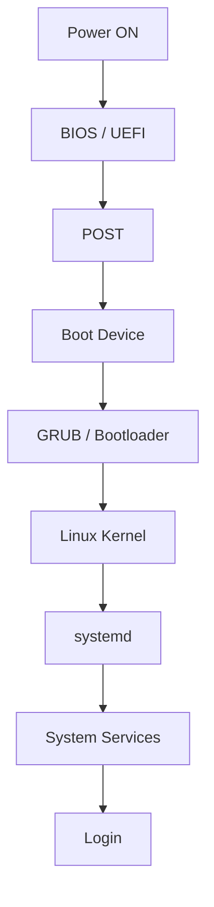

### Explanation

1. **Power ON:** The computer receives power.
2. **BIOS / UEFI:** Initializes the hardware and starts the boot process.
3. **POST:** Performs initial hardware checks.
4. **Boot Device:** The firmware selects a bootable device.
5. **GRUB / Bootloader:** Loads the Linux kernel.
6. **Linux Kernel:** Initializes hardware and core operating system components.
7. **systemd:** Starts and manages system services.
8. **Services:** Required services start according to system configuration.
9. **Login:** The system becomes available for user login.

### Interview Answer

When the system is powered on, BIOS or UEFI initializes the hardware and performs POST. It identifies the boot device according to the boot configuration. The bootloader, commonly GRUB in Linux, loads the Linux kernel. The kernel initializes the system and starts the user-space initialization system, commonly systemd. systemd starts and manages services, and finally the system reaches the login stage.

---

# 🧠 PART 2 — BOOT TROUBLESHOOTING

## Q2. How Would You Troubleshoot a Boot Issue?

I should not randomly repair things.

First, I need to identify the stage where the boot process stops.

### Troubleshooting Flow

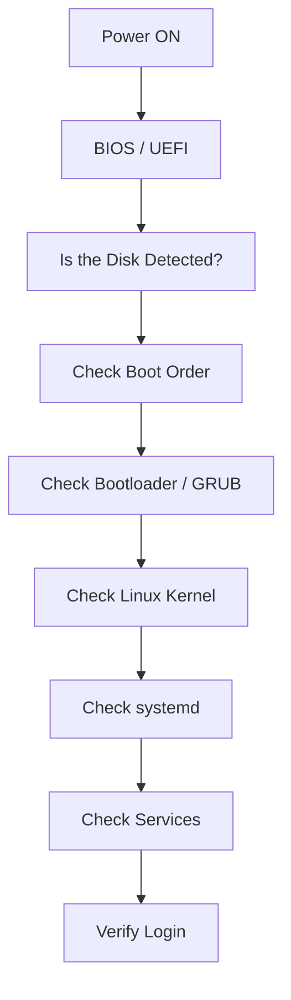

### Useful Commands

Check current boot logs:

```bash
journalctl -b
```

Check previous boot logs, if retained:

```bash
journalctl -b -1
```

### Interview Answer

I would first identify the stage where the boot process is failing. I would check hardware and BIOS/UEFI detection, boot order, bootloader, kernel, and systemd services. If the system is accessible through a recovery environment, I would review boot logs using `journalctl`.

---

# 💻 PART 3 — BOOTABLE DEVICE NOT FOUND

## Q3. What Would You Do If the System Shows "Bootable Device Not Found"?

I would investigate step by step instead of immediately assuming GRUB is broken.

### Troubleshooting Flow

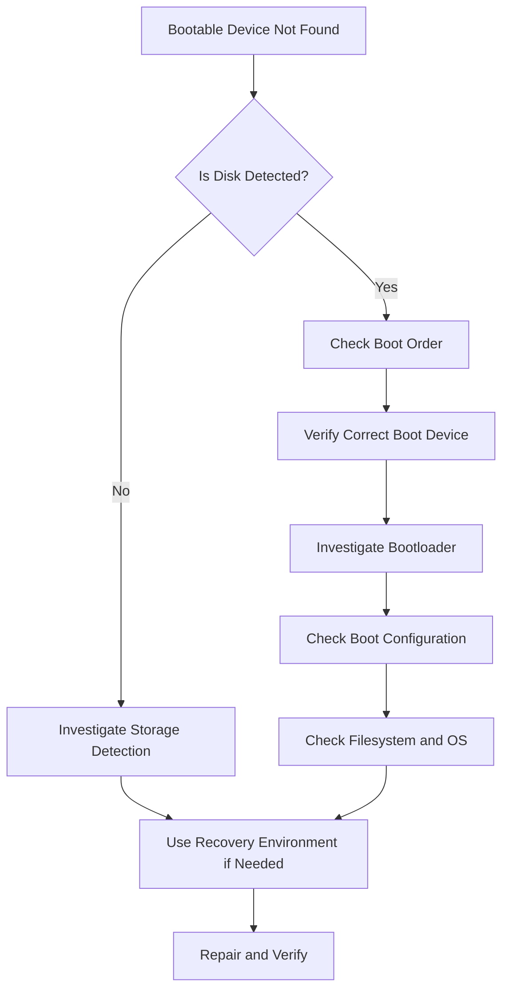

### Interview Answer

First, I would check whether the storage device is detected by BIOS/UEFI. If it is detected, I would verify the boot order and correct boot device. Then I would investigate the bootloader, boot configuration, and filesystem or operating system. If necessary, I would use a recovery environment.

---

# 🐌 PART 4 — SLOW LINUX MACHINE

## Q4. A Linux Machine Is Very Slow. How Would You Troubleshoot It?

This is an important Cloud Support interview question.

I should not immediately restart the server. I should investigate resource utilization first.

### Troubleshooting Flow

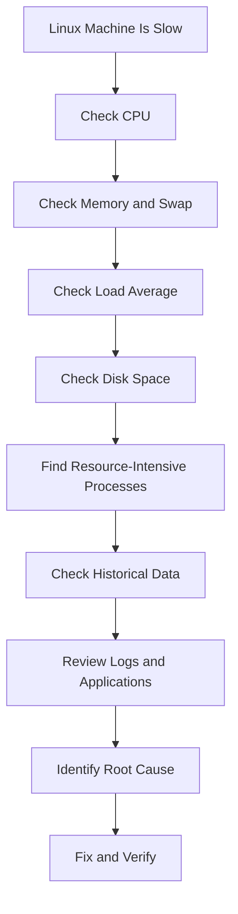

### CPU and Processes

```bash
top
```

Find processes consuming the most CPU:

```bash
ps aux --sort=-%cpu | head
```

### Memory

```bash
free -h
```

Find processes consuming the most memory:

```bash
ps aux --sort=-%mem | head
```

### Load Average

```bash
uptime
```

### Disk Space

```bash
df -h
```

### Directory Usage

```bash
du -sh /var/*
```

### Historical CPU Usage

```bash
sar -u
```

Historical data depends on whether `sar` is installed and data collection is configured.

### Interview Answer

I would first check CPU utilization and high-CPU processes using `top` or `ps`. Then I would check memory and swap using `free -h`, load using `uptime`, disk usage using `df` and `du`, and historical resource usage using `sar`. Finally, I would identify the bottleneck and investigate the responsible process or application.

---

# 🔥 PART 5 — SERVER HEATING

## Q5. A Server Is Heating Up. How Would You Troubleshoot It?

First, I would check CPU utilization.

```bash
top
```

Find processes consuming excessive CPU:

```bash
ps aux --sort=-%cpu | head
```

Then I would check:

```bash
free -h
```

```bash
uptime
```

```bash
sar -u
```

### For a Physical Machine

I would also investigate:

- Cooling fans.
- Airflow.
- Dust accumulation.
- Environmental temperature.
- Hardware condition.

### For an EC2 Instance

I would investigate:

- CPU utilization in CloudWatch.
- Resource-intensive processes.
- Memory and disk usage.
- Application logs.
- Monitoring alerts.

### Interview Answer

I would check CPU utilization and processes consuming excessive CPU, then check memory, load, and historical resource usage. If it is a physical machine, I would also check cooling, airflow, and hardware conditions. For an EC2 instance, I would investigate CloudWatch metrics and application behavior.

---

# 💾 PART 6 — DISK FREE SPACE

## Q6. How Do You Check Disk Free Space?

I use:

```bash
df -h
```

### Meaning

- `df` → Displays filesystem disk usage.
- `-h` → Displays values in a human-readable format.

### Example

```text
Filesystem      Size  Used  Avail  Use%
/dev/sda1        50G   30G    20G   60%
```

### Interview Answer

I use `df -h` to check filesystem disk space in a human-readable format.

---

# 📁 PART 7 — DISK SPACE AVAILABLE BUT FILE CANNOT BE CREATED

## Q7. Disk Space Is Available, but a File Cannot Be Created. Why?

First, I check disk space:

```bash
df -h
```

If space is available, I check inode usage:

```bash
df -i
```

### Why?

Disk space and inodes are different resources.

For example:

- Disk space available: 20 GB.
- Free inodes: 0.

In this situation, creating another file may fail.

I should also check directory permissions:

```bash
ls -ld /path/to/directory
```

Finally, I should investigate the exact error message.

### Troubleshooting Flow

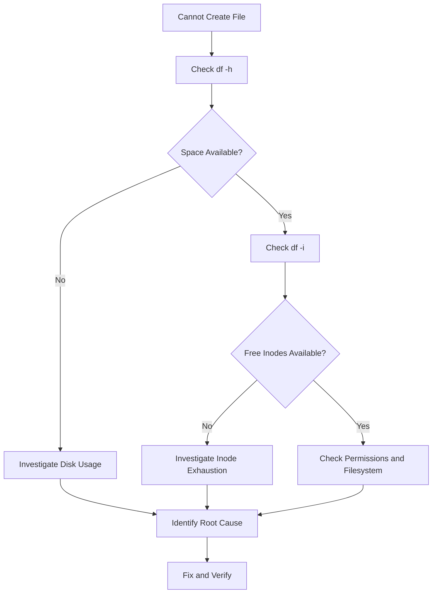

### Interview Answer

If disk space is available but a file cannot be created, I would check inode availability using `df -i`. The filesystem may have exhausted its inodes, especially if there are many small files. I would also check directory permissions and the exact error message.

---

# 🧬 PART 8 — INODES

## Q8. What Is an Inode?

I can think of an inode as a file's information card.

It stores metadata such as:

- File type.
- Permissions.
- Owner and group.
- Timestamps.
- Information used to locate the file's data.

### Check Inode Usage

```bash
df -i
```

### Interview Answer

An inode is a filesystem data structure that stores metadata about a file, such as its type, permissions, ownership, and timestamps. I can use `df -i` to check inode availability.

---

# 🧠 PART 9 — PAGING

## Q9. What Is Paging?

Paging is a memory-management technique used by operating systems.

Virtual memory is divided into pages, while physical memory is divided into frames.

### Paging Flow

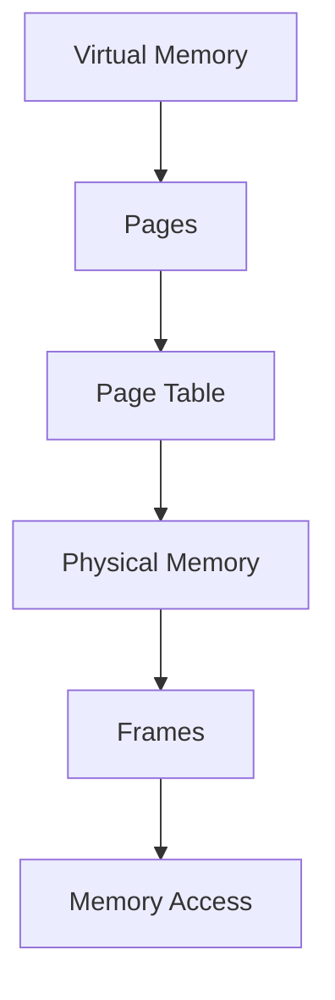

### Related Concepts

**Virtual Memory**

It gives processes their own virtual address spaces.

**Swap**

It is disk space used to hold memory pages that are moved out of RAM.

**Page Fault**

It occurs when a process accesses a page that is not currently mapped to the required physical memory location. The operating system handles the fault, potentially loading the page into memory.

### Interview Answer

Paging is a memory-management technique where virtual memory is divided into fixed-size pages and physical memory into frames. The operating system maps pages to physical frames using page tables. It helps manage memory efficiently and supports virtual memory.

---

# ⚙️ PART 10 — SYSTEM CALLS

## Q10. What Is a System Call?

A normal program cannot directly perform every privileged operation. It requests services from the operating system kernel.

That request is called a system call.

### System Call Flow

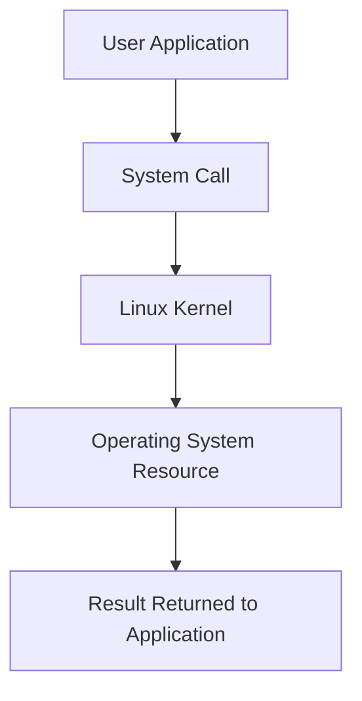

### Examples

- `fork()`
- `open()`
- `read()`
- `write()`
- `close()`
- `execve()`

### Interview Answer

A system call is an interface through which a user-space program requests a service from the operating system kernel, such as creating a process or reading a file.

---

# 👶 PART 11 — fork()

## Q11. Explain fork().

`fork()` creates a new child process from the calling process.

### Process Creation Flow

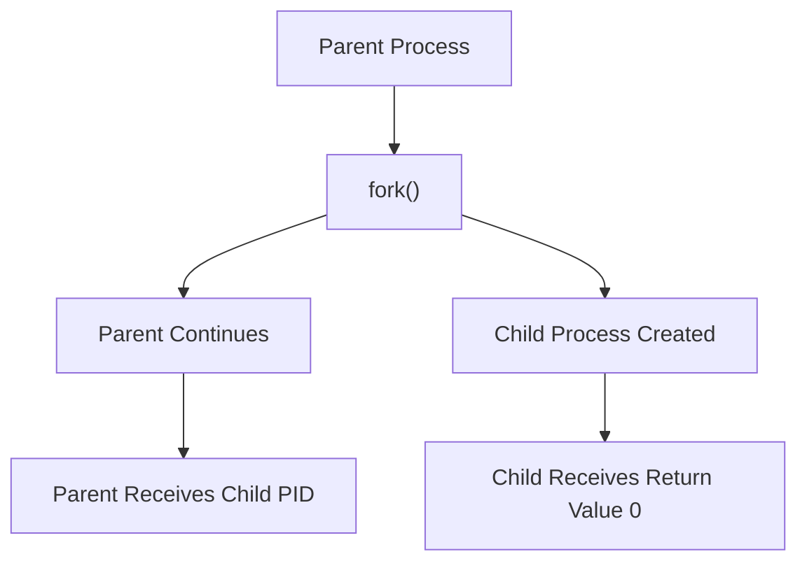

### Return Values

- **Parent:** Receives the child's PID.
- **Child:** Receives `0`.
- **Failure:** Returns `-1` to the calling process.

### Interview Answer

`fork()` is a Linux/Unix system call used to create a new child process from the calling process. The parent receives the child's PID, the child receives zero, and `-1` indicates failure.

---

# 🔄 PART 12 — PROCESS LIFE CYCLE

## Q12. Explain Process States and the Lifecycle.

A process moves through different states during execution.

### General Process Lifecycle

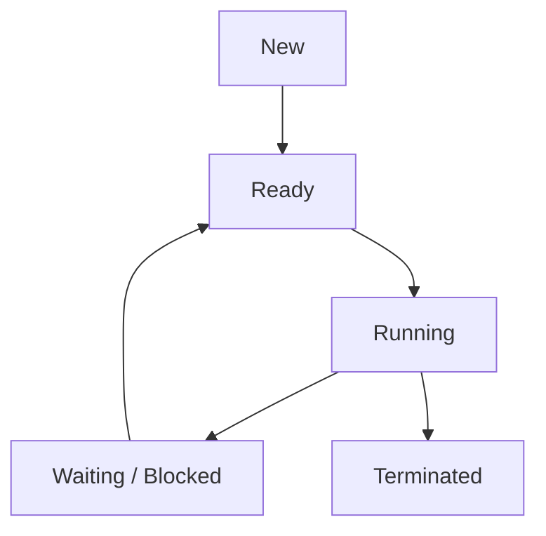

### Common Linux Process States

| State | Meaning |
|---|---|
| `R` | Running or runnable |
| `S` | Interruptible sleep |
| `D` | Uninterruptible sleep |
| `T` | Stopped or traced |
| `Z` | Zombie |

### What Is a Zombie Process?

A zombie process has finished execution, but its parent has not yet collected its termination status.

### Interview Answer

A process can move through states such as new, ready, running, waiting or blocked, and terminated. In Linux, common process states include R, S, D, T, and Z. A zombie is a terminated child process whose parent has not yet collected its exit status.

---

# 🔐 PART 13 — SSH TROUBLESHOOTING

## Q13. SSH Is Not Working. How Do You Troubleshoot It?

I should troubleshoot layer by layer.

### Troubleshooting Flow

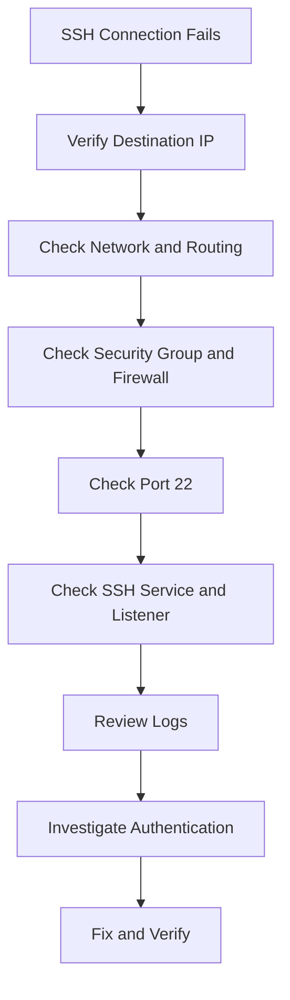

### Step 1 — Verify the Destination IP

```bash
ssh username@IP
```

### Step 2 — Check Listening Ports

```bash
sudo ss -lntp
```

### Step 3 — Check SSH Service

On Ubuntu:

```bash
sudo systemctl status ssh
```

### Step 4 — Check SSH Logs

```bash
sudo journalctl -u ssh
```

The service unit may be named `sshd` on other Linux distributions.

### Common Error Clues

| Error | Possible Cause |
|---|---|
| Connection timed out | Network, routing, security rules, or firewall |
| Connection refused | No listener on the target port or active rejection |
| Permission denied | Authentication or access configuration |
| Host key verification failed | Host identity mismatch or changed host key |

### Interview Answer

I would verify the destination IP and network path, then check whether port 22 is allowed. On the server, I would check whether SSH is listening using `ss -lntp`, check the SSH service using `systemctl status ssh`, review logs, and investigate authentication if necessary.

---

# 🔎 PART 14 — CHECK LISTENING PORTS

## Q14. How Do You Check Which Ports Are Listening?

I use:

```bash
ss -lntp
```

### Meaning

- `-l` → Listening sockets.
- `-n` → Numeric addresses and ports.
- `-t` → TCP sockets.
- `-p` → Process information, where permitted.

### Example

```text
LISTEN  0  128  0.0.0.0:22
```

This indicates that a socket is listening on TCP port 22 on the IPv4 addresses represented by `0.0.0.0`.

### Interview Answer

I use `ss -lntp` to check listening TCP ports and, where permitted, the associated processes.

---

# ⏱️ PART 15 — top AND sar

## Q15. What Is top?

`top` provides a live view of:

- Running processes.
- CPU utilization.
- Memory usage.
- Load average.
- System activity.

### Command

```bash
top
```

### Interview Answer

`top` is a real-time system monitoring command used to view running processes and resource utilization, such as CPU and memory.

## Q16. What Is sar?

`sar` stands for **System Activity Reporter**.

It can provide resource usage information over time when data collection is configured.

### CPU Statistics

```bash
sar -u
```

### Memory Statistics

```bash
sar -r
```

### Interview Answer

`sar` is used to collect and report system activity statistics. For example, `sar -u` provides CPU-related statistics, while `sar -r` provides memory-related statistics.

---

# 📂 PART 16 — LINUX FILE PERMISSIONS

## Q17. Explain Linux File Permissions.

Linux permissions have three categories:

- User.
- Group.
- Others.

### Three Basic Permissions

| Permission | Meaning | Numeric Value |
|---|---|---:|
| `r` | Read | 4 |
| `w` | Write | 2 |
| `x` | Execute | 1 |

### Example

```text
-rwxr-xr--
```

Breakdown:

| Category | Permission | Meaning |
|---|---|---|
| User | `rwx` | Read, write, execute |
| Group | `r-x` | Read and execute |
| Others | `r--` | Read only |

### Numeric Permissions

For example:

```bash
chmod 755 script.sh
```

This means:

- Owner: `rwx` = 7.
- Group: `r-x` = 5.
- Others: `r-x` = 5.

### Useful Commands

```bash
ls -l
```

```bash
chmod 755 script.sh
```

```bash
chown developer file.txt
```

```bash
chgrp developers file.txt
```

### Interview Answer

Linux permissions control who can read, write, or execute a file. Permissions are assigned to the owner, group, and others. I use `ls -l` to view permissions and `chmod` to change them.

---

# 👤 PART 17 — USERS AND GROUPS

## Q18. How Do You Manage Users and Groups in Linux?

### Check the Current User

```bash
whoami
```

### Display User and Group Information

```bash
id
```

### Check Group Membership

```bash
groups
```

### Create a User

```bash
sudo useradd -m developer
```

The `-m` option creates the user's home directory.

### Set the User's Password

```bash
sudo passwd developer
```

### Create a Group

```bash
sudo groupadd developers
```

### Add a User to a Supplementary Group

```bash
sudo usermod -aG developers developer
```

The `-aG` options append the user to the specified supplementary group without replacing existing supplementary group memberships.

### Interview Answer

I use `whoami` to check the current user, `id` to view user and group IDs, and `groups` to view group membership. I can create users with `useradd`, create groups with `groupadd`, and add users to supplementary groups with `usermod -aG`.

---

# 📦 PART 18 — SOFTWARE MANAGEMENT

## Q19. What Is the Difference Between apt update and apt upgrade?

### apt update

Refreshes the local package index from configured repositories.

```bash
sudo apt update
```

### apt upgrade

Upgrades installed packages when updates are available.

```bash
sudo apt upgrade
```

### Install a Package

```bash
sudo apt install nginx
```

### Remove a Package

```bash
sudo apt remove nginx
```

### Easy Memory Trick

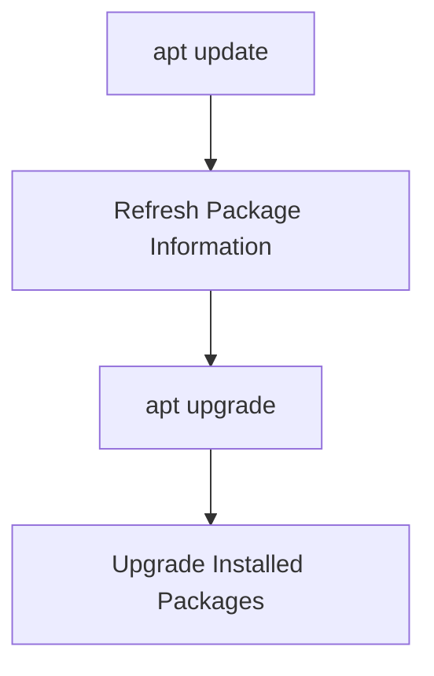

### Interview Answer

`apt update` refreshes package information from configured repositories, while `apt upgrade` upgrades installed packages using the updated package information.

---

# ⚙️ PART 19 — SERVICES AND SYSTEMD

## Q20. What Is a Service?

A service is a background program or functionality managed by the operating system's service manager.

For example, Nginx can run as a service.

### Check Service Status

```bash
sudo systemctl status nginx
```

### Start a Service

```bash
sudo systemctl start nginx
```

### Stop a Service

```bash
sudo systemctl stop nginx
```

### Restart a Service

```bash
sudo systemctl restart nginx
```

### Enable Automatic Startup at Boot

```bash
sudo systemctl enable nginx
```

### Disable Automatic Startup at Boot

```bash
sudo systemctl disable nginx
```

### Check Service Logs

```bash
sudo journalctl -u nginx
```

### Important Difference

| Command | Purpose |
|---|---|
| `start` | Starts the service now |
| `stop` | Stops the service now |
| `restart` | Stops and starts the service |
| `enable` | Configures automatic startup at boot |
| `disable` | Disables automatic startup at boot |
| `status` | Displays service status |

**Remember:** Starting a service does not automatically enable it to start at boot.

### Interview Answer

A service is a background program managed by the operating system. I use `systemctl status` to check its state, `start` to start it, `stop` to stop it, and `enable` to configure automatic startup at boot.

---

# 🕐 PART 20 — DATE, TIME AND NTP

## Q21. How Do You Check System Time?

### Display the Current Date and Time

```bash
date
```

### Check System Time Configuration

```bash
timedatectl
```

### What Is NTP?

NTP stands for **Network Time Protocol**.

It synchronizes a system's clock with a reliable time source.

### Why Is Correct Time Important?

Correct time is important for:

- Logs.
- Monitoring.
- Authentication.
- Scheduled tasks.
- Troubleshooting.

### Interview Answer

I use `date` to display the current date and time and `timedatectl` to inspect system time configuration. NTP synchronizes system clocks with reliable time sources, which is important for logs, monitoring, and authentication.

---

# ⏰ PART 21 — CRON

## Q22. What Is Cron?

Cron is a Linux job scheduler that allows commands and scripts to run automatically at scheduled times.

### List Scheduled Jobs

```bash
crontab -l
```

### Edit Scheduled Jobs

```bash
crontab -e
```

### Example

```cron
0 22 * *
