

#  DAY 02 — DevOps with Yuva

## 🧩 SDLC • HLD • LLD

### `Understand the Process • Design the System • Build the Solution`

 

---

## 🎯 Today's Goal

Day 2 was about understanding what happens **before an application is deployed**.

After understanding the basics of DevOps on Day 1, I wanted to understand the software development process itself.

Today I focused on:

- 📋 SDLC
- 🔄 SDLC Stages
- 🏗️ HLD — High-Level Design
- 🔍 LLD — Low-Level Design
- 🔗 How different teams and stages fit together

The main question I wanted to understand was:

> **How does an idea become a working software application?**

---

## 🧠 What I Understood About SDLC

**SDLC** stands for:

> **Software Development Life Cycle**

It is a structured process used by software teams to **plan, design, develop, test, deploy, and maintain software.**

Instead of randomly building an application, SDLC provides a structured approach to developing software.

### 🔄 The SDLC Flow

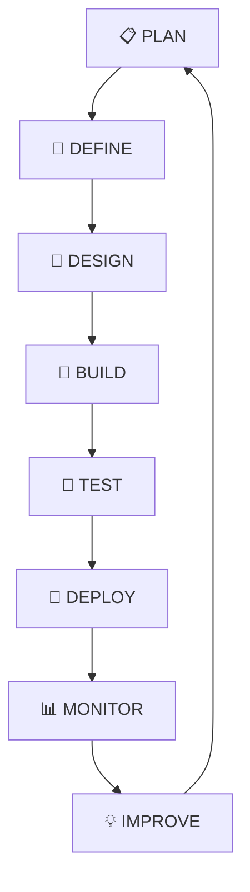

The process is not necessarily a straight line.

After deployment, teams continue to **monitor, maintain, improve, and update** the application.

---

## 🧩 The Main SDLC Stages

| Stage | What I Understood |
|---|---|
| 📋 **Plan** | Understand requirements and decide what needs to be built |
| 📝 **Define** | Clearly document the requirements |
| 🎨 **Design** | Decide how the system should be structured |
| 🔨 **Build** | Developers write and build the application |
| 🧪 **Test** | Check whether the application works correctly |
| 🚀 **Deploy** | Make the application available to users |

---

## 📋 01 — Plan

Planning is the starting stage.

The team gathers information about:

- What needs to be built
- Why it needs to be built
- What users need
- What resources are required
- What the expected outcome is

For example, imagine building a banking application.

Before writing code, the team needs to understand what the application should actually do.

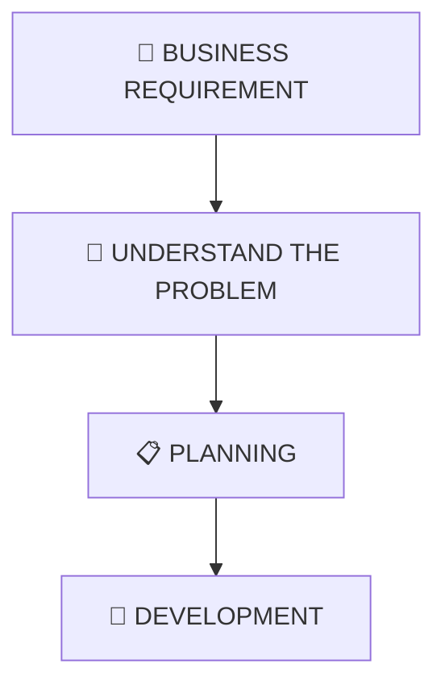

---

## 📝 02 — Define

The requirements are clearly documented.

One important document I learned about is:

> **SRS — Software Requirements Specification**

SRS describes what the software is expected to do.

It helps developers and other teams understand the requirements before implementation begins.

---

## 🎨 03 — Design

Once the requirements are understood, the system needs to be designed.

This is where I started learning about:

> **HLD → High-Level Design**

and

> **LLD → Low-Level Design**

These two concepts helped me understand the difference between:

> **The big picture of a system**

and

> **The detailed implementation of each component**

---

## 🏗️ HLD — High-Level Design

**HLD = High-Level Design**

HLD focuses on the **overall architecture of the system**.

It answers questions such as:

- What major components does the system have?
- How do those components communicate?
- What technologies are required?
- Where are the major services?
- How is the overall system structured?

### 🏦 Example — Banking Application

A simplified HLD could look like:

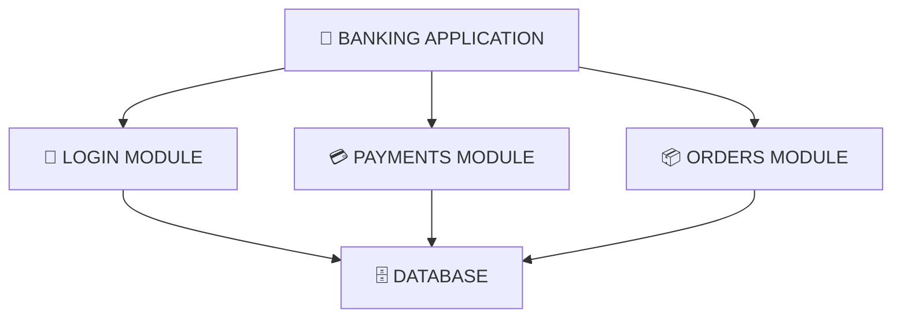

HLD focuses on the **major building blocks**.

It doesn't go deep into the implementation of every class or method.

---

## 🔍 LLD — Low-Level Design

**LLD = Low-Level Design**

LLD goes deeper into each individual component.

It focuses on things such as:

- Classes
- Methods
- Functions
- Database details
- Validation logic
- Internal implementation

For example:

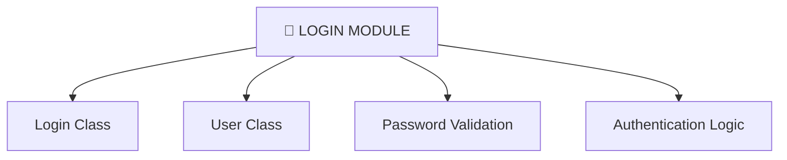

So:

> **HLD → What are the major components?**

> **LLD → How does each component actually work?**

---

## 🆚 HLD vs LLD

| 🏗️ HLD | 🔍 LLD |
|---|---|
| Big picture | Detailed picture |
| Overall architecture | Internal implementation |
| Major components | Classes & methods |
| System-level design | Component-level design |
| Technology choices | Implementation details |
| Communication between services | Logic inside services |

---

## 🧠 Simple Way I Remember It

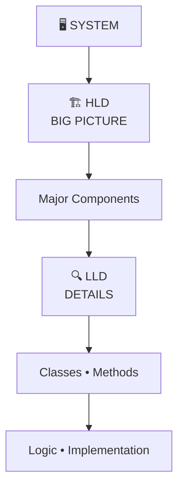

---

## 🏠 A Simple Real-Life Example

I used a house to understand HLD and LLD.

### 🏗️ HLD — The Big Picture

HLD tells us things like:

- Where is the kitchen?
- Where is the bedroom?
- Where is the bathroom?
- Where is the living room?

It focuses on the **overall structure**.

### 🔍 LLD — The Details

LLD goes deeper:

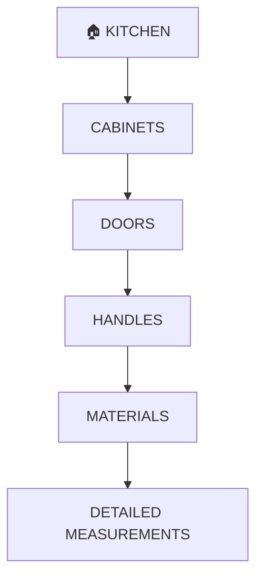

So the easiest way I remember it is:

> **HLD tells me what the system looks like.**

> **LLD tells me how each part is implemented.**

---

## 🔄 Where DevOps Fits In

Today I also started connecting SDLC with what I learned on Day 1.

Software development doesn't stop after writing code.

A simplified flow is:

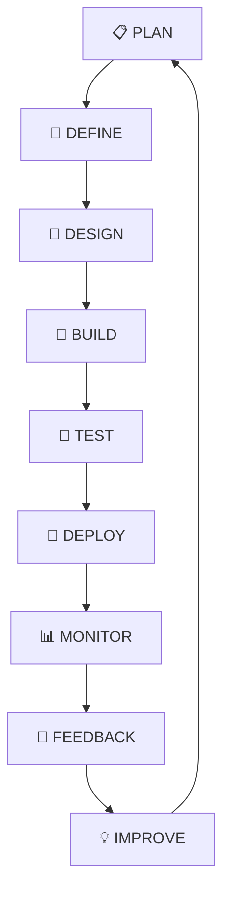

This connects directly with DevOps.

DevOps helps teams improve and automate this overall software delivery process.

---

## 📊 Monitoring & Feedback

One concept I noticed in my notes was:

> **Monitoring → Feedback**

After an application is deployed, teams need to know how it is performing.

Monitoring can provide information such as:

- Is the application running?
- Are users facing errors?
- Is the server healthy?
- Is performance slowing down?
- Are resources being used properly?

That feedback can then be used to improve the application.

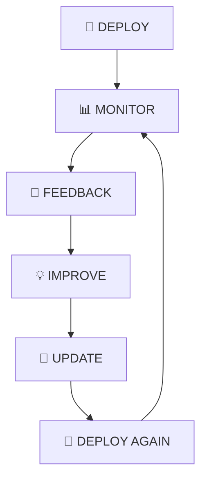

This creates a continuous cycle.

---

## 💡 What I Learned Today

My biggest takeaway from Day 2:

> **Software development is a process, not just coding.**

Before an application reaches users, many things happen:

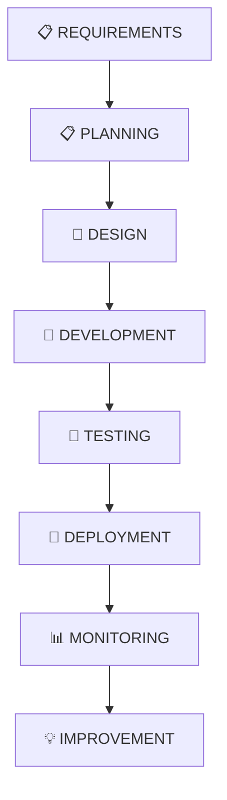

I also understood the difference between HLD and LLD:

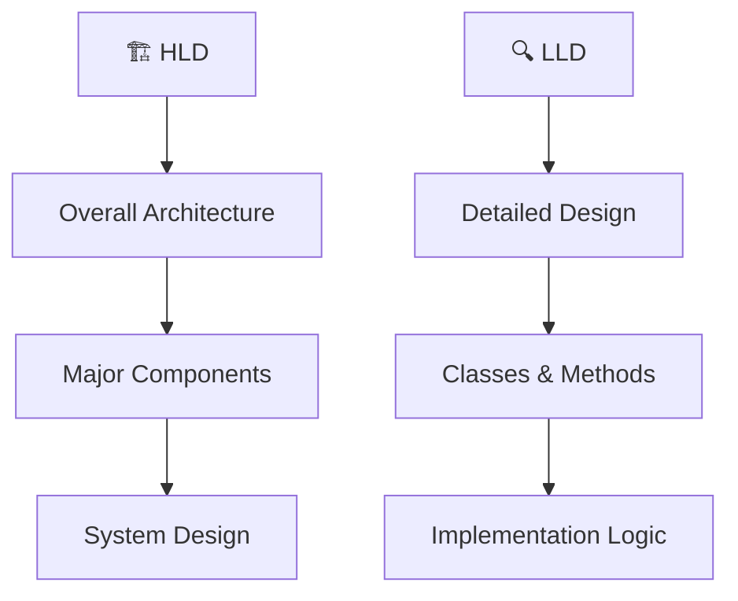

---

## 📸 My Day 02 Notes

These are the handwritten notes I made while learning **SDLC, HLD, LLD, Monitoring, and the software development process.**

### 📝 SDLC Notes

  

---

## 🎓 Day 02 Takeaways

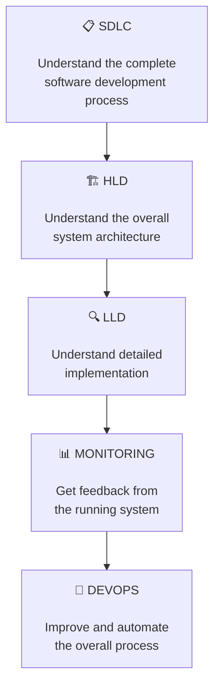

---

## 🧠 Final Mental Model

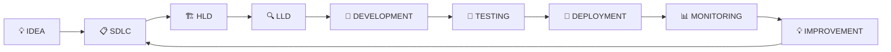

> **SDLC tells me the complete process.**  
> **HLD tells me the big picture.**  
> **LLD tells me the detailed implementation.**  
> **DevOps helps automate and improve the overall process.**

---

# 🚀 DAY 02 COMPLETE

### `Build • Break • Fix • Repeat`

**Learning → Understanding → Practicing → Documenting**

 

`SDLC → HLD → LLD → Development → Deployment → Monitoring`

 

📌 **More coming tomorrow...**

**DAY 03 → Servers • Virtualization • AWS EC2 • Automation**

