<div align="center">

# DAY 03 — DevOps with Yuva

## 🖥️ Servers • Virtualization • AWS EC2 • Automation • IaC

### `Understand Infrastructure • Understand Virtualization • Automate Everything`

<br>


</div>

---

## 🎯 Today's Goal

Day 3 was about understanding **what runs underneath cloud infrastructure**.

After learning about DevOps and the SDLC on the previous days, I wanted to understand:

- 🖥️ What is a server?
- 🏢 What is a physical server?
- ⚙️ What is virtualization?
- 💻 What is a Virtual Machine?
- 🔧 What is a hypervisor?
- 🔒 What is logical isolation?
- ☁️ How does AWS EC2 provide virtual servers?
- 🔌 How do APIs communicate with cloud services?
- 🤖 How can infrastructure be automated?
- 🏗️ What is Infrastructure as Code?

The main question I wanted to understand was:

> **How does physical infrastructure become cloud infrastructure, and how can DevOps engineers automate it?**

---

## 🖥️ Server

A **server** is a computer system that provides applications, services, or data to users or other systems over a network.

A server can provide things such as:

- Applications
- Services
- Databases
- Files
- Network resources
- Data

In simple words:

> **A server is a computer that provides something to other computers or users over a network.**

---

## 🏢 Physical Server

A **physical server** is a real hardware machine located in a data center.

It has its own physical resources such as:

- CPU
- RAM
- Storage
- Network components

A physical server is an actual machine, unlike a Virtual Machine which is software-based.

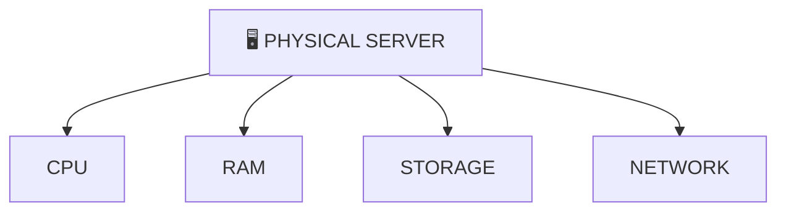

---

## ⚙️ Virtualization

One of the important concepts I learned today was **virtualization**.

Virtualization is a technology that allows multiple virtual machines to run on a single physical server while sharing its hardware resources.

Instead of:

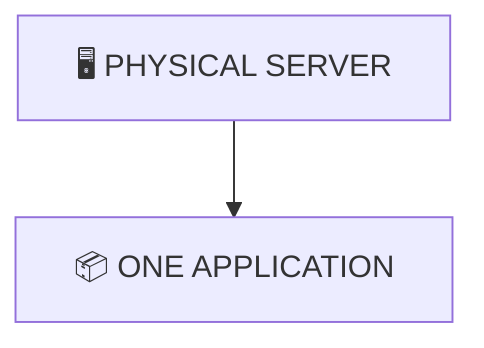

We can have:

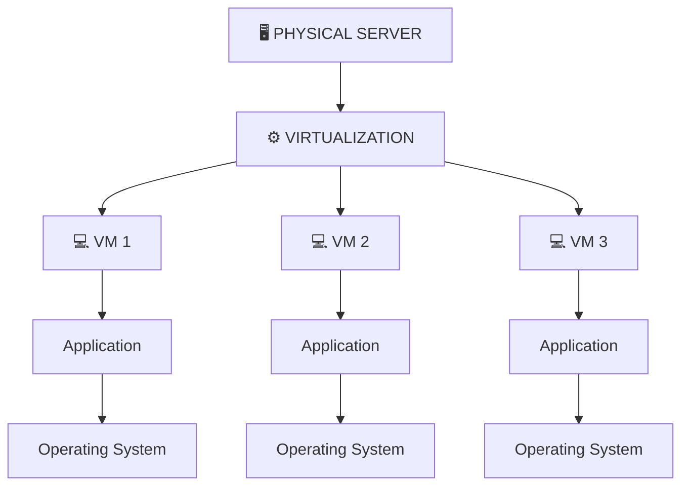

This allows organizations to use physical resources more efficiently.

---

## 💻 Virtual Machine — VM

A **Virtual Machine (VM)** is a software-based computer that runs on top of a physical server using virtualization.

A VM behaves like an independent computer with its own:

- Operating System
- CPU allocation
- Memory allocation
- Storage
- Network configuration

In simple words:

> **A VM is a software-based computer running on a physical machine.**

---

## 🧩 Virtual Machine Structure

The basic structure I understood is:

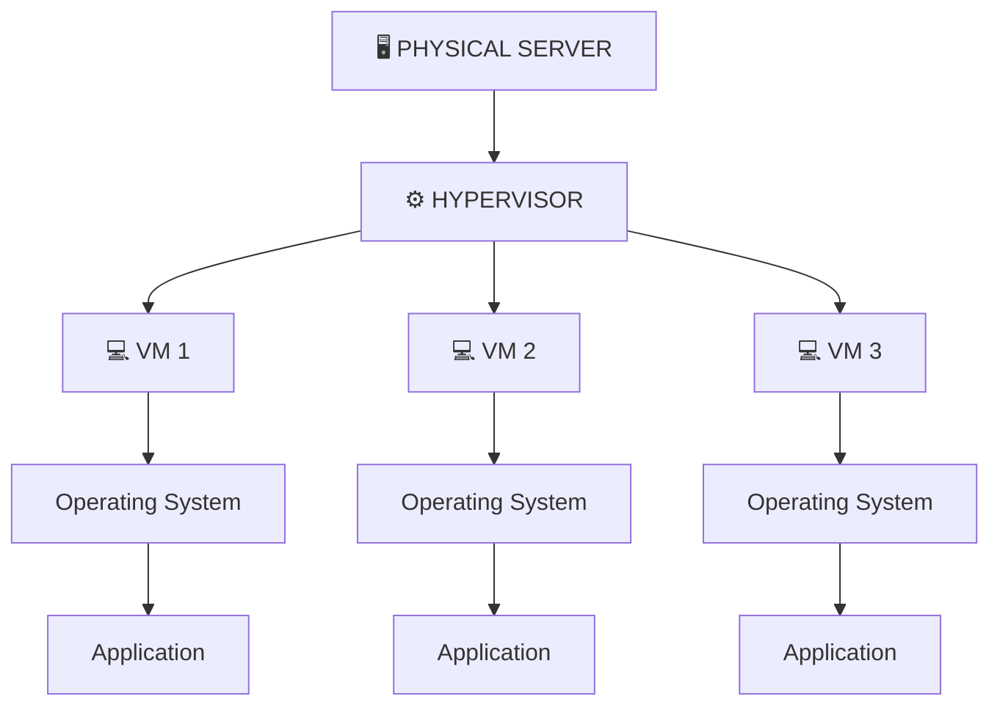

Each VM can operate as an independent computing environment.

---

## 🔧 Hypervisor

A **hypervisor** is software or firmware that creates and manages virtual machines.

It acts as a layer between:

> **Physical Hardware ↔ Virtual Machines**

The hypervisor manages resources such as:

- CPU
- Memory
- Storage
- Network

A simplified architecture:

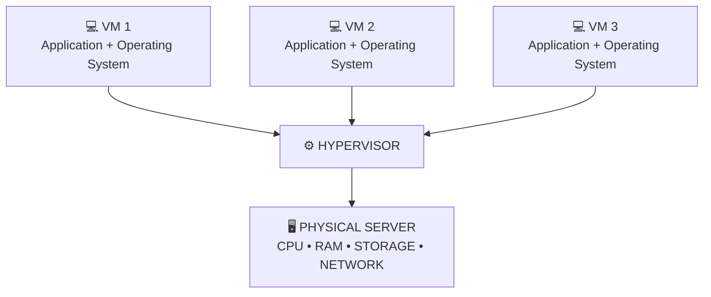

The hypervisor acts as the layer between the physical hardware and virtual machines.

---

## 🔒 Logical Isolation

One important concept I learned today was **logical isolation**.

Even though multiple VMs may run on the same physical server, each VM behaves like an independent machine.

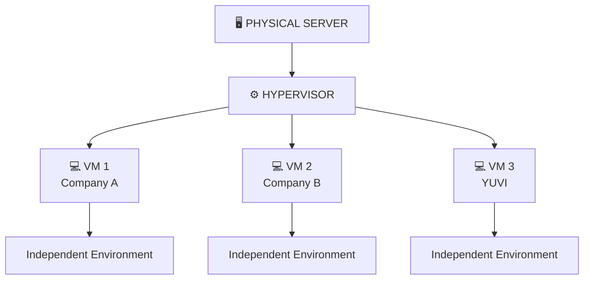

Each VM gets its own allocated resources and environment.

> **One physical machine can host multiple isolated virtual environments.**

This is one of the important ideas behind cloud computing.

---

## ☁️ AWS EC2 Example

This helped me understand how AWS provides virtual servers.

**Amazon EC2** provides resizable compute capacity in the cloud.

Instead of buying and maintaining a physical server myself, I can launch a virtual server through AWS.

A simplified example:

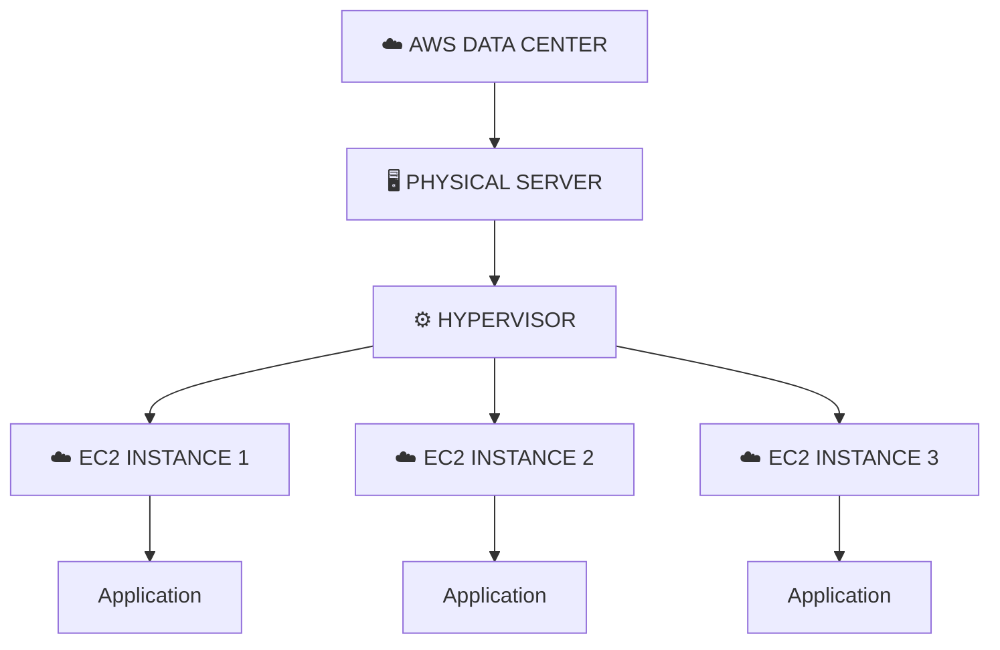

The idea is:

> **AWS has physical infrastructure, virtualization allows it to create virtual environments, and EC2 provides those virtual compute resources to users.**

---

## 🔒 AWS EC2 & Logical Isolation

A simplified example of multiple customers using virtual machines:

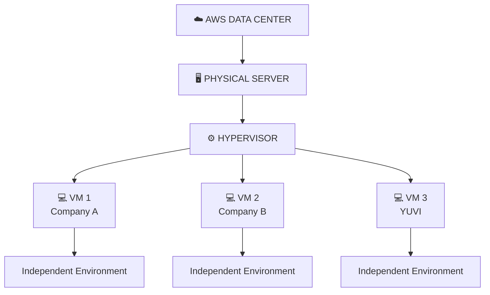

The physical resources are shared, while the virtual environments remain logically isolated.

---

## 🔌 AWS API Communication

I also learned how commands communicate with AWS services.

For example, a command such as:

```bash
aws ec2 describe-instances
```

asks AWS for information about EC2 instances.

The basic idea is:

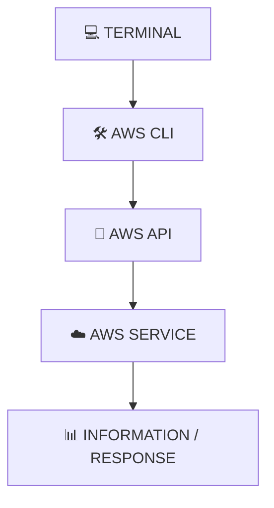

The API acts as a communication layer between the client and the AWS service.

This is useful for DevOps engineers because infrastructure can be managed from scripts and automated workflows.

---

## 🏗️ Infrastructure Automation

I learned that cloud infrastructure can be automated using different approaches and tools.

Some examples are:

- 🛠️ AWS CLI
- 🔌 AWS APIs
- ☁️ AWS CloudFormation
- 🏗️ Terraform
- 📜 Shell Scripts
- 🐍 Python
- 💻 PowerShell

The goal is to reduce repetitive manual work.

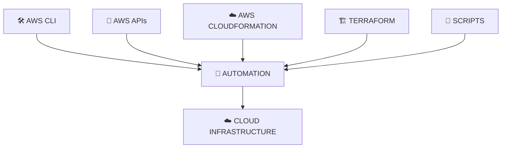

---

## ☁️ AWS CloudFormation

**AWS CloudFormation** is an Infrastructure as Code service provided by AWS.

It allows infrastructure to be defined using templates.

Instead of manually creating resources one by one:

```text
Create EC2
Create Network
Create Security Group
Create Database
Create IAM Resources
```

Infrastructure can be described in a template and deployed automatically.

A simplified idea:

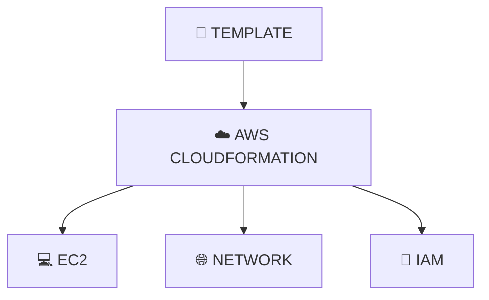

This introduces the concept of:

> **Infrastructure as Code (IaC)**

---

## 🏗️ Terraform

I also learned about **Terraform**.

Terraform is an Infrastructure as Code tool used to define and provision infrastructure using configuration files.

A simplified workflow:

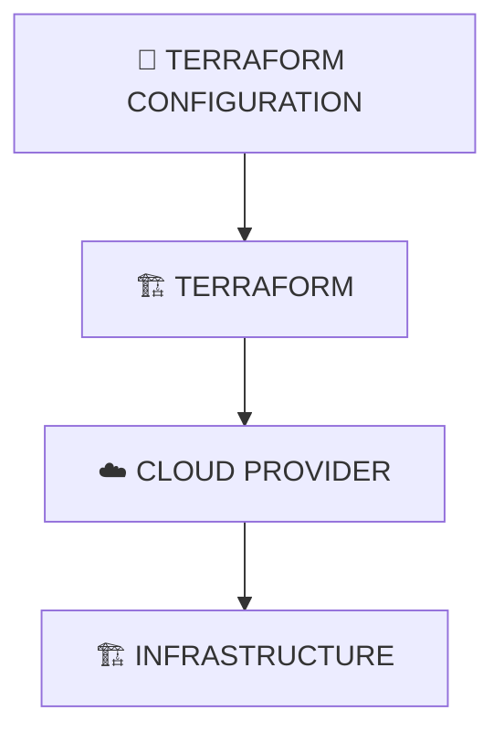

One important idea I understood is:

> **Instead of manually creating infrastructure, I can describe the desired infrastructure as code.**

---

## 📜 Scripting

Automation can also be performed using scripts.

Some scripting technologies I came across include:

- Bash
- Python
- PowerShell

For example:

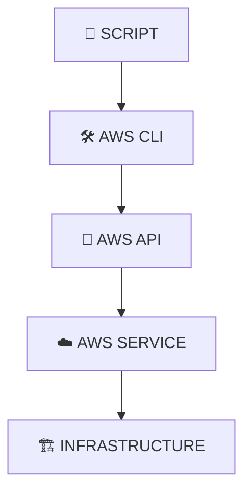

A script can perform repetitive tasks automatically.

This is one of the reasons scripting is important for DevOps engineers.

---

## 🔄 Manual vs Automated DevOps

The difference became clearer to me today.

### ❌ Manual

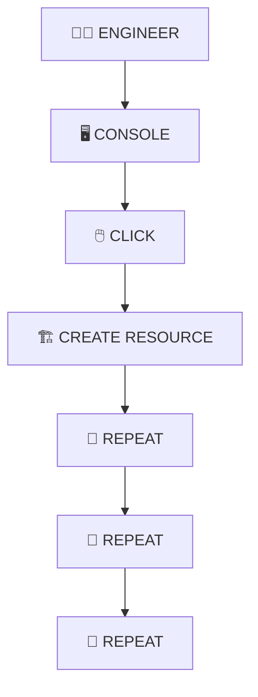

### ✅ Automated

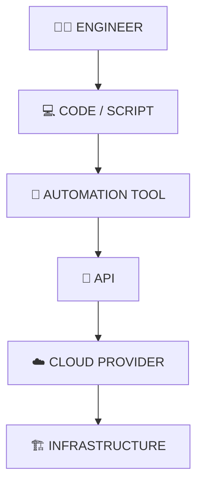

The automated approach is more scalable and repeatable.

---

## 🌐 Hybrid Cloud

I also came across the concept of **Hybrid Cloud**.

Hybrid cloud means using a combination of:

> **ON-PREMISES INFRASTRUCTURE + CLOUD**

For example:

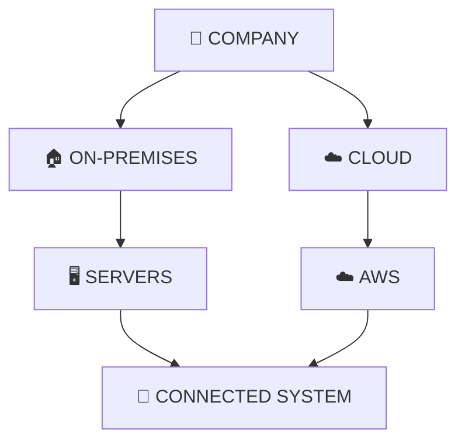

A company may keep some workloads on its own infrastructure while running other workloads in the cloud.

---

## 🧩 How Everything Connects

Today's concepts started making more sense when I connected them together:

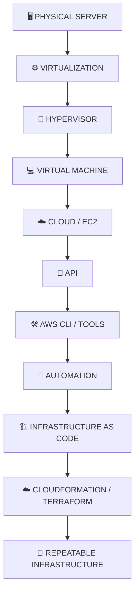

This gave me a better understanding of what happens underneath cloud infrastructure.

---

## 💡 What I Learned Today

My biggest takeaway from Day 3:

> **DevOps is not only about deploying applications. It is also about understanding and automating the infrastructure on which those applications run.**

Today I understood:

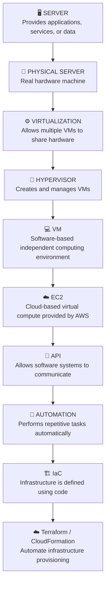

---

## 🧠 My Simple Mental Model

The easiest way I remember today's concepts:

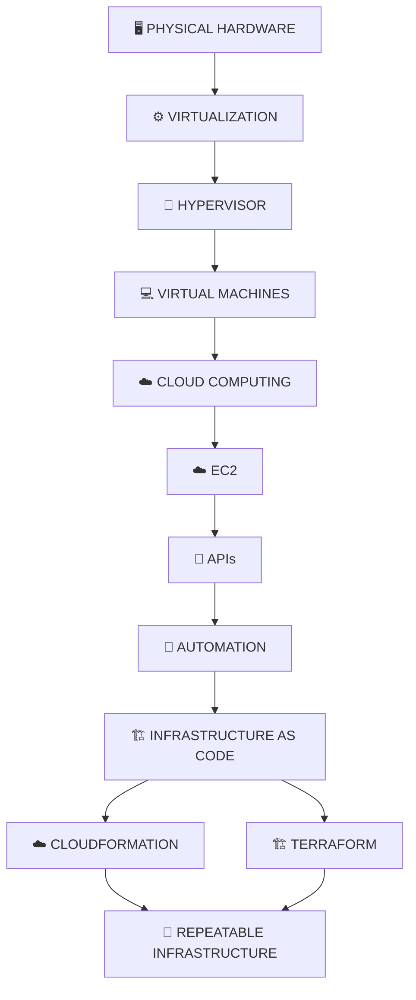

---

## 📸 My Day 03 Notes

These are the handwritten notes I made while learning about servers, virtualization, AWS EC2, hypervisors, automation, APIs, and Infrastructure as Code.

### 🖥️ Servers & Virtualization

<p align="center">
  
</p>

---

## 🔑 Key Takeaways

| Concept | What I Understood |
|---|---|
| 🖥️ Server | Provides applications, services, or data |
| 🏢 Physical Server | Real hardware machine |
| 💻 Virtual Machine | Software-based computer |
| ⚙️ Virtualization | Multiple VMs sharing physical resources |
| 🔧 Hypervisor | Creates and manages VMs |
| 🔒 Logical Isolation | VMs operate as independent environments |
| ☁️ EC2 | Cloud-based virtual compute |
| 🔌 API | Allows software systems to communicate |
| 🤖 Automation | Performs repetitive tasks automatically |
| 🛠️ AWS CLI | Manage AWS through commands |
| ☁️ CloudFormation | AWS Infrastructure as Code |
| 🏗️ Terraform | Infrastructure as Code tool |
| 📜 Scripting | Automate tasks using code |
| 🌐 Hybrid Cloud | Combination of on-premises and cloud |

---

## 🎯 What I Want to Remember

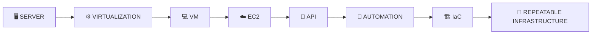

The biggest lesson from today:

> **Understand the infrastructure first. Then learn how to automate it.**

---

<div align="center">

# 🚀 DAY 03 COMPLETE

### Build • Break • Fix • Automate

**Learning → Understanding → Practicing → Documenting**

<br>

`Servers → Virtualization → Cloud → Automation → IaC`

<br>

📌 **More coming tomorrow...**

</div>
