<div align="center">

# DAY 04 — DevOps with Yuva

## Linux Fundamentals • AWS CLI • APIs • CloudFormation • CDK • EC2

### `Understand • Communicate • Automate • Provision`

<br>


</div>

---

# 🎯 Today's Goal

Today I started understanding how applications communicate with the operating system and how we communicate with AWS services.

The main question I wanted to understand was:

> **How does a command or application request something from the system or from AWS?**

---

# 🐧 Linux & Operating System Fundamentals

## 🧩 Application → Kernel → Hardware

Applications do not directly control physical hardware.

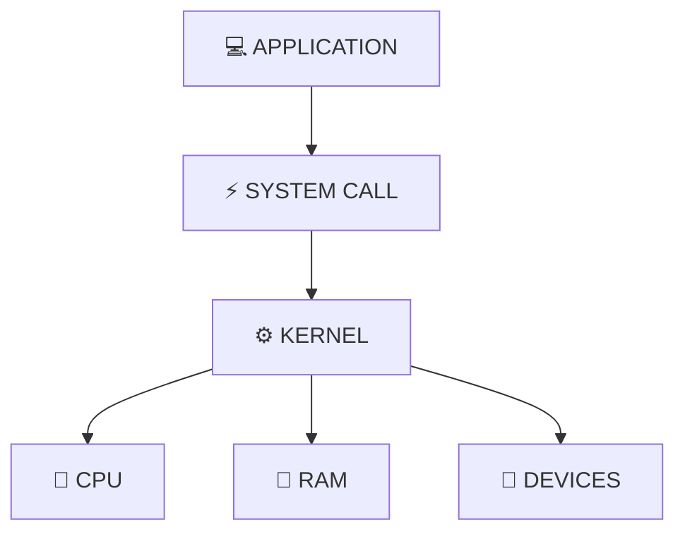

---

# ⚙️ Kernel

The **kernel** is the core part of the operating system.

It manages:

- 🧠 CPU
- 💾 Memory
- 💽 Storage
- 🔌 Devices
- 🌐 Network
- 🔄 Processes

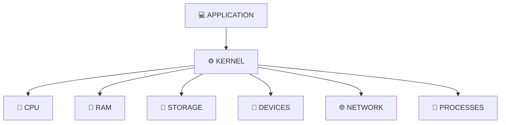

---

# 📚 System Libraries

System libraries provide predefined functionality that applications can use.

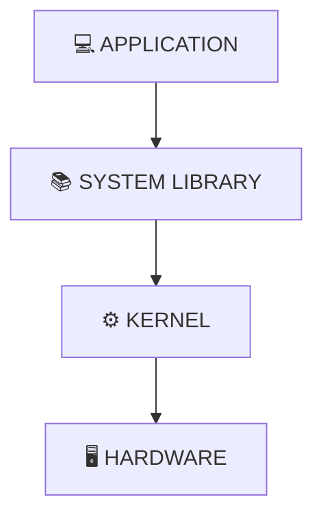

---

# 🔨 Compiler

A compiler converts source code into a form the computer can execute.

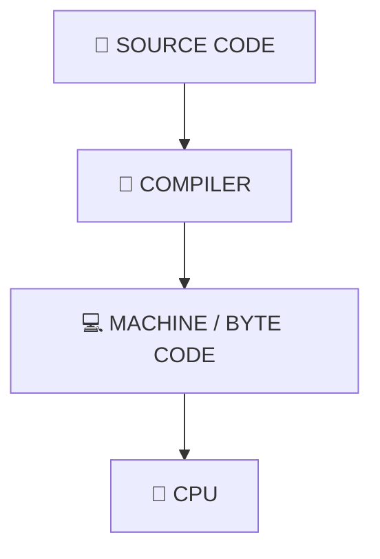

---

# 💻 Applications

Applications are programs used to perform tasks.

Examples:

- 🌐 Chrome
- 💻 VS Code
- 🔧 Git
- 🐳 Docker
- 🖥️ Terminal applications

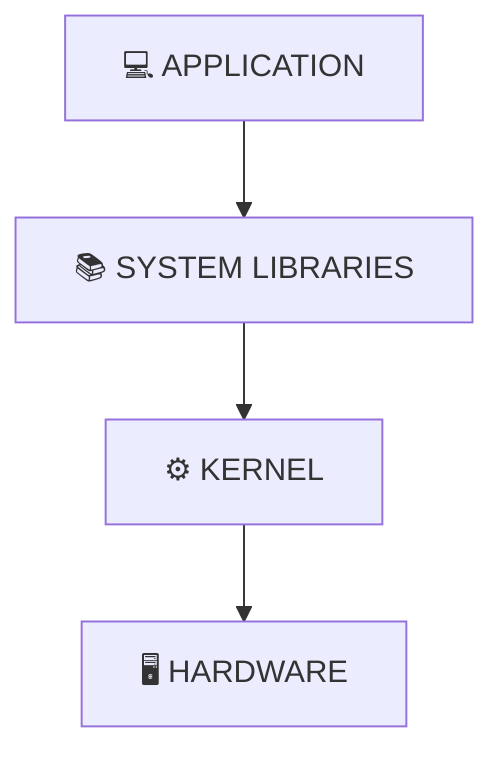

---

# 🐚 Shell

The **shell** provides an interface for communicating with the operating system using commands.

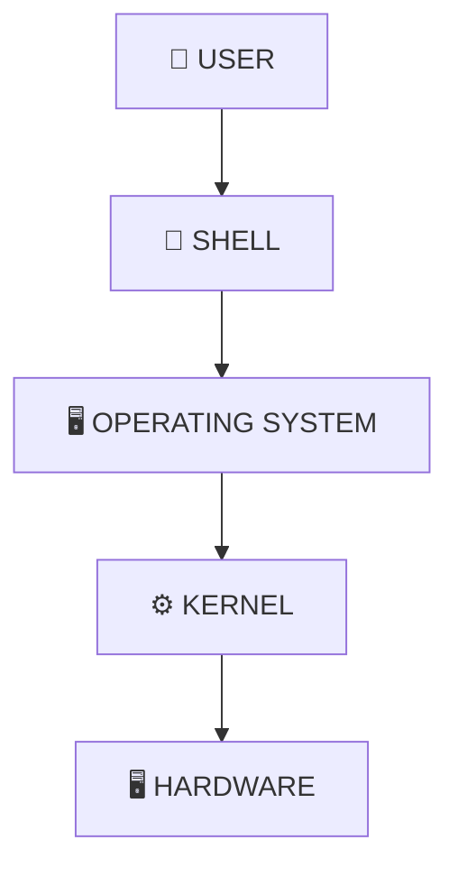

### Example

```bash
touch file.txt
```

---

# 📜 Shell Scripting

Shell scripting means writing multiple commands inside a script so repetitive tasks can be automated.

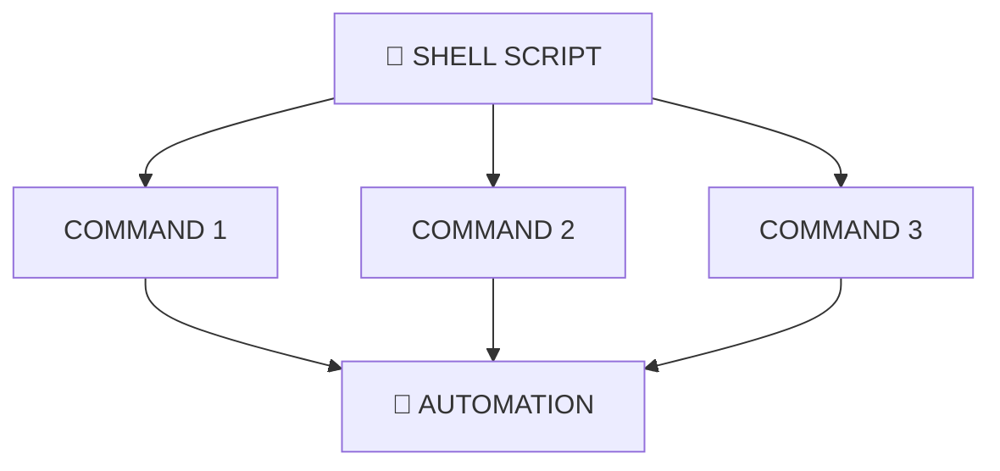

---

# 🤖 Automation

> **Automation = making repetitive work happen automatically using scripts or tools.**

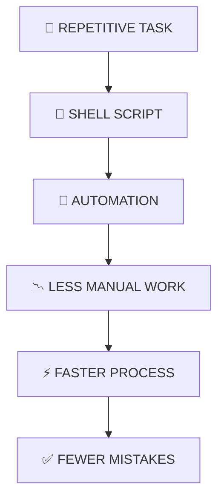

---

# ☁️ AWS Communication

## 🛠️ AWS CLI

**AWS CLI** stands for:

> **AWS Command Line Interface**

It allows us to manage AWS services using commands.

### Example

```bash
aws ec2 describe-instances
```

The command asks AWS for information about EC2 instances.

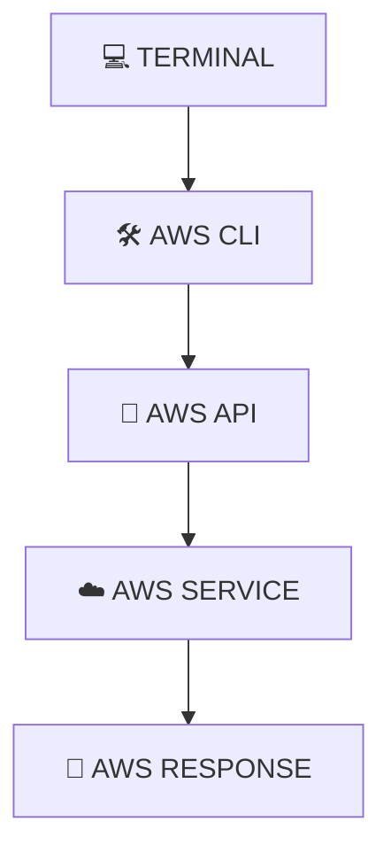

---

# 🔌 AWS API

An **API** acts as a communication layer between an application and an AWS service.

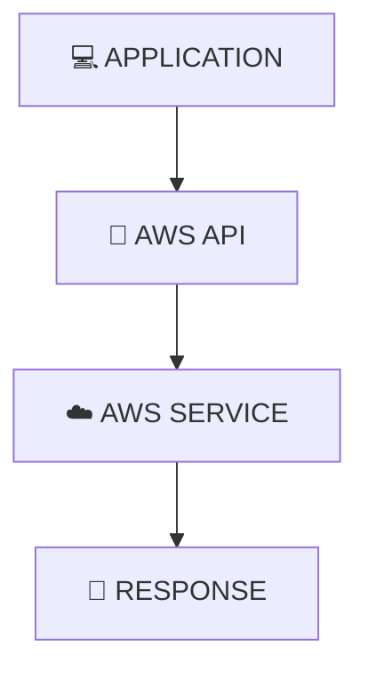

---

# 🧠 AWS CLI vs AWS API

| Concept | What I Understood |
|---|---|
| 🛠️ **AWS CLI** | Interact with AWS using commands |
| 🔌 **AWS API** | Applications communicate with AWS programmatically |

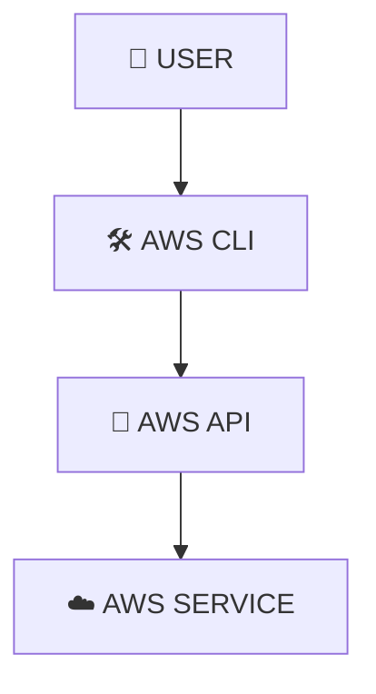

---

# 🏗️ Infrastructure Automation

Cloud infrastructure can be automated using different approaches and tools.

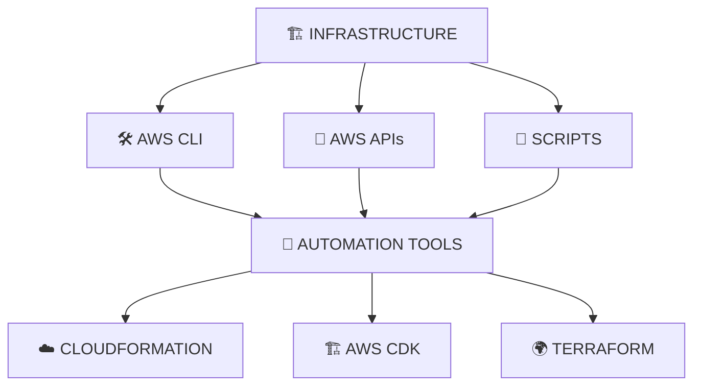

The goal is to reduce repetitive manual work.

---

# ☁️ AWS CloudFormation

**AWS CloudFormation** is an Infrastructure as Code service provided by AWS.

It allows infrastructure to be defined using templates.

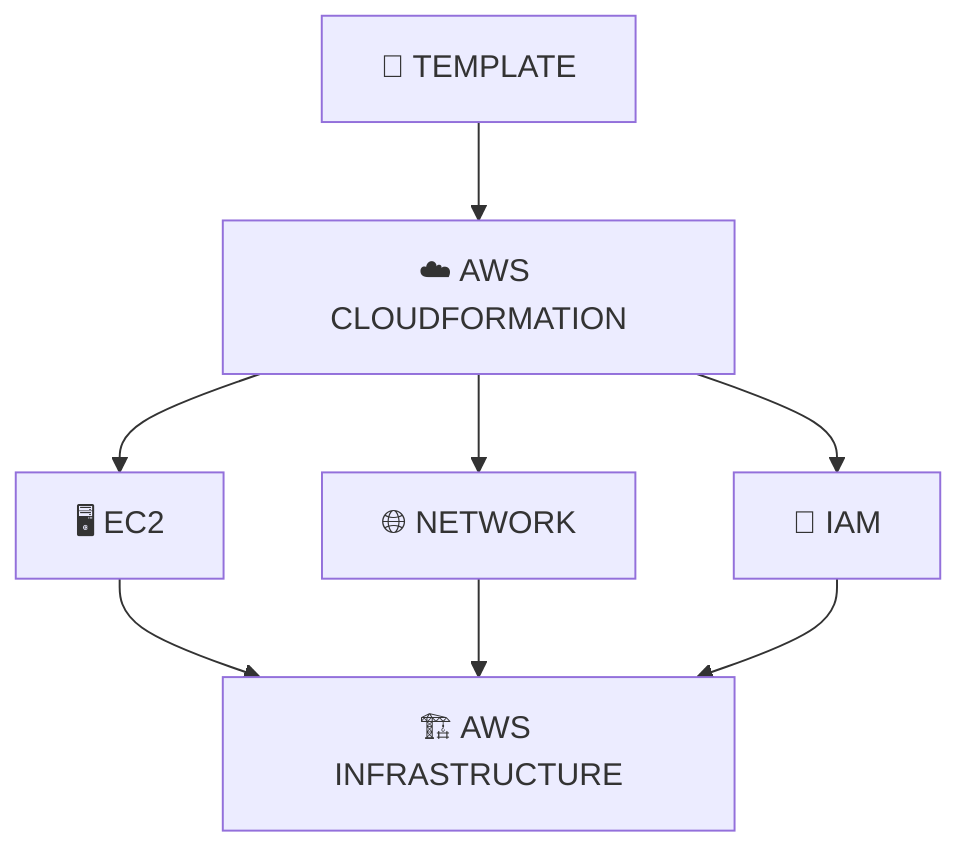

---

# 🏠 CloudFormation — Simple Example

I used the example of building houses to understand CloudFormation.

Instead of manually explaining the construction process every time, we can define a template.

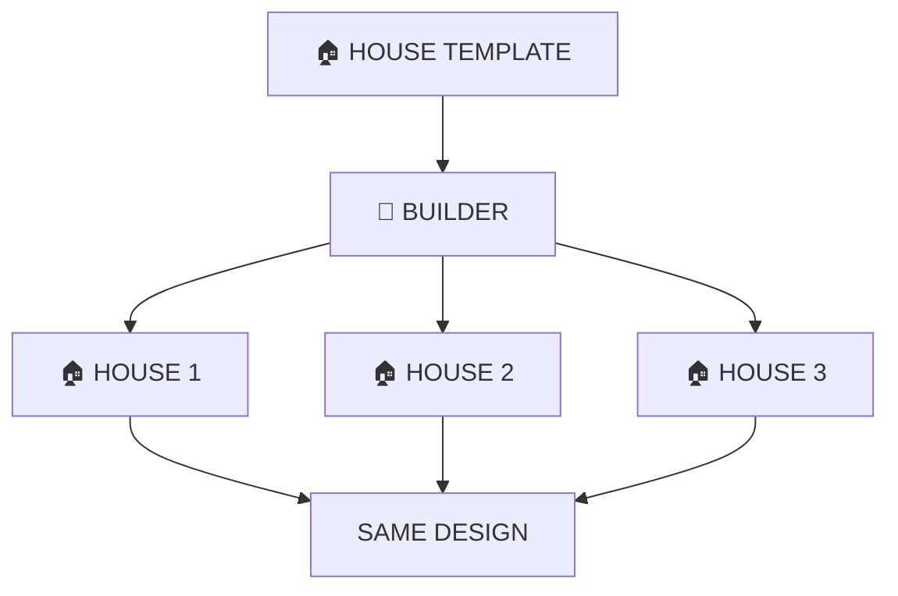

Similarly, CloudFormation uses templates to create AWS resources in a repeatable way.

---

# 🏗️ AWS CDK

**AWS CDK = Cloud Development Kit**

AWS CDK allows infrastructure to be defined using programming languages.

Examples:

- 🐍 Python
- ☕ Java
- 🟦 TypeScript
- #️⃣ C#

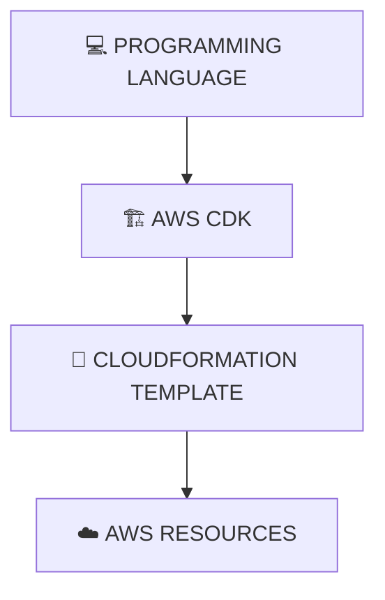

---

# 🆚 CloudFormation vs CDK

## ☁️ CloudFormation

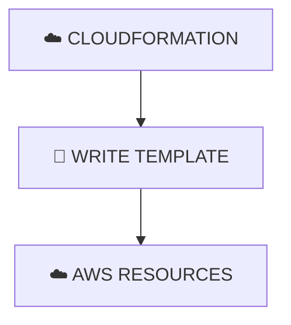

## 🏗️ AWS CDK

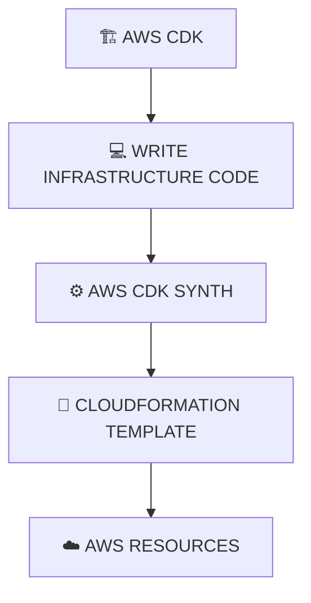

| ☁️ CloudFormation | 🏗️ AWS CDK |
|---|---|
| 📄 Template-based | 💻 Code-based |
| YAML / JSON | Programming languages |
| Directly defines infrastructure | Defines infrastructure through code |
| AWS IaC service | Framework for defining AWS infrastructure |

---

# 🖥️ EC2 — Virtual Server in AWS

**EC2 = Elastic Compute Cloud**

EC2 provides virtual servers in the AWS cloud.

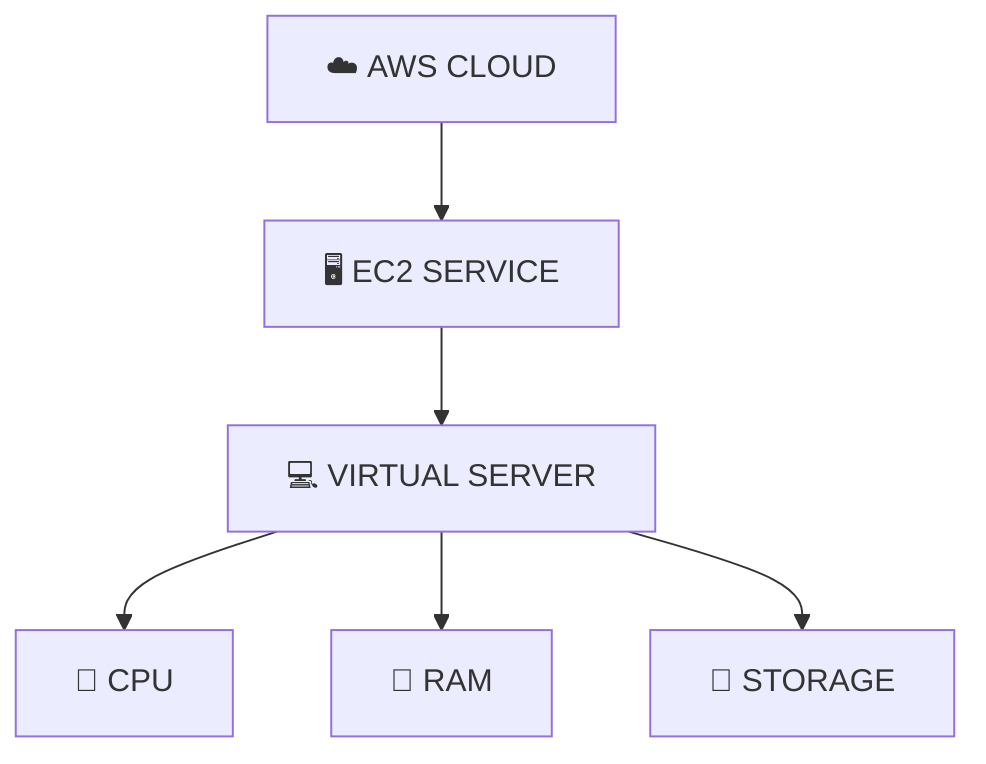

---

# 🚀 Creating an EC2 Instance

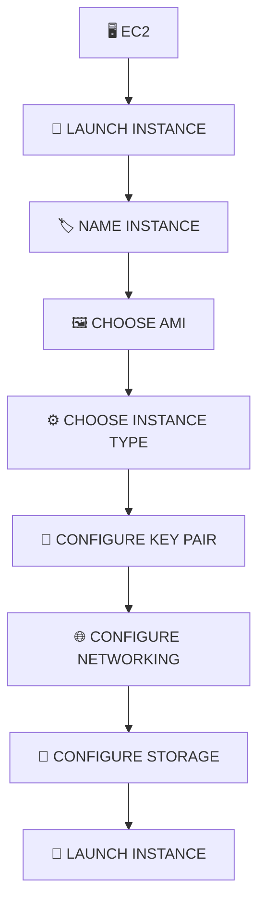

---

# 🖼️ AMI

**AMI = Amazon Machine Image**

An AMI provides the information required to launch an EC2 instance.

Examples:

- 🐧 Ubuntu
- ☁️ Amazon Linux
- 🪟 Windows

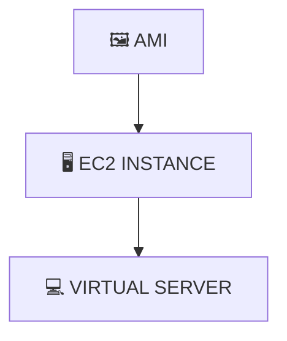

---

# 💻 Instance Type

The instance type determines the compute resources available to the EC2 instance.

```mermaid
flowchart TB
    A["⚙️ INSTANCE TYPE"] --> B["🧠 CPU"]
    A --> C["💾 RAM"]
    A --> D["🌐 NETWORK"]
```

---

# 🔑 Key Pair

A key pair is used to securely connect to an EC2 instance.

```mermaid
flowchart TB
    A["🔑 KEY PAIR"]

    A --> B["🔓 PUBLIC KEY"]
    A --> C["🔐 PRIVATE KEY"]

    B --> D["🖥️ SERVER"]
    C --> E["👤 USER"]
```

> **The private key must be kept secure.**

---

# 🌐 Hybrid Cloud

I also understood the basic idea of **Hybrid Cloud**.

Hybrid Cloud combines on-premises infrastructure with cloud infrastructure.

```mermaid
flowchart TB
    A["🏢 COMPANY"]

    A --> B["🏠 ON-PREMISES"]
    A --> C["☁️ CLOUD"]

    B --> D["🖥️ SERVERS"]
    C --> E["AWS"]

    D --> F["🔗 CONNECTED SYSTEM"]
    E --> F
```

---

# 🧩 How Everything Connects

```mermaid
flowchart TB
    A["💻 APPLICATION"] --> B["🐚 SHELL"]
    B --> C["⚙️ KERNEL"]
    C --> D["🖥️ HARDWARE"]

    D --> E["🤖 AUTOMATION"]
    E --> F["🛠️ AWS CLI"]
    F --> G["🔌 AWS API"]
    G --> H["☁️ AWS SERVICES"]

    H --> I["🖥️ EC2"]
    H --> J["🪣 S3"]
    H --> K["☁️ CLOUDFORMATION"]

    K --> L["🏗️ AWS CDK"]
    L --> M["🏗️ INFRASTRUCTURE"]
```

---

# 🧠 My Simple Mental Model

The easiest way I remember today's concepts:

```mermaid
flowchart TB
    A["🖥️ PHYSICAL HARDWARE"]
    B["⚙️ KERNEL"]
    C["📚 SYSTEM LIBRARIES"]
    D["💻 APPLICATION"]
    E["🐚 SHELL"]
    F["📜 SHELL SCRIPT"]
    G["🤖 AUTOMATION"]
    H["🛠️ AWS CLI"]
    I["🔌 AWS API"]
    J["☁️ AWS SERVICES"]

    A --> B
    B --> C
    C --> D
    D --> E
    E --> F
    F --> G
    G --> H
    H --> I
    I --> J

    J --> K["🖥️ EC2"]
    J --> L["🪣 S3"]
    J --> M["☁️ CLOUDFORMATION"]

    M --> N["🏗️ AWS CDK"]
    N --> O["🏗️ INFRASTRUCTURE"]
```

---

# 💡 What I Learned Today

My biggest takeaway from Day 4:

> **DevOps engineers need to understand how systems communicate and how infrastructure can be automated.**

Today I connected:

```mermaid
flowchart TB
    A["💻 APPLICATION"] --> B["🐚 SHELL"]
    B --> C["⚙️ KERNEL"]
    C --> D["🖥️ HARDWARE"]
```

Then:

```mermaid
flowchart TB
    A["👤 USER"] --> B["🛠️ AWS CLI"]
    B --> C["🔌 AWS API"]
    C --> D["☁️ AWS SERVICE"]
    D --> E["🏗️ INFRASTRUCTURE"]
```

And finally:

```mermaid
flowchart TB
    A["🏗️ INFRASTRUCTURE"] --> B["🤖 AUTOMATION"]

    B --> C["☁️ CLOUDFORMATION"]
    B --> D["🏗️ AWS CDK"]

    C --> E["☁️ AWS RESOURCES"]
    D --> E
```

---

# 🔑 Key Takeaways

| Concept | What I Understood |
|---|---|
| 🐧 **Operating System** | Provides an environment for applications and manages system resources |
| ⚙️ **Kernel** | Core layer that manages hardware and system resources |
| 📚 **System Libraries** | Provide predefined functionality for applications |
| 🔨 **Compiler** | Converts source code into executable / machine-understandable form |
| 💻 **Application** | Programs used to perform tasks |
| 🐚 **Shell** | Interface used to communicate with the operating system |
| 📜 **Shell Scripting** | Automates tasks using a sequence of commands |
| 🤖 **Automation** | Reduces repetitive manual work |
| 🛠️ **AWS CLI** | Manages AWS using commands |
| 🔌 **AWS API** | Allows applications to communicate with AWS |
| ☁️ **CloudFormation** | AWS Infrastructure as Code using templates |
| 🏗️ **AWS CDK** | Defines AWS infrastructure using programming languages |
| 🖥️ **EC2** | Virtual server / compute service in AWS |
| 🖼️ **AMI** | Image used to launch an EC2 instance |
| 🔑 **Key Pair** | Used for secure access to EC2 |
| 🌐 **Hybrid Cloud** | Combination of on-premises and cloud infrastructure |
| 🏗️ **IaC** | Defines infrastructure using code / templates |

---

# 📸 My Day 04 Notes

These are the handwritten notes I made while learning about **Linux fundamentals, AWS CLI, AWS APIs, CloudFormation, AWS CDK, EC2, and infrastructure automation.**

## 🐧 Linux & Operating System Fundamentals

<p align="center">
  
</p>

---

<div align="center">

# 🚀 DAY 04 COMPLETE

### `Understand • Communicate • Automate • Provision`

**Learning → Understanding → Practicing → Documenting**

<br>

`Linux → Kernel → Shell → AWS CLI → APIs → CloudFormation → CDK → EC2 → Automation`

<br>

📌 **More coming tomorrow...**

**DAY 05 → Next step in the DevOps journey**

</div>
