# 🚀 DAY 05 — SHELL SCRIPTING, LINUX MONITORING & GIT BRANCHING

<p align="center">
  
  
  
  
</p>

<p align="center">
  <b>☁️ DevOps Cloud Journey — From Zero to DevOps Engineer</b>
</p>

---

## 📚 TODAY'S LEARNING

Today I learned how **Shell Scripting** helps DevOps engineers automate repetitive tasks, how Linux servers can be monitored using commands, and how **Git Branching Strategies** help teams manage development, releases, and production fixes.

### 🧠 Topics Covered

* 🐚 Shell Scripting
* 🔀 `sh` vs `bash`
* 📝 Creating the First Shell Script
* 🔐 File Permissions
* ▶️ Executing Shell Scripts
* 🐛 Shell Script Debugging
* 🔎 `grep` and Pipes
* 📊 Linux Server Monitoring
* 🌿 Git Branching
* 🌳 GitFlow
* 🚀 Feature Branch
* 📦 Release Branch
* 🔥 Hotfix Branch

---

# 🖥️ 1. UNDERSTANDING A PHYSICAL SERVER

Before understanding automation and virtualization, it is important to understand what a physical server contains.

A physical server is an actual machine with hardware resources such as:

* 🧠 CPU
* 🧮 RAM
* 💾 Storage
* 🌐 Network

### 🏗️ Physical Server Architecture

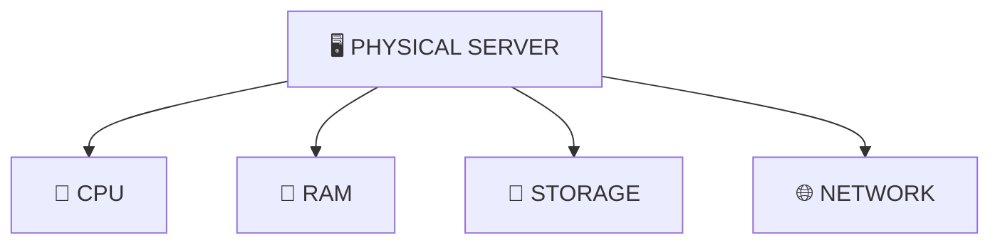

### 💡 Key Idea

A physical server is an actual machine, while a **Virtual Machine (VM)** is software-based and uses the resources of a physical server.

---

# 🐚 2. WHAT IS SHELL SCRIPTING?

Shell scripting is a way of writing a series of Linux commands inside a file so that they can be executed automatically.

Instead of manually executing the same commands repeatedly, we can put those commands into a script and automate the process.

### 💡 Why Shell Scripting?

In a DevOps environment, there may be hundreds or thousands of servers.

Manually checking every server is difficult and time-consuming.

For example, we may need to check:

* 🧠 CPU usage
* 🧮 RAM usage
* 💾 Disk usage
* ⚙️ Running processes
* 🌐 Services
* 📁 Files and directories

Shell scripting helps automate these repetitive operations.

### 🔄 Manual vs Automated Approach

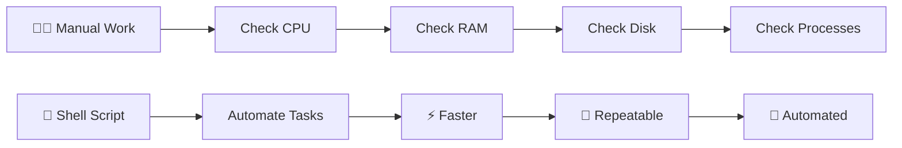

---

# 🐧 3. SH VS BASH

There are different types of Unix/Linux shells.

Two commonly used shells are:

| Shell  | Meaning            | Usage                              |
| ------ | ------------------ | ---------------------------------- |
| `sh`   | Bourne Shell       | Basic and portable shell scripting |
| `bash` | Bourne Again Shell | Advanced shell scripting           |

### `/bin/sh`

```bash
#!/bin/sh

echo "Hello"
```

`sh` provides basic shell functionality and focuses on portability.

### `/bin/bash`

```bash
#!/bin/bash

echo "Hello"
```

Bash provides additional features such as:

* Variables
* Arrays
* Functions
* Conditions
* Loops
* Advanced command handling

### ⭐ Simple Difference

```text
┌─────────────────────┐
│        sh           │
│ Basic + Portable    │
└─────────────────────┘

          VS

┌─────────────────────┐
│       bash          │
│ Advanced + Powerful │
└─────────────────────┘
```

---

# 📝 4. CREATE YOUR FIRST SHELL SCRIPT

First, go to your home directory:

```bash
cd ~
```

Check where you are:

```bash
pwd
```

Example:

```text
/home/ubuntu
```

---

## 📁 Create a Folder

```bash
mkdir shell-scripting
```

Check the folder:

```bash
ls
```

Enter the folder:

```bash
cd shell-scripting
```

Verify:

```bash
pwd
```

---

# 📄 5. CREATE YOUR FIRST SCRIPT

Create a file:

```bash
touch first-script.sh
```

Check the file:

```bash
ls
```

Expected:

```text
first-script.sh
```

---

# ✍️ 6. EDIT THE SCRIPT

Open the file using Vim:

```bash
vi first-script.sh
```

Press:

```text
i
```

to enter **Insert Mode**.

Then write:

```bash
#!/bin/bash

echo "Hello Yuvi"
```

### 🔍 What Is `#!/bin/bash`?

This is called a **Shebang**.

It tells Linux which interpreter should execute the script.

```text
#!/bin/bash
      │
      └── Bash interpreter
```

---

# 💾 7. SAVE AND EXIT VIM

After typing the script:

### Step 1

Press:

```text
ESC
```

### Step 2

Type:

```text
:wq
```

### Step 3

Press:

```text
ENTER
```

The file is now saved.

---

# 🔐 8. GIVE EXECUTION PERMISSION

Check permissions:

```bash
ls -l
```

A newly created script may look like:

```text
-rw-r--r--  first-script.sh
```

Give execute permission:

```bash
chmod 777 first-script.sh
```

Check again:

```bash
ls -l
```

> 💡 In production, avoid `777` unless it is genuinely required. Prefer the minimum permissions necessary.

---

# ▶️ 9. RUN THE SCRIPT

Execute the script:

```bash
./first-script.sh
```

### Output

```text
Hello Yuvi
```

Another way:

```bash
bash first-script.sh
```

### 🔄 Shell Script Execution Flow

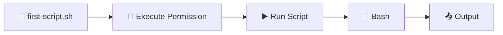

---

# 🐛 10. DEBUGGING SHELL SCRIPTS

When a script is not working as expected, debugging becomes important.

## `set -x`

```bash
set -x
```

It prints commands while they are being executed.

Example:

```bash
#!/bin/bash

set -x

echo "Hello Yuvi"
```

---

## `set -e`

```bash
set -e
```

Stops the script when a command fails.

---

## `set -o`

```bash
set -o
```

Displays available shell options.

### 🧠 Debugging Flow

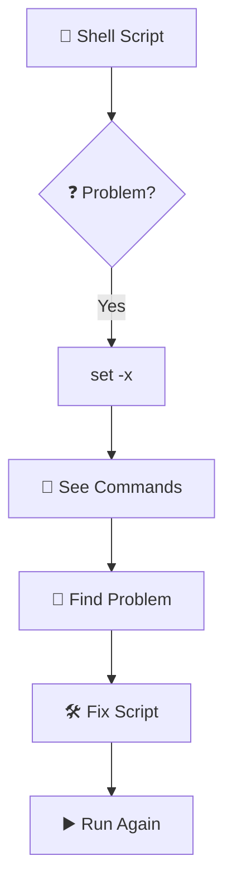

---

# 🔎 11. USING GREP

`grep` is used to search for specific text or patterns.

### Example

```bash
ps -ef | grep amazon
```

Here:

```text
ps -ef
  │
  └── Displays running processes

        ↓

grep amazon
  │
  └── Searches for "amazon"
```

---

# 🔗 12. PIPE `|`

A pipe sends the output of one command as input to another command.

```text
┌───────────────┐
│   Command 1   │
└───────┬───────┘
        │
        │ Output
        ↓
       PIPE
        │
        ↓
┌───────┴───────┐
│   Command 2   │
└───────────────┘
```

Example:

```bash
ps -ef | grep amazon
```

### 🔄 What Happens?

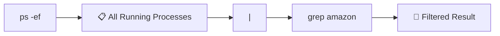

---

# 🎯 13. GET ONLY THE REQUIRED PROCESS

Sometimes a command produces a large amount of information.

We may only need a particular process.

For example:

```bash
ps -ef | grep amazon
```

Another example:

```bash
ps -ef | grep -E "amazon"
```

### Concept

```text
Large Output
      │
      ↓
   grep
      │
      ↓
Filtered Output
```

---

# 📊 14. MONITORING LINUX SERVER HEALTH

As a DevOps engineer, monitoring server health is extremely important.

We can use Linux commands to quickly inspect the server.

| Requirement          | Command   |
| -------------------- | --------- |
| 🧠 CPU / Processes   | `top`     |
| 💾 Disk Usage        | `df -h`   |
| 🧮 RAM Usage         | `free -h` |
| ⚙️ Running Processes | `ps -ef`  |

---

## 🧠 Monitor CPU and Processes

```bash
top
```

`top` displays:

* CPU usage
* Memory usage
* Running processes
* Load information
* Process IDs

---

## 💾 Check Disk Usage

```bash
df -h
```

`df` shows filesystem disk usage.

`-h` means **human-readable**.

---

## 🧮 Check RAM

```bash
free -h
```

This displays:

* Total RAM
* Used RAM
* Free RAM
* Available RAM
* Swap

### 🖥️ Server Health Monitoring

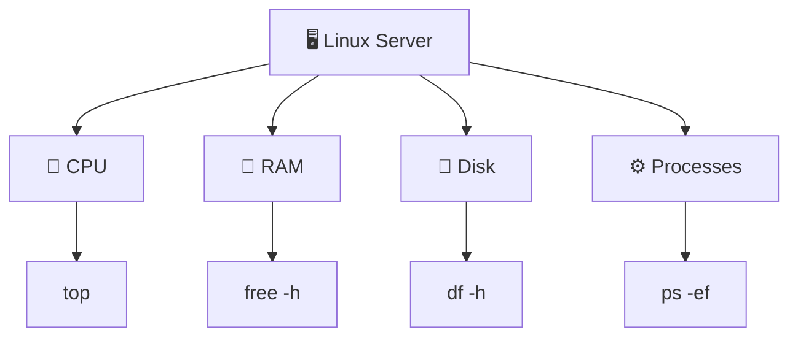

---

# 🌳 15. GIT BRANCHING STRATEGY

Git branching allows developers to work on different parts of an application without directly affecting stable production code.

A common branching strategy is **GitFlow**.

### 🌿 Basic GitFlow

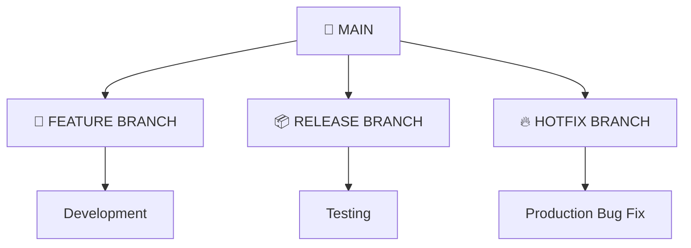

---

# 🏠 16. MAIN BRANCH

The **main branch** contains the stable code of the project.

It represents the primary production-ready codebase.

```text
┌───────────────────────┐
│       🌳 MAIN         │
├───────────────────────┤
│ Stable Code           │
│ Tested Code           │
│ Production Code       │
└───────────────────────┘
```

It may also be called:

* `main`
* `master`
* `trunk`

---

# 🚀 17. FEATURE BRANCH

Whenever a developer wants to build a new feature, they create a separate feature branch.

Example:

```text
main
  │
  └── feature-login
```

Other examples:

```text
feature-login
feature-payment
feature-search
feature-dashboard
```

### Feature Development Flow

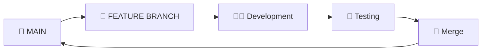

Each developer can work independently without disturbing the main branch.

---

# 📦 18. RELEASE BRANCH

When the project is completed and ready for release, a **release branch** can be created.

Example:

```text
main
 │
 └── release-v1.0
```

The release branch can be used for:

* Final Testing
* Performance Testing
* Bug Fixing
* Release Preparation

### Release Flow

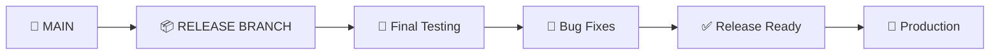

---

# 🔥 19. HOTFIX BRANCH

Imagine the application is already live in production and suddenly a critical bug is discovered.

We should not wait for the next planned release.

Instead, we create a **hotfix branch**.

Example:

```text
main
 │
 └── hotfix-login
```

### Hotfix Flow

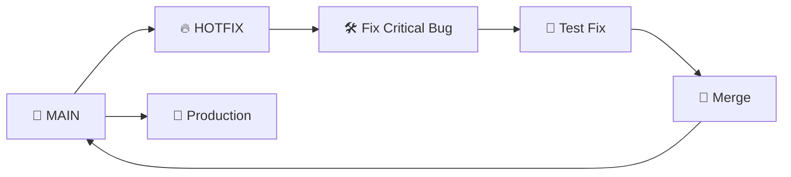

---

# 🔀 20. COMPLETE GITFLOW

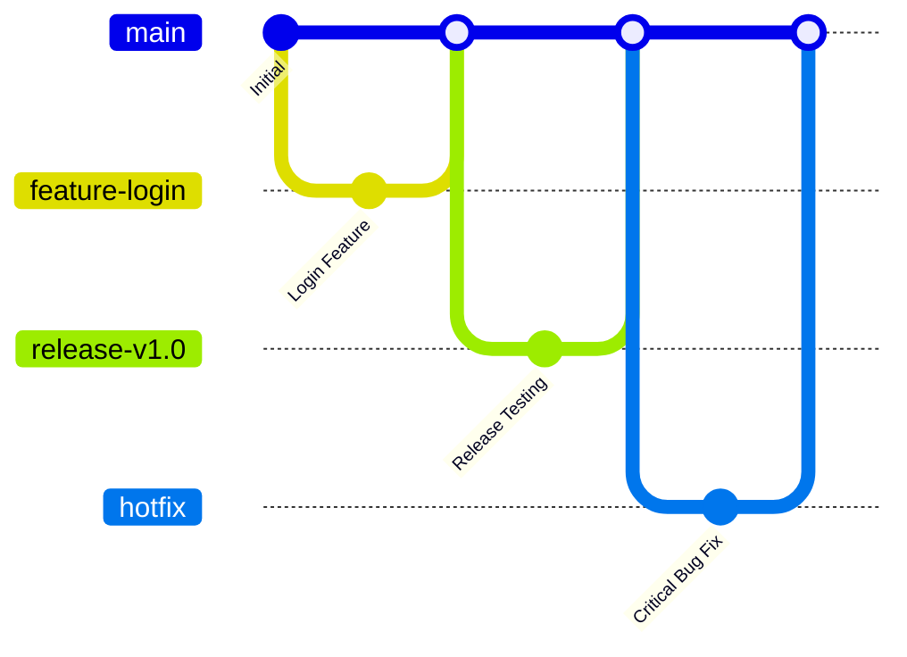

### 🌳 Branch Responsibilities

| Branch      | Purpose                             |
| ----------- | ----------------------------------- |
| `main`      | Stable / Production Code            |
| `feature/*` | New Feature Development             |
| `release/*` | Final Testing & Release Preparation |
| `hotfix/*`  | Urgent Production Bug Fixes         |

---

# 🧩 21. REAL-WORLD GITFLOW EXAMPLE

Imagine we are developing an e-commerce application.

### 1️⃣ Main

```text
main
```

Contains the stable application.

### 2️⃣ Login Feature

```text
feature-login
```

Developer builds and tests the login functionality.

### 3️⃣ Payment Feature

```text
feature-payment
```

Another developer works independently.

### 4️⃣ Release

```text
release-v1.0
```

The completed features are tested before production.

### 5️⃣ Production

```text
release-v1.0
        ↓
      main
        ↓
   Production 🚀
```

### 6️⃣ Critical Bug

```text
main
 ↓
hotfix-login
 ↓
Fix Bug
 ↓
Test
 ↓
main
 ↓
Production ✅
```

---

# 🏗️ 22. COMPLETE DEVOPS CONCEPT FLOW

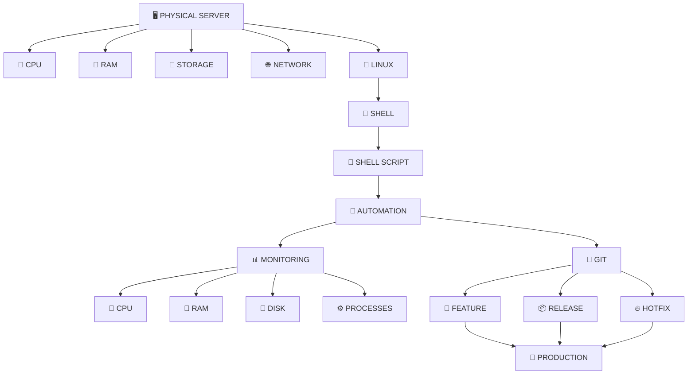

---

# ⭐ 23. COMMANDS LEARNED TODAY

```bash
cd
pwd
mkdir
ls
touch
vi
chmod
./first-script.sh
bash first-script.sh
set -x
set -e
set -o
ps -ef
grep
ps -ef | grep amazon
top
df -h
free -h
```

---

# 📝 24. PRACTICAL TASKS THAT I DID 

* [x] Navigated to the home directory
* [x] Checked the current working directory
* [x] Created a Shell Scripting folder
* [x] Created `first-script.sh`
* [x] Opened the script using Vim
* [x] Added the Bash shebang
* [x] Printed a message using `echo`
* [x] Saved and exited Vim
* [x] Gave execution permission
* [x] Executed the script
* [x] Learnt `set -x`
* [x] Learnt `set -e`
* [x] Learnt `set -o`
* [x] Learnt `grep`
* [x] Learnt pipes
* [x] Learnt process filtering
* [x] Learnt Linux health-monitoring commands
* [x] Understood GitFlow
* [x] Understood Feature Branch
* [x] Understood Release Branch
* [x] Understood Hotfix Branch

---

# 💡 25. KEY TAKEAWAY

> **Automation is one of the core principles of DevOps.**

Instead of manually repeating the same operation across multiple servers, we can use **Shell Scripts** to automate it.

Instead of allowing every developer to directly modify production code, **Git Branching** provides a structured way to develop, test, release, and fix applications safely.

```text
                  ☁️ DEVOPS
                     │
          ┌──────────┴──────────┐
          ↓                     ↓
      🐚 LINUX                 🌳 GIT
          │                     │
          ↓                     ↓
   SHELL SCRIPTING          BRANCHING
          │                     │
          ↓                     ↓
     AUTOMATION            COLLABORATION
          │                     │
          ↓                     ↓
     MONITORING              RELEASE
          │                     │
          └──────────┬──────────┘
                     ↓
             🚀 RELIABLE DELIVERY
```

---

# 🎯 DAY 04 COMPLETE

<p align="center">
  <b>🖥️ Server → 🐚 Shell → 🤖 Automation → 📊 Monitoring → 🌳 GitFlow</b>
</p>

<p align="center">
  <b>DAY 05 COMPLETE ✅</b>
</p>

<p align="center">
  <i>Learning DevOps one day, one command and one project at a time. 🚀☁️</i>
</p>
