<h1 align="center"> DAY 06 — GITHUB, GIT REMOTE, CLONE, FORK & SSH</h1>

<p align="center">

  
  
  
  

</p>

<p align="center">

### ☁️ DevOps Cloud Journey — From Zero to DevOps Engineer

</p>

---

## 📚 TODAY'S LEARNING

Today I learned how Git works with GitHub, how a local Git repository connects to a remote repository, how to clone and fork repositories, and how to configure SSH authentication between an EC2 server and GitHub.

---

## 🧠 TOPICS COVERED

- 🌳 Git Repository
- 📁 `.git` Directory
- 🆕 `git init`
- ➕ `git add`
- 📊 `git status`
- 🌐 Git Remote
- 🔗 `git remote -v`
- 📤 `git push`
- 📥 `git fetch`
- 📦 `git clone`
- 🍴 GitHub Fork
- 🔐 SSH Authentication
- 🔑 SSH Key Generation
- 🔓 Public & Private Keys
- ☁️ GitHub SSH Configuration
- 🖥️ EC2 → GitHub Authentication
- 🌿 Git Branching & GitFlow

---

# 🌳 1. UNDERSTANDING THE `.git` FOLDER

When we initialize a Git repository using:

```bash
git init
```

Git creates a hidden directory:

```text
.git
```

This directory contains Git's internal information.

It stores information related to:

- 📝 Commits
- 🌿 Branches
- 📜 History
- ⚙️ Configuration
- 🔗 References

### 🔍 View Hidden Files

```bash
ls -a
```

You should see:

```text
.git
```

### 🏗️ Git Repository Structure

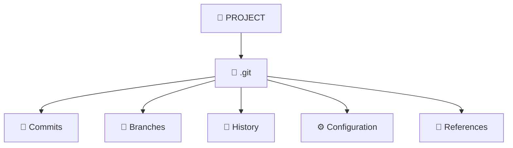

---

# 📂 2. GO INSIDE THE `.git` DIRECTORY

To enter the `.git` directory:

```bash
cd .git
```

Then:

```bash
ls
```

Git's internal files and directories will be displayed.

### 💡 Important

```text
Normal Folder
      ↓
   git init
      ↓
  .git Created
      ↓
 Git Repository
```

---

# 🆕 3. CREATE A GIT REPOSITORY

Create a project:

```bash
mkdir gitdemo
```

Go inside:

```bash
cd gitdemo
```

Check your location:

```bash
pwd
```

Example:

```text
/home/ubuntu/gitdemo
```

Now initialize Git:

```bash
git init
```

Expected output:

```text
Initialized empty Git repository
```

Verify:

```bash
ls -la
```

You should see:

```text
.git
```

### 🔄 Git Initialization Flow

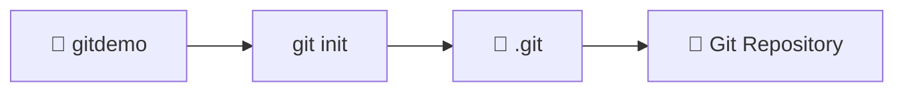

---

# 📄 4. CREATE YOUR FIRST FILE

Create a Shell script:

```bash
vim calculator.sh
```

Add:

```bash
#!/bin/bash
echo "Hello Git"
```

Save and exit Vim:

```text
ESC → :wq → ENTER
```

Check the file:

```bash
ls
```

Output:

```text
calculator.sh
```

---

# ➕ 5. ADD FILE TO STAGING AREA

To add the file:

```bash
git add calculator.sh
```

Or add everything:

```bash
git add .
```

### 🔄 Git Staging Flow

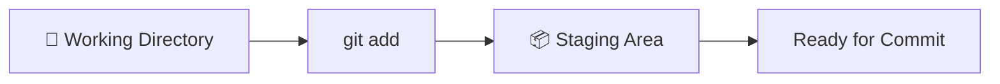

---

# 📊 6. CHECK GIT STATUS

To check the current state:

```bash
git status
```

Git can show:

- Untracked files
- Modified files
- Changes to be committed

### 🧠 Basic Git Workflow

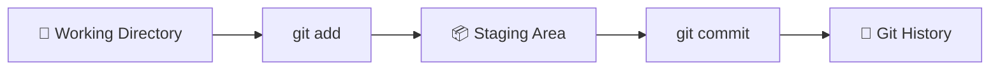

---

# 🌐 7. WHAT IS A GIT REMOTE?

A Git remote connects your local repository to a remote repository such as GitHub.

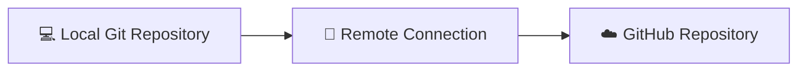

The commonly used remote name is:

```text
origin
```

---

# 🔗 8. CONNECT LOCAL REPOSITORY TO GITHUB

Add a GitHub remote:

```bash
git remote add origin https://github.com/YOUR-USERNAME/gitdemo.git
```

### Meaning

| Part | Meaning |
|---|---|
| `git remote` | Manage remote repositories |
| `add` | Add a remote |
| `origin` | Name of the remote |
| `URL` | GitHub repository |

### 🔄 Local → GitHub

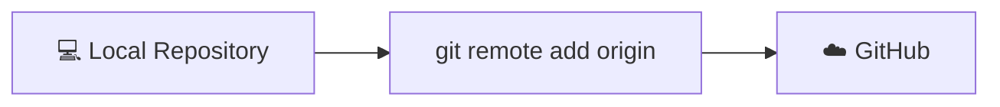

---

# 🔎 9. VERIFY THE REMOTE

Run:

```bash
git remote -v
```

Example:

```text
origin  https://github.com/YOUR-USERNAME/gitdemo.git (fetch)
origin  https://github.com/YOUR-USERNAME/gitdemo.git (push)
```

### 💡 Meaning

```text
origin
├── fetch → Get information from GitHub
└── push  → Upload changes to GitHub
```

---

# 📤 10. GIT PUSH

`git push` uploads local commits to the remote repository.

Example:

```bash
git push -u origin main
```

### 🚀 Push Flow

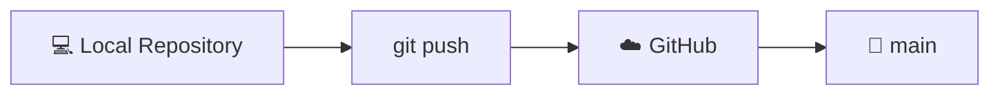

### 🧠 Remember

```text
git push = Send your local commits to the remote repository.
```

---

# 📥 11. GIT FETCH

`git fetch` downloads information about changes from the remote repository.

```bash
git fetch
```

It does not directly modify your working files.

### 🔄 Fetch Flow

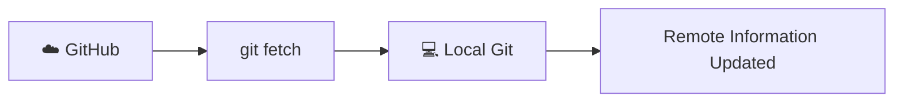

---

# ⭐ PUSH VS FETCH

| Command | Purpose |
|---|---|
| `git push` | Upload local commits |
| `git fetch` | Download remote information |

---

# 📦 12. GIT CLONE

`git clone` downloads an existing repository from GitHub.

```bash
git clone https://github.com/YOUR-USERNAME/gitdemo.git
```

### 🔄 Clone Flow

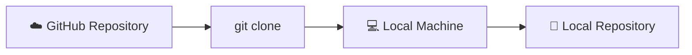

After cloning, you get a complete local copy of the repository.

---

# 🔐 13. CLONE USING SSH

Instead of HTTPS, you can clone using SSH:

```bash
git clone git@github.com:YOUR-USERNAME/gitdemo.git
```

### HTTPS vs SSH

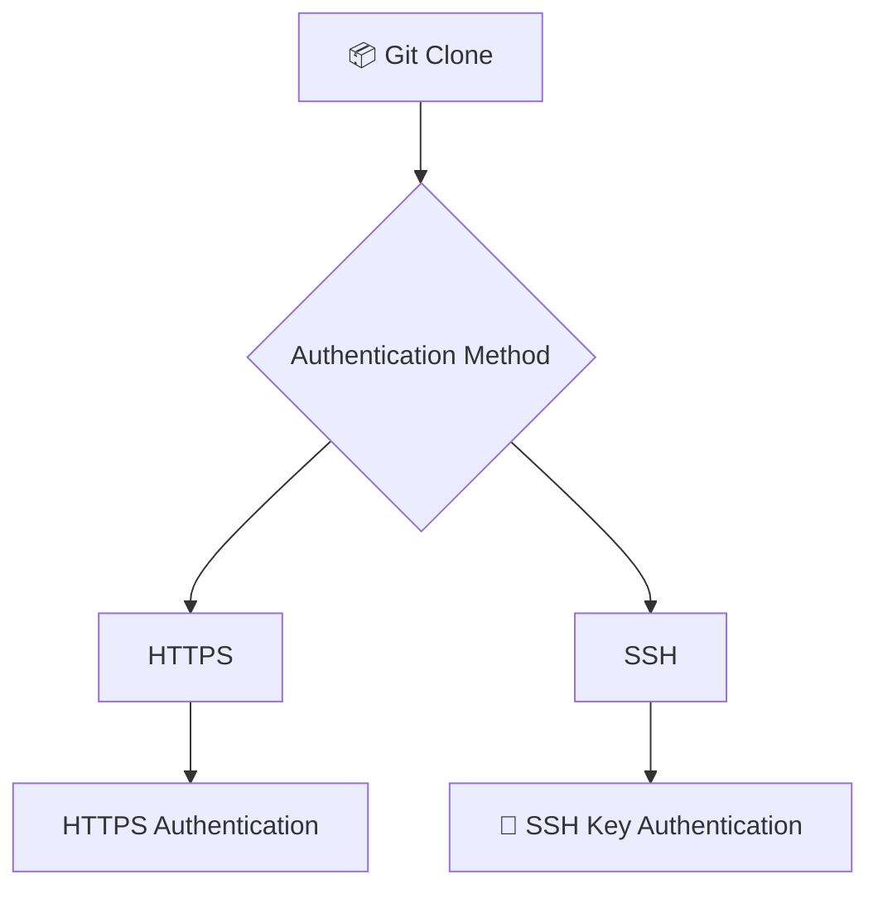

---

# 🍴 14. GITHUB FORK

A Fork creates your own copy of another user's repository on GitHub.

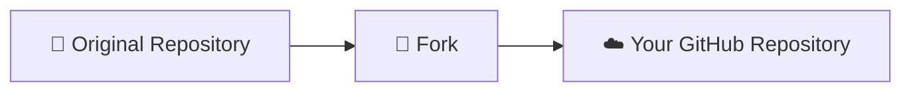

### Example

```text
Original Repository
        ↓
       Fork
        ↓
Your GitHub Repository
        ↓
      Clone
        ↓
  Local Machine
```

---

# ⚔️ 15. GIT CLONE VS GITHUB FORK

| Git Clone | GitHub Fork |
|---|---|
| Downloads repository to local machine | Creates your own copy on GitHub |
| Git command | GitHub feature |
| `git clone` | Fork button |
| Local operation | Remote GitHub operation |
| Used to work locally | Used to create your own repository copy |

### 🔄 Fork + Clone Workflow

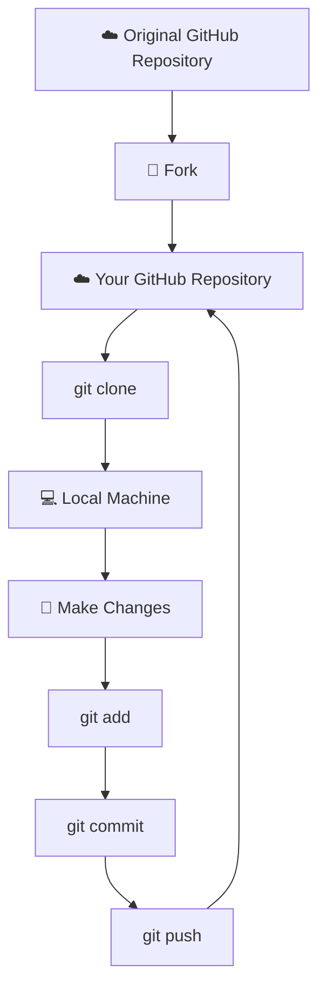

---

# 🔐 16. SSH AUTHENTICATION

SSH allows secure communication between your EC2 server and GitHub.

When SSH is configured, two keys are involved:

```text
🔐 PRIVATE KEY          🔓 PUBLIC KEY
```

### 🔐 Private Key

The private key stays on your EC2 server.

```text
🖥️ EC2
└── 🔐 Private Key
```

### 🔓 Public Key

The public key is added to GitHub.

```text
☁️ GitHub
└── 🔓 Public Key
```

> ⚠️ **Never share your private key.**

---

# 🏗️ 17. SSH AUTHENTICATION ARCHITECTURE

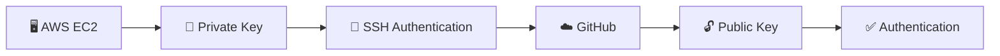

---

# 🔑 18. GENERATE SSH KEY

On EC2:

```bash
ssh-keygen
```

Follow the prompts.

You can provide a passphrase for additional protection.

After generating the key, check:

```bash
ls -al ~/.ssh
```

---

# 🔓 19. GET YOUR PUBLIC KEY

Display the public key:

```bash
cat ~/.ssh/id_ed25519.pub
```

If your generated key uses another filename, use that `.pub` file instead.

Copy the public key.

```text
🔐 Private Key
└── Stays on EC2

🔓 Public Key
└── Added to GitHub
```

---

# 🌐 20. ADD SSH KEY TO GITHUB

On GitHub:

```text
Profile Picture
      ↓
Settings
      ↓
SSH and GPG Keys
      ↓
New SSH Key
      ↓
Enter Title
      ↓
Paste Public Key
      ↓
Add SSH Key
```

Example title:

```text
AWS EC2
```

---

# 🧪 21. TEST SSH CONNECTION

From EC2:

```bash
ssh -T git@github.com
```

If authentication is successful, GitHub confirms that you have successfully authenticated.

### 🔄 SSH Authentication Flow

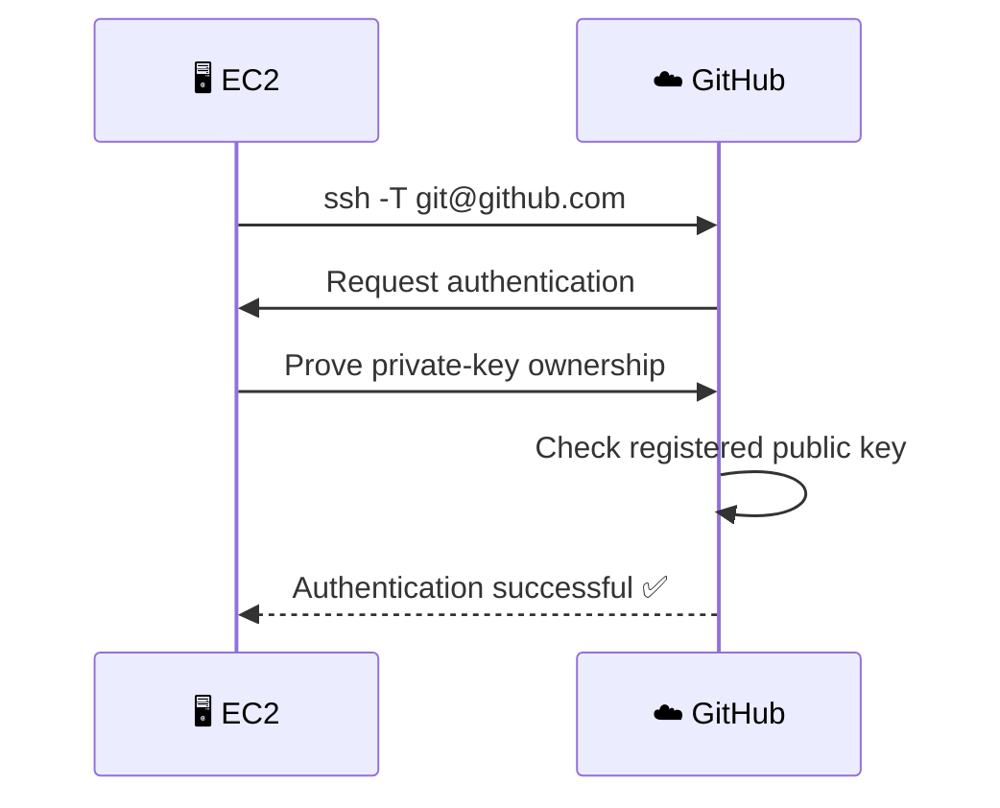

---

# 🚀 22. AFTER SSH AUTHENTICATION

Once SSH authentication works, your EC2 server can communicate with GitHub securely.

You can now perform:

```text
📦 clone
📤 push
📥 fetch
⬇️ pull
```

### Complete EC2 → GitHub Flow

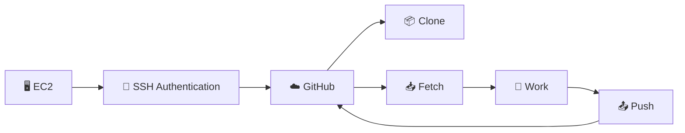

---

# 🌿 23. GIT BRANCHING

A branch allows developers to work on different features or fixes without directly changing the main production branch.

```text
                    🌿 main
                       │
       ┌───────────────┼───────────────┐
       ↓               ↓               ↓
 feature-login     feature-api       hotfix
       │               │               │
       ↓               ↓               ↓
   Develop          Develop           Fix
       │               │               │
       └───────────────┼───────────────┘
                       ↓
                     Merge
                       ↓
                    🌿 main
```

---

# 🌱 24. FEATURE BRANCH FLOW

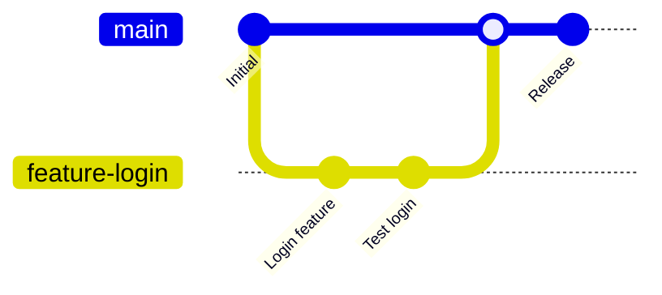

### 💡 Why Use Branches?

Branches allow teams to:

- Work on features independently
- Fix bugs safely
- Test changes
- Review code
- Merge completed work
- Protect the main branch

---

# 🔥 25. HOTFIX FLOW

A hotfix is used when a critical production issue needs to be fixed quickly.

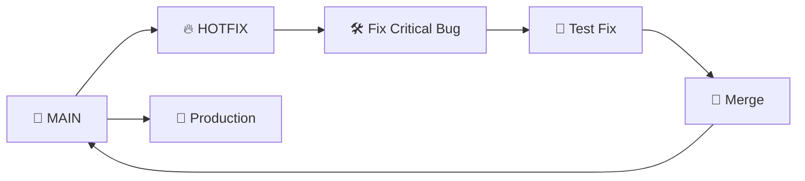

### 🔥 HOTFIX FLOW

```text
                 🌿 MAIN
                    │
                    ├──────────────→ 🚀 Production
                    │
                    ↓
                 🔥 HOTFIX
                    │
                    ↓
            🛠️ Fix Critical Bug
                    │
                    ↓
                🧪 Test Fix
                    │
                    ↓
                 🔀 Merge
                    │
                    └──────────────→ 🌿 MAIN
```

---

# 🔄 26. COMPLETE GITFLOW

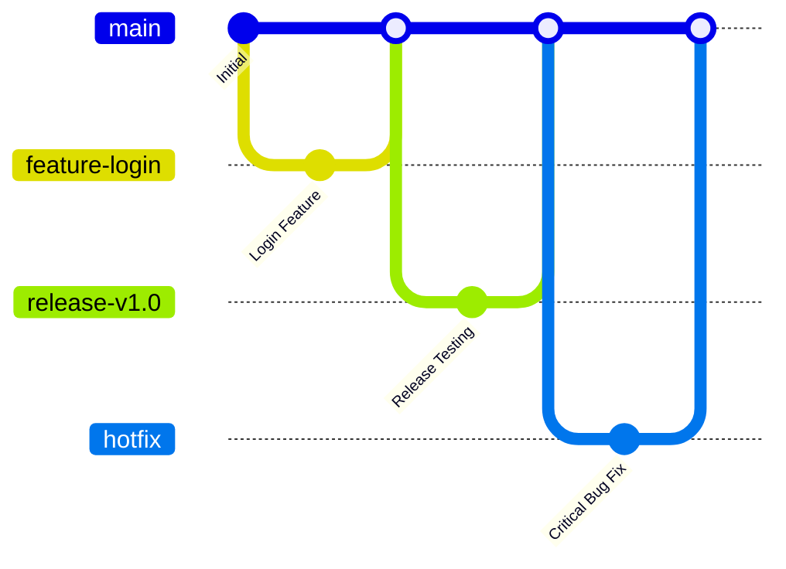

### 🧠 GitFlow Concept

```text
                       🌿 MAIN
                          │
             ┌────────────┼──────────────┐
             ↓            ↓              ↓
       feature-login   release-v1.0    🔥 hotfix
             │            │              │
             ↓            ↓              ↓
        Development     Testing        Bug Fix
             │            │              │
             └────────────┼──────────────┘
                          ↓
                       🔀 MERGE
                          │
                          ↓
                       🌿 MAIN
                          │
                          ↓
                     🚀 PRODUCTION
```

---

# 📊 27. IMPORTANT GIT COMMANDS

| Command | Purpose |
|---|---|
| `ls -a` | Show hidden files |
| `cd .git` | Enter Git's internal directory |
| `git init` | Initialize repository |
| `git add .` | Stage all changes |
| `git status` | Check repository status |
| `git remote add origin URL` | Add remote repository |
| `git remote -v` | View remote URLs |
| `git push` | Upload commits |
| `git fetch` | Get remote information |
| `git clone URL` | Download repository |
| `ssh-keygen` | Generate SSH key |
| `ssh -T git@github.com` | Test GitHub SSH authentication |

---

# 🧪 28. PRACTICAL TASKS THAT I LEARNT

- [ ] Created a Git project
- [ ] Runned `git init`
- [ ] Explored `.git`
- [ ] Created a Shell script
- [ ] Runned `git add`
- [ ] Checked `git status`
- [ ] Created a GitHub repository
- [ ] Added GitHub as a remote
- [ ] Verified using `git remote -v`
- [ ] Understood `git push`
- [ ] Understood `git fetch`
- [ ] Cloned a repository
- [ ] Understood GitHub Fork
- [ ] Compared Clone vs Fork
- [ ] Generated SSH keys
- [ ] Understood public/private keys
- [ ] Added a public key to GitHub
- [ ] Tested SSH authentication
- [ ] Understood feature branches
- [ ] Understood hotfix branches
- [ ] Understood GitFlow

---

# 🧠 29. REAL-WORLD DEVOPS WORKFLOW

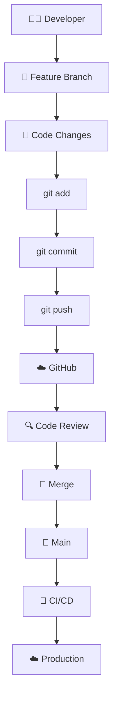

---

# ⭐ 30. KEY TAKEAWAYS

```text
                         🌳 GIT
                           │
              ┌────────────┴────────────┐
              ↓                         ↓
           LOCAL                     REMOTE
              │                         │
              ↓                         ↓
           .git                      GitHub
              │                         │
              ├── add                   │
              ├── commit                │
              │                         │
              └───────────┬─────────────┘
                          ↓
                     🔐 SSH / HTTPS
                          │
                          ↓
                       ☁️ GitHub
                          │
                  ┌───────┼───────┐
                  ↓       ↓       ↓
                Clone   Fetch    Push
                  │       │       │
                  ↓       ↓       ↓
                Local   Update  Upload
```

---

## 💡 REMEMBER

> **Git** manages your source code and its history, while **GitHub** provides a remote platform for hosting and collaboration.

### 📦 Git Clone

`git clone` downloads a repository to your local machine.

### 🍴 GitHub Fork

Fork creates your own copy of another repository on GitHub.

### 🔐 SSH Authentication

SSH authentication uses a private key on your machine and a public key registered with GitHub.

### 🌿 Git Branches

Branches allow developers to work independently and safely merge their changes into the main branch.

---

# 🎯 DAY 06 COMPLETE

<p align="center">

**🌳 Git → ☁️ GitHub → 🔗 Remote → 📦 Clone → 🍴 Fork → 🔐 SSH → 🌿 GitFlow**

<br>

**DAY 06 COMPLETE ✅**

<br>

*Learning DevOps one day, one command and one project at a time. 🚀☁️*

</p>
