<div align="center">

# 🟤 DAY 07 — GIT ADVANCED WORKFLOW & AWS APPLICATION DEPLOYMENT

### 🚀 Advanced Git Operations • Branch Management • Ansible • AWS EC2 • Node.js Deployment

<p>


</p>

**From managing Git changes → handling branches → recovering files → automating configuration → deploying an application on AWS EC2**

</div>

---

# 📚 TODAY'S LEARNING

Today I went deeper into **Git and GitHub workflows** and learned how developers work with branches, changes, history, recovery and collaboration.

I also got introduced to **Ansible Configuration Management** and practiced the basic flow of deploying a **Node.js application on an AWS EC2 instance**.

---

# 🧠 TOPICS COVERED

- 🐧 Linux Basics
- 🌳 Git Initialization
- 📊 Git Status
- ➕ Git Add
- 💾 Git Commit
- 📜 Git Log
- 🔍 Git Diff
- ↩️ Git Restore
- 🗑️ Git Remove
- ♻️ Git Reset
- 🧹 Recovering Deleted Files
- 🌿 Git Branches
- 🔀 Git Checkout
- 🔗 Git Merge
- 🌐 Git Remote
- 📥 Git Fetch
- 🔄 Git Pull
- ⚙️ Git Configuration
- 🤖 Ansible Configuration Management
- ☁️ AWS EC2
- 🟢 Node.js Application
- 📦 npm
- 🚀 Application Deployment

---

# 🐧 01 — LINUX BASICS

Before working with Git and deployment, I practiced basic Linux operations.

### 📁 File & Directory Operations

```bash
mkdir
cd
pwd
touch
ls
```

### 📝 Working With Files

```bash
echo
cat
>
>>
```

### ✏️ Editing Files

```bash
vim
```

Example:

```bash
vim file.txt
```

---

# 🌳 02 — INITIALIZE A GIT REPOSITORY

A Git repository can be created inside a project using:

```bash
git init
```

Then check the repository:

```bash
git status
```

Add files:

```bash
git add .
```

Create a commit:

```bash
git commit -m "Initial commit"
```

View history:

```bash
git log
```

---

# 🔄 GIT BASIC WORKFLOW

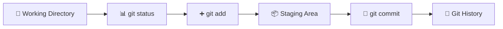

---

# 🌐 03 — REMOTE REPOSITORY

I learned how a local Git repository can be connected to a GitHub repository.

### Create GitHub Repository

Create a repository on GitHub and connect it with the local repository.

```bash
git remote add origin <repository-url>
```

Check the remote:

```bash
git remote -v
```

Push the code:

```bash
git push
```

---

# 💻 LOCAL → GITHUB

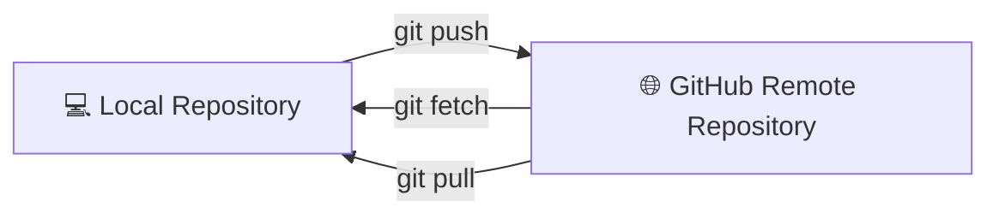

---

# 📦 04 — CLONE A PROJECT

Another developer can download a repository using:

```bash
git clone <repository-url>
```

### Clone Workflow

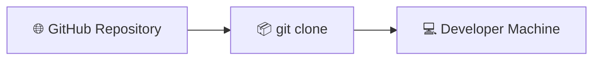

This allows another developer to work on the project separately.

---

# 🌿 05 — GIT BRANCHES

Branches allow developers to work on different features without directly modifying the main branch.

### Create a Branch

```bash
git branch feature
```

### Switch Branch

```bash
git checkout feature
```

or:

```bash
git switch feature
```

### Create + Switch

```bash
git checkout -b feature
```

---

# 🌳 BRANCH WORKFLOW

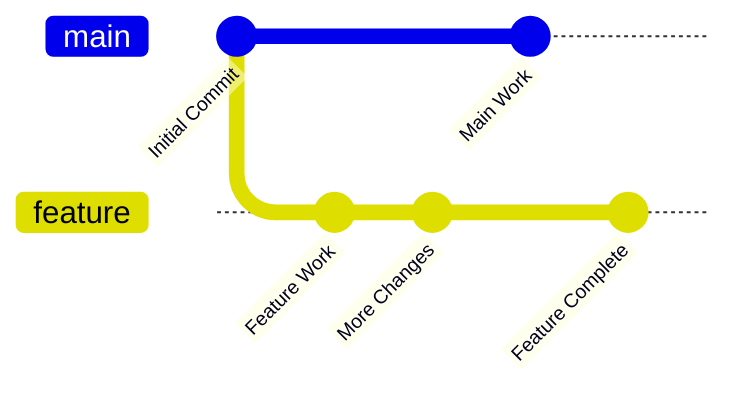

---

# 🔀 06 — MERGE BRANCHES

After completing work on a feature branch, it can be merged into the main branch.

```bash
git checkout main
git merge feature
```

### Merge Flow

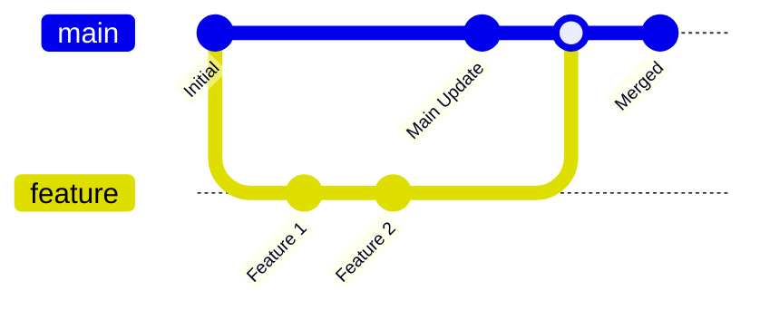

---

# 📥 07 — FETCH VS PULL

## 📥 `git fetch`

```bash
git fetch
```

Fetches changes from the remote repository without directly integrating them into the current branch.

## 🔄 `git pull`

```bash
git pull
```

Gets changes from the remote repository and integrates them into the current branch.

---

# 👥 DEVELOPER COLLABORATION

Example:

- 👨‍💻 Developer 1 pushes changes
- 👩‍💻 Developer 2 fetches changes
- 👩‍💻 Developer 2 checks the changes
- 👩‍💻 Developer 2 pulls the changes

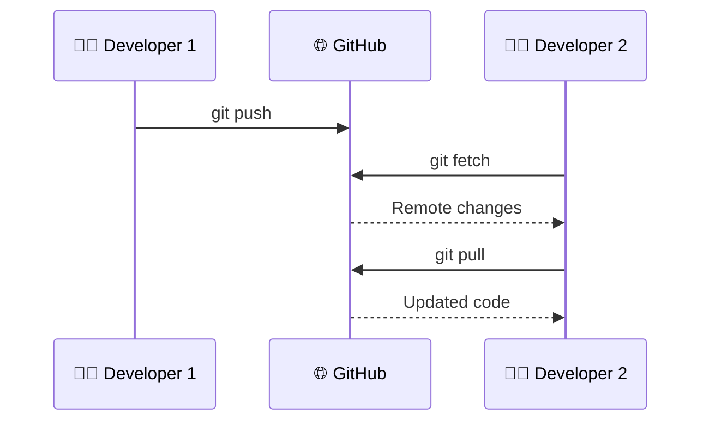

---

# 🔍 08 — GIT DIFF

`git diff` is used to see the changes made to files.

```bash
git diff
```

It helps understand what changed before committing.

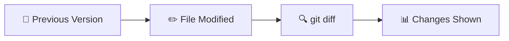

---

# ↩️ 09 — GIT RESTORE

I learned how to restore file changes.

```bash
git restore <file>
```

This can be used when unwanted modifications need to be discarded.

### Example

```bash
git restore file.txt
```

---

# 🗑️ 10 — DELETE & RECOVER FILES

Git also allows files to be removed from the working tree and tracked changes.

```bash
git rm <file>
```

The notes also covered recovery and undo operations using Git.

---

# ♻️ 11 — GIT RESET

`git reset` is used to move the current branch pointer and undo or unstage changes depending on the option used.

Example:

```bash
git reset
```

The important idea learned:

> 🔄 Git provides mechanisms to undo, restore and recover changes instead of permanently losing track of previous work.

---

# 📜 12 — GIT HISTORY

Git history helps us understand what happened to a project.

```bash
git log
```

Useful history-related concepts:

```bash
git log
git log --oneline
```

### History Flow

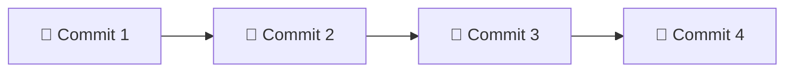

---

# ⚙️ 13 — GIT CONFIGURATION

Git configuration can be used to configure information such as the author's name and email.

Example:

```bash
git config
```

Common configuration:

```bash
git config --global user.name "Your Name"
```

```bash
git config --global user.email "your@email.com"
```

---

# 🤖 14 — ANSIBLE CONFIGURATION MANAGEMENT

I was introduced to **Ansible** as a configuration management and automation tool.

### What I Learned

- ⚙️ Configuration Management
- 🤖 Automation
- 🖥️ Managing servers
- 📦 Installing software
- 📝 Managing configuration
- 🚀 Automating repetitive server tasks

---

# 🏗️ ANSIBLE CONCEPT

Instead of manually configuring every server, Ansible can automate the process.

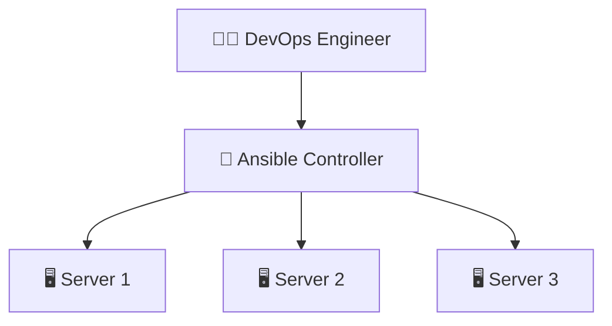

### Manual Approach

```text
Server 1 → Configure manually
Server 2 → Configure manually
Server 3 → Configure manually
```

### Ansible Approach

```text
Ansible
   ↓
Automate configuration
   ↓
Multiple Servers
```

---

# ☁️ 15 — AWS EC2 APPLICATION DEPLOYMENT

I also practiced the basic process of deploying an application to an AWS EC2 instance.

### Deployment Flow

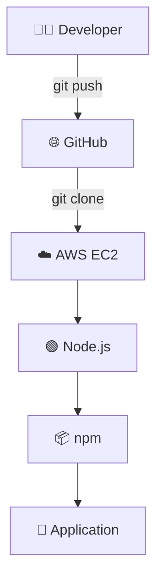

---

# 📦 16 — CLONE APPLICATION TO EC2

After connecting to the EC2 instance:

```bash
git clone <repository-url>
```

Move into the project:

```bash
cd <project-folder>
```

---

# 🟢 17 — NODE.JS APPLICATION SETUP

The notes covered installing the required packages and running the application.

### Update Packages

```bash
sudo apt update
```

### Install npm

```bash
sudo apt install npm
```

### Install Project Dependencies

```bash
npm install
```

### Start Application

```bash
npm run start
```

---

# 🚀 NODE.JS DEPLOYMENT FLOW

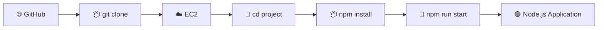

---

# 🔐 18 — EC2 ACCESS & PERMISSIONS

The deployment process also involved working with AWS EC2 access and permissions.

Important concepts:

- ☁️ EC2 instance
- 🔑 SSH access
- 👤 IAM
- 🛡️ Permissions
- 🔐 Security
- 🌐 Application access

---

# 🧩 COMPLETE DAY 07 WORKFLOW

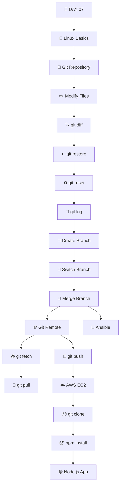

---

# 🏢 FINAL COMPANY SIMULATION

Today I also understood how these concepts can come together in a real development workflow.

### 👨‍💻 Developer 1

- Creates changes
- Creates branch
- Commits changes
- Pushes to remote

### 👩‍💻 Developer 2

- Fetches changes
- Works on another branch
- Pulls remote changes
- Merges changes

### ⚙️ DevOps

- Manages infrastructure
- Automates configuration
- Uses AWS EC2
- Deploys applications

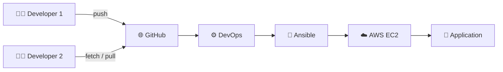

---

# 🧠 KEY TAKEAWAYS

| Concept | What I Learned |
|---|---|
| 🔍 `git diff` | View file changes |
| ↩️ `git restore` | Restore file changes |
| ♻️ `git reset` | Undo / move Git state |
| 📜 `git log` | Understand commit history |
| 🌿 Branches | Work independently |
| 🔀 Merge | Combine branch changes |
| 📥 Fetch | Get remote information |
| 🔄 Pull | Get and integrate remote changes |
| 🌐 Remote | Connect local Git with GitHub |
| 🤖 Ansible | Automate configuration management |
| ☁️ EC2 | Run applications on AWS |
| 📦 npm | Manage Node.js dependencies |
| 🚀 Deployment | Run application on EC2 |

---

# 💻 DAY 07 COMMANDS

## 🐧 Linux

```bash
pwd
ls
cd
mkdir
touch
cat
echo
vim
```

## 🌳 Git

```bash
git init
git status
git add .
git commit -m "message"
git log
git log --oneline
git diff
git restore
git rm
git reset
git branch
git checkout
git switch
git merge
git remote -v
git remote add origin <url>
git push
git fetch
git pull
git clone <url>
```

## ⚙️ Git Configuration

```bash
git config
git config --global user.name "Your Name"
git config --global user.email "your@email.com"
```

## ☁️ AWS / EC2

```bash
sudo apt update
sudo apt install npm
```

## 🟢 Node.js

```bash
npm install
npm run start
```

---

# 🏆 WHAT I UNDERSTAND AFTER DAY 07

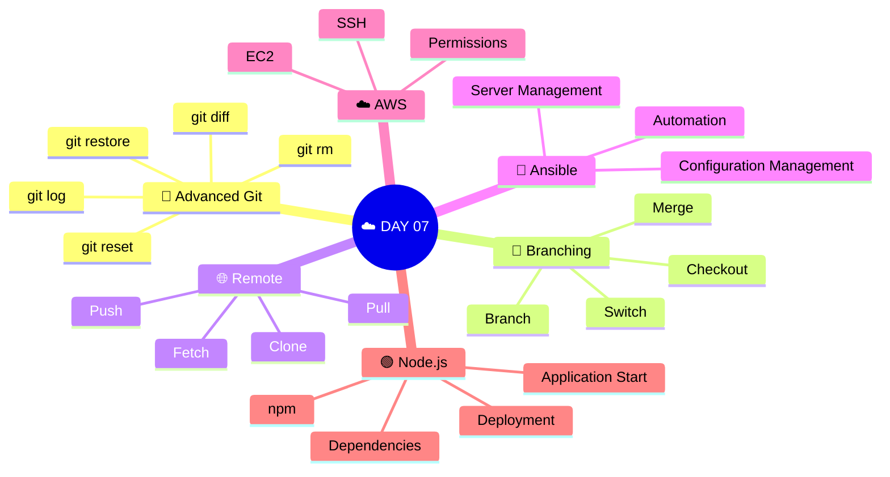

---

<div align="center">

# 🏁 DAY 07 COMPLETE

### 🌳 GIT → 🌿 BRANCHES → 🤖 AUTOMATION → ☁️ AWS → 🚀 DEPLOYMENT

**Learn → Practice → Understand → Automate → Deploy**

</div>
