<div align="center">

## DAY 08 — ANSIBLE & CONFIGURATION MANAGEMENT

### ⚙️ Automate Infrastructure • Manage Servers • Scale Operations

</div>

---

# 🧭 DAY 08 ROADMAP

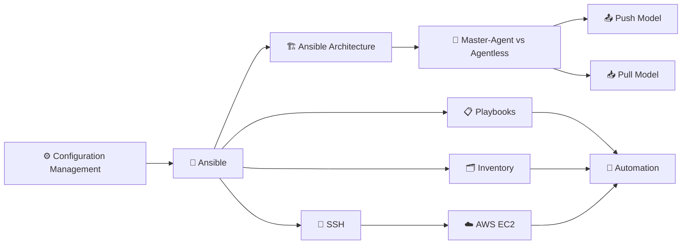

---

# ⚙️ 01 — CONFIGURATION MANAGEMENT

## 📚 What I Learned

**Configuration Management (CM)** is the process of managing the configuration of servers and infrastructure automatically.

Imagine a company has:

```text
🏢 Company
   │
   ├── 🖥️ Server 1
   ├── 🖥️ Server 2
   ├── 🖥️ Server 3
   ├── 🖥️ Server 4
   └── 🖥️ Server 5
```

As infrastructure grows:

```text
5 Servers
    ↓
50 Servers
    ↓
500 Servers
    ↓
1000 Servers
```

Every server may need:

- 🐧 Latest OS updates
- 🔐 Security patches
- 🐳 Docker
- 📦 Git
- ⚙️ Software installation
- 🔧 Configuration updates
- 🚀 Application deployment

Doing all of this manually becomes difficult and time-consuming.

Therefore, we use **Configuration Management**.

---

# ❌ WITHOUT CONFIGURATION MANAGEMENT

Before Configuration Management, an administrator might have to manually connect to every server.

```text
SSH → Server 1 → Install Git
SSH → Server 2 → Install Git
SSH → Server 3 → Install Git
SSH → Server 4 → Install Git
SSH → Server 5 → Install Git
        .
        .
        .
SSH → Server 500 → Install Git
```

### 🚨 Problems

- ⏳ Time-consuming
- 👤 Human errors
- 🔁 Repetitive work
- 📈 Difficult to scale
- 🐛 Different configurations between servers

---

# ✅ WITH CONFIGURATION MANAGEMENT

Instead of manually configuring every server:

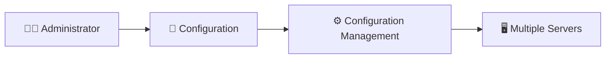

One configuration can be applied across many servers automatically.

---

# 🤖 02 — WHAT IS ANSIBLE?

**Ansible** is an automation and configuration-management tool used to automate tasks across multiple servers.

It can automate:

- 📦 Software installation
- 🔄 Package updates
- ⚙️ Server configuration
- 📁 File management
- 🚀 Application deployment
- 🖥️ Server administration
- 🔐 Remote execution
- 🔁 Repetitive tasks

### 🧠 Simple Definition

> **Ansible allows us to automate the configuration and management of multiple servers from one controller.**

---

# 🏗️ 03 — ANSIBLE ARCHITECTURE

The basic Ansible architecture is:

```text
🤖 Ansible Controller
          ↓
        🔐 SSH
          ↓
   🖥️ Managed Servers
```

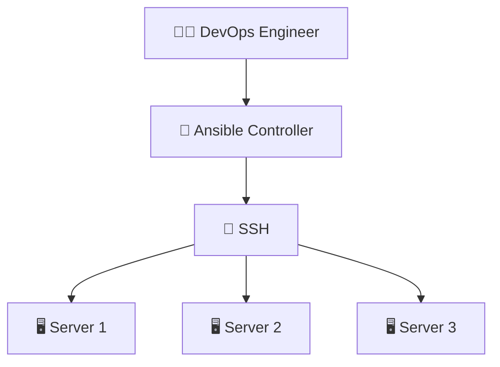

### 🔑 Key Idea

```text
Ansible Controller
        ↓
       SSH
        ↓
Managed Servers
```

---

# 🏢 04 — TRADITIONAL MASTER-AGENT MODEL

Some Configuration Management systems use a **Master-Agent architecture**.

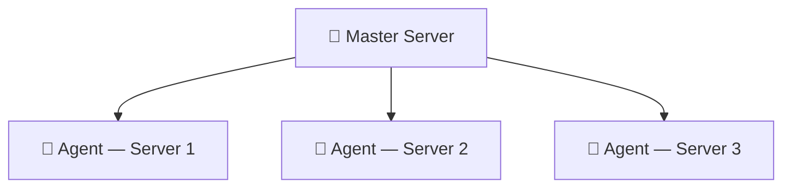

### 📌 How it works

```text
Master Server
      ↓
   Agent 1
   Agent 2
   Agent 3
      ↓
Managed Servers
```

In this model, agent software is installed on the managed servers.

---

# 🤖 05 — ANSIBLE AGENTLESS MODEL

Ansible uses an **agentless approach** for common Linux/Unix management.

Instead of installing an Ansible agent on every server:

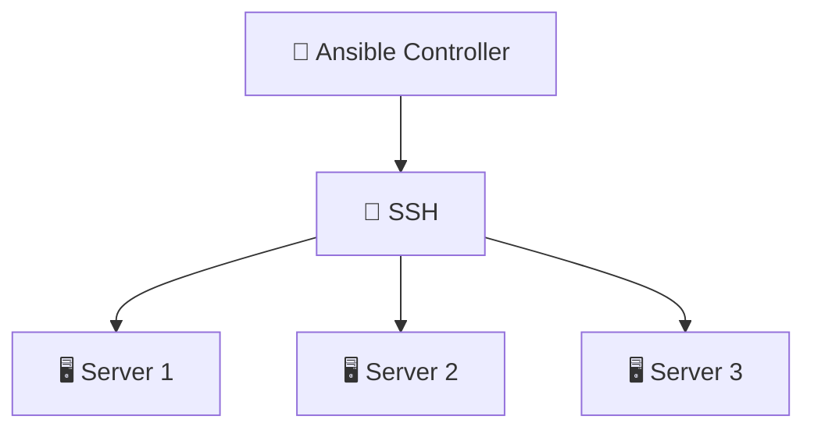

### 🔑 Main Idea

```text
No Ansible Agent
        ↓
Ansible Controller
        ↓
       SSH
        ↓
Managed Servers
```

---

# ⚔️ 06 — MASTER-AGENT VS AGENTLESS

| Feature | 🏢 Master-Agent | 🤖 Ansible Agentless |
|---|---|---|
| Architecture | Master + Agents | Controller + Remote Connection |
| Agent installation | Required | Not required for common SSH-based Linux management |
| Communication | Master ↔ Agents | Controller → SSH → Servers |
| Setup | More components | Simpler |
| Linux management | Agent-based | SSH-based |
| Automation | Yes | Yes |

---

# 📤 07 — PUSH MODEL

In the **Push Model**, the controller pushes configuration and tasks to the managed servers.

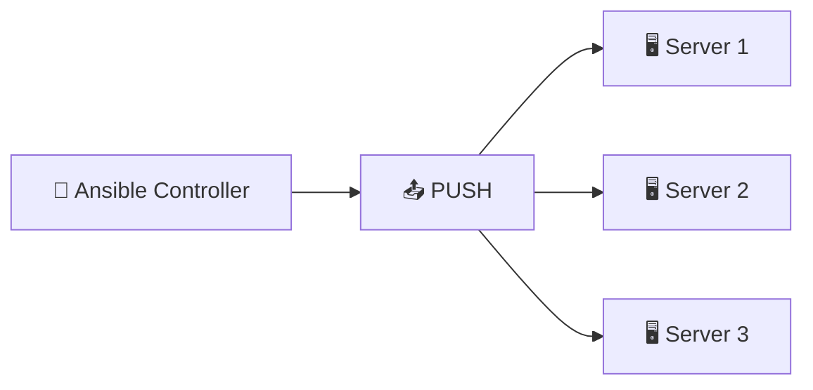

### Example

```text
Controller
     │
     ├── 📤 Install Git → Server 1
     ├── 📤 Install Git → Server 2
     └── 📤 Install Git → Server 3
```

The controller tells the servers what needs to be done.

---

# 📥 08 — PULL MODEL

In the **Pull Model**, managed systems obtain their configuration from a central source.

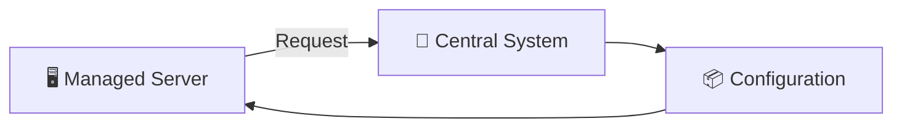

### Simple Difference

```text
📤 PUSH
Controller → Servers

📥 PULL
Servers → Central System
```

---

# 📋 09 — ANSIBLE PLAYBOOK

A **Playbook** contains the tasks that Ansible should perform.

Playbooks are written using **YAML**.

```text
📋 Playbook
     ↓
⚙️ Tasks
     ↓
🤖 Ansible
     ↓
🔐 SSH
     ↓
🖥️ Managed Servers
```

### Example

```yaml
- name: Install Git
  hosts: all

  tasks:
    - name: Install Git
      package:
        name: git
        state: present
```

### 🧠 Remember

**Playbook = What should Ansible do?**

---

# 🗂️ 10 — ANSIBLE INVENTORY

The **Inventory** tells Ansible which servers it needs to manage.

Example:

```ini
[webservers]
server1
server2
server3
```

Or:

```ini
[webservers]
192.168.1.10
192.168.1.11
192.168.1.12
```

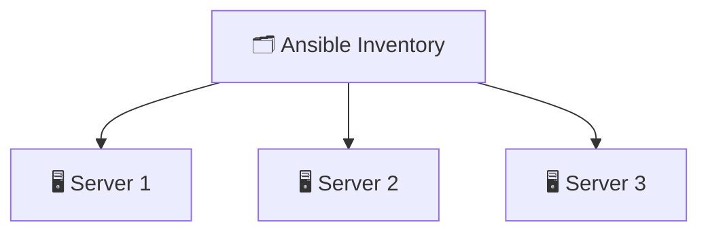

### 🧠 Remember

**Inventory = On which servers should the tasks run?**

---

# 🔄 11 — DYNAMIC INVENTORY

In cloud environments, servers can be created and removed dynamically.

For example:

```text
☁️ AWS
   ↓
🖥️ EC2 Instances
   ↓
➕ New Instances
➖ Removed Instances
   ↓
🔄 Dynamic Inventory
```

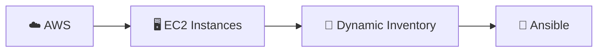

Dynamic inventory helps Ansible work with changing infrastructure.

---

# 🔐 12 — SSH AUTHENTICATION

Ansible commonly uses **SSH** to connect to Linux servers.

```text
🤖 Ansible Controller
          ↓
        🔐 SSH
          ↓
   🖥️ Linux Server
```

SSH keys can be used for authentication.

```text
Client
 ├── 🔑 Private Key
 └── 🔓 Public Key

Server
 └── 🔓 Authorized Public Key
```

### 🔐 Important

The **private key must be kept secure**.

---

# 🔑 13 — PASSWORDLESS SSH

With SSH key-based authentication, Ansible can connect to servers without requiring an interactive password every time.

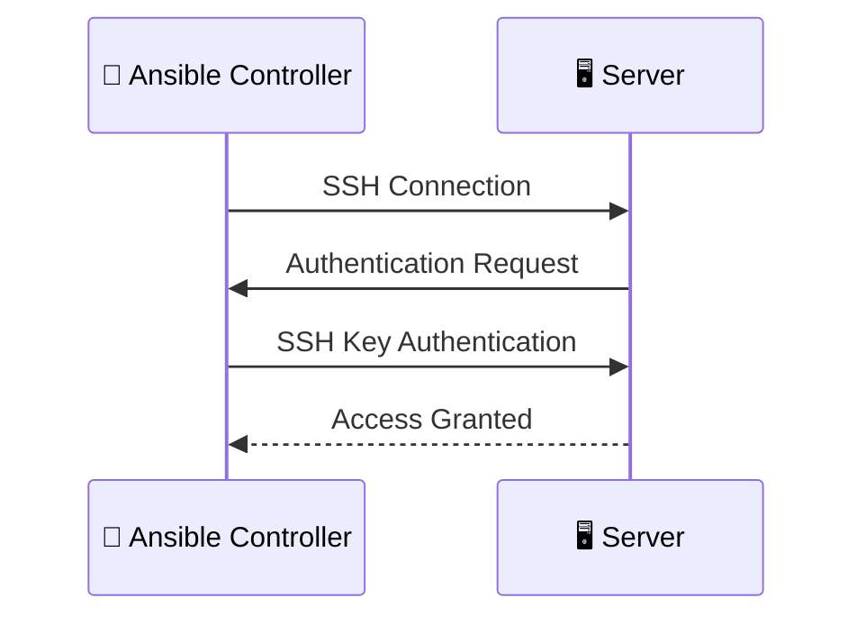

---

# 🐍 14 — ANSIBLE & PYTHON

Ansible is built using **Python** and has a Python-based ecosystem.

Python can also be used for custom modules and automation requirements.

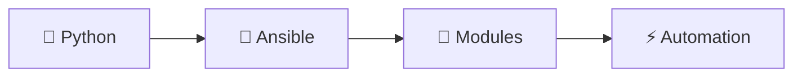

---

# ⚡ 15 — ANSIBLE ADVANTAGES

- ✅ Agentless approach
- ✅ SSH-based Linux management
- ✅ Automation
- ✅ Reusable Playbooks
- ✅ Human-readable YAML
- ✅ Can manage many servers
- ✅ Useful for cloud environments
- ✅ Python-based ecosystem
- ✅ Reduces repetitive manual work
- ✅ Helps maintain consistent configurations

---

# ⚠️ 16 — CHALLENGES

- 🪟 Windows environments may require different connection mechanisms
- 🐛 Failed Playbooks require troubleshooting
- 📈 Large-scale environments can introduce operational and performance challenges
- 🔐 SSH credentials and keys must be handled securely

---

# ☁️ 17 — ANSIBLE WITH AWS EC2

Ansible can be used to automate configuration across EC2 instances.

Imagine:

```text
☁️ AWS
 │
 ├── 🖥️ EC2-1
 ├── 🖥️ EC2-2
 ├── 🖥️ EC2-3
 ├── 🖥️ EC2-4
 └── 🖥️ EC2-5
```

Instead of manually connecting to every instance:

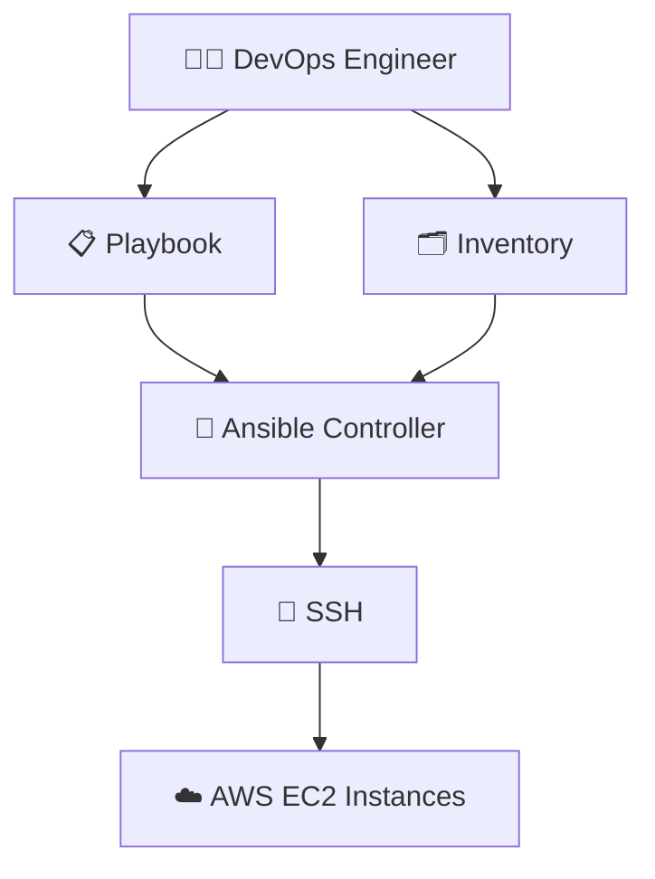

Ansible can automate the configuration across multiple EC2 instances.

---

# 🏢 18 — REAL-WORLD EXAMPLE

Suppose there are **20 EC2 instances**.

Every server needs:

```text
📦 Git
🐳 Docker
🔧 Configuration
📦 Packages
🚀 Application
```

### ❌ Manual Approach

```text
SSH → EC2 #1 → Configure
SSH → EC2 #2 → Configure
SSH → EC2 #3 → Configure
...
SSH → EC2 #20 → Configure
```

### ✅ Ansible Approach

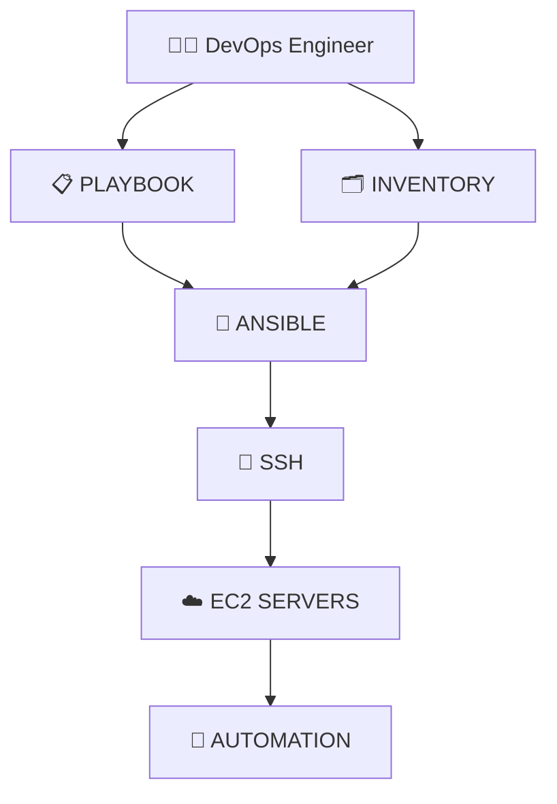

---

# 🔄 19 — COMPLETE ANSIBLE WORKFLOW

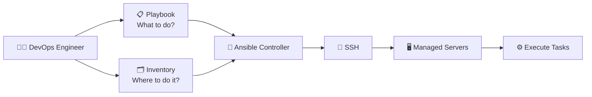

---

# 🧠 20 — THE 3 THINGS TO REMEMBER

```text
📋 PLAYBOOK
     ↓
WHAT should be done?

🗂️ INVENTORY
     ↓
WHERE should it be done?

🔐 SSH
     ↓
HOW does Ansible connect?
```

Together:

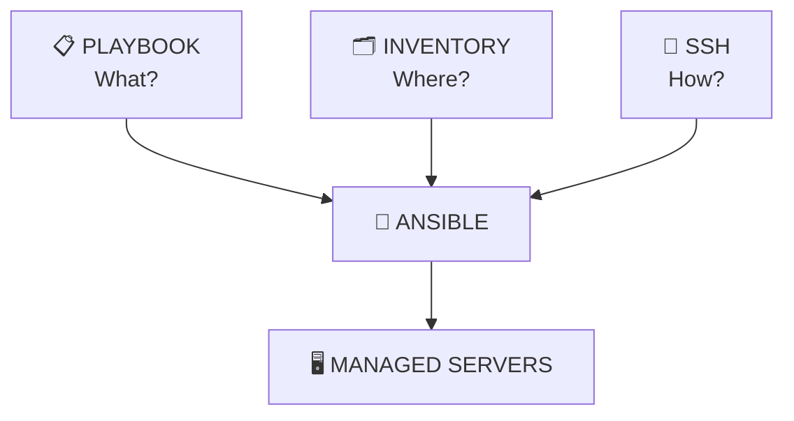

---

# 🏆 DAY 08 — COMPLETE CONCEPT MAP

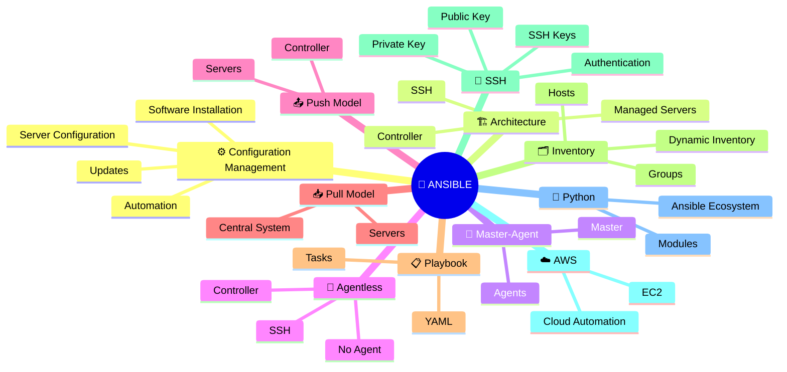

---

# 🔥 DAY 08 IN ONE FLOW

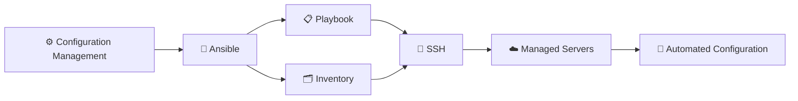

---

<div align="center">

# 🚀 DAY 08 COMPLETE

## 🤖 CONFIGURATION MANAGEMENT → ANSIBLE → PLAYBOOK → INVENTORY → SSH → AUTOMATION

### `LEARN → PRACTICE → AUTOMATE → SCALE`

**☁️ DevOps Cloud Journey**

</div>
