<div align="center">

## DAY 09 — ANSIBLE ROLES, PLAYBOOKS & DEVOPS OPERATIONS

### ⚙️ Reusable Automation • Configuration • Operations • Infrastructure

</div>

---

# 🧭 DAY 09 ROADMAP

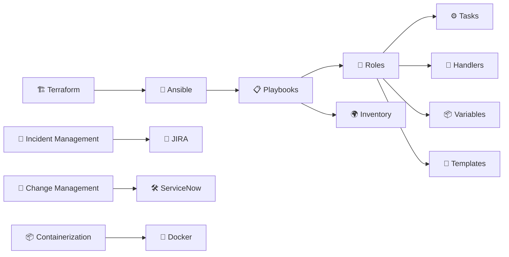

---

# 📚 WHAT I LEARNED

Day 09 focused on moving from basic Ansible automation toward **structured and reusable automation**.

The main concepts covered were:

- 📋 Ansible Playbooks
- 🧩 Ansible Roles
- ⚙️ Tasks
- 🔔 Handlers
- 📦 Variables
- 📝 Templates
- 🗂️ Role directory structure
- 🔄 Reusable automation
- 🌍 Inventory
- 🏗️ Terraform basics
- 🚨 Incident Management
- 🔄 Change Management
- 🎫 JIRA
- 🛠️ ServiceNow
- 📦 Containerization
- 🐳 Docker
- 🔐 Linux permissions, `root` and `sudo`

---

# 🤖 01 — ANSIBLE PLAYBOOKS

A **Playbook** defines what Ansible should do on the target machines.

Example:

```yaml
- hosts: webservers
  roles:
    - nginx
```

A Playbook can call a complete **role** instead of putting every task directly inside one file.

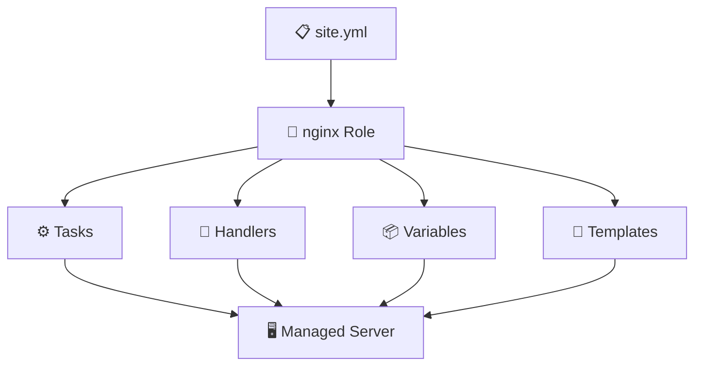

---

# 🧩 02 — WHAT IS AN ANSIBLE ROLE?

An **Ansible Role** is a structured way of organizing automation.

Instead of keeping everything inside one large Playbook, we divide the automation into reusable components.

### Example

```text
Ansible Project
│
├── site.yml
│
└── roles/
    └── nginx/
        ├── tasks/
        ├── handlers/
        ├── vars/
        ├── defaults/
        ├── templates/
        ├── files/
        └── meta/
```

### 🧠 Why Roles?

Roles make automation:

- ♻️ Reusable
- 🧹 Organized
- 📦 Modular
- 📖 Easier to understand
- 🔧 Easier to maintain
- 🚀 Easier to scale

---

# 🏗️ 03 — ANSIBLE ROLE STRUCTURE

A role can contain different directories for different purposes.

```text
roles/
└── nginx/
    │
    ├── tasks/
    │   └── main.yml
    │
    ├── handlers/
    │   └── main.yml
    │
    ├── vars/
    │   └── main.yml
    │
    ├── defaults/
    │   └── main.yml
    │
    ├── templates/
    │
    ├── files/
    │
    └── meta/
```

---

# ⚙️ 04 — TASKS

The `tasks` directory contains the actual work that Ansible should perform.

Example:

```yaml
- name: Install Nginx
  package:
    name: nginx
    state: present

- name: Start Nginx
  service:
    name: nginx
    state: started
```

### 🧠 Task = What work should be performed?

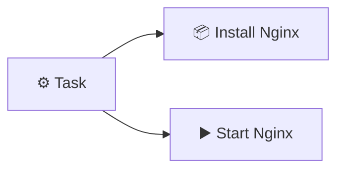

---

# 🔔 05 — HANDLERS

Handlers are tasks that are triggered when something changes.

For example, if an Nginx configuration file changes, we may need to restart Nginx.

```yaml
- name: Update nginx configuration
  template:
    src: nginx.conf.j2
    dest: /etc/nginx/nginx.conf
  notify: Restart nginx
```

Handler:

```yaml
- name: Restart nginx
  service:
    name: nginx
    state: restarted
```

### 🔄 Handler Flow

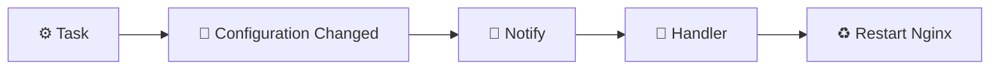

### 🧠 Remember

> A handler normally runs when it is **notified by a changed task**.

---

# 📦 06 — VARIABLES

Variables allow us to store values that can be reused.

Example:

```yaml
nginx_port: 80
```

Variables can be defined inside:

```text
vars/
defaults/
inventory
playbooks
```

Example:

```yaml
- name: Install package
  package:
    name: "{{ package_name }}"
    state: present
```

### 🧠 Variable

```text
Variable
   ↓
Stores a value
   ↓
Can be reused
   ↓
Makes automation flexible
```

---

# 📝 07 — TEMPLATES

Templates allow us to create configuration files dynamically.

Ansible commonly uses **Jinja2 templating**.

Example:

```text
nginx.conf.j2
```

A template can contain variables:

```jinja2
server {
    listen {{ nginx_port }};
}
```

Ansible replaces the variable with its value.

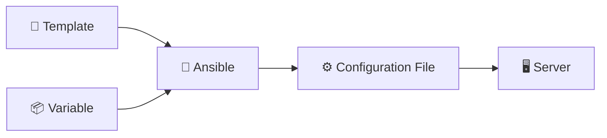

---

# 📁 08 — FILES

The `files/` directory can contain static files that Ansible needs to copy to managed servers.

Example:

```text
roles/
└── nginx/
    └── files/
        └── index.html
```

The file can then be copied to the server using the `copy` module.

---

# ⚙️ 09 — DEFAULTS

The `defaults/` directory contains default variable values for a role.

Example:

```yaml
nginx_port: 80
```

These defaults can be overridden when required.

```text
Default Value
      ↓
Can be overridden
      ↓
Custom Configuration
```

---

# 🧠 10 — ROLE VS PLAYBOOK

| Concept | Purpose |
|---|---|
| 📋 Playbook | Defines the automation flow |
| 🧩 Role | Organizes reusable automation |
| ⚙️ Task | Performs an action |
| 🔔 Handler | Runs when notified |
| 📦 Variable | Stores reusable values |
| 📝 Template | Generates dynamic configuration |
| 📁 Files | Stores static files |
| 🗂️ Inventory | Defines managed hosts |

---

# 🔄 11 — COMPLETE ROLE WORKFLOW

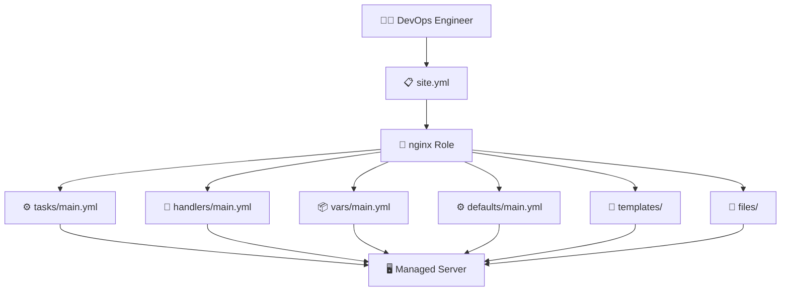

---

# 🛠️ 12 — BUILDING AN NGINX ROLE

A practical example from the learning:

```text
roles/
└── nginx/
    ├── tasks/
    │   └── main.yml
    ├── handlers/
    │   └── main.yml
    ├── vars/
    │   └── main.yml
    ├── defaults/
    │   └── main.yml
    ├── templates/
    └── files/
```

### `tasks/main.yml`

```yaml
- name: Install Nginx
  package:
    name: nginx
    state: present

- name: Start Nginx
  service:
    name: nginx
    state: started
```

### `site.yml`

```yaml
- hosts: webservers
  roles:
    - nginx
```

Run the Playbook:

```bash
ansible-playbook site.yml
```

---

# 🔐 13 — ANSIBLE CONFIGURATION

Ansible can use configuration files to define how it operates.

A common configuration file is:

```text
ansible.cfg
```

The configuration can contain settings related to:

- Inventory
- Remote user
- SSH behavior
- Other Ansible options

Example:

```ini
[defaults]
inventory = inventory
remote_user = ubuntu
```

---

# 🏗️ 14 — TERRAFORM BASICS

Terraform was also introduced as an **Infrastructure as Code** tool.

Terraform is used to define and manage infrastructure using configuration files.

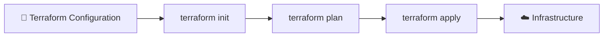

---

# 🧰 15 — TERRAFORM COMMANDS

### Initialize Terraform

```bash
terraform init
```

Initializes the Terraform working directory.

### Validate Configuration

```bash
terraform validate
```

Checks whether the Terraform configuration is valid.

### Plan Changes

```bash
terraform plan
```

Shows what Terraform plans to change.

### Apply Changes

```bash
terraform apply
```

Applies the planned infrastructure changes.

### Destroy Infrastructure

```bash
terraform destroy
```

Removes infrastructure managed by Terraform.

---

# 🔄 16 — TERRAFORM WORKFLOW

```text
📝 Write Configuration
        ↓
terraform init
        ↓
terraform validate
        ↓
terraform plan
        ↓
terraform apply
        ↓
☁️ Infrastructure Created/Updated
```

---

# 🚨 17 — INCIDENT MANAGEMENT

**Incident Management** is the process of responding to unexpected problems that affect services.

Example:

```text
🚨 Server Down
      ↓
Incident Created
      ↓
Investigation
      ↓
Troubleshooting
      ↓
Resolution
      ↓
Service Restored
```

### Example Incident

```text
🚨 Production Server Down
```

The operations team investigates the issue and works toward restoring the service.

---

# 🔄 18 — CHANGE MANAGEMENT

**Change Management** is used to manage planned changes safely.

Example:

```text
🔄 Server Upgrade
```

Instead of making an uncontrolled change:

```text
Plan
 ↓
Review
 ↓
Approval
 ↓
Implement
 ↓
Verify
```

### Example

```text
Server Upgrade
      ↓
Plan the Change
      ↓
Get Approval
      ↓
Perform Upgrade
      ↓
Verify System
```

---

# 🚨 INCIDENT vs 🔄 CHANGE

| Incident Management | Change Management |
|---|---|
| 🚨 Deals with unexpected issues | 🔄 Deals with planned changes |
| Example: Server Down | Example: Server Upgrade |
| Goal: Restore service | Goal: Make change safely |
| Troubleshooting | Planning + approval + implementation |

---

# 🎫 19 — JIRA

**JIRA** was introduced as a tool commonly used by software development teams to manage:

- 📋 Projects
- 📝 Tasks
- 🐛 Issues
- 🔄 Work
- 👥 Team activities

It is mainly associated with software development and project/task management.

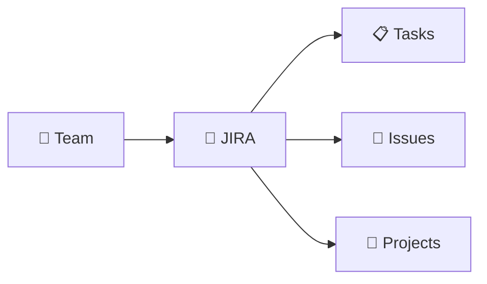

---

# 🛠️ 20 — SERVICENOW

**ServiceNow** was introduced in the context of IT operations and service management.

It can be used to manage:

- 🚨 Incidents
- 🔄 Changes
- 📋 Requests
- 🛠️ IT Operations

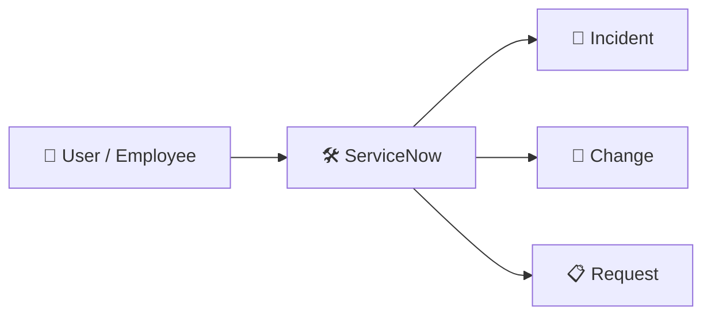

---

# 🆚 21 — JIRA vs SERVICENOW

| Tool | Main Context |
|---|---|
| 🎫 JIRA | Software development, projects, tasks and issues |
| 🛠️ ServiceNow | IT service management, incidents, changes and requests |

---

# 📦 22 — CONTAINERIZATION

**Containerization** is a concept/technology used to package and run applications in isolated environments called containers.

```text
Application
    +
Dependencies
    +
Configuration
       ↓
 📦 Container
```

The notes introduced Docker as a technology that implements containerization.

---

# 🐳 23 — DOCKER

**Docker** is a platform used to build, package and run applications using containers.

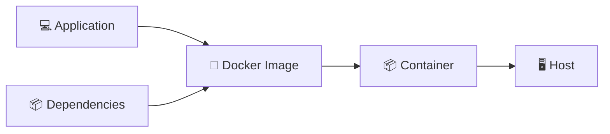

### 🧠 Simple Idea

```text
Docker Image
      ↓
Docker Container
      ↓
Application Runs
```

---

# 🔐 24 — ROOT & SUDO

The notes also covered Linux permissions in the context of Docker and administration.

### Root User

`root` is the Linux superuser with extensive system privileges.

```text
👤 Normal User
      ↓
Limited Permissions

👑 root
      ↓
Administrative Permissions
```

### sudo

`sudo` allows an authorized user to execute commands with elevated privileges.

Example:

```bash
sudo command
```

---

# 🐳 25 — DOCKER & ROOT ACCESS

Docker commonly interacts with privileged system resources.

A user may need appropriate permissions to execute Docker commands.

For example:

```bash
sudo docker ps
```

The notes also discussed granting Docker-related access to a user rather than repeatedly using `sudo`.

Example:

```bash
sudo usermod -aG docker $USER
```

Then the group membership can be refreshed.

```bash
newgrp docker
```

After that:

```bash
docker ps
```

can be used without `sudo` when the user has the required Docker group permissions.

---

# 🔐 26 — SECURITY NOTE

Giving users access to Docker can provide significant privileges because Docker interacts closely with the host system.

Therefore:

```text
Docker Access
      ↓
Powerful Privileges
      ↓
🔐 Must be handled carefully
```

---

# 🔗 27 — HOW THESE CONCEPTS CONNECT

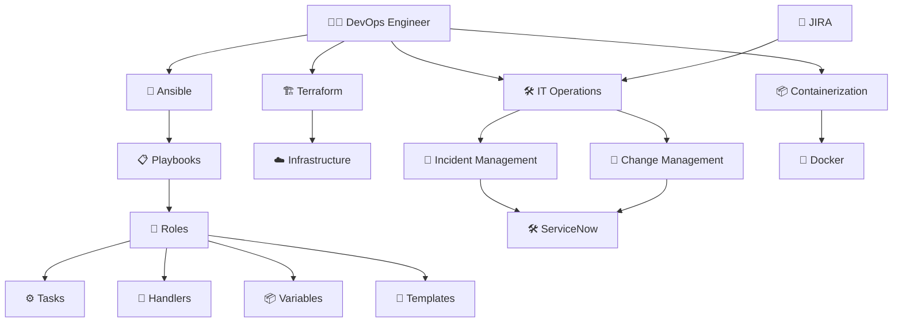

---

# 🧠 28 — DAY 09 QUICK REVISION

```text
🤖 ANSIBLE
    ↓
📋 PLAYBOOK
    ↓
🧩 ROLE
    ↓
⚙️ TASKS
    ↓
🔔 HANDLERS
    ↓
📦 VARIABLES
    ↓
📝 TEMPLATES
    ↓
🖥️ MANAGED SERVER
```

```text
🏗️ TERRAFORM
    ↓
📝 Configuration
    ↓
terraform init
    ↓
terraform validate
    ↓
terraform plan
    ↓
terraform apply
    ↓
☁️ Infrastructure
```

```text
🚨 INCIDENT
    ↓
Investigate
    ↓
Troubleshoot
    ↓
Resolve
    ↓
Service Restored
```

```text
🔄 CHANGE
    ↓
Plan
    ↓
Approval
    ↓
Implementation
    ↓
Verification
```

```text
📦 CONTAINERIZATION
        ↓
🐳 DOCKER
        ↓
📦 CONTAINER
        ↓
💻 APPLICATION
```

---

# 🏆 DAY 09 — KEY TAKEAWAYS

- 🤖 Ansible automates configuration and server management.
- 📋 Playbooks define automation workflows.
- 🧩 Roles organize automation into reusable components.
- ⚙️ Tasks perform specific actions.
- 🔔 Handlers respond to changes through notifications.
- 📦 Variables make automation flexible.
- 📝 Templates generate dynamic configuration files.
- 🗂️ Role structure makes projects easier to maintain.
- 🏗️ Terraform provides Infrastructure as Code.
- 🚨 Incident Management handles unexpected service problems.
- 🔄 Change Management handles planned changes safely.
- 🎫 JIRA is commonly used for software/project work.
- 🛠️ ServiceNow is commonly used for IT service management.
- 📦 Containerization packages applications into isolated environments.
- 🐳 Docker implements container-based application deployment.
- 🔐 `root` and `sudo` provide elevated Linux privileges.

---

<div align="center">

# 🚀 DAY 09 COMPLETE

### 🤖 ANSIBLE ROLES → 📋 PLAYBOOKS → ⚙️ AUTOMATION → 🏗️ TERRAFORM → 🛠️ OPERATIONS → 🐳 CONTAINERS

## `LEARN → AUTOMATE → MANAGE → SCALE`

### ☁️ DEVOPS CLOUD JOURNEY

</div>
