<div align="center">

## DAY 12 — DOCKER CLI, DAEMON & PERMISSIONS

### 🚀 Docker CLI → Docker Daemon → Docker Resources → Permissions

</div>

---

# 🐳 01 — DOCKER CLI

**Docker CLI (Command Line Interface)** is the tool used by users and DevOps engineers to communicate with Docker.

It allows us to perform Docker operations using commands.

### 📌 Common Docker CLI Commands

```bash
docker --version
docker ps
docker ps -a
docker images
docker pull ubuntu
docker run ubuntu
docker start <container_id>
docker stop <container_id>
docker rm <container_id>
docker rmi <image_id>
docker network ls
docker volume ls
```

### 🔄 Basic Flow

```text
👤 USER
   │
   │ Docker Command
   ▼
💻 DOCKER CLI
   │
   │ Request
   ▼
🐳 DOCKER DAEMON
   │
   ├── 🖼️ Images
   ├── 📦 Containers
   ├── 🌐 Networks
   └── 💾 Volumes
```

### 🔷 Docker CLI Architecture

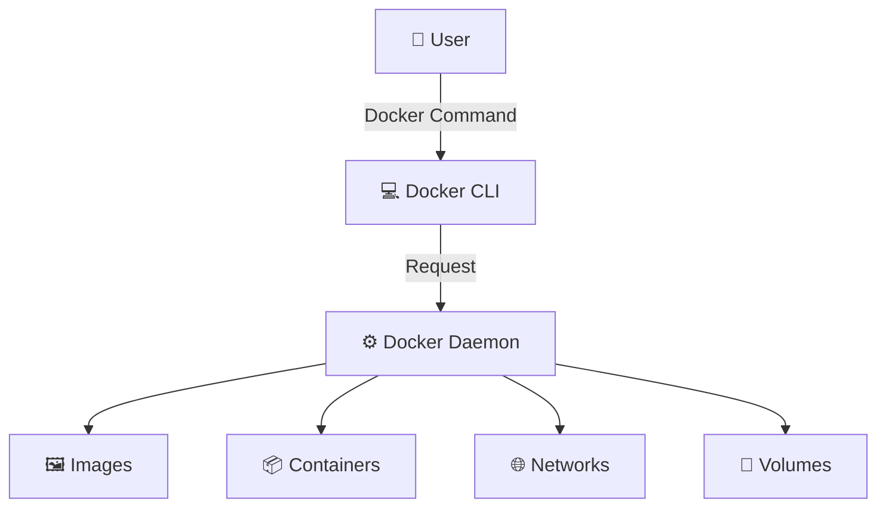

---

# ⚙️ 02 — DOCKER DAEMON

The **Docker Daemon** is the background service that manages Docker resources and executes Docker operations.

It is commonly represented as:

```text
dockerd
```

### 📌 Docker Daemon Responsibilities

* Creates containers
* Starts containers
* Stops containers
* Removes containers
* Builds images
* Pulls images
* Manages networks
* Manages volumes
* Communicates with Docker registries

### 🔄 Docker CLI → Docker Daemon

```text
💻 Docker CLI
      │
      │ Request
      ▼
⚙️ Docker Daemon
      │
      ├── 🖼️ Images
      ├── 📦 Containers
      ├── 🌐 Networks
      └── 💾 Volumes
```

### 🔷 Docker Daemon

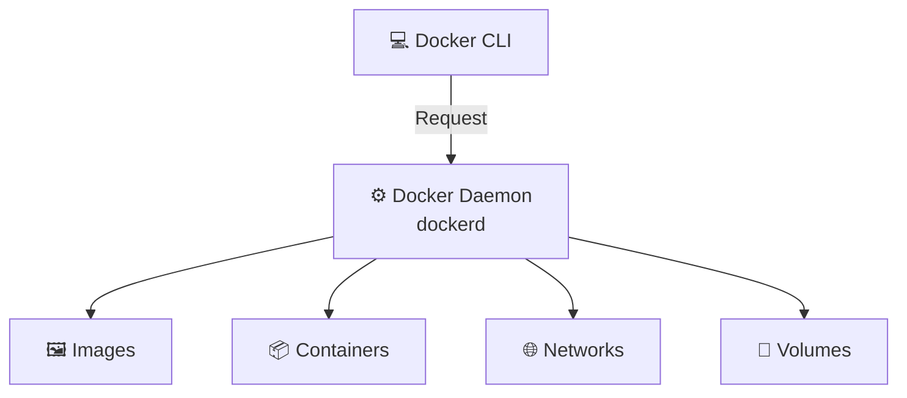

### 🧠 Simple Example

When we execute:

```bash
docker run ubuntu
```

The command is given to the **Docker CLI**.

The Docker CLI communicates with the **Docker Daemon**.

The Docker Daemon then checks the required image and creates/runs the container.

### 🔷 `docker run ubuntu`

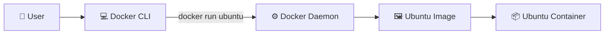

---

# 🧩 03 — DOCKER RESOURCES

The Docker Daemon manages important Docker resources.

```text
🐳 Docker Daemon
       │
       ▼
Docker Resources
       │
       ├── 🖼️ Images
       ├── 📦 Containers
       ├── 🌐 Networks
       └── 💾 Volumes
```

### 🔷 Docker Resources

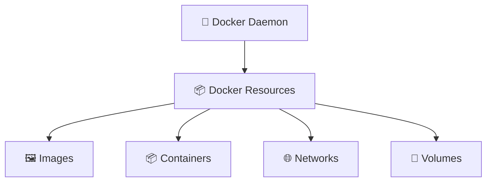

---

## 🖼️ Docker Images

A **Docker image** is a read-only template used to create containers.

Images contain:

* Application code
* Required dependencies
* Libraries
* Configuration
* Required filesystem structure

### Command

```bash
docker images
```

This displays the Docker images available locally.

---

## 📦 Docker Containers

A **container** is a running or stopped instance of a Docker image.

### Relationship

```text
🖼️ Docker Image
       │
       │ docker run
       ▼
📦 Docker Container
```

### 🔷 Image to Container

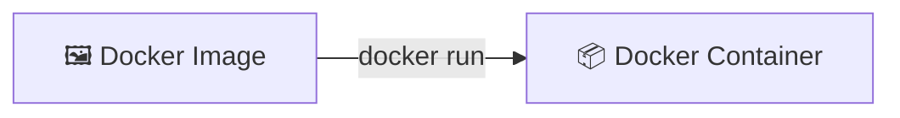

Example:

```bash
docker run ubuntu
```

```text
ubuntu image
     ↓
ubuntu container
```

---

## 🌐 Docker Networks

Docker networks allow containers to communicate with:

* Other containers
* The host
* External networks

### Command

```bash
docker network ls
```

### 🔷 Docker Network

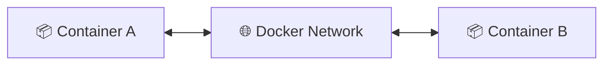

---

## 💾 Docker Volumes

Docker volumes are used for persistent storage.

They allow data to exist independently from the container lifecycle.

### Command

```bash
docker volume ls
```

### 🔷 Docker Volume

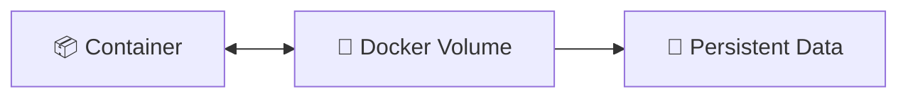

---

# 🔐 04 — DOCKER PERMISSION

Sometimes Docker commands may fail because the current user does not have permission to communicate with the Docker daemon.

### Example

```bash
docker ps
```

If permission is denied, Docker may return an error related to access to the Docker daemon.

### ❌ Example Situation

```text
User
  ↓
docker ps
  ↓
Docker Daemon
  ↓
❌ Permission Denied
```

### 🔷 Permission Denied

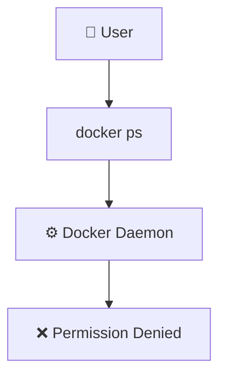

### ✅ Temporary Solution

Run the command using `sudo`:

```bash
sudo docker ps
```

Other examples:

```bash
sudo docker images
sudo docker run ubuntu
sudo docker pull ubuntu
```

### 🔷 Using sudo

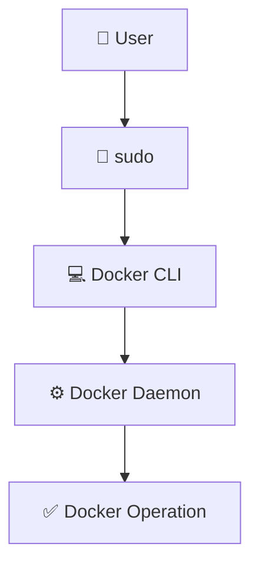

---

# 👥 05 — DOCKER GROUP

Instead of using `sudo` for every Docker command, a user can be added to the **docker group**.

### Add Current User to Docker Group

```bash
sudo usermod -aG docker $USER
```

### Apply the Group Change

```bash
newgrp docker
```

Then test:

```bash
docker ps
```

If the user has the required permissions, Docker commands can now be executed without `sudo`.

### 🔄 Permission Flow

```text
👤 USER
   │
   │ docker ps
   ▼
🐳 Docker Daemon
   │
   │ Permission Check
   ▼
👥 docker GROUP
   │
   ▼
✅ Docker Operation
```

### 🔷 Docker Group Permission

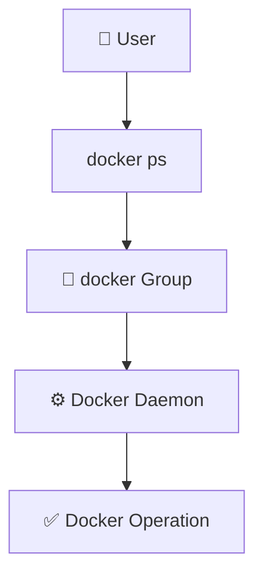

### 🧠 Important Commands

```bash
sudo usermod -aG docker $USER
newgrp docker
docker ps
```

> ⚠️ **Security Note:** Membership in the Docker group grants powerful access to the Docker daemon and should be treated as privileged access.

---

# 📥 06 — DOCKER PULL

`docker pull` is used to download an image from a Docker registry.

### Syntax

```bash
docker pull <image>
```

### Example

```bash
docker pull ubuntu
```

### Flow

```text
💻 Docker CLI
      │
      │ docker pull ubuntu
      ▼
🐳 Docker Daemon
      │
      ▼
📦 Docker Registry
      │
      │ Download Image
      ▼
💻 Local Docker Host
      │
      ▼
🖼️ Ubuntu Image
```

### 🔷 Docker Pull

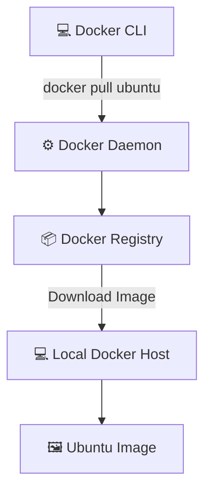

### 🧠 Simple Explanation

A Docker registry is like a warehouse containing Docker images.

When we run:

```bash
docker pull ubuntu
```

Docker downloads the Ubuntu image from the registry and stores it locally.

---

# ▶️ 07 — DOCKER RUN

`docker run` is used to create and start a container from an image.

### Syntax

```bash
docker run <image>
```

### Example

```bash
docker run ubuntu
```

### Basic Flow

```text
docker run ubuntu
        │
        ▼
   Docker CLI
        │
        ▼
   Docker Daemon
        │
        ▼
 Check Ubuntu Image
        │
   ┌────┴────┐
   │         │
   ▼         ▼
 Exists   Not Exists
   │         │
   │         ▼
   │     Pull Image
   │         │
   └────┬────┘
        ▼
 Create Container
        │
        ▼
 Start Container
```

### 🔷 `docker run`

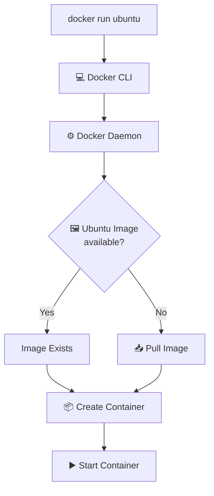

### 🧠 Important

If the image is already available locally, Docker can use it directly.

If the image is not available locally, Docker may pull it from a registry before creating the container.

---

# 🔎 08 — DOCKER PS

The `docker ps` command displays currently running containers.

```bash
docker ps
```

To display all containers, including stopped containers:

```bash
docker ps -a
```

### Difference

| Command        | Purpose                  |
| -------------- | ------------------------ |
| `docker ps`    | Shows running containers |
| `docker ps -a` | Shows all containers     |

### 🔷 Container Listing

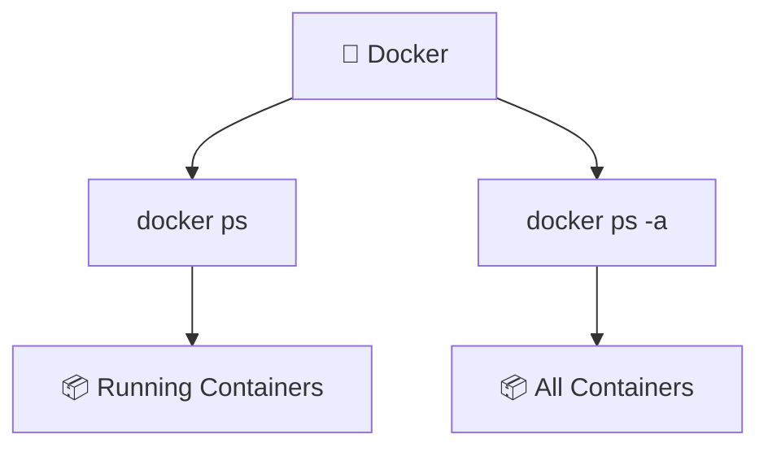

---

# 🛑 09 — DOCKER STOP

Used to stop a running container.

### Syntax

```bash
docker stop <container_id>
```

### Example

```bash
docker stop mycontainer
```

### 🔷 Stop Container

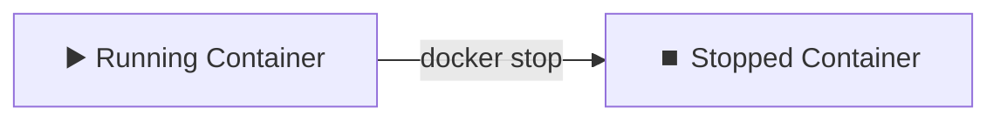

---

# ▶️ 10 — DOCKER START

Used to start an existing stopped container.

### Syntax

```bash
docker start <container_id>
```

### Example

```bash
docker start mycontainer
```

### 🔷 Start Container

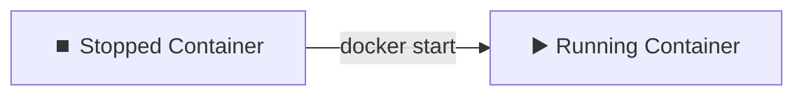

---

# 🗑️ 11 — DOCKER RM

Used to remove a container.

### Syntax

```bash
docker rm <container_id>
```

### Example

```bash
docker rm mycontainer
```

A running container normally needs to be stopped before removing it.

### 🔷 Remove Container

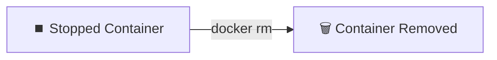

---

# 🗑️ 12 — DOCKER RMI

Used to remove a Docker image.

### Syntax

```bash
docker rmi <image_id>
```

### Example

```bash
docker rmi ubuntu
```

### 🔷 Remove Image

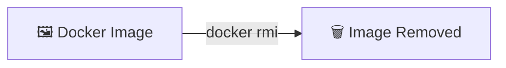

---

# 🖼️ 13 — DOCKER IMAGES

Used to list Docker images stored locally.

```bash
docker images
```

### Image Lifecycle

```text
📦 Docker Registry
       │
       │ docker pull
       ▼
💻 Local Docker Host
       │
       ▼
🖼️ Docker Image
       │
       │ docker run
       ▼
📦 Docker Container
```

### 🔷 Image Lifecycle

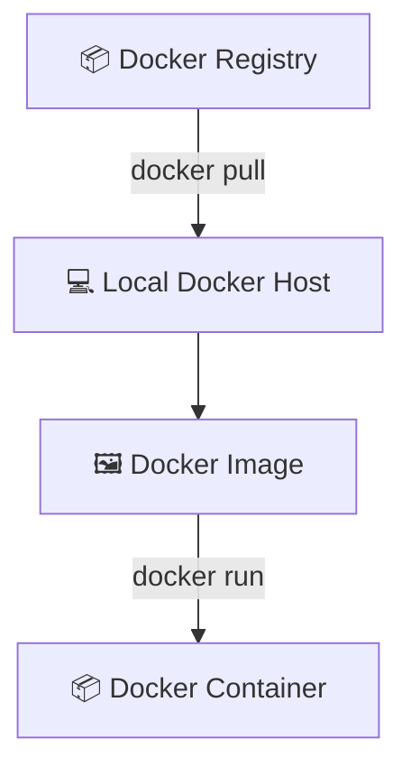

---

# 🗃️ 14 — DOCKER NETWORK LS

Used to list Docker networks.

```bash
docker network ls
```

Docker networks provide communication between containers and other network endpoints.

### 🔷 Docker Network


---

# 💾 15 — DOCKER VOLUME LS

Used to list Docker volumes.

```bash
docker volume ls
```

Volumes are useful when application data needs to persist even when containers are removed.

### 🔷 Persistent Storage


---

# 🏗️ 16 — DOCKER BUILD

`docker build` is used to create a Docker image from a Dockerfile.

### Example

```bash
docker build -t my-first-image .
```

### Flow

```text
📄 Dockerfile
      │
      │ docker build
      ▼
🐳 Docker Daemon
      │
      ▼
🖼️ Docker Image
```

### 🔷 Docker Build

```mermaid
flowchart TD
    DF["📄 Dockerfile"]
    CLI["💻 Docker CLI"]
    D["⚙️ Docker Daemon"]
    I["🖼️ Docker Image"]

    DF -->|"Build Context"| CLI
    CLI -->|"docker build"| D
    D --> I
```

---

# 🔄 17 — COMPLETE DOCKER IMAGE → CONTAINER FLOW

```text
📄 Dockerfile
      │
      │ docker build
      ▼
🖼️ Docker Image
      │
      │ docker run
      ▼
📦 Docker Container
```

### 🔷 Image → Container

```mermaid
flowchart LR
    DF["📄 Dockerfile"]
    I["🖼️ Docker Image"]
    C["📦 Docker Container"]

    DF -->|"docker build"| I
    I -->|"docker run"| C
```

---

# 🌐 18 — DOCKER REGISTRY

A **Docker Registry** is a storage and distribution system for container images.

It stores Docker images and allows users or systems to push and pull images.

### Flow

```text
💻 Docker Host
      │
      │ docker pull
      ▼
📦 Docker Registry
      │
      ▼
🖼️ Docker Image
```

### 🔷 Registry Workflow

```mermaid
flowchart LR
    H["💻 Docker Host"]
    R["📦 Docker Registry"]
    I["🖼️ Docker Image"]

    H -->|"docker pull"| R
    R --> I
```

---

# ☁️ 19 — DOCKER HUB

**Docker Hub** is a public registry used to store and share Docker images.

For example:

```bash
docker pull ubuntu
```

The Ubuntu image can be obtained from a Docker registry such as Docker Hub.

### 🔷 Docker Hub

```mermaid
flowchart LR
    U["👤 User"]
    CLI["💻 Docker CLI"]
    D["⚙️ Docker Daemon"]
    HUB["🌐 Docker Hub"]
    I["🖼️ Ubuntu Image"]

    U --> CLI
    CLI --> D
    D -->|"docker pull ubuntu"| HUB
    HUB --> I
```

---

# 🔄 20 — DOCKER CLI → DAEMON → RESOURCES

```text
                         👤 USER
                           │
                           │ Docker Command
                           ▼
                    💻 DOCKER CLI
                           │
                           │ Request
                           ▼
                    ⚙️ DOCKER DAEMON
                           │
          ┌────────────────┼────────────────┐
          │                │                │
          ▼                ▼                ▼
      🖼️ IMAGES       📦 CONTAINERS     🌐 NETWORKS
                                             │
                                             ▼
                                         💾 VOLUMES
```

### 🔷 Complete Docker Architecture

```mermaid
flowchart TD
    U["👤 USER"]
    CLI["💻 DOCKER CLI"]
    D["⚙️ DOCKER DAEMON"]

    U -->|"Docker Command"| CLI
    CLI -->|"Request"| D

    D --> I["🖼️ IMAGES"]
    D --> C["📦 CONTAINERS"]
    D --> N["🌐 NETWORKS"]
    D --> V["💾 VOLUMES"]
```

---

# 🧠 21 — DOCKER IN SIMPLE WORDS

Think of Docker like a restaurant.

```text
👤 User
   ↓
Docker CLI
   ↓
Restaurant Counter
   ↓
Docker Daemon
   ↓
Kitchen
   ↓
Docker Resources
```

### 🍽️ Mapping

| Docker Concept   | Simple Example                 |
| ---------------- | ------------------------------ |
| Docker CLI       | Person placing an order        |
| Docker Daemon    | Kitchen managing the order     |
| Dockerfile       | Recipe instructions            |
| Docker Image     | Recipe/template                |
| Docker Registry  | Recipe warehouse               |
| Docker Container | Prepared dish                  |
| Docker Network   | Communication between kitchens |
| Docker Volume    | Storage for persistent data    |

### 🔷 Docker Restaurant Analogy

```mermaid
flowchart LR
    U["👤 User"]
    CLI["💻 Docker CLI<br/>Order Counter"]
    D["⚙️ Docker Daemon<br/>Kitchen"]
    R["📦 Docker Resources<br/>Prepared Output"]

    U --> CLI
    CLI --> D
    D --> R
```

---

# 🔥 22 — IMPORTANT DOCKER COMMANDS

| Command                  | Purpose                      |
| ------------------------ | ---------------------------- |
| `docker --version`       | Check Docker version         |
| `docker ps`              | Show running containers      |
| `docker ps -a`           | Show all containers          |
| `docker images`          | Show local images            |
| `docker pull ubuntu`     | Download Ubuntu image        |
| `docker run ubuntu`      | Create and start a container |
| `docker start <id>`      | Start a stopped container    |
| `docker stop <id>`       | Stop a running container     |
| `docker rm <id>`         | Remove a container           |
| `docker rmi <id>`        | Remove an image              |
| `docker network ls`      | List Docker networks         |
| `docker volume ls`       | List Docker volumes          |
| `docker build -t name .` | Build an image               |

---

# 🎯 23 — COMPLETE DOCKER WORKFLOW

```text
                  📄 Dockerfile
                       │
                       │ docker build
                       ▼
                  🖼️ Docker Image
                       │
                       │ docker run
                       ▼
                  📦 Container
                       │
              ┌────────┼────────┐
              │        │        │
              ▼        ▼        ▼
           Network   Volume   Application
```

### 🔷 Docker Build & Run Workflow

```mermaid
flowchart TD
    DF["📄 Dockerfile"]
    I["🖼️ Docker Image"]
    C["📦 Container"]

    DF -->|"docker build"| I
    I -->|"docker run"| C

    C --> N["🌐 Network"]
    C --> V["💾 Volume"]
    C --> A["🚀 Application"]
```

### Registry Workflow

```text
👤 User
  │
  ▼
💻 Docker CLI
  │
  ▼
⚙️ Docker Daemon
  │
  ▼
📦 Docker Registry
  │
  │ docker pull
  ▼
🖼️ Image
  │
  │ docker run
  ▼
📦 Container
```

### 🔷 Registry to Container

```mermaid
flowchart TD
    U["👤 User"]
    CLI["💻 Docker CLI"]
    D["⚙️ Docker Daemon"]
    R["📦 Docker Registry"]
    I["🖼️ Docker Image"]
    C["📦 Docker Container"]

    U --> CLI
    CLI --> D
    D -->|"docker pull"| R
    R --> I
    I -->|"docker run"| C
```

---

# 🔥 24 — INTERVIEW-READY QUESTIONS

## ❓ What is Docker CLI?

**Docker CLI is the command-line interface used to communicate with Docker and perform Docker operations.**

---

## ❓ What is Docker Daemon?

**Docker Daemon is the background service that manages Docker resources and executes Docker operations.**

---

## ❓ What is `dockerd`?

**`dockerd` is the Docker daemon process.**

---

## ❓ What happens when we run `docker run ubuntu`?

```text
docker run ubuntu
       ↓
Docker CLI
       ↓
Docker Daemon
       ↓
Check Ubuntu Image
       ↓
Image available?
   ↓          ↓
 Yes          No
   ↓          ↓
Create      Pull Image
Container      ↓
   │       Create Container
   └───────────┘
        ↓
Container
```

### 🔷 `docker run ubuntu`

```mermaid
flowchart TD
    CMD["docker run ubuntu"]
    CLI["💻 Docker CLI"]
    D["⚙️ Docker Daemon"]
    CHECK{"🖼️ Image Available?"}
    YES["✅ Use Local Image"]
    NO["📥 Pull Image"]
    CREATE["📦 Create Container"]
    RUN["▶️ Start Container"]

    CMD --> CLI
    CLI --> D
    D --> CHECK
    CHECK -->|"Yes"| YES
    CHECK -->|"No"| NO
    YES --> CREATE
    NO --> CREATE
    CREATE --> RUN
```

---

## ❓ What is Docker Hub?

**Docker Hub is a public registry used to store and share Docker images.**

---

## ❓ What is a Docker Registry?

**A Docker Registry is a storage and distribution system for container images.**

---

## ❓ Why does `docker ps` sometimes show permission denied?

Because the current user may not have permission to communicate with the Docker daemon.

A temporary solution is:

```bash
sudo docker ps
```

Another approach is adding the user to the Docker group:

```bash
sudo usermod -aG docker $USER
newgrp docker
```

---

## ❓ What is the difference between `docker ps` and `docker ps -a`?

```text
docker ps
   ↓
Shows running containers

docker ps -a
   ↓
Shows all containers
```

---

## ❓ What is the difference between an image and a container?

```text
🖼️ Image
   ↓
Template

📦 Container
   ↓
Running/created instance of an image
```

---

## ❓ What is `docker pull`?

**`docker pull` downloads a Docker image from a registry to the local Docker host.**

Example:

```bash
docker pull ubuntu
```

---

## ❓ What is `docker build`?

**`docker build` creates a Docker image using a Dockerfile and build context.**

Example:

```bash
docker build -t my-image .
```

---

# 🧩 25 — KEY CONCEPTS TO REMEMBER

```text
🐳 Docker
   ↓
Containerization Platform
   ↓
💻 Docker CLI
   ↓
⚙️ Docker Daemon
   ↓
┌───────────────┬───────────────┬───────────────┬───────────────┐
│               │               │               │
🖼️ Images     📦 Containers   🌐 Networks    💾 Volumes
```

### 🔷 Docker Core Architecture

```mermaid
flowchart TD
    D["🐳 Docker"]
    D --> P["📦 Containerization Platform"]
    P --> CLI["💻 Docker CLI"]
    CLI --> DAEMON["⚙️ Docker Daemon"]

    DAEMON --> I["🖼️ Images"]
    DAEMON --> C["📦 Containers"]
    DAEMON --> N["🌐 Networks"]
    DAEMON --> V["💾 Volumes"]
```

### ⭐ Most Important Relationship

```text
📄 Dockerfile
      ↓
🖼️ Docker Image
      ↓
📦 Docker Container
```

### 🔷 Image Lifecycle

```mermaid
flowchart LR
    DF["📄 Dockerfile"]
    I["🖼️ Docker Image"]
    C["📦 Docker Container"]

    DF -->|"docker build"| I
    I -->|"docker run"| C
```

### ⭐ Communication

```text
👤 User
   ↓
💻 Docker CLI
   ↓
⚙️ Docker Daemon
   ↓
🐳 Docker Resources
```

### 🔷 Communication Flow

```mermaid
flowchart TD
    U["👤 User"]
    CLI["💻 Docker CLI"]
    D["⚙️ Docker Daemon"]
    R["🐳 Docker Resources"]

    U --> CLI
    CLI --> D
    D --> R
```

### ⭐ Registry

```text
💻 Docker CLI
      ↓
⚙️ Docker Daemon
      ↓
📦 Docker Registry
      ↓
🖼️ Docker Image
      ↓
💻 Local Machine
```

### 🔷 Registry Flow

```mermaid
flowchart TD
    CLI["💻 Docker CLI"]
    D["⚙️ Docker Daemon"]
    R["📦 Docker Registry"]
    I["🖼️ Docker Image"]
    H["💻 Local Machine"]

    CLI --> D
    D --> R
    R --> I
    I --> H
```

---

# 📚 26 — DAY 12 COMMAND CHEAT SHEET

```bash
# Check Docker version
docker --version

# Show running containers
docker ps

# Show all containers
docker ps -a

# Show images
docker images

# Pull an image
docker pull ubuntu

# Run a container
docker run ubuntu

# Start a container
docker start <container_id>

# Stop a container
docker stop <container_id>

# Remove a container
docker rm <container_id>

# Remove an image
docker rmi <image_id>

# List networks
docker network ls

# List volumes
docker volume ls

# Build an image
docker build -t my-image .

# Run Docker command with sudo
sudo docker ps

# Add current user to Docker group
sudo usermod -aG docker $USER

# Apply Docker group
newgrp docker
```

---

# 🎯 27 — DAY 12 WHAT I LEARNED

* 🖥️ Docker CLI
* ⚙️ Docker Daemon
* `dockerd`
* 🧩 Docker resources
* 🖼️ Docker images
* 📦 Docker containers
* 🌐 Docker networks
* 💾 Docker volumes
* 🔐 Docker permissions
* 👥 Docker group
* `sudo docker`
* `docker ps`
* `docker ps -a`
* `docker images`
* `docker pull`
* `docker run`
* `docker start`
* `docker stop`
* `docker rm`
* `docker rmi`
* `docker network ls`
* `docker volume ls`
* `docker build`
* 🗃️ Docker Registry
* 🌐 Docker Hub
* 🔄 Docker CLI → Docker Daemon communication
* 🖼️ Image → Container relationship
* 🔐 Docker permission management
* 🚀 Complete Docker workflow

---

<div align="center">

# 🐳 DAY 12 COMPLETE

### 🚀 DOCKER CLI → DOCKER DAEMON → RESOURCES → PERMISSIONS

**KEEP LEARNING • KEEP BUILDING • KEEP SHIPPING**

</div>
