<div align="center">

# 🔐 Secrets Management In DevOps

### AWS EC2 • Git • GitHub • Docker • CI/CD

</div>

---

## 📌 What Is Secret Management?

A **secret** is anything that should only be known by your application or authorized users.

Examples:

```text
🔑 AWS Access Key
🔐 AWS Secret Key
🔒 Database Password
🪪 API Key
🔑 GitHub Token
🔐 SSH Private Key
```

The most important rule is:

> 🚨 **Your code can go to GitHub. Your secrets should NOT go to GitHub.**

---

# 🗺️ Secrets Management — Big Picture

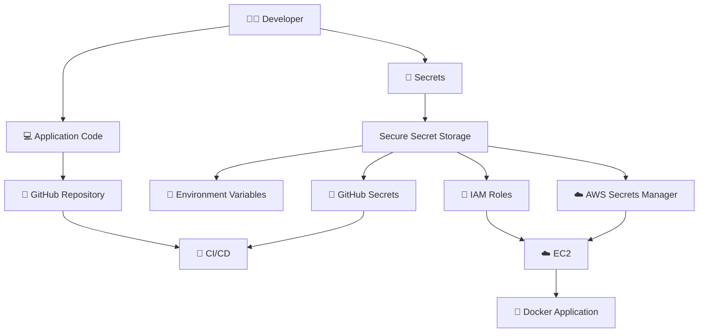

---

# 1️⃣ Why Can't We Put Passwords in GitHub?

Imagine we write:

```python
password = "Yuva12345"
```

and push it to GitHub.

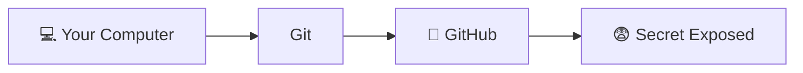

Even if we later delete the password, it may still exist in:

* Git history
* Previous commits
* Forks
* Cloned repositories
* Cached copies

So we should never put real passwords or keys directly into our source code.

### GitHub should contain:

```text
✅ Application Code
✅ Dockerfile
✅ README
✅ Configuration Templates

❌ Passwords
❌ AWS Secret Keys
❌ API Keys
❌ Private Keys
❌ Database Credentials
```

---

# 2️⃣ What Is `.gitignore`?

`.gitignore` tells Git:

> **"Don't track these files."**

Suppose our project looks like this:

```text
project/
│
├── app.py
├── Dockerfile
├── README.md
├── .env
└── .gitignore
```

Our `.env` file contains:

```text
AWS_SECRET_KEY=abcdef123456
PASSWORD=hello123
```

We don't want `.env` to go to GitHub.

So we put this inside `.gitignore`:

```gitignore
.env
```

Now Git ignores `.env`.

### 🧠 Simple Flow

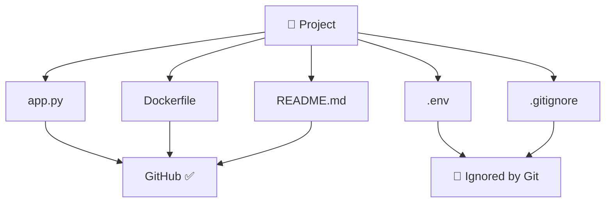

Think of it like:

```text
Git
 │
 ├── app.py        ✅ Take this
 ├── Dockerfile    ✅ Take this
 ├── README.md     ✅ Take this
 │
 └── .env          ❌ Don't take this!
```

### Check before pushing:

```bash
git status
```

Always check what Git is going to commit.

---

# 3️⃣ What Is an Environment Variable?

Instead of putting a secret **inside the code**, we keep it **outside the code**.

For example:

```text
PASSWORD=hello123
```

Your application asks:

> "What is the value of PASSWORD?"

The operating system provides the value.

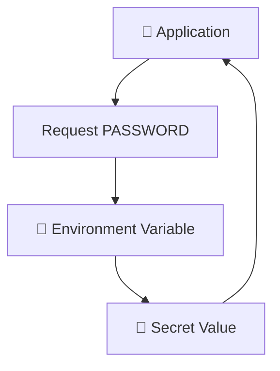

So we don't need to write:

```python
password = "hello123"
```

inside our application.

### Simple Idea

```text
Code
 ↓
"Asks for password"
 ↓
Environment Variable
 ↓
Secret Value
```

---

# 4️⃣ What Is `.env`?

A `.env` file is commonly used during **local development** to store environment variables.

Example:

```env
DB_USERNAME=admin
DB_PASSWORD=hello123
API_KEY=abc123
```

Your application reads these values.

But remember:

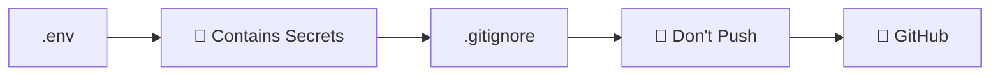

So:

```text
.env             → 🔐 Keep locally
.gitignore       → 🛡️ Tell Git to ignore it
GitHub           → ❌ Don't upload .env
```

---

# 5️⃣ What Is an IAM Role?

This is **very important when working with EC2**.

Suppose your EC2 server needs permission to access an AWS service.

A beginner may think:

> "I'll put my AWS Access Key and Secret Key inside EC2."

❌ This is not the preferred approach.

Instead, AWS provides something called an **IAM Role**.

Think of an IAM Role like an **ID card with permissions**.

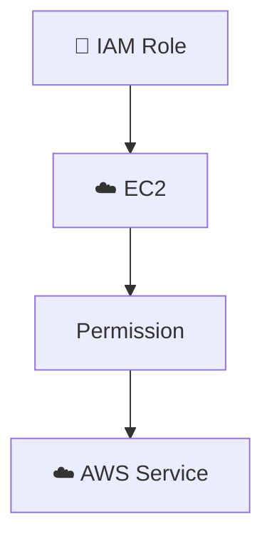

For example:

```text
EC2
 ↓
IAM Role
 ↓
Permission to access S3
 ↓
S3
```

The EC2 instance can use the permissions from the IAM Role without you manually putting long-term AWS keys inside the application.

---

# 6️⃣ Why Is IAM Role Better?

### ❌ Without IAM Role

```text
EC2
 │
 ├── AWS Access Key 🔑
 └── AWS Secret Key 🔐
```

If those credentials are exposed:

```text
😨 → Someone could potentially use them
```

### ✅ With IAM Role

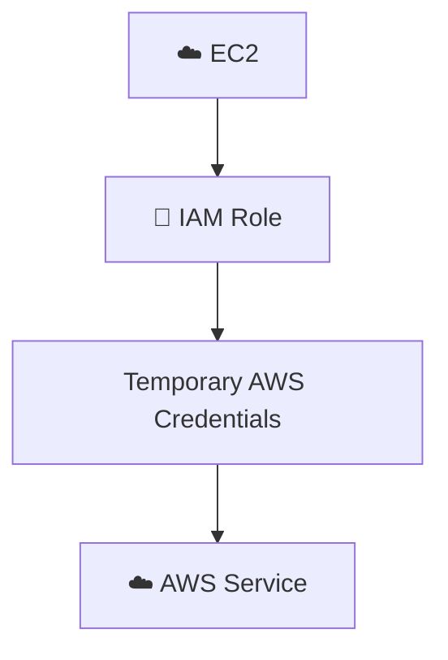

AWS manages the credentials used by the instance.

Therefore:

> ⭐ **For AWS resources such as EC2, use IAM Roles whenever possible instead of hardcoding AWS access keys.**

---

# 7️⃣ What Are GitHub Secrets?

Now imagine we create a CI/CD pipeline:

```text
GitHub
   ↓
GitHub Actions
   ↓
AWS
```

GitHub Actions may need credentials.

### ❌ Don't do this:

```yaml
password: "hello123"
```

Instead, GitHub provides **GitHub Secrets**.

We store sensitive values securely in GitHub's secret storage.

### GitHub Secrets Flow

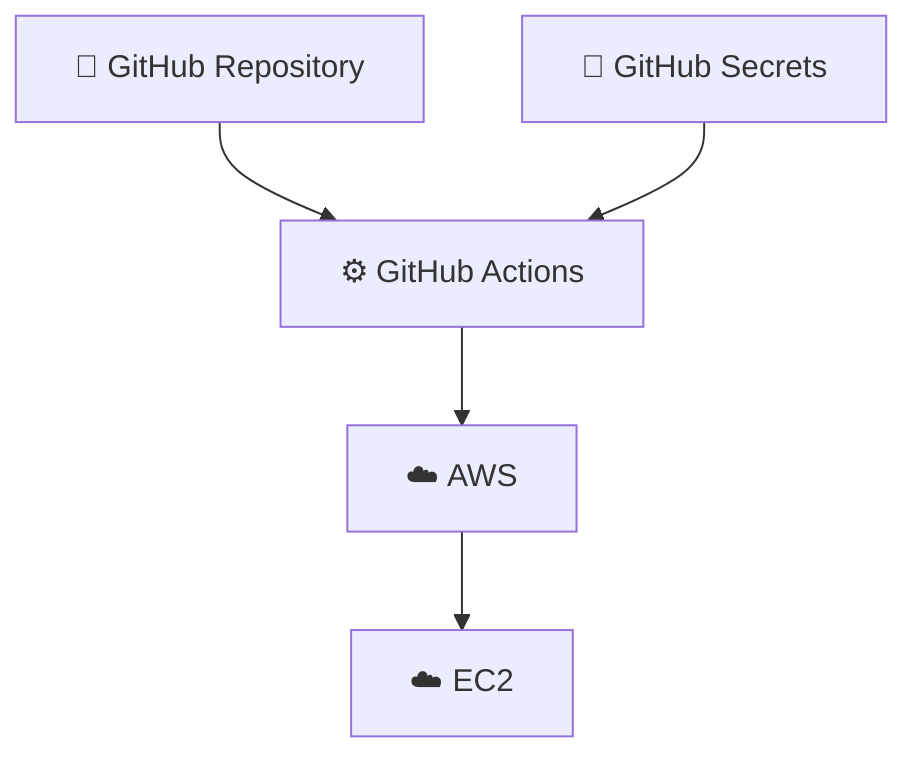

The actual secret value isn't written directly inside the source code.

---

# 8️⃣ What Is AWS Secrets Manager?

Think of **AWS Secrets Manager** as a secure locker for secrets.

For example:

```text
🔒 Database Password
🔑 API Key
🔐 Application Secret
```

Instead of putting them inside your application:

```text
Application
     ↓
Password ❌
```

you store them in:

```text
AWS Secrets Manager 🔐
        ↑
      Secret
```

Then your application requests the secret when it needs it.

### AWS Secrets Manager Flow

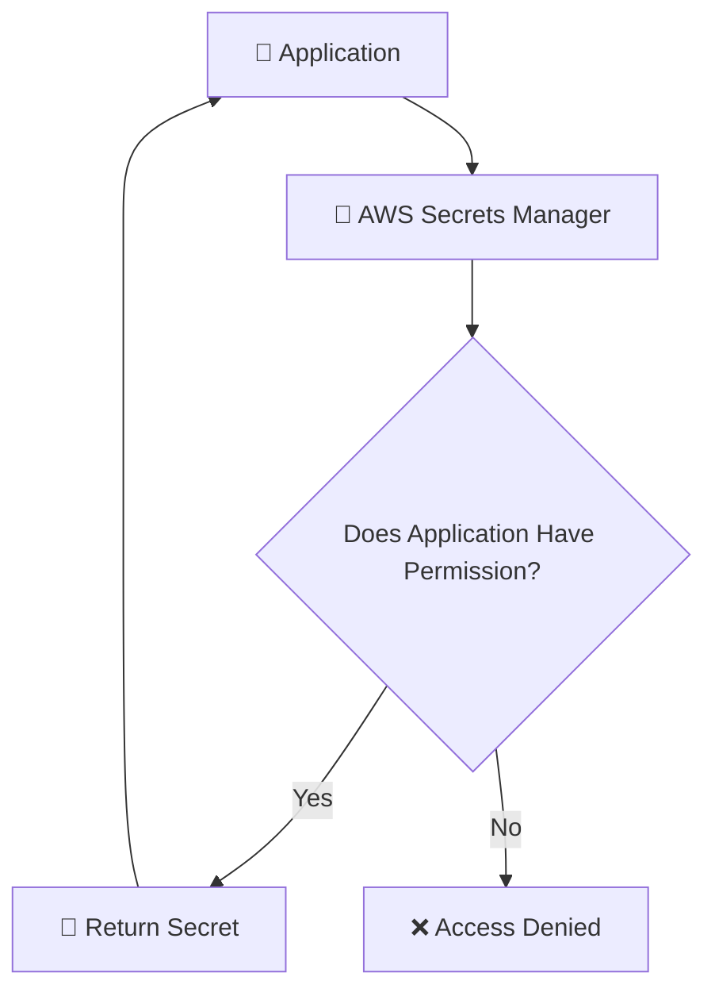

AWS checks whether the application has permission to access it.

---

# 9️⃣ What Happens If We Accidentally Push a Secret?

This is VERY important.

Suppose we accidentally push:

```text
AWS_SECRET_KEY=ABC123
```

to GitHub.

### ❌ Don't just delete the file.

You should:

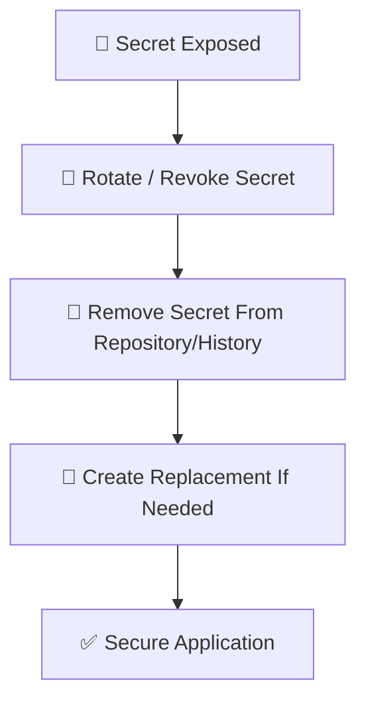

For example, if an AWS access key is exposed:

> 🚨 **Deactivate or delete the exposed key immediately.**

Why?

Because someone may have already copied it.

### Important Rule

> 🔥 **Once a secret is exposed, treat it as compromised.**

---

# 🔟 Terraform Has a Similar Problem

Terraform can also contain sensitive information.

For example:

```hcl
password = "hello123"
```

❌ Don't hardcode secrets like this.

Terraform's state file can also contain sensitive information.

Therefore, don't normally push:

```text
terraform.tfstate
```

to GitHub.

A common `.gitignore` configuration is:

```gitignore
.terraform/
*.tfstate
*.tfstate.*
```

### Terraform Secret Flow

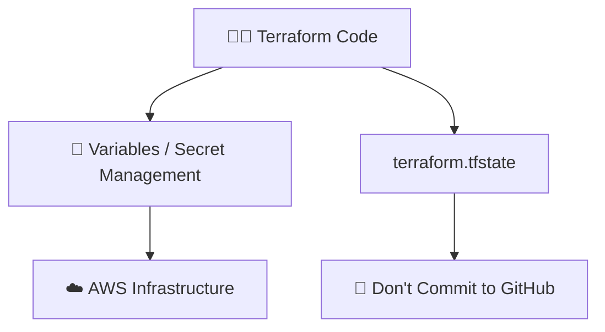

---

# 🧠 The Easiest Way to Remember Everything

Think about these four places:

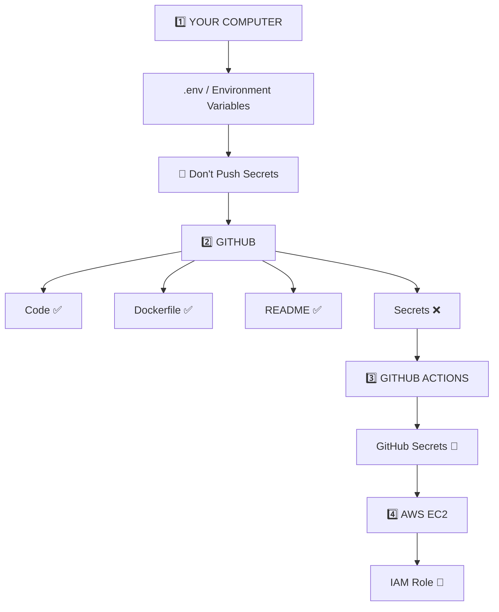

---

# 🔥 Your EC2 + Docker Project

For the DevOps work you're doing now, remember this flow:

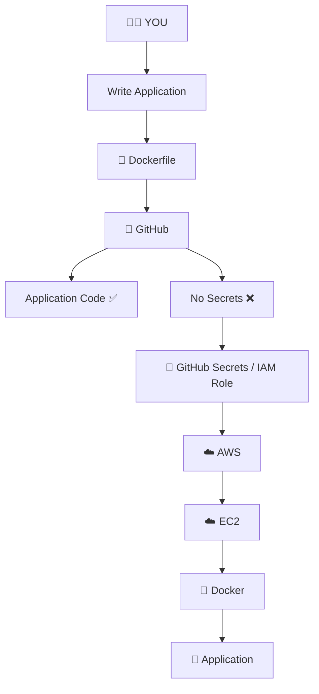

---

# 📊 Quick Comparison

| Concept               | Simple Meaning                              | Used For                                  |
| --------------------- | ------------------------------------------- | ----------------------------------------- |
| `.gitignore`          | Tells Git what not to track                 | Prevent secret files from being committed |
| Environment Variables | Keep values outside code                    | Application configuration                 |
| `.env`                | Local file containing environment variables | Local development                         |
| IAM Role              | AWS permission/identity for a resource      | EC2 → AWS services                        |
| GitHub Secrets        | Secure values stored in GitHub              | GitHub Actions / CI/CD                    |
| AWS Secrets Manager   | Secure secret storage in AWS                | Production applications                   |
| Terraform State       | Stores Terraform infrastructure information | Terraform infrastructure management       |

---

# 🏆 Golden Rules

### Rule 1

> ❌ Never hardcode secrets in source code.

### Rule 2

> ❌ Never commit `.env` files containing real secrets.

### Rule 3

> ❌ Never commit AWS private keys, `.pem` files, passwords, or API keys.

### Rule 4

> ✅ Use `.gitignore` to prevent accidental commits.

### Rule 5

> ✅ Use environment variables for local/application configuration.

### Rule 6

> ✅ Use IAM Roles for EC2 whenever possible.

### Rule 7

> ✅ Use GitHub Secrets for CI/CD credentials.

### Rule 8

> ✅ Use AWS Secrets Manager for production secrets.

### Rule 9

> 🚨 If a secret is exposed, rotate/revoke it immediately.

---

# 🎯 DevOps Secret Management Flow

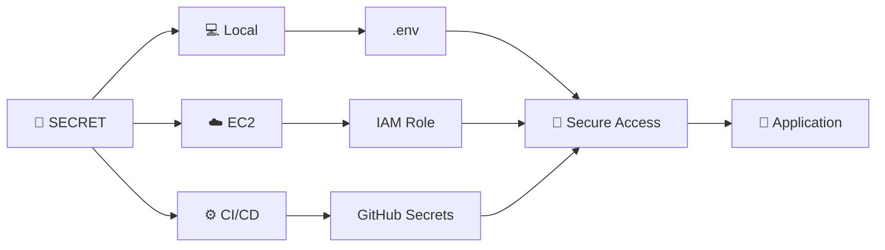

---

# 💡 Real-World Example

Imagine you are building a Docker application on EC2.

## ❌ Bad Architecture

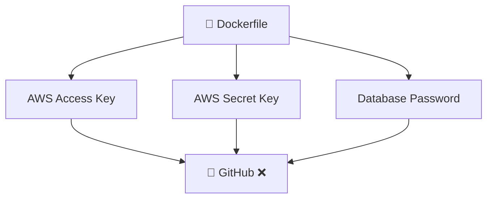

This exposes sensitive credentials.

---

## ✅ Good Architecture

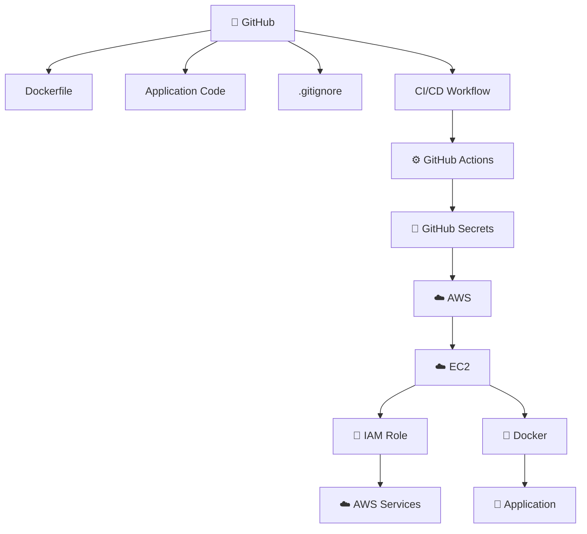

---

# 📝 Before Pushing to GitHub

Always check:

* [ ] AWS Access Keys
* [ ] AWS Secret Keys
* [ ] Passwords
* [ ] API Keys
* [ ] Tokens
* [ ] `.env` files
* [ ] `.pem` files
* [ ] Private Keys
* [ ] Terraform State Files
* [ ] Terraform variable files containing secrets
* [ ] Docker configuration containing passwords
* [ ] GitHub tokens
* [ ] Database credentials

Then run:

```bash
git status
```

Review the files carefully before:

```bash
git add .
git commit -m "your message"
git push
```

---

# 🧠 One-Sentence Memory Trick

> **GitHub stores your code; `.gitignore` protects local secret files; environment variables keep secrets outside code; IAM Roles give EC2 permissions; GitHub Secrets protect CI/CD credentials; and AWS Secrets Manager stores production secrets securely.**

---

# 🔐 The Most Important DevOps Rule

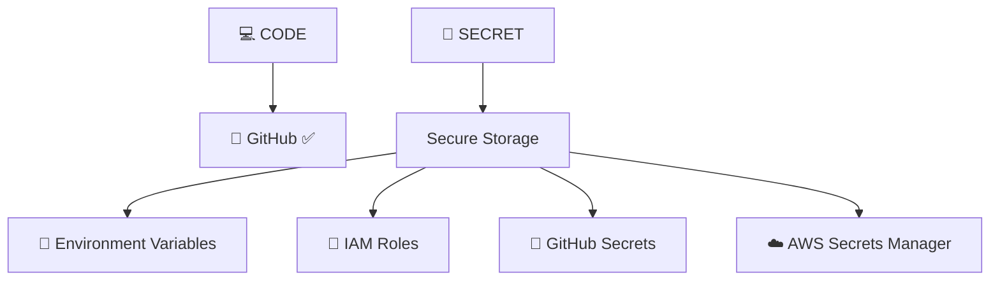

> 💙 **CODE BELONGS IN GITHUB. SECRETS DO NOT.**

> 🔥 **Never push secrets. Never hardcode credentials. Always use a secure secret-management mechanism.**

---

# 🚀 SECRETS MANAGEMENT COMPLETE

<p align="center">

### 🔐 Protect Your Secrets • Secure Your Infrastructure • Never Commit Credentials

</p>

---

### 📚 Source

This page is based on the original secrets-management notes provided for this repository.
