# DAY 16 — LINUX, GIT & AWS DEVOPS

<p align="center">


### Linux • Git • AWS • CI/CD • DevOps Fundamentals

</p>

# 📚 DAY 16 OVERVIEW

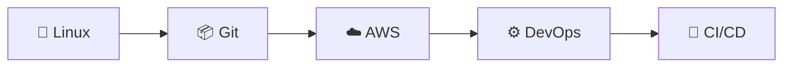

| Topic | What I Learned |
|---|---|
| 🐧 Linux | File permissions, ownership and important commands |
| 📦 Git | Delete files, folders, commits, push and logs |
| ☁️ AWS | Important AWS Cloud & DevOps services |
| 🚀 DevOps | CI/CD workflow and cloud deployment concepts |

---

# 🐧 LINUX FILE PERMISSIONS

Linux permissions control **who can read, write and execute files or directories**.

## 👥 Three Types of Users

| User | Meaning |
|---|---|
| 👤 User | Owner of the file |
| 👥 Group | Users belonging to the same group |
| 🌍 Others | Everyone else |

---

## 🔐 Permission Types

| Permission | Symbol | Value | Meaning |
|---|---|---:|---|
| Read | `r` | 4 | View file |
| Write | `w` | 2 | Modify, edit or delete |
| Execute | `x` | 1 | Run file or program |

### Permission Calculation

```text
r = 4
w = 2
x = 1

rwx = 4 + 2 + 1 = 7
rw- = 4 + 2     = 6
r-x = 4 + 1     = 5
r-- = 4         = 4
```

---

## 🔢 Example — Permission 755

```text
rwx r-x r-x

Owner Group Others
  7      5      5
```

### Meaning of 755

| User | Permission |
|---|---|
| Owner | Read + Write + Execute |
| Group | Read + Execute |
| Others | Read + Execute |

```text
755 = rwx r-x r-x
```

---

## 🔢 Example — Permission 644

```text
rw- r-- r--

Owner Group Others
  6      4      4
```

### Meaning of 644

| User | Permission |
|---|---|
| Owner | Read + Write |
| Group | Read |
| Others | Read |

```text
644 = rw- r-- r--
```

---

# 🔧 CHMOD

`chmod` is used to change permissions of a file or directory.

### Example

```bash
chmod 755 file.txt
```

### Permission Structure

```text
chmod 755 file.txt

        755
       / | \
      /  |  \
     7   5   5

 Owner Group Others
```

### Result

| User | Permission |
|---|---|
| Owner | Read, Write, Execute |
| Group | Read, Execute |
| Others | Read, Execute |

---

# 👤 CHOWN

`chown` is used to change the **owner** and optionally the **group**.

### Change Owner

```bash
chown yuva file.txt
```

### Change Owner and Group

```bash
chown yuva:dev file.txt
```

---

# 👥 CHGRP

`chgrp` is used to change the group of a file.

### Example

```bash
chgrp yuva notes.txt
```

---

# 🐧 BASIC LINUX COMMANDS

| Command | Description |
|---|---|
| `ls` | List files and directories |
| `cd` | Change directory |
| `mkdir` | Create directory |
| `touch` | Create file |
| `cp` | Copy files |
| `mv` | Rename or move files |
| `rm` | Delete files |
| `cat` | Display file content |
| `wc` | Count lines, words and characters |
| `man` | Display command manual |
| `history` | Show command history |
| `whoami` | Show current user |
| `sudo` | Execute with elevated privileges |
| `ps` | Show running processes |
| `df` | Display disk space |
| `free` | Display memory usage |
| `ssh` | Secure remote login |
| `apt` | Package management |
| `env` | Display environment variables |
| `chmod` | Change permissions |
| `chown` | Change owner |
| `chgrp` | Change group |
| `du` | Display disk usage |

---

# 💻 LINUX COMMAND EXAMPLES

## 📁 File & Directory

```bash
ls
cd project
mkdir DevOps
touch file.txt
cp file.txt backup.txt
mv old.txt new.txt
rm file.txt
cat file.txt
```

## 🔢 Word Count

```bash
wc file.txt
wc -l file.txt
```

## 📖 Manual

```bash
man ls
man grep
```

## 🕘 History

```bash
history
```

## 👤 Current User

```bash
whoami
```

## 🔑 Elevated Command

```bash
sudo <command>
```

Example:

```bash
sudo apt update
```

## ⚙️ Processes

```bash
ps
```

## 💾 Disk Space

```bash
df -h
```

## 🧠 Memory

```bash
free -h
```

## 🌐 Remote Login

```bash
ssh user@remote-host
```

## 📦 Package Management

```bash
apt update
```

## 🌎 Environment Variables

```bash
env
```

## 💽 Disk Usage

```bash
du
du -sh path
```

---

# 📦 GIT — PHASE 6

This phase focuses on deleting a tracked file using Git.

## Step 1 — Check Files

```bash
ls
```

## Step 2 — Delete File

```bash
git rm career.html
```

## Step 3 — Check Status

```bash
git status
```

Output:

```text
deleted: career.html
```

## Step 4 — Commit

```bash
git commit -m "removed webpage"
```

## Step 5 — Push

```bash
git push
```

After pushing, the deleted file disappears from GitHub.

---

# 📦 GIT — PHASE 7

## Delete One File

```bash
git rm career.html
```

## Delete Entire Folder

```bash
git rm -rf Images
```

### Meaning

| Option | Meaning |
|---|---|
| `-r` | Recursive delete |
| `-f` | Force delete |

```text
git rm -rf Images

-r = Recursive
-f = Force
```

---

# 🧪 LIVE EXAMPLE — git rm -rf

## 1. Create Folder

```bash
mkdir Images
```

## 2. Enter Folder

```bash
cd Images
```

## 3. Create Files

```bash
touch logo.png icon.png m.png
```

## 4. Go Back

```bash
cd ..
```

## 5. Verify Folder

```bash
ls
```

## 6. Add Files

```bash
git add .
```

## 7. Commit

```bash
git commit -m "added images files"
```

## 8. Push

```bash
git push
```

## 9. Delete Folder

```bash
git rm -rf Images
```

## 10. Verify

```bash
ls
```

The `Images` folder should be deleted.

## 11. Commit Deletion

```bash
git commit -m "removed images folder"
```

## 12. Push

```bash
git push
```

### Git Workflow

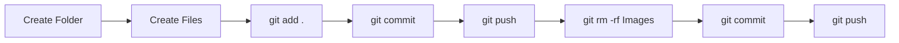

---

# 📜 GIT LOG

`git log` is used to view commit history.

## Full History

```bash
git log
```

Shows:

- Commit ID
- Author
- Date
- Commit Message

## One Line History

```bash
git log --oneline
```

## Last 3 Commits

```bash
git log -3
```

## Shortcut

```bash
git log --oneline -3
```

Example:

```text
a82f4c1 removed images folder
b72d9a4 added images files
c61a8e2 removed webpage
```

---

# ☁️ AWS DEVOPS SERVICES

| No | Service | Purpose |
|---:|---|---|
| 1 | EC2 | Virtual Server |
| 2 | VPC | Private Network |
| 3 | EBS | Block Storage |
| 4 | S3 | Object Storage |
| 5 | IAM | Access Control |
| 6 | CloudWatch | Monitoring |
| 7 | Lambda | Serverless |
| 8 | CodePipeline | CI/CD Pipeline |
| 9 | CodeBuild | Build & Test |
| 10 | CodeDeploy | Deployment |
| 11 | ECR | Container Registry |
| 12 | Billing | Cost Management |
| 13 | KMS | Encryption Keys |
| 14 | CloudTrail | Activity Audit |
| 15 | EKS | Managed Kubernetes |
| 16 | Fargate | Serverless Containers |
| 17 | ELK Stack | Logging & Monitoring |

---

# 🖥️ EC2 — ELASTIC COMPUTE CLOUD

EC2 is a virtual computer/server on AWS.

Used for:

- Applications
- Websites
- Servers
- Cloud workloads

### Simple Idea

```text
EC2 = Virtual Server in AWS
```

---

# 🌐 VPC — VIRTUAL PRIVATE CLOUD

VPC is a private network inside AWS.

It provides networking for AWS resources.

### Simple Idea

```text
VPC = Private Network
```

---

# 💽 EBS — ELASTIC BLOCK STORE

EBS provides block storage for EC2.

### Simple Idea

```text
EBS = Disk for EC2
```

---

# 🪣 S3 — SIMPLE STORAGE SERVICE

S3 provides object storage.

Stores:

- Files
- Images
- Videos
- Documents
- Backups

### Simple Idea

```text
S3 = File/Object Storage
```

---

# 🔐 IAM — IDENTITY AND ACCESS MANAGEMENT

IAM controls access inside AWS.

Includes:

- Users
- Groups
- Roles
- Permissions

### Simple Idea

```text
IAM = Access Control
```

---

# 📊 CLOUDWATCH

CloudWatch monitors AWS resources.

It monitors:

- CPU
- Network
- Logs
- Metrics
- Alarms

### Example

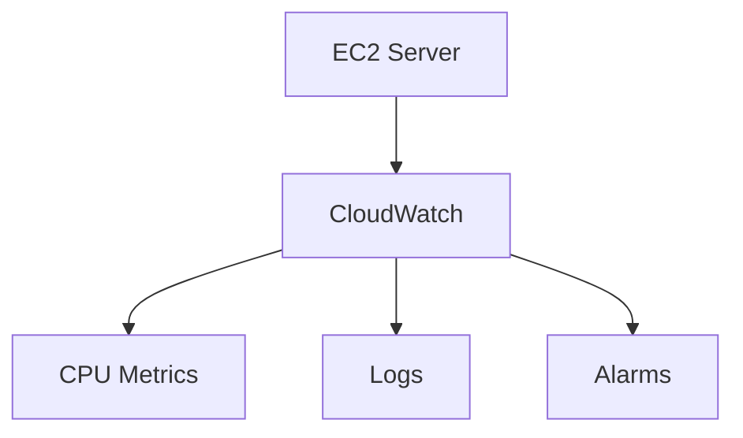

### Simple Idea

```text
CloudWatch = Monitoring
```

---

# ⚡ LAMBDA

Lambda runs code without managing servers.

### Example


### Simple Idea

```text
Lambda = Serverless Code Execution
```

---

# 🔄 CODEPIPELINE

CodePipeline automates the CI/CD process.

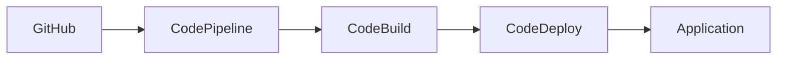

### Simple Idea

```text
CodePipeline = CI/CD Automation
```

---

# 🔨 CODEBUILD

CodeBuild builds and tests applications.

```text
Source Code
     │
     ▼
 CodeBuild
     │
     ▼
 Build + Test
```

### Simple Idea

```text
CodeBuild = Build & Test
```

---

# 🚀 CODEDEPLOY

CodeDeploy deploys applications.

```text
Application
     │
     ▼
 CodeDeploy
     │
     ▼
 Server
```

### Simple Idea

```text
CodeDeploy = Deployment
```

---

# 🐳 ECR — ELASTIC CONTAINER REGISTRY

ECR stores Docker container images.

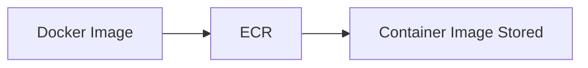

### Simple Idea

```text
ECR = Container Image Storage
```

---

# ☸️ EKS — ELASTIC KUBERNETES SERVICE

EKS is AWS Managed Kubernetes.

It runs Kubernetes workloads in AWS.

### Simple Idea

```text
EKS = Managed Kubernetes
```

---

# 🚢 FARGATE

Fargate runs containers without managing servers.

### Simple Idea

```text
Fargate = Serverless Containers
```

---

# 💰 BILLING & COST MANAGEMENT

Billing tracks AWS expenses.

It shows:

- Daily Spending
- Monthly Cost
- AWS Bills
- Budgets
- Cloud Expenses

### Simple Idea

```text
Billing = Cost Tracking
```

---

# 🔑 AWS KMS — KEY MANAGEMENT SERVICE

KMS manages encryption keys.

### Example

```text
Locker = Data
Key    = KMS
```

### Simple Idea

```text
KMS = Encryption Key Management
```

---

# 🕵️ CLOUDTRAIL

CloudTrail records AWS activity.

It answers:

- Who logged in?
- Who created EC2?
- Who deleted S3?
- Who performed an AWS action?

### Simple Idea

```text
CloudTrail = AWS Activity & Auditing
```

### Easy Memory

```text
CloudTrail = CCTV of AWS
```

---

# ⚙️ AWS CONFIG

AWS Config tracks configuration changes.

It helps identify:

- What changed?
- Who changed it?
- When was it changed?

### Simple Idea

```text
AWS Config = Configuration Tracking
```

---

# 🔗 CI — CONTINUOUS INTEGRATION

Continuous Integration means developers continuously integrate code.

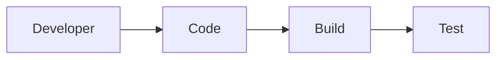

### Simple Idea

```text
CI = Build + Test Continuously
```

---

# 🚀 CD — CONTINUOUS DEPLOYMENT

Continuous Deployment automatically deploys successful builds.

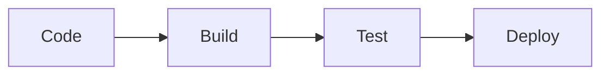

### Simple Idea

```text
CD = Automatic Deployment
```

---

# 🔄 COMPLETE CI/CD FLOW

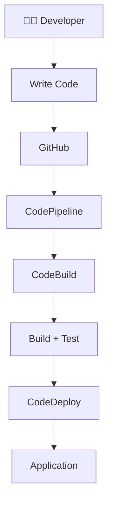

---

# ⚖️ CLOUDWATCH vs CLOUDTRAIL

| CloudWatch | CloudTrail |
|---|---|
| Monitoring | Auditing |
| Metrics | Activity Tracking |
| Logs | API Actions |
| Alarms | User Actions |
| System Health | Who Did What |

### Easy Memory

```text
CloudWatch → How is my system doing?

CloudTrail → Who did what?
```

---

# 💽 EBS vs S3

| EBS | S3 |
|---|---|
| Block Storage | Object Storage |
| Attached to EC2 | Stores Files |
| Acts Like Disk | Stores Objects |
| EC2 Workloads | Images, Videos, Backups |

### Easy Memory

```text
EBS → Disk for EC2

S3 → Storage for Files
```

---

# 🖥️ EC2 vs LAMBDA

| EC2 | Lambda |
|---|---|
| Virtual Server | Serverless |
| Manage Server | No Server Management |
| Long Running Apps | Event Driven Code |
| Full Control | AWS Manages Infrastructure |

### Easy Memory

```text
EC2 → Virtual Server

Lambda → Run Code Without Servers
```

---

# ☸️ EKS vs FARGATE

| EKS | Fargate |
|---|---|
| Managed Kubernetes | Serverless Containers |
| Kubernetes Platform | Container Compute |
| Runs K8s Workloads | Runs Containers |
| Kubernetes Focus | Serverless Compute |

### Easy Memory

```text
EKS → Managed Kubernetes

Fargate → Serverless Container Compute
```

---

# 🧠 AWS SERVICES QUICK REVISION

| Service | Remember |
|---|---|
| EC2 | Virtual Server |
| VPC | Private Network |
| EBS | Block Storage |
| S3 | Object Storage |
| IAM | Access Control |
| CloudWatch | Monitoring |
| Lambda | Serverless |
| CodePipeline | CI/CD |
| CodeBuild | Build & Test |
| CodeDeploy | Deployment |
| ECR | Container Images |
| EKS | Kubernetes |
| Fargate | Serverless Containers |
| KMS | Encryption Keys |
| CloudTrail | Activity Audit |
| AWS Config | Configuration Tracking |
| Billing | Cost Management |

---

# 🏗️ COMPLETE AWS DEVOPS ARCHITECTURE

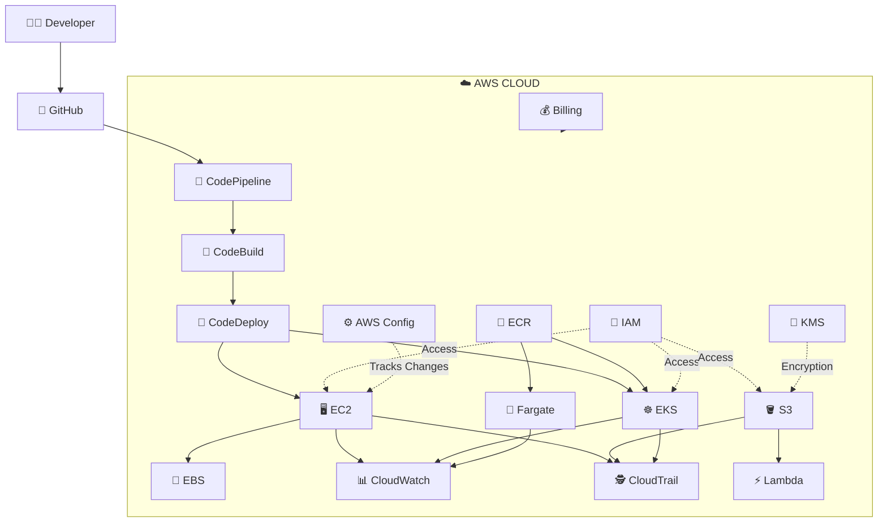

---

# 🗺️ DEVOPS LEARNING ROADMAP

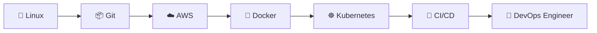

---

# 📝 FINAL DAY 16 REVISION

## 🐧 Linux

```text
ls       → List files
cd       → Change directory
mkdir    → Create directory
touch    → Create file
cp       → Copy files
mv       → Move / Rename
rm       → Delete
cat      → Display content
wc       → Count
man      → Manual
history  → Command history
whoami   → Current user
sudo     → Elevated privileges
ps       → Processes
df       → Disk space
free     → Memory usage
ssh      → Remote login
apt      → Package management
env      → Environment variables
chmod    → Permissions
chown    → Owner
chgrp    → Group
du       → Disk usage
```

## 📦 Git

```text
git status              → Check status
git add .               → Stage changes
git rm file.txt         → Delete file
git rm -rf folder       → Delete folder
git commit -m "message" → Commit changes
git push                → Push to GitHub
git log --oneline       → Commit history
git log --oneline -3    → Last 3 commits
```

## ☁️ AWS

```text
EC2        → Virtual Server
VPC        → Private Network
EBS        → Block Storage
S3         → Object Storage
IAM        → Access Control
CloudWatch → Monitoring
Lambda     → Serverless
CloudTrail → Activity Audit
AWS Config → Configuration Tracking
KMS        → Encryption Keys
ECR        → Container Images
EKS        → Managed Kubernetes
Fargate    → Serverless Containers
CodePipeline → CI/CD Pipeline
CodeBuild  → Build & Test
CodeDeploy → Deployment
Billing    → Cost Management
```

---

# 🎯 KEY TAKEAWAYS

### Linux

```text
Permissions = Owner + Group + Others

r = 4
w = 2
x = 1

755 = rwx r-x r-x
644 = rw- r-- r--
```

### Git

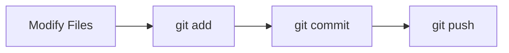

### AWS

```text
Compute
├── EC2
├── Lambda
├── EKS
└── Fargate

Storage
├── EBS
└── S3

Security
├── IAM
└── KMS

Monitoring
├── CloudWatch
├── CloudTrail
└── AWS Config

CI/CD
├── CodePipeline
├── CodeBuild
└── CodeDeploy
```

---

<p align="center">

# 🎉 DAY 16 COMPLETE

### 🐧 Linux → 📦 Git → ☁️ AWS → 🔄 CI/CD → 🚀 DevOps

**Keep Building • Keep Learning • Keep Shipping 🚀**

</p>
