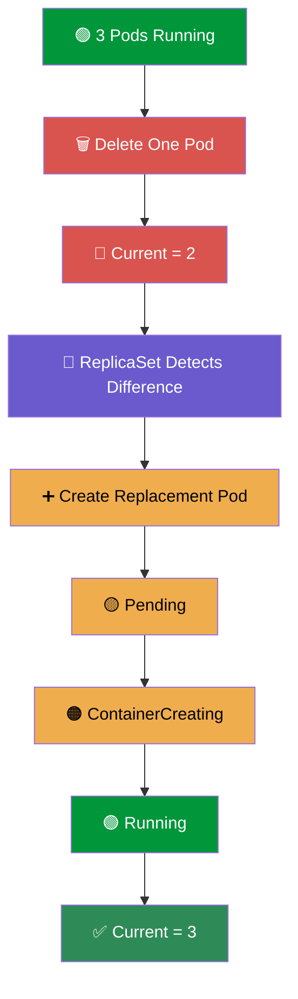
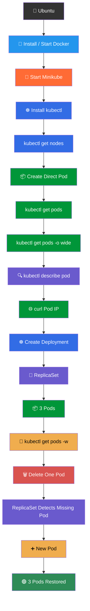

# KUBERNETES — IMPORTANT COMMANDS CHEAT SHEET

<p align="center">


</p>

<p align="center">
<b>All Important Kubernetes Commands Used So Far</b>
</p>

<p align="center">
<i>DevOps Cloud Journey — Kubernetes Commands Reference 🚀</i>
</p>

---

# 📚 TABLE OF CONTENTS

- [System & Docker Commands](#️-system--docker-commands)
- [🚀 Minikube Commands](#-minikube-commands)
- [☸️ kubectl Installation & Version](#️-kubectl-installation--version)
- [🖥️ Kubernetes Cluster Commands](#️-kubernetes-cluster-commands)
- [📦 Pod Commands](#-pod-commands)
- [📝 YAML Commands](#-yaml-commands)
- [☸️ Deployment Commands](#️-deployment-commands)
- [🔁 ReplicaSet Commands](#-replicaset-commands)
- [🗑️ Delete Commands](#️-delete-commands)
- [👀 Watch Commands](#-watch-commands)
- [🔍 Describe & Troubleshooting Commands](#-describe--troubleshooting-commands)
- [🌐 Pod Networking Commands](#-pod-networking-commands)
- [🏷️ Label Commands](#️-label-commands)
- [📄 YAML Output Commands](#-yaml-output-commands)
- [🧹 Cleanup Commands](#-cleanup-commands)
- [🔥 Most Important Commands](#-most-important-commands)
- [🧪 Kubernetes Self-Healing Test](#-kubernetes-self-healing-test)
- [🧠 Command Flow](#-command-flow)

---

# 🖥️ SYSTEM & DOCKER COMMANDS

These were used while preparing the Ubuntu machine and running Minikube with Docker.

## Check Memory

```bash
free -h
```

Shows the available RAM and memory usage.

---

## Update Ubuntu Packages

```bash
sudo apt update
```

Updates the package information.

---

## Install Docker

```bash
sudo apt install docker.io
```

---

## Start Docker

```bash
sudo systemctl start docker
```

---

## Enable Docker at Boot

```bash
sudo systemctl enable docker
```

---

## Check Docker Status

```bash
sudo systemctl status docker
```

Expected:

```text
Active: active (running)
```

---

## Add Current User to Docker Group

```bash
sudo usermod -aG docker $USER
```

---

## Apply Docker Group Changes

```bash
newgrp docker
```

---

## Check Running Docker Containers

```bash
docker ps
```

This was also useful for checking the Minikube Docker container.

---

## Clean Unused Docker Resources

```bash
docker system prune
```

⚠️ Be careful when using cleanup commands because unused containers, networks, images, or other Docker resources can be removed.

---

# 🚀 MINIKUBE COMMANDS

## Check Minikube Version

```bash
minikube version
```

---

## Start Minikube Using Docker

```bash
minikube start --driver=docker
```

This starts a local Kubernetes cluster using Docker as the driver.

---

## Check Minikube Status

```bash
minikube status
```

Expected:

```text
host: Running
kubelet: Running
apiserver: Running
kubeconfig: Configured
```

---

## Enter the Minikube Node

```bash
minikube ssh
```

This opens a shell inside the Minikube node.

The prompt changes to something similar to:

```text
docker@minikube:~$
```

---

## Exit Minikube

```bash
exit
```

---

## Check Containers Inside Minikube

After:

```bash
minikube ssh
```

run:

```bash
docker ps
```

This helps see containers running inside the Minikube environment.

---

# ☸️ KUBECTL INSTALLATION & VERSION

## Install kubectl

```bash
sudo snap install kubectl --classic
```

---

## Check kubectl Client Version

```bash
kubectl version --client
```

---

# 🖥️ KUBERNETES CLUSTER COMMANDS

## Check Kubernetes Nodes

```bash
kubectl get nodes
```

Example:

```text
NAME       STATUS   ROLES           AGE   VERSION
minikube   Ready    control-plane   ...   v1.35.1
```

---

## Get More Information About Nodes

```bash
kubectl get nodes -o wide
```

---

## Check All Resources in All Namespaces

```bash
kubectl get pods -A
```

The `-A` means:

```text
--all-namespaces
```

This was useful for seeing Kubernetes system Pods.

---

# 📦 POD COMMANDS

## List Pods

```bash
kubectl get pods
```

This is one of the most important Kubernetes commands.

---

## Short Form

```bash
kubectl get po
```

---

## Get Pod With More Information

```bash
kubectl get pods -o wide
```

This shows:

- Pod IP
- Node
- Status
- Ready containers
- Restarts

Example:

```text
NAME    READY   STATUS    RESTARTS   AGE   IP           NODE
nginx   1/1     Running   0          ...   10.244.0.3   minikube
```

---

## Get a Specific Pod

```bash
kubectl get pod nginx
```

---

## Check Pod Labels

```bash
kubectl get pods --show-labels
```

---

## Get Pods Using a Label

```bash
kubectl get pods -l app=nginx
```

---

# 📝 YAML FILE COMMANDS

## Create a YAML File

```bash
vim pod.yml
```

For Deployment:

```bash
vim deployment.yml
```

---

## Create a Pod From YAML

```bash
kubectl create -f pod.yml
```

---

## Create a Deployment From YAML

```bash
kubectl create -f deployment.yml
```

---

## Apply a YAML File

```bash
kubectl apply -f pod.yml
```

or:

```bash
kubectl apply -f deployment.yml
```

### Difference

```text
kubectl create
        ↓
Creates the resource

kubectl apply
        ↓
Creates or updates the resource
```

For day-to-day Kubernetes work, `kubectl apply` is commonly used for YAML-based resources.

---

# 📦 POD YAML USED IN DAY 33

The Pod YAML was:

```yaml
apiVersion: v1
kind: Pod

metadata:
  name: nginx

spec:
  containers:
    - name: nginx
      image: nginx:1.14.2
      ports:
        - containerPort: 80
```

Create it:

```bash
kubectl create -f pod.yml
```

Check it:

```bash
kubectl get pods
```

---

# ☸️ DEPLOYMENT COMMANDS

## Create Deployment

```bash
kubectl create -f deployment.yml
```

---

## Apply Deployment

```bash
kubectl apply -f deployment.yml
```

---

## List Deployments

```bash
kubectl get deployments
```

Short form:

```bash
kubectl get deploy
```

---

## Get a Specific Deployment

```bash
kubectl get deployment nginx-deployment
```

---

## Describe Deployment

```bash
kubectl describe deployment nginx-deployment
```

This provides detailed information about:

- Deployment
- ReplicaSet
- Replicas
- Conditions
- Events

---

## Get Deployment in YAML Format

```bash
kubectl get deployment nginx-deployment -o yaml
```

---

# 🔁 REPLICASET COMMANDS

## List ReplicaSets

```bash
kubectl get replicasets
```

Short form:

```bash
kubectl get rs
```

---

## Describe a ReplicaSet

```bash
kubectl describe rs <replicaset-name>
```

Example:

```bash
kubectl describe rs nginx-deployment-77bc6bd484
```

---

## Get ReplicaSet in YAML

```bash
kubectl get rs -o yaml
```

---

# 🗑️ DELETE COMMANDS

## Delete a Pod

```bash
kubectl delete pod <pod-name>
```

Example:

```bash
kubectl delete pod nginx
```

or:

```bash
kubectl delete pod nginx-deployment-77bc6bd484-5knh4
```

---

## Delete a Pod Managed by Deployment

```bash
kubectl delete pod <deployment-pod-name>
```

After deleting it:

```bash
kubectl get pods
```

A replacement Pod should be created by the ReplicaSet.

---

## Delete Deployment

```bash
kubectl delete deployment nginx-deployment
```

⚠️ Deleting the Deployment also removes the Pods managed by it.

---

## Delete Resource Using YAML

```bash
kubectl delete -f deployment.yml
```

or:

```bash
kubectl delete -f pod.yml
```

---

# 👀 WATCH COMMANDS

## Watch Pods Continuously

```bash
kubectl get pods -w
```

This was one of the most important commands in the self-healing lab.

The `-w` means:

```text
watch
```

---

## Watch Deployments

```bash
kubectl get deploy -w
```

---

## Watch ReplicaSets

```bash
kubectl get rs -w
```

---

# 🔍 DESCRIBE & TROUBLESHOOTING COMMANDS

## Describe a Pod

```bash
kubectl describe pod <pod-name>
```

Example:

```bash
kubectl describe pod nginx
```

For Deployment Pods:

```bash
kubectl describe pod nginx-deployment-77bc6bd484-5knh4
```

---

## Why `kubectl describe` Is Important

It shows:

```text
Pod Information
      ↓
Container Information
      ↓
Pod Conditions
      ↓
Events
      ↓
Errors
```

It is especially useful when a Pod is:

```text
Pending
CrashLoopBackOff
ImagePullBackOff
ContainerCreating
```

or when troubleshooting scheduling and container problems.

---

# 🌐 POD NETWORKING COMMANDS

After creating the NGINX Pod, I checked its Pod IP:

```bash
kubectl get pods -o wide
```

Example:

```text
IP: 10.244.0.3
```

---

## Enter Minikube

```bash
minikube ssh
```

---

## Test NGINX Using Pod IP

Inside Minikube:

```bash
curl 10.244.0.3
```

The NGINX welcome page was returned.

This confirmed that the NGINX application was running successfully inside the Pod.

---

## Exit Minikube

```bash
exit
```

---

# 🌐 EXPOSE COMMAND WE TESTED

We tried:

```bash
kubectl expose pod nginx --type=NodePort --port=80
```

The command failed because the manually created Pod did not have the required labels/selectors for the automatic Service exposure.

The error was related to:

```text
the pod has no labels and cannot be exposed
```

### Lesson

Services normally use:

```text
Labels
   ↓
Selectors
   ↓
Service
   ↓
Pods
```

This will become important when learning Kubernetes Services.

---

# 🏷️ LABEL COMMANDS

## Show Pod Labels

```bash
kubectl get pods --show-labels
```

---

## Get Pods With a Specific Label

```bash
kubectl get pods -l app=nginx
```

For our Deployment:

```text
app=nginx
```

was used as the Pod label.

---

# 📄 YAML OUTPUT COMMANDS

## Get Pod YAML

```bash
kubectl get pod <pod-name> -o yaml
```

---

## Get Deployment YAML

```bash
kubectl get deployment nginx-deployment -o yaml
```

---

## Get ReplicaSet YAML

```bash
kubectl get rs -o yaml
```

The `-o yaml` option means:

```text
Output the resource in YAML format.
```

---

# 🔎 USEFUL RESOURCE COMMANDS

## Get All Pods

```bash
kubectl get pods
```

## Get All Deployments

```bash
kubectl get deploy
```

## Get All ReplicaSets

```bash
kubectl get rs
```

## Get All Nodes

```bash
kubectl get nodes
```

---

# 🧹 CLEANUP COMMANDS

## Delete Direct Pod

```bash
kubectl delete pod nginx
```

---

## Delete Deployment

```bash
kubectl delete deployment nginx-deployment
```

---

## Delete Using YAML

```bash
kubectl delete -f pod.yml
```

```bash
kubectl delete -f deployment.yml
```

---

# 🔥 MOST IMPORTANT KUBERNETES COMMANDS

If I had to remember only the most important commands from the Kubernetes labs so far, these would be the first ones:

```bash
# Check Kubernetes nodes
kubectl get nodes

# Check Pods
kubectl get pods

# Check Pods with IP and Node
kubectl get pods -o wide

# Check all namespaces
kubectl get pods -A

# Create resource from YAML
kubectl create -f pod.yml

# Apply resource from YAML
kubectl apply -f deployment.yml

# Check Deployments
kubectl get deploy

# Check ReplicaSets
kubectl get rs

# Detailed Pod information
kubectl describe pod <pod-name>

# Detailed Deployment information
kubectl describe deployment <deployment-name>

# Watch Pods
kubectl get pods -w

# Delete a Pod
kubectl delete pod <pod-name>

# Check Pod labels
kubectl get pods --show-labels

# Get resource as YAML
kubectl get pod <pod-name> -o yaml
```

---

# ⭐ TOP 10 COMMANDS TO MEMORIZE

For interviews and practical Kubernetes work, these are the commands I should remember first:

```bash
1. kubectl get nodes

2. kubectl get pods

3. kubectl get pods -o wide

4. kubectl describe pod <pod-name>

5. kubectl create -f <file>.yml

6. kubectl apply -f <file>.yml

7. kubectl get deploy

8. kubectl get rs

9. kubectl get pods -w

10. kubectl delete pod <pod-name>
```

---

# ❤️ KUBERNETES SELF-HEALING TEST

This is the practical test performed in Day 34.

### Terminal 1

Start watching Pods:

```bash
kubectl get pods -w
```

### Terminal 2

Check the Pods:

```bash
kubectl get pods
```

Find a Deployment-managed Pod and delete it:

```bash
kubectl delete pod <pod-name>
```

### Terminal 1

Observe:

```text
Old Pod
   ↓
Terminating
   ↓
Deleted

ReplicaSet detects:
Desired = 3
Current = 2

   ↓

New Pod Created
   ↓
Pending
   ↓
ContainerCreating
   ↓
Running

Final:
3 Pods ✅
```

### Self-Healing Diagram



---

# 🧠 COMMANDS BY KUBERNETES RESOURCE

| Resource / Task | Important Command |
|---|---|
| ☸️ Nodes | `kubectl get nodes` |
| 📦 Pods | `kubectl get pods` |
| 📦 Pod IP | `kubectl get pods -o wide` |
| 🔍 Pod details | `kubectl describe pod <pod>` |
| 🔁 Deployment | `kubectl get deploy` |
| 🔁 ReplicaSet | `kubectl get rs` |
| 👀 Watch Pods | `kubectl get pods -w` |
| 🗑️ Delete Pod | `kubectl delete pod <pod>` |
| 🏷️ Pod labels | `kubectl get pods --show-labels` |
| 📝 Create YAML | `kubectl create -f <file>` |
| 🔄 Apply YAML | `kubectl apply -f <file>` |
| 📄 YAML output | `kubectl get <resource> -o yaml` |
| 🌐 Test Pod | `curl <pod-ip>` |
| 🖥️ Enter Minikube | `minikube ssh` |
| 🔎 Minikube status | `minikube status` |
| 🚀 Start Minikube | `minikube start --driver=docker` |

---

# 🗺️ COMPLETE COMMAND FLOW — DAY 33 + DAY 34



---

# 🧠 QUICK MEMORY MAP

```text
                    KUBERNETES
                         │
        ┌────────────────┼────────────────┐
        │                │                │
        ▼                ▼                ▼
      Nodes            Pods          Deployments
        │                │                │
        │                │                ▼
        │                │           ReplicaSet
        │                │                │
        │                │                ▼
        │                │              Pods
        │                │
        │                ▼
        │           Pod IP / Status
        │
        ▼
     minikube
```

---

# 🔥 THE COMMANDS I SHOULD PRACTICE MOST

```bash
# 1. Check cluster
kubectl get nodes

# 2. Check Pods
kubectl get pods

# 3. See Pod IP + Node
kubectl get pods -o wide

# 4. Get Pod details
kubectl describe pod <pod-name>

# 5. Create Pod
kubectl create -f pod.yml

# 6. Create Deployment
kubectl create -f deployment.yml

# 7. Check Deployment
kubectl get deploy

# 8. Check ReplicaSet
kubectl get rs

# 9. Watch Pod changes
kubectl get pods -w

# 10. Delete Pod
kubectl delete pod <pod-name>

# 11. Apply changes
kubectl apply -f deployment.yml

# 12. Enter Minikube
minikube ssh

# 13. Test Pod
curl <pod-ip>
```

---

# 🎯 FINAL COMMAND CHEAT SHEET

```text
┌─────────────────────────────────────────────────────┐
│             ☸️ KUBERNETES COMMANDS                  │
├─────────────────────────────────────────────────────┤
│                                                     │
│  CLUSTER                                            │
│  kubectl get nodes                                  │
│  kubectl get pods -A                                │
│                                                     │
│  PODS                                               │
│  kubectl get pods                                   │
│  kubectl get pods -o wide                           │
│  kubectl describe pod <pod-name>                    │
│  kubectl get pods --show-labels                     │
│                                                     │
│  YAML                                               │
│  kubectl create -f <file>.yml                       │
│  kubectl apply -f <file>.yml                        │
│  kubectl delete -f <file>.yml                       │
│                                                     │
│  DEPLOYMENT                                         │
│  kubectl get deploy                                │
│  kubectl describe deployment <name>                 │
│                                                     │
│  REPLICASET                                         │
│  kubectl get rs                                     │
│  kubectl describe rs <name>                         │
│                                                     │
│  WATCH                                              │
│  kubectl get pods -w                                │
│  kubectl get deploy -w                              │
│  kubectl get rs -w                                  │
│                                                     │
│  DELETE                                             │
│  kubectl delete pod <pod-name>                      │
│  kubectl delete deployment <deployment-name>        │
│                                                     │
│  MINIKUBE                                           │
│  minikube start --driver=docker                     │
│  minikube status                                    │
│  minikube ssh                                       │
│                                                     │
│  NETWORKING                                         │
│  kubectl get pods -o wide                           │
│  curl <pod-ip>                                      │
│                                                     │
└─────────────────────────────────────────────────────┘
```

---

# 🎉 KUBERNETES COMMANDS — COMPLETE

These commands cover the important Kubernetes work completed so far:

```text
🐳 Docker
   ↓
🚀 Minikube
   ↓
☸️ kubectl
   ↓
🖥️ Nodes
   ↓
📦 Pods
   ↓
📝 YAML
   ↓
☸️ Deployment
   ↓
🔁 ReplicaSet
   ↓
❤️ Self-Healing
   ↓
👀 Watch & Troubleshoot
```

<p align="center">

### 🚀 Kubernetes Command Reference Complete

<b>Pod → Deployment → ReplicaSet → Self-Healing</b>

</p>
