<div align="center">

# ☁️ DEVOPS CLOUD JOURNEY

## DAY 01 → DAY 06

### 🚀 From Zero to DevOps Engineer

<p>


</p>

**My journey from DevOps fundamentals to Linux, AWS, Shell Scripting, Git & GitHub**

</div>

---

# 🗺️ MY JOURNEY SO FAR

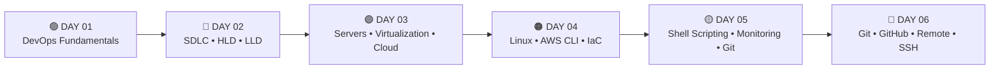

---

# 🟢 DAY 01 — DEVOPS FUNDAMENTALS

## 📚 What I Learned

DevOps is a way of working where **Development and Operations work together** to build, test, deploy and maintain software faster and more reliably.

## 🔑 Concepts Covered

- ☁️ What is DevOps?
- 🤝 Development + Operations
- 🤖 Automation
- ⚡ Faster delivery
- 🛡️ Reliability
- 📊 Monitoring
- 🧪 Continuous Testing
- 🔄 Feedback
- ♻️ Continuous Improvement
- 👥 Collaboration
- 🚫 Reducing manual work

## 🔄 DevOps Lifecycle

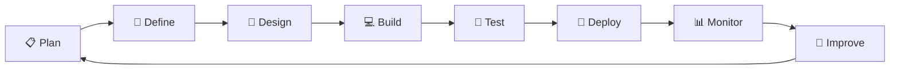

## 🤝 Development + Operations

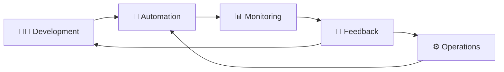

> 💡 **DevOps = Collaboration + Automation + Reliability + Continuous Improvement**

---

# 🔵 DAY 02 — SDLC, HLD & LLD

## 📋 SDLC

**SDLC — Software Development Life Cycle**

The process used to develop and deliver software.

## 🔑 Concepts Covered

- 📋 Planning
- 📝 Requirements
- 🎨 Design
- 💻 Development
- 🧪 Testing
- 🚀 Deployment
- 📊 Monitoring
- 🔄 Feedback

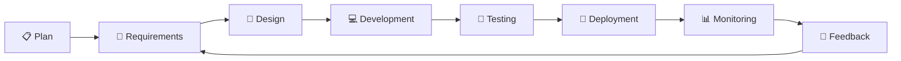

## 📄 SRS — Software Requirements Specification

### Learned

- Understanding requirements
- Defining what the software should do
- Functional requirements
- Understanding user needs
- Using requirements before designing the system

---

## 🏗️ HLD — High Level Design

HLD describes the **big picture** of a system.

### Learned

- System architecture
- Major components
- Services
- Technology choices
- Communication between components
- Overall system structure

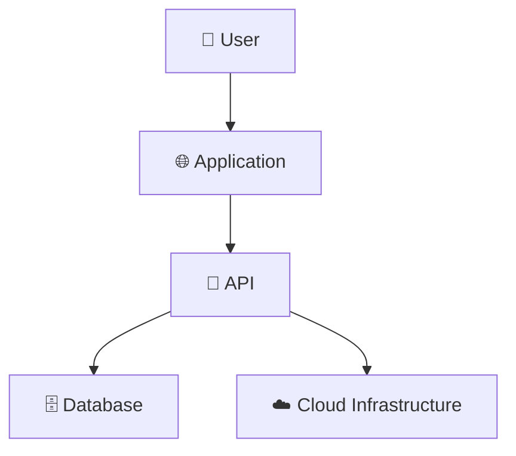

---

## 🔍 LLD — Low Level Design

LLD describes the **detailed implementation** of the system.

### Learned

- Classes
- Methods
- Functions
- Internal logic
- Component-level implementation
- Validation

## ⚡ HLD vs LLD

| 🏗️ HLD | 🔍 LLD |
|---|---|
| Big picture | Detailed picture |
| Architecture | Implementation |
| Major components | Classes & methods |
| System level | Component level |
| What components exist | How components work |

> **HLD = Big Picture**  
> **LLD = Detailed Implementation**

---

# 🟣 DAY 03 — SERVERS, VIRTUALIZATION & CLOUD

## 🖥️ Servers

A server is a computer that provides resources or services to other systems.

### 🔑 Server Components

- ⚙️ CPU
- 🧠 RAM
- 💾 Storage
- 🌐 Network
- 🐧 Operating System
- ⚙️ Applications

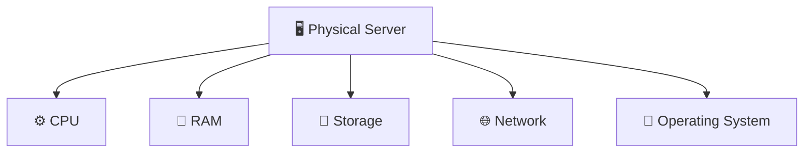

---

## ⚙️ Virtualization

Virtualization allows multiple virtual machines to run on one physical server.

### 🔑 Concepts Covered

- Virtualization
- Virtual Machine
- Hypervisor
- Resource allocation
- Resource sharing
- Logical isolation
- Efficient hardware usage

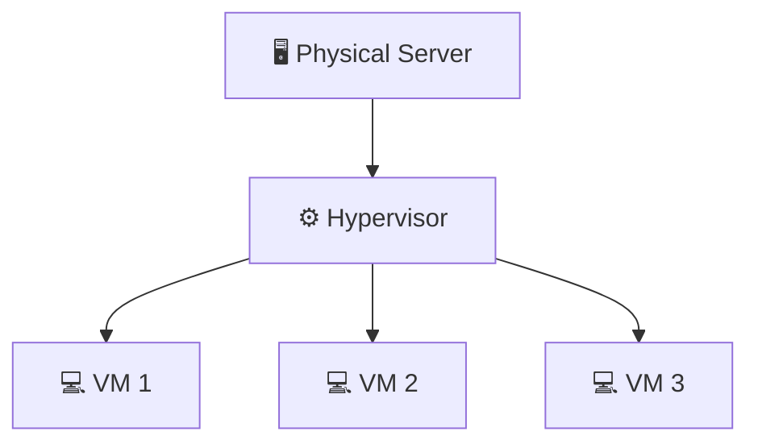

---

## 🔒 Logical Isolation

Each VM behaves like an independent environment even though multiple VMs can use the same physical hardware.

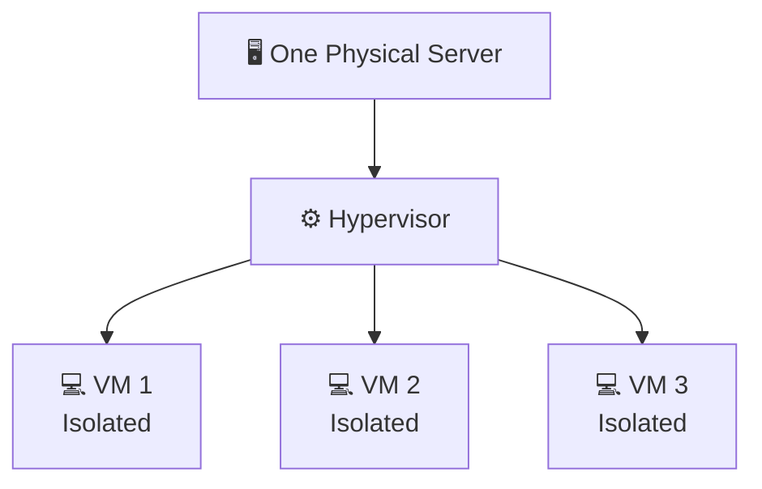

---

## ☁️ Cloud Computing

### Concepts Covered

- Cloud infrastructure
- Virtual servers
- Compute resources
- AWS
- EC2
- APIs
- Automation

---

## ☁️ AWS EC2

EC2 provides virtual servers in AWS.

### Concepts Covered

- EC2 Instance
- AMI
- Instance Type
- Key Pair
- Cloud Infrastructure
- Connecting to an EC2 server

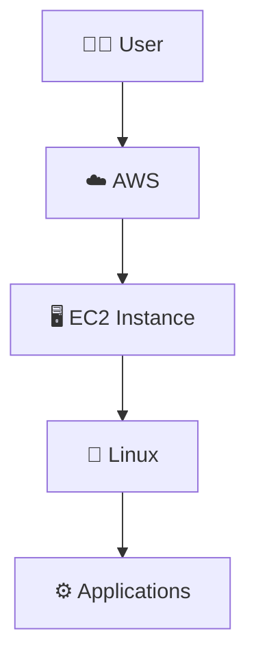

---

## 🔌 API

An API allows one system or application to communicate with another service.

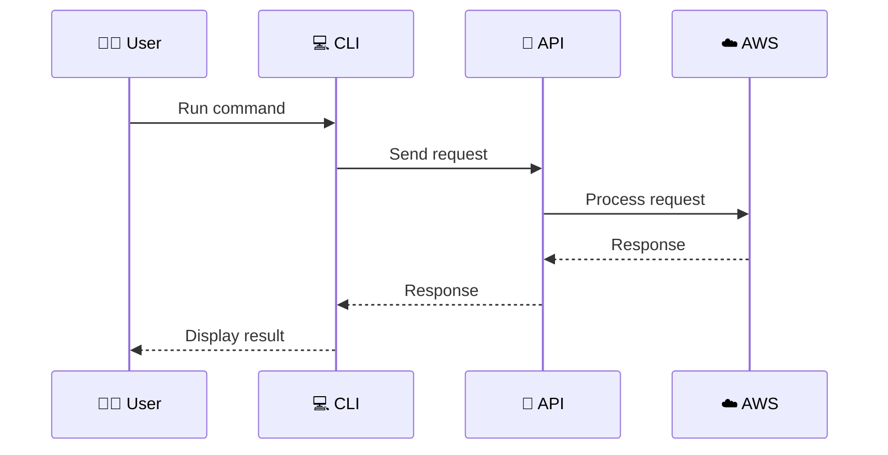

---

# 🟠 DAY 04 — LINUX, AWS CLI & INFRASTRUCTURE

## 🐧 Operating System

### Concepts Covered

- Operating System
- Kernel
- System Libraries
- Compiler
- Shell
- Hardware
- Applications

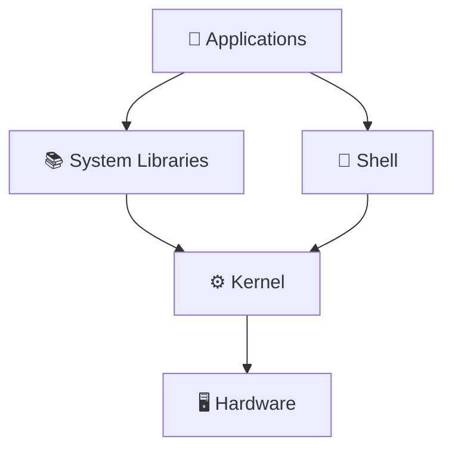

---

## ⚙️ Kernel

The kernel is the core part of the operating system.

### It manages

- CPU
- Memory
- Processes
- Storage
- Devices
- Networking

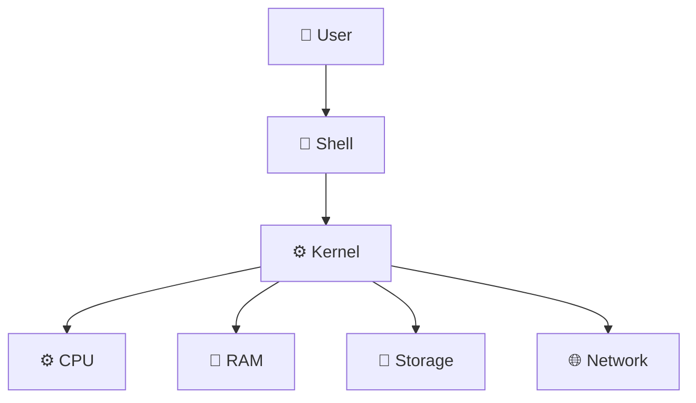

---

## 📚 System Libraries

System libraries provide functions that applications can use to communicate with the operating system.

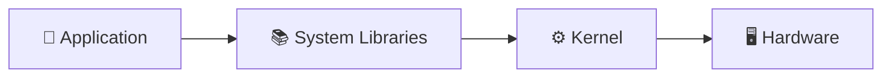

---

## 🔨 Compiler

A compiler converts source code into a form that can be executed by the computer.

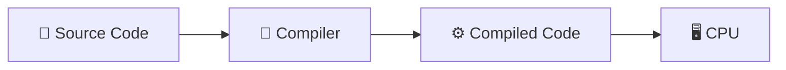

---

## 🐚 Shell

A shell provides an interface between the user and the operating system.

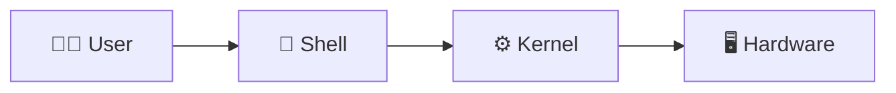

---

## ☁️ AWS CLI

AWS CLI allows AWS services to be managed from the command line.

```bash
aws ec2 describe-instances
```

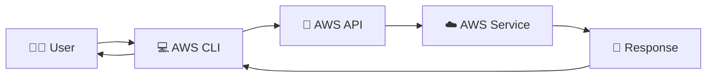

---

## 🏗️ Infrastructure as Code

### Concepts Introduced

- Infrastructure as Code
- CloudFormation
- AWS CDK
- Terraform
- Automation
- Infrastructure management

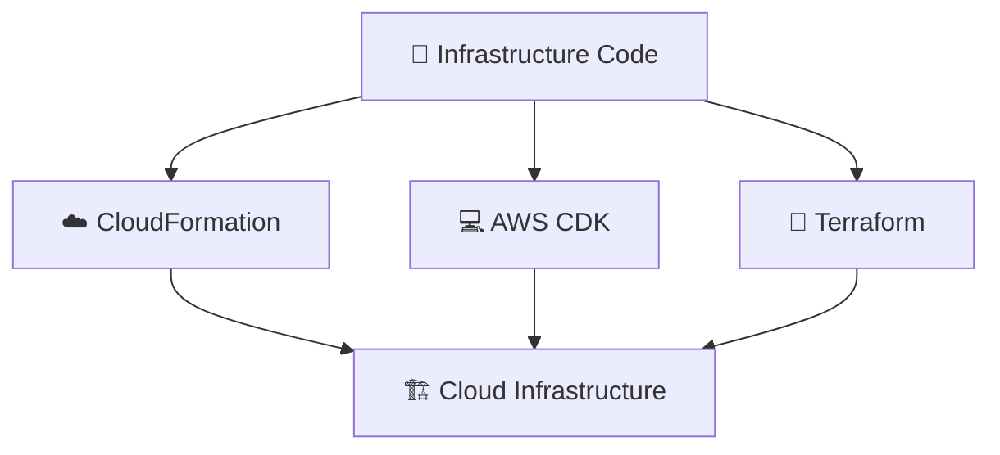

---

## 🔐 EC2 Key Pair

A key pair is used to securely connect to an EC2 instance.

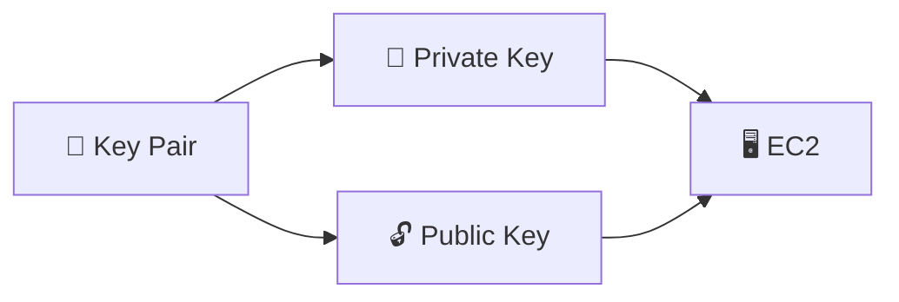

---

# 🟡 DAY 05 — SHELL SCRIPTING, LINUX MONITORING & GIT

## 🐚 Shell Scripting

Shell scripting allows multiple commands to be written and executed as a script.

```bash
#!/bin/bash

echo "Hello DevOps"
```

---

## 📜 Shell Script Flow

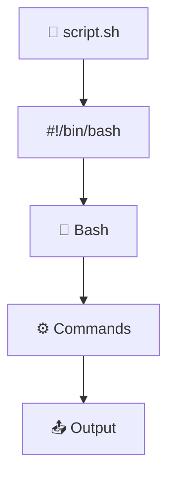

---

## 🆚 SH vs BASH

### `/bin/sh`

A standard shell interface.

### `/bin/bash`

Bash shell with additional features.

### Shebang

```bash
#!/bin/sh
```

or

```bash
#!/bin/bash
```

The shebang tells the system which interpreter should execute the script.

---

## 📝 Vim

Used to create and edit files from the terminal.

```bash
vim calculator.sh
```

### Save and Exit Vim

```text
ESC
:wq
ENTER
```

---

## 🔐 File Permissions

```bash
chmod +x script.sh
```

This gives execute permission to the script.

---

## 🐛 Shell Debugging

### `set -x`

Shows commands while they execute.

```bash
set -x
```

### `set -e`

Stops the script when a command fails.

```bash
set -e
```

### `set -o`

Shows shell options.

```bash
set -o
```

---

## 🔎 grep

`grep` is used to search for text.

```bash
ps -ef | grep amazon
```

---

## 🔗 Pipe

The pipe `|` sends the output of one command to another command.

```bash
command1 | command2
```

Example:

```bash
ps -ef | grep amazon
```

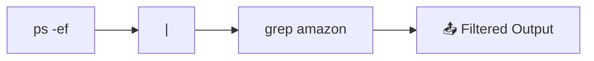

---

## 📊 Linux Monitoring

### Commands Learned

```bash
top
```

Monitor running processes and resource usage.

```bash
df -h
```

Check disk usage.

```bash
free -h
```

Check memory usage.

```bash
ps -ef
```

View running processes.

```mermaid
flowchart TD
    SERVER["🖥️ Linux Server"]

    CPU["⚙️ CPU"]
    RAM["🧠 Memory"]
    DISK["💾 Disk"]
    PROCESS["⚙️ Processes"]

    MONITOR["📊 Monitoring Commands"]

    SERVER --> CPU
    SERVER --> RAM
    SERVER --> DISK
    SERVER --> PROCESS

    CPU --> MONITOR
    RAM --> MONITOR
    DISK --> MONITOR
    PROCESS --> MONITOR
```

---

# 🌿 Git Branching

A Git branch allows development to happen separately without directly changing the main branch.

### Concepts Covered

- Branch
- Main branch
- Feature branch
- Release branch
- Hotfix branch
- GitFlow
- Merging

```mermaid
gitGraph
    commit id: "Initial Commit"
    branch feature
    checkout feature
    commit id: "Feature Work"
    checkout main
    merge feature
    commit id: "Feature Merged"
```

---

## 🔥 GitFlow

```mermaid
gitGraph
    commit id: "Initial"
    branch feature
    checkout feature
    commit id: "Feature"
    checkout main
    merge feature
    branch release
    checkout release
    commit id: "Release Testing"
    checkout main
    merge release
    branch hotfix
    checkout hotfix
    commit id: "Critical Fix"
    checkout main
    merge hotfix
```

### Branch Roles

| Branch | Purpose |
|---|---|
| 🌳 `main` | Production-ready code |
| 🚀 `feature` | New feature development |
| 📦 `release` | Release preparation |
| 🔥 `hotfix` | Critical production fixes |

---

# 🔴 DAY 06 — GIT, GITHUB, REMOTE, CLONE, FORK & SSH

## 🌳 Git Repository

A Git repository stores project files and Git history.

Initialize a repository:

```bash
git init
```

This creates:

```text
.git/
```

---

## 📁 `.git` Directory

The `.git` directory contains Git's internal repository information and history.

```mermaid
flowchart TD
    PROJECT["📁 Project"]
    GIT["📁 .git"]

    PROJECT --> GIT

    GIT --> HISTORY["📜 History"]
    GIT --> BRANCH["🌿 Branch Information"]
    GIT --> CONFIG["⚙️ Repository Configuration"]
```

---

## 🔄 Git Workflow

```mermaid
flowchart LR
    WORK["📁 Working Directory"]
    STAGE["📦 Staging Area"]
    REPO["🗃️ Git Repository"]

    WORK -->|"git add"| STAGE
    STAGE -->|"git commit"| REPO
```

---

## 📊 `git status`

```bash
git status
```

Shows:

- Current branch
- Modified files
- Untracked files
- Staged files
- Changes ready to commit

---

## ➕ `git add`

Add one file:

```bash
git add calculator.sh
```

Add everything:

```bash
git add .
```

```mermaid
flowchart LR
    FILE["📄 Modified File"]
    STAGE["📦 Staging Area"]

    FILE -->|"git add"| STAGE
```

---

## 💾 `git commit`

```bash
git commit -m "Add calculator script"
```

A commit saves changes into Git history.

```mermaid
flowchart LR
    STAGE["📦 Staging Area"]
    COMMIT["💾 Commit"]
    HISTORY["📜 Git History"]

    STAGE --> COMMIT
    COMMIT --> HISTORY
```

---

## 📜 `git log`

```bash
git log
```

Shows commit history.

```mermaid
flowchart LR
    C1["Commit 1"]
    C2["Commit 2"]
    C3["Commit 3"]
    C4["Commit 4"]

    C1 --> C2 --> C3 --> C4
```

---

## 🌐 Git Remote

A remote connects the local Git repository to a repository hosted somewhere else, such as GitHub.

### Add Remote

```bash
git remote add origin <repository-url>
```

### Check Remote

```bash
git remote -v
```

---

## 🔗 Local → Remote

```mermaid
flowchart LR
    LOCAL["💻 Local Repository"]
    REMOTE["☁️ GitHub Repository"]

    LOCAL -->|"git push"| REMOTE
    REMOTE -->|"git pull"| LOCAL
    REMOTE -->|"git fetch"| LOCAL
```

---

## 🚀 `git push`

```bash
git push
```

Uploads local commits to the remote repository.

```mermaid
flowchart LR
    LOCAL["💻 Local Git"]
    PUSH["🚀 git push"]
    GITHUB["🐙 GitHub"]

    LOCAL --> PUSH --> GITHUB
```

---

## 📥 `git fetch`

```bash
git fetch
```

Downloads information about changes from the remote repository without directly merging those changes into the current branch.

```mermaid
flowchart LR
    GITHUB["🐙 GitHub"]
    FETCH["📥 git fetch"]
    LOCAL["💻 Local Repository"]

    GITHUB --> FETCH --> LOCAL
```

---

## 🔄 `git pull`

```bash
git pull
```

Gets remote changes and integrates them into the current local branch.

```mermaid
flowchart LR
    GITHUB["🐙 GitHub"]
    PULL["🔄 git pull"]
    LOCAL["💻 Local Branch"]

    GITHUB --> PULL --> LOCAL
```

---

## 📦 `git clone`

`git clone` downloads an existing repository from GitHub to the local machine.

```bash
git clone <repository-url>
```

```mermaid
flowchart LR
    GITHUB["🐙 GitHub Repository"]
    CLONE["📦 git clone"]
    LOCAL["💻 Local Machine"]

    GITHUB --> CLONE --> LOCAL
```

---

## 🍴 Git Fork

A fork creates your own copy of another GitHub repository under your GitHub account.

```mermaid
flowchart LR
    ORIGINAL["🐙 Original Repository"]
    FORK["🍴 Fork"]
    YOUR["🐙 Your GitHub Repository"]
    CLONE["📦 Clone"]
    LOCAL["💻 Local Machine"]

    ORIGINAL --> FORK
    FORK --> YOUR
    YOUR --> CLONE
    CLONE --> LOCAL
```

---

## 🆚 Clone vs Fork

| 📦 Clone | 🍴 Fork |
|---|---|
| Copies repository to local machine | Creates a copy on GitHub |
| Local operation | GitHub operation |
| Used to work locally | Useful for contributing |
| `git clone` | GitHub Fork |

---

# 🔐 SSH AUTHENTICATION

SSH allows secure authentication between a machine and GitHub.

### Concepts Covered

- SSH
- SSH Key Pair
- Public Key
- Private Key
- `ssh-keygen`
- `~/.ssh`
- Public Key Configuration
- GitHub Authentication
- EC2 → GitHub Authentication

---

## 🔑 SSH Key Generation

```bash
ssh-keygen
```

Check generated keys:

```bash
ls -al ~/.ssh
```

View public key:

```bash
cat ~/.ssh/id_ed25519.pub
```

---

## 🔐 SSH Architecture

```mermaid
flowchart LR
    EC2["🖥️ EC2 Server"]

    PRIVATE["🔐 Private Key<br/>Stays on EC2"]
    PUBLIC["🔓 Public Key<br/>Added to GitHub"]

    GITHUB["🐙 GitHub"]

    EC2 --> PRIVATE
    EC2 --> PUBLIC
    PUBLIC --> GITHUB

    PRIVATE -.->|"Authentication"| GITHUB
```

> 🔐 **Private Key stays private.**  
> 🔓 **Public Key can be added to GitHub.**

---

## 🧪 Test SSH Connection

```bash
ssh -T git@github.com
```

This tests whether SSH authentication with GitHub is working.

---

# 🔄 COMPLETE SSH + GITHUB FLOW

```mermaid
sequenceDiagram
    participant E as 🖥️ EC2
    participant K as 🔑 SSH Keys
    participant G as 🐙 GitHub

    E->>K: ssh-keygen
    K-->>E: Public + Private Key
    E->>G: Add Public Key
    E->>G: SSH Connection
    G->>E: Authenticate
    E->>G: Git Operations
```

---

# 🚀 COMPLETE GIT + GITHUB WORKFLOW

```mermaid
flowchart TD
    CREATE["📁 Create Project"]
    INIT["git init"]
    FILE["📄 Create / Modify Files"]
    STATUS["git status"]
    ADD["git add"]
    COMMIT["git commit"]
    REMOTE["git remote add origin"]
    PUSH["git push"]
    GITHUB["🐙 GitHub"]

    CREATE --> INIT
    INIT --> FILE
    FILE --> STATUS
    STATUS --> ADD
    ADD --> COMMIT
    COMMIT --> REMOTE
    REMOTE --> PUSH
    PUSH --> GITHUB
```

---

# 🌐 COMPLETE GITHUB COLLABORATION FLOW

```mermaid
flowchart LR
    DEV1["👨‍💻 Developer"]
    LOCAL["💻 Local Repository"]
    GITHUB["🐙 GitHub"]
    DEV2["👩‍💻 Other Developer"]

    DEV1 --> LOCAL
    LOCAL -->|"git push"| GITHUB
    GITHUB -->|"git clone / pull"| DEV2
    DEV2 -->|"git push"| GITHUB
    GITHUB -->|"git fetch / pull"| LOCAL
```

---

# ☁️ COMPLETE DEVOPS FLOW — DAY 01 → DAY 06

```mermaid
flowchart TD
    DEVOPS["☁️ DEVOPS"]

    D1["🟢 Day 01<br/>DevOps Fundamentals"]
    D2["🔵 Day 02<br/>SDLC • HLD • LLD"]
    D3["🟣 Day 03<br/>Servers • Virtualization • Cloud"]
    D4["🟠 Day 04<br/>Linux • AWS • IaC"]
    D5["🟡 Day 05<br/>Shell • Monitoring • Git"]
    D6["🔴 Day 06<br/>GitHub • Remote • SSH"]

    DEVOPS --> D1
    D1 --> D2
    D2 --> D3
    D3 --> D4
    D4 --> D5
    D5 --> D6
```

---

# 🧠 COMPLETE CONCEPT MAP

```mermaid
mindmap
    root((☁️ DevOps Cloud Journey))

        🟢 Day 01
            DevOps
            Automation
            Reliability
            Collaboration
            Monitoring
            Feedback
            Continuous Improvement

        🔵 Day 02
            SDLC
            SRS
            HLD
            LLD
            Planning
            Design
            Development
            Testing
            Deployment

        🟣 Day 03
            Servers
            Virtualization
            Virtual Machines
            Hypervisor
            Logical Isolation
            Cloud
            AWS EC2
            APIs

        🟠 Day 04
            Linux
            Operating System
            Kernel
            System Libraries
            Compiler
            Shell
            AWS CLI
            Infrastructure as Code
            CloudFormation
            AWS CDK
            Terraform
            EC2 Key Pair

        🟡 Day 05
            Shell Scripting
            Bash
            SH vs Bash
            Vim
            File Permissions
            set -x
            set -e
            set -o
            grep
            Pipes
            Linux Monitoring
            top
            df
            free
            ps
            Git Branching
            GitFlow
            Feature Branch
            Release Branch
            Hotfix Branch

        🔴 Day 06
            Git Repository
            .git
            Working Directory
            Staging Area
            git status
            git add
            git commit
            git log
            Git Remote
            git push
            git pull
            git fetch
            git clone
            Git Fork
            SSH
            SSH Key Pair
            Public Key
            Private Key
            GitHub Authentication
```

---

# 📚 WHAT I HAVE BUILT SO FAR

| 🗓️ Day | 📚 Main Focus | 🛠️ Hands-On |
|:---:|---|---|
| 🟢 **01** | DevOps Fundamentals | DevOps lifecycle & workflow |
| 🔵 **02** | SDLC • HLD • LLD | System design concepts |
| 🟣 **03** | Servers • Virtualization • Cloud | AWS EC2 & API concepts |
| 🟠 **04** | Linux • AWS CLI • IaC | Linux commands & AWS CLI |
| 🟡 **05** | Shell • Monitoring • Git | Bash scripts, monitoring & branches |
| 🔴 **06** | GitHub • Remote • SSH | GitHub workflows & SSH authentication |

---

# 🎯 KEY TAKEAWAYS

### 🟢 Day 01

> DevOps is not just a tool. It is a culture of collaboration, automation and continuous improvement.

### 🔵 Day 02

> SDLC explains the software development process, while HLD and LLD explain the system at different levels of detail.

### 🟣 Day 03

> Virtualization allows multiple isolated virtual environments to run on shared physical hardware.

### 🟠 Day 04

> Linux, AWS CLI and Infrastructure as Code are important foundations for working with modern cloud infrastructure.

### 🟡 Day 05

> Shell scripting helps automate repetitive tasks, while monitoring and Git help manage systems and code efficiently.

### 🔴 Day 06

> Git manages version history, GitHub hosts repositories, and SSH provides secure authentication.

---

# 🚀 WHAT'S NEXT?

The journey doesn't stop at Day 06.

The next steps will take me deeper into:

```text
🐳 Docker
   ↓
☁️ AWS
   ↓
🔄 CI/CD
   ↓
🏗️ Terraform
   ↓
☸️ Kubernetes
   ↓
📊 Monitoring
   ↓
🔐 Security
   ↓
🤖 DevOps Automation
   ↓
🚀 Real-World Projects
```

---

# 🧠 MY LEARNING PHILOSOPHY

I don't want to just memorize commands.

I want to understand:

```text
❓ What does it do?
      ↓
❓ Why do we use it?
      ↓
💻 How do I use it?
      ↓
🐛 What happens when it fails?
      ↓
🔍 How do I troubleshoot it?
      ↓
🧠 What did I learn?
      ↓
📝 Document it
```

> **Learn → Practice → Break → Fix → Understand → Document → Repeat 🔁**

---

# 📖 DOCUMENTATION APPROACH

My learning happens throughout the week.

My documentation happens mainly on weekends.

### 🧠 Monday – Friday

- Learn new concepts
- Practice commands
- Work on hands-on labs
- Build projects
- Experiment with tools
- Debug problems
- Understand how things work

### 📝 Saturday – Sunday

- Review what I learned
- Organize my notes
- Document my experiments
- Write technical blogs
- Update README files
- Push my progress to GitHub

> **Weekdays → Learn • Practice • Build**  
> **Weekends → Document • Organize • Publish**

---


<div align="center">

# 🚀 THE JOURNEY CONTINUES

### Learn → Build → Break → Fix → Automate → Document → Repeat 🔁

<br>

☁️ 🐧 🔀 🐳 ☸️ 🏗️ 🔄 📊 🔐 🚀

<br>

**DAY 01 → DAY 06 COMPLETE ✅**

<br>

<i>Still learning. Still building. Still improving.</i>

<br>

### ☁️ From Zero to DevOps Engineer 🚀

</div>
